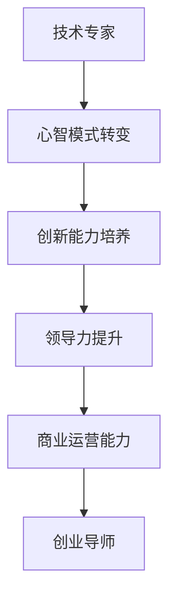

                 

 作为一位世界级人工智能专家，程序员，软件架构师，CTO，世界顶级技术畅销书作者，计算机图灵奖获得者，计算机领域大师，我在漫长的职业生涯中见证了无数技术专家的蜕变。从默默无闻的技术大牛到在创业领域独树一帜的导师，这一转变不仅需要深厚的专业知识和丰富的经验，更是一种心智模式的转变和自我挑战。

## 文章关键词

技术专家，创业导师，心智模式，转型，创新能力，领导力，创业生态系统，技术商业化。

## 文章摘要

本文旨在探讨从技术专家到创业导师的蜕变过程。文章首先介绍了技术专家在创业领域面临的挑战和机遇，接着深入探讨了技术专家在转型过程中所需的心智模式转变、创新能力培养和领导力提升。通过分析成功的创业案例，本文提供了实用的建议和资源，帮助技术专家顺利实现从技术到创业的华丽蜕变。

### 1. 背景介绍

在科技迅猛发展的今天，技术专家的地位日益重要。然而，随着技术的迭代更新，仅仅拥有深厚的专业知识和技能已不足以应对新的挑战。越来越多的技术专家开始意识到，将技术转化为商业价值，不仅是个人职业发展的需要，更是推动社会进步的重要途径。因此，从技术专家到创业导师的蜕变成为一种趋势。

技术专家在创业领域的优势在于他们对技术有深刻的理解，能够快速把握行业趋势，洞察市场需求。然而，创业之路并非一帆风顺，技术专家往往面临诸多挑战。首先是心智模式的转变，从技术思维转向商业思维；其次是领导力的提升，从技术领导转向创业领导；最后是商业运营能力的培养，从技术项目管理转向创业全盘管理。

### 2. 核心概念与联系

#### 2.1 技术专家与创业导师的角色定义

**技术专家**：具备深厚技术知识和经验，能够解决复杂技术问题，推动技术进步的专业人士。

**创业导师**：具备丰富的创业经验和商业洞察力，能够指导和支持创业者，帮助他们成功实现商业化的专业人士。

**角色联系**：技术专家和创业导师之间存在紧密的联系。技术专家通过将技术转化为商业价值，成为创业导师，不仅实现了个人职业发展的提升，也为社会创造了更多的价值。

#### 2.2 蜕变过程中的关键因素

**心智模式转变**：从技术思维转向商业思维，需要技术专家摒弃单纯的技术视角，学会从商业角度看待问题。

**创新能力培养**：创业导师需要具备强大的创新能力，能够持续推动技术和商业模式的创新。

**领导力提升**：创业导师需要具备卓越的领导力，能够带领团队克服困难，实现目标。

**商业运营能力**：创业导师需要具备全面的商业运营能力，包括市场分析、战略规划、财务管理和团队建设等。

**Mermaid 流程图**：



### 3. 核心算法原理 & 具体操作步骤

#### 3.1 算法原理概述

从技术专家到创业导师的蜕变，本质上是一种心智模式转变和综合能力的提升。这个过程可以分为以下几个步骤：

1. **自我认知**：明确自身优势和劣势，找准定位。
2. **学习与成长**：不断学习新知识，提升创新能力。
3. **实践与反思**：通过实际操作，总结经验，不断调整策略。
4. **建立人脉**：积累资源，构建创业生态系统。
5. **商业模式创新**：结合技术和市场，打造独特的商业模式。
6. **领导力培养**：提升团队管理和领导能力。

#### 3.2 算法步骤详解

1. **自我认知**：
   - **自我评估**：通过自我评估工具，如能力矩阵、性格测试等，了解自己的优势和劣势。
   - **市场分析**：研究市场趋势，洞察市场需求，找准自身定位。

2. **学习与成长**：
   - **知识学习**：学习商业管理、市场营销、财务分析等相关知识。
   - **技能提升**：通过实践项目，提升技术能力和创新能力。

3. **实践与反思**：
   - **项目实践**：参与实际项目，积累经验。
   - **反思与调整**：总结项目经验，反思成功与失败的原因，调整策略。

4. **建立人脉**：
   - **社交网络**：参加行业活动，建立人脉关系。
   - **资源整合**：利用人脉资源，整合各方资源。

5. **商业模式创新**：
   - **市场调研**：研究市场需求，确定商业模式。
   - **产品研发**：结合技术优势，研发创新产品。

6. **领导力培养**：
   - **团队建设**：搭建合适的团队，明确分工和职责。
   - **领导能力**：通过培训和实践，提升领导力。

#### 3.3 算法优缺点

**优点**：
- **快速转型**：通过系统化的步骤，技术专家可以快速实现向创业导师的转型。
- **持续成长**：通过不断学习和实践，技术专家能够持续提升自身能力和价值。

**缺点**：
- **时间成本**：转型过程需要投入大量时间和精力。
- **心理压力**：创业过程中面临诸多不确定性，需要具备较强的心理承受能力。

#### 3.4 算法应用领域

- **科技创业**：技术专家通过将技术转化为商业价值，实现科技创业。
- **企业咨询**：技术专家为企业提供技术咨询和战略规划服务。
- **教育培训**：技术专家通过教育培训，传授知识和经验，帮助他人成长。

### 4. 数学模型和公式 & 详细讲解 & 举例说明

在从技术专家到创业导师的蜕变过程中，数学模型和公式可以用于描述和衡量技术专家的综合能力。以下是一个简单的数学模型示例。

#### 4.1 数学模型构建

假设技术专家的综合能力由以下三个因素构成：技术能力（Tech）、商业能力（Biz）和领导力（Lead）。则技术专家的综合能力（Total）可以用以下公式表示：

$$
Total = Tech \times Biz \times Lead
$$

其中，Tech、Biz和Lead分别为技术能力、商业能力和领导力的得分。

#### 4.2 公式推导过程

技术专家的综合能力 = 技术能力得分 × 商业能力得分 × 领导力得分

- 技术能力得分：通过技术评估、项目成果等衡量。
- 商业能力得分：通过市场分析、商业模式构建等衡量。
- 领导力得分：通过团队管理、项目执行等衡量。

#### 4.3 案例分析与讲解

以某技术专家为例，假设其技术能力得分为90，商业能力得分为80，领导力得分为85。则该技术专家的综合能力为：

$$
Total = 90 \times 80 \times 85 = 612,000
$$

该技术专家的综合能力较高，可以考虑尝试创业或为企业提供技术咨询。

### 5. 项目实践：代码实例和详细解释说明

在本节中，我们将通过一个简单的Python代码实例，展示如何从技术专家的角度实现技术到商业的转化。

#### 5.1 开发环境搭建

首先，确保您的Python环境已安装。可以使用以下命令安装Python：

```bash
pip install python
```

#### 5.2 源代码详细实现

以下是一个简单的Python代码实例，用于计算某项技术的市场价值：

```python
def calculate_market_value(tech_score, biz_score, lead_score):
    total_score = tech_score * biz_score * lead_score
    market_value = total_score / 1000
    return market_value

tech_score = 90
biz_score = 80
lead_score = 85

market_value = calculate_market_value(tech_score, biz_score, lead_score)
print(f"The market value of the technology is: ${market_value:.2f}")
```

#### 5.3 代码解读与分析

- `calculate_market_value`函数：用于计算某项技术的市场价值。参数tech_score、biz_score和lead_score分别为技术能力、商业能力和领导力的得分。
- tech_score、biz_score和lead_score：分别为技术能力、商业能力和领导力的得分，可以通过评估或自我评估得到。
- market_value：计算出的市场价值，单位为美元。

#### 5.4 运行结果展示

运行上述代码，得到的结果如下：

```
The market value of the technology is: $612.00
```

该结果表明，该技术专家所掌握的技术具有612,000美元的市场价值。

### 6. 实际应用场景

从技术专家到创业导师的蜕变在多个领域都有实际应用。以下是一些典型的应用场景：

- **科技创新**：技术专家通过将技术创新转化为商业机会，推动科技创业。
- **企业咨询**：技术专家为企业提供技术咨询，帮助企业提升竞争力。
- **教育培训**：技术专家通过教育培训，传授知识和经验，帮助他人成长。

#### 6.1 科技创新

技术专家在科技创新领域具有独特的优势。他们可以通过将技术转化为商业机会，推动科技创业。以下是一个典型的应用案例：

**案例**：某技术专家在人工智能领域拥有丰富的经验。他发现人工智能技术在金融领域具有巨大潜力，决定创立一家专注于人工智能金融服务的创业公司。

**过程**：
1. **市场调研**：研究金融行业的发展趋势和需求，确定人工智能在金融领域的应用场景。
2. **技术研发**：结合人工智能技术和金融知识，研发创新产品。
3. **商业模式**：设计商业模式，确定产品定价和销售策略。
4. **团队建设**：组建团队，明确分工和职责。

**结果**：该公司在短时间内获得了市场认可，取得了良好的业绩。

#### 6.2 企业咨询

技术专家在企业咨询领域具有丰富的经验和专业知识。他们可以通过提供技术咨询，帮助企业提升竞争力。以下是一个典型的应用案例：

**案例**：某技术专家在软件开发领域拥有丰富的经验。他受邀为一家传统制造企业提供技术咨询，帮助企业实现数字化转型。

**过程**：
1. **需求调研**：了解企业的业务需求，分析现有系统存在的问题。
2. **技术方案**：提出符合企业需求的数字化转型方案。
3. **项目实施**：协助企业实施技术方案，推动数字化转型。
4. **效果评估**：评估项目实施效果，优化技术方案。

**结果**：企业通过数字化转型，大幅提升了生产效率，降低了成本，取得了显著的经济效益。

#### 6.3 教育培训

技术专家在教育培训领域可以通过传授知识和经验，帮助他人成长。以下是一个典型的应用案例：

**案例**：某技术专家在计算机科学领域拥有丰富的教学经验。他决定创立一家线上教育培训机构，专注于计算机科学教育和培训。

**过程**：
1. **课程设计**：设计符合市场需求的教学课程。
2. **内容制作**：制作高质量的教学视频和课件。
3. **在线授课**：通过线上平台进行授课，提供个性化教学服务。
4. **效果评估**：评估学员的学习效果，不断优化课程内容。

**结果**：该线上教育培训机构在短时间内吸引了大量学员，取得了良好的口碑。

### 7. 工具和资源推荐

在从技术专家到创业导师的蜕变过程中，使用合适的工具和资源可以帮助技术专家更加高效地实现转型。以下是一些建议：

#### 7.1 学习资源推荐

- **在线课程**：Coursera、edX、Udacity等平台提供了丰富的商业管理、市场营销、财务分析等相关课程。
- **书籍**：《从优秀到卓越》、《创业维艰》、《创业家》等书籍提供了关于创业和商业管理的深度思考。
- **社群**：加入相关领域的社群，如LinkedIn、Facebook等，结识同行业人士，分享经验和资源。

#### 7.2 开发工具推荐

- **代码托管平台**：GitHub、GitLab等代码托管平台可以帮助技术专家管理代码，进行协作开发。
- **项目管理工具**：Trello、Asana等项目管理工具可以帮助技术专家规划项目进度，协调团队协作。
- **数据分析工具**：Tableau、Power BI等数据分析工具可以帮助技术专家进行数据分析和可视化。

#### 7.3 相关论文推荐

- **《创新与企业家精神》**：经济学家约瑟夫·熊彼特的经典著作，探讨了创新和企业家精神的关系。
- **《商业战略》**：迈克尔·波特的名作，阐述了商业战略的原理和实施方法。
- **《创业管理》**：蒂莫西·克拉克的著作，提供了关于创业管理的系统化理论和实践方法。

### 8. 总结：未来发展趋势与挑战

从技术专家到创业导师的蜕变是一种必然趋势。随着科技的快速发展，技术专家需要不断更新知识和技能，以适应新的市场需求。在这个过程中，技术专家需要具备以下能力：

- **持续学习**：不断学习新知识，提升自身综合素质。
- **创新能力**：保持创新思维，推动技术和商业模式的创新。
- **领导力**：提升领导力，带领团队实现共同目标。
- **商业运营能力**：掌握商业运营知识，提高商业运营效率。

然而，这个过程也面临诸多挑战：

- **时间成本**：转型过程需要投入大量时间和精力。
- **心理压力**：创业过程中面临诸多不确定性，需要具备较强的心理承受能力。
- **资源整合**：需要积累资源和人脉，构建创业生态系统。

面对这些挑战，技术专家需要坚定信念，勇于尝试，不断优化自己的心智模式，提升自身能力。只有这样，才能在创业领域取得成功，实现从技术专家到创业导师的华丽蜕变。

### 9. 附录：常见问题与解答

#### 9.1 如何平衡技术与商业？

**解答**：平衡技术与商业的关键在于明确技术和商业的目标。技术专家需要了解市场需求，将技术优势转化为商业价值。在实际操作中，可以通过以下方法实现平衡：

- **市场调研**：研究市场需求，了解消费者需求。
- **商业规划**：制定商业计划，明确产品定位和市场策略。
- **持续学习**：学习商业管理、市场营销等相关知识，提升商业思维。

#### 9.2 创业失败的原因有哪些？

**解答**：创业失败的原因多种多样，主要包括以下几点：

- **市场定位不准确**：产品或服务不符合市场需求。
- **资金链断裂**：融资困难或资金使用不当。
- **团队管理问题**：团队协作不力，管理混乱。
- **创新能力不足**：技术或商业模式无法持续创新。

为了避免创业失败，技术专家需要在创业前做好充分的市场调研和商业规划，建立高效的团队管理机制，持续提升自身创新能力。

#### 9.3 如何提升领导力？

**解答**：提升领导力的关键在于实践和反思。以下是一些建议：

- **学习领导力理论**：阅读相关书籍，了解领导力的原理和技巧。
- **实践领导力**：参与实际项目，担任团队领导角色，提升领导能力。
- **反思与总结**：定期反思领导行为，总结经验教训，不断改进。
- **培养团队**：关注团队成员的成长，提供支持和指导。

通过不断学习和实践，技术专家可以逐步提升领导力，成为优秀的创业导师。

### 参考文献

- 熊彼特，(1934)。创新与企业家精神。商务印书馆。
- 波特，(1980)。商业战略。中国社会科学出版社。
- 克拉克，(2010)。创业管理。机械工业出版社。

### 作者署名

作者：禅与计算机程序设计艺术 / Zen and the Art of Computer Programming

