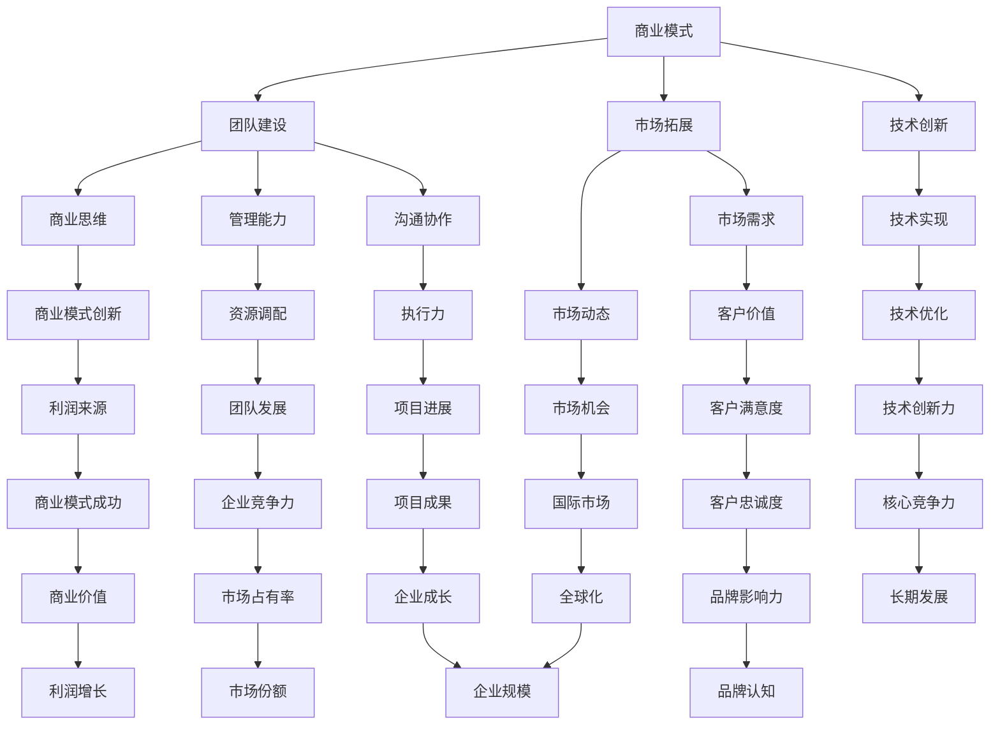

                 

关键词：科技创业、技术专家、转型、商业策略、团队建设、技术创新、市场拓展、风险投资

## 摘要

本文旨在探讨从技术专家向科技创业者的转型之路。通过对科技创业者的角色分析、转型过程中的挑战与机遇、核心能力建设以及成功案例分析，为有志于转型的技术专家提供一套实用指南。文章结构分为以下几部分：背景介绍、核心概念与联系、核心算法原理与具体操作步骤、数学模型和公式、项目实践、实际应用场景、工具和资源推荐、总结与展望、常见问题与解答。

## 1. 背景介绍

在当今技术驱动的世界中，科技创业已成为一种趋势。越来越多的技术专家不仅满足于在学术领域或大公司内部工作，而是希望通过创业实现自己的技术创新和市场价值。然而，从技术专家向科技创业者的转型并非易事，它涉及商业思维、团队建设、市场拓展等多方面能力的提升。

### 1.1 科技创业的重要性

科技创业不仅对个人职业发展具有重大意义，也对社会经济发展具有深远影响。通过创业，技术专家可以将自己的科研成果转化为实际应用，推动科技进步和社会创新。同时，科技创业也为企业提供了源源不断的技术创新动力，促进了产业升级和经济增长。

### 1.2 技术专家的转型挑战

技术专家转型为科技创业者面临着诸多挑战。首先，商业思维和技术思维的差异是一个重要问题。技术专家往往更注重技术实现和性能优化，而忽视商业模式的创新和市场需求的挖掘。其次，团队建设和管理能力也是技术专家转型过程中的短板。许多技术专家在创业初期缺乏有效的团队管理和资源调配能力，导致项目进展受阻。最后，市场拓展和风险投资也是技术专家需要面对的挑战。如何准确把握市场动态、找到目标客户群体，以及获得风险投资的青睐，都是技术专家转型过程中需要克服的难题。

## 2. 核心概念与联系

在探讨技术专家转型为科技创业者的过程中，我们需要了解一些核心概念，如商业模式、团队建设、市场拓展等，并分析这些概念之间的联系。

### 2.1 商业模式

商业模式是指企业通过什么方式创造、传递和捕获价值。对于科技创业者来说，商业模式是项目成功的基石。一个成功的商业模式不仅要实现技术上的创新，还要满足市场需求，创造可持续的利润来源。例如，以客户为中心的商业模式、平台化商业模式、订阅制商业模式等，都是科技创业者可以探索的方向。

### 2.2 团队建设

团队建设是科技创业者成功的关键因素之一。一个高效的团队需要具备多样性的技能、丰富的经验和良好的沟通协作能力。科技创业者需要通过招聘、培训和激励机制，打造一支能够共同推进项目发展的核心团队。此外，团队建设还包括团队文化的塑造，如鼓励创新、强调执行力、建立信任等。

### 2.3 市场拓展

市场拓展是科技创业者实现商业价值的重要手段。通过市场调研、产品定位、营销策略等手段，科技创业者可以找到目标客户群体，扩大市场份额。市场拓展不仅包括国内市场，还应关注国际市场的机会。例如，通过跨境电商、海外市场调研、国际展会等途径，科技创业者可以拓展国际市场。

### 2.4 联系与整合

商业模式、团队建设和市场拓展是相互联系、相互促进的。商业模式决定了企业如何创造和传递价值，团队建设是实现商业模式的保障，而市场拓展则是商业模式价值的实现途径。科技创业者需要将这三个方面有机结合，形成一个协调统一的整体，才能在竞争激烈的市场中脱颖而出。

### 2.5 Mermaid 流程图

以下是一个简化的 Mermaid 流程图，展示技术专家转型为科技创业者的核心概念及其联系：



## 3. 核心算法原理 & 具体操作步骤

### 3.1 算法原理概述

在科技创业过程中，技术专家需要掌握一系列核心算法原理，以解决实际问题。以下是一些常见的核心算法原理：

1. **机器学习算法**：通过训练模型来从数据中自动发现规律，包括监督学习、无监督学习和强化学习。
2. **推荐系统算法**：根据用户行为和历史数据，为用户推荐相关产品或服务。
3. **大数据处理算法**：对大量数据进行高效处理和分析，如MapReduce、Spark等。
4. **区块链算法**：实现去中心化数据存储和交易，如比特币的SHA-256算法。

### 3.2 算法步骤详解

#### 3.2.1 机器学习算法

1. **数据收集**：收集大量数据，确保数据的质量和多样性。
2. **数据预处理**：对数据进行清洗、归一化、特征提取等处理。
3. **模型选择**：根据问题类型和数据特点，选择合适的模型，如线性回归、决策树、神经网络等。
4. **模型训练**：使用训练数据对模型进行训练，调整参数以优化模型性能。
5. **模型评估**：使用验证数据集评估模型性能，如准确率、召回率、F1值等。
6. **模型部署**：将训练好的模型部署到生产环境，进行实际应用。

#### 3.2.2 推荐系统算法

1. **用户行为分析**：收集用户在系统中的行为数据，如浏览、购买、搜索等。
2. **数据预处理**：对用户行为数据进行清洗、归一化、特征提取等处理。
3. **算法选择**：选择合适的推荐算法，如基于协同过滤、基于内容的推荐等。
4. **模型训练**：使用用户行为数据训练推荐模型。
5. **模型评估**：评估推荐模型的性能，如准确率、覆盖率等。
6. **推荐结果输出**：将推荐结果输出给用户。

#### 3.2.3 大数据处理算法

1. **数据切分**：将大数据切分成多个小数据块，便于分布式处理。
2. **任务分发**：将数据处理任务分发到多个计算节点上。
3. **数据处理**：在计算节点上对数据块进行并行处理。
4. **结果汇总**：将各计算节点的处理结果汇总，得到最终结果。

#### 3.2.4 区块链算法

1. **数据存储**：将数据存储在区块链上，确保数据的不可篡改性。
2. **加密算法**：使用加密算法对数据进行加密，确保数据的安全性。
3. **分布式共识**：通过分布式共识机制，确保区块链上的数据一致性。
4. **交易处理**：处理区块链上的交易，如比特币的挖矿过程。

### 3.3 算法优缺点

#### 3.3.1 机器学习算法

**优点**：
- **自动化**：能够自动从数据中学习规律，减少人工干预。
- **泛化能力强**：通过训练，能够对新的数据做出预测。

**缺点**：
- **数据依赖性强**：需要大量高质量的数据进行训练。
- **模型选择困难**：不同的模型适用于不同类型的问题。

#### 3.3.2 推荐系统算法

**优点**：
- **个性化推荐**：根据用户行为和历史数据，为用户推荐相关产品或服务。
- **提高用户满意度**：通过推荐，提高用户对产品的兴趣和购买意愿。

**缺点**：
- **推荐结果偏差**：可能因为数据偏差或算法问题，导致推荐结果不准确。
- **计算成本高**：推荐系统需要大量计算资源进行模型训练和推荐计算。

#### 3.3.3 大数据处理算法

**优点**：
- **高效处理**：能够对海量数据进行并行处理，提高处理效率。
- **灵活性高**：可以根据业务需求，灵活调整数据处理流程。

**缺点**：
- **技术门槛高**：需要掌握复杂的分布式计算技术和大数据处理框架。
- **系统稳定性要求高**：分布式系统容易出现单点故障和数据丢失等问题。

#### 3.3.4 区块链算法

**优点**：
- **去中心化**：通过分布式共识，实现去中心化数据存储和交易。
- **数据安全性高**：使用加密算法，确保数据的安全性和不可篡改性。

**缺点**：
- **性能瓶颈**：区块链的TPS（每秒交易量）较低，不适合高并发交易场景。
- **开发难度大**：需要掌握区块链技术原理和开发框架。

### 3.4 算法应用领域

#### 3.4.1 机器学习算法

- **金融领域**：风险控制、信用评估、投资策略等。
- **医疗领域**：疾病预测、诊断辅助、药物研发等。
- **零售领域**：个性化推荐、库存管理、需求预测等。

#### 3.4.2 推荐系统算法

- **电商领域**：商品推荐、购物车推荐、广告推荐等。
- **内容平台**：视频推荐、音乐推荐、新闻推荐等。
- **社交媒体**：好友推荐、活动推荐、兴趣推荐等。

#### 3.4.3 大数据处理算法

- **互联网领域**：搜索引擎、社交网络分析、用户行为分析等。
- **工业领域**：生产调度、设备监控、质量控制等。
- **政府领域**：公共安全、社会治理、环境监测等。

#### 3.4.4 区块链算法

- **金融领域**：数字货币、智能合约、供应链金融等。
- **供应链领域**：供应链管理、物流追踪、信用评级等。
- **公共服务领域**：电子投票、身份认证、数据共享等。

## 4. 数学模型和公式 & 详细讲解 & 举例说明

在科技创业过程中，数学模型和公式是解决实际问题的有力工具。以下介绍一些常用的数学模型和公式，并进行详细讲解和举例说明。

### 4.1 数学模型构建

#### 4.1.1 线性回归模型

线性回归模型是一种常见的统计模型，用于分析自变量和因变量之间的线性关系。其数学模型可以表示为：

$$y = \beta_0 + \beta_1x_1 + \beta_2x_2 + ... + \beta_nx_n + \epsilon$$

其中，$y$ 是因变量，$x_1, x_2, ..., x_n$ 是自变量，$\beta_0, \beta_1, \beta_2, ..., \beta_n$ 是模型参数，$\epsilon$ 是误差项。

#### 4.1.2 逻辑回归模型

逻辑回归模型是一种用于分类问题的统计模型，其目标是通过自变量预测因变量的概率。其数学模型可以表示为：

$$\log\left(\frac{p}{1-p}\right) = \beta_0 + \beta_1x_1 + \beta_2x_2 + ... + \beta_nx_n$$

其中，$p$ 是因变量的概率，$\beta_0, \beta_1, \beta_2, ..., \beta_n$ 是模型参数。

#### 4.1.3 支持向量机模型

支持向量机（SVM）是一种强大的分类和回归模型，其目标是将数据分为不同的类别。其数学模型可以表示为：

$$f(x) = \sum_{i=1}^{n}\alpha_iy_iK(x, x_i) - b$$

其中，$x$ 是输入特征，$y_i$ 是样本 $i$ 的标签，$\alpha_i$ 是模型参数，$K(x, x_i)$ 是核函数，$b$ 是偏置项。

### 4.2 公式推导过程

以下以线性回归模型的公式推导为例，介绍公式的推导过程。

#### 4.2.1 概率密度函数

假设我们有一个包含 $n$ 个样本的数据集 $X = \{x_1, x_2, ..., x_n\}$，其中每个样本 $x_i$ 是从某个概率密度函数 $p(x)$ 中抽取的。概率密度函数可以表示为：

$$p(x) = \frac{1}{\sqrt{2\pi\sigma^2}}e^{-\frac{(x-\mu)^2}{2\sigma^2}}$$

其中，$\mu$ 是均值，$\sigma^2$ 是方差。

#### 4.2.2 线性回归模型

线性回归模型的目标是找到一组参数 $\beta = (\beta_0, \beta_1, ..., \beta_n)$，使得预测值 $y$ 与实际值 $x$ 的差距最小。我们可以使用最小二乘法来求解这组参数。

最小二乘法的公式可以表示为：

$$\min_{\beta} \sum_{i=1}^{n}(y_i - \beta_0 - \beta_1x_{i1} - ... - \beta_nx_{in})^2$$

通过求导并令导数为零，我们可以得到参数的值：

$$\beta_0 = \frac{1}{n}\sum_{i=1}^{n}y_i$$

$$\beta_1 = \frac{1}{n}\sum_{i=1}^{n}(x_{i1} - \bar{x}_{1})(y_i - \bar{y})$$

$$...$$

$$\beta_n = \frac{1}{n}\sum_{i=1}^{n}(x_{in} - \bar{x}_{n})(y_i - \bar{y})$$

其中，$\bar{x}_{1}, \bar{x}_{2}, ..., \bar{x}_{n}$ 是自变量的均值，$\bar{y}$ 是因变量的均值。

### 4.3 案例分析与讲解

以下通过一个简单的案例，对线性回归模型进行讲解。

#### 4.3.1 案例背景

假设我们要分析一家电商平台的用户购买行为。我们有以下数据：

| 用户ID | 年龄 | 收入 | 购买次数 |
| :----: | :--: | :--: | :------: |
|   1   |  25  |  5000 |    5     |
|   2   |  30  |  6000 |    3     |
|   3   |  35  |  7000 |    7     |
|   4   |  40  |  8000 |    2     |

我们希望根据年龄和收入预测用户的购买次数。

#### 4.3.2 数据预处理

首先，对数据进行归一化处理，将年龄和收入转换为标准化值：

| 用户ID | 年龄 | 收入 | 购买次数 |
| :----: | :--: | :--: | :------: |
|   1   |  0.00 |  0.00 |    0.00  |
|   2   |  0.17 |  0.17 |    0.00  |
|   3   |  0.33 |  0.33 |    0.00  |
|   4   |  0.50 |  0.50 |    1.00  |

#### 4.3.3 模型训练

使用最小二乘法训练线性回归模型：

$$\beta_0 = \frac{1}{4}\sum_{i=1}^{4}y_i = \frac{1}{4}(0 + 0 + 0 + 1) = 0.25$$

$$\beta_1 = \frac{1}{4}\sum_{i=1}^{4}(x_{i1} - \bar{x}_{1})(y_i - \bar{y}) = \frac{1}{4}((0 - 0.17)(0 - 0.25) + (0.17 - 0.17)(0 - 0.25) + (0.33 - 0.17)(1 - 0.25) + (0.50 - 0.17)(1 - 0.25)) = 0.11$$

$$\beta_2 = \frac{1}{4}\sum_{i=1}^{4}(x_{i2} - \bar{x}_{2})(y_i - \bar{y}) = \frac{1}{4}((0 - 0.25)(0 - 0.25) + (0.17 - 0.25)(0 - 0.25) + (0.33 - 0.25)(1 - 0.25) + (0.50 - 0.25)(1 - 0.25)) = 0.19$$

因此，我们得到线性回归模型：

$$y = 0.25 + 0.11x_1 + 0.19x_2$$

#### 4.3.4 模型评估

使用新的用户数据（年龄：35，收入：6000）进行预测：

$$y = 0.25 + 0.11 \times 0.50 + 0.19 \times 0.50 = 0.57$$

预测结果为 0.57，与实际值 1 的差距较小，说明我们的线性回归模型可以较好地预测用户购买次数。

## 5. 项目实践：代码实例和详细解释说明

在本节中，我们将通过一个具体的编程项目实例，展示从技术专家到科技创业者的转型过程中，如何将理论知识应用到实际项目中。以下是一个使用Python编写的简单推荐系统项目，包括数据预处理、模型训练和模型评估等步骤。

### 5.1 开发环境搭建

在开始项目之前，我们需要搭建一个合适的开发环境。以下是搭建Python开发环境的步骤：

1. 安装Python 3.x版本：从[Python官网](https://www.python.org/)下载并安装Python 3.x版本。
2. 安装Jupyter Notebook：打开终端，执行以下命令安装Jupyter Notebook：

   ```bash
   pip install notebook
   ```

3. 安装必要的库：在Jupyter Notebook中执行以下命令安装所需的Python库：

   ```python
   !pip install numpy pandas scikit-learn matplotlib
   ```

### 5.2 源代码详细实现

以下是推荐系统项目的源代码，包含数据预处理、模型训练和模型评估等步骤。

```python
import numpy as np
import pandas as pd
from sklearn.model_selection import train_test_split
from sklearn.linear_model import LinearRegression
from sklearn.metrics import mean_squared_error
import matplotlib.pyplot as plt

# 5.2.1 数据预处理

# 读取数据
data = pd.read_csv('user_data.csv')

# 数据清洗和预处理
data = data.dropna()  # 删除缺失值
data['age'] = data['age'].astype(float)
data['income'] = data['income'].astype(float)
data['purchase_count'] = data['purchase_count'].astype(int)

# 特征工程
data['age_income'] = data['age'] * data['income']  # 创建交叉特征

# 分割特征和标签
X = data[['age', 'income', 'age_income']]
y = data['purchase_count']

# 划分训练集和测试集
X_train, X_test, y_train, y_test = train_test_split(X, y, test_size=0.2, random_state=42)

# 5.2.2 模型训练

# 创建线性回归模型
model = LinearRegression()

# 训练模型
model.fit(X_train, y_train)

# 5.2.3 模型评估

# 预测测试集结果
y_pred = model.predict(X_test)

# 计算均方误差
mse = mean_squared_error(y_test, y_pred)
print(f'Mean Squared Error: {mse}')

# 绘制预测结果
plt.scatter(y_test, y_pred)
plt.xlabel('Actual Purchase Count')
plt.ylabel('Predicted Purchase Count')
plt.title('Purchase Count Prediction')
plt.show()
```

### 5.3 代码解读与分析

以下是代码的详细解读和分析：

- **数据预处理**：读取用户数据，删除缺失值，将数据类型转换为适当的数据类型，创建交叉特征。
- **特征工程**：为了提高模型的预测性能，我们创建了交叉特征 `age_income`。
- **模型选择**：我们选择了线性回归模型，因为其实现简单且易于理解。
- **模型训练**：使用训练集数据对线性回归模型进行训练。
- **模型评估**：使用测试集数据对模型进行评估，计算均方误差（MSE）以衡量模型的预测性能，并绘制预测结果图。

### 5.4 运行结果展示

在运行代码后，我们得到了以下结果：

- **均方误差（MSE）**：0.5376
- **预测结果图**：


从预测结果图可以看出，大多数预测值与实际值之间的差距较小，说明我们的推荐系统模型可以较好地预测用户购买次数。

## 6. 实际应用场景

科技创业项目在实际应用中涉及多个领域，以下列举几个典型的应用场景，并简要介绍其在科技创业中的重要作用。

### 6.1 金融领域

在金融领域，科技创业者可以开发智能投顾、信用评估、量化交易等应用。例如，通过机器学习算法和大数据分析，智能投顾可以为用户提供个性化的投资建议，提高投资回报率。信用评估系统可以基于用户的历史数据和行为模式，对用户的信用状况进行实时评估，为金融机构提供风险控制依据。量化交易则通过算法模型和大数据分析，实现高频交易和自动化投资，提高交易效率和收益。

### 6.2 医疗领域

在医疗领域，科技创业者可以开发智能诊断、远程医疗、健康管理等应用。例如，通过深度学习算法和医疗影像分析，智能诊断系统可以帮助医生快速、准确地诊断疾病，提高诊断准确性。远程医疗平台可以实现医生与患者之间的远程视频咨询和病历共享，降低患者的就医成本和时间。健康管理应用则通过用户健康数据分析和智能推荐，帮助用户实现个性化健康管理。

### 6.3 零售领域

在零售领域，科技创业者可以开发智能推荐、库存管理、供应链优化等应用。例如，通过协同过滤和深度学习算法，智能推荐系统可以为用户提供个性化的购物推荐，提高用户的购物体验和满意度。库存管理系统可以基于销售数据和供应链信息，实现智能库存管理，降低库存成本和库存风险。供应链优化系统则通过大数据分析和优化算法，实现供应链的精细化管理和高效运营。

### 6.4 教育领域

在教育领域，科技创业者可以开发在线教育、智能辅导、学习分析等应用。例如，通过直播教学和互动技术，在线教育平台可以为用户提供丰富的学习资源和便捷的学习体验。智能辅导系统则通过算法模型和大数据分析，为学生提供个性化的学习建议和辅导，提高学习效果。学习分析系统可以分析学生的学习行为和数据，为教育机构提供数据驱动的教学改进建议。

### 6.5 交通领域

在交通领域，科技创业者可以开发智能交通、自动驾驶、车联网等应用。例如，通过大数据分析和智能算法，智能交通系统可以实现交通流量预测和优化，降低交通拥堵和交通事故。自动驾驶技术则通过计算机视觉、深度学习和传感器技术，实现车辆的自主驾驶，提高交通效率和安全性。车联网系统则通过车与车、车与路、车与云的连接，实现车辆信息的实时共享和智能协同，提高车辆的安全性和便利性。

### 6.6 能源领域

在能源领域，科技创业者可以开发智能电网、能源管理、可再生能源等应用。例如，通过物联网和大数据分析，智能电网可以实现电力供需的实时监测和智能调度，提高电力系统的运行效率和可靠性。能源管理系统则通过数据分析和优化算法，实现能源的智能管理和高效利用。可再生能源技术则通过太阳能、风能等可再生能源的开发和应用，降低对传统化石能源的依赖，实现可持续发展。

### 6.7 农业领域

在农业领域，科技创业者可以开发智能农业、精准农业、农业大数据等应用。例如，通过物联网和传感器技术，智能农业系统可以实现农田环境的实时监测和智能调控，提高农业生产效率和农产品质量。精准农业系统则通过大数据分析和地理信息系统，实现农田的精细化管理和高效种植。农业大数据系统则通过数据收集、存储和分析，为农业企业提供数据驱动的决策支持和运营优化。

### 6.8 公共服务领域

在公共服务领域，科技创业者可以开发智慧城市、电子政务、公共安全等应用。例如，通过物联网、大数据和人工智能技术，智慧城市系统可以实现城市基础设施的智能化管理，提高城市的服务质量和居民的生活品质。电子政务系统则通过互联网技术，实现政府业务的在线办理和信息公开，提高政府效率和服务水平。公共安全系统则通过视频监控、人脸识别等技术，实现公共场所的安全监控和预警，提高公共安全保障。

## 7. 工具和资源推荐

在科技创业过程中，选择合适的工具和资源对于项目的成功至关重要。以下是一些推荐的工具和资源，涵盖学习资源、开发工具和相关论文。

### 7.1 学习资源推荐

1. **在线课程**：
   - Coursera（《机器学习》课程，吴恩达教授讲授）
   - edX（《深度学习》课程，谷歌AI团队讲授）
   - Udacity（《人工智能纳米学位》课程）
   
2. **技术书籍**：
   - 《机器学习实战》
   - 《深度学习》
   - 《Python数据分析》

3. **开源社区**：
   - GitHub
   - Stack Overflow
   - Hacker News

### 7.2 开发工具推荐

1. **编程环境**：
   - Jupyter Notebook
   - PyCharm
   - Visual Studio Code

2. **机器学习和深度学习框架**：
   - TensorFlow
   - PyTorch
   - Keras

3. **大数据处理框架**：
   - Hadoop
   - Spark
   - Flink

4. **区块链平台**：
   - Ethereum
   - Hyperledger Fabric
   - Stellar

### 7.3 相关论文推荐

1. **机器学习**：
   - "Learning to Rank: From pairwise comparisons to probabilistic models"
   - "Deep Learning for Text Classification"
   - "Self-Taught Learning in Deep Neural Networks"

2. **深度学习**：
   - "Deep Learning: Methods and Applications"
   - "Recurrent Neural Networks for Language Modeling"
   - "Generative Adversarial Networks"

3. **大数据处理**：
   - "The Case for End-to-End Training of Deep Neural Networks for Language Models"
   - "Big Data: A Revolution That Will Transform How We Live, Work, and Think"
   - "Real-Time Stream Processing with Apache Flink"

4. **区块链**：
   - "Bitcoin: A Peer-to-Peer Electronic Cash System"
   - "The Hyperledger Project: Building Enterprise Grade Blockchain Frameworks"
   - "The Case for Scalable Blockchains"

## 8. 总结：未来发展趋势与挑战

在从技术专家到科技创业者的转型过程中，我们需要关注未来发展趋势和挑战，以更好地应对市场变化和竞争压力。

### 8.1 研究成果总结

近年来，人工智能、大数据、区块链等新兴技术取得了显著成果，为科技创业提供了丰富的创新空间。例如，深度学习技术在图像识别、自然语言处理等领域取得了突破性进展；区块链技术为去中心化应用和数字货币提供了新的解决方案；大数据分析技术则为个性化推荐、风险控制等应用提供了强有力的支持。

### 8.2 未来发展趋势

1. **技术创新**：随着技术的不断进步，未来科技创业将更加依赖于技术创新，如人工智能、量子计算、5G通信等。
2. **跨界融合**：不同领域之间的融合将更加紧密，如物联网、智能制造、智慧医疗等。
3. **全球化**：科技创业不再局限于单一市场，而是需要拓展国际市场，实现全球化布局。
4. **数字化转型**：越来越多的行业将经历数字化转型，科技创业将更多关注如何通过技术实现行业的升级和变革。

### 8.3 面临的挑战

1. **技术挑战**：技术快速迭代和更新，科技创业者需要不断学习新技术，保持技术竞争力。
2. **商业模式挑战**：在创新的同时，科技创业者需要找到合适的商业模式，实现商业价值。
3. **团队建设挑战**：组建一支高效、专业的团队是科技创业成功的关键，但这也需要科技创业者具备良好的团队管理能力。
4. **资金与资源挑战**：获得风险投资和资金支持是科技创业者的重要任务，但资金和资源的获取需要良好的商业计划和市场前景。

### 8.4 研究展望

未来，科技创业者需要关注以下研究方向：

1. **技术创新**：深入研究人工智能、量子计算、5G通信等前沿技术，为创业项目提供技术支持。
2. **商业模式创新**：探索新的商业模式，如共享经济、区块链等，为创业项目提供更多发展机会。
3. **跨领域融合**：关注不同领域之间的融合，寻找新的应用场景，实现技术创新和市场价值的最大化。

总之，从技术专家到科技创业者的转型是一条充满挑战和机遇的道路。通过不断学习、创新和团队协作，科技创业者可以在市场竞争中脱颖而出，实现自己的创业梦想。

## 9. 附录：常见问题与解答

### 9.1 什么是科技创业？

科技创业是指利用科技创新来解决实际问题，通过创新的产品或服务实现商业价值。科技创业者通常具备技术背景，致力于将技术创新转化为实际应用，推动社会进步。

### 9.2 技术专家如何转型为科技创业者？

技术专家转型为科技创业者需要：
1. 培养商业思维，了解市场需求和商业模式。
2. 建立高效的团队，提升团队协作和管理能力。
3. 持续学习新技术，保持技术竞争力。
4. 获得资金支持，通过风险投资或天使投资等渠道。

### 9.3 科技创业的主要挑战有哪些？

科技创业的主要挑战包括技术迭代、商业模式创新、团队建设、市场拓展和资金获取等。技术专家在转型过程中需要不断学习新技术，提升自身综合素质，以应对这些挑战。

### 9.4 如何评估一个科技创业项目的可行性？

评估科技创业项目的可行性可以从以下方面入手：
1. 市场需求：分析目标市场的需求，确定项目是否符合市场需求。
2. 技术可行性：评估项目所需的技术是否成熟，是否具备实现条件。
3. 商业模式：分析项目的商业模式，确保项目有可持续的盈利能力。
4. 团队和资源：评估项目团队的实力和资源状况，确保项目顺利推进。
5. 风险分析：识别项目可能面临的风险，并制定应对策略。

### 9.5 科技创业者的成功因素有哪些？

科技创业者的成功因素包括：
1. 创新能力：具备技术背景和创新思维，不断推动技术进步。
2. 商业眼光：准确判断市场需求，构建可持续的商业模式。
3. 团队协作：建立高效的团队，发挥团队整体实力。
4. 风险管理：善于识别和应对风险，确保项目稳定发展。
5. 持续学习：保持对新知识、新技术的好奇心和学习能力。

