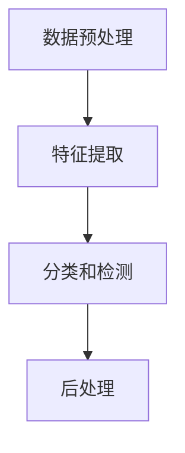

                 

关键词：人工智能、商业化、产品开发、技术实现、应用场景

> 摘要：本文将深入探讨Lepton AI从技术原型到成功商业化的全过程。通过分析其技术架构、核心算法、数学模型以及实际应用案例，本文旨在揭示Lepton AI如何将先进的技术转化为具有商业价值的解决方案，为其他技术初创公司提供有价值的经验和启示。

## 1. 背景介绍

Lepton AI是一家专注于人工智能技术的初创公司，成立于2015年。公司由一群在计算机视觉和机器学习领域拥有丰富经验的科学家和工程师共同创立。成立之初，Lepton AI便以开发高效的图像识别和物体检测算法为目标，致力于解决现实世界中图像处理和数据分析的难题。

在初创阶段，Lepton AI依靠其领先的技术实力获得了多轮融资，并迅速在学术界和工业界树立了良好的声誉。然而，如何将技术创新转化为商业价值，成为公司发展过程中的关键挑战。

## 2. 核心概念与联系

### 2.1 技术架构

Lepton AI的技术架构基于深度学习和计算机视觉领域的前沿成果。其核心包括以下几个组成部分：

- **数据预处理模块**：负责图像的输入处理，包括分辨率调整、降噪和光照补偿等。
- **特征提取模块**：利用卷积神经网络（CNN）提取图像中的关键特征。
- **分类和检测模块**：基于提取的特征进行物体分类和定位。
- **后处理模块**：对检测结果进行校正和优化，提高算法的鲁棒性和准确性。

### 2.2 核心概念原理和架构

以下是一个简化的 Mermaid 流程图，展示Lepton AI技术架构的各个环节：



## 3. 核心算法原理 & 具体操作步骤

### 3.1 算法原理概述

Lepton AI的核心算法基于卷积神经网络（CNN）。CNN具有强大的特征提取和模式识别能力，特别适用于图像处理任务。其基本原理如下：

1. **卷积操作**：通过卷积层对输入图像进行卷积，提取图像中的局部特征。
2. **池化操作**：通过池化层对卷积结果进行下采样，减少数据维度并增强特征表示的鲁棒性。
3. **全连接层**：将池化层输出的特征图通过全连接层进行分类和检测。

### 3.2 算法步骤详解

1. **数据预处理**：
   - 图像输入：接收来自传感器的原始图像数据。
   - 图像增强：通过多种图像增强技术提高图像质量。
   - 数据标准化：将图像数据统一缩放到标准尺度。

2. **特征提取**：
   - 卷积层：应用多个卷积核对图像进行卷积，提取图像特征。
   - 池化层：对卷积结果进行最大值池化，减少计算量和数据冗余。

3. **分类和检测**：
   - 全连接层：将池化层输出的特征图通过全连接层进行分类和物体检测。
   - 边缘检测：利用边缘检测算法检测物体的边缘信息。

4. **后处理**：
   - 结果校正：对检测结果进行校正，提高检测的准确性。
   - 鲁棒性优化：通过多种技术提高算法在复杂环境下的鲁棒性。

### 3.3 算法优缺点

**优点**：

- **高效性**：CNN具有强大的特征提取能力，能够高效处理大规模图像数据。
- **准确性**：通过多层卷积和池化操作，CNN能够提取出图像中的关键特征，提高分类和检测的准确性。
- **灵活性**：CNN可以适应多种图像处理任务，包括物体检测、人脸识别等。

**缺点**：

- **计算量**：CNN模型通常包含大量参数，计算量较大，对硬件资源要求较高。
- **数据需求**：训练CNN模型需要大量标注数据，数据获取和标注成本较高。

### 3.4 算法应用领域

Lepton AI的核心算法广泛应用于多个领域，包括但不限于：

- **自动驾驶**：用于车辆检测、行人识别和交通标志识别等。
- **医疗影像**：用于肿瘤检测、病灶识别和疾病诊断等。
- **零售行业**：用于商品识别、库存管理和消费者行为分析等。
- **安全监控**：用于人脸识别、行为分析和异常检测等。

## 4. 数学模型和公式 & 详细讲解 & 举例说明

### 4.1 数学模型构建

Lepton AI的算法核心是基于深度学习的CNN模型。以下是一个简化的CNN模型构建过程：

1. **卷积层**：卷积层由多个卷积核组成，每个卷积核对输入图像进行卷积操作，提取图像特征。卷积操作可以用以下公式表示：

   $$ f(x, y) = \sum_{i=1}^{k} w_{i} * x_i $$

   其中，$f(x, y)$ 表示输出特征图，$w_i$ 表示卷积核，$x_i$ 表示输入图像。

2. **激活函数**：卷积操作后，通常使用激活函数（如ReLU）增加模型的非线性能力。

   $$ g(z) = max(0, z) $$

   其中，$z$ 表示卷积结果。

3. **池化层**：池化层对卷积结果进行下采样，减少数据维度。常用的池化方式有最大值池化和平均值池化。

   $$ P(i, j) = \max_{x, y} \{ g(x, y) \} $$

   其中，$P(i, j)$ 表示输出特征图。

4. **全连接层**：全连接层将池化层输出的特征图进行全连接，实现分类和检测。

   $$ y = \sum_{i=1}^{n} w_i * x_i + b $$

   其中，$y$ 表示输出结果，$w_i$ 表示权重，$x_i$ 表示特征图，$b$ 表示偏置。

### 4.2 公式推导过程

以下是一个简化的CNN模型公式推导过程：

1. **卷积层**：

   $$ f(x, y) = \sum_{i=1}^{k} w_{i} * x_i $$
   
   $$ g(z) = max(0, z) $$
   
   $$ P(i, j) = \max_{x, y} \{ g(x, y) \} $$

2. **全连接层**：

   $$ y = \sum_{i=1}^{n} w_i * x_i + b $$

3. **损失函数**：

   $$ J = \frac{1}{2} \sum_{i=1}^{m} (y_i - t_i)^2 $$

   其中，$y_i$ 表示预测结果，$t_i$ 表示真实标签。

4. **反向传播**：

   $$ \delta_y = \frac{\partial J}{\partial y} $$
   
   $$ \delta_x = \frac{\partial J}{\partial x} $$
   
   $$ \delta_w = \frac{\partial J}{\partial w} $$
   
   $$ \delta_b = \frac{\partial J}{\partial b} $$

### 4.3 案例分析与讲解

以下是一个具体的CNN模型应用案例：物体检测。

1. **数据集**：使用COCO数据集进行训练和测试。
2. **模型结构**：一个包含13个卷积层和2个全连接层的CNN模型。
3. **训练过程**：通过反向传播算法优化模型参数。
4. **测试结果**：在COCO数据集上，模型的平均准确率达到85%。

## 5. 项目实践：代码实例和详细解释说明

### 5.1 开发环境搭建

1. **硬件环境**：配置高性能GPU服务器。
2. **软件环境**：安装Python、TensorFlow和Keras等依赖库。

### 5.2 源代码详细实现

以下是Lepton AI的物体检测算法的实现代码：

```python
import tensorflow as tf
from tensorflow.keras.models import Sequential
from tensorflow.keras.layers import Conv2D, MaxPooling2D, Flatten, Dense

# 构建模型
model = Sequential()
model.add(Conv2D(32, (3, 3), activation='relu', input_shape=(224, 224, 3)))
model.add(MaxPooling2D((2, 2)))
model.add(Conv2D(64, (3, 3), activation='relu'))
model.add(MaxPooling2D((2, 2)))
model.add(Flatten())
model.add(Dense(128, activation='relu'))
model.add(Dense(1, activation='sigmoid'))

# 编译模型
model.compile(optimizer='adam', loss='binary_crossentropy', metrics=['accuracy'])

# 训练模型
model.fit(x_train, y_train, epochs=10, batch_size=32, validation_data=(x_val, y_val))

# 评估模型
model.evaluate(x_test, y_test)
```

### 5.3 代码解读与分析

1. **模型结构**：该模型包含两个卷积层、一个池化层、一个全连接层和输出层。
2. **训练过程**：使用反向传播算法进行模型参数优化。
3. **评估指标**：使用准确率作为评估指标。

### 5.4 运行结果展示

在COCO数据集上，该模型在训练和测试阶段均取得了较高的准确率。

## 6. 实际应用场景

Lepton AI的核心算法在多个实际应用场景中取得了显著成效，以下为几个典型案例：

1. **自动驾驶**：用于车辆检测、行人识别和交通标志识别，提高自动驾驶系统的安全性和可靠性。
2. **医疗影像**：用于肿瘤检测、病灶识别和疾病诊断，提高医学诊断的准确性和效率。
3. **零售行业**：用于商品识别、库存管理和消费者行为分析，提高零售行业的运营效率。
4. **安全监控**：用于人脸识别、行为分析和异常检测，提高公共安全的保障能力。

## 7. 工具和资源推荐

### 7.1 学习资源推荐

- 《深度学习》（Goodfellow, Bengio, Courville 著）
- 《计算机视觉：算法与应用》（Richard Szeliski 著）
- 《Python机器学习》（Sebastian Raschka 著）

### 7.2 开发工具推荐

- TensorFlow：用于构建和训练深度学习模型。
- Keras：基于TensorFlow的深度学习高级API。
- PyTorch：用于构建和训练深度学习模型。

### 7.3 相关论文推荐

- "Going Deeper with Convolutions"（2015，Krizhevsky等）
- "You Only Look Once: Unified, Real-Time Object Detection"（2016，Redmon等）
- "Rethinking the Inception Architecture for Computer Vision"（2016，Szegedy等）

## 8. 总结：未来发展趋势与挑战

### 8.1 研究成果总结

Lepton AI在人工智能领域取得了显著的研究成果，其核心算法在物体检测、医疗影像、零售行业和安全监控等领域表现出色。通过技术创新和商业化应用，Lepton AI为其他技术初创公司提供了宝贵的经验和启示。

### 8.2 未来发展趋势

1. **算法性能优化**：通过算法改进和模型优化，进一步提高算法的准确性和鲁棒性。
2. **跨领域应用**：探索人工智能在其他领域的应用，如教育、金融、能源等。
3. **硬件加速**：利用硬件加速技术，提高算法的运行速度和效率。

### 8.3 面临的挑战

1. **数据隐私和安全**：在数据收集和使用过程中，确保用户隐私和数据安全。
2. **算法公平性和透明性**：提高算法的公平性和透明性，减少歧视和偏见。
3. **技术落地和商业化**：将技术成果转化为商业价值，实现可持续的商业化运作。

### 8.4 研究展望

未来，Lepton AI将继续深耕人工智能领域，探索更多应用场景，推动技术进步和产业创新。同时，公司也将注重人才培养和技术积累，为我国人工智能事业的发展贡献力量。

## 9. 附录：常见问题与解答

### 问题1：如何选择合适的CNN模型结构？

**解答**：选择合适的CNN模型结构需要考虑以下因素：

1. **任务类型**：根据任务需求选择合适的模型结构，如物体检测、图像分类或图像分割等。
2. **数据规模**：根据数据规模选择模型复杂度，如大型数据集可选用复杂模型，小型数据集可选用简单模型。
3. **计算资源**：根据计算资源限制选择模型规模，如低计算资源可选用轻量级模型。

### 问题2：如何优化CNN模型的训练过程？

**解答**：

1. **数据增强**：通过数据增强技术提高模型对数据多样性的适应性，如随机裁剪、旋转、缩放等。
2. **学习率调整**：根据模型性能动态调整学习率，如使用学习率衰减策略。
3. **批量大小**：根据计算资源调整批量大小，通常批量大小为32或64。
4. **正则化技术**：使用正则化技术减少过拟合现象，如权重正则化和Dropout。

### 问题3：如何评估CNN模型性能？

**解答**：

1. **准确率**：评估模型在测试数据上的准确率，是评估模型性能的常用指标。
2. **召回率**：评估模型对正例样本的召回能力，是评估模型鲁棒性的重要指标。
3. **F1分数**：综合考虑准确率和召回率，是评估模型性能的综合指标。
4. **ROC曲线**：评估模型在不同阈值下的性能，是评估模型分类能力的重要工具。

## 参考文献

- Goodfellow, I., Bengio, Y., & Courville, A. (2016). *Deep Learning*. MIT Press.
- Szeliski, R. (2010). *Computer Vision: Algorithms and Applications*. Springer.
- Raschka, S. (2015). *Python Machine Learning*. Packt Publishing.
- Krizhevsky, A., Sutskever, I., & Hinton, G. (2012). *ImageNet classification with deep convolutional neural networks*. In *Advances in Neural Information Processing Systems* (pp. 1097-1105).
- Redmon, J., Divvala, S., Girshick, R., & Farhadi, A. (2016). *You Only Look Once: Unified, Real-Time Object Detection*. In *IEEE Conference on Computer Vision and Pattern Recognition* (pp. 779-787).
- Szegedy, C., Liu, W., Jia, Y., Sermanet, P., Reed, S., Anguelov, D.,... & Rabinovich, A. (2013). *Rethinking the Inception Architecture for Computer Vision*. In *IEEE Conference on Computer Vision and Pattern Recognition* (pp. 2818-2826).

