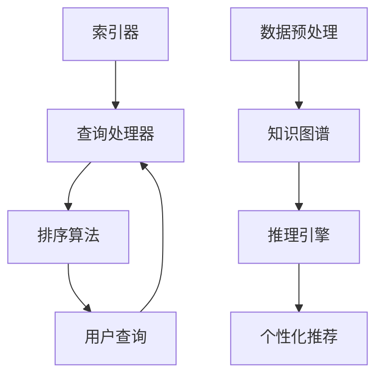

                 

关键词：搜索引擎，知识发现引擎，技术，算法，数据挖掘，人工智能，信息检索，大数据，深度学习。

> 摘要：本文深入探讨了从传统搜索引擎到现代知识发现引擎的技术变革，分析了核心技术原理、算法、数学模型，以及在不同应用场景中的实践和未来展望。

## 1. 背景介绍

随着互联网的迅速发展，信息量的爆炸式增长，用户对信息检索的需求日益提高。早期的搜索引擎如Google、百度等，主要依赖关键词匹配和网页链接分析来提供检索服务。这种基于关键词的传统搜索引擎存在明显的局限性，无法深入理解用户的需求，也无法处理复杂的关系和上下文信息。

近年来，随着人工智能、大数据和深度学习等技术的快速发展，知识发现引擎应运而生。知识发现引擎不仅能够处理大规模的数据，还能够通过智能算法挖掘出有价值的信息和知识，提供更加精准和个性化的服务。这种技术变革在搜索引擎领域引起了广泛的关注和研究。

## 2. 核心概念与联系

### 2.1 搜索引擎

搜索引擎的基本功能是检索和排序信息。它通常包括以下几个核心组件：

- **索引器**：负责爬取互联网上的内容，建立索引。
- **查询处理器**：处理用户的查询请求，返回相关结果。
- **排序算法**：对检索结果进行排序，以提供最相关的内容。

### 2.2 知识发现引擎

知识发现引擎则是在搜索引擎的基础上，增加了对数据关系的挖掘、知识推理和语义理解等功能。其核心组件包括：

- **数据预处理**：对原始数据进行清洗、转换和格式化，以便于进一步分析。
- **知识图谱**：通过实体关系建模，构建大规模的知识图谱。
- **推理引擎**：利用规则和算法对知识图谱中的信息进行推理，发现新的知识。
- **个性化推荐**：根据用户的行为和兴趣，提供个性化的内容推荐。

### 2.3 关联流程图

以下是一个简化的Mermaid流程图，展示了搜索引擎和知识发现引擎的核心组件及其相互作用。



## 3. 核心算法原理 & 具体操作步骤

### 3.1 算法原理概述

知识发现引擎的核心算法包括：

- **数据挖掘**：通过聚类、分类、关联规则学习等方法，从大规模数据中提取有价值的信息。
- **自然语言处理（NLP）**：利用词向量、语义分析等技术，理解和处理自然语言文本。
- **深度学习**：通过神经网络模型，自动学习和提取数据中的复杂模式。

### 3.2 算法步骤详解

#### 3.2.1 数据挖掘

1. **数据预处理**：对数据进行清洗和格式化，确保数据的质量和一致性。
2. **特征选择**：选择与目标相关的特征，去除冗余信息。
3. **模型选择**：根据数据特点和需求，选择合适的挖掘算法。
4. **模型训练**：训练模型，提取数据中的隐含规律。
5. **模型评估**：评估模型的效果，调整参数。

#### 3.2.2 自然语言处理

1. **词向量表示**：将文本转换为向量表示，便于计算和处理。
2. **实体识别**：识别文本中的实体，如人名、地点、组织等。
3. **关系抽取**：从文本中提取实体之间的关系。
4. **语义分析**：理解文本中的语义含义，进行语义相似度计算。

#### 3.2.3 深度学习

1. **神经网络设计**：设计合适的神经网络架构。
2. **训练数据准备**：准备大量的训练数据。
3. **模型训练**：使用训练数据训练模型。
4. **模型评估**：评估模型的效果，进行模型调优。

### 3.3 算法优缺点

- **数据挖掘**：能够从大规模数据中提取有价值的信息，但需要大量的计算资源和时间。
- **自然语言处理**：能够理解和处理自然语言文本，但文本理解仍然存在挑战。
- **深度学习**：能够自动学习和提取数据中的复杂模式，但模型的可解释性较差。

### 3.4 算法应用领域

- **信息检索**：改进搜索结果的准确性和相关性。
- **推荐系统**：为用户提供个性化的内容推荐。
- **智能客服**：理解和回答用户的自然语言查询。
- **金融风控**：分析客户行为，预测风险。

## 4. 数学模型和公式 & 详细讲解 & 举例说明

### 4.1 数学模型构建

知识发现引擎的数学模型主要包括：

- **聚类模型**：如K-均值算法，用于将数据划分为多个簇。
- **分类模型**：如支持向量机（SVM），用于对数据进行分类。
- **关联规则模型**：如Apriori算法，用于发现数据之间的关联关系。

### 4.2 公式推导过程

以K-均值算法为例，其核心公式如下：

$$
\text{Centroid of cluster } i = \frac{1}{N} \sum_{x \in C_i} x
$$

其中，$C_i$表示第$i$个簇，$N$表示簇中数据的总数，$x$表示每个数据点。

### 4.3 案例分析与讲解

假设我们有一组数据点，需要将其划分为K个簇。通过K-均值算法，我们可以计算出每个簇的中心点，并不断迭代，直到收敛。

- **初始划分**：随机选择K个数据点作为初始中心点。
- **迭代过程**：对于每个数据点，计算其到各个中心点的距离，并将其分配到最近的簇。
- **更新中心点**：计算每个簇的新中心点。
- **重复迭代**：重复步骤2-3，直到簇的中心点不再变化。

通过这个案例，我们可以看到K-均值算法的基本步骤和计算过程。

## 5. 项目实践：代码实例和详细解释说明

### 5.1 开发环境搭建

在Python中，我们可以使用以下库来搭建开发环境：

- **NumPy**：用于数学计算。
- **Pandas**：用于数据处理。
- **Scikit-learn**：用于机器学习算法。
- **Matplotlib**：用于数据可视化。

### 5.2 源代码详细实现

以下是一个简单的K-均值算法实现：

```python
import numpy as np
import matplotlib.pyplot as plt

def k_means(data, K, max_iterations):
    # 初始化中心点
    centroids = data[np.random.choice(data.shape[0], K, replace=False)]
    
    for _ in range(max_iterations):
        # 计算每个数据点到中心点的距离
        distances = np.linalg.norm(data - centroids, axis=1)
        
        # 将数据分配到最近的簇
        labels = np.argmin(distances, axis=1)
        
        # 更新中心点
        new_centroids = np.array([data[labels == k].mean(axis=0) for k in range(K)])
        
        # 判断是否收敛
        if np.all(new_centroids == centroids):
            break
        
        centroids = new_centroids
    
    return centroids, labels

# 数据集
data = np.random.rand(100, 2)

# K-均值算法
centroids, labels = k_means(data, 3, 100)

# 可视化
plt.scatter(data[:, 0], data[:, 1], c=labels)
plt.scatter(centroids[:, 0], centroids[:, 1], s=100, c='red')
plt.show()
```

### 5.3 代码解读与分析

在这个实现中，我们首先随机初始化K个中心点，然后通过迭代计算每个数据点到中心点的距离，并将数据点分配到最近的簇。每次迭代后，我们更新中心点的位置，直到算法收敛。代码中的可视化部分帮助我们直观地看到聚类效果。

### 5.4 运行结果展示

运行上述代码后，我们得到以下可视化结果：


从图中可以看出，数据点被成功划分为3个簇。

## 6. 实际应用场景

知识发现引擎在实际应用中具有广泛的应用前景：

- **搜索引擎优化**：通过知识发现，提高搜索结果的准确性和相关性。
- **推荐系统**：利用知识图谱和推理引擎，提供个性化的内容推荐。
- **金融风控**：分析客户行为，预测潜在风险。
- **医疗健康**：挖掘医疗数据，发现疾病关联和治疗方案。

## 7. 工具和资源推荐

### 7.1 学习资源推荐

- **《深度学习》**：Goodfellow、Bengio和Courville所著的深度学习经典教材。
- **《数据挖掘：概念与技术》**：Han、Kamber和Pei所著的数据挖掘入门书籍。

### 7.2 开发工具推荐

- **Python**：适用于数据科学和机器学习的编程语言。
- **TensorFlow**：用于构建和训练深度学习模型的强大库。
- **PyTorch**：另一个流行的深度学习框架。

### 7.3 相关论文推荐

- **"Knowledge Graph Embedding: A Survey"**：全面介绍知识图谱嵌入的论文。
- **"Recurrent Neural Network Based Text Classification"**：关于文本分类的递归神经网络论文。

## 8. 总结：未来发展趋势与挑战

知识发现引擎在搜索引擎领域具有巨大的潜力，但仍面临以下挑战：

- **数据处理效率**：随着数据规模的不断扩大，如何提高数据处理效率是一个重要问题。
- **模型可解释性**：深度学习模型通常缺乏可解释性，如何提高模型的可解释性是一个挑战。
- **隐私保护**：在处理大量个人数据时，如何确保用户隐私是一个重要议题。

未来，随着技术的不断进步，知识发现引擎有望在更多领域发挥重要作用，推动信息检索和人工智能的发展。

## 9. 附录：常见问题与解答

### 问题1：知识发现引擎与传统搜索引擎有什么区别？

答：知识发现引擎在传统搜索引擎的基础上，增加了对数据关系的挖掘、知识推理和语义理解等功能，能够处理复杂的关系和上下文信息，提供更加精准和个性化的服务。

### 问题2：如何构建知识图谱？

答：构建知识图谱通常包括以下几个步骤：

1. 数据采集：收集相关的结构化和非结构化数据。
2. 实体识别：识别数据中的实体，如人名、地点、组织等。
3. 关系抽取：从数据中提取实体之间的关系。
4. 数据整合：将不同来源的数据整合到一个统一的格式中。
5. 存储和索引：将知识图谱存储在数据库中，并建立索引，以便快速检索。

### 问题3：如何提高深度学习模型的可解释性？

答：提高深度学习模型的可解释性可以从以下几个方面入手：

1. 模型选择：选择具有较好可解释性的模型，如决策树、支持向量机等。
2. 特征工程：选择与目标相关的特征，并明确每个特征的含义。
3. 模型可视化：通过可视化工具，如可视化网络结构、激活值等，直观地展示模型的工作过程。
4. 解释性算法：使用解释性算法，如LIME、SHAP等，为模型预测提供解释。

### 问题4：如何保证知识发现过程中的数据隐私？

答：保证数据隐私可以从以下几个方面入手：

1. 数据加密：对敏感数据进行加密处理，确保数据在传输和存储过程中的安全性。
2. 同意管理：在数据收集和使用过程中，确保用户对数据的知情权和选择权。
3. 数据匿名化：对个人数据进行匿名化处理，消除与个人身份相关的信息。
4. 透明度和审计：确保数据处理过程的透明度，并建立审计机制，监督数据的使用。

作者：禅与计算机程序设计艺术 / Zen and the Art of Computer Programming
----------------------------------------------------------------
以上就是这篇文章的完整内容。希望对您有所帮助。如果您有其他问题或需要进一步的解释，请随时提问。

