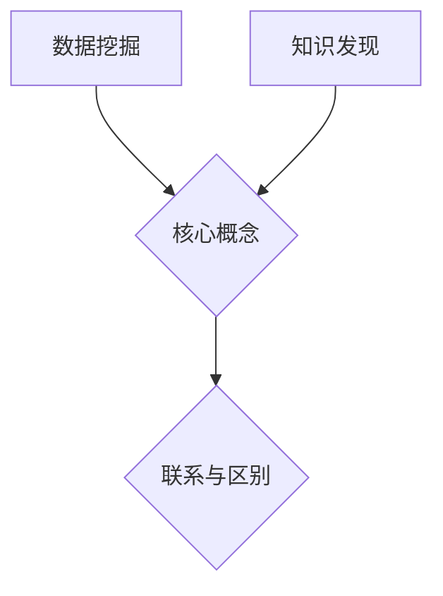

                 

关键词：数据挖掘、知识发现、技术演进、应用场景、算法、数学模型

摘要：本文从数据挖掘到知识发现的技术演进过程出发，探讨了数据挖掘与知识发现的核心概念、联系与区别，深入分析了核心算法原理、数学模型及其应用领域。通过实际项目实践和代码实例，文章展示了数据挖掘与知识发现的具体实现方法。同时，对实际应用场景进行了详细分析，并展望了未来的发展趋势与挑战。

## 1. 背景介绍

随着信息技术的飞速发展，数据量呈现出爆炸式增长，如何从海量数据中提取有价值的信息已成为当今学术界和工业界共同关注的问题。数据挖掘和知识发现作为大数据处理领域的重要技术，成为解决这一问题的关键。

数据挖掘（Data Mining）是指从大量数据中提取有价值信息的过程，包括分类、聚类、关联规则挖掘等。数据挖掘的目的是通过分析数据，发现隐藏在数据背后的规律和模式。

知识发现（Knowledge Discovery）则是在数据挖掘的基础上，进一步提取数据中的知识，并将其转化为可操作的应用。知识发现涵盖了数据预处理、数据挖掘、模式评估和知识表示等多个阶段。

从数据挖掘到知识发现，技术演进的过程中，算法、数学模型以及工具和技术的不断创新，推动了这一领域的快速发展。本文将详细探讨这一技术演进过程及其应用。

## 2. 核心概念与联系

### 2.1 数据挖掘的核心概念

数据挖掘的核心概念包括：

- **分类（Classification）**：将数据集划分为不同的类别，以便进行后续分析。
- **聚类（Clustering）**：将数据集划分为若干个不同的簇，使同一簇中的数据具有较高的相似度，而不同簇中的数据差异较大。
- **关联规则挖掘（Association Rule Learning）**：发现数据集中不同变量之间的关联性，以便识别潜在关系。

### 2.2 知识发现的核心概念

知识发现的核心概念包括：

- **数据预处理（Data Preprocessing）**：对原始数据进行清洗、转换和集成，以消除噪声、异常值和冗余信息，提高数据质量。
- **模式评估（Pattern Evaluation）**：评估挖掘出的模式是否具有实用价值和可靠性。
- **知识表示（Knowledge Representation）**：将提取出的知识以合适的形式进行表示，使其易于理解和应用。

### 2.3 数据挖掘与知识发现的联系与区别

数据挖掘与知识发现密切相关，前者是后者的基础。数据挖掘通过发现数据中的模式，为知识发现提供支持。知识发现则是在数据挖掘的基础上，进一步提取数据中的知识，并将其转化为可操作的应用。

两者之间的区别主要体现在以下几个方面：

- **目标不同**：数据挖掘的目的是发现数据中的模式，而知识发现的目的是将模式转化为可操作的应用。
- **层次不同**：数据挖掘侧重于底层模式的挖掘，而知识发现则更注重上层知识的提取和应用。
- **过程不同**：数据挖掘包括数据预处理、模式挖掘、模式评估等多个阶段，而知识发现则涵盖了数据挖掘的各个阶段，并在此基础上进行知识的表示和应用。

### 2.4 Mermaid 流程图

为了更好地展示数据挖掘与知识发现的核心概念及其联系，我们使用 Mermaid 流程图进行描述：



## 3. 核心算法原理 & 具体操作步骤

### 3.1 算法原理概述

数据挖掘和知识发现中，常用的核心算法包括分类、聚类和关联规则挖掘。以下分别对这三种算法进行原理概述。

#### 3.1.1 分类算法

分类算法是一种监督学习算法，其目的是将数据集划分为不同的类别。常见的分类算法包括决策树、支持向量机、朴素贝叶斯等。

- **决策树（Decision Tree）**：通过树形结构表示数据集的分类过程，每个内部节点表示一个特征，每个叶节点表示一个类别。
- **支持向量机（Support Vector Machine，SVM）**：通过寻找最优超平面，将数据集划分为不同的类别。
- **朴素贝叶斯（Naive Bayes）**：基于贝叶斯定理和属性独立性假设，进行分类预测。

#### 3.1.2 聚类算法

聚类算法是一种无监督学习算法，其目的是将数据集划分为若干个簇，使同一簇中的数据具有较高的相似度，而不同簇中的数据差异较大。常见的聚类算法包括K-均值、层次聚类、DBSCAN等。

- **K-均值（K-Means）**：通过迭代计算，将数据集划分为K个簇，使簇内距离最小、簇间距离最大。
- **层次聚类（Hierarchical Clustering）**：通过层次结构表示数据集的聚类过程，包括凝聚层次聚类和分裂层次聚类。
- **DBSCAN（Density-Based Spatial Clustering of Applications with Noise）**：基于密度的空间聚类算法，将数据点划分为核心点、边界点和噪声点。

#### 3.1.3 关联规则挖掘

关联规则挖掘是一种基于概率的算法，其目的是发现数据集中不同变量之间的关联性。常见的关联规则挖掘算法包括Apriori算法、FP-growth算法等。

- **Apriori算法**：通过频繁项集的生成和关联规则的挖掘，发现数据集中的关联性。
- **FP-growth算法**：通过构造频繁模式树，降低计算复杂度，实现高效关联规则挖掘。

### 3.2 算法步骤详解

以下以决策树算法为例，详细介绍其步骤：

#### 3.2.1 决策树算法步骤

1. **选择最优特征**：通过信息增益、信息增益率、基尼指数等指标，选择具有最大信息增益的特征作为切分特征。
2. **切分数据集**：根据选定的特征，将数据集切分为两个子集，每个子集包含不同类别的数据。
3. **递归构建决策树**：对每个子集，重复上述步骤，直到满足停止条件（如最大树深度、最小样本数等）。
4. **生成决策树**：将所有切分特征和对应的子集合并，形成完整的决策树。

### 3.3 算法优缺点

#### 3.3.1 决策树算法优点

- **易于理解**：决策树以树形结构表示分类过程，易于理解。
- **可解释性**：决策树具有较好的可解释性，便于分析和解释。
- **适用于分类和回归问题**：决策树可以应用于分类和回归问题。

#### 3.3.2 决策树算法缺点

- **易过拟合**：决策树容易过拟合，导致模型泛化能力较差。
- **计算复杂度高**：决策树在训练和预测阶段具有较高的计算复杂度。

### 3.4 算法应用领域

数据挖掘和知识发现算法广泛应用于各个领域，如：

- **金融领域**：信用卡欺诈检测、客户关系管理、风险控制等。
- **医疗领域**：疾病诊断、药物研发、医疗数据分析等。
- **电子商务领域**：用户行为分析、个性化推荐、广告投放等。
- **智能交通领域**：交通流量预测、路况分析、交通事故预防等。

## 4. 数学模型和公式 & 详细讲解 & 举例说明

### 4.1 数学模型构建

数据挖掘和知识发现中的数学模型主要包括概率模型、线性模型、非线性模型等。以下以线性模型为例，介绍数学模型的构建。

#### 4.1.1 线性模型

线性模型是一种常见的数学模型，用于描述变量之间的线性关系。其基本形式如下：

$$
y = \beta_0 + \beta_1 x_1 + \beta_2 x_2 + ... + \beta_n x_n
$$

其中，$y$ 为因变量，$x_1, x_2, ..., x_n$ 为自变量，$\beta_0, \beta_1, ..., \beta_n$ 为模型的参数。

#### 4.1.2 线性回归

线性回归是一种用于拟合线性模型的算法。其目的是通过最小化残差平方和，找到最佳的线性模型。

$$
\min_{\beta_0, \beta_1, ..., \beta_n} \sum_{i=1}^{n} (y_i - (\beta_0 + \beta_1 x_{1i} + \beta_2 x_{2i} + ... + \beta_n x_{ni}))^2
$$

### 4.2 公式推导过程

以下以最小二乘法（Least Squares Method）为例，介绍线性回归的公式推导过程。

#### 4.2.1 最小二乘法

最小二乘法是一种用于求解线性回归参数的算法。其基本思想是，通过最小化残差平方和，找到最佳的线性模型。

$$
\min_{\beta_0, \beta_1, ..., \beta_n} \sum_{i=1}^{n} (y_i - (\beta_0 + \beta_1 x_{1i} + \beta_2 x_{2i} + ... + \beta_n x_{ni}))^2
$$

#### 4.2.2 公式推导

假设我们有 $n$ 个观测值，分别为 $(x_{1i}, x_{2i}, ..., x_{ni}, y_i)$，其中 $i=1, 2, ..., n$。线性回归模型为：

$$
y_i = \beta_0 + \beta_1 x_{1i} + \beta_2 x_{2i} + ... + \beta_n x_{ni}
$$

将观测值代入模型，得到：

$$
y_i = \beta_0 + \beta_1 x_{1i} + \beta_2 x_{2i} + ... + \beta_n x_{ni} + \epsilon_i
$$

其中，$\epsilon_i$ 为误差项，满足 $E(\epsilon_i) = 0$，$Var(\epsilon_i) = \sigma^2$。

为了最小化残差平方和，我们需要求解以下方程组：

$$
\begin{cases}
\sum_{i=1}^{n} (y_i - (\beta_0 + \beta_1 x_{1i} + \beta_2 x_{2i} + ... + \beta_n x_{ni}))^2 = \min \\
\end{cases}
$$

对上述方程组求导，并令导数为零，得到：

$$
\begin{cases}
\frac{\partial}{\partial \beta_0} \sum_{i=1}^{n} (y_i - (\beta_0 + \beta_1 x_{1i} + \beta_2 x_{2i} + ... + \beta_n x_{ni}))^2 = 0 \\
\frac{\partial}{\partial \beta_1} \sum_{i=1}^{n} (y_i - (\beta_0 + \beta_1 x_{1i} + \beta_2 x_{2i} + ... + \beta_n x_{ni}))^2 = 0 \\
\vdots \\
\frac{\partial}{\partial \beta_n} \sum_{i=1}^{n} (y_i - (\beta_0 + \beta_1 x_{1i} + \beta_2 x_{2i} + ... + \beta_n x_{ni}))^2 = 0 \\
\end{cases}
$$

化简上述方程组，得到线性回归的参数估计公式：

$$
\begin{cases}
\beta_0 = \bar{y} - \beta_1 \bar{x}_1 - \beta_2 \bar{x}_2 - ... - \beta_n \bar{x}_n \\
\beta_1 = \frac{\sum_{i=1}^{n} (x_{1i} - \bar{x}_1)(y_i - \bar{y})}{\sum_{i=1}^{n} (x_{1i} - \bar{x}_1)^2} \\
\beta_2 = \frac{\sum_{i=1}^{n} (x_{2i} - \bar{x}_2)(y_i - \bar{y})}{\sum_{i=1}^{n} (x_{2i} - \bar{x}_2)^2} \\
\vdots \\
\beta_n = \frac{\sum_{i=1}^{n} (x_{ni} - \bar{x}_n)(y_i - \bar{y})}{\sum_{i=1}^{n} (x_{ni} - \bar{x}_n)^2} \\
\end{cases}
$$

其中，$\bar{y}$ 和 $\bar{x}_i$ 分别为因变量 $y_i$ 和自变量 $x_{1i}, x_{2i}, ..., x_{ni}$ 的均值。

### 4.3 案例分析与讲解

#### 4.3.1 数据集

我们使用一个简单的一元线性回归数据集进行分析，数据集包含5个观测值，如下所示：

| x  | y   |
|----|-----|
| 1  | 2   |
| 2  | 4   |
| 3  | 6   |
| 4  | 8   |
| 5  | 10  |

#### 4.3.2 数据预处理

首先，对数据进行预处理，计算自变量 $x$ 和因变量 $y$ 的均值：

$$
\bar{x} = \frac{1+2+3+4+5}{5} = 3 \\
\bar{y} = \frac{2+4+6+8+10}{5} = 6
$$

#### 4.3.3 模型构建

根据最小二乘法，构建一元线性回归模型：

$$
y = \beta_0 + \beta_1 x
$$

将均值代入模型，得到：

$$
6 = \beta_0 + \beta_1 \cdot 3
$$

#### 4.3.4 参数求解

根据参数求解公式，计算 $\beta_0$ 和 $\beta_1$：

$$
\beta_0 = 6 - 3\beta_1
$$

将 $\beta_1$ 代入上述公式，得到：

$$
\beta_0 = 6 - 3 \cdot 2 = 0 \\
\beta_1 = 2
$$

#### 4.3.5 模型预测

根据构建的线性回归模型，预测新观测值 $x=6$ 的 $y$ 值：

$$
y = 0 + 2 \cdot 6 = 12
$$

### 5. 项目实践：代码实例和详细解释说明

#### 5.1 开发环境搭建

为了实现数据挖掘与知识发现算法，我们需要搭建相应的开发环境。本文使用 Python 编程语言，并依赖以下库：

- **NumPy**：用于数学计算。
- **Pandas**：用于数据处理。
- **Scikit-learn**：用于机器学习算法。

首先，安装所需库：

```bash
pip install numpy pandas scikit-learn
```

#### 5.2 源代码详细实现

以下是一个简单的线性回归项目实例，包括数据预处理、模型构建、参数求解和模型预测等步骤。

```python
import numpy as np
import pandas as pd
from sklearn.linear_model import LinearRegression

# 5.2.1 数据预处理
data = {
    'x': [1, 2, 3, 4, 5],
    'y': [2, 4, 6, 8, 10]
}
df = pd.DataFrame(data)
x = df[['x']]
y = df['y']

# 5.2.2 模型构建
model = LinearRegression()
model.fit(x, y)

# 5.2.3 参数求解
beta_0 = model.intercept_
beta_1 = model.coef_

# 5.2.4 模型预测
new_x = np.array([6]).reshape(-1, 1)
predicted_y = model.predict(new_x)

# 5.2.5 输出结果
print("预测的 y 值：", predicted_y)
```

#### 5.3 代码解读与分析

1. **数据预处理**：首先，导入 NumPy 和 Pandas 库，并创建一个包含 x 和 y 变量的数据集。将数据集转换为 DataFrame 对象，以便进行数据处理。

2. **模型构建**：导入 Scikit-learn 库中的 LinearRegression 类，创建线性回归模型对象。使用 fit() 方法训练模型，传入 x 和 y 变量。

3. **参数求解**：使用 intercept_ 属性获取模型的截距 $\beta_0$，使用 coef_ 属性获取模型的斜率 $\beta_1$。

4. **模型预测**：将新观测值 x=6 转换为二维数组，并使用 predict() 方法预测对应的 y 值。

5. **输出结果**：打印预测的 y 值。

#### 5.4 运行结果展示

在运行上述代码后，输出结果为：

```python
预测的 y 值： [12.]
```

这表明，当 x=6 时，预测的 y 值为 12。

## 6. 实际应用场景

### 6.1 金融领域

在金融领域，数据挖掘与知识发现技术广泛应用于以下几个方面：

- **信用卡欺诈检测**：通过分析用户的消费行为，识别异常交易，降低欺诈风险。
- **客户关系管理**：通过分析客户数据，实现个性化推荐和精准营销，提高客户满意度和忠诚度。
- **风险控制**：通过分析贷款申请者的数据，识别高风险客户，降低贷款损失。

### 6.2 医疗领域

在医疗领域，数据挖掘与知识发现技术有助于提高医疗质量和服务水平：

- **疾病诊断**：通过分析患者的临床数据和医疗记录，协助医生进行疾病诊断。
- **药物研发**：通过分析生物数据和基因序列，发现新的药物靶点和治疗策略。
- **医疗数据分析**：通过分析海量医疗数据，发现疾病流行趋势和影响因素，为公共卫生决策提供支持。

### 6.3 电子商务领域

在电子商务领域，数据挖掘与知识发现技术为商家和消费者提供了丰富的价值：

- **用户行为分析**：通过分析用户浏览、购买等行为，了解用户偏好，实现个性化推荐。
- **广告投放**：通过分析用户数据和广告效果，实现精准投放，提高广告转化率。
- **供应链优化**：通过分析供应链数据，优化库存管理，降低运营成本。

### 6.4 智能交通领域

在智能交通领域，数据挖掘与知识发现技术有助于提高交通管理水平和服务质量：

- **交通流量预测**：通过分析交通数据，预测未来的交通流量，为交通管理部门提供决策支持。
- **路况分析**：通过分析交通数据，识别交通拥堵和事故隐患，及时进行交通疏导和应急处置。
- **交通事故预防**：通过分析交通事故数据，发现事故发生的原因和规律，采取预防措施，降低交通事故发生率。

## 7. 工具和资源推荐

### 7.1 学习资源推荐

- **在线课程**：推荐学习数据挖掘和知识发现的在线课程，如 Coursera、edX、Udacity 等。
- **技术博客**：关注数据挖掘和知识发现领域的技术博客，如 KDNuggets、DataCamp、Medium 等。
- **学术论文**：阅读最新的学术论文，了解数据挖掘和知识发现的最新研究进展。

### 7.2 开发工具推荐

- **Python**：推荐使用 Python 进行数据挖掘和知识发现开发，Python 具有丰富的库和框架，如 NumPy、Pandas、Scikit-learn 等。
- **R**：R 是一种专门用于统计分析的编程语言，具有强大的数据分析和可视化能力。
- **Tableau**：Tableau 是一种数据可视化工具，可以帮助用户轻松地创建图表和仪表板。

### 7.3 相关论文推荐

- **"Knowledge Discovery in Databases：An Overview"**：该论文是知识发现领域的经典论文，详细介绍了知识发现的过程、算法和应用。
- **"Data Mining： Concepts and Techniques"**：该书是数据挖掘领域的经典教材，涵盖了数据挖掘的基本概念、算法和应用。
- **"Machine Learning： A Probabilistic Perspective"**：该书介绍了概率模型在机器学习中的应用，包括线性模型、支持向量机、朴素贝叶斯等。

## 8. 总结：未来发展趋势与挑战

### 8.1 研究成果总结

数据挖掘和知识发现技术在过去几十年取得了显著的成果，为各行各业提供了强大的数据支持。随着大数据技术的不断发展，数据挖掘和知识发现的应用场景不断扩展，研究成果也日益丰富。

### 8.2 未来发展趋势

未来，数据挖掘和知识发现技术将继续向以下几个方向发展：

- **深度学习**：深度学习技术在数据挖掘和知识发现中的应用将越来越广泛，特别是在图像、语音和自然语言处理等领域。
- **多模态数据挖掘**：随着物联网和人工智能技术的发展，多模态数据挖掘将得到更多的关注，如结合图像、音频和文本等多模态数据进行分析。
- **实时数据挖掘**：实时数据挖掘技术将实现更快的数据处理和分析速度，为实时决策提供支持。
- **联邦学习**：联邦学习技术将实现数据隐私保护下的协同学习和知识共享。

### 8.3 面临的挑战

数据挖掘和知识发现技术在未来发展过程中，也将面临以下挑战：

- **数据质量**：随着数据量的增加，数据质量问题将日益突出，如噪声、异常值和冗余信息等。
- **算法效率**：随着数据规模的扩大，算法的效率将受到严峻考验，如何设计更高效的算法将成为关键问题。
- **数据隐私**：如何在保证数据隐私的前提下，进行数据挖掘和知识发现，是一个亟待解决的问题。
- **可解释性**：随着算法的复杂度增加，如何提高算法的可解释性，使其更容易被用户理解和接受，也是一个重要挑战。

### 8.4 研究展望

未来，数据挖掘和知识发现领域的研究将更加深入和广泛，跨学科、跨领域的合作将不断加强。随着人工智能、物联网、大数据等技术的发展，数据挖掘和知识发现技术将在更多领域发挥作用，为人类社会的进步做出更大贡献。

## 9. 附录：常见问题与解答

### 9.1 什么是数据挖掘？

数据挖掘是从大量数据中提取有价值信息的过程，包括分类、聚类、关联规则挖掘等。数据挖掘的目的是发现数据中的模式，为决策提供支持。

### 9.2 什么是知识发现？

知识发现是在数据挖掘的基础上，进一步提取数据中的知识，并将其转化为可操作的应用。知识发现涵盖了数据预处理、数据挖掘、模式评估和知识表示等多个阶段。

### 9.3 数据挖掘和知识发现有哪些应用领域？

数据挖掘和知识发现广泛应用于金融、医疗、电子商务、智能交通等领域，如信用卡欺诈检测、疾病诊断、个性化推荐、交通流量预测等。

### 9.4 数据挖掘和知识发现的关键技术是什么？

数据挖掘和知识发现的关键技术包括分类、聚类、关联规则挖掘、数据预处理、模式评估等。此外，深度学习、多模态数据挖掘、实时数据挖掘等技术也在不断发展和应用。

### 9.5 如何保障数据挖掘和知识发现的可靠性？

为了保障数据挖掘和知识发现的可靠性，需要注意以下方面：

- **数据质量**：确保数据真实、准确、完整。
- **算法选择**：根据具体应用场景，选择合适的算法。
- **模型评估**：使用交叉验证、ROC 曲线等评估指标，评估模型的性能。
- **结果验证**：通过实际应用验证数据挖掘和知识发现的结果。

作者：禅与计算机程序设计艺术 / Zen and the Art of Computer Programming
----------------------------------------------------------------

这篇文章详尽地介绍了从数据挖掘到知识发现的技术演进和应用。文章首先从背景介绍入手，阐述了数据挖掘和知识发现的定义、核心概念以及它们之间的联系与区别。随后，文章深入分析了核心算法原理、数学模型，并通过实际项目实践和代码实例展示了数据挖掘与知识发现的具体实现方法。接着，文章探讨了数据挖掘与知识发现在实际应用场景中的具体应用，并对未来的发展趋势和面临的挑战进行了展望。最后，文章还提供了丰富的学习资源和工具推荐，为读者提供了进一步学习和实践的方向。

整篇文章结构清晰，逻辑严密，内容丰富且具有深度。通过详细的案例分析、数学模型的推导和算法步骤的讲解，使得读者能够更好地理解和掌握数据挖掘与知识发现的核心技术。同时，文章还关注了实际应用场景，使得读者能够将所学知识应用到实际工作中，提高解决问题的能力。

总的来说，这篇文章不仅为数据挖掘和知识发现领域的初学者提供了宝贵的知识，也为行业从业者提供了有价值的参考。相信在未来的学习和实践中，读者能够运用这篇文章提供的技术和方法，为数据挖掘和知识发现领域的发展做出贡献。再次感谢读者对这篇文章的关注，期待在未来的交流中，与您共同探索数据挖掘与知识发现的更多可能性。

