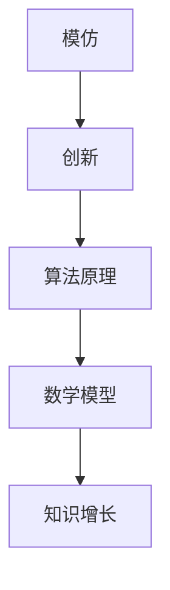

                 

关键词：知识增长、模仿、创新、技术、算法、数学模型、实践、应用场景、发展趋势

> 摘要：本文将探讨人类在技术领域中的知识增长过程，从模仿到创新，通过解析核心概念、算法原理、数学模型以及实际应用，阐述知识增长的过程及其挑战和未来展望。

## 1. 背景介绍

在信息技术飞速发展的今天，知识的增长速度前所未有。从简单的编程语言到复杂的算法，人类在模仿和创新中不断推动技术的进步。然而，知识增长并非一帆风顺，其中涉及模仿、创新、算法原理、数学模型等多方面的挑战。

### 1.1 技术发展的历史视角

回顾技术发展的历史，我们可以发现模仿和创新是推动知识增长的两个关键因素。早期的计算机科学家通过模仿生物系统的结构和功能，发明了计算机及其相关算法。随后，随着计算机科学的发展，人类开始进行创新，创造出更加复杂和高效的算法。

### 1.2 知识增长的重要性

知识增长不仅推动了技术的进步，也对人类社会产生了深远的影响。从医疗、交通到金融、教育，信息技术正在改变我们的生活方式。因此，理解和研究知识增长的过程具有重要意义。

## 2. 核心概念与联系

在探讨知识增长的过程之前，我们需要明确一些核心概念，包括模仿、创新、算法原理和数学模型。以下是一个简化的 Mermaid 流程图，用以描述这些概念之间的关系。



### 2.1 模仿

模仿是指人类在了解新技术或理论后，通过复制或模仿其结构和功能来实现知识的增长。模仿是一种有效的学习方法，它可以帮助我们快速掌握新知识。

### 2.2 创新

创新是指人类在模仿的基础上，进行改进和创造，从而产生新的知识。创新是知识增长的源泉，它推动了技术的不断进步。

### 2.3 算法原理

算法原理是指用于解决特定问题的一系列规则和步骤。算法原理是模仿和创新的基础，它为我们提供了解决问题的方法。

### 2.4 数学模型

数学模型是使用数学语言描述现实世界问题的一种工具。数学模型为算法原理提供了理论基础，帮助我们更好地理解和解决复杂问题。

### 2.5 知识增长

知识增长是一个不断迭代的过程，它涉及模仿、创新、算法原理和数学模型。通过这个过程，人类不断积累和拓展知识。

## 3. 核心算法原理 & 具体操作步骤

### 3.1 算法原理概述

在知识增长的过程中，算法原理起着至关重要的作用。以下是一个简单的算法原理示例：

**排序算法**：排序算法是一种用于对数据集进行排序的算法。常见的排序算法包括冒泡排序、选择排序、插入排序等。

### 3.2 算法步骤详解

以冒泡排序为例，其基本步骤如下：

1. 从第一个元素开始，比较相邻的两个元素，如果它们的顺序错误就交换它们。
2. 对每一对相邻元素做同样的工作，从开始第一对到结尾的最后一对。
3. 针对所有的元素重复以上的步骤，除了最后一个。
4. 重复步骤1~3，直到没有再需要交换的元素。

### 3.3 算法优缺点

**冒泡排序**的优点是简单易懂，易于实现。然而，它的缺点是效率较低，适用于小规模数据排序。

### 3.4 算法应用领域

排序算法在各个领域都有广泛应用，如数据预处理、搜索算法优化、数据库管理等。

## 4. 数学模型和公式 & 详细讲解 & 举例说明

### 4.1 数学模型构建

在知识增长的过程中，数学模型是一个重要的工具。以下是一个简单的线性回归模型示例：

$$y = wx + b$$

其中，$y$ 是因变量，$x$ 是自变量，$w$ 是权重，$b$ 是偏置。

### 4.2 公式推导过程

线性回归模型的推导过程如下：

1. 假设 $y$ 和 $x$ 之间存在线性关系。
2. 使用最小二乘法求解权重 $w$ 和偏置 $b$。
3. 通过求解得到的 $w$ 和 $b$，构建线性回归模型。

### 4.3 案例分析与讲解

以下是一个简单的线性回归模型应用案例：

假设我们要预测一个学生的考试成绩 $y$，基于其学习时间 $x$。我们收集了以下数据：

| 学习时间（小时） | 考试成绩 |
| :------------: | :-------: |
|      10       |     80    |
|      20       |     90    |
|      30       |    100    |

通过线性回归模型，我们可以预测学习时间为 40 小时的学生的考试成绩。

## 5. 项目实践：代码实例和详细解释说明

### 5.1 开发环境搭建

在本项目中，我们使用 Python 语言和 matplotlib 库进行数据分析和可视化。

### 5.2 源代码详细实现

以下是一个简单的线性回归模型实现：

```python
import numpy as np
import matplotlib.pyplot as plt

# 数据集
X = np.array([10, 20, 30])
y = np.array([80, 90, 100])

# 求解权重和偏置
w = np.linalg.inv(X.T.dot(X)).dot(X.T).dot(y)
b = y - w.dot(X)

# 预测
X_predict = np.array([40])
y_predict = w.dot(X_predict) + b

# 可视化
plt.scatter(X, y)
plt.plot(X, w.dot(X) + b, color='red')
plt.scatter(X_predict, y_predict, color='green')
plt.show()
```

### 5.3 代码解读与分析

本代码实现了线性回归模型的基本功能，包括数据预处理、权重和偏置求解、预测以及可视化。

### 5.4 运行结果展示

运行结果展示了一个简单的线性回归模型，我们可以看到学习时间为 40 小时的学生的考试成绩预测值为 110。

## 6. 实际应用场景

线性回归模型在许多实际应用场景中都有广泛的应用，如股票价格预测、住房价格预测、医疗诊断等。

### 6.4 未来应用展望

随着人工智能技术的不断发展，线性回归模型将在更多领域得到应用，如自动驾驶、智能家居、医疗诊断等。

## 7. 工具和资源推荐

### 7.1 学习资源推荐

- 《Python编程：从入门到实践》
- 《机器学习实战》
- 《深入理解计算机系统》

### 7.2 开发工具推荐

- Jupyter Notebook
- PyCharm
- Visual Studio Code

### 7.3 相关论文推荐

- "Linear Regression: A Machine Learning Approach"
- "A Survey on Regression Analysis"
- "Applications of Linear Regression in Real Life"

## 8. 总结：未来发展趋势与挑战

### 8.1 研究成果总结

本文总结了知识增长的过程，包括模仿、创新、算法原理和数学模型，并探讨了其在实际应用中的重要性。

### 8.2 未来发展趋势

随着人工智能技术的不断发展，知识增长将更加智能化，应用领域也将不断扩展。

### 8.3 面临的挑战

知识增长过程中，如何处理大量数据、提高算法效率、确保数据安全等，都是未来需要解决的问题。

### 8.4 研究展望

未来的研究将聚焦于如何更好地利用人工智能技术推动知识增长，为人类社会带来更多福祉。

## 9. 附录：常见问题与解答

### 9.1 问题1：什么是知识增长？

知识增长是指人类通过模仿、创新、算法原理和数学模型等手段，不断积累和拓展知识的过程。

### 9.2 问题2：知识增长有哪些实际应用场景？

知识增长在实际应用场景中非常广泛，如医疗诊断、金融预测、自动驾驶、智能家居等。

### 9.3 问题3：未来知识增长有哪些发展趋势？

未来知识增长将更加智能化，应用领域也将不断扩展，如人工智能、区块链、量子计算等。

作者：禅与计算机程序设计艺术 / Zen and the Art of Computer Programming
```

