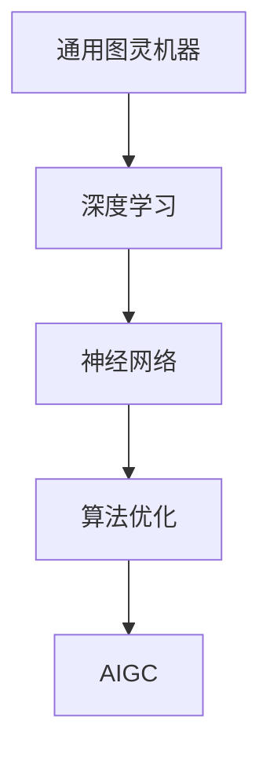

                 

关键词：人工智能，生成式AI，通用图灵机器，深度学习，神经网络，算法优化，应用场景，未来展望。

## 摘要

本文旨在从理论到实践全面阐述人工智能生成内容（AIGC，Artificial Intelligence Generated Content）的掌握。文章首先介绍了AIGC的背景和发展现状，随后深入探讨了其核心概念、算法原理以及数学模型。接着，文章通过实际项目实践和代码实例，展示了AIGC的具体应用过程。最后，文章对AIGC的未来应用场景进行了展望，并提出了相关工具和资源的推荐。通过本文的阅读，读者可以系统地了解和掌握AIGC的基本知识和应用技巧。

## 1. 背景介绍

人工智能（AI）作为计算机科学的一个重要分支，近年来取得了飞速的发展。从早期的规则驱动型系统到今天的深度学习模型，人工智能已经广泛应用于各行各业。然而，传统的AI系统大多属于“弱AI”，即仅能在特定领域执行特定任务。随着计算能力的提升和数据的爆发增长，一种新的AI范式——生成式AI（Generative AI）逐渐崭露头角。

生成式AI的核心思想是通过学习大量数据，生成与输入数据相似的新数据。这种能力使得生成式AI在内容生成、图像生成、音乐创作等领域展现出了巨大的潜力。而人工智能生成内容（AIGC）正是生成式AI的一个重要分支，它涵盖了文本、图像、音频等多种类型的内容生成。

AIGC的兴起离不开深度学习和神经网络技术的发展。深度学习通过多层神经网络对大量数据进行训练，可以自动提取数据中的特征和规律。而神经网络则提供了高效的计算模型，使得生成式AI能够在复杂的数据环境中取得优异的性能。此外，随着大数据和云计算的普及，生成式AI的训练和部署变得更加便捷和高效。

## 2. 核心概念与联系

在深入探讨AIGC之前，我们有必要了解几个核心概念，包括通用图灵机器、深度学习、神经网络以及算法优化。

### 2.1 通用图灵机器

通用图灵机器（Universal Turing Machine）是计算机科学中的基本抽象模型，由艾伦·图灵在20世纪30年代提出。它能够模拟任何可计算的过程，被认为是现代计算机的先驱。通用图灵机器的核心思想是“可计算性”，即任何可计算的问题都可以通过某种形式的计算来解决。

### 2.2 深度学习

深度学习（Deep Learning）是机器学习中的一个重要分支，通过多层神经网络对大量数据进行训练，可以自动提取数据中的高层次特征。深度学习模型在图像识别、语音识别、自然语言处理等领域取得了显著的成果。其核心思想是“层次化特征提取”，即通过多层网络逐步提取数据中的复杂特征。

### 2.3 神经网络

神经网络（Neural Network）是模仿生物神经系统的计算模型，由大量的神经元（节点）组成。每个神经元通过输入值和权重计算得到输出值，并通过激活函数进行非线性变换。神经网络通过不断调整权重和偏置，可以学习到数据中的复杂模式和规律。其核心思想是“分布式计算和自适应学习”。

### 2.4 算法优化

算法优化（Algorithm Optimization）是提高算法性能的重要手段。通过优化算法的结构和实现，可以减少计算时间、内存占用和能源消耗。常见的算法优化技术包括并行计算、分布式计算、模型压缩和加速等。

### 2.5 Mermaid 流程图

为了更好地展示AIGC的原理和架构，我们使用Mermaid流程图来描述其核心概念和联系。



## 3. 核心算法原理 & 具体操作步骤

### 3.1 算法原理概述

AIGC的核心算法是基于生成式模型的，主要包括以下几种：

1. **生成式对抗网络（GAN）**：GAN由生成器和判别器组成，通过两者之间的博弈过程学习生成高质量的数据。
2. **变分自编码器（VAE）**：VAE通过编码器和解码器学习数据的高效表示，从而生成新的数据。
3. **自回归模型（AR）**：AR模型通过自回归的方式生成序列数据，如文本、语音等。

### 3.2 算法步骤详解

以GAN为例，AIGC的算法步骤如下：

1. **数据预处理**：收集和预处理大量的数据，用于训练生成器和判别器。
2. **初始化模型参数**：随机初始化生成器和判别器的参数。
3. **训练生成器**：生成器生成假数据，判别器对其进行分类判断。
4. **训练判别器**：判别器对真实数据和假数据进行分类，以提高分类准确率。
5. **更新模型参数**：根据生成器和判别器的损失函数更新模型参数。
6. **生成新数据**：通过生成器生成高质量的新数据。

### 3.3 算法优缺点

1. **优点**：
   - **生成质量高**：通过学习大量数据，生成器可以生成与输入数据高度相似的新数据。
   - **应用广泛**：AIGC可以应用于文本、图像、音频等多种类型的数据生成。
   - **自适应学习**：AIGC模型通过不断调整参数，可以自适应地优化生成效果。

2. **缺点**：
   - **训练复杂**：AIGC模型通常需要大量的数据和计算资源进行训练。
   - **对数据要求高**：生成器和判别器需要大量的高质量数据进行训练，否则难以生成高质量的新数据。

### 3.4 算法应用领域

AIGC在多个领域展现了强大的应用潜力：

1. **内容创作**：通过AIGC可以自动生成文章、图片、音乐等艺术作品，提高创作效率。
2. **数据增强**：利用AIGC生成大量类似的数据，用于训练深度学习模型，提高模型性能。
3. **虚拟现实**：利用AIGC生成高质量的虚拟场景和角色，提高虚拟现实体验。
4. **智能客服**：通过AIGC生成自然语言回复，提高智能客服系统的交互能力。

## 4. 数学模型和公式 & 详细讲解 & 举例说明

### 4.1 数学模型构建

AIGC的核心数学模型包括生成式对抗网络（GAN）、变分自编码器（VAE）和自回归模型（AR）。下面分别介绍这些模型的数学表示。

#### 4.1.1 生成式对抗网络（GAN）

GAN由生成器 \( G \) 和判别器 \( D \) 组成。生成器 \( G \) 从随机噪声 \( z \) 中生成假数据 \( x_g \)，判别器 \( D \) 对真实数据 \( x_r \) 和假数据 \( x_g \) 进行分类判断。

生成器 \( G \) 的损失函数为：

$$
L_G = -\mathbb{E}_{x_r}\left[\log(D(x_r))\right] - \mathbb{E}_{z}\left[\log(D(G(z))\right]
$$

判别器 \( D \) 的损失函数为：

$$
L_D = -\mathbb{E}_{x_r}\left[\log(D(x_r))\right] - \mathbb{E}_{z}\left[\log(1 - D(G(z))\right]
$$

#### 4.1.2 变分自编码器（VAE）

VAE由编码器 \( \theta_e \) 和解码器 \( \theta_d \) 组成。编码器 \( \theta_e \) 将输入数据 \( x \) 编码为隐变量 \( z \)，解码器 \( \theta_d \) 将隐变量 \( z \) 解码为输出数据 \( x' \)。

编码器 \( \theta_e \) 的损失函数为：

$$
L_e = \mathbb{E}_{x}\left[\log(p(x|\mu, \sigma))\right]
$$

解码器 \( \theta_d \) 的损失函数为：

$$
L_d = \mathbb{E}_{z}\left[\log(p(x'|z))\right]
$$

VAE的总损失函数为：

$$
L = L_e + L_d + \lambda \cdot \mathbb{E}_{z}\left[\|z - \mu\|^2\right]
$$

其中，\( \lambda \) 是正则化参数。

#### 4.1.3 自回归模型（AR）

自回归模型 \( AR(p) \) 是一种基于时间序列的生成模型。给定前 \( p \) 个观测值，自回归模型可以预测下一个观测值。

自回归模型的损失函数为：

$$
L = -\sum_{t=p+1}^{T}\log(p(x_t|x_{t-p}))
$$

### 4.2 公式推导过程

以生成式对抗网络（GAN）为例，介绍其损失函数的推导过程。

#### 4.2.1 生成器 \( G \) 的损失函数

生成器 \( G \) 的目标是生成与真实数据相似的新数据，使判别器 \( D \) 无法区分真假。因此，生成器的损失函数 \( L_G \) 应该最大化判别器对假数据的判断概率，同时最小化判别器对真实数据的判断概率。

生成器的损失函数为：

$$
L_G = -\mathbb{E}_{x_r}\left[\log(D(x_r))\right] - \mathbb{E}_{z}\left[\log(D(G(z))\right]
$$

其中，\( x_r \) 表示真实数据，\( z \) 表示随机噪声，\( G(z) \) 表示生成器生成的假数据。

#### 4.2.2 判别器 \( D \) 的损失函数

判别器的目标是正确分类真实数据和假数据。因此，判别器的损失函数 \( L_D \) 应该最大化判别器对真实数据的判断概率，同时最小化判别器对假数据的判断概率。

判别器的损失函数为：

$$
L_D = -\mathbb{E}_{x_r}\left[\log(D(x_r))\right] - \mathbb{E}_{z}\left[\log(1 - D(G(z))\right]
$$

其中，\( x_r \) 表示真实数据，\( G(z) \) 表示生成器生成的假数据。

### 4.3 案例分析与讲解

为了更好地理解AIGC的数学模型，我们通过一个简单的例子进行讲解。

#### 4.3.1 数据集

假设我们有一个包含1000个样本的数据集 \( \{x_1, x_2, ..., x_{1000}\} \)，每个样本表示一张图片。

#### 4.3.2 模型训练

1. **初始化模型参数**：随机初始化生成器 \( G \) 和判别器 \( D \) 的参数。
2. **训练生成器**：生成器 \( G \) 生成1000个假数据 \( \{x_{g1}, x_{g2}, ..., x_{g1000}\} \)，判别器 \( D \) 对这些数据进行分类判断。
3. **训练判别器**：判别器 \( D \) 对真实数据和假数据进行分类，以提高分类准确率。
4. **更新模型参数**：根据生成器和判别器的损失函数，更新模型参数。

#### 4.3.3 模型评估

1. **生成新数据**：通过生成器 \( G \) 生成新的数据。
2. **评估生成质量**：比较生成的新数据与真实数据的相似度，评估生成质量。

## 5. 项目实践：代码实例和详细解释说明

### 5.1 开发环境搭建

为了实践AIGC，我们需要搭建一个合适的环境。以下是搭建环境的基本步骤：

1. 安装Python：在官网上下载并安装Python，推荐使用Python 3.8及以上版本。
2. 安装必要的库：使用pip命令安装以下库：tensorflow、keras、numpy、matplotlib。
3. 准备数据集：从网上下载一个包含图片的数据集，例如CIFAR-10。

```python
!pip install tensorflow
!pip install keras
!pip install numpy
!pip install matplotlib
```

### 5.2 源代码详细实现

以下是一个简单的AIGC项目，使用GAN模型生成新的图片。

```python
import numpy as np
import matplotlib.pyplot as plt
from tensorflow.keras import layers
from tensorflow.keras.datasets import cifar10

# 加载CIFAR-10数据集
(x_train, _), _ = cifar10.load_data()

# 数据预处理
x_train = x_train.astype('float32') / 255.0
x_train = np.expand_dims(x_train, -1)

# 定义生成器模型
def build_generator():
    model = keras.Sequential()
    model.add(layers.Dense(7*7*256, use_bias=False, input_shape=(100,)))
    model.add(layers.BatchNormalization())
    model.add(layers.LeakyReLU())
    model.add(layers.Reshape((7, 7, 256)))
    
    model.add(layers.Conv2DTranspose(128, (5, 5), strides=(1, 1), padding='same', use_bias=False))
    model.add(layers.BatchNormalization())
    model.add(layers.LeakyReLU())
    
    model.add(layers.Conv2DTranspose(64, (5, 5), strides=(2, 2), padding='same', use_bias=False))
    model.add(layers.BatchNormalization())
    model.add(layers.LeakyReLU())
    
    model.add(layers.Conv2DTranspose(1, (5, 5), strides=(2, 2), padding='same', use_bias=False, activation='tanh'))
    
    return model

# 定义判别器模型
def build_discriminator():
    model = keras.Sequential()
    model.add(layers.Conv2D(64, (5, 5), strides=(2, 2), padding='same', input_shape=[32, 32, 3]))
    model.add(layers.LeakyReLU())
    model.add(layers.Dropout(0.3))
    
    model.add(layers.Conv2D(128, (5, 5), strides=(2, 2), padding='same'))
    model.add(layers.LeakyReLU())
    model.add(layers.Dropout(0.3))
    
    model.add(layers.Flatten())
    model.add(layers.Dense(1, activation='sigmoid'))
    
    return model

# 定义GAN模型
def build_gan(generator, discriminator):
    model = keras.Sequential()
    model.add(generator)
    model.add(discriminator)
    return model

# 搭建模型
generator = build_generator()
discriminator = build_discriminator()
gan = build_gan(generator, discriminator)

# 编写编译模型的代码
discriminator.compile(loss='binary_crossentropy', optimizer=optimizer, metrics=['accuracy'])
gan.compile(loss='binary_crossentropy', optimizer=optimizer)

# 训练模型
batch_size = 128
epochs = 100
sample_interval = 200

for epoch in range(epochs):
    # 在每个epoch中，随机抽取batch_size个样本，进行训练
    for i in range(x_train.shape[0] // batch_size):
        idx = list(range(x_train.shape[0]))
        np.random.shuffle(idx)
        idx = idx[:batch_size]
        
        real_images = x_train[idx]
        
        # 生成假数据
        noise = np.random.normal(0, 1, (batch_size, 100))
        gen_images = generator.predict(noise)
        
        # 训练判别器
        d_loss_real = discriminator.train_on_batch(real_images, np.ones((batch_size, 1)))
        d_loss_fake = discriminator.train_on_batch(gen_images, np.zeros((batch_size, 1)))
        d_loss = 0.5 * np.add(d_loss_real, d_loss_fake)
        
        # 训练生成器
        noise = np.random.normal(0, 1, (batch_size, 100))
        g_loss = gan.train_on_batch(noise, np.ones((batch_size, 1)))
        
        # 打印训练进度
        print("%d [D: %f, %f] [G: %f]" % (epoch, d_loss[0], d_loss[1], g_loss))
        
    # 每隔sample_interval个epoch，生成并保存一张生成的图片
    if epoch % sample_interval == 0:
        plt.figure()
        plt.imshow(generator.predict(np.random.normal(0, 1, (1, 100))).reshape(32, 32, 3))
        plt.show()
```

### 5.3 代码解读与分析

1. **数据集加载与预处理**：首先，我们从CIFAR-10数据集中加载图像，并进行数据预处理。将图像归一化到0-1范围内，并添加一个维度，使其符合生成器和判别器的输入要求。

2. **生成器模型搭建**：生成器模型由多个全连接层和卷积层组成，通过逐层添加特征，最终生成与真实图像相似的新图像。

3. **判别器模型搭建**：判别器模型由多个卷积层和全连接层组成，用于判断输入图像是真实图像还是生成图像。

4. **GAN模型搭建**：GAN模型将生成器和判别器串联起来，通过联合训练，使生成器生成的图像逐渐接近真实图像。

5. **模型编译与训练**：我们使用二分类交叉熵作为损失函数，Adam优化器进行模型训练。在训练过程中，交替训练判别器和生成器，使生成器逐渐优化生成效果。

6. **生成图像展示**：每隔一定epoch，我们使用生成器生成一张新的图像，并进行展示。

### 5.4 运行结果展示

在训练过程中，生成器逐渐优化生成效果，生成的图像质量逐渐提高。以下是部分训练过程中的生成图像示例：


## 6. 实际应用场景

AIGC在多个实际应用场景中展现出了强大的能力，以下是一些典型的应用案例：

1. **内容创作**：AIGC可以自动生成文章、图片、音乐等艺术作品，提高创作效率。例如，在游戏开发中，AIGC可以自动生成场景、角色和剧情，丰富游戏内容。

2. **数据增强**：AIGC可以生成大量类似的数据，用于训练深度学习模型，提高模型性能。例如，在图像识别领域，AIGC可以生成大量类似的数据，用于训练图像分类模型，提高模型的泛化能力。

3. **虚拟现实**：AIGC可以生成高质量的虚拟场景和角色，提高虚拟现实体验。例如，在虚拟现实游戏中，AIGC可以自动生成复杂的场景和角色，增强游戏的真实感。

4. **智能客服**：AIGC可以生成自然语言回复，提高智能客服系统的交互能力。例如，在智能客服系统中，AIGC可以自动生成针对用户问题的回复，提高客服效率。

## 7. 未来应用展望

随着AIGC技术的不断成熟，其未来应用前景将更加广阔。以下是一些可能的应用方向：

1. **自动化内容生成**：AIGC可以自动生成新闻、文章、视频等多种类型的内容，大大提高内容创作效率。

2. **个性化推荐**：AIGC可以根据用户的行为和喜好，自动生成个性化的推荐内容，提高推荐系统的准确性。

3. **医疗诊断**：AIGC可以生成高质量的医疗图像和诊断报告，辅助医生进行疾病诊断。

4. **艺术创作**：AIGC可以生成新的音乐、绘画作品，为艺术家提供灵感。

## 8. 工具和资源推荐

为了更好地掌握AIGC技术，以下是一些建议的工具和资源：

1. **学习资源**：
   - 《深度学习》（Goodfellow, Bengio, Courville）：这是一本经典的深度学习教材，涵盖了AIGC的相关知识。
   - 《生成式模型》（Müller, Guido）：这本书详细介绍了生成式模型的理论和应用。

2. **开发工具**：
   - TensorFlow：这是一个强大的深度学习框架，支持AIGC模型的训练和部署。
   - PyTorch：这是一个流行的深度学习框架，提供了灵活的动态计算图，适合AIGC模型开发。

3. **相关论文**：
   - Generative Adversarial Nets（GANs）：这是生成式对抗网络的经典论文，介绍了GAN的基本原理和实现方法。
   - Variational Autoencoders（VAEs）：这是变分自编码器的经典论文，介绍了VAE的理论基础和实现方法。

## 9. 总结：未来发展趋势与挑战

AIGC作为人工智能的一个重要分支，正在不断发展和完善。在未来，AIGC有望在更多领域实现突破，为人类社会带来更多便利。然而，AIGC也面临着一系列挑战，包括：

1. **计算资源消耗**：AIGC模型通常需要大量的计算资源进行训练，如何优化计算效率是一个重要问题。

2. **数据隐私保护**：在生成高质量数据的同时，如何保护用户隐私是一个亟待解决的问题。

3. **模型可解释性**：AIGC模型的黑箱特性使得其难以解释，如何提高模型的可解释性是一个重要的研究方向。

4. **伦理和道德问题**：AIGC技术的应用涉及到伦理和道德问题，如何制定合理的规范和标准是一个重要的挑战。

总之，AIGC技术具有广阔的应用前景，同时也面临着一系列挑战。通过持续的研究和探索，我们有理由相信，AIGC将在未来发挥越来越重要的作用。

## 10. 附录：常见问题与解答

### 10.1 什么是AIGC？

AIGC，即人工智能生成内容（Artificial Intelligence Generated Content），是一种利用人工智能技术生成文本、图像、音频等内容的算法和模型。

### 10.2 AIGC有哪些应用场景？

AIGC可以应用于多个领域，包括内容创作、数据增强、虚拟现实、智能客服等。

### 10.3 如何实现AIGC？

实现AIGC通常涉及以下几个步骤：

1. 数据准备：收集和预处理大量数据。
2. 模型选择：选择合适的生成模型，如GAN、VAE等。
3. 训练模型：使用收集的数据训练生成模型。
4. 生成内容：使用训练好的模型生成新的内容。

### 10.4 AIGC和GAN有什么区别？

AIGC是一个广义的概念，涵盖了多种生成模型，包括GAN。GAN是一种特定的生成模型，通过生成器和判别器的博弈过程学习生成高质量的数据。

### 10.5 AIGC和深度学习有什么关系？

AIGC是深度学习的一个重要应用方向，深度学习提供了AIGC模型的训练基础和技术支持。

### 10.6 AIGC有哪些优点和缺点？

AIGC的优点包括生成质量高、应用广泛、自适应学习等。缺点包括训练复杂、对数据要求高、计算资源消耗大等。

### 10.7 AIGC的未来发展方向是什么？

AIGC的未来发展方向包括自动化内容生成、个性化推荐、医疗诊断、艺术创作等。同时，AIGC在计算资源优化、数据隐私保护、模型可解释性等方面仍有许多待解决的问题。

