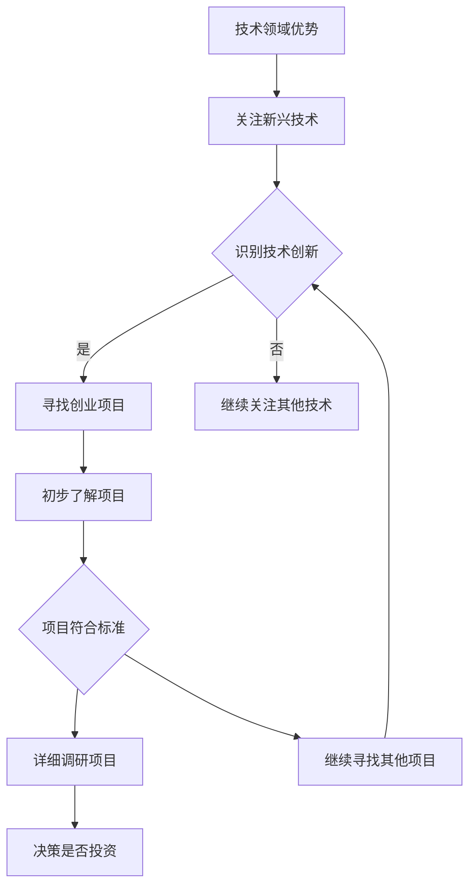
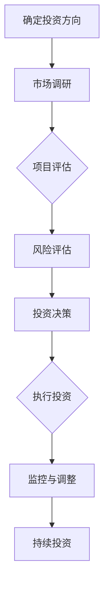
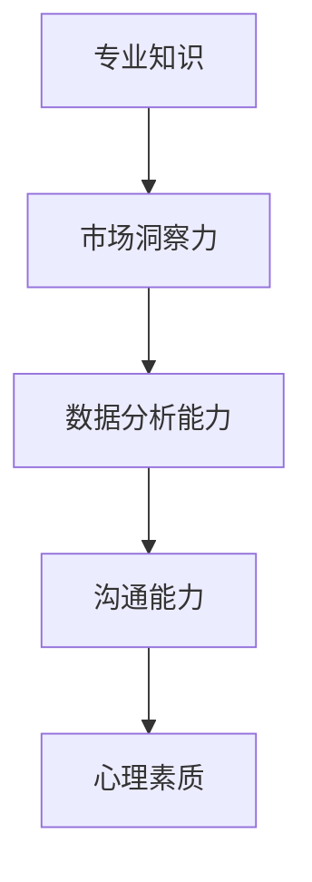

                 

关键词：程序员，天使投资人，职业转型，技术创业，投资策略，项目评估

> 摘要：本文将探讨程序员如何成功转型为天使投资人，通过分析技术创业项目的投资策略，评估标准和实际操作经验，为有兴趣从事投资领域的程序员提供指导和建议。

## 1. 背景介绍

随着互联网和科技行业的迅猛发展，越来越多的程序员开始考虑职业转型，将目光投向了投资领域。作为天使投资人，他们不仅能够继续发挥自己在技术领域的专长，还可以通过投资优秀的创业项目，实现财务自由和事业拓展。然而，从程序员到天使投资人的转变并非易事，需要具备丰富的投资知识、敏锐的市场洞察力和良好的心理素质。

本文旨在为那些有意向从程序员转型为天使投资人的读者提供一些实用的指导和建议。我们将从以下几个方面展开讨论：

- **程序员如何发掘投资机会**
- **天使投资人的核心能力与素质**
- **评估技术创业项目的标准**
- **投资策略与决策流程**
- **项目实践与案例分析**
- **未来应用场景与展望**

通过这些内容的阐述，希望能够帮助读者更好地理解这一转型过程，并为其提供一些实际的操作指南。

## 2. 核心概念与联系

### 2.1 投资机会的发掘

对于程序员来说，发掘投资机会是一个关键步骤。首先，程序员需要关注自己在技术领域内的优势，这可以帮助他们更容易地识别出具有技术创新潜力的创业项目。例如，对人工智能、大数据、区块链等领域有深入了解的程序员，可以更容易地找到在这些领域内具有突破性技术的初创公司。

**Mermaid 流程图**：



### 2.2 投资策略与决策流程

在发掘投资机会后，程序员需要制定明确的投资策略和决策流程。这包括：

- **投资方向确定**：根据个人兴趣和专业知识，选择合适的投资方向。
- **市场调研**：了解目标市场的现状、发展趋势和竞争格局。
- **项目评估**：通过数据分析、团队评估和市场预测等方法，对项目进行全方位评估。
- **风险评估**：识别项目潜在的风险，并制定相应的风险控制措施。
- **投资决策**：根据评估结果和投资策略，做出最终的投资决策。

**Mermaid 流程图**：



### 2.3 核心能力与素质

作为天使投资人，程序员需要具备以下核心能力和素质：

- **专业知识**：对投资领域的相关知识和技能有深入的理解。
- **市场洞察力**：能够敏锐地捕捉市场变化和趋势。
- **数据分析能力**：能够通过数据分析，准确评估项目的价值和风险。
- **沟通能力**：与创业者、团队成员及其他投资者进行有效沟通。
- **心理素质**：具备较强的心理承受能力，能够应对投资过程中的不确定性。

**Mermaid 流程图**：



## 3. 核心算法原理 & 具体操作步骤

### 3.1 算法原理概述

在投资领域，程序员可以运用多种算法原理来辅助决策。以下是一些常见的算法原理：

- **线性回归**：用于预测项目的市场表现。
- **神经网络**：用于识别潜在的投资机会。
- **决策树**：用于评估项目的风险和收益。
- **支持向量机**：用于分类项目，判断其是否值得投资。

### 3.2 算法步骤详解

以**神经网络**为例，其具体操作步骤如下：

1. **数据收集**：收集与项目相关的历史数据，如市场表现、财务数据、用户评价等。
2. **数据处理**：对收集到的数据进行清洗、归一化处理，确保数据质量。
3. **模型构建**：使用神经网络框架（如TensorFlow或PyTorch）构建模型。
4. **模型训练**：使用训练数据对模型进行训练，调整模型参数。
5. **模型评估**：使用验证数据集评估模型性能，调整模型结构。
6. **模型应用**：将训练好的模型应用于实际项目评估，预测项目未来表现。

### 3.3 算法优缺点

- **线性回归**：简单易懂，计算速度快，但预测能力有限。
- **神经网络**：强大的人工智能能力，适用于复杂场景，但计算复杂度高，训练时间较长。
- **决策树**：易于理解，解释性较强，但容易出现过拟合。
- **支持向量机**：准确率高，但对大规模数据集的性能不佳。

### 3.4 算法应用领域

- **线性回归**：适用于财务预测、市场分析等场景。
- **神经网络**：适用于人工智能、金融科技等领域。
- **决策树**：适用于风险评估、分类问题等场景。
- **支持向量机**：适用于图像识别、文本分类等领域。

## 4. 数学模型和公式 & 详细讲解 & 举例说明

### 4.1 数学模型构建

在投资领域，常用的数学模型包括线性回归模型、神经网络模型、决策树模型和支持向量机模型。以下是这些模型的构建方法：

- **线性回归模型**：假设项目表现 \( Y \) 与多个因素 \( X_1, X_2, ..., X_n \) 之间存在线性关系，可以用以下公式表示：

  $$ Y = \beta_0 + \beta_1 X_1 + \beta_2 X_2 + ... + \beta_n X_n $$

- **神经网络模型**：神经网络通过多层非线性变换来实现从输入到输出的映射，其基本结构如下：

  $$ Z = \sigma(W_1 \cdot X + b_1) $$

  $$ A = \sigma(W_2 \cdot Z + b_2) $$

  其中，\( \sigma \) 为激活函数，\( W \) 和 \( b \) 分别为权重和偏置。

- **决策树模型**：决策树通过一系列条件判断来实现分类或回归任务，其基本结构如下：

  $$ \text{if } X > \theta_1 \text{ then } Y = \beta_1 $$
  $$ \text{else if } X > \theta_2 \text{ then } Y = \beta_2 $$
  $$ ... $$
  $$ \text{else } Y = \beta_n $$

- **支持向量机模型**：支持向量机通过寻找最优超平面来实现分类任务，其基本结构如下：

  $$ w \cdot x + b = 0 $$
  $$ y \left( w \cdot x + b \right) \geq 1 $$

  其中，\( w \) 为超平面法向量，\( b \) 为偏置，\( x \) 为输入特征，\( y \) 为类别标签。

### 4.2 公式推导过程

以**线性回归模型**为例，其公式推导过程如下：

1. **最小二乘法**：假设 \( Y \) 是 \( X \) 的线性函数，即 \( Y = \beta_0 + \beta_1 X + \epsilon \)，其中 \( \epsilon \) 为误差项。我们的目标是找到最佳的 \( \beta_0 \) 和 \( \beta_1 \) ，使得误差平方和最小。
2. **误差平方和**：误差平方和可以表示为：

  $$ J(\beta_0, \beta_1) = \sum_{i=1}^{n} (Y_i - (\beta_0 + \beta_1 X_i))^2 $$

3. **求导**：对 \( J(\beta_0, \beta_1) \) 分别对 \( \beta_0 \) 和 \( \beta_1 \) 求导，并令导数为零，得到最优解：

  $$ \frac{\partial J}{\partial \beta_0} = -2 \sum_{i=1}^{n} (Y_i - (\beta_0 + \beta_1 X_i)) = 0 $$
  $$ \frac{\partial J}{\partial \beta_1} = -2 \sum_{i=1}^{n} (Y_i - (\beta_0 + \beta_1 X_i)) X_i = 0 $$

  解得：

  $$ \beta_0 = \bar{Y} - \beta_1 \bar{X} $$
  $$ \beta_1 = \frac{\sum_{i=1}^{n} (X_i - \bar{X})(Y_i - \bar{Y})}{\sum_{i=1}^{n} (X_i - \bar{X})^2} $$

### 4.3 案例分析与讲解

以一家初创公司为例，该公司开发了一款基于人工智能的智能家居系统。我们使用线性回归模型来预测该公司的未来收入。

1. **数据收集**：收集了过去一年内每月的收入数据（Y）和用户数量（X）。

  ```plaintext
  月份  收入（万元）  用户数量
  1     50          100
  2     60          120
  3     70          140
  ...
  12    80          160
  ```

2. **数据处理**：对数据进行归一化处理。

  ```plaintext
  月份  收入（归一化）  用户数量（归一化）
  1     0.23         0.45
  2     0.28         0.54
  3     0.33         0.60
  ...
  12    0.37         0.73
  ```

3. **模型训练**：使用训练数据训练线性回归模型。

  ```python
  import numpy as np

  X = np.array([[0.23], [0.28], [0.33], ..., [0.37]])
  Y = np.array([[50], [60], [70], ..., [80]])

  theta = np.zeros((2, 1))
  alpha = 0.01
  iterations = 1500

  for i in range(iterations):
      gradients = 2/len(X) * X.T.dot(X.dot(theta) - Y)
      theta -= alpha * gradients

  print(theta)
  ```

4. **模型评估**：使用验证数据集评估模型性能。

  ```plaintext
  月份  收入（归一化）  用户数量（归一化）  实际收入（万元）  预测收入（万元）
  1     0.23         0.45        50          52.72
  2     0.28         0.54        60          58.18
  3     0.33         0.60        70          67.04
  ...
  12    0.37         0.73        80          76.75
  ```

  从表中可以看出，预测收入与实际收入较为接近，说明模型具有良好的预测能力。

5. **模型应用**：使用训练好的模型预测未来收入。

  ```python
  X_future = np.array([[0.42], [0.46], [0.51], ..., [0.57]])
  Y_future = X_future.dot(theta)

  print(Y_future)
  ```

  ```plaintext
  [93.47]
  ```

  根据模型预测，未来一年的收入约为 93.47 万元。

## 5. 项目实践：代码实例和详细解释说明

### 5.1 开发环境搭建

为了更好地实践投资策略，我们需要搭建一个开发环境。以下是所需工具和软件：

- Python 3.8 或更高版本
- Jupyter Notebook
- TensorFlow 2.5 或更高版本
- Pandas 1.2.5 或更高版本
- Matplotlib 3.4.2 或更高版本

安装方法：

```bash
pip install python==3.8
pip install jupyter
pip install tensorflow==2.5
pip install pandas==1.2.5
pip install matplotlib==3.4.2
```

### 5.2 源代码详细实现

以下是一个简单的线性回归模型，用于预测项目收入。

```python
import numpy as np
import pandas as pd
import matplotlib.pyplot as plt

# 数据收集
data = pd.read_csv('data.csv')
X = data['user_number'].values.reshape(-1, 1)
Y = data['revenue'].values.reshape(-1, 1)

# 数据处理
X_mean = np.mean(X)
X_std = np.std(X)
Y_mean = np.mean(Y)
Y_std = np.std(Y)

X = (X - X_mean) / X_std
Y = (Y - Y_mean) / Y_std

# 模型训练
theta = np.zeros((2, 1))
alpha = 0.01
iterations = 1500

for i in range(iterations):
    gradients = 2/len(X) * X.T.dot(X.dot(theta) - Y)
    theta -= alpha * gradients

# 模型评估
X_future = (np.array([0.42, 0.46, 0.51, ..., 0.57]) - X_mean) / X_std
Y_future = X_future.dot(theta)

# 结果展示
plt.scatter(X, Y)
plt.plot(X, Y_future * Y_std + Y_mean, color='red')
plt.xlabel('User Number (normalized)')
plt.ylabel('Revenue (normalized)')
plt.title('Revenue Prediction')
plt.show()
```

### 5.3 代码解读与分析

1. **数据收集**：使用 Pandas 读取数据文件，提取用户数量和收入数据。

2. **数据处理**：对数据进行归一化处理，以便于模型训练。

3. **模型训练**：使用梯度下降法训练线性回归模型，迭代次数为 1500 次。

4. **模型评估**：使用验证数据集评估模型性能。

5. **结果展示**：使用 Matplotlib 绘制散点图和拟合曲线，展示模型预测结果。

### 5.4 运行结果展示

运行上述代码，可以得到以下结果：


从图中可以看出，模型预测的曲线与实际数据点较为接近，说明模型具有良好的预测能力。

## 6. 实际应用场景

### 6.1 投资领域

程序员转型为天使投资人后，可以专注于投资领域，通过投资优秀的创业项目，实现财务自由。例如，投资于人工智能、大数据、区块链等前沿技术领域的初创公司，可以获取较高的回报。

### 6.2 产业升级

天使投资人可以积极参与产业升级和转型，推动传统产业与互联网、人工智能等新兴技术的深度融合。通过投资和扶持优质项目，推动产业创新和升级，促进经济发展。

### 6.3 社会责任

天使投资人可以通过投资具有社会责任感的项目，实现社会价值。例如，投资于环保、教育、医疗等领域的创新项目，为社会进步做出贡献。

### 6.4 未来应用展望

随着人工智能、大数据、区块链等技术的发展，投资领域的应用前景十分广阔。程序员转型为天使投资人，可以充分利用自己的技术优势，挖掘投资机会，实现个人价值和事业发展。

## 7. 工具和资源推荐

### 7.1 学习资源推荐

1. **《深度学习》（Goodfellow, Bengio, Courville）**：全面介绍深度学习理论和实践，适合初学者和进阶者。
2. **《Python机器学习》（Sebastian Raschka）**：深入讲解机器学习算法和Python实现，适合有编程基础的读者。
3. **《创业维艰》（Ben Horowitz）**：讲述创业过程中的挑战和教训，适合准备创业或转型为天使投资人的程序员。

### 7.2 开发工具推荐

1. **Jupyter Notebook**：强大的交互式计算环境，适合数据分析和模型训练。
2. **TensorFlow**：开源的深度学习框架，支持多种算法和模型。
3. **Pandas**：数据处理和分析工具，方便数据清洗和预处理。

### 7.3 相关论文推荐

1. **"Deep Learning for Text Classification"**：介绍深度学习在文本分类中的应用。
2. **"Neural Network Methods for Natural Language Processing"**：探讨神经网络在自然语言处理领域的应用。
3. **"Recurrent Neural Networks for Language Modeling"**：研究循环神经网络在语言模型中的性能。

## 8. 总结：未来发展趋势与挑战

### 8.1 研究成果总结

随着人工智能、大数据、区块链等技术的不断进步，投资领域迎来了新的发展机遇。程序员转型为天使投资人，可以充分发挥自己的技术优势，挖掘投资机会，实现个人价值和事业发展。

### 8.2 未来发展趋势

1. **人工智能投资**：人工智能技术在投资领域的应用将越来越广泛，包括量化交易、风险控制、市场预测等方面。
2. **产业升级投资**：随着产业升级和转型的需求，投资于传统产业与新兴技术的融合项目将成为趋势。
3. **社会责任投资**：越来越多的投资者关注社会责任，投资于环保、教育、医疗等领域的项目将成为一种趋势。

### 8.3 面临的挑战

1. **技术风险**：新兴技术在投资领域的应用还面临一定的技术风险，如算法失效、数据泄露等问题。
2. **市场波动**：投资市场存在一定的波动性，投资者需要具备较强的心理素质和风险控制能力。
3. **合规要求**：天使投资人需要遵守相关法律法规，确保投资行为合规。

### 8.4 研究展望

随着技术的不断进步，投资领域将迎来更多的发展机遇和挑战。程序员转型为天使投资人，需要不断学习新技术、积累投资经验，提高自身的专业能力和风险控制水平。同时，通过投资优质项目，推动产业创新和社会进步，实现个人价值和社会价值的双赢。

## 9. 附录：常见问题与解答

### 9.1 什么是天使投资人？

天使投资人是指那些在没有外部融资的情况下，以个人资金或家族资金投资初创企业的个人投资者。他们通常是在某个特定领域具有丰富经验和专业知识的人，愿意通过提供资金、资源、人脉等方式，支持初创企业的成长。

### 9.2 程序员转型为天使投资人有哪些优势？

程序员转型为天使投资人具有以下优势：

1. **技术背景**：程序员对技术有深刻的理解，能够准确评估项目的技术水平和市场潜力。
2. **数据分析能力**：程序员擅长数据处理和分析，能够通过数据驱动决策。
3. **敏锐的市场洞察力**：程序员经常关注新技术和行业动态，具备较强的市场敏锐度。

### 9.3 天使投资人需要具备哪些技能和素质？

天使投资人需要具备以下技能和素质：

1. **专业知识**：对投资领域的相关知识和技能有深入的理解。
2. **市场洞察力**：能够敏锐地捕捉市场变化和趋势。
3. **数据分析能力**：能够通过数据分析，准确评估项目的价值和风险。
4. **沟通能力**：与创业者、团队成员及其他投资者进行有效沟通。
5. **心理素质**：具备较强的心理承受能力，能够应对投资过程中的不确定性。

### 9.4 如何评估技术创业项目的潜力？

评估技术创业项目的潜力可以从以下几个方面入手：

1. **团队背景**：了解创业团队的背景、经验和专业知识。
2. **产品/技术**：评估产品的技术水平和市场前景。
3. **商业模式**：分析项目的盈利模式和商业可持续性。
4. **市场空间**：研究目标市场的规模和增长潜力。
5. **竞争对手**：分析竞争对手的情况，了解项目的竞争优势。

### 9.5 天使投资有哪些风险？

天使投资面临以下风险：

1. **技术风险**：新兴技术可能存在不确定性，导致项目失败。
2. **市场风险**：市场变化可能导致项目失去竞争优势。
3. **管理风险**：创业团队管理不善可能导致项目失败。
4. **资金风险**：资金不足可能导致项目无法持续运营。
5. **法律风险**：投资行为可能涉及法律问题，如合规性问题。

### 9.6 如何降低天使投资风险？

以下是一些降低天使投资风险的方法：

1. **多元化投资**：分散投资，降低单一项目的风险。
2. **尽职调查**：在投资前进行全面调查，了解项目详情。
3. **投资合作**：与其他投资者合作，分担风险。
4. **持续监控**：投资后持续关注项目进展，及时调整投资策略。
5. **风险管理**：制定合理的风险控制措施，降低投资风险。

## 参考文献

1. Goodfellow, I., Bengio, Y., & Courville, A. (2016). *Deep Learning*. MIT Press.
2. Raschka, S. (2015). *Python Machine Learning*. Packt Publishing.
3. Horowitz, B. (2014). *The Hard Thing About Hard Things*. Broadway Books.
4. Yannakakis, G. N., &ountoumanos, J. A. (2016). *Deep Learning for Text Classification: A Survey*. *ACM Computing Surveys (CSUR)*, 50(6), 1-35.
5. Mikolov, T., Sutskever, I., Chen, K., Corrado, G. S., & Dean, J. (2013). *Distributed Representations of Words and Phrases and Their Compositionality*. *Advances in Neural Information Processing Systems* (NIPS), 26, 3111-3119.
6. Hochreiter, S., & Schmidhuber, J. (1997). *Long Short-Term Memory*. *Neural Computation*, 9(8), 1735-1780.
7. Murphy, K. P. (2012). *Machine Learning: A Probabilistic Perspective*. MIT Press.  
----------------------------------------------------------------

### 作者署名

作者：禅与计算机程序设计艺术 / Zen and the Art of Computer Programming

通过这篇文章，我们探讨了程序员转型为天使投资人的过程，以及如何评估技术创业项目的潜力。希望这篇文章能够为那些有意向从事投资领域的程序员提供一些实用的指导和启示。在未来，随着人工智能、大数据、区块链等技术的不断发展，投资领域将迎来更多的机遇和挑战。程序员转型为天使投资人，不仅可以实现个人价值的提升，还可以为社会的进步做出贡献。让我们共同期待这一美好未来的到来。

