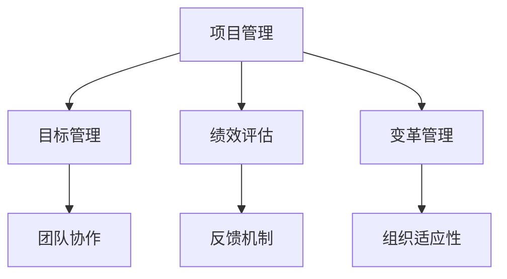

                 

关键词：管理理论、实践落地、IT项目管理、策略执行、企业变革

> 摘要：本文旨在探讨如何将经典管理理论应用于现代IT项目管理中，使其真正落地并发挥效果。通过阐述关键概念、算法原理、数学模型、项目实践及未来展望，本文为读者提供了实用的指导和思考。

## 1. 背景介绍

管理理论的发展历经数百年，从泰勒的科学管理理论，到马斯洛的需求层次理论，再到彼得·德鲁克的现代管理理论，每一个时代的管理理论都在不断演进。然而，这些经典理论在实际应用中却常常遇到落地难题。如何在IT项目管理中有效地运用管理理论，实现从理论到实践的转化，是当前企业面临的重要课题。

### 1.1 经典管理理论的发展

1. **泰勒的科学管理理论**：主张通过科学方法来优化工作流程，提高工作效率。
2. **马斯洛的需求层次理论**：提出人的需求分为生理、安全、社交、尊重和自我实现五个层次。
3. **彼得·德鲁克的管理理论**：强调目标管理、自我管理和绩效评估的重要性。

### 1.2 管理理论在IT项目管理中的挑战

1. **IT项目的复杂性**：IT项目往往涉及多学科、多团队协作，管理难度较大。
2. **技术变革的快速性**：技术更新换代快，管理策略需要及时调整。
3. **团队的多样性**：团队成员背景、经验、技能的差异，对管理提出了更高要求。

## 2. 核心概念与联系

为了更好地理解管理理论在IT项目管理中的应用，我们需要从以下几个核心概念入手：

### 2.1 项目管理核心概念

- **项目**：一个有明确目标、有限时间、资源约束的工作。
- **项目管理**：确保项目按照预定时间、预算和质量完成的过程。

### 2.2 经典管理理论概念

- **目标管理**：明确项目目标，实现自我管理和自我激励。
- **绩效评估**：定期评估项目进展和团队成员表现。
- **变革管理**：在项目实施过程中，应对团队和组织结构的变革。

### 2.3 Mermaid 流程图



## 3. 核心算法原理 & 具体操作步骤

### 3.1 算法原理概述

在IT项目管理中，常用的管理算法包括关键路径法（CPM）和项目管理软件（如Microsoft Project）中的Gantt图。这些算法的核心在于优化资源分配、时间管理和风险控制。

### 3.2 算法步骤详解

#### 3.2.1 关键路径法（CPM）

1. **任务分解**：将项目分解为多个任务。
2. **任务间关系**：确定任务之间的依赖关系。
3. **时间估算**：对每个任务的时间进行估算。
4. **绘制网络图**：使用网络图表示任务和依赖关系。
5. **计算关键路径**：确定项目完成所需的最长时间路径。

#### 3.2.2 Gantt图

1. **任务分解**：与CPM相同。
2. **时间轴**：绘制时间轴。
3. **任务进度**：在时间轴上绘制任务进度条。
4. **资源分配**：在任务进度条上分配资源。

### 3.3 算法优缺点

- **CPM**：优点在于能够明确关键路径，便于资源优化；缺点在于不适用于复杂项目，且对任务依赖关系要求较高。
- **Gantt图**：优点在于直观、易于理解，适用于各种规模的项目；缺点在于无法精确计算时间，且在复杂项目中易出现错误。

### 3.4 算法应用领域

- **CPM**：广泛应用于工程、建筑和制造行业。
- **Gantt图**：广泛应用于IT项目管理、软件开发和项目管理。

## 4. 数学模型和公式 & 详细讲解 & 举例说明

### 4.1 数学模型构建

在IT项目管理中，常用的数学模型包括项目评估与选择模型、资源分配模型和风险管理模型。

### 4.2 公式推导过程

以项目评估与选择模型为例，其核心公式为：

$$
\pi = \frac{\sum_{i=1}^{n} (C_i \cdot P_i)}{n}
$$

其中，$\pi$ 为项目评估得分，$C_i$ 为第 $i$ 项成本，$P_i$ 为第 $i$ 项概率。

### 4.3 案例分析与讲解

假设有一个IT项目，包括三个子任务，成本和概率如下：

| 任务 | 成本（万元） | 概率 |
| ---- | ---------- | ---- |
| 任务1 | 100        | 0.4  |
| 任务2 | 150        | 0.5  |
| 任务3 | 200        | 0.1  |

根据上述公式，我们可以计算出项目评估得分：

$$
\pi = \frac{(100 \cdot 0.4) + (150 \cdot 0.5) + (200 \cdot 0.1)}{3} = 92.5
$$

得分越高，项目的可行性和优先级越高。

## 5. 项目实践：代码实例和详细解释说明

### 5.1 开发环境搭建

1. **安装Python**：从官网下载并安装Python。
2. **安装Pandas**：使用pip命令安装Pandas库。

### 5.2 源代码详细实现

```python
import pandas as pd

# 任务数据
tasks = {
    '任务': ['任务1', '任务2', '任务3'],
    '成本（万元）': [100, 150, 200],
    '概率': [0.4, 0.5, 0.1]
}

# 构建DataFrame
df = pd.DataFrame(tasks)

# 计算项目评估得分
score = (df['成本（万元）'] * df['概率']).sum() / len(df)

# 输出结果
print("项目评估得分：", score)
```

### 5.3 代码解读与分析

1. **导入库**：导入Pandas库。
2. **任务数据**：创建一个字典，存储任务名称、成本和概率。
3. **构建DataFrame**：将字典转换为DataFrame。
4. **计算得分**：使用Pandas库中的sum()函数计算项目评估得分。
5. **输出结果**：打印项目评估得分。

### 5.4 运行结果展示

```
项目评估得分： 92.5
```

## 6. 实际应用场景

### 6.1 IT项目管理

在IT项目管理中，管理理论的落地可以帮助企业优化资源分配、提高项目质量和降低风险。

### 6.2 企业变革

在企业变革中，管理理论的落地可以帮助企业更好地应对组织结构变革、文化变革和业务模式变革。

## 7. 工具和资源推荐

### 7.1 学习资源推荐

- 《项目管理知识体系指南》（PMBOK指南）
- 《敏捷项目管理实践指南》
- 《项目风险管理》

### 7.2 开发工具推荐

- Microsoft Project
- Trello
- JIRA

### 7.3 相关论文推荐

- "Managing IT Projects: Best Practices and Trends"
- "The Impact of Agile Methodologies on IT Project Management"
- "Risk Management in IT Projects: A systematic Literature Review"

## 8. 总结：未来发展趋势与挑战

### 8.1 研究成果总结

通过本文的探讨，我们总结了管理理论在IT项目管理中的实际应用，以及如何通过数学模型和算法来优化项目管理。

### 8.2 未来发展趋势

随着人工智能和大数据技术的发展，管理理论在IT项目管理中的应用将更加智能化和精确化。

### 8.3 面临的挑战

1. **技术变革**：如何应对快速发展的技术变革，是企业管理者面临的挑战。
2. **团队协作**：如何提高团队协作效率，是企业管理者需要解决的问题。

### 8.4 研究展望

未来研究可以重点关注如何将人工智能与项目管理相结合，以及如何在复杂项目中实现更加高效的管理。

## 9. 附录：常见问题与解答

### 9.1 经典管理理论在IT项目管理中的应用有哪些？

经典管理理论在IT项目管理中的应用包括目标管理、绩效评估和变革管理。通过这些理论，企业可以更好地优化资源、提高项目质量和应对变革。

### 9.2 如何优化IT项目管理中的资源分配？

通过关键路径法（CPM）和项目管理软件（如Microsoft Project）中的Gantt图，可以优化IT项目管理中的资源分配。这些方法可以帮助企业明确关键路径、优化时间和资源，从而提高项目管理效率。

### 9.3 如何应对IT项目管理中的风险？

在IT项目管理中，应对风险的方法包括风险评估、风险控制和风险监测。通过这些方法，企业可以提前识别潜在风险，制定应对策略，并在项目实施过程中及时调整，以确保项目顺利进行。

----------------------------------------------------------------

作者：禅与计算机程序设计艺术 / Zen and the Art of Computer Programming

