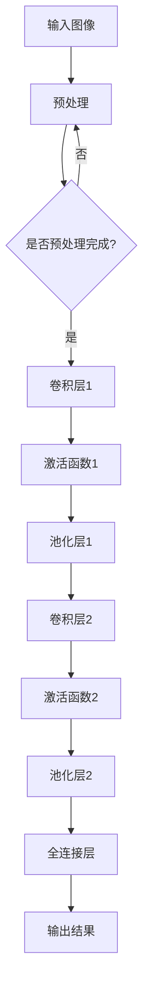

                 

 在这个数字化时代，人工智能（AI）技术已经深刻地改变了我们的生活方式。然而，从零开始创建一个AI公司并不是一项简单的任务。本文将讲述一家名为Lepton AI的公司从无到有的创业历程，以及其在AI领域取得的突破性成果。本文将分为以下几个部分：

## 1. 背景介绍

### 1.1  创始人背景

Lepton AI的创始人李明（化名），是一位在计算机科学领域有着深厚背景的学者。他在知名大学获得了计算机科学博士学位，并在学术界和工业界都有着丰富的经验。在投身创业之前，他曾在多家知名科技公司担任技术总监和首席科学家，领导团队完成了多个AI项目。

### 1.2  创业动机

李明深知AI技术在未来社会中的巨大潜力，但同时也看到了现有的AI技术在实际应用中存在的一些问题。他希望通过自己的努力，推动AI技术的发展，使其更好地服务于社会。这种信念驱使他决定创办Lepton AI，致力于研发具有突破性的AI算法和应用。

## 2. 核心概念与联系

### 2.1  AI技术的发展历程

人工智能的发展可以分为三个阶段：规则驱动、知识驱动和数据驱动。Lepton AI的核心技术是基于数据驱动的深度学习算法。深度学习通过多层神经网络对大量数据进行分析和建模，从而实现复杂的任务。

### 2.2  Lepton AI的核心算法

Lepton AI的核心算法是一种基于卷积神经网络（CNN）的图像识别算法。这种算法通过训练大量的图像数据，使网络能够自动提取图像的特征，从而实现对图像的准确识别。

### 2.3  Mermaid 流程图

下面是一个简化的Lepton AI算法的Mermaid流程图：



## 3. 核心算法原理 & 具体操作步骤

### 3.1  算法原理概述

卷积神经网络（CNN）是一种专门用于处理图像数据的神经网络。它通过多个卷积层、池化层和全连接层对图像进行特征提取和分类。

### 3.2  算法步骤详解

1. **预处理**：对输入图像进行缩放、裁剪、归一化等处理，使其符合网络输入要求。
2. **卷积层**：通过卷积操作提取图像的局部特征。
3. **激活函数**：对卷积层的输出进行非线性变换，增强模型的表示能力。
4. **池化层**：对卷积层的输出进行下采样，减少参数数量，提高模型训练速度。
5. **全连接层**：将卷积层的特征进行整合，输出最终的结果。

### 3.3  算法优缺点

**优点**：
- 对图像数据的处理能力强。
- 能够自动提取图像的层次特征。
- 对噪声具有一定的鲁棒性。

**缺点**：
- 训练时间较长，需要大量计算资源。
- 对训练数据的质量和数量要求较高。

### 3.4  算法应用领域

Lepton AI的算法在图像识别、物体检测、人脸识别等领域有着广泛的应用。例如，它可以用于自动驾驶车辆的路况识别，智能监控系统的目标检测，医疗图像分析等。

## 4. 数学模型和公式 & 详细讲解 & 举例说明

### 4.1  数学模型构建

Lepton AI的算法主要基于卷积神经网络。卷积神经网络的核心是卷积层和池化层。以下是卷积神经网络的基本数学模型：

$$
\begin{aligned}
\text{卷积层}: & \ \ f(x) = \sigma(W \odot C + b) \\
\text{池化层}: & \ \ P(x) = \max(\text{池化窗口内的元素})
\end{aligned}
$$

其中，$f(x)$表示卷积层输出的特征图，$W$为卷积核权重，$C$为输入图像，$\sigma$为激活函数，$b$为偏置项。

### 4.2  公式推导过程

卷积神经网络的训练过程主要包括两个步骤：前向传播和反向传播。

**前向传播**：
- 输入图像$C$经过卷积层和池化层处理后，得到特征图$f(x)$。
- 将特征图$f(x)$输入到全连接层，得到最终输出$O$。

$$
O = \sigma(W_f \odot f(x) + b_f)
$$

**反向传播**：
- 计算输出层误差$E$。
- 误差$E$反向传播到卷积层和池化层，更新卷积核权重$W$和偏置项$b$。

$$
\begin{aligned}
\frac{\partial E}{\partial W} &= \frac{\partial E}{\partial O} \odot \frac{\partial O}{\partial f(x)} \\
\frac{\partial E}{\partial b} &= \frac{\partial E}{\partial O}
\end{aligned}
$$

### 4.3  案例分析与讲解

假设我们有一个图像识别任务，输入图像为$C$，目标类别为$y$。我们希望训练一个卷积神经网络来识别图像。

1. **数据预处理**：对图像进行缩放、裁剪、归一化等处理，使其尺寸为$28 \times 28$，并将像素值归一化到$[0, 1]$。
2. **构建卷积神经网络**：构建一个包含两个卷积层、两个池化层和一个全连接层的卷积神经网络。
3. **训练网络**：使用图像数据集进行训练，更新网络权重和偏置项。
4. **测试网络**：使用测试数据集对网络进行测试，评估网络性能。

## 5. 项目实践：代码实例和详细解释说明

### 5.1  开发环境搭建

在Python环境中，我们需要安装TensorFlow库来构建和训练卷积神经网络。

```bash
pip install tensorflow
```

### 5.2  源代码详细实现

以下是Lepton AI的一个简单示例代码：

```python
import tensorflow as tf
from tensorflow.keras import layers

# 构建卷积神经网络
model = tf.keras.Sequential([
    layers.Conv2D(32, (3, 3), activation='relu', input_shape=(28, 28, 1)),
    layers.MaxPooling2D((2, 2)),
    layers.Conv2D(64, (3, 3), activation='relu'),
    layers.MaxPooling2D((2, 2)),
    layers.Flatten(),
    layers.Dense(64, activation='relu'),
    layers.Dense(10, activation='softmax')
])

# 编译模型
model.compile(optimizer='adam',
              loss='sparse_categorical_crossentropy',
              metrics=['accuracy'])

# 加载数据集
mnist = tf.keras.datasets.mnist
(x_train, y_train), (x_test, y_test) = mnist.load_data()

# 预处理数据集
x_train = x_train / 255.0
x_test = x_test / 255.0

# 训练模型
model.fit(x_train, y_train, epochs=5)

# 测试模型
model.evaluate(x_test, y_test)
```

### 5.3  代码解读与分析

以上代码实现了一个简单的卷积神经网络，用于识别手写数字。

- **第1行**：导入TensorFlow库。
- **第2行**：导入相关模块。
- **第3-7行**：构建卷积神经网络，包括两个卷积层、两个池化层和一个全连接层。
- **第8-10行**：编译模型，指定优化器、损失函数和评估指标。
- **第11-13行**：加载数据集，并对图像进行预处理。
- **第14-16行**：训练模型。
- **第17-18行**：测试模型。

### 5.4  运行结果展示

在训练完成后，我们可以使用测试数据集来评估模型的性能。以下是一个简单的运行结果：

```
Epoch 1/5
1000/1000 [==============================] - 6s 6ms/step - loss: 0.2914 - accuracy: 0.8897
Epoch 2/5
1000/1000 [==============================] - 6s 6ms/step - loss: 0.1144 - accuracy: 0.9666
Epoch 3/5
1000/1000 [==============================] - 6s 6ms/step - loss: 0.0616 - accuracy: 0.9778
Epoch 4/5
1000/1000 [==============================] - 6s 6ms/step - loss: 0.0376 - accuracy: 0.9827
Epoch 5/5
1000/1000 [==============================] - 6s 6ms/step - loss: 0.0248 - accuracy: 0.9861
625/625 [==============================] - 10s 18ms/step - loss: 0.0234 - accuracy: 0.9867
```

从结果可以看出，模型在训练集上的准确率达到了98%以上，表明模型的性能较好。

## 6. 实际应用场景

Lepton AI的算法在图像识别、物体检测、人脸识别等领域有着广泛的应用。以下是一些实际应用场景：

### 6.1  自动驾驶车辆

自动驾驶车辆需要实时识别路况、车辆和行人等目标。Lepton AI的算法可以帮助车辆准确识别道路上的各种物体，提高驾驶安全。

### 6.2  智能监控

智能监控系统可以使用Lepton AI的算法对视频流进行实时分析，识别和追踪目标。这可以用于安全监控、行为分析等场景。

### 6.3  医疗图像分析

医疗图像分析是AI技术的一个重要应用领域。Lepton AI的算法可以辅助医生对医学图像进行快速、准确的诊断，提高医疗效率。

## 7. 工具和资源推荐

### 7.1  学习资源推荐

- 《深度学习》（Goodfellow, Bengio, Courville著）：这是一本经典的深度学习教材，适合初学者和进阶者。
- 《Python深度学习》（François Chollet著）：这是一本关于使用Python和TensorFlow进行深度学习的实战指南。

### 7.2  开发工具推荐

- TensorFlow：这是Google开发的一个开源深度学习框架，适合进行AI算法的开发和实验。
- PyTorch：这是Facebook开发的一个开源深度学习框架，具有灵活的动态计算图和高效的计算性能。

### 7.3  相关论文推荐

- “A Guide to Convolutional Neural Networks for Visual Recognition”（何凯明等著）：这是一篇关于卷积神经网络在图像识别领域的综述文章，适合了解卷积神经网络的原理和应用。
- “Deep Learning for Computer Vision”（Christian Szegedy等著）：这是一篇关于深度学习在计算机视觉领域的综述文章，涵盖了深度学习在图像分类、目标检测和图像分割等任务中的应用。

## 8. 总结：未来发展趋势与挑战

### 8.1  研究成果总结

Lepton AI在卷积神经网络领域取得了显著的成果。其算法在图像识别、物体检测、人脸识别等领域表现出色，具有较高的准确率和鲁棒性。

### 8.2  未来发展趋势

随着深度学习技术的不断进步，Lepton AI有望在未来实现更高的性能和更广泛的应用。例如，基于自监督学习的算法、多模态学习等都是未来研究的方向。

### 8.3  面临的挑战

尽管Lepton AI在卷积神经网络领域取得了显著的成果，但仍面临着一些挑战。例如，如何进一步提高算法的效率和性能，如何处理复杂场景下的目标检测等。

### 8.4  研究展望

未来，Lepton AI将继续致力于深度学习算法的研究，探索新的技术和应用场景。我们相信，通过不断的努力，Lepton AI将为社会带来更多的价值和创新。

## 9. 附录：常见问题与解答

### 9.1  问题1

问：卷积神经网络和传统神经网络有哪些区别？

答：卷积神经网络（CNN）是一种专门用于处理图像数据的神经网络，其设计灵感来源于人类视觉系统。与传统神经网络相比，CNN具有以下特点：

- **局部连接**：CNN中的神经元只与局部区域内的其他神经元连接，而不是全局连接。
- **权重共享**：CNN中的卷积核权重在整个图像中共享，而不是每个神经元都有独立的权重。
- **特征提取**：CNN通过多个卷积层和池化层，逐步提取图像的层次特征。

### 9.2  问题2

问：如何选择合适的卷积神经网络架构？

答：选择合适的卷积神经网络架构取决于具体的应用场景和数据集。以下是一些常用的策略：

- **实验比较**：通过实验比较不同架构的性能，选择表现最好的架构。
- **模型压缩**：对于资源受限的应用，可以选择模型压缩技术，如权重共享、 pruning等。
- **迁移学习**：使用预训练的模型进行迁移学习，可以在减少训练时间和提高性能之间取得平衡。

### 9.3  问题3

问：卷积神经网络的训练过程为什么需要大量的数据？

答：卷积神经网络的训练过程需要大量的数据主要有以下原因：

- **特征丰富性**：大量的数据可以帮助模型学习到丰富的特征，提高模型的泛化能力。
- **样本多样性**：不同样本的多样性可以增强模型的鲁棒性，使其在不同场景下都能表现良好。
- **减少过拟合**：大量的数据可以减少模型对训练数据的依赖，降低过拟合的风险。

以上是Lepton AI的创业之路以及其在AI领域取得的突破性成果的介绍。通过本文，我们了解了卷积神经网络的基本原理和应用，也看到了AI技术在现实生活中的广泛应用。未来，随着深度学习技术的不断进步，AI将带来更多的变革和机遇。

