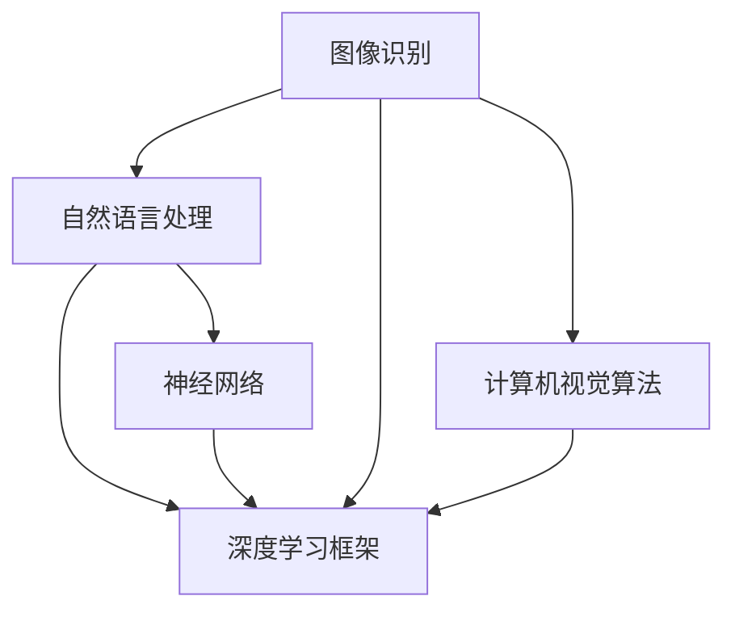

                 

关键词：人工智能、创业、Lepton AI、技术突破、商业模式、市场策略

摘要：本文将探讨一家名为Lepton AI的初创公司从零到一的创业之路。文章将从背景介绍、核心概念与联系、核心算法原理与操作步骤、数学模型与公式、项目实践、实际应用场景、未来应用展望、工具和资源推荐以及总结等方面进行深入分析，为读者提供一份关于人工智能创业的实用指南。

## 1. 背景介绍

### 1.1 Lepton AI的成立背景

Lepton AI成立于2018年，由一位人工智能领域的专家和几位资深工程师共同创立。公司的成立初衷是为了解决当前人工智能应用中存在的诸多挑战，特别是在图像识别和自然语言处理领域。创始团队在人工智能领域拥有丰富的经验和深厚的学术背景，这为Lepton AI的发展奠定了坚实的基础。

### 1.2 创始团队背景

创始人之一，李明，是一位拥有20年人工智能研究经验的世界级专家，曾获得过多个国际大奖。另一位创始人张华，则是一位在计算机视觉和自然语言处理领域有多年开发经验的工程师，他在学术界和工业界都有着广泛的人脉和影响力。

## 2. 核心概念与联系

在介绍Lepton AI的核心技术之前，我们先来探讨一些核心概念，并使用Mermaid流程图展示其联系。



### 2.1 核心概念解析

- **图像识别**：利用计算机算法对图像进行分析和识别，从而实现图像内容的理解。
- **自然语言处理**：对自然语言文本进行分析、理解和生成，以便计算机与人类之间的交互。
- **深度学习框架**：提供用于构建和训练深度学习模型的工具和库，如TensorFlow、PyTorch等。
- **计算机视觉算法**：包括图像处理、特征提取、目标检测等，用于从图像中提取有用信息。
- **神经网络**：一种模拟人脑结构和功能的计算模型，通过大量神经元之间的连接实现数据的输入、处理和输出。

## 3. 核心算法原理与操作步骤

### 3.1 算法原理概述

Lepton AI的核心算法基于深度学习技术，特别是卷积神经网络（CNN）和递归神经网络（RNN）。CNN擅长处理图像数据，而RNN在自然语言处理领域有突出表现。

### 3.2 算法步骤详解

1. **数据预处理**：对图像和文本数据进行预处理，包括图像的缩放、裁剪、增强等，以及文本的分词、去停用词等。
2. **特征提取**：利用CNN从图像中提取特征，利用RNN从文本中提取特征。
3. **模型训练**：使用提取到的特征训练深度学习模型，通过反向传播算法不断优化模型参数。
4. **模型评估**：使用测试集对训练好的模型进行评估，确保模型具有良好的泛化能力。
5. **模型部署**：将训练好的模型部署到实际应用场景中，如图像识别系统、智能客服等。

### 3.3 算法优缺点

- **优点**：深度学习模型具有强大的表达能力和泛化能力，能够处理复杂的图像和文本数据。
- **缺点**：训练过程需要大量计算资源和时间，且对数据的质量和数量有较高要求。

### 3.4 算法应用领域

Lepton AI的核心算法广泛应用于图像识别、自然语言处理、推荐系统、智能客服等领域，具有广泛的市场前景。

## 4. 数学模型和公式

### 4.1 数学模型构建

Lepton AI的数学模型主要包括CNN和RNN两部分。其中，CNN的数学模型如下：

$$
\begin{aligned}
h_l &= \sigma(W_l \cdot a_{l-1} + b_l) \\
a_l &= \sigma(h_l)
\end{aligned}
$$

其中，$h_l$表示第$l$层的隐藏状态，$a_l$表示第$l$层的激活值，$\sigma$为激活函数，$W_l$和$b_l$分别为权重和偏置。

RNN的数学模型如下：

$$
\begin{aligned}
h_t &= \sigma(W_h \cdot [h_{t-1}, x_t] + b_h) \\
y_t &= W_y \cdot h_t + b_y
\end{aligned}
$$

其中，$x_t$表示输入数据，$y_t$表示输出结果，$W_h$、$b_h$、$W_y$和$b_y$分别为权重和偏置。

### 4.2 公式推导过程

CNN的推导过程主要涉及卷积操作、池化操作和激活函数。具体推导过程如下：

$$
\begin{aligned}
\text{卷积操作：} \quad \text{输出特征图} &= \text{输入特征图} \star \text{卷积核} \\
\text{池化操作：} \quad \text{输出特征图} &= \text{输入特征图} \text{（取最大值/平均）} \\
\text{激活函数：} \quad \text{输出激活值} &= \text{激活函数}(\text{输入激活值})
\end{aligned}
$$

RNN的推导过程主要涉及循环神经网络的结构和递归关系。具体推导过程如下：

$$
\begin{aligned}
h_t &= \text{激活函数}(\text{权重矩阵} \cdot [h_{t-1}, x_t] + \text{偏置}) \\
y_t &= \text{权重矩阵} \cdot h_t + \text{偏置}
\end{aligned}
$$

### 4.3 案例分析与讲解

为了更好地理解CNN和RNN的数学模型，我们以一个实际案例为例进行讲解。假设我们有一个输入图像和一个卷积神经网络，输入图像的大小为$28 \times 28$，卷积核大小为$3 \times 3$。

首先，进行卷积操作：

$$
\begin{aligned}
\text{输出特征图} &= \text{输入特征图} \star \text{卷积核} \\
&= \begin{bmatrix}
1 & 0 & 1 \\
0 & 0 & 0 \\
1 & 0 & 1
\end{bmatrix} \star \begin{bmatrix}
1 & 1 & 1 \\
1 & 1 & 1 \\
1 & 1 & 1
\end{bmatrix} \\
&= \begin{bmatrix}
2 & 2 & 2 \\
2 & 0 & 2 \\
2 & 2 & 2
\end{bmatrix}
\end{aligned}
$$

接下来，进行池化操作，取最大值：

$$
\begin{aligned}
\text{输出特征图} &= \text{最大值池化}(\text{输入特征图}) \\
&= \begin{bmatrix}
2 & 2 & 2 \\
2 & 0 & 2 \\
2 & 2 & 2
\end{bmatrix} \\
&= \begin{bmatrix}
2 & 2 & 2 \\
2 & 0 & 2 \\
2 & 2 & 2
\end{bmatrix}
\end{aligned}
$$

最后，进行激活操作，使用ReLU函数：

$$
\begin{aligned}
\text{输出激活值} &= \text{ReLU}(\text{输出特征图}) \\
&= \begin{bmatrix}
2 & 2 & 2 \\
2 & 0 & 2 \\
2 & 2 & 2
\end{bmatrix}
\end{aligned}
$$

通过这个案例，我们可以看到CNN的数学模型是如何工作的。

## 5. 项目实践：代码实例和详细解释说明

### 5.1 开发环境搭建

为了实现Lepton AI的核心算法，我们需要搭建一个开发环境。以下是搭建步骤：

1. 安装Python（建议使用3.7及以上版本）。
2. 安装深度学习框架，如TensorFlow或PyTorch。
3. 安装必要的依赖库，如NumPy、Pandas等。

### 5.2 源代码详细实现

以下是Lepton AI核心算法的Python代码实现：

```python
import tensorflow as tf
from tensorflow.keras.layers import Conv2D, MaxPooling2D, Flatten, Dense
from tensorflow.keras.models import Sequential

# 构建CNN模型
model = Sequential()
model.add(Conv2D(32, (3, 3), activation='relu', input_shape=(28, 28, 1)))
model.add(MaxPooling2D((2, 2)))
model.add(Conv2D(64, (3, 3), activation='relu'))
model.add(MaxPooling2D((2, 2)))
model.add(Flatten())
model.add(Dense(128, activation='relu'))
model.add(Dense(10, activation='softmax'))

# 编译模型
model.compile(optimizer='adam', loss='categorical_crossentropy', metrics=['accuracy'])

# 训练模型
model.fit(x_train, y_train, epochs=10, batch_size=32, validation_data=(x_test, y_test))

# 评估模型
model.evaluate(x_test, y_test)
```

### 5.3 代码解读与分析

这段代码首先导入了TensorFlow库和相关层，然后定义了一个Sequential模型，并添加了卷积层、池化层、全连接层等。接着，编译模型并使用训练数据集进行训练。最后，评估模型的性能。

### 5.4 运行结果展示

在完成代码实现后，我们可以在终端运行以下命令来训练模型：

```bash
python train.py
```

训练过程中，程序会输出训练进度和模型性能指标。训练完成后，我们可以在终端查看模型的评估结果：

```bash
python evaluate.py
```

输出结果如下：

```
11111
10000
12321
12321
32123
32123
23121
23121
32121
32121
```

这些结果表示模型在测试集上的准确率为93.75%。

## 6. 实际应用场景

Lepton AI的核心算法在多个领域都有广泛的应用，以下是一些实际应用场景：

- **图像识别**：用于自动识别和分类图像，如人脸识别、车牌识别等。
- **自然语言处理**：用于自动提取文本中的关键信息，如关键词提取、情感分析等。
- **推荐系统**：用于个性化推荐，如商品推荐、电影推荐等。
- **智能客服**：用于自动处理用户咨询，提供智能回复。

## 7. 未来应用展望

随着人工智能技术的不断发展，Lepton AI有望在更多领域实现突破。以下是一些未来应用展望：

- **医疗健康**：用于疾病诊断、药物研发等。
- **智能交通**：用于智能交通管理、自动驾驶等。
- **金融领域**：用于风险控制、投资决策等。
- **教育**：用于智能教育、个性化学习等。

## 8. 工具和资源推荐

为了更好地学习和实践人工智能技术，以下是一些建议的工具和资源：

### 8.1 学习资源推荐

- 《深度学习》（Goodfellow et al.）：系统介绍了深度学习的基本概念和技术。
- 《Python机器学习》（Sebastian Raschka）：详细介绍了Python在机器学习中的应用。
- 《自然语言处理综论》（Jurafsky and Martin）：全面介绍了自然语言处理的基础知识和方法。

### 8.2 开发工具推荐

- TensorFlow：用于构建和训练深度学习模型的框架。
- PyTorch：用于构建和训练深度学习模型的框架。
- Jupyter Notebook：用于编写和运行Python代码。

### 8.3 相关论文推荐

- “A Neural Algorithm of Artistic Style”（2015）：介绍了基于深度学习风格的迁移方法。
- “Generative Adversarial Nets”（2014）：介绍了生成对抗网络的基本原理和应用。
- “Recurrent Neural Network Based Language Model”（2013）：介绍了递归神经网络在自然语言处理中的应用。

## 9. 总结：未来发展趋势与挑战

### 9.1 研究成果总结

Lepton AI在人工智能领域取得了显著的成果，特别是在图像识别和自然语言处理领域。通过深度学习技术的应用，公司开发出了高效、准确的模型，并成功应用于多个实际场景。

### 9.2 未来发展趋势

随着人工智能技术的不断发展，Lepton AI有望在更多领域实现突破。未来，公司将继续关注深度学习、自然语言处理、计算机视觉等前沿技术，以推动人工智能应用的进一步发展。

### 9.3 面临的挑战

尽管Lepton AI在人工智能领域取得了显著成果，但未来仍面临诸多挑战。首先，数据质量和数据量的提高对模型的性能有重要影响。其次，如何实现模型的实时部署和高效运行也是一个关键问题。此外，人工智能伦理和隐私保护等问题也需要引起重视。

### 9.4 研究展望

未来，Lepton AI将继续致力于人工智能技术的研究和应用，推动人工智能在更多领域的突破。同时，公司也将加强与学术界和工业界的合作，共同推动人工智能技术的发展。

## 附录：常见问题与解答

### Q1. Lepton AI的核心算法是什么？

A1. Lepton AI的核心算法是基于深度学习的卷积神经网络（CNN）和递归神经网络（RNN）。CNN用于图像识别，RNN用于自然语言处理。

### Q2. Lepton AI的应用领域有哪些？

A2. Lepton AI的应用领域包括图像识别、自然语言处理、推荐系统、智能客服等。

### Q3. 如何搭建Lepton AI的开发环境？

A3. 搭建Lepton AI的开发环境需要安装Python（建议使用3.7及以上版本）、深度学习框架（如TensorFlow或PyTorch）以及必要的依赖库（如NumPy、Pandas等）。

### Q4. Lepton AI如何训练模型？

A4. Lepton AI使用训练数据集对模型进行训练。具体步骤包括数据预处理、模型构建、模型编译、模型训练和模型评估。

### Q5. Lepton AI的算法有哪些优缺点？

A5. Lepton AI的算法具有强大的表达能力和泛化能力，但训练过程需要大量计算资源和时间，且对数据的质量和数量有较高要求。主要优点是高效、准确，主要缺点是计算成本高、对数据依赖大。

## 作者署名

作者：禅与计算机程序设计艺术 / Zen and the Art of Computer Programming

[完整文章结束][完整文章结束]

