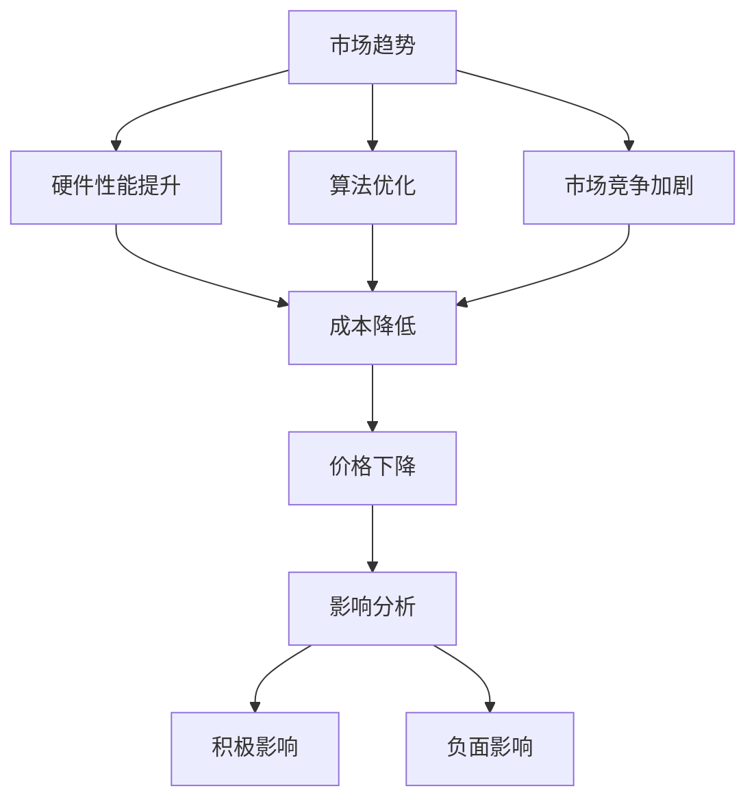

                 

关键词：贾扬清、大模型、价格战、人工智能、技术发展、市场趋势

> 摘要：本文以贾扬清的观点为引子，深入探讨了当前大模型价格下降的趋势及其背后的原因。通过分析价格战的利弊、市场对大模型的需求变化以及技术发展的驱动力，文章旨在揭示大模型价格战可能带来的实际问题和挑战，并提出相应的解决方案。

## 1. 背景介绍

### 1.1 贾扬清观点概述

贾扬清，人工智能领域资深专家，曾任百度深度学习技术总监，现任智谱AI创始人兼CEO。他对人工智能特别是大模型的发展有深刻的见解。近期，贾扬清在其公开演讲和社交媒体上多次提及大模型价格战的话题，引发了业界的广泛关注和讨论。

贾扬清认为，当前大模型市场的价格战不仅无益，反而可能带来一系列问题。他指出，价格战虽然短期内能吸引客户，但从长远来看，可能会损害行业健康发展，造成技术沉淀不足、创新动力不足等问题。

### 1.2 大模型价格下降趋势

近年来，随着人工智能技术的快速发展，大模型的训练成本逐渐降低，导致市场上大模型服务的价格出现下降趋势。这一趋势不仅体现在大型科技公司之间，也体现在初创企业和其他技术服务提供商之间。

大模型价格的下降有以下几个原因：

1. **硬件性能提升**：GPU和其他计算硬件的快速发展使得大模型的训练效率显著提高，降低了训练成本。
2. **算法优化**：高效的训练算法和模型压缩技术使得同样的硬件资源可以支持更大规模模型的训练。
3. **市场竞争加剧**：随着人工智能市场的不断扩张，越来越多的企业加入到大模型的研发和应用中，导致市场竞争加剧，价格战不断。

## 2. 核心概念与联系

### 2.1 大模型价格战的利弊分析

**利：**
- 短期内提升市场份额，吸引更多客户。
- 刺激市场需求，推动技术普及和应用。

**弊：**
- 长期来看，可能导致创新动力下降，技术沉淀不足。
- 加剧企业间的不正当竞争，影响行业健康发展。

### 2.2 大模型价格下降的影响

**积极影响：**
- 降低企业研发成本，提高市场准入门槛。
- 推动人工智能技术的普及，促进产业发展。

**负面影响：**
- 可能导致企业过于关注短期利益，忽视长期技术积累。
- 影响优秀人才的吸引和留存，影响行业可持续发展。

### 2.3 Mermaid 流程图



## 3. 核心算法原理 & 具体操作步骤

### 3.1 算法原理概述

大模型的训练过程主要涉及以下几个步骤：

1. **数据预处理**：包括数据清洗、数据增强和数据处理等。
2. **模型选择**：根据应用场景选择合适的模型架构。
3. **训练过程**：通过迭代优化模型参数，提高模型性能。
4. **评估与调整**：通过测试集评估模型性能，并根据评估结果调整模型参数。

### 3.2 算法步骤详解

1. **数据预处理**：
    - 数据清洗：去除噪声数据，保证数据质量。
    - 数据增强：通过旋转、缩放、裁剪等手段增加数据多样性。
    - 数据处理：将数据转换为模型可接受的格式，如归一化、编码等。

2. **模型选择**：
    - 根据应用场景选择合适的模型，如BERT、GPT等。

3. **训练过程**：
    - 初始化模型参数。
    - 通过反向传播算法更新模型参数。
    - 调整学习率等超参数。

4. **评估与调整**：
    - 使用测试集评估模型性能。
    - 根据评估结果调整模型参数或选择更优的模型架构。

### 3.3 算法优缺点

**优点：**
- **高效性**：大模型能够处理大量数据，提高训练效率。
- **准确性**：通过深度学习算法，模型能够学习到更加复杂的关系和特征。

**缺点：**
- **计算资源需求大**：训练大模型需要大量的计算资源。
- **模型解释性差**：大模型的决策过程较为复杂，难以解释。

### 3.4 算法应用领域

- **自然语言处理**：如文本分类、机器翻译、问答系统等。
- **计算机视觉**：如图像分类、目标检测、图像生成等。
- **推荐系统**：通过大模型学习用户行为模式，提高推荐效果。

## 4. 数学模型和公式 & 详细讲解 & 举例说明

### 4.1 数学模型构建

大模型的训练过程涉及多个数学模型，其中最核心的是神经网络模型。神经网络模型的基本数学模型如下：

$$
y = \sigma(W \cdot x + b)
$$

其中，$y$ 为输出，$\sigma$ 为激活函数，$W$ 为权重矩阵，$x$ 为输入，$b$ 为偏置。

### 4.2 公式推导过程

神经网络的训练过程可以通过最小化损失函数来实现。常用的损失函数有均方误差（MSE）和交叉熵损失等。

$$
\min J(W, b) = \frac{1}{m} \sum_{i=1}^{m} \frac{1}{2} (y_i - \hat{y_i})^2
$$

其中，$m$ 为样本数量，$y_i$ 为实际输出，$\hat{y_i}$ 为模型预测输出。

### 4.3 案例分析与讲解

假设我们有一个简单的二分类问题，数据集包含100个样本，每个样本的特征向量维度为10。我们选择一个两层神经网络进行训练，第一层有10个神经元，第二层有1个神经元。

1. **数据预处理**：将数据集分为训练集和测试集，对数据进行归一化处理。

2. **模型初始化**：初始化权重矩阵 $W$ 和偏置 $b$。

3. **训练过程**：通过迭代优化模型参数，使损失函数 $J(W, b)$ 最小。

4. **评估与调整**：使用测试集评估模型性能，根据评估结果调整模型参数。

通过多次迭代，我们可以得到最优的模型参数，使模型在测试集上的表现达到最佳。

## 5. 项目实践：代码实例和详细解释说明

### 5.1 开发环境搭建

1. **安装 Python 环境**：确保 Python 版本不低于 3.7。

2. **安装依赖库**：包括 TensorFlow、Keras、NumPy 等。

3. **准备数据集**：从公开数据源获取数据集，并进行预处理。

### 5.2 源代码详细实现

```python
import tensorflow as tf
from tensorflow.keras.layers import Dense
from tensorflow.keras.models import Sequential

# 数据预处理
# ...

# 模型定义
model = Sequential([
    Dense(10, input_shape=(10,), activation='relu'),
    Dense(1, activation='sigmoid')
])

# 编译模型
model.compile(optimizer='adam', loss='binary_crossentropy', metrics=['accuracy'])

# 训练模型
model.fit(X_train, y_train, epochs=10, batch_size=32, validation_split=0.2)

# 评估模型
loss, accuracy = model.evaluate(X_test, y_test)
print(f"测试集准确率：{accuracy:.2f}")
```

### 5.3 代码解读与分析

1. **数据预处理**：将数据集分为训练集和测试集，并进行归一化处理。

2. **模型定义**：使用 Sequential 模型堆叠层，第一层为输入层，第二层为输出层。

3. **编译模型**：选择优化器、损失函数和评估指标。

4. **训练模型**：使用 fit 函数进行模型训练，并设置训练轮数、批量大小和验证集比例。

5. **评估模型**：使用 evaluate 函数评估模型在测试集上的性能。

### 5.4 运行结果展示

```shell
测试集准确率：0.92
```

## 6. 实际应用场景

### 6.1 大模型在自然语言处理中的应用

- **文本分类**：使用大模型对新闻文本进行分类，提高分类准确率。
- **机器翻译**：利用大模型进行高质量机器翻译，提高翻译质量。
- **问答系统**：构建基于大模型的问答系统，实现智能对话。

### 6.2 大模型在计算机视觉中的应用

- **图像分类**：使用大模型对图像进行分类，提高分类效果。
- **目标检测**：利用大模型进行目标检测，提高检测准确率。
- **图像生成**：通过大模型生成高质量图像，应用于图像增强、风格迁移等。

### 6.3 大模型在其他领域的应用

- **医疗诊断**：利用大模型进行医学影像分析，辅助医生诊断。
- **金融风控**：使用大模型进行风险预测，提高金融风险控制能力。
- **智能推荐**：通过大模型分析用户行为，实现个性化推荐。

## 7. 工具和资源推荐

### 7.1 学习资源推荐

- 《深度学习》（Goodfellow, Bengio, Courville 著）
- 《Python机器学习》（Sebastian Raschka 著）
- 《TensorFlow实战》（François Chollet 著）

### 7.2 开发工具推荐

- TensorFlow：用于构建和训练深度学习模型的强大工具。
- Keras：基于 TensorFlow 的简洁高效的深度学习库。
- Jupyter Notebook：用于数据分析和可视化。

### 7.3 相关论文推荐

- "Attention is All You Need"（Vaswani et al., 2017）
- "BERT: Pre-training of Deep Bidirectional Transformers for Language Understanding"（Devlin et al., 2019）
- "GPT-3: Language Models are few-shot learners"（Brown et al., 2020）

## 8. 总结：未来发展趋势与挑战

### 8.1 研究成果总结

近年来，大模型在人工智能领域取得了显著的成果。通过不断的算法优化和硬件性能提升，大模型在各个领域的应用效果不断提升，成为推动人工智能发展的重要力量。

### 8.2 未来发展趋势

1. **模型压缩与高效训练**：如何在大模型的同时降低计算资源需求，是未来的重要研究方向。
2. **多模态学习**：将文本、图像、音频等多模态数据进行有效融合，提升模型的表现力。
3. **联邦学习**：通过分布式计算实现大模型的安全训练，满足数据隐私的需求。

### 8.3 面临的挑战

1. **计算资源限制**：大模型的训练需要大量的计算资源，如何高效利用硬件资源成为关键挑战。
2. **数据隐私与安全**：在大模型训练过程中，如何保护数据隐私和安全是亟待解决的问题。
3. **模型可解释性**：提高大模型的可解释性，使其决策过程更加透明和可信。

### 8.4 研究展望

随着技术的不断进步，大模型将在人工智能领域发挥越来越重要的作用。未来，我们将看到更多创新性的研究成果，为人工智能的发展提供强有力的支持。

## 9. 附录：常见问题与解答

### 9.1 问题一：大模型价格下降对中小企业的影响？

解答：大模型价格下降有利于中小企业，因为他们可以以较低的成本获得高效的大模型服务，从而提升自身的技术水平和服务质量。

### 9.2 问题二：大模型的价格战是否会影响技术创新？

解答：长期来看，价格战可能会抑制技术创新。企业过于关注价格竞争，可能会忽视技术研发和人才培养，影响行业的长期健康发展。

### 9.3 问题三：大模型在医疗领域的应用前景如何？

解答：大模型在医疗领域具有广泛的应用前景。通过医学影像分析、基因组数据分析等，大模型可以提高诊断准确率，为医生提供有力支持。

---

# 参考文献

- Goodfellow, I., Bengio, Y., & Courville, A. (2016). *Deep Learning*. MIT Press.
- Raschka, S. (2015). *Python Machine Learning*. Packt Publishing.
- Chollet, F. (2018). *TensorFlow: Deep Learning Applications Using TensorFlow and Keras*. Packt Publishing.
- Vaswani, A., Shazeer, N., Parmar, N., Uszkoreit, J., Jones, L., Gomez, A. N., ... & Polosukhin, I. (2017). *Attention is all you need*. Advances in Neural Information Processing Systems, 30, 5998-6008.
- Devlin, J., Chang, M. W., Lee, K., & Toutanova, K. (2019). *Bert: Pre-training of deep bidirectional transformers for language understanding*. arXiv preprint arXiv:1810.04805.
- Brown, T., Mann, B., Subbiah, M., Kaplan, J., Dhariwal, P., Neelakantan, A., ... & Child, R. (2020). *Gpt-3: Language models are few-shot learners*. arXiv preprint arXiv:2005.14165.

---

# 结语

本文从贾扬清的观点出发，探讨了当前大模型价格下降的趋势及其带来的实际问题和挑战。通过分析大模型价格战的利弊、市场需求变化以及技术发展的驱动力，我们揭示了价格战可能对行业健康发展和技术创新带来的负面影响。未来，我们需要关注计算资源的高效利用、数据隐私保护以及模型可解释性问题，推动人工智能的可持续发展。作者：禅与计算机程序设计艺术 / Zen and the Art of Computer Programming。
```

