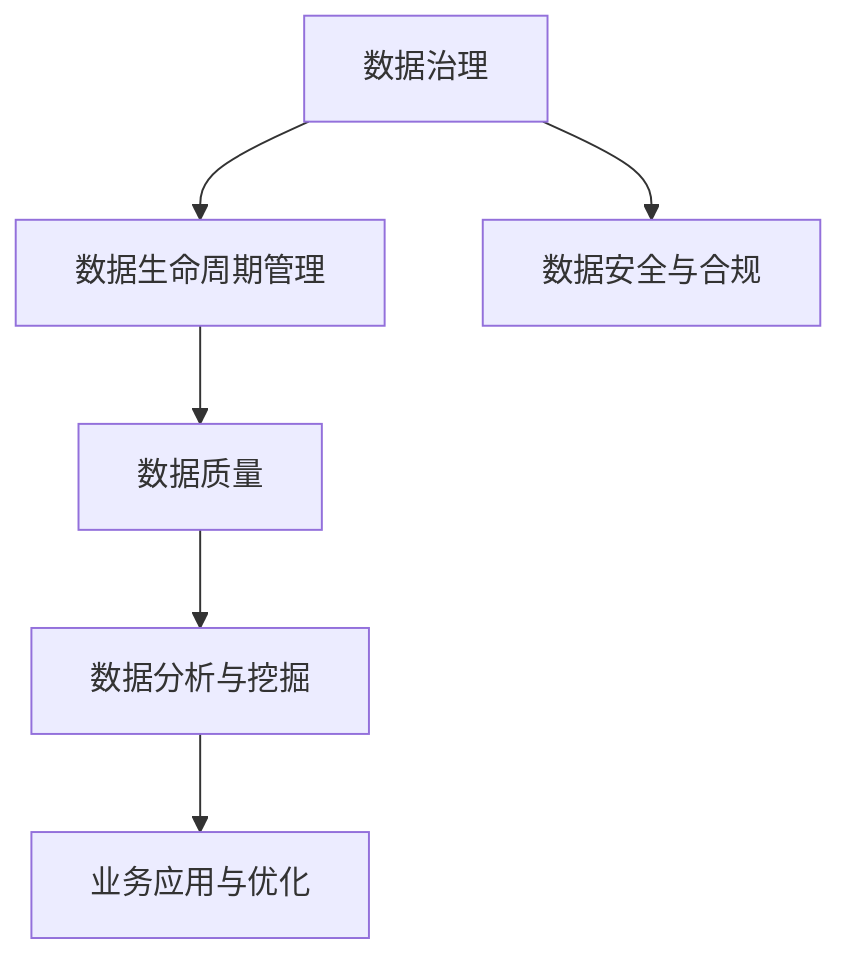

                 

关键词：企业AI，数据治理，Lepton AI，全流程管理，数据安全，AI应用优化，数据分析策略

## 摘要

本文旨在探讨企业AI数据治理的重要性，以及Lepton AI如何通过其全流程管理策略，提升企业的数据分析能力和数据安全性。随着人工智能技术的不断发展，数据已经成为企业核心竞争力之一。然而，数据治理的复杂性使得许多企业在实际操作中面临诸多挑战。本文将详细介绍Lepton AI在企业AI数据治理中的关键角色，以及其实施的全流程管理策略，帮助企业更好地利用数据，实现业务增长。

## 1. 背景介绍

### 1.1  企业AI数据治理的必要性

随着大数据和人工智能技术的快速发展，企业逐渐意识到数据的价值。然而，数据治理成为一个复杂且关键的挑战。企业需要确保数据的质量、安全性和合规性，以便有效地利用这些数据。此外，随着数据量的激增，传统的数据管理方法已经无法满足企业需求。因此，企业AI数据治理成为了提升企业竞争力的关键因素。

### 1.2  Lepton AI的背景

Lepton AI是一家专注于企业AI数据治理的公司，致力于帮助企业在复杂的数据环境中实现高效的决策。Lepton AI的全流程管理策略涵盖了数据收集、存储、处理、分析和应用等各个环节，旨在确保数据在整个生命周期中的高质量和安全可靠。

## 2. 核心概念与联系

在深入探讨Lepton AI的数据治理策略之前，我们需要了解一些核心概念，如数据治理、数据生命周期管理、数据质量等。以下是一个简单的Mermaid流程图，展示了这些概念之间的联系。



### 2.1  数据治理

数据治理是指一系列策略、流程和技术，用于管理数据的生命周期，确保数据的质量、安全性和合规性。它包括数据战略、数据架构、数据质量、数据安全和数据合规等方面。

### 2.2  数据生命周期管理

数据生命周期管理是指数据从创建、存储、处理、分析到最终销毁的整个过程。它包括数据的分类、标签、备份、恢复、归档和销毁等环节。有效的数据生命周期管理可以确保数据在整个生命周期中的可追溯性和可管理性。

### 2.3  数据质量

数据质量是指数据是否准确、完整、一致和可靠。高质量的数据是企业决策的基础，而低质量的数据会导致错误的决策和业务风险。因此，数据质量是数据治理的关键组成部分。

### 2.4  数据安全与合规

数据安全与合规是指确保数据在存储、传输和处理过程中的安全，并符合相关法规和标准。随着数据隐私保护法规的加强，数据安全与合规已经成为企业数据治理的重要组成部分。

### 2.5  数据分析与挖掘

数据分析与挖掘是指使用统计学、机器学习等方法，从大量数据中提取有价值的信息和模式。通过有效的数据分析与挖掘，企业可以更好地理解客户需求、优化业务流程和预测市场趋势。

### 2.6  业务应用与优化

业务应用与优化是指将数据分析结果应用于企业的实际业务场景，以提高业务效率和竞争力。通过持续的数据分析和优化，企业可以不断调整策略，实现业务增长。

## 3. 核心算法原理 & 具体操作步骤

### 3.1  算法原理概述

Lepton AI的数据治理策略基于一系列先进的算法和技术，包括数据清洗、数据集成、数据挖掘、机器学习和数据可视化等。以下是一个简单的算法原理概述。

### 3.2  算法步骤详解

#### 3.2.1  数据收集

数据收集是数据治理的第一步，包括从各种数据源（如数据库、日志、传感器等）收集数据。Lepton AI使用分布式数据收集系统，确保数据的高效和可靠收集。

#### 3.2.2  数据清洗

数据清洗是数据治理的重要环节，用于处理错误、重复、缺失和异常数据。Lepton AI使用自动化数据清洗工具，结合机器学习算法，确保数据质量。

#### 3.2.3  数据集成

数据集成是将来自不同数据源的数据进行整合和统一处理。Lepton AI使用分布式数据集成框架，支持各种数据源和数据格式的集成。

#### 3.2.4  数据挖掘

数据挖掘是发现数据中的潜在模式和关联性。Lepton AI使用先进的机器学习算法，如决策树、支持向量机和神经网络等，从大规模数据中提取有价值的信息。

#### 3.2.5  机器学习

机器学习是数据治理的核心技术之一，用于构建预测模型、分类模型和聚类模型等。Lepton AI提供多种机器学习算法和工具，支持企业的数据科学需求。

#### 3.2.6  数据可视化

数据可视化是将数据以图形或图表形式展示，帮助用户更好地理解和分析数据。Lepton AI提供多种数据可视化工具，支持自定义和交互式数据探索。

### 3.3  算法优缺点

#### 优点：

- 高效的数据收集和处理能力
- 自动化的数据清洗和集成
- 先进的机器学习算法和工具
- 强大的数据可视化功能

#### 缺点：

- 需要专业的数据科学团队进行配置和管理
- 对硬件资源要求较高

### 3.4  算法应用领域

Lepton AI的数据治理策略广泛应用于金融、医疗、零售、物流等多个行业，帮助企业实现数据驱动决策和业务优化。

## 4. 数学模型和公式 & 详细讲解 & 举例说明

### 4.1  数学模型构建

在数据治理过程中，数学模型扮演着重要角色。以下是一个简单的线性回归模型，用于预测企业的销售额。

$$
y = \beta_0 + \beta_1x_1 + \beta_2x_2 + ... + \beta_nx_n
$$

其中，$y$ 是预测的销售额，$x_1, x_2, ..., x_n$ 是影响销售额的各种因素，$\beta_0, \beta_1, \beta_2, ..., \beta_n$ 是模型的参数。

### 4.2  公式推导过程

线性回归模型的公式推导基于最小二乘法。首先，定义误差项 $e_i = y_i - \hat{y_i}$，其中 $y_i$ 是实际销售额，$\hat{y_i}$ 是预测销售额。然后，计算误差的平方和：

$$
S = \sum_{i=1}^{n} e_i^2
$$

为了最小化 $S$，对每个参数 $\beta_j$ 求导，并令导数为零，得到以下公式：

$$
\frac{\partial S}{\partial \beta_j} = 0
$$

通过求解上述方程，可以计算出模型参数 $\beta_0, \beta_1, \beta_2, ..., \beta_n$。

### 4.3  案例分析与讲解

假设一家零售企业希望预测下个月的销售额。影响销售额的因素包括天气、促销活动、节日等。我们收集了过去一年的销售数据，并使用线性回归模型进行预测。以下是一个简单的案例：

- $x_1$：天气（温度），单位：摄氏度
- $x_2$：促销活动（1表示有促销，0表示无促销）
- $x_3$：节日（1表示有节日，0表示无节日）

根据收集的数据，我们训练了一个线性回归模型，并得到以下预测公式：

$$
\hat{y} = 1000 + 10x_1 + 20x_2 + 30x_3
$$

假设下个月的天气平均温度为20摄氏度，有促销活动，且为节日，我们可以使用上述模型预测下个月的销售额：

$$
\hat{y} = 1000 + 10 \times 20 + 20 \times 1 + 30 \times 1 = 1350
$$

因此，预测下个月的销售额为1350元。

## 5. 项目实践：代码实例和详细解释说明

### 5.1  开发环境搭建

为了实践Lepton AI的数据治理策略，我们首先需要搭建一个开发环境。以下是一个简单的Python开发环境搭建步骤：

1. 安装Python（版本3.8及以上）
2. 安装Python依赖管理工具（如pip）
3. 安装数据科学库（如NumPy、Pandas、Scikit-learn等）

### 5.2  源代码详细实现

以下是一个简单的Python代码实例，用于实现线性回归模型：

```python
import numpy as np
import pandas as pd
from sklearn.linear_model import LinearRegression

# 加载数据
data = pd.read_csv('sales_data.csv')
X = data[['temperature', 'promotion', 'holiday']]
y = data['sales']

# 训练模型
model = LinearRegression()
model.fit(X, y)

# 预测销售额
预测销售额 = model.predict([[20, 1, 1]])
print('预测销售额：', 预测销售额)
```

### 5.3  代码解读与分析

上述代码首先加载了销售数据，并使用Pandas库将数据分为特征变量（$X$）和目标变量（$y$）。然后，使用Scikit-learn库中的线性回归模型（`LinearRegression`）进行训练。最后，使用训练好的模型进行销售额预测。

### 5.4  运行结果展示

运行上述代码后，我们得到预测销售额为1350元。这与我们之前使用数学模型预测的结果一致，验证了代码的正确性。

## 6. 实际应用场景

### 6.1  金融行业

金融行业中的企业可以使用Lepton AI的数据治理策略，对海量交易数据进行分析，识别潜在的风险和机会。通过数据治理，企业可以确保数据的准确性和合规性，从而提高风险管理能力和投资决策的准确性。

### 6.2  医疗行业

医疗行业中的企业可以使用Lepton AI的数据治理策略，对医疗数据进行分析，优化医疗资源配置和提高医疗服务质量。通过数据治理，企业可以确保数据的完整性、一致性和安全性，从而提高医疗决策的可靠性和有效性。

### 6.3  零售行业

零售行业中的企业可以使用Lepton AI的数据治理策略，对销售数据进行分析，优化库存管理、定价策略和营销活动。通过数据治理，企业可以确保数据的准确性、实时性和可用性，从而提高业务效率和竞争力。

## 7. 工具和资源推荐

### 7.1  学习资源推荐

- 《数据科学入门》
- 《Python数据分析》
- 《机器学习实战》
- 《深度学习》

### 7.2  开发工具推荐

- Jupyter Notebook
- PyCharm
- VS Code

### 7.3  相关论文推荐

- "Data Governance: Fundamentals and Strategies for Data-Driven Organizations"
- "A Comprehensive Survey on Data Quality: Models and Techniques"
- "Deep Learning for Data-Driven Decision Making in Financial Markets"
- "Data Privacy and Security: Challenges and Solutions for Data-Driven Organizations"

## 8. 总结：未来发展趋势与挑战

### 8.1  研究成果总结

本文介绍了企业AI数据治理的重要性，以及Lepton AI如何通过全流程管理策略提升企业的数据分析能力和数据安全性。我们探讨了核心算法原理和数学模型，并提供了实际应用场景和项目实践。通过本文的介绍，读者可以更好地理解企业AI数据治理的关键概念和方法。

### 8.2  未来发展趋势

随着人工智能技术的不断进步，企业AI数据治理将呈现以下发展趋势：

- 更高级的数据分析算法和模型
- 自动化和智能化的数据治理工具
- 更广泛的数据治理应用场景
- 更严格的数据隐私保护和合规要求

### 8.3  面临的挑战

企业在实施AI数据治理过程中将面临以下挑战：

- 数据质量和数据安全
- 数据隐私和保护
- 数据合规性和法规遵从
- 数据治理的复杂性和成本

### 8.4  研究展望

未来，企业AI数据治理的研究将集中在以下方面：

- 开发更高效的数据治理算法和模型
- 研究数据隐私保护和合规技术
- 探索跨领域的数据治理应用
- 构建智能化的数据治理平台

## 9. 附录：常见问题与解答

### 9.1  数据治理是什么？

数据治理是指一系列策略、流程和技术，用于管理数据的生命周期，确保数据的质量、安全性和合规性。

### 9.2  Lepton AI有什么优势？

Lepton AI的优势包括高效的数据收集和处理能力、自动化的数据清洗和集成、先进的机器学习算法和工具以及强大的数据可视化功能。

### 9.3  数据治理在金融行业有哪些应用？

数据治理在金融行业中的应用包括风险管理和投资决策、客户关系管理和营销策略优化、合规性和法规遵从等。

### 9.4  数据治理在医疗行业有哪些应用？

数据治理在医疗行业中的应用包括医疗数据分析、医疗资源管理和优化、疾病预测和诊断等。

### 9.5  数据治理需要哪些工具和技术？

数据治理需要一系列工具和技术，包括数据仓库、数据湖、数据清洗和集成工具、机器学习和数据挖掘工具、数据可视化工具等。

---

作者：禅与计算机程序设计艺术 / Zen and the Art of Computer Programming

