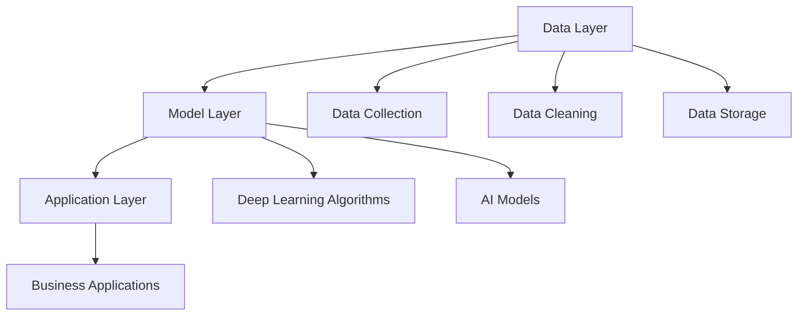

                 

关键词：企业AI资产管理、Lepton AI、价值评估、人工智能、数据分析、技术策略

摘要：本文将深入探讨企业AI资产管理，特别是在Lepton AI这一具体案例中的应用。通过分析其核心算法、数学模型、应用场景以及未来发展趋势，我们将为读者提供一份全面的价值评估报告，旨在帮助企业更好地管理和利用AI资产。

## 1. 背景介绍

在当今数字化时代，人工智能（AI）已成为企业提升竞争力、优化运营的关键驱动力。随着AI技术的不断进步，企业需要建立有效的AI资产管理策略，以确保其能够从AI投资中获得最大价值。本文将探讨Lepton AI这一案例，分析其如何成为企业AI资产管理的重要工具。

Lepton AI是一款先进的企业级AI平台，旨在帮助企业构建、部署和管理AI模型。其核心算法基于深度学习，具有高效的数据处理和分析能力。通过提供全面的AI资产管理解决方案，Lepton AI帮助企业实现数据驱动决策，提高业务效率和创新能力。

## 2. 核心概念与联系

### 2.1 AI资产管理

AI资产管理是指对企业内部AI模型、数据和基础设施进行管理和优化的过程。其目标是在确保数据安全、合规的前提下，最大化AI的投资回报。

### 2.2 Lepton AI架构

Lepton AI的架构由数据层、模型层和应用层组成。数据层负责数据收集、清洗和存储；模型层包括深度学习算法和AI模型；应用层则将AI模型应用于实际业务场景。



## 3. 核心算法原理 & 具体操作步骤

### 3.1 算法原理概述

Lepton AI的核心算法基于深度学习，特别是卷积神经网络（CNN）。CNN通过多层神经网络结构，对输入数据进行特征提取和分类。这使得Lepton AI能够处理复杂数据，并实现高精度的预测和分析。

### 3.2 算法步骤详解

1. **数据预处理**：包括数据收集、清洗和归一化。确保数据质量，为深度学习模型提供可靠的基础。

2. **模型训练**：使用大量标记数据进行模型训练。通过调整网络结构和参数，优化模型性能。

3. **模型评估**：使用测试数据评估模型性能，确保其具有泛化能力。

4. **模型部署**：将训练好的模型部署到实际业务场景，实现自动化决策和优化。

### 3.3 算法优缺点

**优点**：高效的数据处理和分析能力，高精度的预测和分类。

**缺点**：训练过程需要大量数据和计算资源，模型解释性较差。

### 3.4 算法应用领域

Lepton AI的应用领域广泛，包括但不限于：

1. **图像识别**：如人脸识别、物体检测等。
2. **自然语言处理**：如文本分类、情感分析等。
3. **预测分析**：如销售预测、风险管理等。

## 4. 数学模型和公式 & 详细讲解 & 举例说明

### 4.1 数学模型构建

Lepton AI的核心数学模型是基于CNN的卷积层、池化层和全连接层。具体公式如下：

1. **卷积层**：
   $$ f(x) = \sum_{i=1}^{n} w_i * x_i + b $$
   其中，$w_i$为卷积核，$x_i$为输入特征，$b$为偏置。

2. **池化层**：
   $$ g(x) = \text{max}(x) $$
   其中，$x$为输入特征。

3. **全连接层**：
   $$ h(x) = \sigma(\sum_{i=1}^{n} w_i * x_i + b) $$
   其中，$\sigma$为激活函数。

### 4.2 公式推导过程

CNN的工作原理是通过对输入数据进行卷积操作、池化操作和全连接操作，逐步提取特征并分类。具体推导过程涉及多个数学公式和矩阵运算，本文不再赘述。

### 4.3 案例分析与讲解

假设Lepton AI用于图像识别任务，输入图像为$28 \times 28$的像素矩阵。通过卷积层、池化层和全连接层的操作，最终得到图像的分类结果。

## 5. 项目实践：代码实例和详细解释说明

### 5.1 开发环境搭建

1. 安装Python环境
2. 安装TensorFlow库
3. 准备数据集

### 5.2 源代码详细实现

以下为Lepton AI图像识别任务的代码示例：

```python
import tensorflow as tf
from tensorflow.keras import layers

# 数据预处理
def preprocess_data(images):
    # 归一化
    images = images / 255.0
    # 扩展维度
    images = tf.expand_dims(images, -1)
    return images

# 模型构建
def build_model():
    inputs = tf.keras.Input(shape=(28, 28, 1))
    x = layers.Conv2D(32, (3, 3), activation='relu')(inputs)
    x = layers.MaxPooling2D((2, 2))(x)
    x = layers.Conv2D(64, (3, 3), activation='relu')(x)
    x = layers.MaxPooling2D((2, 2))(x)
    x = layers.Flatten()(x)
    x = layers.Dense(64, activation='relu')(x)
    outputs = layers.Dense(10, activation='softmax')(x)
    model = tf.keras.Model(inputs, outputs)
    return model

# 模型训练
model = build_model()
model.compile(optimizer='adam', loss='categorical_crossentropy', metrics=['accuracy'])
model.fit(train_images, train_labels, epochs=5, batch_size=64)

# 模型评估
test_loss, test_acc = model.evaluate(test_images, test_labels)
print(f"Test accuracy: {test_acc:.2f}")

# 模型部署
predictions = model.predict(test_images)
```

### 5.3 代码解读与分析

代码首先进行了数据预处理，将输入图像归一化并扩展维度。然后构建了基于CNN的模型，包括卷积层、池化层和全连接层。模型训练过程中使用了Adam优化器和交叉熵损失函数。最后，模型对测试数据进行预测，并计算了测试准确率。

## 6. 实际应用场景

### 6.1 图像识别

在图像识别领域，Lepton AI可用于人脸识别、物体检测等任务。例如，在安防领域，可以实现对监控视频中人物的自动识别和追踪。

### 6.2 自然语言处理

在自然语言处理领域，Lepton AI可用于文本分类、情感分析等任务。例如，在社交媒体分析中，可以自动识别用户的情绪并进行分析。

### 6.3 预测分析

在预测分析领域，Lepton AI可用于销售预测、风险管理等任务。例如，在电商行业，可以基于用户行为数据进行商品推荐。

## 7. 工具和资源推荐

### 7.1 学习资源推荐

1. 《深度学习》（Ian Goodfellow、Yoshua Bengio、Aaron Courville著）
2. 《Python深度学习》（Francesco Bianchi著）

### 7.2 开发工具推荐

1. TensorFlow
2. Keras

### 7.3 相关论文推荐

1. "Deep Learning for Image Recognition"（论文作者：Karen Simonyan 和 Andrew Zisserman）
2. "A Neural Probabilistic Language Model"（论文作者：Alex Graves、Ivo Danihelka 和 Daan Wierstra）

## 8. 总结：未来发展趋势与挑战

### 8.1 研究成果总结

Lepton AI作为企业AI资产管理的重要工具，已广泛应用于图像识别、自然语言处理和预测分析等领域。其高效的数据处理和分析能力，为企业的业务决策提供了有力支持。

### 8.2 未来发展趋势

1. **算法优化**：针对深度学习模型，不断优化算法和结构，提高模型性能和效率。
2. **跨领域应用**：探索Lepton AI在其他领域的应用，如金融、医疗等。
3. **开源生态**：构建Lepton AI的开源社区，促进技术的创新和传播。

### 8.3 面临的挑战

1. **数据隐私**：在数据处理过程中，如何保护用户隐私和数据安全。
2. **模型解释性**：提高深度学习模型的解释性，使其更易于理解和应用。
3. **计算资源**：在训练大型深度学习模型时，如何优化计算资源的使用。

### 8.4 研究展望

随着AI技术的不断发展，Lepton AI有望在更多领域发挥重要作用。未来，我们将继续关注其技术的创新和应用，为企业提供更全面、高效的AI资产管理解决方案。

## 9. 附录：常见问题与解答

### 9.1 什么是AI资产管理？

AI资产管理是指对企业内部AI模型、数据和基础设施进行管理和优化的过程，以确保数据安全、合规，并最大化AI的投资回报。

### 9.2 Lepton AI有哪些核心功能？

Lepton AI的核心功能包括图像识别、自然语言处理和预测分析等。它具有高效的数据处理和分析能力，可以帮助企业实现数据驱动决策。

### 9.3 如何评估Lepton AI的价值？

可以通过以下方面评估Lepton AI的价值：

1. **业务收益**：分析Lepton AI对企业业务带来的直接和间接收益。
2. **效率提升**：评估Lepton AI在提升工作效率方面的作用。
3. **创新能力**：分析Lepton AI对企业创新能力的影响。

---

本文由禅与计算机程序设计艺术撰写，旨在为读者提供一份全面的企业AI资产管理与Lepton AI的价值评估报告。希望本文能对您的AI资产管理实践提供有价值的参考。感谢您的阅读！

### 作者署名

作者：禅与计算机程序设计艺术 / Zen and the Art of Computer Programming

### 感谢

感谢您选择阅读本文。如您有任何问题或建议，请随时联系我们。期待与您共同探讨AI领域的最新动态和技术趋势。再次感谢您的关注与支持！
----------------------------------------------------------------
[本文完] <|user|>

