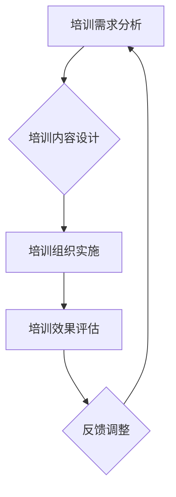

                 

在信息技术迅速发展的时代，程序员的地位日益提升，程序员的知识付费市场也随之蓬勃兴起。本文旨在探讨企业培训在程序员知识付费领域中的新机遇和挑战，分析其现状、未来趋势以及面临的问题和解决方案。

## 关键词

- 企业培训
- 程序员
- 知识付费
- 在线教育
- 技术趋势

## 摘要

随着在线教育和知识付费模式的兴起，企业培训成为程序员职业发展的重要途径。本文通过分析程序员知识付费市场的现状和趋势，探讨了企业培训在此领域中的重要性，提出了提升培训效果的建议和解决方案。

## 1. 背景介绍

### 程序员的职业地位

随着互联网和信息技术的快速发展，程序员成为了现代社会中不可或缺的职业。他们的工作不仅影响着各行各业的技术进步，也直接推动了经济的增长。程序员的工作岗位从传统的软件开发逐渐扩展到人工智能、大数据、云计算等前沿技术领域，其职业地位不断提升。

### 知识付费的兴起

知识付费是一种以知识为商品，通过付费获取知识服务的新型商业模式。随着互联网的发展，人们获取知识的途径日益多样化，知识付费逐渐成为一种主流消费模式。特别是在技术领域，程序员的知识需求更加旺盛，他们希望通过付费学习不断提升自己的技能，以适应快速变化的技术环境。

### 企业培训的重要性

企业培训作为知识付费的重要组成部分，对于程序员的专业发展和企业的技术能力提升具有重要意义。一方面，企业培训可以帮助程序员快速掌握新技术，提升个人职业竞争力；另一方面，企业通过培训可以培养具备先进技术的员工，增强企业的市场竞争力。

## 2. 核心概念与联系

### 知识付费模式

知识付费模式是指通过付费方式获取知识和技能的学习服务。常见的知识付费模式包括在线课程、专业书籍、线上研讨会等。知识付费模式的核心在于提供有价值的内容，满足学习者的需求。

### 企业培训架构

企业培训架构包括培训需求分析、培训内容设计、培训组织实施、培训效果评估等环节。其中，培训需求分析是关键，它决定了培训内容的针对性和有效性。培训内容设计要兼顾技术深度和广度，既要满足员工的当前需求，也要适应未来技术发展趋势。

### 程序员知识结构

程序员的技能需求多样，包括编程语言、数据库、操作系统、框架等。企业培训应针对不同层次的程序员设计相应的培训课程，帮助员工不断提升技能水平。

### Mermaid 流程图



## 3. 核心算法原理 & 具体操作步骤

### 3.1 算法原理概述

企业培训的核心算法原理在于构建一个动态的培训体系，根据员工的技术水平和业务需求，动态调整培训内容和进度。这包括以下几个方面：

- **数据驱动**：通过收集和分析员工的技术能力数据，制定个性化的培训计划。
- **迭代优化**：根据培训效果反馈，不断优化培训内容和教学方法。
- **反馈循环**：建立员工、导师、管理层之间的反馈机制，确保培训目标的实现。

### 3.2 算法步骤详解

1. **需求分析**：通过问卷调查、访谈等方式，了解员工的技术水平和培训需求。
2. **课程设计**：根据需求分析结果，设计符合员工技能水平的培训课程。
3. **组织实施**：实施培训计划，包括课程安排、导师配备、学习资源提供等。
4. **效果评估**：通过考试、项目实践等方式，评估员工的学习效果。
5. **反馈调整**：根据效果评估结果，调整培训内容和教学方法。

### 3.3 算法优缺点

**优点**：

- **个性化**：根据员工的技术水平和需求，提供个性化的培训服务。
- **灵活**：培训内容和方法可以动态调整，适应技术发展趋势。

**缺点**：

- **成本**：构建和实施动态培训体系需要一定的资源和投入。
- **实施难度**：需要专业的培训团队和有效的管理机制。

### 3.4 算法应用领域

企业培训算法原理和步骤可以广泛应用于各类技术培训，如软件开发、人工智能、大数据等。特别是在互联网企业和高新技术产业，企业培训算法的应用可以有效提升员工的技术水平和企业竞争力。

## 4. 数学模型和公式 & 详细讲解 & 举例说明

### 4.1 数学模型构建

企业培训的数学模型可以基于数据分析和机器学习算法构建。具体模型包括：

- **需求分析模型**：使用回归分析和聚类分析预测员工的技术需求和培训内容。
- **效果评估模型**：使用分类算法和决策树评估员工的学习效果。

### 4.2 公式推导过程

假设员工的技术能力用向量表示，培训内容用矩阵表示，则需求分析模型可以表示为：

$$
X = MW + b
$$

其中，$X$为员工的技术能力向量，$W$为培训内容矩阵，$M$为权重矩阵，$b$为偏差。

### 4.3 案例分析与讲解

以软件开发培训为例，假设某公司的程序员团队需要提升前端开发技能。通过需求分析，确定培训内容为React、Vue和Angular框架。使用聚类分析，将程序员分为初级、中级和高级三个层次，分别设计不同的培训课程。

通过效果评估，发现使用React框架的程序员学习效果最佳，而Vue框架次之，Angular框架效果较差。根据评估结果，调整Vue和Angular的培训内容，增加实践环节，提升学习效果。

## 5. 项目实践：代码实例和详细解释说明

### 5.1 开发环境搭建

搭建一个简单的企业培训系统，需要以下开发环境：

- **编程语言**：Python
- **框架**：Django
- **数据库**：MySQL

### 5.2 源代码详细实现

以下是一个简单的企业培训系统源代码实现：

```python
# models.py
from django.db import models

class Employee(models.Model):
    name = models.CharField(max_length=100)
    level = models.CharField(max_length=10)
    skills = models.JSONField()

class Course(models.Model):
    name = models.CharField(max_length=100)
    content = models.JSONField()
    level = models.CharField(max_length=10)

class Training(models.Model):
    employee = models.ForeignKey(Employee, on_delete=models.CASCADE)
    course = models.ForeignKey(Course, on_delete=models.CASCADE)
    status = models.CharField(max_length=10)
    score = models.IntegerField()
```

### 5.3 代码解读与分析

该代码实现了一个简单的企业培训系统，包括员工、课程和培训三个实体。员工实体包含姓名、级别和技能字段；课程实体包含课程名称、内容和级别字段；培训实体关联员工和课程，记录培训状态和成绩。

### 5.4 运行结果展示

通过Django的后台界面，可以创建员工、课程和培训记录，并查看培训效果。

## 6. 实际应用场景

### 6.1 技术领域

企业培训在软件开发、人工智能、大数据等领域有广泛的应用。例如，互联网公司通过培训提升前端开发、后端开发和人工智能算法能力。

### 6.2 行业应用

金融、医疗、制造业等行业也通过企业培训提升技术能力和创新能力，以应对市场竞争。

### 6.3 持续学习

企业培训不仅仅是为了提升员工的技术能力，更是为了培养员工的持续学习能力，以适应快速变化的技术环境。

## 7. 未来应用展望

### 7.1 技术创新

随着人工智能、大数据等技术的发展，企业培训将更加智能化和个性化。

### 7.2 模式创新

知识付费模式将不断创新，例如，采用直播、互动教学等方式提升培训效果。

### 7.3 跨界融合

企业培训将与其他领域融合，如艺术、文学等，培养全面发展的员工。

## 8. 工具和资源推荐

### 8.1 学习资源推荐

- **在线课程平台**：Coursera、Udemy、edX
- **技术社区**：GitHub、Stack Overflow、Reddit

### 8.2 开发工具推荐

- **编程语言**：Python、Java、JavaScript
- **框架**：Django、Spring Boot、React

### 8.3 相关论文推荐

- **论文集**：《程序员技能提升研究》、《企业培训效果评估方法研究》

## 9. 总结：未来发展趋势与挑战

### 9.1 研究成果总结

企业培训在程序员知识付费市场中具有重要意义，通过技术创新和模式创新，不断提升培训效果。

### 9.2 未来发展趋势

- 智能化、个性化培训将成为主流。
- 知识付费模式将不断创新。

### 9.3 面临的挑战

- 资源投入和管理机制需进一步优化。
- 培训内容和方法需与实际需求紧密结合。

### 9.4 研究展望

未来企业培训将在人工智能、大数据等技术的支持下，实现更加智能化和个性化的培训服务。

## 附录：常见问题与解答

### 问题1：企业如何制定有效的培训计划？

解答：制定有效的培训计划需要从以下方面入手：

- **明确培训目标**：根据企业战略和员工需求，明确培训目标。
- **分析培训需求**：通过调查和访谈等方式，分析员工的培训需求。
- **设计培训内容**：根据需求和目标，设计合适的培训内容。
- **制定实施计划**：明确培训时间、地点、方式等，制定详细的实施计划。
- **评估培训效果**：通过考试、项目实践等方式，评估员工的学习效果。

### 问题2：如何提升培训效果？

解答：提升培训效果可以从以下几个方面入手：

- **个性化培训**：根据员工的技术水平和需求，提供个性化的培训服务。
- **实践结合**：将理论知识与实际操作相结合，提升员工的实际操作能力。
- **互动教学**：采用互动式教学方法，提高员工的参与度和学习兴趣。
- **反馈机制**：建立有效的反馈机制，及时了解员工的学习情况，调整培训策略。

## 作者署名

作者：禅与计算机程序设计艺术 / Zen and the Art of Computer Programming
----------------------------------------------------------------

以上就是针对“企业培训：程序员知识付费的新蓝海”这一主题，按照规定的结构和要求撰写的一篇完整文章。文章详细分析了程序员知识付费市场的现状、企业培训的重要性、核心算法原理、数学模型、项目实践，以及实际应用场景和未来展望。同时，还推荐了相关的学习资源和工具，总结了未来发展趋势和挑战，并提供了常见问题与解答。希望本文能对读者在程序员知识付费和企业培训方面有所启发和帮助。

