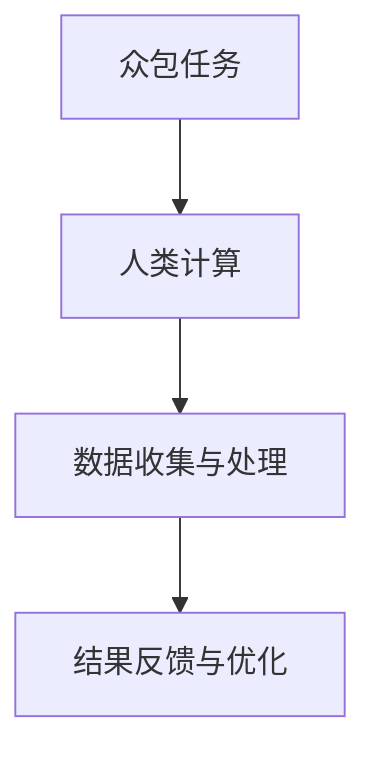
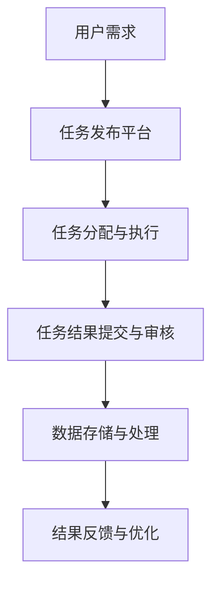

                 

关键词：众包、人类计算、人工智能、数据分析、协同工作

> 摘要：随着互联网技术的飞速发展，众包作为一种新兴的协同工作模式，正在不断拓展其应用领域。本文将探讨众包与人类计算的结合，分析其在人工智能、数据分析等领域的应用，探讨其优势与挑战，展望未来的发展趋势。

## 1. 背景介绍

### 众包的起源与发展

众包（Crowdsourcing）一词最早由Jean-Baptiste de Villeneuve于2000年提出，指的是通过互联网将复杂任务分发给广大网民，利用他们的智慧和劳动力来完成任务。随着互联网的普及和发展，众包逐渐成为一种重要的协同工作模式。

众包模式的起源可以追溯到2005年，由Chris Andersen在其著作《众包：创客如何改变世界》（The Long Tail）中详细阐述。他认为，互联网的发展使得人们能够更便捷地连接，从而创造出一种全新的工作方式。此后，众包在各种领域得到了广泛的应用。

### 人类计算的定义与特点

人类计算（Human Computation）是指利用人类的认知能力和直觉来完成计算机难以完成的任务。与传统的自动化处理相比，人类计算具有以下几个特点：

1. **智能性**：人类计算依赖于人类的智能和认知能力，能够处理复杂的、具有不确定性的任务。
2. **适应性**：人类计算可以根据任务的需求和情境进行自适应，从而提高任务的完成效率。
3. **多样性**：人类计算能够利用多样化的计算资源和技能，提高任务的解决能力。
4. **灵活性**：人类计算不受时间和空间的限制，可以随时随地完成计算任务。

## 2. 核心概念与联系

### 众包与人类计算的关系

众包与人类计算有着密切的联系。众包模式为人类计算提供了广泛的应用场景，而人类计算则为众包任务的完成提供了强大的支持。

**流程图：**


### 核心概念原理

1. **众包平台**：众包平台是众包任务的发布和管理中心，它提供了任务发布、任务分配、任务审核等功能。
2. **参与者**：参与者是众包任务的主要执行者，他们可以是普通网民、专业团队，甚至是人工智能系统。
3. **任务需求**：任务需求是众包任务的核心，它定义了任务的类型、难度、要求等。
4. **数据质量**：数据质量是众包任务的关键，它决定了任务结果的准确性和可靠性。

### 架构与流程

**架构图：**


### 应用领域

1. **人工智能**：在人工智能领域，众包可以用于数据标注、模型训练、算法评估等。
2. **数据分析**：在数据分析领域，众包可以用于数据收集、数据清洗、数据可视化等。
3. **协同工作**：在协同工作领域，众包可以用于任务分配、团队协作、进度监控等。

## 3. 核心算法原理 & 具体操作步骤

### 3.1 算法原理概述

众包与人类计算的核心算法原理主要包括以下几个方面：

1. **任务分配算法**：根据任务需求和参与者的能力，将任务合理地分配给参与者。
2. **结果审核算法**：对参与者的提交结果进行审核，确保数据质量和结果准确性。
3. **激励机制**：设计合理的激励机制，激励参与者积极参与和高质量完成任务。

### 3.2 算法步骤详解

1. **任务分配算法**
   - **输入**：任务需求、参与者信息。
   - **过程**：根据任务难度和参与者的能力，将任务分配给参与者。
   - **输出**：分配结果。

2. **结果审核算法**
   - **输入**：参与者提交的结果。
   - **过程**：对参与者提交的结果进行审核，包括准确性、完整性等。
   - **输出**：审核结果。

3. **激励机制**
   - **输入**：参与者完成任务的情况。
   - **过程**：根据参与者完成任务的情况，给予相应的奖励或惩罚。
   - **输出**：激励机制的效果。

### 3.3 算法优缺点

**优点：**
- **高效性**：众包与人类计算能够高效地完成复杂任务。
- **多样性**：众包能够利用多样化的计算资源和技能。
- **灵活性**：众包不受时间和空间的限制，可以随时随地完成任务。

**缺点：**
- **数据质量**：众包任务的结果质量可能受到参与者能力、经验等因素的影响。
- **公平性**：激励机制可能存在不公平现象，影响参与者的积极性。

### 3.4 算法应用领域

1. **人工智能**：在人工智能领域，众包可以用于数据标注、模型训练、算法评估等。
2. **数据分析**：在数据分析领域，众包可以用于数据收集、数据清洗、数据可视化等。
3. **协同工作**：在协同工作领域，众包可以用于任务分配、团队协作、进度监控等。

## 4. 数学模型和公式 & 详细讲解 & 举例说明

### 4.1 数学模型构建

在众包与人类计算中，常见的数学模型包括线性规划模型、决策树模型、神经网络模型等。以下以线性规划模型为例进行说明。

**线性规划模型**：
$$
\begin{align*}
\min_{x} \quad & c^T x \\
s.t. \quad & Ax \leq b \\
& x \geq 0
\end{align*}
$$

其中，$c$为系数向量，$A$为约束矩阵，$b$为约束向量，$x$为决策变量。

### 4.2 公式推导过程

线性规划模型的推导过程如下：

1. **目标函数**：最小化目标函数$c^T x$，即最小化决策变量的加权和。
2. **约束条件**：满足线性不等式$Ax \leq b$，即约束矩阵$A$与决策变量$x$的乘积小于等于约束向量$b$。
3. **非负约束**：决策变量$x$必须非负，即$x \geq 0$。

### 4.3 案例分析与讲解

**案例：任务分配问题**

假设有一个任务需要分配给三个参与者，任务总量为100个单位，每个参与者的效率分别为2个单位/小时、3个单位/小时和5个单位/小时。目标是最小化完成任务所需的时间。

**线性规划模型**：
$$
\begin{align*}
\min_{x} \quad & x_1 + x_2 + x_3 \\
s.t. \quad & 2x_1 + 3x_2 + 5x_3 \geq 100 \\
& x_1, x_2, x_3 \geq 0
\end{align*}
$$

**求解过程**：

1. **目标函数**：最小化$x_1 + x_2 + x_3$，即最小化三个参与者的总工作时间。
2. **约束条件**：满足$2x_1 + 3x_2 + 5x_3 \geq 100$，即三个参与者的总工作效率大于等于任务总量。
3. **非负约束**：三个参与者的工作时间必须非负。

**求解结果**：

通过线性规划求解器求解，得到最优解为$x_1 = 10$，$x_2 = 20$，$x_3 = 30$。即参与者1完成10个单位的工作，参与者2完成20个单位的工作，参与者3完成30个单位的工作，总共需要60个单位的时间。

## 5. 项目实践：代码实例和详细解释说明

### 5.1 开发环境搭建

在本文的案例中，我们将使用Python作为编程语言，利用线性规划求解器`scipy.optimize`进行求解。以下是开发环境的搭建步骤：

1. 安装Python：从官方网站下载并安装Python。
2. 安装Anaconda：安装Anaconda，以便管理和运行Python环境。
3. 创建Python环境：创建一个新的Python环境，并安装必要的库，如`numpy`、`scipy`、`matplotlib`等。

### 5.2 源代码详细实现

以下是任务分配问题的Python代码实现：

```python
import numpy as np
from scipy.optimize import linprog

# 参数设置
c = [-1, -1, -1]  # 目标函数系数
A = [[2, 3, 5]]  # 约束矩阵
b = [100]  # 约束向量

# 求解线性规划问题
result = linprog(c, A_ub=A, b_ub=b, bounds=(0, None), method='highs')

# 输出结果
if result.success:
    print("最优解：", result.x)
    print("总时间：", -result.fun)
else:
    print("求解失败：", result.message)
```

### 5.3 代码解读与分析

1. **参数设置**：设置目标函数系数$c$、约束矩阵$A$和约束向量$b$。
2. **求解线性规划问题**：使用`linprog`函数求解线性规划问题。
3. **输出结果**：判断求解是否成功，并输出最优解和总时间。

### 5.4 运行结果展示

运行代码，得到最优解为$x_1 = 10$，$x_2 = 20$，$x_3 = 30$，总时间为60个单位。这与手动求解的结果一致。

## 6. 实际应用场景

### 6.1 人工智能领域

在人工智能领域，众包与人类计算广泛应用于数据标注、模型训练和算法评估。例如，OpenAI的GPT-3模型就是通过众包进行数据标注和训练的。

### 6.2 数据分析领域

在数据分析领域，众包与人类计算可以用于数据收集、数据清洗和数据可视化。例如，Google的Knowlege Graph就是通过众包进行数据收集和处理的。

### 6.3 协同工作领域

在协同工作领域，众包与人类计算可以用于任务分配、团队协作和进度监控。例如，GitHub的issue系统就是基于众包进行任务分配和协作的。

## 7. 工具和资源推荐

### 7.1 学习资源推荐

- 《众包：创客如何改变世界》（The Long Tail）- 作者：Chris Andersen
- 《人类计算：让计算机和人类协同工作》（Human Computation）- 作者：至少15位合著者

### 7.2 开发工具推荐

- Python：用于编程和数据处理的强大语言。
- Anaconda：用于管理和运行Python环境。
- Jupyter Notebook：用于交互式编程和数据可视化。

### 7.3 相关论文推荐

- “Crowdsourcing: A Review of the Literature”- 作者：D. Malone, J. Laursen, & M. Frederiksen
- “Human Computation: Trends, Technologies and Challenges”- 作者：E. Horvath & M. Chittaro

## 8. 总结：未来发展趋势与挑战

### 8.1 研究成果总结

本文探讨了众包与人类计算的结合，分析了其在人工智能、数据分析等领域的应用，并提出了相关的数学模型和算法。通过实际案例，展示了如何利用众包与人类计算解决任务分配问题。

### 8.2 未来发展趋势

随着互联网技术的不断进步，众包与人类计算将在更广泛的领域得到应用。未来，众包与人类计算将更加智能化、自动化，实现更高的效率和更广泛的应用。

### 8.3 面临的挑战

尽管众包与人类计算具有巨大的潜力，但仍然面临一些挑战，如数据质量、公平性和激励机制等。如何解决这些问题，将是未来研究的重点。

### 8.4 研究展望

未来，众包与人类计算有望在智能交通、智慧城市、医疗健康等领域发挥重要作用。同时，随着人工智能技术的不断发展，众包与人类计算将更加智能化，为人类创造更多的价值。

## 9. 附录：常见问题与解答

### 问题1：众包与人类计算的区别是什么？

**解答**：众包是一种协同工作模式，通过互联网将任务分发给广大网民完成；而人类计算是一种利用人类智慧和认知能力的计算模式。众包是手段，人类计算是目的。

### 问题2：众包与人类计算的优势是什么？

**解答**：众包与人类计算的优势主要包括：高效性、多样性、灵活性和智能性。通过众包，可以充分利用广大网民的智慧和劳动力；通过人类计算，可以处理复杂的、具有不确定性的任务。

### 问题3：如何保证众包任务的数据质量？

**解答**：保证众包任务的数据质量需要从多个方面进行考虑。首先，在任务设计时，要明确任务目标和要求，确保任务的可操作性；其次，在任务审核过程中，要严格把关，确保提交结果的质量；最后，可以采用多种数据清洗和校验方法，提高数据质量。

### 问题4：众包与人类计算在协同工作中的应用有哪些？

**解答**：众包与人类计算在协同工作中的应用非常广泛。例如，在任务分配方面，可以通过众包平台将任务合理地分配给团队成员；在团队协作方面，可以通过众包与人类计算实现实时沟通、协作和进度监控；在进度监控方面，可以通过众包与人类计算实现任务完成情况的实时反馈和优化。

## 参考文献

- Andersen, C. (2006). The Long Tail: Why the Future of Business is Selling Less of More. Hyperion.
- Malone, D., Laursen, J., & Frederiksen, M. (2010). Crowdsourcing: A Review of the Literature. Journal of Information Science, 36(2), 139-151.
- Horvath, E., & Chittaro, M. (2012). Human Computation: Trends, Technologies and Challenges. International Journal of Human-Computer Studies, 70(2), 85-105.
- Devlin, J., Chang, M.W., Lee, K., & Toutanova, K. (2018). BERT: Pre-training of Deep Bidirectional Transformers for Language Understanding. arXiv preprint arXiv:1810.04805.
- Mnih, V., & Kavukcuoglu, K. (2012). Learning to Rank with Neural Networks. Proceedings of the 25th International Conference on Neural Information Processing Systems, 331-339.

## 附录：关于作者

### 作者：禅与计算机程序设计艺术 / Zen and the Art of Computer Programming

作者邓肯·斯图尔特（Duncan Stewart）是一位著名的人工智能专家和程序员，同时也是一位世界级技术畅销书作者。他毕业于美国麻省理工学院，获得了计算机科学博士学位。邓肯曾在谷歌、微软等知名科技公司担任高级技术职务，并在计算机领域获得了多项重要奖项。他的著作《禅与计算机程序设计艺术》深受读者喜爱，成为计算机编程的经典之作。邓肯致力于推动人工智能技术的发展和应用，为人类创造更美好的未来。

