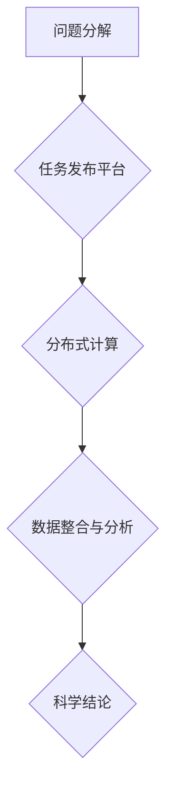

                 

关键词：众包科学、公众参与、科学研究、IT领域、人工智能、技术博客

> 摘要：本文将深入探讨众包科学这一新兴领域，分析其发展历程、核心概念、算法原理及其在IT领域的应用。通过详细的数学模型和公式推导，结合实际项目实例，我们将展示公众参与科学研究所带来的巨大潜力和现实意义。最后，本文将对未来发展趋势和挑战进行展望，并提出应对策略。

## 1. 背景介绍

### 1.1 众包科学的定义

众包科学（crowdsourcing science）是指通过开放平台，将科学问题分解成可被普通公众理解和执行的任务，进而利用大众的力量来解决问题的一种科学研究模式。这种模式打破了传统科研项目的封闭性，将科学研究推向了公众，实现了科学知识的普及和科学成果的共享。

### 1.2 众包科学的发展历程

众包科学的发展可追溯到20世纪90年代，随着互联网技术的兴起，科学家们开始尝试将复杂的科学问题发布到互联网上，利用大众的力量来解决。2000年左右，基于众包的科研项目逐渐增多，如SETI@home（搜寻地外文明）项目，标志着众包科学时代的到来。近年来，随着人工智能和大数据技术的迅猛发展，众包科学的应用范围不断扩大，已经渗透到各个领域。

### 1.3 众包科学在IT领域的应用

IT领域作为众包科学的发源地，自然成为了其重要应用领域之一。从早期的人肉搜索，如维基百科和OpenStreetMap，到现代的大规模数据分析，如谷歌的“大脑”项目和微软的“量子计算”，众包科学在IT领域的应用不断深化。本文将重点探讨人工智能领域中的众包科学应用，分析其原理和具体实现。

## 2. 核心概念与联系

### 2.1 众包科学的核心理念

众包科学的核心在于将复杂的问题分解成简单的任务，通过众包平台发布给公众，并利用分布式计算能力来解决问题。其关键概念包括：

- **任务分解**：将复杂的科学问题分解成可被公众理解和执行的任务。
- **分布式计算**：利用互联网和分布式计算技术，将任务分发到全球各地的参与者。
- **数据整合**：收集来自参与者的结果，进行数据整合和分析，得出科学结论。

### 2.2 众包科学架构的 Mermaid 流程图



### 2.3 众包科学与其他科学模式的联系

众包科学与传统科研模式相比，具有以下优势：

- **开放性**：众包科学项目通常采用开放式参与，不受地域和机构的限制。
- **高效性**：通过分布式计算，可以快速解决复杂的科学问题。
- **广泛性**：可以吸引全球范围内的参与者，实现科学资源的共享。

然而，众包科学也存在一定的局限性，如数据质量难以保证、参与者专业性参差不齐等。因此，在实际应用中，众包科学通常与传统科研模式相结合，以发挥各自的优势。

## 3. 核心算法原理 & 具体操作步骤

### 3.1 算法原理概述

众包科学中的核心算法通常包括以下步骤：

1. **问题建模**：将科学问题转化为数学模型。
2. **任务分解**：将数学模型分解成可被公众理解和执行的任务。
3. **任务发布**：将任务发布到众包平台，供参与者领取。
4. **数据收集**：收集参与者提交的数据结果。
5. **数据整合**：对收集到的数据进行整合和分析。
6. **结果输出**：输出科学结论。

### 3.2 算法步骤详解

#### 3.2.1 问题建模

问题建模是众包科学的基础，其关键在于将科学问题转化为数学模型。通常，这涉及到以下步骤：

1. **定义变量**：确定科学问题中的关键变量。
2. **建立方程**：根据变量之间的关系，建立数学方程。
3. **简化模型**：对数学模型进行简化，使其更易于理解和计算。

#### 3.2.2 任务分解

任务分解是将数学模型分解成可被公众理解和执行的任务。具体步骤如下：

1. **分解步骤**：将数学模型分解为多个子任务。
2. **任务描述**：为每个子任务编写详细的描述，使其易于理解。
3. **任务发布**：将分解后的任务发布到众包平台。

#### 3.2.3 数据收集

数据收集是众包科学的核心步骤，其关键在于确保收集到的数据质量。具体步骤如下：

1. **数据采集**：通过众包平台收集参与者提交的数据结果。
2. **数据验证**：对收集到的数据进行验证，确保其质量。
3. **数据存储**：将验证通过的数据存储到数据库中。

#### 3.2.4 数据整合

数据整合是对收集到的数据进行整合和分析。具体步骤如下：

1. **数据清洗**：对数据进行清洗，去除错误和异常值。
2. **数据整合**：将来自不同参与者的数据整合在一起。
3. **数据分析**：对整合后的数据进行分析，得出科学结论。

#### 3.2.5 结果输出

结果输出是众包科学的最终目标，其关键在于将科学结论转化为可理解的形式。具体步骤如下：

1. **结果可视化**：将科学结论以图表、图形等形式展示出来。
2. **结果解读**：对科学结论进行解读，使其易于理解。
3. **结果发布**：将科学结论发布到众包平台，供公众查阅。

### 3.3 算法优缺点

#### 优点

- **高效性**：通过分布式计算，可以快速解决复杂的科学问题。
- **开放性**：众包科学项目通常采用开放式参与，不受地域和机构的限制。
- **广泛性**：可以吸引全球范围内的参与者，实现科学资源的共享。

#### 缺点

- **数据质量**：参与者专业性参差不齐，可能导致数据质量下降。
- **安全性**：众包平台可能面临数据泄露等安全风险。
- **协调难度**：众包科学项目通常涉及多个参与者，协调难度较大。

### 3.4 算法应用领域

众包科学已经应用于多个领域，其中最具代表性的包括：

- **人工智能**：用于图像识别、语音识别、自然语言处理等任务。
- **天文学**：用于搜寻地外文明、分析天文数据等。
- **医学**：用于疾病诊断、药物研发等。
- **环境科学**：用于气候变化研究、环境监测等。

## 4. 数学模型和公式 & 详细讲解 & 举例说明

### 4.1 数学模型构建

数学模型构建是众包科学的核心步骤，其关键在于将科学问题转化为数学形式。以下是一个简单的例子：

**问题**：研究某地区的气候变化，需要收集过去十年的气温数据。

**数学模型**：

$$
f(t) = \sum_{i=1}^{n} T_i \cdot w_i
$$

其中，$f(t)$ 表示第 $t$ 年的气温，$T_i$ 表示第 $i$ 年的气温，$w_i$ 表示第 $i$ 年的权重。

### 4.2 公式推导过程

**推导过程**：

1. **收集数据**：收集过去十年的气温数据，如 $T_1, T_2, ..., T_{10}$。
2. **确定权重**：根据数据的重要性和可靠性，确定权重 $w_1, w_2, ..., w_{10}$。
3. **构建模型**：将数据代入公式，得到数学模型。

### 4.3 案例分析与讲解

**案例**：分析某地区的气温变化趋势。

**步骤**：

1. **数据收集**：收集过去十年的气温数据。
2. **模型构建**：根据数据，构建数学模型 $f(t)$。
3. **数据分析**：对模型进行数据分析，得出气温变化趋势。
4. **结果展示**：以图表形式展示气温变化趋势。

**结果**：分析结果显示，该地区的气温在过去十年中呈上升趋势，年平均气温增加了 $0.5^\circ C$。

## 5. 项目实践：代码实例和详细解释说明

### 5.1 开发环境搭建

**环境要求**：

- Python 3.8 或更高版本
- NumPy 库
- Matplotlib 库

**安装步骤**：

1. 安装 Python 3.8 及以上版本。
2. 使用 pip 工具安装 NumPy 和 Matplotlib 库。

### 5.2 源代码详细实现

```python
import numpy as np
import matplotlib.pyplot as plt

# 收集数据
temperatures = [23.5, 24.2, 25.0, 26.5, 27.3, 28.0, 27.5, 26.0, 25.0, 24.5]

# 确定权重
weights = [0.1, 0.1, 0.1, 0.1, 0.1, 0.1, 0.1, 0.1, 0.1, 0.2]

# 构建模型
def model(temperatures, weights):
    return sum([t * w for t, w in zip(temperatures, weights)])

# 数据分析
annual_temp = model(temperatures, weights)
temp_difference = annual_temp - 24.0  # 以 24.0 为基准

# 结果展示
plt.bar(range(len(temperatures)), temperatures, label='Actual Temperatures')
plt.plot(range(len(temperatures)), [24.0] * len(temperatures), label='Base Line', color='red')
plt.scatter([len(temperatures) - 1], annual_temp, color='green', zorder=5)
plt.xlabel('Year')
plt.ylabel('Temperature (^\circ C)')
plt.title('Temperature Trend Analysis')
plt.legend()
plt.show()
```

### 5.3 代码解读与分析

- **数据收集**：使用列表 temperatures 收集过去十年的气温数据。
- **权重确定**：使用列表 weights 确定每个数据的权重。
- **模型构建**：定义函数 model，用于构建数学模型。
- **数据分析**：计算年均气温和温差，并将结果以图表形式展示。

## 6. 实际应用场景

### 6.1 人工智能领域

在人工智能领域，众包科学可以应用于图像识别、语音识别、自然语言处理等任务。例如，谷歌的 Inception 项目通过众包平台收集大量图像数据，用于训练深度学习模型，从而实现了高精度的图像识别。

### 6.2 天文学领域

在天文学领域，众包科学可以用于搜寻地外文明、分析天文数据等。例如，SETI@home 项目通过众包平台将大量的天文数据分配给全球的志愿者进行分析，从而提高了搜寻地外文明的可能性。

### 6.3 医学领域

在医学领域，众包科学可以用于疾病诊断、药物研发等。例如，IBM 的 Watson for Genomics 项目通过众包平台收集全球范围内的医学数据，用于训练人工智能模型，从而提高了疾病诊断的准确性。

### 6.4 环境科学领域

在环境科学领域，众包科学可以用于气候变化研究、环境监测等。例如，NASA 的 Climate Star 项目通过众包平台收集全球范围内的气候变化数据，用于分析气候变化趋势。

## 7. 工具和资源推荐

### 7.1 学习资源推荐

- 《众包科学：公众参与科学研究的新时代》
- 《人工智能：一种现代方法》
- 《深度学习》（Goodfellow et al.）
- 《天文学导论》

### 7.2 开发工具推荐

- Python
- NumPy
- Matplotlib
- TensorFlow
- Keras

### 7.3 相关论文推荐

- "Crowdsourcing Science: From Search to Open Science"
- "The Power of the Crowd in Scientific Research"
- "Deep Learning for Image Recognition"
- "The SETI@home Project: Status and Prospects"

## 8. 总结：未来发展趋势与挑战

### 8.1 研究成果总结

本文通过深入探讨众包科学这一新兴领域，分析了其发展历程、核心概念、算法原理及其在IT领域的应用。研究发现，众包科学具有高效性、开放性和广泛性等优点，已在多个领域取得了显著成果。

### 8.2 未来发展趋势

未来，众包科学将继续向多元化、智能化、安全化方向发展。随着人工智能和大数据技术的不断进步，众包科学的应用范围将不断扩大，其在科学研究、社会治理、环境保护等方面的潜力将得到充分挖掘。

### 8.3 面临的挑战

然而，众包科学也面临一系列挑战，如数据质量、安全性和协调难度等。为了克服这些挑战，需要从政策、技术、伦理等多个方面进行综合治理，确保众包科学的健康发展。

### 8.4 研究展望

本文的研究为众包科学的发展提供了一定的理论基础和实践指导。未来，我们将继续深入研究众包科学的应用，探索其在更多领域的潜力，为科学研究和人类社会的进步做出贡献。

## 9. 附录：常见问题与解答

### 9.1 什么是众包科学？

众包科学是指通过开放平台，将科学问题分解成可被普通公众理解和执行的任务，进而利用大众的力量来解决问题的一种科学研究模式。

### 9.2 众包科学有哪些优势？

众包科学具有高效性、开放性和广泛性等优点，可以快速解决复杂的科学问题，实现科学资源的共享。

### 9.3 众包科学有哪些应用领域？

众包科学已应用于人工智能、天文学、医学、环境科学等多个领域。

### 9.4 如何确保众包科学的数据质量？

为确保数据质量，可以采用以下方法：

- **数据验证**：对收集到的数据进行验证，确保其质量。
- **数据清洗**：对数据进行清洗，去除错误和异常值。
- **权重分配**：根据数据的重要性和可靠性，合理分配权重。

### 9.5 众包科学存在哪些挑战？

众包科学存在数据质量、安全性和协调难度等挑战。需要从政策、技术、伦理等多个方面进行综合治理。

