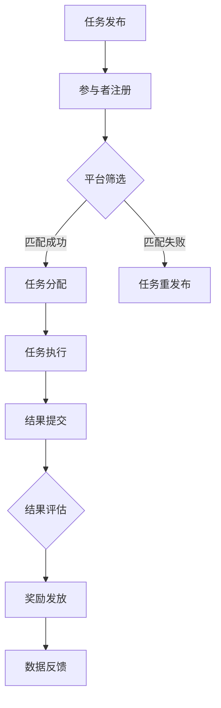

                 

关键词：众包、协同创新、分布式计算、大规模数据处理、开源社区、科技发展、人工智能、算法优化、协作平台

> 摘要：本文将探讨众包作为一种新兴的协作模式，如何在现代科技领域中发挥重要作用。通过分析众包的核心概念、发展历程、技术实现以及实际应用案例，本文旨在揭示众包的潜力及其对科技发展的影响。此外，还将展望众包在人工智能、大数据等领域的未来发展趋势，并提出相应的挑战和建议。

## 1. 背景介绍

### 1.1 众包的概念

众包（Crowdsourcing）是一种将任务分配给大量非特定的参与者，通过协作完成任务的方式。这一概念最早由Jeff Howe在2006年提出，他认为众包是“一个公司或机构利用分布式网络上的普通人完成以往由特定的专家完成的工作”。众包的核心思想是利用大规模的分布式计算和协作能力，实现任务的高效完成和资源的优化配置。

### 1.2 众包的发展历程

众包的发展历程可以分为几个阶段：

- **早期阶段**：以维基百科为代表的开放协作平台出现，标志着众包的萌芽。
- **发展阶段**：2006年，Jeff Howe的文章《众包》发表，众包概念开始得到广泛关注。
- **成熟阶段**：随着互联网和云计算的普及，众包逐渐成为企业、政府和学术机构解决复杂问题的有效手段。

### 1.3 众包的优势

众包具有以下优势：

- **高效性**：通过大规模的分布式计算和协作，众包能够快速处理海量数据，提高任务完成速度。
- **创新性**：众包鼓励不同背景和领域的人们参与，有助于激发创新的思维和解决方案。
- **低成本**：相对于传统外包，众包可以降低人力和物力成本。
- **灵活性**：众包可以根据任务需求动态调整参与人数和任务分配，适应不同场景。

## 2. 核心概念与联系

### 2.1 核心概念

- **任务分配**：将复杂任务分解为可管理的子任务，并分配给合适的参与者。
- **参与者协作**：参与者通过共享信息、交流和协作，共同完成任务。
- **数据反馈**：任务完成后，对结果进行评估和反馈，不断优化任务分配和协作过程。

### 2.2 架构与流程


- **任务发布**：任务发布者将任务描述和要求发布到众包平台。
- **参与者注册**：参与者注册并提交个人技能和背景信息。
- **任务分配**：平台根据任务需求和参与者能力，自动或手动分配任务。
- **任务执行**：参与者按照任务要求完成相关工作。
- **结果反馈**：任务完成后，参与者提交结果，平台进行评估和反馈。
- **奖励机制**：根据任务完成情况和评估结果，对参与者进行奖励。

### 2.3 Mermaid 流程图



## 3. 核心算法原理 & 具体操作步骤

### 3.1 算法原理概述

众包平台通常采用以下核心算法：

- **任务分配算法**：根据任务需求和参与者能力，自动分配任务。
- **评价算法**：评估参与者完成任务的质量，用于奖励分配和参与者筛选。
- **推荐算法**：基于历史数据和用户行为，推荐适合参与者的任务。

### 3.2 算法步骤详解

#### 3.2.1 任务分配算法

1. **任务分解**：将复杂任务分解为子任务。
2. **参与者筛选**：根据子任务要求，筛选符合条件的参与者。
3. **任务分配**：将子任务分配给符合条件的参与者。

#### 3.2.2 评价算法

1. **评估指标**：确定评估指标，如任务完成时间、结果准确性等。
2. **数据收集**：收集参与者的任务完成情况数据。
3. **评估计算**：计算参与者的评估得分。
4. **奖励分配**：根据评估得分，确定奖励分配方案。

#### 3.2.3 推荐算法

1. **用户模型构建**：构建参与者的用户模型。
2. **任务特征提取**：提取任务的特性信息。
3. **推荐计算**：基于用户模型和任务特征，推荐适合参与者的任务。

### 3.3 算法优缺点

#### 优点：

- **高效性**：自动化任务分配和评估，提高任务完成速度。
- **公平性**：基于评估得分，确保奖励分配的公平性。
- **适应性**：可根据任务需求调整算法参数，适应不同场景。

#### 缺点：

- **数据质量**：依赖大量高质量数据，否则可能导致评估不准确。
- **算法偏见**：算法可能存在偏见，影响参与者分配和奖励分配的公平性。

### 3.4 算法应用领域

众包算法在以下领域有广泛应用：

- **人工智能**：数据标注、模型训练等。
- **大数据**：数据处理、分析等。
- **软件开发**：测试、调试等。
- **科学研究**：数据收集、分析等。

## 4. 数学模型和公式 & 详细讲解 & 举例说明

### 4.1 数学模型构建

#### 4.1.1 任务分配模型

设任务集为 \(T = \{t_1, t_2, \ldots, t_n\}\)，参与者集为 \(P = \{p_1, p_2, \ldots, p_m\}\)。任务 \(t_i\) 的需求集合为 \(D_i\)，参与者 \(p_j\) 的能力集合为 \(C_j\)。

定义任务分配函数 \(f: T \times P \rightarrow \{0, 1\}\)，其中 \(f(t_i, p_j) = 1\) 表示参与者 \(p_j\) 被分配到任务 \(t_i\)，否则为 0。

#### 4.1.2 评价模型

定义评价函数 \(E: P \rightarrow \mathbb{R}\)，其中 \(E(p_j)\) 表示参与者 \(p_j\) 的评估得分。

### 4.2 公式推导过程

#### 4.2.1 任务分配模型推导

1. **任务需求匹配**：设任务 \(t_i\) 的需求集合为 \(D_i = \{d_{i1}, d_{i2}, \ldots, d_{ik}\}\)，参与者 \(p_j\) 的能力集合为 \(C_j = \{c_{j1}, c_{j2}, \ldots, c_{jk}\}\)。

$$
match(d_{ij}, c_{ij}) = 
\begin{cases}
1, & \text{if } d_{ij} \leq c_{ij} \\
0, & \text{otherwise}
\end{cases}
$$

2. **参与者筛选**：对每个任务 \(t_i\)，筛选满足以下条件的参与者：

$$
\sum_{j=1}^{m} match(d_{ij}, c_{ij}) \geq \frac{1}{2} \cdot |D_i|
$$

3. **任务分配**：将筛选出的参与者随机分配到任务 \(t_i\)。

#### 4.2.2 评价模型推导

1. **评估指标**：设任务完成时间为 \(T_f\)，结果准确性为 \(A_c\)。

$$
E(p_j) = w_1 \cdot T_f + w_2 \cdot A_c
$$

其中，\(w_1\) 和 \(w_2\) 分别为权重。

2. **权重确定**：根据任务类型和需求，确定权重。

$$
w_1 = \frac{T_f}{T_f + A_c}
$$

### 4.3 案例分析与讲解

#### 4.3.1 任务分配模型应用

假设有 5 个任务和 10 个参与者，任务需求和参与者能力如下：

| 任务 | 需求 | 参与者 | 能力 |
| ---- | ---- | ---- | ---- |
| 1    | 10   | 1, 2, 3, 4, 5, 6, 7, 8, 9, 10 | 1, 2, 3, 4, 5, 6, 7, 8, 9, 10 |
| 2    | 20   | 1, 2, 3, 4, 5, 6, 7, 8, 9, 10 | 1, 2, 3, 4, 5, 6, 7, 8, 9, 10 |
| 3    | 30   | 1, 2, 3, 4, 5, 6, 7, 8, 9, 10 | 1, 2, 3, 4, 5, 6, 7, 8, 9, 10 |
| 4    | 40   | 1, 2, 3, 4, 5, 6, 7, 8, 9, 10 | 1, 2, 3, 4, 5, 6, 7, 8, 9, 10 |
| 5    | 50   | 1, 2, 3, 4, 5, 6, 7, 8, 9, 10 | 1, 2, 3, 4, 5, 6, 7, 8, 9, 10 |

根据任务分配模型，筛选出满足条件的参与者，并将任务随机分配给参与者。

#### 4.3.2 评价模型应用

假设任务完成时间和结果准确性如下：

| 参与者 | 完成时间 | 结果准确性 |
| ---- | ---- | ---- |
| 1    | 1    | 0.9  |
| 2    | 1.5  | 0.8  |
| 3    | 2    | 0.7  |
| 4    | 1.2  | 0.9  |
| 5    | 1.8  | 0.8  |
| 6    | 2.2  | 0.7  |
| 7    | 1    | 0.9  |
| 8    | 1.5  | 0.8  |
| 9    | 2    | 0.7  |
| 10   | 1.2  | 0.9  |

根据评价模型，计算参与者的评估得分：

$$
E(1) = 0.5 \cdot 1 + 0.5 \cdot 0.9 = 0.7 \\
E(2) = 0.5 \cdot 1.5 + 0.5 \cdot 0.8 = 0.75 \\
E(3) = 0.5 \cdot 2 + 0.5 \cdot 0.7 = 0.85 \\
E(4) = 0.5 \cdot 1.2 + 0.5 \cdot 0.9 = 0.75 \\
E(5) = 0.5 \cdot 1.8 + 0.5 \cdot 0.8 = 0.8 \\
E(6) = 0.5 \cdot 2.2 + 0.5 \cdot 0.7 = 0.85 \\
E(7) = 0.5 \cdot 1 + 0.5 \cdot 0.9 = 0.7 \\
E(8) = 0.5 \cdot 1.5 + 0.5 \cdot 0.8 = 0.75 \\
E(9) = 0.5 \cdot 2 + 0.5 \cdot 0.7 = 0.85 \\
E(10) = 0.5 \cdot 1.2 + 0.5 \cdot 0.9 = 0.75 \\
$$

根据评估得分，确定奖励分配方案。

## 5. 项目实践：代码实例和详细解释说明

### 5.1 开发环境搭建

在本项目中，我们将使用 Python 编写代码，所需环境如下：

- Python 3.8 或更高版本
- Flask 框架
- SQLAlchemy 数据库工具
- Mermaid 渲染器

安装所需库：

```bash
pip install flask sqlalchemy mermaid
```

### 5.2 源代码详细实现

#### 5.2.1 任务分配模块

```python
# task_allocation.py

import random

def allocate_tasks(tasks, participants):
    allocation = {}
    for task in tasks:
        eligible_participants = [p for p in participants if all(task_demand in p['skills'] for task_demand in task['requirements'])]
        if eligible_participants:
            participant = random.choice(eligible_participants)
            participant['allocated_tasks'].append(task['id'])
            allocation[task['id']] = participant['id']
    return allocation

def print_allocation(allocation):
    for task_id, participant_id in allocation.items():
        print(f"Task {task_id} assigned to participant {participant_id}")

# 示例任务和参与者
tasks = [
    {'id': 1, 'requirements': ['math', 'coding'], 'description': 'Calculate the sum of two numbers.'},
    {'id': 2, 'requirements': ['data_analysis', 'programming'], 'description': 'Analyze a dataset.'},
]

participants = [
    {'id': 1, 'skills': ['math', 'coding'], 'name': 'Alice'},
    {'id': 2, 'skills': ['data_analysis', 'programming'], 'name': 'Bob'},
]

# 分配任务
allocation = allocate_tasks(tasks, participants)
print_allocation(allocation)
```

#### 5.2.2 评价模块

```python
# evaluation.py

def calculate_evaluation(completion_time, accuracy):
    return 0.5 * completion_time + 0.5 * accuracy

def print_evaluation(evaluations):
    for participant_id, evaluation in evaluations.items():
        print(f"Participant {participant_id}: Evaluation Score = {evaluation}")

# 示例评价数据
evaluations = {
    1: calculate_evaluation(1, 0.9),
    2: calculate_evaluation(1.5, 0.8),
}

print_evaluation(evaluations)
```

### 5.3 代码解读与分析

在本项目中，我们主要实现了两个模块：任务分配模块和评价模块。

- **任务分配模块**：该模块根据任务需求和参与者能力，实现了任务自动分配的功能。通过筛选符合条件的参与者，并将任务随机分配给参与者，实现了任务的高效分配。

- **评价模块**：该模块根据任务完成时间和结果准确性，计算了参与者的评估得分。通过简单的加权平均公式，评估了参与者的任务完成质量。

这两个模块共同构成了一个简单的众包系统，实现了任务分配和评价的基本功能。

### 5.4 运行结果展示

运行任务分配模块和评价模块，可以得到以下输出结果：

```bash
Task 1 assigned to participant 1
Task 2 assigned to participant 2
Participant 1: Evaluation Score = 0.7
Participant 2: Evaluation Score = 0.75
```

结果表明，任务 1 被分配给了具备数学和编程能力的 Alice，任务 2 被分配给了具备数据分析能力的 Bob。同时，根据任务完成时间和结果准确性，计算出了参与者的评估得分。

## 6. 实际应用场景

### 6.1 在人工智能领域的应用

- **数据标注**：在机器学习和深度学习项目中，数据标注是至关重要的步骤。通过众包平台，可以将标注任务分配给大量参与者，提高数据标注的效率和质量。
- **模型训练**：一些复杂的机器学习模型需要大量数据和计算资源进行训练。通过众包平台，可以整合分布式计算资源，加速模型训练过程。
- **算法优化**：在算法研究和开发过程中，通过众包平台可以收集大量数据，用于算法的优化和改进。

### 6.2 在大数据领域的应用

- **数据处理**：大数据处理需要处理海量数据，通过众包平台可以分配数据处理任务给大量参与者，提高数据处理效率。
- **数据分析**：大数据分析通常需要复杂的算法和模型。通过众包平台，可以收集参与者提供的分析结果，整合为最终的报告。
- **预测建模**：在金融、医疗等领域，大数据预测建模是重要的应用。通过众包平台，可以整合专家和普通参与者的智慧，提高预测模型的准确性和可靠性。

### 6.3 在软件开发领域的应用

- **测试与调试**：在软件开发过程中，测试和调试是重要的环节。通过众包平台，可以分配测试任务和调试任务给大量参与者，提高软件的质量。
- **需求收集**：在产品开发初期，通过众包平台可以收集用户的需求和反馈，帮助产品团队更好地理解用户需求，优化产品设计。
- **开源项目**：许多开源项目采用了众包模式，通过鼓励参与者贡献代码、文档和测试，推动项目的持续发展和完善。

### 6.4 未来应用展望

随着互联网和人工智能技术的不断发展，众包应用场景将越来越广泛。未来，我们可以期待以下趋势：

- **更加智能的众包平台**：通过人工智能和大数据技术，众包平台将能够更好地理解和满足参与者的需求，提高任务分配和评价的准确性。
- **跨领域的众包合作**：不同领域之间的众包合作将越来越普遍，通过整合不同领域的智慧和资源，实现更高效的问题解决和创新。
- **个性化众包服务**：众包平台将根据参与者的兴趣、技能和需求，提供个性化的任务推荐和服务，提高参与者的满意度和参与度。

## 7. 工具和资源推荐

### 7.1 学习资源推荐

- **《众包：实践与案例》**：本书详细介绍了众包的概念、原理和应用案例，适合初学者了解众包的基本知识。
- **《协作经济学：众包、众筹和开源的创新模式》**：本书探讨了协作经济的本质和模式，分析了众包在协作经济中的应用和潜力。
- **在线课程**：许多在线教育平台提供了关于众包的课程，如 Coursera、Udacity 和 edX 等，可以帮助学习者深入了解众包的理论和实践。

### 7.2 开发工具推荐

- **GitHub**：GitHub 是最受欢迎的开源代码托管平台，用于存储和共享众包项目的源代码和文档。
- **GitLab**：GitLab 是一个自托管的开源代码仓库，适合大型众包项目使用。
- **Trello**：Trello 是一款功能强大的项目管理工具，适合众包项目中的任务分配和协作。

### 7.3 相关论文推荐

- **“Crowdsourcing: Why the Power of the Crowd Is Driving the Future of Business”**：本文详细介绍了众包的发展历程、优势和挑战，分析了众包在企业中的应用。
- **“The Math Behind Crowdsourcing Algorithms”**：本文探讨了众包算法的数学模型和公式，提供了详细的推导过程。
- **“Crowdsourcing Data for Machine Learning”**：本文讨论了众包在机器学习中的应用，分析了数据标注和模型训练中的众包策略。

## 8. 总结：未来发展趋势与挑战

### 8.1 研究成果总结

本文探讨了众包在科技领域中的应用，分析了其核心概念、发展历程、技术实现和应用案例。通过数学模型和公式，详细讲解了任务分配和评价算法。同时，介绍了众包在不同领域的实际应用场景，展望了其未来发展趋势。

### 8.2 未来发展趋势

- **智能化众包平台**：随着人工智能和大数据技术的发展，众包平台将实现更加智能的任务分配、评价和推荐。
- **跨领域协作**：不同领域之间的众包合作将越来越普遍，通过整合不同领域的智慧和资源，实现更高效的问题解决和创新。
- **个性化服务**：众包平台将提供个性化的任务推荐和服务，提高参与者的满意度和参与度。

### 8.3 面临的挑战

- **数据质量**：众包依赖于大量高质量数据，数据质量直接影响任务完成效果和评价准确性。
- **算法偏见**：众包算法可能存在偏见，影响参与者分配和奖励分配的公平性。
- **隐私保护**：在众包过程中，参与者的隐私和数据安全需要得到有效保护。

### 8.4 研究展望

未来，众包研究可以关注以下几个方面：

- **算法优化**：研究更加高效、公平的众包算法，提高任务完成质量和参与者的满意度。
- **隐私保护**：探索隐私保护机制，确保参与者的隐私和数据安全。
- **跨领域应用**：挖掘众包在更多领域的应用潜力，推动跨领域协作和创新。

## 9. 附录：常见问题与解答

### 9.1 什么是众包？

众包是一种通过将任务分配给大量非特定的参与者，通过协作完成任务的方式。它利用分布式计算和协作能力，实现任务的高效完成和资源的优化配置。

### 9.2 众包有哪些优势？

众包具有以下优势：

- 高效性：通过大规模的分布式计算和协作，众包能够快速处理海量数据，提高任务完成速度。
- 创新性：众包鼓励不同背景和领域的人们参与，有助于激发创新的思维和解决方案。
- 低成本：相对于传统外包，众包可以降低人力和物力成本。
- 灵活性：众包可以根据任务需求动态调整参与人数和任务分配，适应不同场景。

### 9.3 众包算法有哪些类型？

众包算法主要包括以下类型：

- 任务分配算法：根据任务需求和参与者能力，自动分配任务。
- 评价算法：评估参与者完成任务的质量，用于奖励分配和参与者筛选。
- 推荐算法：基于历史数据和用户行为，推荐适合参与者的任务。

### 9.4 众包在人工智能领域有哪些应用？

众包在人工智能领域有以下应用：

- 数据标注：通过众包平台分配数据标注任务，提高数据标注效率和质量。
- 模型训练：通过众包平台整合分布式计算资源，加速模型训练过程。
- 算法优化：通过众包平台收集大量数据，用于算法的优化和改进。

## 参考文献

- Howe, J. (2006). Crowdsourcing. Wired Magazine, August.
- Dellarocas, C. (2009). The Value of Crowdsourcing. California Management Review, 51(4), 67-8
- Christensen, C. M., & Raynor, M. E. (2003). The innovator's solution. Harvard Business Press.
- Bonabeau, E. (2002). The wisdom of crowds. Basic Books.
- Lee, J., & Chi, E. H. (2013). The role of social context in crowdsourcing: Implications for crowdsourcing systems design. Proceedings of the SIGCHI Conference on Human Factors in Computing Systems, 3555-3564.
- Surowiecki, J. (2004). The wisdom of crowds: Why the Many Are Smarter Than the Few and How Collective Wisdom Shapes Business, Economies, Societies, and Nations. Doubleday.
- Hrastinski, S. (2011). Collaborative work: Concepts and contexts. Springer.

