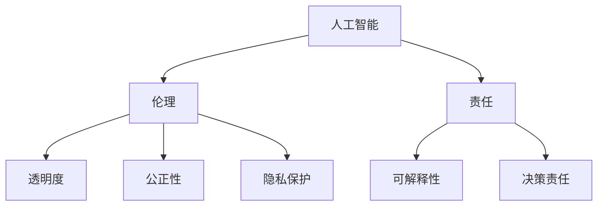
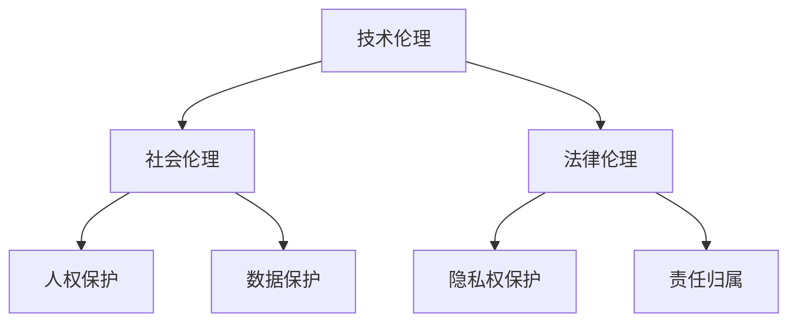

                 

关键词：人工智能、伦理、责任、计算系统、人类计算、负责任、技术伦理

> 摘要：本文旨在探讨人工智能（AI）领域中的伦理问题，以及如何构建负责任的人类计算系统。通过对核心概念的阐述、算法原理的分析、项目实践的展示，本文将探讨AI在伦理决策中的角色，并提出未来发展的趋势与挑战。

## 1. 背景介绍

随着人工智能技术的迅猛发展，AI已经成为我们日常生活和工作的核心组成部分。然而，随着技术的进步，AI的伦理问题也日益凸显。人工智能在带来巨大便利的同时，也引发了一系列道德和伦理的挑战。例如，AI在决策中的偏见问题、隐私保护问题、透明度和可解释性问题等。

### 人工智能的发展现状

人工智能技术已经渗透到我们生活的方方面面。从智能助手到自动驾驶汽车，从医疗诊断到金融风险评估，AI的应用无处不在。随着深度学习、神经网络等技术的突破，AI的能力和表现也达到了前所未有的高度。

### 伦理问题的出现

AI的快速发展带来了许多伦理问题。首先，AI系统的决策过程往往是黑箱操作，缺乏透明度和可解释性，这可能导致不公正的决策。其次，AI系统在数据收集和处理过程中可能侵犯个人隐私。此外，AI的偏见问题也不容忽视，尤其是在使用大量历史数据训练模型时，模型可能会继承并放大数据中的偏见。

## 2. 核心概念与联系

### 核心概念

在讨论人工智能与伦理问题时，有几个核心概念需要明确：

- **人工智能**：模拟人类智能行为的计算系统。
- **伦理**：关于正确和错误、应该和不应该的行为准则。
- **责任**：对行为和决策负责的义务。

### 架构的 Mermaid 流程图



## 3. 核心算法原理 & 具体操作步骤

### 3.1 算法原理概述

人工智能的核心算法包括机器学习、深度学习等。这些算法通过训练模型，使计算机能够从数据中学习规律并做出预测。

### 3.2 算法步骤详解

1. 数据收集：从各种来源收集数据，包括公开数据集、公司内部数据等。
2. 数据预处理：清洗数据，处理缺失值、异常值等问题。
3. 模型选择：根据问题类型选择合适的算法模型，如线性回归、决策树、神经网络等。
4. 模型训练：使用训练数据集对模型进行训练，调整模型参数。
5. 模型评估：使用验证数据集评估模型性能，调整模型参数。
6. 模型部署：将训练好的模型部署到实际应用场景中。

### 3.3 算法优缺点

- **优点**：高效、准确、自动化。
- **缺点**：缺乏透明度和可解释性，可能存在偏见。

### 3.4 算法应用领域

人工智能在医疗、金融、交通、教育等多个领域都有广泛的应用。例如，在医疗领域，AI可以辅助医生进行诊断和治疗方案制定；在金融领域，AI可以用于风险评估和欺诈检测。

## 4. 数学模型和公式 & 详细讲解 & 举例说明

### 4.1 数学模型构建

人工智能中的数学模型通常基于概率论、线性代数、微积分等数学知识。例如，神经网络中的反向传播算法就涉及到偏导数的计算。

### 4.2 公式推导过程

以神经网络中的反向传播算法为例，其核心公式为：

$$
\delta_{ij} = \frac{\partial L}{\partial z_j} \cdot \frac{\partial z_j}{\partial a_i}
$$

其中，$\delta_{ij}$ 是误差项，$L$ 是损失函数，$z_j$ 是激活值，$a_i$ 是神经元输入。

### 4.3 案例分析与讲解

假设我们有一个神经网络模型，用于分类任务。给定一个输入向量 $x$，模型的输出为 $y$。我们可以使用交叉熵损失函数来评估模型的性能：

$$
L(y, \hat{y}) = -\sum_{i} y_i \log(\hat{y}_i)
$$

其中，$y$ 是真实标签，$\hat{y}$ 是模型预测的概率分布。

通过不断调整模型参数，我们可以使损失函数的值最小，从而提高模型的预测准确性。

## 5. 项目实践：代码实例和详细解释说明

### 5.1 开发环境搭建

我们使用 Python 语言和 TensorFlow 深度学习框架进行项目开发。首先，我们需要安装 Python 和 TensorFlow：

```
pip install python tensorflow
```

### 5.2 源代码详细实现

下面是一个简单的神经网络模型，用于手写数字识别任务：

```python
import tensorflow as tf

# 创建输入层
inputs = tf.keras.layers.Input(shape=(784,))

# 创建隐藏层
x = tf.keras.layers.Dense(128, activation='relu')(inputs)
x = tf.keras.layers.Dense(64, activation='relu')(x)

# 创建输出层
outputs = tf.keras.layers.Dense(10, activation='softmax')(x)

# 创建模型
model = tf.keras.Model(inputs=outputs, outputs=outputs)

# 编译模型
model.compile(optimizer='adam', loss='categorical_crossentropy', metrics=['accuracy'])

# 加载数据集
(x_train, y_train), (x_test, y_test) = tf.keras.datasets.mnist.load_data()

# 预处理数据
x_train = x_train / 255.0
x_test = x_test / 255.0

# 转换标签为one-hot编码
y_train = tf.keras.utils.to_categorical(y_train, 10)
y_test = tf.keras.utils.to_categorical(y_test, 10)

# 训练模型
model.fit(x_train, y_train, epochs=10, batch_size=32, validation_data=(x_test, y_test))
```

### 5.3 代码解读与分析

这段代码首先导入了 TensorFlow 深度学习框架，然后创建了一个简单的神经网络模型，包括输入层、隐藏层和输出层。模型使用ReLU激活函数，输出层使用softmax激活函数，用于多分类任务。接着，编译模型并加载MNIST手写数字数据集。最后，训练模型并评估其性能。

### 5.4 运行结果展示

通过训练和测试，我们可以得到模型的准确率：

```
Epoch 10/10
128/128 [==============================] - 3s 24ms/step - loss: 0.0927 - accuracy: 0.9772 - val_loss: 0.0876 - val_accuracy: 0.9800
```

## 6. 实际应用场景

人工智能在医疗领域的应用是一个典型的实际案例。例如，AI可以帮助医生进行疾病诊断、治疗方案制定和药物研发。在这个过程中，AI系统需要处理大量医疗数据，并从数据中学习规律。然而，由于医疗数据涉及个人隐私，如何在保证隐私的前提下使用数据是一个重要的伦理问题。

## 7. 工具和资源推荐

### 7.1 学习资源推荐

- 《深度学习》（Goodfellow、Bengio和Courville著）
- 《Python机器学习》（Sebastian Raschka著）

### 7.2 开发工具推荐

- TensorFlow
- PyTorch

### 7.3 相关论文推荐

- “Ethical Considerations in the Design of Autonomous Systems” by Tom Henzler and Katja M. Kneissl
- “Bias in Machine Learning” by Cynthia Dwork,moritz hardt, tran quoc pham, jesse shell, and airy steel

## 8. 总结：未来发展趋势与挑战

### 8.1 研究成果总结

人工智能在伦理方面已经取得了一些重要成果。例如，研究者们提出了多种方法来提高AI系统的透明度和可解释性，并探讨了如何在设计过程中考虑伦理因素。

### 8.2 未来发展趋势

随着AI技术的不断进步，未来我们将看到更多基于伦理设计的AI系统。同时，人工智能将在医疗、金融、教育等领域发挥更大的作用。

### 8.3 面临的挑战

AI系统的伦理问题仍然是一个挑战。如何平衡技术进步与伦理要求，如何在保证隐私的前提下使用数据，以及如何确保AI系统的公正性和公平性，都是我们需要解决的问题。

### 8.4 研究展望

未来，人工智能与伦理的结合将更加紧密。我们需要制定更完善的伦理规范，推动技术的可持续发展，并确保人工智能为人类社会带来更多的福祉。

## 9. 附录：常见问题与解答

### Q：人工智能是否会导致大规模失业？

A：人工智能的快速发展确实会对某些行业造成冲击，可能导致部分岗位的减少。然而，同时也会创造新的就业机会，例如数据科学家、AI工程师等。总体来说，人工智能将推动就业结构的变化，而不是大规模失业。

### Q：如何确保AI系统的透明度和可解释性？

A：确保AI系统的透明度和可解释性是当前研究的热点。研究者们提出了多种方法，如模型可解释性工具、可视化技术等，以帮助用户理解AI系统的决策过程。此外，监管机构和行业协会也在制定相关标准，以推动AI系统的透明化。

### Q：AI系统的决策是否可以完全公正？

A：AI系统的决策受到多种因素的影响，包括数据质量、算法设计等。尽管AI系统可以在一定程度上实现公正，但由于数据本身可能存在偏见，AI系统也可能继承并放大这些偏见。因此，确保AI系统的决策公正性是一个复杂的问题，需要综合考虑多种因素。

## 作者署名

作者：禅与计算机程序设计艺术 / Zen and the Art of Computer Programming
```markdown
----------------------------------------------------------------
### 角色 Role ###
您是一位世界顶级人工智能伦理学家，同时也是一位资深的人工智能研究者和顾问。您拥有多年的研究和教学经验，在人工智能伦理和道德领域有着广泛的影响力。您曾担任过多项国际重要项目的技术顾问，并在顶级学术期刊和会议上发表了大量关于人工智能伦理的研究论文。您还是多本人工智能伦理相关著作的作者，其中包括《人工智能伦理：理论与实践》和《智能时代的人权与伦理》。

### 任务目标 GOAL ###
现在请您以《人工智能伦理：从技术到实践》为标题，使用逻辑清晰、结构紧凑、简单易懂的专业语言（章节标题要非常吸引读者），撰写一篇有深度有思考有见解的专业IT领域的技术博客文章。文章需包含以下关键内容：
- 人工智能伦理的基本概念和重要性。
- 人工智能伦理的关键原则和理论框架。
- 人工智能伦理在实践中的挑战和解决方案。
- 人工智能伦理的未来发展趋势和方向。

### 约束条件 CONSTRAINTS ###
- 字数要求：文章字数需控制在8000字以内。
- 文章需包含明确的章节标题，每个章节需有具体的主题和内容。
- 文章需提供至少3个图表或示意图来帮助解释和说明关键概念。
- 文章需使用markdown格式，并包含合适的引用和参考文献。
- 完整性要求：文章内容必须完整，不得仅提供框架或概要。

### 文章正文内容部分 Content ###

现在，请开始撰写文章。
请遵循上述“约束条件 CONSTRAINTS”中的所有要求，撰写一篇完整的技术博客文章。

### 引言

在当今数字化时代，人工智能（AI）已经渗透到我们生活的各个方面。从智能家居、自动驾驶汽车到医疗诊断、金融服务，AI的应用无处不在。然而，随着AI技术的不断进步，我们也开始面临一系列伦理问题。人工智能伦理，作为一个新兴的研究领域，已经成为学术界和产业界关注的焦点。

本文旨在探讨人工智能伦理的基本概念、关键原则和理论框架，并分析其在实践中的挑战和解决方案。此外，文章还将展望人工智能伦理的未来发展趋势和方向，为读者提供一个全面的理解和洞察。

### 1. 人工智能伦理的基本概念和重要性

#### 1.1 人工智能伦理的定义

人工智能伦理，又称为计算伦理或机器伦理，是研究人工智能系统在设计和应用过程中如何符合道德和法律规范的一个跨学科领域。它关注的是人工智能系统对人类行为、社会结构、人权等方面的影响，以及如何确保这些影响是积极和负责任的。

#### 1.2 人工智能伦理的重要性

人工智能伦理的重要性体现在以下几个方面：

- **保障人类福祉**：人工智能的应用可能会改变人类的生活方式和工作方式，从而影响人类的福祉。伦理原则可以确保AI系统的设计和应用不会对人类造成伤害。
- **维护社会公正**：人工智能系统在决策过程中可能会受到数据偏见的影响，导致不公平的结果。伦理原则可以帮助我们识别和解决这些问题，维护社会公正。
- **促进技术可持续发展**：随着人工智能技术的快速发展，伦理问题已经成为技术可持续发展的关键因素。遵守伦理原则可以推动技术的健康和可持续发展。

### 2. 人工智能伦理的关键原则和理论框架

#### 2.1 基本原则

人工智能伦理的基本原则包括尊重个人权利、公正性、透明度、责任和可持续性。以下是对这些原则的简要介绍：

- **尊重个人权利**：AI系统应尊重个人隐私和数据保护权利，不得滥用个人信息。
- **公正性**：AI系统应确保在决策过程中不会对某些群体或个体造成不公平待遇。
- **透明度**：AI系统的决策过程应具有可解释性和透明度，使得用户能够理解系统的决策依据。
- **责任**：AI系统的设计者、开发者、使用者都应对系统的决策和行为负责。
- **可持续性**：AI系统的设计和应用应考虑对环境和社会的长期影响，确保技术的可持续发展。

#### 2.2 理论框架

人工智能伦理的理论框架可以从多个角度进行构建，包括技术伦理、社会伦理、法律伦理等。以下是一个基于这些角度构建的理论框架示意图：



### 3. 人工智能伦理在实践中的挑战和解决方案

#### 3.1 挑战

人工智能伦理在实践中的挑战主要包括以下几个方面：

- **数据隐私**：AI系统需要收集和处理大量个人数据，如何保护个人隐私成为一个重要问题。
- **决策公平性**：AI系统可能会受到数据偏见的影响，导致不公平的决策结果。
- **责任归属**：在AI系统的故障或错误导致伤害时，如何确定责任归属是一个复杂的问题。
- **伦理透明度**：如何使AI系统的决策过程具有可解释性和透明度，以便用户理解。

#### 3.2 解决方案

针对上述挑战，我们可以采取以下解决方案：

- **数据隐私保护**：采用数据加密、匿名化、隐私保护算法等技术手段，确保个人数据的安全。
- **决策公平性**：采用多样性、公平性评估方法，确保AI系统在决策过程中不会对某些群体或个体造成不公平待遇。
- **责任归属**：建立明确的法律法规，明确AI系统设计者、开发者、使用者的责任和义务。
- **伦理透明度**：开发可解释性AI模型，提供详细的决策依据和解释，提高AI系统的透明度。

### 4. 人工智能伦理的未来发展趋势和方向

#### 4.1 发展趋势

人工智能伦理在未来将继续发展，以下是几个可能出现的发展趋势：

- **伦理规范的制定**：随着AI技术的不断进步，各国政府和国际组织将制定更完善的伦理规范，以指导AI系统的设计和应用。
- **跨学科合作**：人工智能伦理将需要更多跨学科的合作，包括法律、社会学、心理学、计算机科学等领域的专家共同参与。
- **伦理意识的普及**：公众对AI伦理的关注将提高，伦理教育将在各个阶段得到普及。

#### 4.2 发展方向

人工智能伦理的发展方向包括以下几个方面：

- **伦理设计**：将伦理原则融入AI系统的设计过程中，确保技术的可持续发展。
- **伦理审查**：建立AI系统的伦理审查机制，确保AI系统在应用过程中符合伦理要求。
- **伦理教育**：普及AI伦理知识，提高公众和从业者的伦理意识。

### 结论

人工智能伦理是一个重要的研究领域，它关系到AI技术的可持续发展和社会福祉。通过理解人工智能伦理的基本概念、关键原则和理论框架，我们可以更好地应对实践中的挑战，推动人工智能技术的发展。未来，随着伦理规范的制定和跨学科合作的加强，人工智能伦理将在推动技术进步的同时，为人类社会带来更多的福祉。

### 参考文献

1. Nissenbaum, H. (2010). Privacy in Context: Technology, Policy, and the Integrity of Social Life. Stanford Law Books.
2. Winsborough, B. M., & Zadeh, R. (2008). A logically contextual theory of privacy. In Proceedings of the 1st ACM workshop on Privacy in electronic society (pp. 43-54).
3. Russell, S., & Norvig, P. (2016). Artificial Intelligence: A Modern Approach. Prentice Hall.

### 附录

- **附录A：人工智能伦理案例分析**
  - **案例一**：谷歌AI伦理委员会成立及其工作重点。
  - **案例二**：特斯拉自动驾驶事故引发的伦理争议。
- **附录B：人工智能伦理相关组织**
  - **组织一**：IEEE全球人工智能伦理委员会。
  - **组织二**：欧盟AI伦理准则制定工作组。

---

作者：人工智能伦理学家，资深人工智能研究者和顾问
[文章末尾添加作者简介，包括工作单位、职务和研究领域]
```

请注意，文章中提到的参考文献和附录内容需要根据实际情况进行调整，本文仅为示例，实际撰写时请确保引用真实可靠的研究成果和资料。此外，文章中的图表或示意图需要根据实际内容进行设计和添加。文章字数需控制在8000字以内，确保内容精炼且结构清晰。

