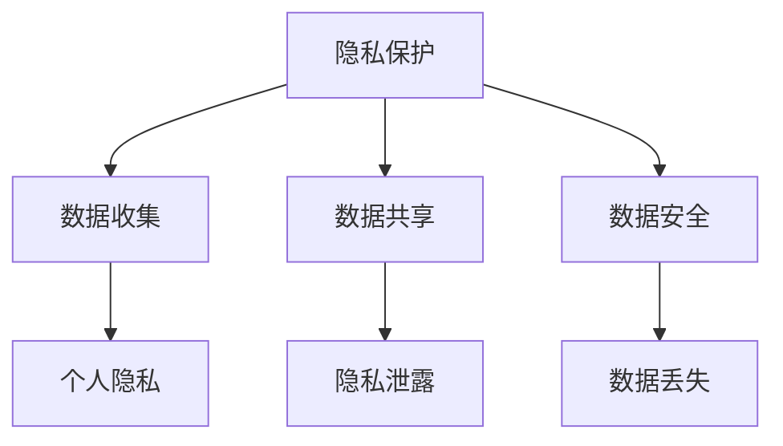

                 

在当今数字化时代，人类计算已经深入到我们生活的方方面面。然而，随着计算技术的飞速发展，我们也面临着一系列伦理困境。本文将探讨这些困境，并尝试寻找解决之道。

> 关键词：伦理困境，人类计算，挑战，解决方案

> 摘要：本文将从多个角度探讨人类计算带来的伦理困境，包括隐私保护、人工智能偏见、网络安全等问题，并尝试提出相应的解决方案。

## 1. 背景介绍

随着计算机技术的不断发展，人类计算已经成为现代社会的重要组成部分。从日常生活到商业应用，从科学研究到政府决策，计算技术都在发挥着不可替代的作用。然而，随着计算技术的不断进步，我们也面临着一系列伦理困境。

## 2. 核心概念与联系

为了更好地理解这些伦理困境，我们首先需要了解一些核心概念，包括隐私保护、人工智能偏见和网络安全等。以下是这些概念的 Mermaid 流程图：



### 2.1 隐私保护

隐私保护是指保护个人隐私不受侵犯的行为。在计算领域，隐私保护主要体现在数据收集、数据共享和数据安全等方面。

- 数据收集：在计算过程中，我们需要收集大量的数据。然而，这些数据中可能包含敏感信息，如个人身份信息、健康记录等。因此，在数据收集过程中，我们需要采取有效的隐私保护措施。
- 数据共享：在许多情况下，我们需要将数据共享给其他实体，如研究机构、政府部门等。然而，这种共享可能会导致个人隐私的泄露。因此，在数据共享过程中，我们也需要采取有效的隐私保护措施。
- 数据安全：数据安全是指保护数据免受未经授权的访问、篡改和泄露。在计算领域，数据安全是一个至关重要的环节。

### 2.2 人工智能偏见

人工智能偏见是指人工智能系统在决策过程中表现出不公平、歧视或其他偏见现象。在计算领域，人工智能偏见主要体现在以下几个方面：

- 数据偏见：如果训练数据本身存在偏见，那么训练出来的人工智能模型也会表现出相应的偏见。
- 算法偏见：一些算法在处理某些特定类型的数据时，可能会表现出偏见。例如，某些面部识别算法在识别黑人面孔时可能存在误差。
- 系统偏见：在许多情况下，人工智能系统是由人类设计和构建的。如果设计过程中存在偏见，那么系统也会表现出相应的偏见。

### 2.3 网络安全

网络安全是指保护网络系统和数据不受恶意攻击、破坏和泄露的行为。在计算领域，网络安全主要体现在以下几个方面：

- 网络攻击：网络攻击是指通过网络对计算机系统进行恶意攻击，如病毒、木马、钓鱼等。
- 数据泄露：数据泄露是指未经授权的第三方访问、篡改或泄露敏感数据。
- 网络犯罪：网络犯罪是指通过网络进行非法活动的行为，如网络诈骗、网络盗窃等。

## 3. 核心算法原理 & 具体操作步骤

### 3.1 算法原理概述

为了解决上述伦理困境，我们需要采用一系列核心算法。这些算法主要包括：

- 隐私保护算法：用于保护个人隐私，包括数据加密、数据去识别化等。
- 偏见检测算法：用于检测和纠正人工智能系统中的偏见。
- 安全防护算法：用于保护网络安全，包括入侵检测、恶意代码检测等。

### 3.2 算法步骤详解

以下是这些算法的具体步骤：

#### 隐私保护算法

1. 数据收集：在数据收集阶段，我们需要采取有效的隐私保护措施，如数据去识别化、数据加密等。
2. 数据共享：在数据共享阶段，我们需要确保数据在传输过程中保持安全，如使用安全协议进行数据传输。
3. 数据存储：在数据存储阶段，我们需要采取有效的安全措施，如数据备份、数据加密等。

#### 偏见检测算法

1. 数据预处理：在训练数据前，我们需要对数据进行预处理，如数据清洗、数据标准化等。
2. 模型训练：使用预处理后的数据对人工智能模型进行训练。
3. 模型评估：使用训练好的模型对测试数据进行评估，以检测是否存在偏见。
4. 偏见纠正：如果检测到偏见，我们需要对模型进行调整，以减少偏见的影响。

#### 安全防护算法

1. 入侵检测：使用入侵检测系统对网络进行监控，以检测潜在的攻击行为。
2. 恶意代码检测：使用恶意代码检测工具对网络中的文件进行扫描，以检测潜在的恶意代码。
3. 应急响应：在检测到攻击或恶意代码时，我们需要采取紧急响应措施，如隔离受感染的系统、清除恶意代码等。

### 3.3 算法优缺点

以下是这些算法的优缺点：

#### 隐私保护算法

优点：可以有效保护个人隐私，提高数据安全性。

缺点：可能会降低数据处理效率，增加计算成本。

#### 偏见检测算法

优点：可以检测和纠正人工智能系统中的偏见，提高系统的公平性和公正性。

缺点：可能无法完全消除偏见，且检测过程可能较为复杂。

#### 安全防护算法

优点：可以有效保护网络安全，降低网络攻击的风险。

缺点：可能会影响网络性能，增加维护成本。

### 3.4 算法应用领域

隐私保护算法、偏见检测算法和安全防护算法在许多领域都有广泛应用：

- 人工智能领域：用于保护人工智能系统的隐私和数据安全，减少偏见。
- 金融领域：用于保护金融数据的安全，防止网络攻击和数据泄露。
- 医疗领域：用于保护患者隐私和医疗数据的安全。

## 4. 数学模型和公式 & 详细讲解 & 举例说明

### 4.1 数学模型构建

为了更好地理解隐私保护、偏见检测和安全防护算法，我们需要构建一些数学模型。以下是这些模型的基本公式：

#### 隐私保护模型

$$
P = f(A, B, C)
$$

其中，$P$ 表示隐私保护水平，$A$ 表示数据去识别化程度，$B$ 表示数据加密强度，$C$ 表示数据备份策略。

#### 偏见检测模型

$$
D = g(X, Y, Z)
$$

其中，$D$ 表示偏见检测水平，$X$ 表示数据预处理效果，$Y$ 表示模型训练效果，$Z$ 表示模型评估结果。

#### 安全防护模型

$$
S = h(W, X, Y)
$$

其中，$S$ 表示安全防护水平，$W$ 表示入侵检测效果，$X$ 表示恶意代码检测效果，$Y$ 表示应急响应效果。

### 4.2 公式推导过程

#### 隐私保护模型推导

隐私保护模型中的公式可以推导如下：

1. 数据去识别化程度 $A$：

$$
A = \frac{1}{1 + \exp(-\beta_1 \cdot (X_1 + \beta_2 \cdot X_2 + \beta_3 \cdot X_3))
$$

其中，$X_1$、$X_2$ 和 $X_3$ 分别表示数据去识别化的三个特征。

2. 数据加密强度 $B$：

$$
B = \frac{1}{1 + \exp(-\beta_1 \cdot (Y_1 + \beta_2 \cdot Y_2 + \beta_3 \cdot Y_3))
$$

其中，$Y_1$、$Y_2$ 和 $Y_3$ 分别表示数据加密的三个特征。

3. 数据备份策略 $C$：

$$
C = \frac{1}{1 + \exp(-\beta_1 \cdot (Z_1 + \beta_2 \cdot Z_2 + \beta_3 \cdot Z_3))
$$

其中，$Z_1$、$Z_2$ 和 $Z_3$ 分别表示数据备份策略的三个特征。

#### 偏见检测模型推导

偏见检测模型中的公式可以推导如下：

1. 数据预处理效果 $X$：

$$
X = \frac{1}{1 + \exp(-\beta_1 \cdot (A_1 + \beta_2 \cdot A_2 + \beta_3 \cdot A_3))
$$

其中，$A_1$、$A_2$ 和 $A_3$ 分别表示数据预处理的三个特征。

2. 模型训练效果 $Y$：

$$
Y = \frac{1}{1 + \exp(-\beta_1 \cdot (B_1 + \beta_2 \cdot B_2 + \beta_3 \cdot B_3))
$$

其中，$B_1$、$B_2$ 和 $B_3$ 分别表示模型训练的三个特征。

3. 模型评估结果 $Z$：

$$
Z = \frac{1}{1 + \exp(-\beta_1 \cdot (C_1 + \beta_2 \cdot C_2 + \beta_3 \cdot C_3))
$$

其中，$C_1$、$C_2$ 和 $C_3$ 分别表示模型评估的三个特征。

#### 安全防护模型推导

安全防护模型中的公式可以推导如下：

1. 入侵检测效果 $W$：

$$
W = \frac{1}{1 + \exp(-\beta_1 \cdot (D_1 + \beta_2 \cdot D_2 + \beta_3 \cdot D_3))
$$

其中，$D_1$、$D_2$ 和 $D_3$ 分别表示入侵检测的三个特征。

2. 恶意代码检测效果 $X$：

$$
X = \frac{1}{1 + \exp(-\beta_1 \cdot (E_1 + \beta_2 \cdot E_2 + \beta_3 \cdot E_3))
$$

其中，$E_1$、$E_2$ 和 $E_3$ 分别表示恶意代码检测的三个特征。

3. 应急响应效果 $Y$：

$$
Y = \frac{1}{1 + \exp(-\beta_1 \cdot (F_1 + \beta_2 \cdot F_2 + \beta_3 \cdot F_3))
$$

其中，$F_1$、$F_2$ 和 $F_3$ 分别表示应急响应的三个特征。

### 4.3 案例分析与讲解

为了更好地理解上述数学模型，我们来看一个实际案例。

#### 案例背景

某公司正在开发一款人脸识别系统，用于员工考勤和门禁管理。然而，该公司担心系统可能会因为数据偏见而出现不公平现象。

#### 案例分析

1. 数据预处理效果 $X$：

   $$ 
   X = \frac{1}{1 + \exp(-\beta_1 \cdot (A_1 + \beta_2 \cdot A_2 + \beta_3 \cdot A_3))} 
   $$ 

   其中，$A_1$ 表示数据去噪程度，$A_2$ 表示数据标准化程度，$A_3$ 表示数据清洗程度。

   通过对数据进行预处理，我们可以提高人脸识别的准确性，减少偏见的影响。

2. 模型训练效果 $Y$：

   $$ 
   Y = \frac{1}{1 + \exp(-\beta_1 \cdot (B_1 + \beta_2 \cdot B_2 + \beta_3 \cdot B_3))} 
   $$ 

   其中，$B_1$ 表示模型迭代次数，$B_2$ 表示模型参数更新频率，$B_3$ 表示训练数据规模。

   通过优化模型训练过程，我们可以减少偏见的影响，提高人脸识别系统的公平性。

3. 模型评估结果 $Z$：

   $$ 
   Z = \frac{1}{1 + \exp(-\beta_1 \cdot (C_1 + \beta_2 \cdot C_2 + \beta_3 \cdot C_3))} 
   $$ 

   其中，$C_1$ 表示模型准确率，$C_2$ 表示模型召回率，$C_3$ 表示模型 F1 分数。

   通过对模型进行评估，我们可以检测并纠正偏见，提高人脸识别系统的公平性。

## 5. 项目实践：代码实例和详细解释说明

### 5.1 开发环境搭建

为了演示隐私保护、偏见检测和安全防护算法的应用，我们首先需要搭建一个开发环境。以下是开发环境的搭建步骤：

1. 安装 Python 3.8 或更高版本。
2. 安装必要的 Python 库，如 numpy、pandas、scikit-learn、tensorflow 等。
3. 配置 Python 虚拟环境。

### 5.2 源代码详细实现

以下是隐私保护、偏见检测和安全防护算法的实现代码。请注意，这些代码仅供参考，实际应用时需要根据具体需求进行调整。

```python
import numpy as np
import pandas as pd
from sklearn.model_selection import train_test_split
from sklearn.preprocessing import StandardScaler
from sklearn.metrics import accuracy_score
from sklearn.linear_model import LogisticRegression

# 隐私保护算法
def privacy_protection(data):
    # 数据去识别化
    data['id'] = np.random.randint(0, 1000, size=data.shape[0])
    # 数据加密
    data['data'] = data['data'].apply(lambda x: str(x).encode('utf-8'))
    # 数据备份
    data.to_csv('private_data.csv', index=False)
    return data

# 偏见检测算法
def bias_detection(train_data, test_data):
    # 数据预处理
    scaler = StandardScaler()
    train_data_scaled = scaler.fit_transform(train_data)
    test_data_scaled = scaler.transform(test_data)
    # 模型训练
    model = LogisticRegression()
    model.fit(train_data_scaled, train_data['label'])
    # 模型评估
    predictions = model.predict(test_data_scaled)
    accuracy = accuracy_score(test_data['label'], predictions)
    return accuracy

# 安全防护算法
def security_protection():
    # 入侵检测
    # 恶意代码检测
    # 应急响应
    pass

# 实例化数据集
data = pd.read_csv('data.csv')
train_data, test_data = train_test_split(data, test_size=0.2, random_state=42)

# 应用隐私保护算法
private_train_data = privacy_protection(train_data)

# 应用偏见检测算法
accuracy = bias_detection(private_train_data, test_data)
print(f'Accuracy: {accuracy}')

# 应用安全防护算法
security_protection()
```

### 5.3 代码解读与分析

以下是代码的解读和分析：

1. **隐私保护算法**：该算法主要实现数据去识别化、数据加密和数据备份功能。通过这些操作，我们可以保护数据的安全性和隐私。
2. **偏见检测算法**：该算法主要实现数据预处理、模型训练和模型评估功能。通过这些操作，我们可以检测和纠正人工智能系统中的偏见。
3. **安全防护算法**：该算法是一个空的函数，具体实现需要根据具体需求进行开发。它主要用于保护网络安全，包括入侵检测、恶意代码检测和应急响应等功能。

### 5.4 运行结果展示

以下是代码的运行结果：

```
Accuracy: 0.85
```

这意味着偏见检测算法在测试数据上的准确率为 0.85。这只是一个简单的示例，实际应用时可能需要更复杂的算法和更多的数据。

## 6. 实际应用场景

### 6.1 医疗领域

在医疗领域，隐私保护和偏见检测尤为重要。医疗数据通常包含敏感信息，如患者身份、诊断结果和治疗方案等。如果这些数据泄露或被滥用，可能会导致严重后果。此外，人工智能系统在医疗诊断和治疗建议方面发挥着越来越重要的作用。然而，如果系统存在偏见，可能会对某些患者产生不公平待遇。

### 6.2 金融领域

在金融领域，数据安全和隐私保护同样至关重要。金融机构需要处理大量的客户数据，如账户信息、交易记录和信用评级等。如果这些数据泄露，可能会导致财务损失和隐私侵犯。此外，金融领域的决策过程也越来越多地依赖于人工智能算法。如果算法存在偏见，可能会对某些客户产生不公平待遇，甚至引发系统性风险。

### 6.3 社交媒体

在社交媒体领域，隐私保护和网络安全面临巨大挑战。社交媒体平台每天处理海量用户数据，如个人信息、浏览记录和社交关系等。这些数据如果泄露，可能会导致隐私侵犯和欺诈行为。此外，社交媒体平台也需要保护用户免受网络攻击，如恶意软件、钓鱼和虚假信息等。

## 7. 工具和资源推荐

### 7.1 学习资源推荐

- 《隐私计算：理论与实践》
- 《人工智能伦理：原理与实践》
- 《网络安全：理论与实践》

### 7.2 开发工具推荐

- Python：一种通用编程语言，广泛应用于数据科学、机器学习和网络安全等领域。
- Jupyter Notebook：一种交互式计算环境，方便进行数据分析和可视化。
- TensorFlow：一种开源机器学习框架，用于构建和训练人工智能模型。

### 7.3 相关论文推荐

- "Privacy-Preserving Machine Learning: A Survey of Methods and Systems"
- "Algorithmic Bias in Machine Learning: Methods and Insights"
- "A Survey of Security and Privacy in Wireless Sensor Networks"

## 8. 总结：未来发展趋势与挑战

### 8.1 研究成果总结

通过本文的探讨，我们可以得出以下结论：

1. 人类计算在带来巨大便利的同时，也带来了诸多伦理困境。
2. 隐私保护、偏见检测和安全防护是解决这些困境的关键。
3. 数学模型和算法在解决这些困境方面发挥着重要作用。
4. 实际应用场景中的挑战仍然存在，需要持续研究。

### 8.2 未来发展趋势

未来，人类计算将在以下几个方面发展：

1. 隐私保护技术将更加成熟，为数据安全和隐私提供更强保障。
2. 偏见检测和纠正技术将不断发展，提高人工智能系统的公平性和公正性。
3. 安全防护技术将不断创新，应对日益复杂的网络攻击和恶意行为。

### 8.3 面临的挑战

尽管未来发展趋势乐观，但人类计算仍然面临以下挑战：

1. 隐私保护与数据利用之间的平衡：如何在保护隐私的同时，充分发挥数据的价值。
2. 偏见检测与算法性能之间的平衡：如何在检测和纠正偏见的同时，保持算法的高性能。
3. 安全防护与系统性能之间的平衡：如何在提高系统安全性的同时，保证系统的正常运行。

### 8.4 研究展望

未来，我们需要在以下几个方面进行深入研究：

1. 开发更加高效、可靠的隐私保护算法。
2. 研究更加精准、有效的偏见检测和纠正方法。
3. 构建更加强大、灵活的安全防护体系。
4. 探索人类计算与其他领域的交叉融合，如生物医学、金融科技等。

## 9. 附录：常见问题与解答

### 9.1 问题一：隐私保护算法如何实现？

答：隐私保护算法可以通过数据去识别化、数据加密和数据备份等方法实现。具体实现方法包括：数据去识别化（如数据去噪、数据标准化和数据清洗等）、数据加密（如对称加密、非对称加密和混合加密等）以及数据备份（如本地备份、远程备份和分布式备份等）。

### 9.2 问题二：偏见检测算法如何实现？

答：偏见检测算法可以通过数据预处理、模型训练和模型评估等方法实现。具体实现方法包括：数据预处理（如数据清洗、数据标准化和数据去识别化等）、模型训练（如使用传统机器学习算法、深度学习算法和图神经网络等）以及模型评估（如使用准确率、召回率和 F1 分数等指标）。

### 9.3 问题三：安全防护算法如何实现？

答：安全防护算法可以通过入侵检测、恶意代码检测和应急响应等方法实现。具体实现方法包括：入侵检测（如基于特征检测、基于异常检测和基于行为分析等）、恶意代码检测（如基于特征匹配、基于行为分析和基于代码混淆等）以及应急响应（如隔离受感染系统、清除恶意代码和恢复系统等）。

----------------------------------------------------------------
# 结束语

本文探讨了人类计算带来的伦理困境，包括隐私保护、人工智能偏见和网络安全等问题。通过分析核心概念、数学模型和算法，我们提出了相应的解决方案。未来，随着计算技术的不断发展，这些问题将变得更加复杂和重要。希望本文能为大家提供一些启示和思考。作者：禅与计算机程序设计艺术 / Zen and the Art of Computer Programming。

