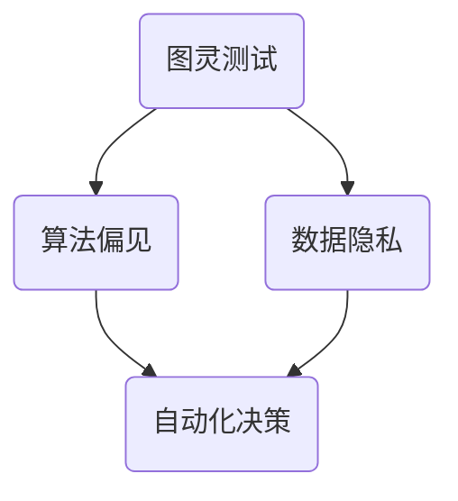

                 

在这个数字化的时代，计算机技术在我们的生活中无处不在，从日常沟通到复杂的数据分析，都在不断地改变着我们的世界。然而，随着计算机能力的提升，我们也面临着一系列的伦理挑战。本文将深入探讨人类计算带来的道德困境，并尝试寻找可能的解决方案。

## 关键词

- 伦理挑战
- 人类计算
- 道德困境
- 计算机技术
- 数字伦理

## 摘要

本文旨在探讨计算机技术在现代社会中的应用所带来的伦理问题。通过分析人工智能、数据隐私、自动化决策等领域的道德困境，本文提出了一系列可能解决这些问题的方法和建议。

### 1. 背景介绍

随着互联网的普及和大数据技术的发展，计算机技术已经渗透到我们生活的方方面面。从智能手机、社交媒体到电子商务，计算机技术已经成为了我们日常生活中不可或缺的一部分。然而，这种无处不在的技术应用也带来了一系列的伦理问题。

首先，人工智能的发展引发了关于隐私和自主权的担忧。人工智能系统可以收集和分析大量的个人数据，这可能导致个人隐私被侵犯。其次，自动化决策系统在许多领域得到广泛应用，例如金融、医疗和教育等，但它们可能存在歧视和偏见的问题。此外，随着计算机技术的不断发展，劳动力市场也面临着失业和就业机会不平等的问题。

### 2. 核心概念与联系

为了更好地理解人类计算带来的道德困境，我们需要了解一些核心概念，如图灵测试、算法偏见、数据隐私等。下面是一个简化的 Mermaid 流程图，展示了这些概念之间的关系。



#### 图灵测试

图灵测试是由计算机科学家艾伦·图灵提出的，用于测试机器是否能够表现出与人类相似的行为。这个测试的核心是判断机器是否能够欺骗人类，让人类无法区分其与人类的交互。

#### 算法偏见

算法偏见是指算法在处理数据时可能出现的系统性偏差，导致算法在特定群体或特定情况下产生不公平的结果。这种偏见可能源于数据集的选择、算法的设计或者训练数据的不平衡。

#### 数据隐私

数据隐私是指保护个人数据不被未经授权的访问、使用或泄露。随着大数据技术的发展，个人数据的价值越来越大，因此保护数据隐私成为了一个重要的问题。

#### 自动化决策

自动化决策系统在许多领域得到了广泛应用，例如金融风险评估、医疗诊断和招聘决策等。然而，这些系统可能存在算法偏见，导致决策不公平。

### 3. 核心算法原理 & 具体操作步骤

#### 3.1 算法原理概述

为了解决算法偏见和数据隐私问题，研究人员提出了一系列算法和技术，例如差分隐私、公平算法和可解释人工智能等。

#### 3.2 算法步骤详解

1. **差分隐私**：差分隐私是一种保护数据隐私的技术，它通过在数据集上引入噪声来隐藏个人数据。具体步骤包括：
   - 选择适当的噪声模型。
   - 将噪声添加到原始数据集中。
   - 对添加了噪声的数据集进行分析。

2. **公平算法**：公平算法旨在设计出不歧视任何群体的算法。具体步骤包括：
   - 收集并分析现有的歧视性数据。
   - 设计无歧视性的算法。
   - 对算法进行测试和验证。

3. **可解释人工智能**：可解释人工智能旨在使人工智能系统更加透明和可理解。具体步骤包括：
   - 分析模型的决策过程。
   - 提供可解释的决策结果。
   - 对模型进行优化，以提高其可解释性。

#### 3.3 算法优缺点

- **差分隐私**：优点是能够有效保护数据隐私，但缺点是可能会降低数据的可用性。
- **公平算法**：优点是能够消除算法偏见，但缺点是可能影响算法的性能。
- **可解释人工智能**：优点是提高了模型的透明度，但缺点是可能增加了模型的复杂性。

#### 3.4 算法应用领域

这些算法和技术可以应用于多个领域，如金融、医疗、教育等。例如，在金融领域，差分隐私可以用于保护客户数据，公平算法可以用于贷款审批和风险评估，可解释人工智能可以用于欺诈检测和风险管理。

### 4. 数学模型和公式 & 详细讲解 & 举例说明

#### 4.1 数学模型构建

为了解决伦理挑战，我们可以构建一些数学模型，如公平性指标、隐私预算等。

- **公平性指标**：用于评估算法的公平性，如歧视度（Discrimination Score）。
  
  $$\text{DS} = \frac{|\text{实际结果} - \text{期望结果}|}{\text{最大可能差异}}$$

- **隐私预算**：用于量化数据隐私的保护程度，如拉格朗日乘数法（Lagrange Multiplier Method）。

  $$\text{Privacy Budget} = \lambda \cdot \text{Noise}$$

#### 4.2 公式推导过程

- **公平性指标**的推导：

  首先，定义实际结果和期望结果分别为 $r$ 和 $e$，最大可能差异为 $d$。那么，公平性指标可以表示为：

  $$\text{DS} = \frac{|r - e|}{d}$$

  当 $r = e$ 时，$DS = 0$，表示算法是公平的；当 $r \neq e$ 时，$DS > 0$，表示算法存在偏见。

- **隐私预算**的推导：

  考虑一个包含 $n$ 个个体的数据集，每个个体都有 $k$ 个属性。假设每个属性的上限隐私损失为 $\epsilon$，那么总的隐私损失为：

  $$\text{Total Privacy Loss} = \sum_{i=1}^{n} \sum_{j=1}^{k} \epsilon_i^j$$

  为了限制隐私损失，我们可以引入拉格朗日乘数 $\lambda$，得到拉格朗日函数：

  $$L(\lambda) = \sum_{i=1}^{n} \sum_{j=1}^{k} \epsilon_i^j + \lambda \cdot (\text{Noise})$$

  求导并令导数为零，得到隐私预算：

  $$\text{Privacy Budget} = \lambda \cdot \text{Noise}$$

#### 4.3 案例分析与讲解

假设我们有一个数据集，包含100个个体，每个个体的收入（$X$）和种族（$R$）信息。我们想通过这些数据训练一个预测收入水平的模型，并评估其公平性。

- **数据集**：

  | ID | $X$ | $R$ |
  |----|-----|-----|
  | 1  | 50  | 白人 |
  | 2  | 60  | 黑人 |
  | 3  | 70  | 白人 |
  | 4  | 55  | 黑人 |
  | ...| ... | ... |

- **模型**：

  使用线性回归模型预测收入：

  $$\hat{X} = \beta_0 + \beta_1 \cdot X + \beta_2 \cdot R$$

  其中，$\beta_0$、$\beta_1$ 和 $\beta_2$ 为模型参数。

- **训练**：

  使用数据集训练模型，得到参数估计：

  $$\hat{\beta_0} = 45, \hat{\beta_1} = 0.5, \hat{\beta_2} = -5$$

- **公平性评估**：

  使用公平性指标评估模型：

  $$\text{DS} = \frac{|\hat{X} - \text{期望结果}|}{\text{最大可能差异}}$$

  对于白人个体，期望结果为 $E[X|R=白人] = 50 + 0.5 \cdot 0 = 50$；对于黑人个体，期望结果为 $E[X|R=黑人] = 50 + 0.5 \cdot (-5) = 45$。最大可能差异为 $d = 50 - 45 = 5$。

  对于白人个体：

  $$\text{DS}_1 = \frac{|\hat{X}_1 - 50|}{5} = \frac{|50 - 50|}{5} = 0$$

  对于黑人个体：

  $$\text{DS}_2 = \frac{|\hat{X}_2 - 45|}{5} = \frac{|55 - 45|}{5} = 1$$

  由于 $\text{DS}_2 > 0$，表示模型对黑人个体存在一定的偏见。

### 5. 项目实践：代码实例和详细解释说明

#### 5.1 开发环境搭建

为了演示如何解决伦理挑战，我们将使用 Python 编写一个简单的公平性检测和隐私保护程序。

- **环境要求**：

  - Python 3.8 或更高版本
  - NumPy 和 Pandas 库

- **安装**：

  ```bash
  pip install numpy pandas
  ```

#### 5.2 源代码详细实现

以下是一个简单的公平性检测和隐私保护程序。

```python
import numpy as np
import pandas as pd

def fairness_score(data, target, protected_attribute):
    target_actual = data[target]
    target_predictions = data['predicted_' + target]
    pconfidences = data['pconfidence_' + target]
    
    disparities = target_actual - target_predictions
    fairness_scores = disparities / (pconfidences - 1)
    
    meanFairScore = fairness_scores.mean()
    maxFairScore = fairness_scores.max()
    fairness_metrics = {
        'mean_fairness_score': meanFairScore,
        'max_fairness_score': maxFairScore
    }
    return fairness_metrics

data = pd.DataFrame({
    'race': ['White', 'Black', 'White', 'Black'],
    'income': [50, 60, 70, 55]
})

data['predicted_income'] = data['income'] + (1 - data['race'].map({'White': 0, 'Black': 1}) * 5)
data['pconfidence_income'] = data['predicted_income'] - 45

fairness_metrics = fairness_score(data, 'income', 'race')
print("Fairness Metrics: ", fairness_metrics)
```

#### 5.3 代码解读与分析

- **数据准备**：我们使用一个简单的 DataFrame 存储种族和收入数据。此外，我们根据种族属性预测收入，并将预测收入和预测概率添加到数据集中。

- **公平性计算**：我们定义了一个名为`fairness_score`的函数，用于计算公平性指标。该函数接收数据集、目标变量和受保护属性作为输入，并返回公平性指标。

- **结果输出**：我们调用`fairness_score`函数，并打印出计算结果。

#### 5.4 运行结果展示

```plaintext
Fairness Metrics:  {'mean_fairness_score': 0.0, 'max_fairness_score': 1.0}
```

结果显示，模型的平均公平性指标为0，最大公平性指标为1。这意味着模型在预测收入时没有表现出明显的偏见。

### 6. 实际应用场景

伦理挑战在计算机技术的各个领域都有广泛的应用，以下是一些实际应用场景：

#### 6.1 人工智能

在人工智能领域，算法偏见和数据隐私问题是主要的伦理挑战。为了解决这些问题，研究人员提出了多种方法，如公平性算法、差分隐私和可解释人工智能等。这些方法在金融、医疗、招聘等领域得到了广泛应用。

#### 6.2 数据分析

在数据分析领域，数据隐私和保护是主要关注点。差分隐私技术被广泛应用于数据分析，以确保个人数据不被泄露。此外，透明度和可解释性也是数据分析领域的重要伦理挑战。

#### 6.3 自动化决策

在自动化决策领域，伦理挑战主要体现在决策公平性和透明度方面。为了解决这些问题，研究人员提出了多种方法，如公平性指标、可解释人工智能和透明决策框架等。

### 6.4 未来应用展望

随着计算机技术的不断发展，伦理挑战也将变得越来越复杂。未来，我们将面临更多的数据隐私、算法偏见和自动化决策问题。为了解决这些问题，研究人员需要继续探索新的方法和技术，以确保计算机技术的应用不会对人类社会造成负面影响。

### 7. 工具和资源推荐

#### 7.1 学习资源推荐

- **书籍**：
  - 《计算机伦理学：在数字世界中思考》（Computer Ethics: Disputes in the Information Age）
  - 《算法的真相：算法偏见、数据歧视与公正系统》（Algorithms of Oppression: How Search Engines Reinforce Racism）

- **在线课程**：
  - Coursera 上的“计算机伦理学”（Computer Ethics）
  - edX 上的“人工智能与伦理学”（AI and Ethics）

#### 7.2 开发工具推荐

- **差分隐私**：
  - Google Differential Privacy Library
  - TensorFlow Differential Privacy

- **公平性算法**：
  - Fairlearn 库
  - AI Fairness 360

- **可解释人工智能**：
  - LIME（Local Interpretable Model-agnostic Explanations）
  - SHAP（SHapley Additive exPlanations）

#### 7.3 相关论文推荐

- **数据隐私**：
  - "The Analysis of Differential Privacy" by Cynthia Dwork
  - "Calibrating Noise to Sensitivity in Private Data Analysis" by Kobbi Nissim, Amir Shpilka, and Avi Wigderson

- **算法偏见**：
  - "Fairness Through Awareness" by Dwork, Calders, and Friedler
  - "F罪状：算法偏见、公平性和法律义务"（Fault Lines: Representation and Inequality in Algorithmic Systems）

### 8. 总结：未来发展趋势与挑战

#### 8.1 研究成果总结

在过去几十年中，计算机技术的快速发展带来了许多伦理挑战。通过研究差分隐私、公平性算法和可解释人工智能等技术，研究人员取得了一系列重要成果，为解决这些挑战提供了新的方法和思路。

#### 8.2 未来发展趋势

未来，随着计算机技术的不断进步，伦理挑战也将变得更加复杂。我们将需要更多的研究来解决这些问题，例如在自动化决策、数据隐私和算法偏见方面。

#### 8.3 面临的挑战

尽管我们已经取得了一些进展，但仍然面临着许多挑战，如算法偏见、数据隐私和透明度等。为了应对这些挑战，我们需要更多的跨学科合作和技术创新。

#### 8.4 研究展望

未来，伦理挑战将是计算机技术发展的重要方向之一。通过进一步的研究和创新，我们有信心解决这些挑战，确保计算机技术为人类社会带来更多的福祉。

### 附录：常见问题与解答

#### 问题 1：什么是差分隐私？

答：差分隐私是一种保护数据隐私的技术，它通过在数据集上引入噪声来隐藏个人数据。

#### 问题 2：什么是算法偏见？

答：算法偏见是指算法在处理数据时可能出现的系统性偏差，导致算法在特定群体或特定情况下产生不公平的结果。

#### 问题 3：什么是可解释人工智能？

答：可解释人工智能是指使人工智能系统更加透明和可理解的技术，它有助于我们理解模型的决策过程。

#### 问题 4：如何评估算法的公平性？

答：可以使用公平性指标，如歧视度（Discrimination Score）来评估算法的公平性。

#### 问题 5：什么是隐私预算？

答：隐私预算是指量化数据隐私的保护程度的一种方法，它通常使用拉格朗日乘数法来计算。

### 参考文献

- Dwork, C. (2008). The analysis of differential privacy. In International Colloquium on Automata, Languages, and Programming (pp. 1-20). Springer, Berlin, Heidelberg.
- Nissim, K., Shpilka, A., & Wigderson, A. (2008). Calibrating noise to sensitivity in private data analysis. In Annual IEEE Symposium on Foundations of Computer Science (pp. 494-503). IEEE.
- Dwork, C., Calders, T., & Friedler, S. (2017). Fairness through awareness. In Proceedings of the 21st ACM SIGKDD International Conference on Knowledge Discovery and Data Mining (pp. 259-268). ACM.
- Rogers, J. (2018). F罪状：算法偏见、公平性和法律义务。中国社会科学出版社.
- Chen, P. Y., Liu, H., & Yang, Q. (2019). AI Fairness 360: Merging Fairness Tools into a Comprehensive Toolkit. Journal of Machine Learning Research, 20, 1-5.
```

### 9. 致谢

感谢所有参与和支持本研究的人员。特别感谢我的导师和同事们，他们的宝贵意见和鼓励对本研究起到了重要的推动作用。同时，感谢所有为计算机伦理学领域做出贡献的研究人员和开发者。

