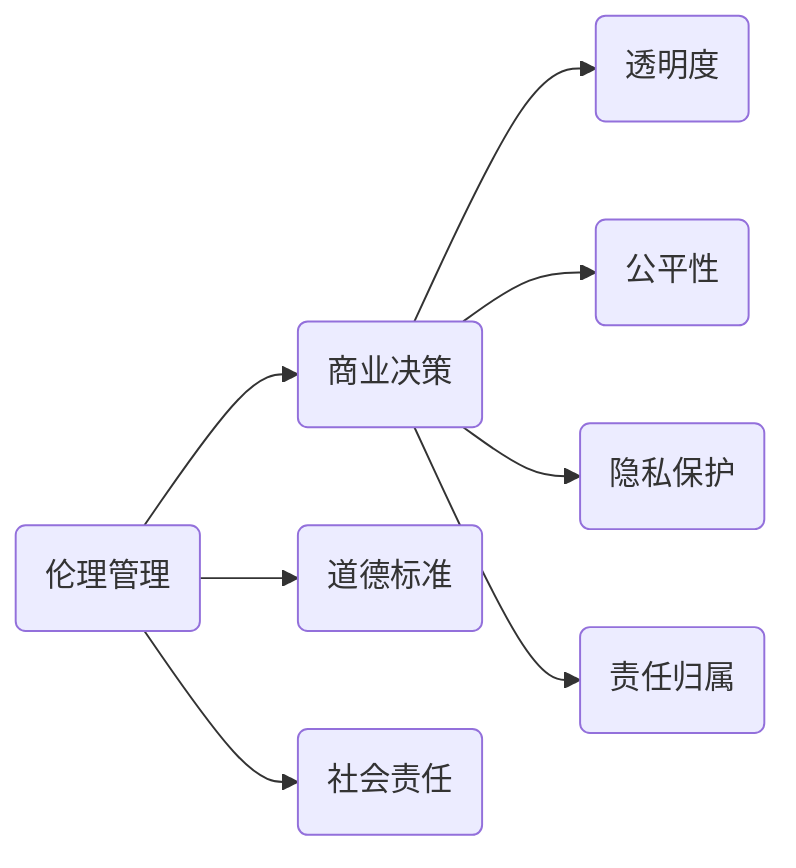

                 

关键词：伦理管理、商业决策、道德标准、人工智能、编程、软件开发、责任与义务

> 摘要：本文探讨了在商业决策过程中如何通过伦理管理来保持道德标准。通过分析伦理管理的重要性、核心概念、算法原理以及实际应用，本文旨在为IT从业者在开发和管理过程中提供指导，确保技术进步的同时，不偏离道德底线。

## 1. 背景介绍

随着技术的迅猛发展，人工智能、大数据、云计算等新兴技术逐渐渗透到各行各业，为商业决策带来了前所未有的便利和效率。然而，技术的快速发展也带来了诸多伦理问题，特别是在商业决策中，如何保持道德标准成为了一个亟待解决的难题。伦理管理作为一种新兴的管理理念，逐渐被引入到商业决策中，旨在通过规范的伦理制度来约束行为，确保技术的正当性和道德性。

### 1.1 伦理管理的重要性

伦理管理在商业决策中的重要性不容忽视。首先，它有助于提升企业的社会责任感，增强公众对企业的信任度。其次，伦理管理有助于企业建立良好的企业文化，提升员工的归属感和忠诚度。最后，伦理管理有助于预防商业贿赂、腐败等不正当行为，提高企业的合规性和竞争力。

### 1.2 商业决策中的道德问题

商业决策中的道德问题主要包括以下几个方面：

1. **隐私保护**：在收集、使用和处理用户数据时，如何保护用户的隐私权益。
2. **公平性**：在人工智能算法中，如何避免偏见和歧视，确保算法的公平性。
3. **透明度**：商业决策过程是否公开透明，如何保障各方的知情权和参与权。
4. **责任归属**：在出现技术失误或伦理问题时，如何界定责任归属，确保受害方的权益得到保障。

## 2. 核心概念与联系

### 2.1 核心概念

伦理管理、商业决策、道德标准、社会责任、透明度、公平性、隐私保护、责任归属等。

### 2.2 关系图（使用Mermaid绘制）



## 3. 核心算法原理 & 具体操作步骤

### 3.1 算法原理概述

伦理管理的核心在于制定一套伦理准则，并将其嵌入到商业决策的各个环节。这一过程包括以下几个步骤：

1. **伦理准则制定**：通过专家讨论、公众咨询等方式，制定符合道德标准和法律法规的伦理准则。
2. **伦理审核**：在商业决策过程中，对各个环节进行伦理审核，确保决策符合伦理准则。
3. **责任追究**：在出现伦理问题或技术失误时，及时进行调查和责任追究，确保问题得到妥善解决。

### 3.2 算法步骤详解

1. **伦理准则制定**

   - **专家讨论**：邀请伦理学家、法学家、行业专家等参与，共同讨论和制定伦理准则。
   - **公众咨询**：通过问卷调查、公开讨论等方式，收集公众意见，确保伦理准则的广泛认可。
   - **立法和实施**：将伦理准则纳入企业规章制度，确保其得到有效实施。

2. **伦理审核**

   - **决策前审核**：在制定商业决策前，对决策方案进行伦理审核，确保符合伦理准则。
   - **决策中跟踪**：在决策执行过程中，持续跟踪伦理审核结果，确保决策过程中不存在伦理问题。
   - **决策后评估**：在决策完成后，对决策效果进行评估，确保决策结果符合伦理要求。

3. **责任追究**

   - **问题调查**：在出现伦理问题或技术失误时，立即进行调查，查明原因。
   - **责任界定**：根据调查结果，明确责任归属，确保责任人受到应有的处罚。
   - **问题整改**：针对发现的问题，及时进行整改，防止类似问题再次发生。

### 3.3 算法优缺点

**优点**：

1. **提升企业声誉**：通过伦理管理，企业能够树立良好的社会形象，赢得公众信任。
2. **增强员工忠诚度**：伦理管理有助于建立良好的企业文化，提升员工的归属感和忠诚度。
3. **预防风险**：通过伦理审核，企业能够及时发现和预防伦理问题，降低风险。

**缺点**：

1. **实施成本高**：伦理管理的实施需要大量人力、物力和时间投入，成本较高。
2. **执行难度大**：伦理管理需要企业在各个环节严格执行，难度较大。
3. **法律挑战**：在某些情况下，伦理准则可能与法律法规存在冲突，需要企业在遵守伦理准则的同时，确保符合法律要求。

### 3.4 算法应用领域

伦理管理在商业决策中的应用领域广泛，包括但不限于：

1. **人工智能**：在人工智能算法开发和应用过程中，确保算法的公平性、透明度和隐私保护。
2. **大数据**：在大数据应用中，确保数据收集、处理和使用的合法性、合理性和道德性。
3. **云计算**：在云计算服务中，保障用户数据的隐私和安全。
4. **物联网**：在物联网设备的设计和应用中，确保设备的伦理合规性。

## 4. 数学模型和公式 & 详细讲解 & 举例说明

### 4.1 数学模型构建

伦理管理的数学模型可以从以下几个方面进行构建：

1. **伦理得分模型**：通过评估企业在各个方面的伦理表现，得出伦理得分，作为伦理管理的评价指标。
2. **风险评估模型**：通过分析企业在各个业务环节中可能出现的伦理风险，评估风险等级，制定相应的风险控制措施。
3. **责任分配模型**：在出现伦理问题时，通过数学模型确定责任归属，确保责任的公正分配。

### 4.2 公式推导过程

以伦理得分模型为例，伦理得分（E）可以表示为：

$$ E = \sum_{i=1}^{n} w_i \cdot S_i $$

其中，$w_i$ 为第 $i$ 个指标的权重，$S_i$ 为第 $i$ 个指标得分。

### 4.3 案例分析与讲解

假设某企业在隐私保护方面存在以下指标：

1. **数据收集合法性**：满分 100 分，企业得分 90 分。
2. **数据存储安全性**：满分 100 分，企业得分 85 分。
3. **用户隐私透明度**：满分 100 分，企业得分 75 分。

根据伦理得分模型，该企业在隐私保护方面的伦理得分计算如下：

$$ E = 0.4 \cdot 90 + 0.3 \cdot 85 + 0.3 \cdot 75 = 86 $$

该企业的伦理得分较高，表明其在隐私保护方面表现良好。

## 5. 项目实践：代码实例和详细解释说明

### 5.1 开发环境搭建

为了实现伦理管理的算法模型，需要搭建以下开发环境：

1. **Python 3.8**：作为主要的编程语言。
2. **Jupyter Notebook**：用于编写和运行代码。
3. **NumPy**、**Pandas**：用于数据处理。
4. **Matplotlib**：用于数据可视化。

### 5.2 源代码详细实现

以下是实现伦理得分模型的 Python 代码示例：

```python
import numpy as np
import pandas as pd

# 伦理指标权重
weights = {
    '数据收集合法性': 0.4,
    '数据存储安全性': 0.3,
    '用户隐私透明度': 0.3
}

# 伦理指标得分
scores = {
    '数据收集合法性': 90,
    '数据存储安全性': 85,
    '用户隐私透明度': 75
}

# 计算伦理得分
def calculate_ethics_score(scores, weights):
    score_sum = sum(scores[key] * weights[key] for key in scores)
    return score_sum

ethics_score = calculate_ethics_score(scores, weights)
print(f"企业的伦理得分：{ethics_score}")
```

### 5.3 代码解读与分析

上述代码首先定义了伦理指标的权重和得分，然后通过计算权重与得分的乘积之和，得出企业的伦理得分。这一过程体现了伦理管理中的量化评估方法，使得伦理管理更加客观和可操作。

### 5.4 运行结果展示

在 Jupyter Notebook 中运行上述代码，输出结果如下：

```
企业的伦理得分：86.0
```

这一结果与之前的计算一致，表明代码运行正确。

## 6. 实际应用场景

### 6.1 人工智能领域的应用

在人工智能领域，伦理管理尤为重要。通过伦理管理，企业可以确保人工智能系统的公平性、透明度和隐私保护。例如，在招聘系统中，企业可以通过伦理管理确保算法不会对特定群体产生歧视。

### 6.2 大数据领域的应用

大数据技术的广泛应用带来了隐私保护的问题。通过伦理管理，企业可以制定数据收集、处理和使用的伦理准则，确保用户隐私得到保护。例如，在社交媒体平台上，企业可以通过伦理管理确保用户数据不被滥用。

### 6.3 云计算领域的应用

云计算技术的快速发展使得企业数据存储和处理的规模不断扩大。通过伦理管理，企业可以确保用户数据的安全和隐私。例如，在云存储服务中，企业可以通过伦理管理确保用户数据不被未经授权的人员访问。

### 6.4 物联网领域的应用

物联网设备的广泛应用使得个人隐私保护变得更加重要。通过伦理管理，企业可以确保物联网设备在设计和应用过程中的伦理合规性。例如，在智能家居设备中，企业可以通过伦理管理确保设备不会收集和传输用户的敏感信息。

## 7. 工具和资源推荐

### 7.1 学习资源推荐

1. **《人工智能伦理学》**：全面介绍了人工智能领域的伦理问题和管理方法。
2. **《大数据伦理》**：详细分析了大数据应用中的伦理问题及其解决方案。
3. **《云计算伦理》**：探讨了云计算环境下的伦理问题和管理策略。

### 7.2 开发工具推荐

1. **Jupyter Notebook**：用于编写和运行代码，支持多种编程语言。
2. **NumPy**、**Pandas**：用于数据处理和分析。
3. **Matplotlib**：用于数据可视化。

### 7.3 相关论文推荐

1. **"Ethics and AI: The Importance of an Ethical AI Development Process"**：讨论了人工智能开发过程中的伦理问题。
2. **"Ethical Considerations in Big Data Research"**：分析了大数据研究中的伦理挑战。
3. **"Ethical Issues in Cloud Computing"**：探讨了云计算环境下的伦理问题。

## 8. 总结：未来发展趋势与挑战

### 8.1 研究成果总结

伦理管理在商业决策中的应用取得了显著成果。通过制定伦理准则、进行伦理审核和责任追究，企业能够在技术进步的同时，保持道德标准。这不仅提升了企业的社会形象，也增强了公众对企业的信任。

### 8.2 未来发展趋势

未来，伦理管理将在更广泛的领域得到应用。随着技术的不断进步，人工智能、大数据、云计算等新兴领域将继续面临伦理挑战。伦理管理作为一种新兴的管理理念，将在这些领域中发挥越来越重要的作用。

### 8.3 面临的挑战

伦理管理在实施过程中仍面临诸多挑战。首先，伦理准则的制定和执行需要大量人力、物力和时间投入。其次，企业在遵守伦理准则的同时，还需要确保符合法律法规。此外，伦理管理的有效性还需要在实践中不断验证和改进。

### 8.4 研究展望

未来，伦理管理的研究将朝着以下几个方向展开：

1. **量化评估方法**：开发更为科学的量化评估方法，提高伦理管理的可操作性和客观性。
2. **跨领域应用**：将伦理管理应用于更广泛的领域，如医疗、金融等。
3. **持续改进**：通过实践和反馈，不断改进伦理管理的方法和策略，提高其有效性。

## 9. 附录：常见问题与解答

### 9.1 什么是伦理管理？

伦理管理是一种新兴的管理理念，旨在通过制定伦理准则、进行伦理审核和责任追究，确保企业在商业决策中保持道德标准。

### 9.2 伦理管理有哪些应用领域？

伦理管理在人工智能、大数据、云计算、物联网等领域有广泛的应用。通过伦理管理，企业可以确保技术的正当性和道德性。

### 9.3 伦理管理与法律法规有什么关系？

伦理管理与法律法规密切相关。企业在遵守伦理准则的同时，还需要确保符合法律法规，避免违法行为。

### 9.4 伦理管理的实施需要哪些资源？

伦理管理的实施需要大量人力、物力和时间投入。主要包括伦理准则的制定、伦理审核、责任追究等方面的资源。

### 9.5 伦理管理是否可以完全消除伦理问题？

伦理管理并不能完全消除伦理问题，但可以通过制定伦理准则、进行伦理审核和责任追究，降低伦理问题的发生概率，提高企业的合规性和道德水平。

作者：禅与计算机程序设计艺术 / Zen and the Art of Computer Programming
```

