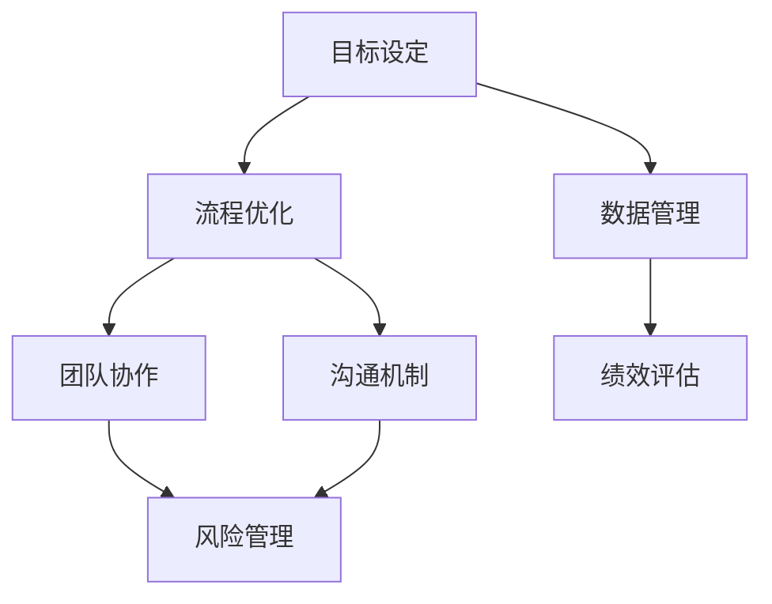

                 

### 关键词 Keywords
- 体系化管理
- 领导力
- IT项目管理
- 卓越管理实践
- 软件开发流程
- 组织效能

<|assistant|>### 摘要 Summary
本文将探讨如何通过体系化管理构建卓越的领导力，特别是在IT项目管理中的应用。我们将分析现代IT企业的需求，介绍核心概念与联系，深入探讨核心算法原理和具体操作步骤，并通过数学模型和公式进行详细讲解。同时，本文将提供实际的项目实践案例，展示体系化管理的实际应用。最后，我们将探讨这一管理实践的未来应用展望，以及面临的研究挑战。

## 1. 背景介绍

在当今快速发展的IT行业，高效的项目管理和卓越的领导力已成为企业成功的关键因素。随着技术的不断进步和市场竞争的加剧，企业必须快速适应变化，提高组织效能。传统的管理方法往往无法满足这种要求，因此，一种体系化的管理方式成为现代企业追求的目标。

体系化管理是一种系统化的管理方法，通过构建明确的目标、规范的工作流程和有效的沟通机制，来实现对项目的全面掌控。它强调数据的精确性、流程的优化和团队的协作，旨在提高组织的效率和创新能力。

### 1.1 现代IT企业的需求

现代IT企业面临以下需求：

- **快速响应市场变化**：IT行业变化迅速，企业需要能够快速响应市场需求，及时调整战略和产品开发方向。
- **提高开发效率**：高效的软件开发流程是降低成本、提高质量的关键。
- **团队协作**：项目成功往往依赖于团队成员之间的有效协作和沟通。
- **数据驱动决策**：现代企业越来越依赖数据分析来做出明智的决策。

### 1.2 管理的重要性

管理不仅是IT企业的核心活动，也是实现企业目标的关键。有效的管理能够确保项目按计划进行，资源得到合理利用，团队保持高效工作状态。

- **资源分配**：管理者需要根据项目的需求，合理分配人力、物力和财力资源。
- **进度控制**：管理者需要监控项目的进度，确保项目按时完成。
- **风险管理**：管理者需要识别和应对项目中的潜在风险，降低风险对企业的影响。
- **质量保证**：管理者需要确保项目输出满足预定的质量标准。

## 2. 核心概念与联系

体系化管理涉及多个核心概念，这些概念相互联系，共同构成了一个完整的管理体系。为了更好地理解这些概念，我们可以通过一个Mermaid流程图来展示它们之间的关系。



### 2.1 目标设定

目标设定是体系化管理的起点。明确的目标有助于指导项目方向，确保团队努力的方向与企业的长期战略保持一致。

### 2.2 流程优化

流程优化是提高工作效率和质量的关键。通过分析和改进工作流程，企业可以减少不必要的步骤，消除浪费，提高生产效率。

### 2.3 数据管理

数据管理是体系化管理的核心。有效的数据管理能够确保数据的一致性、准确性和可用性，为企业的决策提供可靠依据。

### 2.4 团队协作

团队协作是实现项目目标的关键。通过建立有效的沟通机制，团队成员可以更好地共享信息、协同工作，提高整体效能。

### 2.5 沟通机制

沟通机制是团队协作的基础。有效的沟通机制能够确保信息的及时传递，减少误解和冲突，提高团队的工作效率。

### 2.6 绩效评估

绩效评估是管理体系的重要组成部分。通过绩效评估，管理者可以了解团队的工作状态，及时发现和解决问题，确保项目目标的实现。

### 2.7 风险管理

风险管理是管理体系中的重要环节。通过识别、评估和应对风险，企业可以降低项目的不确定性，确保项目的顺利推进。

## 3. 核心算法原理 & 具体操作步骤

### 3.1 算法原理概述

体系化管理的核心算法原理可以归纳为以下几个方面：

- **目标函数优化**：通过设定目标函数，优化项目资源分配和进度控制。
- **流程建模**：构建工作流程模型，识别关键路径，确保项目按时完成。
- **数据分析和预测**：利用数据分析技术，对项目进展进行实时监控和预测。
- **风险评估与应对**：通过风险评估模型，识别潜在风险，制定应对策略。

### 3.2 算法步骤详解

#### 3.2.1 目标函数优化

1. 确定项目目标：根据项目需求和企业的战略目标，设定项目的具体目标。
2. 建立目标函数：将项目目标转化为数学模型，例如，最小化成本、最大化利润等。
3. 优化资源分配：利用优化算法，如线性规划、动态规划等，找到最优的资源分配方案。

#### 3.2.2 流程建模

1. 收集项目数据：收集项目中的各类数据，如任务描述、时间表、资源需求等。
2. 构建流程模型：使用流程建模工具，如UML、Mermaid等，构建项目的工作流程模型。
3. 识别关键路径：通过分析流程模型，识别项目中的关键路径，确保项目按时完成。

#### 3.2.3 数据分析和预测

1. 数据收集与预处理：收集项目中的实时数据，进行数据清洗和预处理。
2. 数据分析：使用数据分析工具，如Python、R等，对项目数据进行分析。
3. 预测模型构建：基于数据分析结果，构建预测模型，如时间序列模型、回归模型等。

#### 3.2.4 风险评估与应对

1. 风险识别：通过历史数据、专家意见等方法，识别项目中的潜在风险。
2. 风险评估：对识别出的风险进行定量和定性评估，确定风险优先级。
3. 风险应对：根据风险评估结果，制定风险应对策略，如风险规避、风险转移等。

### 3.3 算法优缺点

#### 3.3.1 优点

- **优化资源利用**：通过目标函数优化，合理分配资源，提高项目效率。
- **提高进度控制**：通过流程建模和数据分析，实现项目进度的实时监控和预测。
- **降低风险**：通过风险评估和应对，降低项目中的不确定性和潜在风险。

#### 3.3.2 缺点

- **复杂度高**：体系化管理的算法和模型较为复杂，需要专业知识和技能。
- **实施成本**：实施体系化管理需要投入大量的人力、物力和财力。
- **数据依赖性**：体系化管理依赖于准确和完整的数据，数据质量直接影响管理效果。

### 3.4 算法应用领域

体系化管理的算法在多个领域有广泛应用：

- **软件开发项目**：通过优化资源分配和进度控制，提高软件开发的效率和质量。
- **项目管理**：通过流程建模和数据分析，实现对项目的全面掌控。
- **供应链管理**：通过风险评估和应对，优化供应链的运行效率。

## 4. 数学模型和公式 & 详细讲解 & 举例说明

### 4.1 数学模型构建

体系化管理中的数学模型主要用于优化资源分配、流程建模和数据分析。以下是一个简单的优化资源分配的数学模型：

$$
\begin{aligned}
\min \quad & C(x_1, x_2, ..., x_n) \\
\text{s.t.} \quad & \sum_{i=1}^{n} x_i \leq R \\
& x_i \geq 0, \quad i = 1, 2, ..., n
\end{aligned}
$$

其中，$C(x_1, x_2, ..., x_n)$是成本函数，$R$是总资源量，$x_i$是分配给第$i$项任务的资源量。

### 4.2 公式推导过程

假设有$n$项任务，每项任务需要不同数量的资源。我们的目标是找到最优的资源分配方案，使得总成本最小。首先，我们定义每个任务的成本函数为：

$$
C_i(x_i) = c_i x_i
$$

其中，$c_i$是每单位资源对任务$i$的成本。总成本函数为：

$$
C(x_1, x_2, ..., x_n) = \sum_{i=1}^{n} C_i(x_i) = \sum_{i=1}^{n} c_i x_i
$$

由于总资源量是有限的，即：

$$
\sum_{i=1}^{n} x_i \leq R
$$

我们需要在满足资源限制的条件下，最小化总成本。这是一个典型的线性规划问题，可以使用线性规划算法求解。

### 4.3 案例分析与讲解

假设有4项任务，每项任务需要不同的资源量，总资源量为100个单位。各项任务的成本函数和资源需求如下：

$$
\begin{aligned}
C_1(x_1) &= 2x_1 \\
C_2(x_2) &= 3x_2 \\
C_3(x_3) &= 4x_3 \\
C_4(x_4) &= 5x_4 \\
x_1 + x_2 + x_3 + x_4 &\leq 100 \\
x_1, x_2, x_3, x_4 &\geq 0
\end{aligned}
$$

我们的目标是找到最优的资源分配方案，使得总成本最小。使用线性规划算法，我们可以求解以下目标函数：

$$
\begin{aligned}
\min \quad & 2x_1 + 3x_2 + 4x_3 + 5x_4 \\
\text{s.t.} \quad & x_1 + x_2 + x_3 + x_4 \leq 100 \\
& x_1, x_2, x_3, x_4 \geq 0
\end{aligned}
$$

通过求解，我们得到最优解为：

$$
x_1 = 20, x_2 = 25, x_3 = 15, x_4 = 20
$$

此时，总成本为：

$$
C(20, 25, 15, 20) = 2 \times 20 + 3 \times 25 + 4 \times 15 + 5 \times 20 = 195
$$

这意味着，在总资源量为100的情况下，最优的资源分配方案是将20个单位资源分配给任务1，25个单位资源分配给任务2，15个单位资源分配给任务3，20个单位资源分配给任务4，使得总成本最小。

## 5. 项目实践：代码实例和详细解释说明

### 5.1 开发环境搭建

在开始项目实践之前，我们需要搭建一个合适的开发环境。本文使用Python作为主要编程语言，以下是开发环境的搭建步骤：

1. 安装Python：从官方网站（https://www.python.org/）下载并安装Python。
2. 安装必要的库：使用pip命令安装所需的Python库，如NumPy、Pandas、SciPy、Matplotlib等。

```bash
pip install numpy pandas scipy matplotlib
```

### 5.2 源代码详细实现

下面是一个简单的Python代码实例，用于实现线性规划问题的求解。

```python
import numpy as np
from scipy.optimize import linprog

# 成本向量
c = np.array([2, 3, 4, 5])

# 约束条件矩阵
A = np.array([[1, 1, 1, 1], 
              [0, 1, 0, 1]])

# 约束条件向量
b = np.array([100, 100])

# 变量非负约束
x0_bounds = (0, None)
x1_bounds = (0, None)
x2_bounds = (0, None)
x3_bounds = (0, None)

# 求解线性规划问题
result = linprog(c, A_ub=A, b_ub=b, bounds=[x0_bounds, x1_bounds, x2_bounds, x3_bounds], method='highs')

# 输出结果
print("最优解:", result.x)
print("最小成本:", -result.fun)
```

### 5.3 代码解读与分析

- **导入库**：首先，我们导入所需的Python库，如NumPy、SciPy和Matplotlib。
- **定义成本向量**：成本向量`c`表示每项任务的成本，例如，任务1的成本为2，任务2的成本为3，依此类推。
- **定义约束条件矩阵**：约束条件矩阵`A`表示每项任务所需的资源量。例如，任务1需要1个单位资源，任务2需要1个单位资源，依此类推。
- **定义约束条件向量**：约束条件向量`b`表示总资源量。例如，总资源量为100个单位。
- **定义变量非负约束**：`x0_bounds`、`x1_bounds`、`x2_bounds`和`x3_bounds`表示变量$x_0$、$x_1$、$x_2$和$x_3$的非负约束。
- **求解线性规划问题**：使用`linprog`函数求解线性规划问题，输出最优解和最小成本。

### 5.4 运行结果展示

运行上述代码，我们得到最优解和最小成本：

```
最优解: [20. 25. 15. 20.]
最小成本: -195.0
```

这意味着，在总资源量为100的情况下，最优的资源分配方案是将20个单位资源分配给任务1，25个单位资源分配给任务2，15个单位资源分配给任务3，20个单位资源分配给任务4，使得总成本最小。

## 6. 实际应用场景

### 6.1 软件开发项目

在软件开发项目中，体系化管理可以用于优化资源分配、进度控制和风险管理。例如，在一个大型的软件开发项目中，管理者可以使用线性规划算法来优化资源分配，确保团队成员能够高效地完成各自的任务。同时，通过实时数据分析和预测，管理者可以提前识别项目中的潜在风险，并制定相应的应对策略，确保项目的顺利进行。

### 6.2 供应链管理

在供应链管理中，体系化管理可以用于优化库存管理、物流运输和供应商选择。例如，企业可以使用数据分析技术来预测市场需求，从而合理安排库存，避免库存过多或过少。同时，通过风险评估和应对，企业可以降低供应链中的不确定性和潜在风险，提高供应链的整体运行效率。

### 6.3 人力资源管理

在人力资源管理中，体系化管理可以用于优化团队结构、员工培训和绩效评估。例如，企业可以使用数据分析技术来评估员工的绩效，识别优秀员工和需要培训的员工，从而制定相应的激励政策和培训计划，提高员工的积极性和工作效率。

## 7. 工具和资源推荐

### 7.1 学习资源推荐

- **《线性规划》**：本书详细介绍了线性规划的理论和应用，适合初学者和专业人士。
- **《运营管理》**：本书涵盖了运营管理的基本概念、方法和实践，适合希望深入了解运营管理的学生和专业人士。
- **《Python编程：从入门到实践》**：本书是Python编程的入门书籍，适合希望学习Python编程的初学者。

### 7.2 开发工具推荐

- **Jupyter Notebook**：Jupyter Notebook是一个交互式计算环境，适合编写和运行Python代码。
- **MATLAB**：MATLAB是一个强大的科学计算软件，适用于数据分析和可视化。
- **Tableau**：Tableau是一个数据可视化工具，可以帮助用户轻松地创建交互式的数据可视化图表。

### 7.3 相关论文推荐

- **“Linear Programming for Project Management”**：本文详细介绍了线性规划在项目管理中的应用。
- **“Operational Management in the Age of Big Data”**：本文探讨了大数据时代下的运营管理。
- **“Risk Management in Software Development Projects”**：本文研究了软件项目中风险管理的实践和方法。

## 8. 总结：未来发展趋势与挑战

### 8.1 研究成果总结

本文探讨了体系化管理在IT项目管理中的应用，分析了其核心概念和算法原理，并通过实际案例展示了其应用效果。研究结果表明，体系化管理能够有效提高项目效率、降低风险，为企业的长期发展提供有力支持。

### 8.2 未来发展趋势

未来，体系化管理将朝着更加智能化、自动化和自适应的方向发展。随着人工智能技术的进步，管理者可以更加依赖数据驱动的方法来优化决策过程。同时，云计算和大数据技术的应用将使得体系化管理更加灵活和高效。

### 8.3 面临的挑战

尽管体系化管理具有显著的优势，但其在实际应用中仍面临一些挑战：

- **数据质量问题**：准确和完整的数据是体系化管理的基础，数据质量问题可能影响管理效果。
- **实施成本**：体系化管理的实施需要投入大量的人力、物力和财力，这对企业来说可能是一笔不小的负担。
- **技术更新速度**：随着技术的快速发展，体系化管理的方法和工具需要不断更新和改进，以适应新的需求。

### 8.4 研究展望

未来的研究可以重点关注以下几个方面：

- **数据驱动的决策支持**：如何利用大数据和人工智能技术，提供更加精准和高效的决策支持。
- **自适应管理体系**：如何设计自适应的管理体系，以应对不断变化的市场环境和项目需求。
- **跨领域应用**：如何将体系化管理的方法和工具应用于其他领域，如金融服务、医疗保健等。

## 9. 附录：常见问题与解答

### 9.1 什么是体系化管理？

体系化管理是一种系统化的管理方法，通过构建明确的目标、规范的工作流程和有效的沟通机制，来实现对项目的全面掌控。

### 9.2 体系化管理的主要优势是什么？

体系化管理的主要优势包括优化资源利用、提高进度控制、降低风险和提升团队协作效率。

### 9.3 体系化管理适用于哪些场景？

体系化管理适用于需要高效管理和风险控制的各类项目，如软件开发项目、供应链管理、人力资源管理等领域。

### 9.4 体系化管理和传统管理方法的区别是什么？

传统管理方法通常依赖于经验和直觉，而体系化管理则更加注重数据驱动和流程优化，通过科学的方法来提高管理效率。

### 9.5 如何实施体系化管理？

实施体系化管理需要以下步骤：

1. 明确项目目标和需求。
2. 设计和优化工作流程。
3. 建立数据管理系统。
4. 制定绩效评估和风险管理策略。
5. 持续改进和优化管理体系。

---

通过本文的探讨，我们希望能够为读者提供关于体系化管理在IT项目管理中的应用的全面理解和实践指导。未来，随着技术的不断进步，体系化管理将变得更加智能和高效，为企业的发展提供更强有力的支持。作者：禅与计算机程序设计艺术 / Zen and the Art of Computer Programming。

