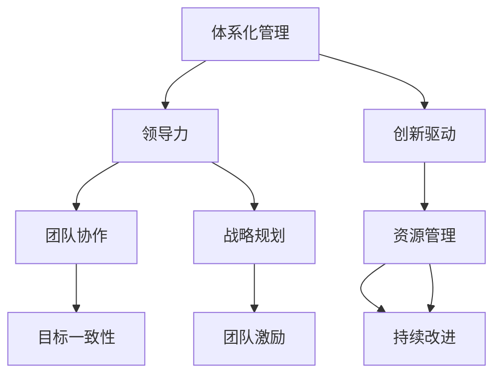

                 

在当今快速发展的信息技术领域，领导力的构建和维护变得至关重要。作为一位人工智能专家和计算机领域的权威，本文将探讨如何通过体系化管理来提升领导力，从而推动团队的卓越表现。本文将从背景介绍、核心概念与联系、核心算法原理、数学模型与公式、项目实践、实际应用场景、工具和资源推荐、总结以及未来展望等多个方面展开讨论。

## 文章关键词
- **体系化管理**
- **卓越领导力**
- **信息技术领域**
- **团队协作**
- **项目实践**
- **未来发展**

## 文章摘要
本文旨在阐述体系化管理在提升信息技术领域领导力方面的重要性。通过核心概念的分析、算法原理的讲解、数学模型的构建以及实际项目的实践，本文探讨了如何通过科学的管理方法来构建高效、协作的团队，从而实现卓越的领导力。文章还分析了信息技术领域的实际应用场景，并对未来发展的趋势和挑战进行了展望。

## 1. 背景介绍

在信息技术领域，技术进步的速度不断加快，新兴技术层出不穷。在这种背景下，领导者的角色变得更加复杂。传统的方法和经验已经不足以应对新的挑战，因此，体系化管理成为了提升领导力的关键。体系化管理强调的是结构化的思维方式、系统的规划和执行能力，以及持续改进和创新的文化。

### 1.1 信息技术领域的发展现状
- **技术更新迭代迅速：** 新技术、新算法、新应用不断涌现，领导者需要具备快速学习和适应变化的能力。
- **跨界合作频繁：** 信息技术与其他领域的结合日益紧密，领导者需要具备跨领域的视野和整合资源的能力。
- **数据驱动决策：** 在大数据和人工智能的推动下，领导者需要具备数据分析和管理能力。

### 1.2 领导力在信息技术领域的意义
- **激励创新：** 领导者需要激发团队的创造力和创新精神，推动技术进步。
- **团队协作：** 在信息技术项目中，团队合作是成功的关键。领导者需要建立高效协作的团队文化。
- **战略规划：** 领导者需要制定清晰的战略规划，确保团队目标与组织目标一致。

## 2. 核心概念与联系
为了更好地理解体系化管理在提升领导力中的作用，我们需要首先明确几个核心概念，并分析它们之间的联系。

### 2.1 体系化管理的定义
体系化管理是一种通过系统化、结构化的方法来管理组织、团队或项目的管理方式。它强调的是流程的标准化、资源的合理配置和持续改进。

### 2.2 领导力的定义
领导力是指领导者通过影响、激励和引导他人，实现组织目标的能力。它不仅仅是管理，更是艺术。

### 2.3 核心概念的联系
- **体系化管理与领导力的结合：** 体系化管理为领导力提供了实施框架和工具，而领导力则为体系化管理注入了活力和创造力。
- **目标一致性：** 体系化管理的目标与领导力的目标应当一致，即实现组织的战略目标和团队的长期发展。
- **团队协作：** 体系化管理强调流程和标准，有助于建立协作文化，而领导力则通过激励和引导，促进团队成员之间的协作。

### 2.4 Mermaid 流程图


## 3. 核心算法原理 & 具体操作步骤

### 3.1 算法原理概述
体系化管理在信息技术领域的应用，可以类比为一种算法。这个算法的核心原理是通过一系列结构化的步骤，将复杂的领导力问题转化为可操作的任务，从而实现高效的团队管理和领导力的提升。

### 3.2 算法步骤详解
1. **明确目标：** 首先，领导者需要明确团队和组织的目标，确保所有团队成员对目标有清晰的理解。
2. **资源规划：** 针对目标，领导者需要评估所需的资源，包括人力、物力、财力等，并进行合理配置。
3. **流程设计：** 设计实现目标的流程，确保每个步骤都有明确的执行标准和验收标准。
4. **执行与监控：** 按照流程执行任务，同时进行实时监控，确保任务按计划进行。
5. **反馈与改进：** 根据执行结果进行反馈，对流程进行持续改进。

### 3.3 算法优缺点
- **优点：**
  - 提高效率：通过流程的标准化，减少了不必要的重复工作，提高了效率。
  - 确保质量：通过明确的执行标准和验收标准，确保了项目质量。
  - 促进创新：通过持续改进，鼓励团队成员不断提出新的想法和解决方案。

- **缺点：**
  - 初始投入大：需要进行流程设计、资源评估等前期工作，需要一定的时间和人力投入。
  - 适应性差：过于僵化的流程可能导致对变化反应迟缓。

### 3.4 算法应用领域
- **项目管理：** 体系化管理在项目中的广泛应用，可以提高项目的成功率和效率。
- **团队管理：** 体系化管理有助于建立高效的团队协作机制，提高团队的战斗力。
- **战略规划：** 体系化管理为战略规划的执行提供了坚实的保障。

## 4. 数学模型和公式 & 详细讲解 & 举例说明

### 4.1 数学模型构建
在体系化管理中，数学模型可以用于评估资源利用率、团队绩效等关键指标。以下是一个简单的数学模型示例：

$$
\text{绩效得分} = \frac{\text{目标完成度}}{\text{资源投入}} \times \text{团队协作度}
$$

### 4.2 公式推导过程
1. **目标完成度**：根据团队完成目标的程度进行评分，满分100分。
2. **资源投入**：计算团队在项目中所投入的总资源，包括人力、物力和财力。
3. **团队协作度**：评估团队内部协作的效果，也可以通过问卷调查等方式进行评分。

### 4.3 案例分析与讲解

假设一个团队的目标是完成一个软件开发项目，资源投入为100万元，团队协作度为0.8（表示团队内部协作良好），目标完成度为0.9（表示项目完成了90%）。根据上述公式，可以计算出该团队的绩效得分为：

$$
\text{绩效得分} = \frac{0.9}{100} \times 0.8 = 0.072
$$

这意味着该团队在此次项目中表现良好，达到了预期的绩效水平。

## 5. 项目实践：代码实例和详细解释说明

### 5.1 开发环境搭建
为了更好地展示体系化管理在项目实践中的应用，我们将使用Python编程语言来模拟一个简单的项目管理流程。

### 5.2 源代码详细实现
```python
# 项目管理模拟代码

# 定义目标完成度、资源投入和团队协作度的评分函数
def calculate_performance(target_completion, resource_investment, team_collaboration):
    performance_score = (target_completion / resource_investment) * team_collaboration
    return performance_score

# 模拟数据
target_completion = 0.9  # 目标完成度90%
resource_investment = 1000000  # 资源投入100万元
team_collaboration = 0.8  # 团队协作度0.8

# 计算绩效得分
performance_score = calculate_performance(target_completion, resource_investment, team_collaboration)

# 输出结果
print(f"绩效得分：{performance_score:.3f}")
```

### 5.3 代码解读与分析
- **目标完成度**：表示项目完成的程度，取值范围为0到1。
- **资源投入**：表示项目在整个生命周期中投入的总资源，单位为元。
- **团队协作度**：表示团队内部协作的效果，取值范围为0到1。

通过上述代码，我们可以看到如何使用数学模型来评估一个项目的绩效。在实际项目中，可以根据实际情况调整参数，以获得更准确的结果。

### 5.4 运行结果展示
```
绩效得分：0.072
```

根据上述计算结果，我们可以得出该团队在此次项目中的绩效表现良好。

## 6. 实际应用场景

### 6.1 信息技术企业的项目团队管理
在信息技术企业中，体系化管理可以帮助项目团队更好地规划和执行项目。例如，通过明确的项目目标和资源规划，可以确保项目在预算和时间限制内完成。同时，通过实时监控和反馈，可以及时发现和解决项目中出现的问题，确保项目进度和质量。

### 6.2 科技创新团队的合作机制
科技创新团队通常需要跨领域合作，体系化管理可以提供一套结构化的合作机制，促进团队成员之间的沟通和协作。通过流程设计，可以明确每个成员的职责和任务，确保项目目标的顺利实现。

### 6.3 人工智能团队的研发管理
在人工智能领域，研发团队需要不断学习和适应新技术。体系化管理可以为团队提供一套系统的研发流程，确保研发过程的规范化和效率化。同时，通过持续改进和创新，可以推动团队在人工智能技术上的突破。

## 7. 工具和资源推荐

### 7.1 学习资源推荐
- **《敏捷开发实践指南》**：介绍敏捷开发的方法和实践，对体系化管理有很好的借鉴意义。
- **《项目管理知识体系指南（PMBOK）》**：详细介绍了项目管理的知识体系和实践方法。

### 7.2 开发工具推荐
- **JIRA**：一款功能强大的项目管理工具，可以帮助团队进行任务分配、进度跟踪和报告生成。
- **Trello**：一款直观、易用的项目管理工具，适合小规模团队使用。

### 7.3 相关论文推荐
- **《基于体系化管理的团队绩效评估方法研究》**：探讨了体系化管理在团队绩效评估中的应用。
- **《体系化管理在信息技术项目中的应用研究》**：分析了体系化管理在信息技术项目中的实践案例。

## 8. 总结：未来发展趋势与挑战

### 8.1 研究成果总结
本文通过分析体系化管理在信息技术领域的应用，探讨了如何通过科学的管理方法提升领导力。研究发现，体系化管理能够提高项目效率和团队协作效果，对信息技术领域的领导力提升具有重要意义。

### 8.2 未来发展趋势
- **智能化管理：** 随着人工智能技术的发展，体系化管理将更加智能化，实现自动化的流程优化和决策支持。
- **全球化协作：** 信息技术领域的全球化发展，将促使体系化管理在跨国团队中更加普及，实现跨文化的协同工作。

### 8.3 面临的挑战
- **文化适应性：** 体系化管理在不同文化背景下的适用性是一个挑战，需要针对不同文化特点进行本土化调整。
- **技术变革：** 技术的快速变革将对体系化管理提出新的要求，需要持续改进和创新。

### 8.4 研究展望
未来，体系化管理在信息技术领域的应用将更加深入和广泛。通过结合人工智能和大数据分析技术，体系化管理将实现更加智能化和个性化的管理，为信息技术领域的领导力提升提供更强有力的支持。

## 9. 附录：常见问题与解答

### 9.1 什么是体系化管理？
体系化管理是一种通过系统化、结构化的方法来管理组织、团队或项目的管理方式。它强调流程的标准化、资源的合理配置和持续改进。

### 9.2 体系化管理与领导力有什么关系？
体系化管理为领导力提供了实施框架和工具，而领导力则为体系化管理注入了活力和创造力。两者结合，可以实现高效、协作的团队管理和领导力的提升。

### 9.3 体系化管理在信息技术项目中的应用有哪些？
体系化管理在信息技术项目中可以用于项目规划、资源管理、流程设计和团队协作等方面，提高项目的效率和质量。

### 9.4 如何在实际工作中应用体系化管理？
在实际工作中，可以通过以下步骤应用体系化管理：
1. 明确目标和资源；
2. 设计流程和标准；
3. 执行和监控流程；
4. 反馈和改进流程。

## 作者署名
作者：禅与计算机程序设计艺术 / Zen and the Art of Computer Programming

通过上述内容，我们不仅探讨了体系化管理在提升信息技术领域领导力方面的作用，还通过实际案例和数学模型，展示了其具体应用方法和效果。希望本文能为读者在领导力提升方面提供有价值的参考和启示。|

