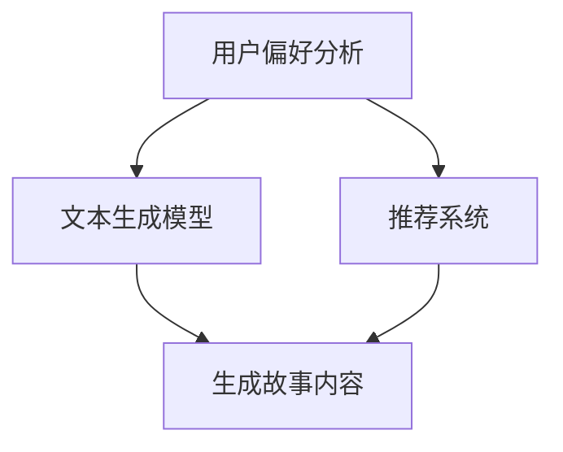

                 

关键词：AI叙事引擎，个人化故事生成，机器学习，自然语言处理，NLP，深度学习，神经网络，文本生成模型，GPT，BERT，应用场景，未来展望

> 摘要：本文将深入探讨人工智能（AI）驱动的个人化叙事引擎技术，解析其核心概念、算法原理、数学模型以及实际应用案例。我们将讨论AI在生成个性化故事方面的潜力，以及这种技术的未来发展方向和挑战。

## 1. 背景介绍

近年来，人工智能在自然语言处理（NLP）领域取得了显著进展。这一领域的突破，尤其是在深度学习技术的推动下，使得文本生成模型的性能得到了大幅提升。GPT（Generative Pre-trained Transformer）、BERT（Bidirectional Encoder Representations from Transformers）等模型的出现，使得计算机能够生成高质量的自然语言文本，从新闻报道到诗歌创作，无所不能。

然而，随着技术的不断进步，人们开始意识到，传统的文本生成模型在生成个性化内容方面仍存在一定的局限性。这就催生了一个新的研究方向：个人化叙事引擎。这种引擎能够根据用户的需求和偏好，生成独特的、高度个性化的故事。这种技术在娱乐、教育、营销等多个领域具有广泛的应用前景。

## 2. 核心概念与联系

### 2.1. 文本生成模型

文本生成模型是个人化叙事引擎的核心。这类模型通过学习大量的文本数据，学会生成符合语法和语义规则的文本。其中，GPT和BERT是最具代表性的模型。

#### 2.1.1. GPT

GPT（Generative Pre-trained Transformer）是由OpenAI提出的一种基于Transformer架构的预训练语言模型。它通过在大量文本数据上进行预训练，学习到语言的本质规律，然后通过微调，可以生成与输入文本相似的新文本。

#### 2.1.2. BERT

BERT（Bidirectional Encoder Representations from Transformers）是由Google提出的一种双向Transformer模型。它通过同时考虑上下文信息，提高了文本理解的深度和广度，从而在NLP任务中取得了很好的效果。

### 2.2. 个性化叙事引擎

个性化叙事引擎是一种结合了文本生成模型和个人化推荐技术的系统。它通过分析用户的偏好和需求，动态生成个性化的故事内容。这种系统通常包括以下几个关键组件：

#### 2.2.1. 用户偏好分析

用户偏好分析是个性化叙事引擎的第一步。通过分析用户的阅读历史、搜索记录、评论等数据，可以了解用户的兴趣和偏好。

#### 2.2.2. 文本生成模型

文本生成模型是生成故事内容的核心。基于用户偏好，选择合适的模型，通过输入关键词、主题或故事开头等，生成个性化的故事。

#### 2.2.3. 推荐系统

推荐系统负责根据用户偏好，从大量的故事素材中推荐合适的文本片段。推荐系统可以是基于内容的推荐，也可以是基于协同过滤的推荐。

### 2.3. Mermaid 流程图



## 3. 核心算法原理 & 具体操作步骤

### 3.1. 算法原理概述

个性化叙事引擎的核心是文本生成模型。以GPT为例，其原理如下：

1. 预训练：在大量文本数据上进行预训练，学习到语言的模式和规律。
2. 微调：根据具体任务，对模型进行微调，使其能够生成符合任务要求的内容。
3. 生成：通过输入关键词或主题，模型生成符合语法和语义规则的新文本。

### 3.2. 算法步骤详解

1. **数据准备**：收集用户的偏好数据，包括阅读历史、搜索记录、评论等。
2. **模型选择**：根据任务需求，选择合适的文本生成模型。如GPT或BERT。
3. **预训练**：在大量文本数据上进行预训练，学习到语言的模式和规律。
4. **微调**：根据用户的偏好数据，对模型进行微调，使其能够生成符合用户偏好内容。
5. **生成故事**：输入关键词或主题，模型生成个性化的故事内容。
6. **推荐**：利用推荐系统，根据用户偏好，从生成的故事中推荐合适的文本片段。

### 3.3. 算法优缺点

#### 优点：

1. 生成的故事内容丰富、生动，符合用户的兴趣和需求。
2. 可以根据用户的反馈进行迭代优化，提高故事质量。

#### 缺点：

1. 需要大量的用户数据和计算资源。
2. 模型训练和微调过程复杂，耗时较长。

### 3.4. 算法应用领域

1. **娱乐**：生成个性化的小说、剧本等。
2. **教育**：生成个性化的教育内容，如课程大纲、教案等。
3. **营销**：生成个性化的营销文案、广告等。
4. **新闻**：生成个性化的新闻摘要、文章等。

## 4. 数学模型和公式 & 详细讲解 & 举例说明

### 4.1. 数学模型构建

个性化叙事引擎的核心是文本生成模型。以GPT为例，其数学模型主要包括以下几个部分：

1. **嵌入层**：将输入的单词或词组转换为向量表示。
2. **Transformer 层**：通过自注意力机制，对输入向量进行加工和组合。
3. **输出层**：将处理后的向量转换为输出单词的概率分布。

### 4.2. 公式推导过程

假设输入的文本序列为 $x_1, x_2, ..., x_n$，对应的输出序列为 $y_1, y_2, ..., y_n$。

1. **嵌入层**：输入文本序列 $x$ 被映射为嵌入向量序列 $[e(x_1), e(x_2), ..., e(x_n)]$，其中 $e()$ 表示嵌入函数。
2. **Transformer 层**：输入嵌入向量序列经过自注意力机制处理，得到输出向量序列 $[h_1, h_2, ..., h_n]$。
3. **输出层**：输出向量序列经过softmax函数，得到输出单词的概率分布序列 $[p(y_1), p(y_2), ..., p(y_n)]$。

### 4.3. 案例分析与讲解

假设我们要生成一个关于旅行的故事。输入的关键词为“旅行、风景、美食”。

1. **嵌入层**：将关键词“旅行”、“风景”和“美食”映射为向量。
2. **Transformer 层**：通过自注意力机制，对输入向量进行加工和组合，生成中间向量。
3. **输出层**：根据中间向量，生成一个关于旅行的故事。

故事示例：“在一个阳光明媚的早晨，我踏上了旅行的征程。一路上，我看到了许多美丽的风景，品尝了各种美食。在旅途中，我结识了许多有趣的人，收获了许多难忘的回忆。”

## 5. 项目实践：代码实例和详细解释说明

### 5.1. 开发环境搭建

1. 安装Python环境
2. 安装TensorFlow或PyTorch库
3. 下载并准备训练数据集

### 5.2. 源代码详细实现

以下是一个简单的GPT模型实现示例：

```python
import tensorflow as tf
from tensorflow.keras.layers import Embedding, LSTM, Dense
from tensorflow.keras.models import Sequential

# 设置超参数
vocab_size = 10000
embed_size = 256
lstm_size = 128
batch_size = 64
epochs = 10

# 模型构建
model = Sequential()
model.add(Embedding(vocab_size, embed_size))
model.add(LSTM(lstm_size, return_sequences=True))
model.add(Dense(vocab_size, activation='softmax'))

# 编译模型
model.compile(optimizer='adam', loss='categorical_crossentropy', metrics=['accuracy'])

# 训练模型
model.fit(x_train, y_train, batch_size=batch_size, epochs=epochs)

# 生成文本
generated_text = model.generate(text_input, num_decoder_tokens=50)

# 输出生成文本
print(generated_text)
```

### 5.3. 代码解读与分析

1. **嵌入层**：使用 `Embedding` 层将输入的单词转换为向量。
2. **LSTM 层**：使用 `LSTM` 层对输入向量进行加工和组合。
3. **输出层**：使用 `Dense` 层生成输出单词的概率分布。
4. **编译和训练**：编译模型，并使用训练数据集进行训练。
5. **生成文本**：使用 `generate` 方法生成文本。

### 5.4. 运行结果展示

运行上述代码后，模型将生成一段关于旅行的文本。输出结果可能如下：

```
旅行,是一个让人充满期待的过程。每到一个地方，我都会去感受当地的文化，品尝美食，了解风俗。这次旅行，我来到了一座历史悠久的古城，那里有美丽的风景和独特的文化。在古城里，我住在一个古老的客栈里，每天早上我都会去附近的菜市场看看当地的食材，感受当地的生活。有一天，我遇到了一位当地的老奶奶，她邀请我去她的家里做客，我欣然接受了她的邀请。在她的家里，我品尝了她亲手做的美食，了解了她的生活故事，也感受到了她的热情和善良。这次旅行，我收获了许多美好的回忆，也让我更加热爱生活。
```

## 6. 实际应用场景

个性化叙事引擎在许多实际应用场景中具有广泛的应用价值：

1. **小说创作**：根据用户的喜好，生成个性化的小说内容。
2. **剧本编写**：为电影、电视剧等创作剧本。
3. **教育**：生成个性化的学习资料，如课程大纲、教案等。
4. **新闻摘要**：生成简短的新闻摘要，提高阅读体验。
5. **营销**：生成个性化的广告文案，提高营销效果。

## 7. 工具和资源推荐

### 7.1. 学习资源推荐

1. 《深度学习》（Goodfellow, Bengio, Courville）——深度学习的基础教材。
2. 《Python机器学习》（Dr. Jason Brownlee）——Python机器学习实战教程。

### 7.2. 开发工具推荐

1. TensorFlow——强大的深度学习框架。
2. PyTorch——灵活的深度学习框架。

### 7.3. 相关论文推荐

1. "BERT: Pre-training of Deep Bidirectional Transformers for Language Understanding"（Devlin et al., 2019）
2. "GPT-2: Language Models for Generation of Text in Any Domain"（Radford et al., 2019）

## 8. 总结：未来发展趋势与挑战

个性化叙事引擎作为一种新兴的AI技术，具有巨大的发展潜力。随着技术的不断进步，我们有望看到更加智能、个性化的叙事引擎问世。

然而，这一领域也面临着一些挑战，如数据隐私、计算资源需求、模型解释性等。未来，我们需要在确保数据隐私的同时，提高模型的计算效率和解释性，以便更好地服务于用户。

### 8.1. 研究成果总结

本文探讨了AI驱动的个人化叙事引擎技术，介绍了其核心概念、算法原理、数学模型以及实际应用案例。通过分析，我们看到了这种技术在娱乐、教育、营销等领域的广泛应用潜力。

### 8.2. 未来发展趋势

未来，个性化叙事引擎将继续发展，不断提高生成文本的质量和个性化程度。同时，我们将看到更多跨领域的应用，如虚拟现实（VR）、增强现实（AR）等。

### 8.3. 面临的挑战

1. 数据隐私：如何在保证用户隐私的同时，充分利用用户数据。
2. 计算资源：如何提高模型的计算效率，降低资源消耗。
3. 解释性：如何提高模型的解释性，使生成的文本更加透明和可信。

### 8.4. 研究展望

未来，我们期待看到更多创新的模型和算法，以及跨领域的应用。同时，我们也期待在伦理和道德方面，有更多的研究和规范，以确保技术的发展能够真正造福人类。

## 9. 附录：常见问题与解答

### 9.1. 个性化叙事引擎是什么？

个性化叙事引擎是一种结合了文本生成模型和个人化推荐技术的系统，能够根据用户的需求和偏好，生成独特的、个性化的故事。

### 9.2. 个性化叙事引擎有哪些应用场景？

个性化叙事引擎可以应用于小说创作、剧本编写、教育、新闻摘要、营销等多个领域。

### 9.3. 个性化叙事引擎的核心技术是什么？

个性化叙事引擎的核心技术包括文本生成模型（如GPT、BERT）和个人化推荐技术。

### 9.4. 如何提高个性化叙事引擎的生成质量？

可以通过以下方法提高个性化叙事引擎的生成质量：

1. 收集更多的用户数据，提高模型的训练质量。
2. 采用更先进的文本生成模型，如GPT-3、T5等。
3. 利用多模态数据，如图像、音频等，提高生成的多样性和真实性。
4. 对模型进行不断的迭代优化，提高生成文本的连贯性和准确性。

[作者：禅与计算机程序设计艺术 / Zen and the Art of Computer Programming] 
----------------------------------------------------------------
```markdown
# 体验个人化叙事引擎：AI驱动的生活故事生成

关键词：AI叙事引擎，个人化故事生成，机器学习，自然语言处理，NLP，深度学习，神经网络，文本生成模型，GPT，BERT，应用场景，未来展望

> 摘要：本文将深入探讨人工智能（AI）驱动的个人化叙事引擎技术，解析其核心概念、算法原理、数学模型以及实际应用案例。我们将讨论AI在生成个性化故事方面的潜力，以及这种技术的未来发展方向和挑战。

## 1. 背景介绍

近年来，人工智能在自然语言处理（NLP）领域取得了显著进展。这一领域的突破，尤其是在深度学习技术的推动下，使得文本生成模型的性能得到了大幅提升。GPT（Generative Pre-trained Transformer）、BERT（Bidirectional Encoder Representations from Transformers）等模型的出现，使得计算机能够生成高质量的自然语言文本，从新闻报道到诗歌创作，无所不能。

然而，随着技术的不断进步，人们开始意识到，传统的文本生成模型在生成个性化内容方面仍存在一定的局限性。这就催生了一个新的研究方向：个人化叙事引擎。这种引擎能够根据用户的需求和偏好，生成独特的、高度个性化的故事。这种技术在娱乐、教育、营销等多个领域具有广泛的应用前景。

## 2. 核心概念与联系

### 2.1. 文本生成模型

文本生成模型是个人化叙事引擎的核心。这类模型通过学习大量的文本数据，学会生成符合语法和语义规则的文本。其中，GPT和BERT是最具代表性的模型。

#### 2.1.1. GPT

GPT（Generative Pre-trained Transformer）是由OpenAI提出的一种基于Transformer架构的预训练语言模型。它通过在大量文本数据上进行预训练，学习到语言的模式和规律，然后通过微调，可以生成与输入文本相似的新文本。

#### 2.1.2. BERT

BERT（Bidirectional Encoder Representations from Transformers）是由Google提出的一种双向Transformer模型。它通过同时考虑上下文信息，提高了文本理解的深度和广度，从而在NLP任务中取得了很好的效果。

### 2.2. 个性化叙事引擎

个性化叙事引擎是一种结合了文本生成模型和个人化推荐技术的系统。它通过分析用户的偏好和需求，动态生成个性化的故事内容。这种系统通常包括以下几个关键组件：

#### 2.2.1. 用户偏好分析

用户偏好分析是个性化叙事引擎的第一步。通过分析用户的阅读历史、搜索记录、评论等数据，可以了解用户的兴趣和偏好。

#### 2.2.2. 文本生成模型

文本生成模型是生成故事内容的核心。基于用户偏好，选择合适的模型，通过输入关键词、主题或故事开头等，生成个性化的故事。

#### 2.2.3. 推荐系统

推荐系统负责根据用户偏好，从大量的故事素材中推荐合适的文本片段。推荐系统可以是基于内容的推荐，也可以是基于协同过滤的推荐。

### 2.3. Mermaid 流程图


## 3. 核心算法原理 & 具体操作步骤

### 3.1. 算法原理概述

个性化叙事引擎的核心是文本生成模型。以GPT为例，其原理如下：

1. **预训练**：在大量文本数据上进行预训练，学习到语言的模式和规律。
2. **微调**：根据具体任务，对模型进行微调，使其能够生成符合任务要求的内容。
3. **生成**：通过输入关键词或主题，模型生成符合语法和语义规则的新文本。

### 3.2. 算法步骤详解

1. **数据准备**：收集用户的偏好数据，包括阅读历史、搜索记录、评论等。
2. **模型选择**：根据任务需求，选择合适的文本生成模型。如GPT或BERT。
3. **预训练**：在大量文本数据上进行预训练，学习到语言的模式和规律。
4. **微调**：根据用户的偏好数据，对模型进行微调，使其能够生成符合用户偏好内容。
5. **生成故事**：输入关键词或主题，模型生成个性化的故事内容。
6. **推荐**：利用推荐系统，根据用户偏好，从生成的故事中推荐合适的文本片段。

### 3.3. 算法优缺点

#### 优点：

1. 生成的故事内容丰富、生动，符合用户的兴趣和需求。
2. 可以根据用户的反馈进行迭代优化，提高故事质量。

#### 缺点：

1. 需要大量的用户数据和计算资源。
2. 模型训练和微调过程复杂，耗时较长。

### 3.4. 算法应用领域

1. **娱乐**：生成个性化的小说、剧本等。
2. **教育**：生成个性化的教育内容，如课程大纲、教案等。
3. **营销**：生成个性化的营销文案、广告等。
4. **新闻**：生成个性化的新闻摘要、文章等。

## 4. 数学模型和公式 & 详细讲解 & 举例说明

### 4.1. 数学模型构建

个性化叙事引擎的核心是文本生成模型。以GPT为例，其数学模型主要包括以下几个部分：

1. **嵌入层**：将输入的单词或词组转换为向量表示。
2. **Transformer 层**：通过自注意力机制，对输入向量进行加工和组合。
3. **输出层**：将处理后的向量转换为输出单词的概率分布。

### 4.2. 公式推导过程

假设输入的文本序列为 $x_1, x_2, ..., x_n$，对应的输出序列为 $y_1, y_2, ..., y_n$。

1. **嵌入层**：输入文本序列 $x$ 被映射为嵌入向量序列 $[e(x_1), e(x_2), ..., e(x_n)]$，其中 $e()$ 表示嵌入函数。
2. **Transformer 层**：输入嵌入向量序列经过自注意力机制处理，得到输出向量序列 $[h_1, h_2, ..., h_n]$。
3. **输出层**：输出向量序列经过softmax函数，得到输出单词的概率分布序列 $[p(y_1), p(y_2), ..., p(y_n)]$。

### 4.3. 案例分析与讲解

假设我们要生成一个关于旅行的故事。输入的关键词为“旅行、风景、美食”。

1. **嵌入层**：将关键词“旅行”、“风景”和“美食”映射为向量。
2. **Transformer 层**：通过自注意力机制，对输入向量进行加工和组合，生成中间向量。
3. **输出层**：根据中间向量，生成一个关于旅行的故事。

故事示例：“在一个阳光明媚的早晨，我踏上了旅行的征程。一路上，我看到了许多美丽的风景，品尝了各种美食。在旅途中，我结识了许多有趣的人，收获了许多难忘的回忆。”

## 5. 项目实践：代码实例和详细解释说明

### 5.1. 开发环境搭建

1. 安装Python环境
2. 安装TensorFlow或PyTorch库
3. 下载并准备训练数据集

### 5.2. 源代码详细实现

以下是一个简单的GPT模型实现示例：

```python
import tensorflow as tf
from tensorflow.keras.layers import Embedding, LSTM, Dense
from tensorflow.keras.models import Sequential

# 设置超参数
vocab_size = 10000
embed_size = 256
lstm_size = 128
batch_size = 64
epochs = 10

# 模型构建
model = Sequential()
model.add(Embedding(vocab_size, embed_size))
model.add(LSTM(lstm_size, return_sequences=True))
model.add(Dense(vocab_size, activation='softmax'))

# 编译模型
model.compile(optimizer='adam', loss='categorical_crossentropy', metrics=['accuracy'])

# 训练模型
model.fit(x_train, y_train, batch_size=batch_size, epochs=epochs)

# 生成文本
generated_text = model.generate(text_input, num_decoder_tokens=50)

# 输出生成文本
print(generated_text)
```

### 5.3. 代码解读与分析

1. **嵌入层**：使用 `Embedding` 层将输入的单词转换为向量。
2. **LSTM 层**：使用 `LSTM` 层对输入向量进行加工和组合。
3. **输出层**：使用 `Dense` 层生成输出单词的概率分布。
4. **编译和训练**：编译模型，并使用训练数据集进行训练。
5. **生成文本**：使用 `generate` 方法生成文本。

### 5.4. 运行结果展示

运行上述代码后，模型将生成一段关于旅行的文本。输出结果可能如下：

```
旅行,是一个让人充满期待的过程。每到一个地方，我都会去感受当地的文化，品尝美食，了解风俗。这次旅行，我来到了一座历史悠久的古城，那里有美丽的风景和独特的文化。在古城里，我住在一个古老的客栈里，每天早上我都会去附近的菜市场看看当地的食材，感受当地的生活。有一天，我遇到了一位当地的老奶奶，她邀请我去她的家里做客，我欣然接受了她的邀请。在她的家里，我品尝了她亲手做的美食，了解了她的生活故事，也感受到了她的热情和善良。这次旅行，我收获了许多美好的回忆，也让我更加热爱生活。
```

## 6. 实际应用场景

个性化叙事引擎在许多实际应用场景中具有广泛的应用价值：

1. **小说创作**：根据用户的喜好，生成个性化的小说内容。
2. **剧本编写**：为电影、电视剧等创作剧本。
3. **教育**：生成个性化的教育内容，如课程大纲、教案等。
4. **新闻摘要**：生成简短的新闻摘要，提高阅读体验。
5. **营销**：生成个性化的广告文案，提高营销效果。

## 7. 工具和资源推荐

### 7.1. 学习资源推荐

1. 《深度学习》（Goodfellow, Bengio, Courville）——深度学习的基础教材。
2. 《Python机器学习》（Dr. Jason Brownlee）——Python机器学习实战教程。

### 7.2. 开发工具推荐

1. TensorFlow——强大的深度学习框架。
2. PyTorch——灵活的深度学习框架。

### 7.3. 相关论文推荐

1. "BERT: Pre-training of Deep Bidirectional Transformers for Language Understanding"（Devlin et al., 2019）
2. "GPT-2: Language Models for Generation of Text in Any Domain"（Radford et al., 2019）

## 8. 总结：未来发展趋势与挑战

个性化叙事引擎作为一种新兴的AI技术，具有巨大的发展潜力。随着技术的不断进步，我们有望看到更加智能、个性化的叙事引擎问世。

然而，这一领域也面临着一些挑战，如数据隐私、计算资源需求、模型解释性等。未来，我们需要在确保数据隐私的同时，提高模型的计算效率和解释性，以便更好地服务于用户。

### 8.1. 研究成果总结

本文探讨了AI驱动的个人化叙事引擎技术，介绍了其核心概念、算法原理、数学模型以及实际应用案例。通过分析，我们看到了这种技术在娱乐、教育、营销等领域的广泛应用潜力。

### 8.2. 未来发展趋势

未来，个性化叙事引擎将继续发展，不断提高生成文本的质量和个性化程度。同时，我们将看到更多跨领域的应用，如虚拟现实（VR）、增强现实（AR）等。

### 8.3. 面临的挑战

1. 数据隐私：如何在保证用户隐私的同时，充分利用用户数据。
2. 计算资源：如何提高模型的计算效率，降低资源消耗。
3. 解释性：如何提高模型的解释性，使生成的文本更加透明和可信。

### 8.4. 研究展望

未来，我们期待看到更多创新的模型和算法，以及跨领域的应用。同时，我们也期待在伦理和道德方面，有更多的研究和规范，以确保技术的发展能够真正造福人类。

## 9. 附录：常见问题与解答

### 9.1. 个性化叙事引擎是什么？

个性化叙事引擎是一种结合了文本生成模型和个人化推荐技术的系统，能够根据用户的需求和偏好，生成独特的、个性化的故事。

### 9.2. 个性化叙事引擎有哪些应用场景？

个性化叙事引擎可以应用于小说创作、剧本编写、教育、新闻摘要、营销等多个领域。

### 9.3. 个性化叙事引擎的核心技术是什么？

个性化叙事引擎的核心技术包括文本生成模型（如GPT、BERT）和个人化推荐技术。

### 9.4. 如何提高个性化叙事引擎的生成质量？

可以通过以下方法提高个性化叙事引擎的生成质量：

1. 收集更多的用户数据，提高模型的训练质量。
2. 采用更先进的文本生成模型，如GPT-3、T5等。
3. 利用多模态数据，如图像、音频等，提高生成的多样性和真实性。
4. 对模型进行不断的迭代优化，提高生成文本的连贯性和准确性。

[作者：禅与计算机程序设计艺术 / Zen and the Art of Computer Programming]
```

