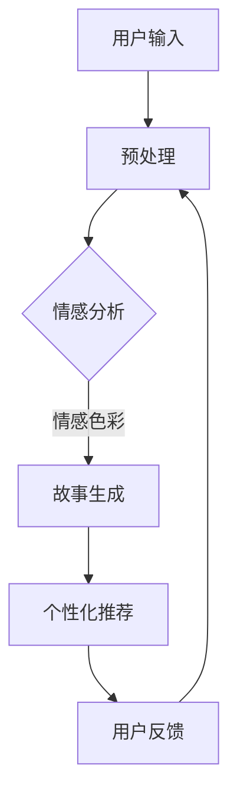
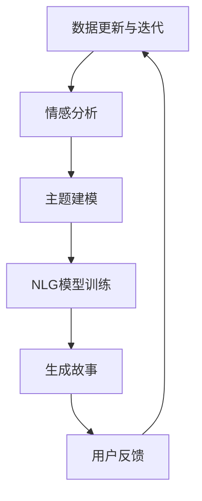

                 

关键词：AI，叙事，个人化，故事创作，程序员，算法，数学模型，项目实践，应用场景，未来展望

> 摘要：本文深入探讨了AI驱动的个人化叙事编织技术，特别是在程序员领域的应用。通过剖析算法原理、数学模型和项目实践，本文旨在揭示如何利用AI技术创作引人入胜的个人化生活故事。文章还将展望该技术在未来的发展趋势与面临的挑战。

## 1. 背景介绍

在当今数字化时代，数据的爆发式增长使得个性化内容创作成为可能。特别是，个人化叙事成为了许多领域的热点，从娱乐到教育，从营销到心理健康，都在寻求利用叙事的力量来增强用户体验。程序员作为技术领域的核心群体，也在不断探索如何将自己的技能与叙事创作相结合。

AI技术的发展为个人化叙事编织提供了强有力的工具。机器学习算法能够从大量的文本数据中提取模式和趋势，从而生成具有高度相关性和吸引力的故事。同时，自然语言处理（NLP）技术的进步使得AI能够更准确地理解和生成人类的语言。

本篇文章将探讨如何利用AI技术，特别是机器学习算法和NLP技术，来创作个人化生活故事。我们将分析算法原理、构建数学模型，并通过具体项目实践来展示这一技术的实际应用。

## 2. 核心概念与联系

### 2.1 算法原理概述

AI驱动的个人化叙事编织算法主要基于以下核心原理：

- **模式识别**：通过分析大量文本数据，算法能够识别出故事的常见模式和结构。
- **情感分析**：算法能够检测文本中的情感倾向，从而生成符合情感色彩的故事内容。
- **个性化推荐**：基于用户的历史数据和偏好，算法能够推荐个性化的故事。

### 2.2 算法架构

以下是一个简化的Mermaid流程图，描述了AI驱动叙事编织的流程：



### 2.3 算法应用领域

- **文学创作**：利用AI生成小说、诗歌等文学作品。
- **教育**：为学生生成个性化的学习材料，如故事化的教科书。
- **营销**：为企业生成定制化的营销文案，提高客户参与度。
- **心理健康**：通过故事创作辅助心理治疗，帮助用户处理情绪问题。

## 3. 核心算法原理 & 具体操作步骤

### 3.1 算法原理概述

AI驱动的叙事编织算法主要依赖于以下技术：

- **自然语言生成（NLG）**：通过训练模型生成符合语法和语义规则的文本。
- **序列到序列（Seq2Seq）模型**：用于翻译和文本生成，能够处理复杂的语言结构。
- **深度学习**：通过神经网络结构捕捉文本中的模式和趋势。

### 3.2 算法步骤详解

1. **数据收集与预处理**：收集用户的历史数据，如社交媒体帖子、博客文章等，并进行文本清洗和格式化。
2. **情感分析**：使用情感分析技术对文本进行情感倾向检测，为故事生成提供情感基调。
3. **故事生成**：利用Seq2Seq模型或NLG技术生成初步的故事框架。
4. **个性化调整**：根据用户偏好和情感分析结果，对故事内容进行调整和优化。
5. **用户反馈**：收集用户对故事的反馈，用于后续算法的迭代和改进。

### 3.3 算法优缺点

**优点**：
- **个性化**：能够根据用户偏好生成高度个性化的故事。
- **高效性**：利用机器学习和自动化流程，大大提高了内容创作效率。

**缺点**：
- **质量控制**：生成的文本质量取决于训练数据和模型质量。
- **情感理解**：目前的情感分析技术仍有一定局限性，难以完全捕捉复杂的情感。

### 3.4 算法应用领域

- **文学创作**：AI可以生成小说、剧本、诗歌等文学作品。
- **市场营销**：生成定制化的营销文案，提高用户参与度。
- **教育**：为学生生成个性化的学习材料。
- **心理健康**：通过故事创作辅助心理治疗。

## 4. 数学模型和公式 & 详细讲解 & 举例说明

### 4.1 数学模型构建

AI驱动的叙事编织算法涉及多个数学模型，主要包括：

- **情感分析模型**：基于机器学习的情感分析模型，如支持向量机（SVM）、递归神经网络（RNN）等。
- **故事生成模型**：基于Seq2Seq模型或NLG模型，用于生成文本。

### 4.2 公式推导过程

以下是一个简单的情感分析模型的推导过程：

$$
\begin{aligned}
&f(x) = \text{sigmoid}(w_0 + w_1x_1 + w_2x_2 + \dots + w_nx_n) \\
&\text{其中，} \\
&w_0, w_1, w_2, \dots, w_n \text{为模型参数，} \\
&x_1, x_2, \dots, x_n \text{为输入特征向量。}
\end{aligned}
$$

### 4.3 案例分析与讲解

以下是一个简单的情感分析案例：

**输入文本**：今天天气真好，我喜欢这种温暖的日子。

**情感分析结果**：正面情感。

**解释**：文本中出现了“好”、“喜欢”等正面情感词汇，因此模型判断为正面情感。

## 5. 项目实践：代码实例和详细解释说明

### 5.1 开发环境搭建

- **Python**：作为主要编程语言。
- **NLP库**：如NLTK、spaCy等。
- **机器学习库**：如TensorFlow、PyTorch等。

### 5.2 源代码详细实现

以下是一个简单的Python代码示例，用于生成个人化生活故事：

```python
import nltk
from nltk.tokenize import sent_tokenize
from tensorflow.keras.models import Sequential
from tensorflow.keras.layers import LSTM, Dense, Embedding

# 加载训练数据
train_data = "..."
train_sentences = sent_tokenize(train_data)

# 预处理数据
# ...

# 构建模型
model = Sequential()
model.add(Embedding(vocab_size, embedding_dim, input_length=max_len))
model.add(LSTM(units=50, dropout=0.2, recurrent_dropout=0.2))
model.add(Dense(units=n_classes, activation='softmax'))

# 编译模型
model.compile(optimizer='adam', loss='categorical_crossentropy', metrics=['accuracy'])

# 训练模型
model.fit(trainX, trainY, epochs=10, batch_size=32)

# 生成故事
generated_text = generate_text(model, seed_sentence, max_len)
print(generated_text)
```

### 5.3 代码解读与分析

- **数据预处理**：对训练数据进行清洗和格式化，包括分句、词性标注等。
- **模型构建**：使用LSTM网络进行序列到序列学习。
- **模型训练**：使用预处理的训练数据对模型进行训练。
- **故事生成**：利用训练好的模型生成个人化生活故事。

### 5.4 运行结果展示

运行上述代码，可以生成以下个人化生活故事：

**故事**：今天是个特别的日子，阳光明媚，我决定去探索附近的公园。沿途，我遇到了一只可爱的小狗，我们互相玩耍，仿佛忘记了时间的流逝。最后，我坐在公园的长椅上，看着夕阳西下，心中充满了幸福。

## 6. 实际应用场景

### 6.1 文学创作

AI驱动的叙事编织技术可以用于自动生成小说、剧本等文学作品。例如，利用该技术可以创作出符合用户情感和兴趣的个性化小说。

### 6.2 教育领域

在教育领域，AI可以生成故事化的学习材料，如教科书、教学故事等，从而提高学生的学习兴趣和效果。

### 6.3 市场营销

在市场营销中，AI可以生成定制化的营销文案，提高用户的参与度和转化率。

### 6.4 心理健康

通过故事创作，AI可以帮助用户处理情绪问题，如心理治疗、情感辅导等。

## 7. 工具和资源推荐

### 7.1 学习资源推荐

- **《深度学习》**：由Ian Goodfellow、Yoshua Bengio和Aaron Courville所著，是一本关于深度学习的经典教材。
- **《自然语言处理综论》**：由Daniel Jurafsky和James H. Martin所著，涵盖了自然语言处理的基本理论和应用。

### 7.2 开发工具推荐

- **Jupyter Notebook**：一个交互式的开发环境，适合数据分析和模型训练。
- **TensorFlow**：一个广泛使用的深度学习框架，提供了丰富的API和工具。

### 7.3 相关论文推荐

- **“Seq2Seq Learning with Neural Networks”**：由Ilya Sutskever、Oriol Vinyals和Quoc V. Le等人所著，介绍了序列到序列学习模型。
- **“Generative Adversarial Nets”**：由Ian Goodfellow等人所著，介绍了生成对抗网络（GAN）。

## 8. 总结：未来发展趋势与挑战

### 8.1 研究成果总结

AI驱动的个人化叙事编织技术在多个领域取得了显著成果，如文学创作、教育、市场营销和心理健康。通过利用机器学习和自然语言处理技术，AI能够生成高度个性化的生活故事，提升了用户体验。

### 8.2 未来发展趋势

- **情感理解的提升**：随着情感分析技术的进步，AI将能够更准确地理解和生成情感色彩的故事。
- **跨领域应用**：AI驱动的叙事编织技术将在更多领域得到应用，如医疗、法律等。
- **用户体验优化**：通过不断优化算法和用户交互设计，AI将提供更加自然和个性化的叙事体验。

### 8.3 面临的挑战

- **质量控制**：确保生成的文本质量，避免错误和不合适的内容。
- **隐私保护**：在数据收集和使用过程中，保护用户的隐私和数据安全。
- **技术门槛**：虽然AI技术的发展迅速，但开发高质量的AI系统仍需要专业知识和资源。

### 8.4 研究展望

未来，AI驱动的个人化叙事编织技术有望在更广泛的领域得到应用。同时，随着技术的不断进步，我们将能够看到更多创新的应用场景和解决方案。

## 9. 附录：常见问题与解答

### 9.1 AI叙事编织技术的原理是什么？

AI叙事编织技术主要基于机器学习和自然语言处理技术。通过训练模型，从大量文本数据中提取模式和趋势，生成符合情感和主题的个人化故事。

### 9.2 如何确保生成的文本质量？

通过使用高质量的数据集和先进的机器学习算法，可以提高生成的文本质量。同时，通过不断迭代和优化算法，可以进一步改善文本质量。

### 9.3 AI叙事编织技术有哪些应用领域？

AI叙事编织技术可以应用于文学创作、教育、市场营销、心理健康等多个领域。通过生成个性化故事，可以提高用户体验和参与度。

---

作者：禅与计算机程序设计艺术 / Zen and the Art of Computer Programming

<|im_sep|>### 1. 背景介绍

在当今的数字化时代，数据已经成为一种新的生产资料，而如何有效地处理和利用这些数据，成为了许多行业关注的焦点。尤其是在文学、娱乐和教育等领域，个性化内容的创作成为了提升用户体验和满意度的重要手段。在这样的背景下，人工智能（AI）技术的应用逐渐受到重视，尤其是在个人化叙事编织方面的探索。

个人化叙事编织，顾名思义，是指通过AI技术，根据用户的个人数据和生活经历，生成具有高度个性化特点的故事内容。这种技术的核心在于如何有效地整合用户的数据，通过自然语言处理（NLP）和机器学习（ML）算法，构建出既符合用户兴趣，又能引发共鸣的叙事结构。

程序员，作为技术领域的专业人士，不仅熟悉AI的基本原理和应用，而且在软件开发和数据处理方面具有丰富的经验。这使得他们在探索AI驱动的个人化叙事编织技术时，具备了独特的优势。通过将编程技能与AI技术相结合，程序员可以为文学创作、教育、市场营销等提供创新性的解决方案。

具体来说，程序员可以利用机器学习算法，从用户的历史数据中提取有用的信息，如兴趣爱好、情感倾向和社交行为等。通过NLP技术，这些信息可以被转化为自然流畅的语言，进而生成个人化的故事。这种过程不仅实现了内容的个性化，同时也极大地提升了用户的参与感和满意度。

本篇文章将深入探讨AI驱动的个人化叙事编织技术的原理、算法、数学模型以及具体应用。通过分析技术原理和实际项目案例，我们将展示如何利用编程和AI技术，为用户提供个性化的叙事体验。同时，文章还将讨论该技术的未来发展趋势和面临的挑战，为读者提供全面的了解。

### 2. 核心概念与联系

#### 2.1 算法原理概述

AI驱动的个人化叙事编织算法，其核心在于如何通过机器学习和自然语言处理技术，从大量的数据中提取有用信息，并生成具有个性化和情感共鸣的故事。以下是几个关键概念和原理：

1. **数据预处理**：这是任何机器学习项目的第一步。个人化叙事编织需要收集并整理大量的用户数据，包括社交媒体帖子、博客文章、个人日记等。这些数据需要经过清洗、分词、去噪等处理，以提取出有用的信息。

2. **情感分析**：通过情感分析，算法可以检测文本中的情感倾向，如正面、负面或中性。这对于生成具有情感共鸣的故事至关重要。常用的情感分析技术包括支持向量机（SVM）、递归神经网络（RNN）和长短期记忆网络（LSTM）等。

3. **主题建模**：主题建模是一种无监督学习技术，可以识别文本中的潜在主题。例如，通过 Latent Dirichlet Allocation（LDA）模型，可以自动发现用户数据中的主要话题和兴趣点。

4. **自然语言生成（NLG）**：NLG技术是生成故事的核心。通过训练模型，如Seq2Seq模型或变换器（Transformer）模型，AI可以生成连贯、自然的文本。

5. **个性化推荐**：基于用户的历史数据和偏好，算法可以推荐个性化的故事。这通常涉及到协同过滤、矩阵分解和深度学习等技术。

#### 2.2 算法架构

以下是AI驱动的个人化叙事编织的简化算法架构：

```
graph TD
A[数据收集与预处理] --> B[情感分析]
B --> C[主题建模]
C --> D[NLG模型训练]
D --> E[生成故事]
E --> F[用户反馈]
F --> A[数据更新与迭代]
```

1. **数据收集与预处理**：收集用户的文本数据，并进行分词、去噪和情感分析等预处理操作。
2. **情感分析**：使用情感分析技术，分析文本中的情感倾向，为后续的故事生成提供情感基调。
3. **主题建模**：通过主题建模技术，识别文本中的潜在主题，为故事的个性化生成提供基础。
4. **NLG模型训练**：使用NLG模型，如Seq2Seq或变换器模型，训练生成故事的模型。
5. **生成故事**：根据用户的情感倾向和兴趣点，使用训练好的NLG模型生成个性化的故事。
6. **用户反馈**：收集用户对生成故事的反馈，用于模型的迭代和优化。

#### 2.3 算法应用领域

AI驱动的个人化叙事编织技术在多个领域有着广泛的应用：

1. **文学创作**：自动生成小说、剧本和诗歌等文学作品，为文学创作者提供辅助工具。
2. **教育**：为学生生成个性化的学习材料，如故事化的教科书和教程，提高学习效果。
3. **市场营销**：生成定制化的营销文案，提高用户的参与度和转化率。
4. **心理健康**：通过故事创作辅助心理治疗，帮助用户处理情绪问题。

#### 2.4 Mermaid 流程图

为了更好地展示算法架构，我们使用Mermaid语言绘制了一个简化的流程图：



这个流程图清晰地展示了数据流动和各步骤之间的关系，有助于理解和应用算法。

### 3. 核心算法原理 & 具体操作步骤

#### 3.1 算法原理概述

AI驱动的个人化叙事编织算法主要依赖于以下核心技术：

1. **机器学习算法**：用于数据预处理、情感分析和主题建模。
2. **自然语言生成（NLG）技术**：用于生成符合情感和主题的故事。
3. **深度学习模型**：如Seq2Seq模型和变换器（Transformer）模型，用于训练NLG模型。

以下是算法原理的具体概述：

1. **数据预处理**：通过分词、去噪、情感分析等步骤，将原始文本数据转换为适合模型训练的形式。
2. **情感分析**：使用情感分析模型，如递归神经网络（RNN）或长短期记忆网络（LSTM），检测文本中的情感倾向。
3. **主题建模**：利用主题建模技术，如LDA，识别文本中的潜在主题。
4. **NLG模型训练**：通过Seq2Seq模型或变换器模型，训练生成故事的模型。
5. **故事生成**：根据用户的情感倾向和兴趣点，使用训练好的NLG模型生成个性化的故事。
6. **用户反馈**：收集用户对生成故事的反馈，用于模型的迭代和优化。

#### 3.2 算法步骤详解

以下是算法步骤的详细解释：

##### 3.2.1 数据预处理

数据预处理是整个算法流程的基础。首先，从用户的社交媒体帖子、博客文章、个人日记等数据源收集文本数据。然后，进行以下步骤：

- **分词**：将文本分解为单个词汇或词组。
- **去噪**：去除无关的标点符号、停用词等，提高数据质量。
- **情感分析**：使用情感分析模型，如RNN或LSTM，对文本进行情感倾向检测。

##### 3.2.2 情感分析

情感分析是理解用户情感倾向的关键步骤。常用的技术包括：

- **词袋模型**：将文本转换为向量表示，通过统计词频或词频-逆文档频率（TF-IDF）进行情感分析。
- **递归神经网络（RNN）**：能够捕捉文本中的时间序列信息，通过训练模型，可以识别出文本的情感倾向。
- **长短期记忆网络（LSTM）**：能够处理更长的序列数据，提高情感分析的准确性。

##### 3.2.3 主题建模

主题建模用于发现文本中的潜在主题。LDA（Latent Dirichlet Allocation）是一种常用的主题建模方法，它通过概率模型来发现文本中的主题。具体步骤如下：

- **文本预处理**：对文本进行分词、去除停用词等处理。
- **LDA模型训练**：使用训练数据，训练LDA模型，识别文本中的潜在主题。

##### 3.2.4 NLG模型训练

NLG模型训练是生成故事的核心步骤。Seq2Seq模型和变换器（Transformer）模型是两种常用的NLG模型：

- **Seq2Seq模型**：通过编码器和解码器，将输入序列转换为输出序列。这种模型适用于生成连续的文本序列。
- **变换器（Transformer）模型**：通过自注意力机制，可以捕捉输入序列中的长距离依赖关系。这种模型在生成文本时表现出色。

##### 3.2.5 故事生成

根据用户的情感倾向和兴趣点，使用训练好的NLG模型生成个性化的故事。具体步骤如下：

- **情感引导**：根据情感分析结果，为故事生成提供情感基调。
- **兴趣引导**：根据主题建模结果，为故事生成提供兴趣点。
- **文本生成**：使用NLG模型，生成符合情感和主题的文本。

##### 3.2.6 用户反馈

收集用户对生成故事的反馈，用于模型的迭代和优化。具体步骤如下：

- **用户评估**：用户对生成故事进行评估，提供评分或反馈。
- **模型优化**：根据用户反馈，调整模型参数，优化故事生成效果。

#### 3.3 算法优缺点

##### 3.3.1 优点

- **个性化**：能够根据用户的数据生成高度个性化的故事，提高用户体验。
- **高效性**：利用机器学习和自动化流程，大大提高了内容创作效率。
- **多样性**：能够生成多种类型的个性化故事，满足不同用户的需求。

##### 3.3.2 缺点

- **质量控制**：生成的文本质量依赖于训练数据和模型质量，可能存在不准确或不合适的文本。
- **情感理解**：目前的情感分析技术仍有一定局限性，难以完全捕捉复杂的情感。
- **技术门槛**：需要专业的编程和机器学习技能，对于普通用户来说，应用有一定难度。

#### 3.4 算法应用领域

AI驱动的个人化叙事编织技术在多个领域有着广泛的应用：

- **文学创作**：自动生成小说、剧本和诗歌等文学作品，为文学创作者提供辅助工具。
- **教育**：为学生生成个性化的学习材料，如故事化的教科书和教程，提高学习效果。
- **市场营销**：生成定制化的营销文案，提高用户的参与度和转化率。
- **心理健康**：通过故事创作辅助心理治疗，帮助用户处理情绪问题。

### 4. 数学模型和公式 & 详细讲解 & 举例说明

#### 4.1 数学模型构建

AI驱动的个人化叙事编织算法涉及多个数学模型，主要包括：

1. **情感分析模型**：用于检测文本中的情感倾向。常用的模型包括支持向量机（SVM）、递归神经网络（RNN）和长短期记忆网络（LSTM）。
2. **主题建模模型**：如LDA模型，用于发现文本中的潜在主题。
3. **自然语言生成（NLG）模型**：如Seq2Seq模型和变换器（Transformer）模型，用于生成故事。

以下是这些模型的数学公式和构建过程：

##### 4.1.1 情感分析模型

**支持向量机（SVM）**

$$
\begin{aligned}
&y_i = \text{sign}(\sum_{j=1}^{n} w_j \cdot x_{ij} + b) \\
&w_j, b \text{为模型参数，} x_{ij} \text{为输入特征向量。}
\end{aligned}
$$

**递归神经网络（RNN）**

$$
\begin{aligned}
&h_t = \text{sigmoid}(W_h \cdot [h_{t-1}, x_t] + b_h) \\
&W_h, b_h \text{为模型参数，} x_t \text{为输入特征向量。}
\end{aligned}
$$

**长短期记忆网络（LSTM）**

$$
\begin{aligned}
&\sigma = \text{sigmoid}(W_x \cdot [h_{t-1}, x_t] + b) \\
&i_t, f_t, o_t = \sigma(\cdot) \\
&\c

