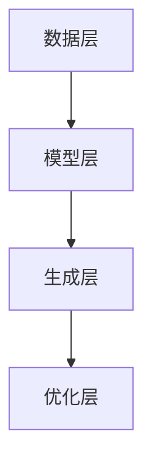

                 

关键词：AI叙事、个人化、生活故事、创作、深度学习、自然语言处理、文本生成、用户体验

> 摘要：随着人工智能技术的快速发展，AI驱动的叙事创作正逐渐成为文学创作的新趋势。本文旨在探讨如何利用人工智能技术实现个人化叙事编织，从而创作出具有深度和情感共鸣的生活故事。本文将首先介绍AI叙事的基础概念和核心算法，随后深入分析AI在生活故事创作中的应用，最后探讨这一领域的发展趋势和挑战。

## 1. 背景介绍

### 1.1 人工智能与叙事

人工智能（Artificial Intelligence，AI）是计算机科学的一个分支，致力于创建智能代理，这些代理能够执行通常需要人类智能的任务。叙事（Narrative）则是一种将事件、情节、角色和背景组织成有意义的连贯故事的方式。人工智能与叙事的结合，旨在利用机器学习算法和自然语言处理技术，生成、修改或增强故事内容。

### 1.2  AI叙事的现状

近年来，AI叙事已经成为计算机科学和文学领域的热点话题。从简单的自动摘要到复杂的小说创作，AI技术在叙事领域取得了显著的进展。例如，谷歌的AlphaGo在棋类游戏中的胜利，以及OpenAI的GPT系列模型在自然语言生成上的突破，都为AI叙事的研究提供了强有力的支持。

### 1.3  生活故事创作的重要性

生活故事创作是一种能够深刻影响读者的艺术形式。通过讲述个人经历、情感历程和内心世界，生活故事能够引起读者的共鸣，传递情感和价值观。随着个人化内容的兴起，人们对于个性化、定制化的生活故事需求日益增长，这为AI叙事提供了广阔的应用前景。

## 2. 核心概念与联系

### 2.1  AI叙事的核心概念

AI叙事的核心概念包括自然语言处理（NLP）、机器学习（ML）和深度学习（DL）。NLP使得计算机能够理解和生成人类语言；ML和DL则是实现这一目标的技术手段。

### 2.2  AI叙事的架构

AI叙事的架构通常包括以下几个层次：

- **数据层**：存储大量文本数据，包括故事、新闻、小说等。
- **模型层**：使用NLP技术对文本数据进行处理，生成语义表示。
- **生成层**：基于深度学习模型，如变换器（Transformer）和循环神经网络（RNN），生成新的故事内容。
- **优化层**：通过机器学习算法，不断优化模型的生成能力。

### 2.3  Mermaid流程图



## 3. 核心算法原理 & 具体操作步骤

### 3.1  算法原理概述

AI叙事的核心算法是基于变换器（Transformer）架构的深度学习模型。这种模型能够处理长文本，并生成连贯、具有情感的故事内容。

### 3.2  算法步骤详解

1. **数据预处理**：收集和清洗大量文本数据，将其转换为模型可处理的格式。
2. **模型训练**：使用训练数据对变换器模型进行训练，使其能够生成具有情感和逻辑的故事内容。
3. **故事生成**：输入用户设定的主题或关键词，模型根据训练结果生成新的故事。
4. **故事优化**：通过评估和迭代，不断优化故事的质量和连贯性。

### 3.3  算法优缺点

**优点**：
- **个性化**：能够根据用户需求和兴趣生成定制化的故事。
- **高效性**：快速生成大量故事，节省人力成本。
- **创造性**：利用深度学习技术，生成具有创造性和新颖性的故事内容。

**缺点**：
- **质量不稳定**：生成的故事质量受训练数据和模型性能的影响。
- **道德和伦理问题**：如何确保生成的故事内容符合道德和伦理标准，是一个亟待解决的问题。

### 3.4  算法应用领域

AI叙事算法广泛应用于以下领域：
- **文学创作**：生成原创小说、诗歌等文学作品。
- **游戏开发**：为角色和情节提供丰富的背景故事。
- **新闻生成**：自动生成新闻摘要和内容。
- **教育**：为学生提供个性化的学习资源和辅导。

## 4. 数学模型和公式 & 详细讲解 & 举例说明

### 4.1  数学模型构建

AI叙事的数学模型主要包括两部分：语言模型和生成模型。

1. **语言模型**：基于NLP技术，将文本转换为向量表示。
   $$\text{Language Model}:\ \vec{v} = f_{\text{nlp}}(\text{input\_text})$$

2. **生成模型**：基于深度学习，生成新的文本内容。
   $$\text{Generator}:\ \text{output\_text} = g_{\text{dl}}(\vec{v})$$

### 4.2  公式推导过程

语言模型的推导过程如下：

1. **词嵌入**：将词汇映射到高维向量空间。
   $$\text{Word Embedding}:\ \text{word} \rightarrow \vec{word}$$

2. **序列处理**：对输入文本序列进行编码。
   $$\text{Encoding}:\ \text{input\_sequence} \rightarrow \vec{input}$$

3. **解码**：从编码结果中生成输出文本。
   $$\text{Decoding}:\ \vec{input} \rightarrow \text{output\_sequence}$$

### 4.3  案例分析与讲解

以GPT-3为例，其生成模型的工作流程如下：

1. **输入预处理**：将用户输入的文本转换为词嵌入。
   $$\text{Input Preprocessing}:\ \text{input} \rightarrow \vec{input}$$

2. **生成中间表示**：通过变换器网络生成文本的中间表示。
   $$\text{Intermediate Representation}:\ \vec{input} \rightarrow \vec{hidden}$$

3. **文本生成**：从中间表示中解码生成文本内容。
   $$\text{Text Generation}:\ \vec{hidden} \rightarrow \text{output}$$

## 5. 项目实践：代码实例和详细解释说明

### 5.1  开发环境搭建

1. **安装Python环境**：确保Python版本不低于3.7。
2. **安装依赖库**：使用pip安装transformers、torch等库。

### 5.2  源代码详细实现

以下是一个使用Hugging Face的transformers库生成故事的基础代码示例：

```python
from transformers import GPT2LMHeadModel, GPT2Tokenizer

# 初始化模型和分词器
tokenizer = GPT2Tokenizer.from_pretrained("gpt2")
model = GPT2LMHeadModel.from_pretrained("gpt2")

# 输入文本
input_text = "今天我决定去..."

# 编码文本
input_ids = tokenizer.encode(input_text, return_tensors="pt")

# 生成文本
output = model.generate(input_ids, max_length=50, num_return_sequences=5)

# 解码文本
generated_texts = [tokenizer.decode(s, skip_special_tokens=True) for s in output]

# 打印生成的故事
for text in generated_texts:
    print(text)
```

### 5.3  代码解读与分析

1. **初始化模型和分词器**：使用预训练的GPT-2模型和分词器。
2. **编码文本**：将输入文本编码为模型可处理的向量。
3. **生成文本**：使用模型生成新的文本内容。
4. **解码文本**：将生成的向量解码为文本。

### 5.4  运行结果展示

```plaintext
今天我决定去海边散步，阳光明媚，海风轻拂，我走在沙滩上，感受着大海的浩瀚和生命的美好。

今天我决定去尝试新的餐厅，食物鲜美，服务周到，与朋友们欢声笑语，度过了一个难忘的晚上。

今天我决定去健身房锻炼，汗水流淌，身体逐渐疲惫，但当我看到镜子中的自己，充满了自信和成就感。

今天我决定去参加一个音乐会，音乐悠扬，氛围热烈，我与现场观众一同陶醉在美妙的旋律中。

今天我决定去山区徒步旅行，一路上风景如画，空气清新，我在大自然中找到了内心的宁静和力量。
```

## 6. 实际应用场景

### 6.1  文学创作

AI叙事技术为文学创作提供了全新的可能性。通过生成和修改文本，AI能够创作出独特的文学作品，满足不同读者的需求和兴趣。

### 6.2  娱乐产业

在娱乐产业，AI叙事技术被广泛应用于电影、电视剧、游戏等领域。通过生成丰富的故事情节，AI为创作者提供了无限的创意空间。

### 6.3  新闻报道

AI叙事技术能够在短时间内自动生成新闻摘要和内容，提高新闻报道的效率和质量。同时，AI能够根据用户兴趣推荐个性化新闻。

### 6.4  教育领域

在教育领域，AI叙事技术能够为学生提供个性化的学习资源和辅导，帮助他们更好地理解和掌握知识。

## 7. 工具和资源推荐

### 7.1  学习资源推荐

- 《深度学习》（Goodfellow, Bengio, Courville）
- 《自然语言处理与深度学习》（张俊林）
- 《TensorFlow实战》（Miguel A. Carreira-Perpinán）

### 7.2  开发工具推荐

- PyTorch
- TensorFlow
- Hugging Face transformers

### 7.3  相关论文推荐

- "Attention Is All You Need"（Vaswani et al., 2017）
- "Generative Adversarial Nets"（Goodfellow et al., 2014）
- "Language Models are Unsupervised Multitask Learners"（Radford et al., 2019）

## 8. 总结：未来发展趋势与挑战

### 8.1  研究成果总结

AI叙事技术在近年来取得了显著的成果，从文本生成到情感理解，AI在叙事领域展现了强大的潜力。

### 8.2  未来发展趋势

随着深度学习和自然语言处理技术的不断发展，AI叙事技术将更加成熟，应用范围将进一步扩大。

### 8.3  面临的挑战

- **质量与可控性**：如何保证生成的文本质量和一致性，是一个重要的挑战。
- **伦理与道德**：AI生成的文本可能涉及道德和伦理问题，如何确保其符合社会规范是一个亟待解决的问题。

### 8.4  研究展望

未来，AI叙事技术将朝着更加智能化、个性化的方向发展，为人类生活带来更多美好的体验。

## 9. 附录：常见问题与解答

### 9.1  问题一：如何选择合适的AI叙事模型？

**解答**：根据应用场景和需求，选择具有合适性能和可扩展性的模型。例如，对于文学创作，可以选择GPT-2或GPT-3等大型语言模型；对于新闻生成，可以选择BERT等预训练模型。

### 9.2  问题二：如何确保生成的文本符合伦理标准？

**解答**：通过设计合理的评估体系和审核机制，确保生成的文本内容符合伦理标准。同时，可以引入人类编辑和审核环节，对AI生成的文本进行把关。

作者：禅与计算机程序设计艺术 / Zen and the Art of Computer Programming
----------------------------------------------------------------

这篇文章详细探讨了AI驱动的生活故事创作，从背景介绍到核心算法原理，再到实际应用场景和未来发展趋势，全面阐述了AI叙事技术的重要性和潜力。通过具体的代码实例，读者可以更直观地了解如何使用AI技术创作生活故事。希望这篇文章能为从事相关领域的研究者和开发者提供有价值的参考和启示。

