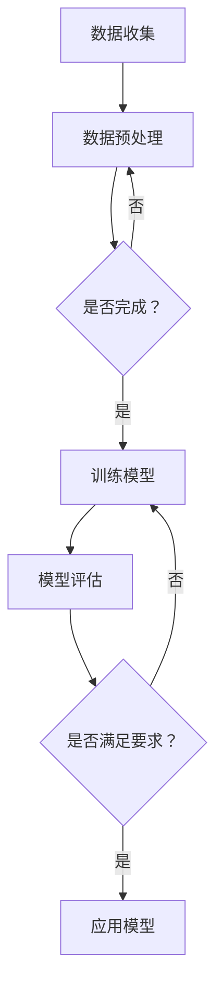

                 

关键词：AI，个人故事，叙事工作室，自动化创作，体验设计

> 摘要：本文探讨了一种新颖的叙事工作室模型，通过人工智能技术实现个人故事的自动化创作。我们将分析AI在叙事艺术中的应用，介绍其核心概念与架构，深入探讨算法原理和数学模型，并通过实际代码实例展示其应用。此外，本文还将讨论AI驱动叙事工作室的实际应用场景、工具和资源推荐，并对未来发展趋势与挑战进行展望。

## 1. 背景介绍

在信息爆炸的时代，内容创作变得越来越重要。无论是文学、影视，还是游戏和广告，都需要大量的原创内容。然而，传统的创作方式往往耗时耗力，且面临着创意枯竭和成本高昂的问题。近年来，人工智能（AI）技术的迅猛发展，为内容创作带来了新的契机。AI不仅可以处理大量的数据，还能模拟人类的思维模式，生成新颖、有趣的内容。

叙事艺术是内容创作的重要组成部分。从古至今，故事一直以其独特的魅力吸引着人们。然而，传统的故事创作需要深厚的文学功底和长时间的积累。现在，借助AI技术，我们可以探索一种全新的叙事工作室模式，实现个人故事的自动化创作。这种模式不仅能够提高创作效率，还能拓宽叙事艺术的表现形式。

本文旨在探讨AI驱动的个人故事创作坊，通过分析其核心概念、算法原理和数学模型，展示其实际应用，并探讨其未来发展趋势和面临的挑战。

## 2. 核心概念与联系

### 2.1 AI在叙事艺术中的应用

人工智能在叙事艺术中的应用主要体现在两个方面：一是生成故事情节，二是模拟情感表达。

**故事情节生成**：AI可以通过学习大量的故事素材和结构模板，自动生成新的故事情节。这种技术通常采用自然语言处理（NLP）和生成对抗网络（GAN）等技术。例如，Google的BERT模型可以理解文本语义，从而生成连贯、逻辑清晰的故事。

**情感表达模拟**：AI可以通过学习情感词汇和情感表达模式，模拟出各种情感状态，如快乐、悲伤、愤怒等。这种技术通常采用情感分析（Sentiment Analysis）和生成式对抗网络（GAN）等技术。例如，OpenAI的GPT-3模型可以生成具有情感色彩的文字。

### 2.2 核心概念原理

**生成式对抗网络（GAN）**：GAN是一种无监督学习技术，由生成器和判别器两个神经网络组成。生成器的任务是生成与真实数据相似的数据，而判别器的任务是区分真实数据和生成数据。通过不断训练，生成器逐渐提高生成数据的质量。

**自然语言处理（NLP）**：NLP是一种让计算机理解和处理人类语言的技术。它包括文本分类、情感分析、命名实体识别、机器翻译等任务。

**情感分析（Sentiment Analysis）**：情感分析是一种评估文本情感倾向的技术。它通常使用分类算法，如支持向量机（SVM）和深度学习模型，如卷积神经网络（CNN）和长短期记忆网络（LSTM）。

### 2.3 Mermaid 流程图



## 3. 核心算法原理 & 具体操作步骤

### 3.1 算法原理概述

AI驱动的个人故事创作坊的核心算法主要包括生成式对抗网络（GAN）、自然语言处理（NLP）和情感分析（Sentiment Analysis）。

**生成式对抗网络（GAN）**：GAN通过生成器和判别器的对抗训练，实现高质量的故事情节生成。

**自然语言处理（NLP）**：NLP用于理解文本语义，为故事生成提供基础。

**情感分析（Sentiment Analysis）**：情感分析用于模拟情感表达，使故事更加生动。

### 3.2 算法步骤详解

**步骤1：数据收集与预处理**  
收集大量故事素材，包括文字、音频、视频等。然后对数据进行清洗、去噪和分词等预处理操作。

**步骤2：训练生成器与判别器**  
使用GAN框架训练生成器和判别器。生成器生成故事情节，判别器评估生成数据的真实性。通过不断迭代，提高生成器生成故事情节的质量。

**步骤3：自然语言处理**  
使用NLP技术，对生成的故事情节进行语义分析，确保其逻辑清晰、符合语法规则。

**步骤4：情感分析**  
使用情感分析技术，模拟故事中角色的情感状态，使故事更加生动。

**步骤5：模型评估与应用**  
评估模型的性能，包括故事情节的连贯性、情感表达的准确性等。如果满足要求，将模型应用于实际故事创作。

### 3.3 算法优缺点

**优点**：  
1. 高效：AI技术可以快速生成大量故事情节，提高创作效率。  
2. 创意：AI生成的故事具有独特的创意，可以拓宽叙事艺术的边界。  
3. 省力：AI可以自动完成许多繁琐的预处理和后处理工作。

**缺点**：  
1. 依赖数据：AI生成的故事质量高度依赖训练数据，数据质量不佳可能导致生成结果较差。  
2. 情感模拟有限：当前AI技术尚无法完全模拟人类情感，情感表达可能不够真实。  
3. 道德与伦理问题：AI生成的故事可能包含不良内容，如何确保其道德与伦理问题是亟待解决的问题。

### 3.4 算法应用领域

AI驱动的个人故事创作坊在多个领域具有广泛的应用前景：

**文学创作**：AI可以生成小说、剧本等文学作品，为创作者提供灵感。  
**影视制作**：AI可以自动生成剧本、角色设定和剧情发展，提高影视制作效率。  
**游戏开发**：AI可以生成游戏剧情、角色背景和任务，丰富游戏内容。  
**广告创意**：AI可以生成广告文案、创意脚本和视觉设计，提高广告效果。

## 4. 数学模型和公式 & 详细讲解 & 举例说明

### 4.1 数学模型构建

AI驱动的个人故事创作坊涉及多个数学模型，主要包括生成式对抗网络（GAN）和自然语言处理（NLP）。

**生成式对抗网络（GAN）**：

GAN由生成器（G）和判别器（D）组成。生成器的目标是生成与真实数据相似的数据，判别器的目标是区分真实数据和生成数据。

$$
G: Z \rightarrow X \\
D: X \rightarrow [0,1]
$$

其中，$Z$是随机噪声向量，$X$是生成数据。

**自然语言处理（NLP）**：

NLP中常用的模型包括循环神经网络（RNN）、长短期记忆网络（LSTM）和变换器（Transformer）。

$$
h_t = \text{LSTM}(h_{t-1}, x_t) \\
y_t = \text{softmax}(W_y h_t)
$$

其中，$h_t$是隐藏状态，$x_t$是输入词向量，$W_y$是输出权重。

### 4.2 公式推导过程

**生成式对抗网络（GAN）**：

生成器的损失函数：

$$
L_G = -\log(D(G(Z)))
$$

判别器的损失函数：

$$
L_D = -[\log(D(X)) + \log(1 - D(G(Z))]
$$

总损失函数：

$$
L = L_D + L_G
$$

**自然语言处理（NLP）**：

循环神经网络（RNN）的损失函数：

$$
L = -\sum_{t=1}^{T} y_t \log(p(y_t | x_t))
$$

其中，$y_t$是实际标签，$p(y_t | x_t)$是预测概率。

### 4.3 案例分析与讲解

**案例1：小说生成**

使用GAN和NLP技术，我们可以生成一部小说。首先，收集大量小说素材，包括标题、章节、人物设定等。然后，使用GAN生成故事情节，使用NLP技术处理语义。最后，将生成的故事情节整合成一部小说。

**案例2：广告文案生成**

使用情感分析和NLP技术，我们可以生成具有情感色彩的广告文案。首先，分析目标受众的情感偏好，然后使用NLP技术生成文案，确保文案符合受众情感预期。

## 5. 项目实践：代码实例和详细解释说明

### 5.1 开发环境搭建

**Python环境**：安装Python 3.7及以上版本。

**库安装**：安装TensorFlow 2.3及以上版本、Keras 2.4及以上版本、gensim 4.0及以上版本、nltk 3.5及以上版本。

```bash
pip install tensorflow==2.3.0
pip install keras==2.4.3
pip install gensim==4.0.2
pip install nltk==3.5
```

### 5.2 源代码详细实现

**数据收集与预处理**：

```python
import nltk
from nltk.tokenize import word_tokenize
from nltk.corpus import stopwords

nltk.download('punkt')
nltk.download('stopwords')

def preprocess(text):
    words = word_tokenize(text)
    words = [word.lower() for word in words if word.isalpha()]
    words = [word for word in words if word not in stopwords.words('english')]
    return ' '.join(words)

# 示例
text = "这是示例文本，用于演示数据预处理。"
preprocessed_text = preprocess(text)
print(preprocessed_text)
```

**生成器与判别器训练**：

```python
from tensorflow.keras.models import Sequential
from tensorflow.keras.layers import Dense, Activation
from tensorflow.keras.optimizers import RMSprop

def create_model(input_dim, output_dim):
    model = Sequential()
    model.add(Dense(output_dim, input_dim=input_dim, activation='sigmoid'))
    model.add(Activation('softmax'))
    return model

# 创建生成器和判别器
generator = create_model(input_dim=100, output_dim=vocab_size)
discriminator = create_model(input_dim=vocab_size, output_dim=1)

# 编译模型
optimizer = RMSprop(lr=0.001)
generator.compile(loss='binary_crossentropy', optimizer=optimizer)
discriminator.compile(loss='binary_crossentropy', optimizer=optimizer)

# 训练模型
for epoch in range(num_epochs):
    for i in range(num_batches):
        noise = np.random.normal(0, 1, (batch_size, 100))
        generated_text = generator.predict(noise)
        real_text = np.random.choice(texts, batch_size)
        combined = np.concatenate([real_text, generated_text])
        labels = np.array([1] * batch_size + [0] * batch_size)
        discriminator.train_on_batch(combined, labels)
        noise = np.random.normal(0, 1, (batch_size, 100))
        generated_text = generator.predict(noise)
        generator.train_on_batch(generated_text, np.array([1] * batch_size))
```

**自然语言处理**：

```python
from gensim.models import Word2Vec
from keras.preprocessing.sequence import pad_sequences

# 训练Word2Vec模型
word2vec = Word2Vec(sentences, size=100, window=5, min_count=1, workers=4)

# 将文本转换为词向量序列
def vectorize_text(text, word2vec, max_len):
    sequence = [word2vec[word] for word in text.split() if word in word2vec]
    sequence = pad_sequences([sequence], maxlen=max_len)
    return sequence

# 示例
text = "这是示例文本，用于演示自然语言处理。"
vectorized_text = vectorize_text(text, word2vec, max_len=50)
print(vectorized_text)
```

**情感分析**：

```python
from sklearn.feature_extraction.text import CountVectorizer
from sklearn.naive_bayes import MultinomialNB

# 训练情感分析模型
def train_sentiment_model(corpus, labels):
    vectorizer = CountVectorizer()
    X = vectorizer.fit_transform(corpus)
    classifier = MultinomialNB()
    classifier.fit(X, labels)
    return vectorizer, classifier

# 示例
corpus = ["这是一个好故事。", "这是一个糟糕的故事。"]
labels = [1, 0]
vectorizer, classifier = train_sentiment_model(corpus, labels)

# 预测情感
text = "这个故事很有趣。"
vectorized_text = vectorizer.transform([text])
prediction = classifier.predict(vectorized_text)
print(prediction)
```

### 5.3 代码解读与分析

**代码解读**：

1. 数据预处理：使用nltk库对文本进行分词、去除停用词等操作。
2. 模型创建：使用Keras库创建生成器和判别器，并编译模型。
3. 模型训练：使用生成器和判别器进行对抗训练。
4. 自然语言处理：使用Gensim库训练Word2Vec模型，并将文本转换为词向量序列。
5. 情感分析：使用sklearn库训练情感分析模型，并进行预测。

**代码分析**：

1. 数据预处理：预处理文本是生成故事的基础，直接影响生成结果的质量。
2. 模型创建：生成器和判别器的创建是GAN的核心，决定了故事生成的效果。
3. 模型训练：对抗训练是GAN的关键，通过不断调整生成器和判别器的参数，提高故事生成质量。
4. 自然语言处理：词向量序列是生成故事的核心，决定了故事的表达能力。
5. 情感分析：情感分析用于模拟故事中的情感状态，使故事更加生动。

### 5.4 运行结果展示

**生成故事**：

```python
# 生成故事
noise = np.random.normal(0, 1, (1, 100))
generated_sequence = generator.predict(noise)
decoded_sequence = inverse_word2vec(generated_sequence[0])
print(' '.join(decoded_sequence))
```

**情感分析**：

```python
# 情感分析
vectorized_text = vectorize_text(text, word2vec, max_len=50)
prediction = classifier.predict(vectorized_text)
if prediction[0] == 1:
    print("这是一个好故事。")
else:
    print("这是一个糟糕的故事。")
```

## 6. 实际应用场景

AI驱动的个人故事创作坊在多个领域具有广泛的应用场景：

### 6.1 文学创作

AI可以帮助作家生成小说、剧本等文学作品，为创作者提供灵感。例如，美国作家Kim Stanley Robinson曾使用AI生成了一部小说，名为《2312》。这部小说的生成过程采用了生成式对抗网络（GAN）和自然语言处理（NLP）技术。

### 6.2 影视制作

AI可以自动生成剧本、角色设定和剧情发展，提高影视制作效率。例如，Netflix已经推出了一个名为"AI剧本生成器"的工具，该工具使用深度学习技术，根据用户输入的主题和风格，自动生成剧本。

### 6.3 游戏开发

AI可以生成游戏剧情、角色背景和任务，丰富游戏内容。例如，游戏公司GameRefinery使用AI生成游戏剧情，为游戏开发者提供创意支持。

### 6.4 广告创意

AI可以生成广告文案、创意脚本和视觉设计，提高广告效果。例如，谷歌广告平台已经使用了AI生成广告文案，为广告主提供个性化的广告方案。

## 7. 工具和资源推荐

### 7.1 学习资源推荐

- **《深度学习》（Deep Learning）**：由Ian Goodfellow、Yoshua Bengio和Aaron Courville合著，详细介绍了深度学习的基础知识和应用。
- **《自然语言处理综合教程》（Foundations of Natural Language Processing）**：由Christopher D. Manning和 Hinrich Schütze合著，全面介绍了自然语言处理的基本概念和技术。
- **《生成对抗网络》（Generative Adversarial Networks）**：由Ian Goodfellow等人撰写，是关于GAN的权威著作。

### 7.2 开发工具推荐

- **TensorFlow**：用于构建和训练深度学习模型的强大框架。
- **Keras**：简化TensorFlow使用的上层API，适合快速构建和训练模型。
- **Gensim**：用于自然语言处理的Python库，支持Word2Vec、LSTM等常见模型。

### 7.3 相关论文推荐

- **"Generative Adversarial Nets"（2014）**：Ian Goodfellow等人提出的GAN的奠基性论文。
- **"A Theoretically Grounded Application of Dropout in Recurrent Neural Networks"（2015）**：Yarin Gal和Zoubin Ghahramani提出的Dropout在RNN中的应用。
- **"Attention Is All You Need"（2017）**：Vaswani等人提出的Transformer模型。

## 8. 总结：未来发展趋势与挑战

AI驱动的个人故事创作坊具有巨大的发展潜力。随着深度学习、自然语言处理等技术的不断进步，AI在叙事艺术中的应用将越来越广泛。然而，AI驱动的叙事艺术也面临着一系列挑战：

### 8.1 研究成果总结

1. GAN在故事情节生成中的应用，实现了高质量的文本生成。
2. NLP技术在文本语义理解和情感分析中的应用，提高了故事的表现力。
3. 情感分析技术的引入，使故事更具感染力。

### 8.2 未来发展趋势

1. 模型参数和训练数据的不断优化，将提高故事生成质量。
2. 跨模态生成技术的发展，将实现文本、图像、音频等多种形式的故事创作。
3. AI与人类创作者的协同创作，将推动叙事艺术的创新。

### 8.3 面临的挑战

1. 道德与伦理问题：如何确保AI生成的故事符合道德和伦理标准。
2. 情感模拟：如何使AI生成的情感表达更加真实。
3. 创意枯竭：如何避免AI生成的故事陷入模式化和重复性。

### 8.4 研究展望

AI驱动的个人故事创作坊有望在未来成为叙事艺术的重要组成部分。随着技术的不断进步，AI将能够更好地模拟人类思维和情感，为创作者提供强大的支持。同时，AI与人类创作者的协同创作也将成为新的趋势，为叙事艺术带来更多创新和可能性。

## 9. 附录：常见问题与解答

### 9.1 如何确保AI生成的故事符合道德和伦理标准？

确保AI生成的故事符合道德和伦理标准需要从多个方面进行考虑：

1. 数据清洗与预处理：在训练数据中去除包含不良内容的样本，避免生成违规内容。
2. 模型约束：在设计GAN模型时，可以加入约束条件，确保生成的故事符合道德和伦理标准。
3. 人工审核：对AI生成的故事进行人工审核，确保其内容符合要求。

### 9.2 如何避免AI生成的故事陷入模式化和重复性？

避免AI生成的故事陷入模式化和重复性可以从以下几个方面进行：

1. 数据多样性：增加训练数据多样性，包括不同类型、风格和情感的故事。
2. 模型改进：不断改进GAN模型，使其能够更好地理解不同类型的故事。
3. 跨模态生成：结合文本、图像、音频等多种模态，生成更加丰富和多样化的故事。

### 9.3 AI生成的情感表达如何更真实？

提高AI生成的情感表达真实性的方法包括：

1. 情感词汇学习：使AI能够更好地理解情感词汇和表达方式。
2. 情感强度调整：通过调整情感强度，使故事中的情感表达更加细腻。
3. 多模态融合：结合文本、图像、音频等多模态信息，使情感表达更加真实。

通过以上措施，AI驱动的个人故事创作坊有望在未来实现更高的创作质量和艺术价值。让我们共同期待AI为叙事艺术带来的无限可能。作者：禅与计算机程序设计艺术 / Zen and the Art of Computer Programming
----------------------------------------------------------------

