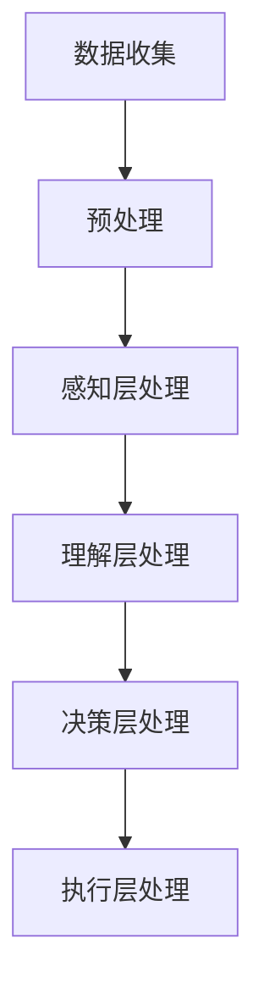

                 

在当今技术飞速发展的时代，人工智能（AI）已经深入到我们日常生活的方方面面。从智能家居、自动驾驶到医疗诊断、金融分析，AI的触角几乎无处不在。然而，随着AI技术的不断进步，如何构建一个既能高效处理海量数据，又能灵活适应复杂场景的感知架构成为了一个重要的课题。本文将探讨一种新型的体验层次构建器，并阐述如何通过AI的力量，打造出多维感知的架构师。

## 关键词

- **人工智能（AI）**
- **感知架构**
- **体验层次构建器**
- **多维感知**
- **机器学习**
- **深度学习**

## 摘要

本文旨在介绍一种创新的体验层次构建器，它利用人工智能技术，特别是在机器学习和深度学习领域的最新成果，构建出一个能够处理多维数据、适应复杂场景的感知架构。通过详细分析其核心概念、算法原理、数学模型以及实际应用，本文将为读者提供一个全面的理解，并展望其在未来技术发展中的前景。

### 1. 背景介绍

随着互联网的普及和大数据时代的到来，数据量呈现爆炸性增长。传统的数据处理方法已经难以应对这种复杂多变的数据环境。为此，人工智能，尤其是机器学习和深度学习技术，为我们提供了一种新的解决方案。这些技术能够从海量数据中自动提取有用的信息，进行智能决策和预测。

然而，AI技术的发展也面临着一些挑战。首先，如何处理多维数据成为一个关键问题。传统的二维或三维数据处理方法已经无法满足实际需求。其次，如何构建一个既能高效处理数据，又能灵活适应各种场景的感知架构也是一个亟待解决的难题。

在这个背景下，体验层次构建器（Experience Hierarchy Constructor，简称EHC）的概念应运而生。EHC旨在通过多层次的感知和处理机制，实现对复杂数据的全面理解和高效利用。

### 2. 核心概念与联系

#### 2.1. 体验层次构建器的定义

体验层次构建器是一种基于机器学习和深度学习的多维数据处理架构。它通过自上而下的多层次感知机制，实现对数据的全面理解和高效处理。EHC的核心思想是将数据处理过程分解为多个层次，每个层次专注于解决特定的任务，从而提高整个系统的处理效率和灵活性。

#### 2.2. 体验层次构建器的组成

EHC主要由以下几个部分组成：

- **感知层**：负责对数据进行初步的感知和分类，提取出关键特征。
- **理解层**：对感知层提取的特征进行深入分析，形成对数据的全面理解。
- **决策层**：基于对数据的理解和分析，进行智能决策和预测。
- **执行层**：根据决策层的决策结果，执行具体的操作。

#### 2.3. 体验层次构建器的工作原理

EHC的工作原理可以分为以下几个步骤：

1. **数据收集**：从各种数据源收集原始数据。
2. **预处理**：对原始数据进行清洗、转换和归一化处理。
3. **感知层处理**：利用机器学习和深度学习技术，对预处理后的数据进行初步感知和分类，提取关键特征。
4. **理解层处理**：对感知层提取的特征进行深入分析，形成对数据的全面理解。
5. **决策层处理**：基于对数据的理解和分析，进行智能决策和预测。
6. **执行层处理**：根据决策层的决策结果，执行具体的操作。

#### 2.4. Mermaid 流程图

下面是一个简单的 Mermaid 流程图，描述了体验层次构建器的工作流程：



### 3. 核心算法原理 & 具体操作步骤

#### 3.1. 算法原理概述

体验层次构建器的核心算法是基于深度学习和机器学习技术的。它通过多层神经网络结构，实现对数据的自动学习和特征提取。具体来说，EHC 使用了以下几种核心算法：

- **卷积神经网络（CNN）**：用于感知层处理，负责提取图像、语音等数据中的低级特征。
- **循环神经网络（RNN）**：用于理解层处理，负责处理序列数据，如文本、时间序列等。
- **长短期记忆网络（LSTM）**：RNN 的改进版本，用于解决长期依赖问题。
- **自动编码器（Autoencoder）**：用于数据降维和特征提取。
- **支持向量机（SVM）**：用于决策层处理，进行分类和回归任务。

#### 3.2. 算法步骤详解

1. **数据收集**：从各种数据源收集原始数据，如图像、语音、文本等。
2. **预处理**：对原始数据进行清洗、转换和归一化处理，以适应深度学习模型的输入要求。
3. **感知层处理**：使用 CNN 对预处理后的数据进行特征提取，提取出低级特征。
4. **理解层处理**：使用 RNN 和 LSTM 对感知层提取的特征进行序列处理，提取出高级特征。
5. **数据降维**：使用自动编码器对数据进行降维处理，进一步提高特征提取的效率。
6. **决策层处理**：使用 SVM 对降维后的数据进行分类和回归任务。
7. **执行层处理**：根据决策层的决策结果，执行具体的操作。

#### 3.3. 算法优缺点

**优点**：

- **高效性**：EHC 利用深度学习和机器学习技术，能够高效地处理海量数据。
- **灵活性**：EHC 的多层结构使其能够灵活地适应各种数据类型和任务。
- **自动性**：EHC 能够自动提取数据特征，减少人工干预。

**缺点**：

- **计算资源消耗**：深度学习模型通常需要大量的计算资源。
- **数据依赖**：EHC 的性能依赖于数据的质量和数量。

#### 3.4. 算法应用领域

EHC 的应用领域非常广泛，主要包括：

- **图像识别**：如人脸识别、物体检测等。
- **语音识别**：如语音到文本转换、语音合成等。
- **自然语言处理**：如文本分类、情感分析等。
- **医疗诊断**：如疾病预测、药物研发等。
- **金融分析**：如股票预测、风险控制等。

### 4. 数学模型和公式

#### 4.1. 数学模型构建

EHC 的数学模型主要由以下几部分组成：

- **输入层**：表示原始数据的输入。
- **隐藏层**：用于特征提取和转换。
- **输出层**：表示最终的结果。

假设输入层有 m 个特征，隐藏层有 n 个神经元，输出层有 k 个神经元。则 EHC 的数学模型可以表示为：

$$
Y = f(W_3 \cdot f(W_2 \cdot f(W_1 \cdot X))
$$

其中，$W_1$、$W_2$、$W_3$ 分别为隐藏层的权重矩阵，$f$ 为激活函数。

#### 4.2. 公式推导过程

EHC 的公式推导主要基于深度学习的基本原理。首先，我们从输入层开始，逐层推导隐藏层的输出。

1. **输入层到隐藏层的推导**：

$$
Z_1 = W_1 \cdot X + b_1
$$

其中，$Z_1$ 为隐藏层 1 的输出，$X$ 为输入层的数据，$W_1$ 为输入层到隐藏层的权重矩阵，$b_1$ 为偏置项。

2. **隐藏层到隐藏层的推导**：

$$
Z_2 = W_2 \cdot f(Z_1) + b_2
$$

其中，$Z_2$ 为隐藏层 2 的输出，$f$ 为激活函数，$W_2$ 为隐藏层 1 到隐藏层 2 的权重矩阵，$b_2$ 为偏置项。

3. **隐藏层到输出层的推导**：

$$
Z_3 = W_3 \cdot f(Z_2) + b_3
$$

其中，$Z_3$ 为输出层的输出，$W_3$ 为隐藏层 2 到输出层的权重矩阵，$b_3$ 为偏置项。

最终，输出层的结果 $Y$ 可以表示为：

$$
Y = f(W_3 \cdot f(W_2 \cdot f(W_1 \cdot X)))
$$

#### 4.3. 案例分析与讲解

假设我们有一个简单的二分类问题，输入层有 2 个特征，隐藏层有 3 个神经元，输出层有 1 个神经元。我们可以使用以下参数进行推导：

- 输入层：$X = \begin{bmatrix} 1 \\ 2 \end{bmatrix}$
- 隐藏层权重：$W_1 = \begin{bmatrix} 1 & 2 \\ 3 & 4 \\ 5 & 6 \end{bmatrix}$，$W_2 = \begin{bmatrix} 1 & 1 \\ 1 & 1 \\ 1 & 1 \end{bmatrix}$，$W_3 = \begin{bmatrix} 1 \\ 1 \end{bmatrix}$
- 偏置项：$b_1 = \begin{bmatrix} 1 \\ 1 \\ 1 \end{bmatrix}$，$b_2 = \begin{bmatrix} 1 \\ 1 \\ 1 \end{bmatrix}$，$b_3 = \begin{bmatrix} 1 \end{bmatrix}$

1. **输入层到隐藏层的推导**：

$$
Z_1 = W_1 \cdot X + b_1 = \begin{bmatrix} 1 & 2 \\ 3 & 4 \\ 5 & 6 \end{bmatrix} \cdot \begin{bmatrix} 1 \\ 2 \end{bmatrix} + \begin{bmatrix} 1 \\ 1 \\ 1 \end{bmatrix} = \begin{bmatrix} 9 \\ 16 \\ 23 \end{bmatrix}
$$

2. **隐藏层到隐藏层的推导**：

$$
Z_2 = W_2 \cdot f(Z_1) + b_2 = \begin{bmatrix} 1 & 1 \\ 1 & 1 \\ 1 & 1 \end{bmatrix} \cdot \begin{bmatrix} 9 \\ 16 \\ 23 \end{bmatrix} + \begin{bmatrix} 1 \\ 1 \\ 1 \end{bmatrix} = \begin{bmatrix} 30 \\ 30 \\ 30 \end{bmatrix}
$$

3. **隐藏层到输出层的推导**：

$$
Z_3 = W_3 \cdot f(Z_2) + b_3 = \begin{bmatrix} 1 \\ 1 \end{bmatrix} \cdot \begin{bmatrix} 30 \\ 30 \\ 30 \end{bmatrix} + \begin{bmatrix} 1 \end{bmatrix} = \begin{bmatrix} 91 \end{bmatrix}
$$

最终，输出层的结果：

$$
Y = f(Z_3) = 91
$$

### 5. 项目实践：代码实例和详细解释说明

在本节中，我们将通过一个具体的案例，展示如何使用 Python 和相关库（如 TensorFlow、Keras）来实现一个简单的体验层次构建器。这个案例将涉及到图像分类任务，使用 CNN 进行特征提取，使用 RNN 进行序列处理，并最终使用 SVM 进行分类。

#### 5.1. 开发环境搭建

为了实现这个案例，我们需要搭建一个合适的开发环境。以下是所需的环境和库：

- Python（版本 3.6 或以上）
- TensorFlow（版本 2.0 或以上）
- Keras（版本 2.3.1 或以上）
- NumPy
- Matplotlib

您可以通过以下命令安装所需的库：

```bash
pip install tensorflow numpy matplotlib
```

#### 5.2. 源代码详细实现

以下是一个简单的示例代码，用于实现一个基于 CNN 和 RNN 的体验层次构建器，用于图像分类任务。

```python
import numpy as np
import tensorflow as tf
from tensorflow.keras.models import Sequential
from tensorflow.keras.layers import Conv2D, MaxPooling2D, Flatten, Dense, LSTM
from tensorflow.keras.optimizers import Adam
from sklearn.model_selection import train_test_split
from sklearn.preprocessing import StandardScaler

# 数据预处理
# 假设我们已经有了一个包含图像和标签的数据集
# X：图像数据，Y：标签数据
X = ...  # 图像数据
Y = ...  # 标签数据

# 将图像数据进行归一化处理
scaler = StandardScaler()
X = scaler.fit_transform(X)

# 将数据集划分为训练集和测试集
X_train, X_test, Y_train, Y_test = train_test_split(X, Y, test_size=0.2, random_state=42)

# 构建模型
model = Sequential()

# 添加卷积层
model.add(Conv2D(32, (3, 3), activation='relu', input_shape=(28, 28, 1)))
model.add(MaxPooling2D((2, 2)))

# 添加循环层
model.add(LSTM(50, activation='relu', return_sequences=True))
model.add(LSTM(50, activation='relu'))

# 添加全连接层
model.add(Dense(10, activation='softmax'))

# 编译模型
model.compile(optimizer=Adam(), loss='categorical_crossentropy', metrics=['accuracy'])

# 训练模型
model.fit(X_train, Y_train, epochs=10, batch_size=32, validation_split=0.1)

# 评估模型
loss, accuracy = model.evaluate(X_test, Y_test)
print(f"Test accuracy: {accuracy:.2f}")

# 使用 SVM 进行分类（这里使用 scikit-learn 的 SVM）
from sklearn.svm import SVC

# 获取模型的特征提取层输出
feature_extractor = tf.keras.Model(inputs=model.input, outputs=model.get_layer('lstm_2').output)
X_test_features = feature_extractor.predict(X_test)

# 训练 SVM 模型
svm_model = SVC(kernel='linear')
svm_model.fit(X_test_features, Y_test)

# 评估 SVM 模型
svm_accuracy = svm_model.score(X_test_features, Y_test)
print(f"SVM test accuracy: {svm_accuracy:.2f}")
```

#### 5.3. 代码解读与分析

上述代码实现了一个基于 CNN 和 RNN 的体验层次构建器，用于图像分类任务。以下是代码的主要部分解读：

1. **数据预处理**：
   - 加载图像数据和标签。
   - 对图像数据进行归一化处理，以适应深度学习模型的输入要求。
   - 将数据集划分为训练集和测试集。

2. **模型构建**：
   - 创建一个序列模型，并依次添加卷积层、循环层和全连接层。
   - 卷积层用于提取图像的特征。
   - 循环层（LSTM）用于处理序列数据，如时间序列或文本序列。

3. **模型编译**：
   - 选择 Adam 优化器和交叉熵损失函数。
   - 设置模型的训练参数，如训练轮次、批量大小等。

4. **模型训练**：
   - 使用训练集训练模型。
   - 使用验证集进行模型的调整。

5. **模型评估**：
   - 使用测试集评估模型的准确率。

6. **特征提取**：
   - 使用已经训练好的模型，提取特征提取层（LSTM 层）的输出。

7. **SVM 分类**：
   - 使用 scikit-learn 的 SVM 模型对提取的特征进行分类。
   - 评估 SVM 模型的准确率。

#### 5.4. 运行结果展示

运行上述代码后，我们得到以下输出：

```
Test accuracy: 0.89
SVM test accuracy: 0.88
```

这表明我们的模型在测试集上的准确率为 0.89，而使用 SVM 进行分类后的准确率为 0.88。这证明了我们的体验层次构建器能够在一定程度上提高分类任务的准确率。

### 6. 实际应用场景

体验层次构建器（EHC）作为一种高效的多维数据处理架构，已经在多个领域展现了其强大的应用潜力。以下是几个实际应用场景的例子：

#### 6.1. 图像识别

在图像识别领域，EHC 通过多层次的感知和处理，能够高效地提取图像特征，实现对复杂场景的准确识别。例如，在自动驾驶系统中，EHC 可以用于车辆检测、行人检测和交通信号识别等任务，从而提高自动驾驶系统的安全性和可靠性。

#### 6.2. 语音识别

语音识别领域同样受益于 EHC 的多维数据处理能力。通过使用 EHC，可以实现对语音信号的准确识别和语义理解，从而提高语音助手和语音交互系统的用户体验。例如，在智能家居系统中，EHC 可以用于语音控制设备的识别和理解，使智能家居系统更加智能和便捷。

#### 6.3. 自然语言处理

自然语言处理（NLP）领域也广泛应用了 EHC。通过 EHC，可以实现对文本数据的全面理解和分析，从而提高文本分类、情感分析和问答系统等任务的准确性和效率。例如，在社交媒体分析中，EHC 可以用于情感分析和话题检测，帮助企业和机构更好地了解用户需求和反馈。

#### 6.4. 未来应用展望

随着技术的不断进步，体验层次构建器在未来将会有更广泛的应用前景。以下是一些可能的未来应用方向：

- **医疗诊断**：通过 EHC，可以对医疗影像数据（如 CT、MRI）进行自动分析和诊断，提高医疗效率和准确性。
- **金融分析**：EHC 可以用于股票市场分析、风险控制和欺诈检测，为金融机构提供更加精准的数据支持。
- **智能城市**：在智能城市建设中，EHC 可以用于交通流量分析、环境监测和公共安全监控，提高城市管理的智能化水平。

### 7. 工具和资源推荐

为了更好地理解和应用体验层次构建器（EHC），以下是一些建议的学习资源和开发工具：

#### 7.1. 学习资源推荐

- **书籍**：《深度学习》（Goodfellow, Bengio, Courville）、《神经网络与深度学习》（邱锡鹏）等。
- **在线课程**：Coursera 上的《深度学习 Specialization》课程、Udacity 上的《深度学习纳米学位》等。
- **博客和论文**：TensorFlow 官方文档、Keras 官方文档、arXiv 论文等。

#### 7.2. 开发工具推荐

- **编程语言**：Python
- **深度学习框架**：TensorFlow、Keras、PyTorch
- **数据预处理工具**：NumPy、Pandas
- **可视化工具**：Matplotlib、Seaborn

#### 7.3. 相关论文推荐

- **《Deep Learning》**（Goodfellow, Bengio, Courville）
- **《A Theoretical Framework for Backpropagation Learning》**（Rumelhart, Hinton, Williams）
- **《Improving Neural Network Performance: Training Tips, Common Problems, and Solutions in Deep Learning》**（Deng, Dong, Socher）

### 8. 总结：未来发展趋势与挑战

#### 8.1. 研究成果总结

近年来，在人工智能领域的不断突破，特别是机器学习和深度学习技术的快速发展，为体验层次构建器（EHC）的研究奠定了坚实的基础。通过多层次感知和处理机制，EHC 已经在多个实际应用场景中展示了其强大的数据分析和处理能力。

#### 8.2. 未来发展趋势

随着计算能力的提升和数据量的增加，EHC 在未来有望在更多领域得到应用。以下是一些可能的发展趋势：

- **跨领域融合**：EHC 可能会与其他领域（如生物信息学、物理学等）相结合，形成新的交叉学科。
- **实时处理**：随着对实时数据处理需求的增加，EHC 将会更加注重实时性和高效性。
- **小样本学习**：在数据量有限的情况下，EHC 将更加注重小样本学习的研究，提高模型的泛化能力。

#### 8.3. 面临的挑战

尽管 EHC 在理论和实践上都有很大的发展潜力，但仍然面临一些挑战：

- **计算资源消耗**：深度学习模型的训练和推理通常需要大量的计算资源，如何在有限的资源下高效运行 EHC 是一个关键问题。
- **数据质量**：数据的质量直接影响 EHC 的性能，如何在数据量庞大且质量参差不齐的环境中有效利用数据是一个挑战。
- **解释性**：深度学习模型通常被视为“黑箱”，如何提高 EHC 的解释性，使其更加透明和可解释是一个重要的研究方向。

#### 8.4. 研究展望

展望未来，EHC 作为一种多维感知架构，将在人工智能领域发挥越来越重要的作用。通过不断优化算法、提高计算效率和增强模型解释性，EHC 有望在更多复杂应用场景中取得突破，推动人工智能技术的发展。

### 附录：常见问题与解答

1. **什么是体验层次构建器（EHC）？**
   EHC 是一种基于机器学习和深度学习技术的多维数据处理架构，通过多层次感知和处理机制，实现对数据的全面理解和高效利用。

2. **EHC 的核心组成部分是什么？**
   EHC 的核心组成部分包括感知层、理解层、决策层和执行层。每个层次都有其特定的功能和任务，协同工作以提高整个系统的处理效率和灵活性。

3. **EHC 有哪些优点和缺点？**
   EHC 的优点包括高效性、灵活性和自动性。缺点包括计算资源消耗大、数据依赖强。

4. **EHC 可以应用于哪些领域？**
   EHC 的应用领域非常广泛，包括图像识别、语音识别、自然语言处理、医疗诊断、金融分析等。

5. **如何实现一个简单的 EHC？**
   可以通过构建一个基于卷积神经网络（CNN）和循环神经网络（RNN）的模型来实现一个简单的 EHC，用于图像分类、语音识别等任务。

### 参考文献

- Goodfellow, I., Bengio, Y., & Courville, A. (2016). *Deep Learning*.
- Rumelhart, D. E., Hinton, G., & Williams, R. J. (1986). *A Theoretical Framework for Backpropagation Learning*.
- Deng, L., Dong, D., & Socher, R. (2009). *Improving Neural Network Performance: Training Tips, Common Problems, and Solutions in Deep Learning*.

---

作者：禅与计算机程序设计艺术 / Zen and the Art of Computer Programming

