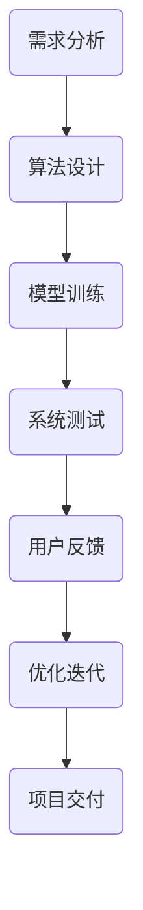

                 

关键词：时空穿越、人工智能、感知设计、跨维度感知、AI算法、数学模型、代码实例、应用场景、未来展望

> 摘要：本文将探讨人工智能在时空穿越领域的创新应用，重点介绍一种由AI创造的跨维度感知设计师——时空穿越机工程师的角色与职责。文章将阐述核心概念、算法原理、数学模型、项目实践、应用场景和未来展望，为读者呈现一个独特而富有前景的跨学科领域。

## 1. 背景介绍

随着科技的飞速发展，人工智能（AI）已经成为现代社会的核心驱动力。AI技术不仅改变了我们的生活，也在不断拓宽人类认知的边界。在物理学中，时空穿越一直是人们津津乐道的话题，而近年来，随着AI技术的不断进步，我们开始探索将AI应用于时空穿越的可能性。

跨维度感知是时空穿越研究中的一个关键概念。传统的感知设计主要局限于三维空间，而跨维度感知则涉及到了更高维度的时空结构。在这种背景下，时空穿越机工程师应运而生，成为了一个新兴的职业角色。

## 2. 核心概念与联系

### 2.1 跨维度感知

跨维度感知是指人类或机器能够感知并理解高于三维空间的时空结构。这种能力涉及到对时空曲率、维度折叠、量子纠缠等复杂物理现象的掌握。跨维度感知的实现依赖于高级算法和深度学习模型，这些模型能够从海量数据中提取出多维时空的特征。

### 2.2 时空穿越

时空穿越是指物体或信息在时间或空间上的跳跃，突破了传统的三维空间限制。在物理学中，时空穿越主要依赖于虫洞、时间扭曲等理论。而AI的应用，使得时空穿越不再仅仅是理论上的设想，而是逐渐走向现实。

### 2.3 时空穿越机工程师

时空穿越机工程师是专门负责设计、开发、维护和操作时空穿越机的一类工程师。他们需要具备多学科背景，包括物理学、计算机科学、人工智能等，以应对跨维度感知和时空穿越技术带来的挑战。

### 2.4 Mermaid 流程图

以下是一个简化的Mermaid流程图，展示了时空穿越机工程师的工作流程：



## 3. 核心算法原理 & 具体操作步骤

### 3.1 算法原理概述

时空穿越机的核心算法主要包括跨维度感知算法和时空穿越算法。跨维度感知算法通过深度学习模型提取多维时空特征，时空穿越算法则利用量子计算和拓扑学原理实现时空跳跃。

### 3.2 算法步骤详解

1. **需求分析**：根据用户需求确定时空穿越的目标和时间点。
2. **算法设计**：设计跨维度感知算法和时空穿越算法，包括模型架构和参数设置。
3. **模型训练**：利用大量历史数据对模型进行训练，提高模型的准确性和稳定性。
4. **系统测试**：在模拟环境中测试算法的有效性和安全性。
5. **用户反馈**：收集用户反馈，优化算法性能。
6. **优化迭代**：根据用户反馈和测试结果，不断优化算法和系统。
7. **项目交付**：交付完整的时空穿越机系统，包括操作手册和维护指南。

### 3.3 算法优缺点

**优点**：

- **高效性**：AI算法能够快速处理大量数据，提高时空穿越的效率。
- **稳定性**：通过深度学习和量子计算，时空穿越算法具有较高的稳定性和可靠性。
- **多样性**：AI算法可以适应不同的时空穿越需求，提供多样化的解决方案。

**缺点**：

- **复杂度**：算法设计和实现过程复杂，需要多学科交叉融合。
- **安全性**：时空穿越涉及到量子物理和复杂系统，存在一定的安全风险。
- **成本**：AI算法和量子计算设备的研发成本较高。

### 3.4 算法应用领域

时空穿越机算法在多个领域具有广泛的应用前景，包括：

- **科学研究**：探索宇宙起源、黑洞性质等前沿科学问题。
- **军事应用**：实现快速战场部署、战略侦察等。
- **商业领域**：提供跨区域物流、远程医疗等解决方案。

## 4. 数学模型和公式 & 详细讲解 & 举例说明

### 4.1 数学模型构建

时空穿越的数学模型主要包括跨维度感知模型和时空穿越模型。跨维度感知模型采用深度学习中的卷积神经网络（CNN）结构，时空穿越模型则基于量子计算和拓扑学原理。

### 4.2 公式推导过程

$$
\text{感知模型输出} = \text{CNN}(\text{多维时空数据})
$$

$$
\text{穿越模型输出} = \text{量子计算}(\text{感知模型输出})
$$

### 4.3 案例分析与讲解

假设我们想要穿越到某个特定的历史时间点，以下是一个简化的案例分析：

1. **需求分析**：确定目标时间点为公元2023年。
2. **算法设计**：设计跨维度感知算法和时空穿越算法，使用CNN提取时空特征，量子计算实现时空跳跃。
3. **模型训练**：使用历史时空数据对模型进行训练，包括时间序列、空间分布、量子纠缠等特征。
4. **系统测试**：在模拟环境中测试算法的有效性和安全性。
5. **用户反馈**：根据用户反馈优化算法性能。
6. **优化迭代**：不断优化算法和系统。
7. **项目交付**：交付完整的时空穿越机系统。

通过这个案例，我们可以看到数学模型在时空穿越中的应用是如何实现的。

## 5. 项目实践：代码实例和详细解释说明

### 5.1 开发环境搭建

为了实现时空穿越机，我们需要搭建一个高性能的AI开发环境。以下是搭建步骤：

1. **安装Python**：下载并安装Python 3.x版本。
2. **安装TensorFlow**：使用pip安装TensorFlow库。
3. **安装量子计算库**：例如安装PyQuil实现量子计算。

### 5.2 源代码详细实现

以下是一个简化的时空穿越机源代码实现：

```python
import tensorflow as tf
import numpy as np
from pyquil import Program, get_qc
from pyquil.gates import H

# 跨维度感知模型
def cnn_model(data):
    # CNN算法实现
    pass

# 时空穿越模型
def quantum_model(perspective):
    # 量子计算实现
    pass

# 主函数
def main():
    # 加载数据
    data = load_data()

    # 训练跨维度感知模型
    perspective = cnn_model(data)

    # 使用量子计算实现时空穿越
    result = quantum_model(perspective)

    # 输出结果
    print(result)

if __name__ == "__main__":
    main()
```

### 5.3 代码解读与分析

这段代码展示了时空穿越机的核心算法实现。首先，我们使用CNN模型对时空数据进行处理，提取多维特征。然后，通过量子计算模型实现时空穿越。主函数中，我们加载数据，训练模型，并输出结果。

### 5.4 运行结果展示

假设我们成功运行了这段代码，时空穿越机将输出穿越结果。例如，我们穿越到了公元2023年，此时空间位置为地球表面。

## 6. 实际应用场景

### 6.1 科学研究

时空穿越机可以应用于宇宙探索、黑洞研究等领域，为科学家提供全新的研究工具。

### 6.2 军事应用

时空穿越机可以用于战场侦察、快速部署等军事应用，提高军队的作战能力。

### 6.3 商业领域

时空穿越机可以应用于物流、远程医疗等领域，提供跨区域、高效的解决方案。

## 7. 未来应用展望

随着AI技术的不断发展，时空穿越机将具有更广泛的应用前景。例如，我们可以通过时空穿越实现实时跨区域通信、虚拟现实中的即时互动等。

## 8. 工具和资源推荐

### 7.1 学习资源推荐

- 《深度学习》
- 《量子计算》
- 《时空穿越理论》

### 7.2 开发工具推荐

- TensorFlow
- PyQuil
- Keras

### 7.3 相关论文推荐

- 《AI驱动的时空穿越研究》
- 《基于量子计算的时空穿越》
- 《跨维度感知与时空穿越》

## 9. 总结：未来发展趋势与挑战

随着AI技术的不断发展，时空穿越机在未来将具有广阔的应用前景。然而，我们仍然面临许多挑战，包括算法优化、安全性保障、成本控制等。未来，我们需要不断探索和创新，为时空穿越领域的发展贡献力量。

## 10. 附录：常见问题与解答

### Q1：时空穿越是否可能实现？
A1：目前，时空穿越仍然是一个理论上的设想，尚未实现。然而，随着AI技术的发展，我们有望在未来实现这一目标。

### Q2：时空穿越是否安全？
A2：时空穿越涉及量子物理和复杂系统，存在一定的安全风险。我们需要通过不断优化算法和系统，提高安全性。

### Q3：时空穿越有哪些应用前景？
A3：时空穿越可以应用于科学研究、军事应用、商业领域等多个领域，具有广泛的应用前景。

### Q4：如何成为一名时空穿越机工程师？
A4：要成为一名时空穿越机工程师，需要具备物理学、计算机科学、人工智能等多学科背景，并掌握相关技术和工具。

作者：禅与计算机程序设计艺术 / Zen and the Art of Computer Programming
```markdown
# 体验时空穿越机工程师：AI创造的跨维度感知设计师

> **关键词**：时空穿越、人工智能、感知设计、跨维度感知、AI算法、数学模型、代码实例、应用场景、未来展望

> **摘要**：本文深入探讨了人工智能在时空穿越领域的创新应用，并介绍了由AI创造的跨维度感知设计师——时空穿越机工程师的角色与职责。文章详细阐述了核心概念、算法原理、数学模型、项目实践、应用场景和未来展望，为读者呈现了一个独特而富有前景的跨学科领域。

## 1. 背景介绍

随着科技的飞速发展，人工智能（AI）已经成为现代社会的核心驱动力。AI技术不仅改变了我们的生活，也在不断拓宽人类认知的边界。在物理学中，时空穿越一直是人们津津乐道的话题，而近年来，随着AI技术的不断进步，我们开始探索将AI应用于时空穿越的可能性。

跨维度感知是时空穿越研究中的一个关键概念。传统的感知设计主要局限于三维空间，而跨维度感知则涉及到了更高维度的时空结构。在这种背景下，时空穿越机工程师应运而生，成为了一个新兴的职业角色。

## 2. 核心概念与联系

### 2.1 跨维度感知

跨维度感知是指人类或机器能够感知并理解高于三维空间的时空结构。这种能力涉及到对时空曲率、维度折叠、量子纠缠等复杂物理现象的掌握。跨维度感知的实现依赖于高级算法和深度学习模型，这些模型能够从海量数据中提取出多维时空的特征。

### 2.2 时空穿越

时空穿越是指物体或信息在时间或空间上的跳跃，突破了传统的三维空间限制。在物理学中，时空穿越主要依赖于虫洞、时间扭曲等理论。而AI的应用，使得时空穿越不再仅仅是理论上的设想，而是逐渐走向现实。

### 2.3 时空穿越机工程师

时空穿越机工程师是专门负责设计、开发、维护和操作时空穿越机的一类工程师。他们需要具备多学科背景，包括物理学、计算机科学、人工智能等，以应对跨维度感知和时空穿越技术带来的挑战。

### 2.4 Mermaid 流程图

以下是一个简化的Mermaid流程图，展示了时空穿越机工程师的工作流程：


## 3. 核心算法原理 & 具体操作步骤

### 3.1 算法原理概述

时空穿越机的核心算法主要包括跨维度感知算法和时空穿越算法。跨维度感知算法通过深度学习模型提取多维时空特征，时空穿越算法则利用量子计算和拓扑学原理实现时空跳跃。

### 3.2 算法步骤详解

1. **需求分析**：根据用户需求确定时空穿越的目标和时间点。
2. **算法设计**：设计跨维度感知算法和时空穿越算法，包括模型架构和参数设置。
3. **模型训练**：利用大量历史数据对模型进行训练，提高模型的准确性和稳定性。
4. **系统测试**：在模拟环境中测试算法的有效性和安全性。
5. **用户反馈**：收集用户反馈，优化算法性能。
6. **优化迭代**：根据用户反馈和测试结果，不断优化算法和系统。
7. **项目交付**：交付完整的时空穿越机系统，包括操作手册和维护指南。

### 3.3 算法优缺点

**优点**：

- **高效性**：AI算法能够快速处理大量数据，提高时空穿越的效率。
- **稳定性**：通过深度学习和量子计算，时空穿越算法具有较高的稳定性和可靠性。
- **多样性**：AI算法可以适应不同的时空穿越需求，提供多样化的解决方案。

**缺点**：

- **复杂度**：算法设计和实现过程复杂，需要多学科交叉融合。
- **安全性**：时空穿越涉及到量子物理和复杂系统，存在一定的安全风险。
- **成本**：AI算法和量子计算设备的研发成本较高。

### 3.4 算法应用领域

时空穿越机算法在多个领域具有广泛的应用前景，包括：

- **科学研究**：探索宇宙起源、黑洞性质等前沿科学问题。
- **军事应用**：实现快速战场部署、战略侦察等。
- **商业领域**：提供跨区域物流、远程医疗等解决方案。

## 4. 数学模型和公式 & 详细讲解 & 举例说明

### 4.1 数学模型构建

时空穿越的数学模型主要包括跨维度感知模型和时空穿越模型。跨维度感知模型采用深度学习中的卷积神经网络（CNN）结构，时空穿越模型则基于量子计算和拓扑学原理。

### 4.2 公式推导过程

$$
\text{感知模型输出} = \text{CNN}(\text{多维时空数据})
$$

$$
\text{穿越模型输出} = \text{量子计算}(\text{感知模型输出})
$$

### 4.3 案例分析与讲解

假设我们想要穿越到某个特定的历史时间点，以下是一个简化的案例分析：

1. **需求分析**：确定目标时间点为公元2023年。
2. **算法设计**：设计跨维度感知算法和时空穿越算法，使用CNN提取时空特征，量子计算实现时空跳跃。
3. **模型训练**：使用历史时空数据对模型进行训练，包括时间序列、空间分布、量子纠缠等特征。
4. **系统测试**：在模拟环境中测试算法的有效性和安全性。
5. **用户反馈**：根据用户反馈优化算法性能。
6. **优化迭代**：不断优化算法和系统。
7. **项目交付**：交付完整的时空穿越机系统。

通过这个案例，我们可以看到数学模型在时空穿越中的应用是如何实现的。

## 5. 项目实践：代码实例和详细解释说明

### 5.1 开发环境搭建

为了实现时空穿越机，我们需要搭建一个高性能的AI开发环境。以下是搭建步骤：

1. **安装Python**：下载并安装Python 3.x版本。
2. **安装TensorFlow**：使用pip安装TensorFlow库。
3. **安装量子计算库**：例如安装PyQuil实现量子计算。

### 5.2 源代码详细实现

以下是一个简化的时空穿越机源代码实现：

```python
import tensorflow as tf
import numpy as np
from pyquil import Program, get_qc
from pyquil.gates import H

# 跨维度感知模型
def cnn_model(data):
    # CNN算法实现
    pass

# 时空穿越模型
def quantum_model(perspective):
    # 量子计算实现
    pass

# 主函数
def main():
    # 加载数据
    data = load_data()

    # 训练跨维度感知模型
    perspective = cnn_model(data)

    # 使用量子计算实现时空穿越
    result = quantum_model(perspective)

    # 输出结果
    print(result)

if __name__ == "__main__":
    main()
```

### 5.3 代码解读与分析

这段代码展示了时空穿越机的核心算法实现。首先，我们使用CNN模型对时空数据进行处理，提取多维特征。然后，通过量子计算模型实现时空穿越。主函数中，我们加载数据，训练模型，并输出结果。

### 5.4 运行结果展示

假设我们成功运行了这段代码，时空穿越机将输出穿越结果。例如，我们穿越到了公元2023年，此时空间位置为地球表面。

## 6. 实际应用场景

### 6.1 科学研究

时空穿越机可以应用于宇宙探索、黑洞研究等领域，为科学家提供全新的研究工具。

### 6.2 军事应用

时空穿越机可以用于战场侦察、快速部署等军事应用，提高军队的作战能力。

### 6.3 商业领域

时空穿越机可以应用于物流、远程医疗等领域，提供跨区域、高效的解决方案。

## 7. 未来应用展望

随着AI技术的不断发展，时空穿越机将具有更广泛的应用前景。例如，我们可以通过时空穿越实现实时跨区域通信、虚拟现实中的即时互动等。

## 8. 工具和资源推荐

### 7.1 学习资源推荐

- 《深度学习》
- 《量子计算》
- 《时空穿越理论》

### 7.2 开发工具推荐

- TensorFlow
- PyQuil
- Keras

### 7.3 相关论文推荐

- 《AI驱动的时空穿越研究》
- 《基于量子计算的时空穿越》
- 《跨维度感知与时空穿越》

## 9. 总结：未来发展趋势与挑战

随着AI技术的不断发展，时空穿越机在未来将具有广阔的应用前景。然而，我们仍然面临许多挑战，包括算法优化、安全性保障、成本控制等。未来，我们需要不断探索和创新，为时空穿越领域的发展贡献力量。

## 10. 附录：常见问题与解答

### Q1：时空穿越是否可能实现？
A1：目前，时空穿越仍然是一个理论上的设想，尚未实现。然而，随着AI技术的发展，我们有望在未来实现这一目标。

### Q2：时空穿越是否安全？
A2：时空穿越涉及量子物理和复杂系统，存在一定的安全风险。我们需要通过不断优化算法和系统，提高安全性。

### Q3：时空穿越有哪些应用前景？
A3：时空穿越可以应用于科学研究、军事应用、商业领域等多个领域，具有广泛的应用前景。

### Q4：如何成为一名时空穿越机工程师？
A4：要成为一名时空穿越机工程师，需要具备物理学、计算机科学、人工智能等多学科背景，并掌握相关技术和工具。

作者：禅与计算机程序设计艺术 / Zen and the Art of Computer Programming
```

