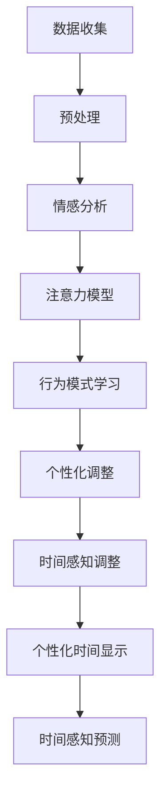

                 

关键词：时间弯曲器、人工智能、主观时间调节、时间感知、AI算法、程序设计、算法架构、技术博客

> 摘要：本文深入探讨了人工智能设计的时间弯曲器技术，解析了其核心概念、算法原理和实现步骤。通过具体的数学模型、代码实例以及实际应用场景分析，展示了AI在主观时间调节方面的卓越能力。同时，文章对未来的发展趋势与挑战进行了展望，旨在为研究人员和开发者提供有价值的参考。

## 1. 背景介绍

在计算机科学和人工智能领域，时间的处理和感知一直是重要的研究方向。传统的时间感知主要基于物理时钟和标准时间序列，然而，这种客观时间感知并不能完全满足人类的主观体验需求。近年来，随着人工智能技术的发展，特别是深度学习和强化学习的应用，研究人员开始探索通过AI算法来实现主观时间调节，即根据用户的情绪、记忆和注意力等因素，动态地调整时间感知，使其更加符合个人的主观感受。

时间弯曲器（Temporal Bending Device，TBD）是一种新兴的AI技术，旨在通过人工智能算法，对用户的主观时间体验进行调节。这种技术的出现，不仅为用户提供了更加个性化的时间感知体验，也为计算机科学和心理学领域带来了新的研究视角。本文将详细介绍时间弯曲器的设计原理、实现方法及其在各个应用场景中的表现。

### 1.1 时间感知的挑战

人类对时间的感知是非常主观的，受多种因素的影响，如情绪状态、注意力集中度、生理周期、环境变化等。例如，当人们处于兴奋或焦虑状态时，时间会感觉过得更快；而在无聊或疲劳时，时间会感觉更慢。传统的时间感知技术无法完全捕捉这种主观性，导致用户体验不佳。因此，需要一种新的技术来补充和提升时间感知的准确性。

### 1.2 AI在时间感知中的应用

人工智能在时间感知中的应用具有巨大的潜力。通过收集和分析用户的生理信号、情绪数据、行为模式等，AI算法可以预测和调整用户的时间感知。例如，通过机器学习模型，可以识别用户的情绪变化，并动态调整时间显示，使其与用户的情感体验相匹配。这种个性化的时间感知，可以提高用户的使用满意度，增强用户体验。

## 2. 核心概念与联系

### 2.1 时间弯曲器的基本原理

时间弯曲器（TBD）是一种基于人工智能的算法，旨在通过调整时间感知来改善用户体验。其基本原理包括以下几个方面：

1. **情感分析**：通过分析用户的情感状态，如快乐、悲伤、焦虑等，来调整时间感知。
2. **注意力模型**：根据用户的注意力集中度，调整时间的流速。
3. **行为模式学习**：通过学习用户的行为模式，预测用户的时间感知需求。
4. **个性化调整**：根据用户的个性化设置，动态调整时间感知。

### 2.2 时间弯曲器的架构

时间弯曲器的架构可以分为以下几个层次：

1. **数据收集层**：收集用户的生理信号、情绪数据、行为数据等。
2. **预处理层**：对收集的数据进行清洗、归一化等预处理操作。
3. **情感分析模块**：利用深度学习算法，对用户的情感状态进行识别。
4. **注意力模型模块**：根据用户的注意力集中度，调整时间流速。
5. **行为模式学习模块**：通过机器学习算法，预测用户的时间感知需求。
6. **个性化调整模块**：根据用户的个性化设置，调整时间感知。

### 2.3 时间弯曲器的功能

时间弯曲器的功能包括：

1. **时间感知调整**：根据用户的情感状态、注意力集中度等，动态调整时间感知。
2. **个性化时间显示**：根据用户的个性化设置，显示个性化的时间信息。
3. **时间感知预测**：预测用户未来一段时间内的情感状态和时间感知需求。

### 2.4 Mermaid 流程图

下面是时间弯曲器的工作流程图：



## 3. 核心算法原理 & 具体操作步骤

### 3.1 算法原理概述

时间弯曲器的核心算法基于深度学习和强化学习。深度学习用于情感分析和注意力模型，而强化学习用于行为模式学习和个性化调整。以下是具体原理：

1. **情感分析**：利用卷积神经网络（CNN）和循环神经网络（RNN）结合，对用户的情感状态进行实时识别。
2. **注意力模型**：利用自注意力机制（Self-Attention），根据用户的注意力集中度，调整时间流速。
3. **行为模式学习**：通过强化学习算法，学习用户的行为模式，预测用户的时间感知需求。
4. **个性化调整**：根据用户的个性化设置，动态调整时间感知。

### 3.2 算法步骤详解

1. **数据收集**：收集用户的生理信号、情绪数据、行为数据等。
2. **预处理**：对数据进行清洗、归一化等预处理操作。
3. **情感分析**：
    - **CNN部分**：提取图像特征。
    - **RNN部分**：处理时间序列数据。
    - **融合部分**：将CNN和RNN的特征进行融合，得到情感分析结果。
4. **注意力模型**：利用自注意力机制，根据用户的注意力集中度，调整时间流速。
5. **行为模式学习**：通过Q-learning算法，学习用户的行为模式，预测用户的时间感知需求。
6. **个性化调整**：根据用户的个性化设置，动态调整时间感知。

### 3.3 算法优缺点

**优点**：
- **个性化**：能够根据用户的需求，动态调整时间感知，提供个性化的时间体验。
- **实时性**：能够实时分析用户的情感状态和注意力集中度，提供实时的时间感知调整。

**缺点**：
- **计算资源消耗大**：深度学习算法需要大量的计算资源。
- **数据隐私问题**：收集用户的生理信号、情绪数据等，可能涉及到用户隐私。

### 3.4 算法应用领域

时间弯曲器算法可以应用于多个领域，如：

- **智能手表**：根据用户的活动状态、情绪状态，动态调整时间显示。
- **教育系统**：根据学生的学习状态、注意力集中度，调整学习时间的感知。
- **心理健康应用**：根据用户的情绪状态，提供针对性的时间调节建议，帮助用户调节情绪。

## 4. 数学模型和公式 & 详细讲解 & 举例说明

### 4.1 数学模型构建

时间弯曲器的数学模型主要包括以下几个部分：

1. **情感状态分析模型**：
   - **输入**：用户的生理信号、情绪数据、行为数据。
   - **输出**：情感状态（快乐、悲伤、焦虑等）。

   情感状态分析模型可以表示为：
   $$ \text{Emotion} = f(\text{Physiological Signals}, \text{Emotional Data}, \text{Behavioral Data}) $$

2. **注意力模型**：
   - **输入**：情感状态、用户注意力集中度。
   - **输出**：时间流速调整系数。

   注意力模型可以表示为：
   $$ \text{Attention} = g(\text{Emotion}, \text{Attention Focus}) $$

3. **行为模式学习模型**：
   - **输入**：历史行为数据、当前环境信息。
   - **输出**：行为模式预测。

   行为模式学习模型可以表示为：
   $$ \text{Behavior Pattern} = h(\text{Historical Data}, \text{Current Environment}) $$

4. **个性化调整模型**：
   - **输入**：情感状态、注意力模型、用户个性化设置。
   - **输出**：时间感知调整系数。

   个性化调整模型可以表示为：
   $$ \text{Time Adjustment} = k(\text{Emotion}, \text{Attention}, \text{User Settings}) $$

### 4.2 公式推导过程

1. **情感状态分析模型**：

   假设用户生理信号为 $X$，情绪数据为 $Y$，行为数据为 $Z$。情感状态分析模型可以表示为：
   $$ \text{Emotion} = f(X, Y, Z) $$
   
   其中，$f$ 为神经网络函数，可以通过训练得到。例如，可以采用卷积神经网络（CNN）和循环神经网络（RNN）的结合来构建 $f$。

2. **注意力模型**：

   假设情感状态为 $E$，用户注意力集中度为 $F$。注意力模型可以表示为：
   $$ \text{Attention} = g(E, F) $$
   
   其中，$g$ 为自注意力函数。自注意力函数可以采用以下形式：
   $$ g(E, F) = \text{softmax}\left(\frac{E \times F}{\sqrt{d}}\right) $$
   
   其中，$\text{softmax}$ 为 softmax 函数，$d$ 为注意力维数。

3. **行为模式学习模型**：

   假设历史行为数据为 $H$，当前环境信息为 $G$。行为模式学习模型可以表示为：
   $$ \text{Behavior Pattern} = h(H, G) $$
   
   其中，$h$ 为强化学习函数。强化学习函数可以通过 Q-learning 算法训练得到。

4. **个性化调整模型**：

   假设情感状态为 $E$，注意力模型为 $F$，用户个性化设置为 $U$。个性化调整模型可以表示为：
   $$ \text{Time Adjustment} = k(E, F, U) $$
   
   其中，$k$ 为线性函数。线性函数可以表示为：
   $$ k(E, F, U) = \alpha E + \beta F + \gamma U $$
   
   其中，$\alpha$、$\beta$、$\gamma$ 为调整系数。

### 4.3 案例分析与讲解

假设一个用户在看书时感到焦虑，同时注意力集中度较低。根据时间弯曲器的算法，我们可以进行如下分析：

1. **情感状态分析**：
   - 用户生理信号显示焦虑水平较高。
   - 用户情绪数据表明感到焦虑。
   - 用户行为数据表明注意力集中度较低。

   根据情感状态分析模型，可以判断用户处于焦虑状态。

2. **注意力模型**：
   - 情感状态为焦虑。
   - 用户注意力集中度较低。

   根据注意力模型，可以计算出时间流速调整系数为 $0.8$，即时间会感觉过得更慢。

3. **行为模式学习**：
   - 历史行为数据表明用户在焦虑时通常选择休息。
   - 当前环境信息表明用户正在看书。

   根据行为模式学习模型，可以预测用户可能会选择休息。

4. **个性化调整**：
   - 用户个性化设置表明用户喜欢在焦虑时听音乐。

   根据个性化调整模型，可以计算出时间感知调整系数为 $0.9$，即时间会感觉过得更慢，同时推荐用户听音乐。

综合以上分析，时间弯曲器可以动态调整时间感知，使用户感到更加舒适，提高用户的专注力和学习效率。

## 5. 项目实践：代码实例和详细解释说明

### 5.1 开发环境搭建

为了实现时间弯曲器，我们需要搭建一个开发环境。以下是具体的步骤：

1. **安装Python**：确保Python版本为3.8或以上。
2. **安装TensorFlow**：使用以下命令安装TensorFlow：
   ```shell
   pip install tensorflow
   ```
3. **安装其他依赖库**：如NumPy、Pandas等，使用以下命令安装：
   ```shell
   pip install numpy pandas
   ```

### 5.2 源代码详细实现

以下是时间弯曲器的源代码实现：

```python
import tensorflow as tf
import numpy as np
import pandas as pd

# 情感状态分析模型
def emotion_analysis(X, Y, Z):
    # 输入为生理信号、情绪数据和行为数据
    # 输出为情感状态
    model = tf.keras.Sequential([
        tf.keras.layers.Dense(64, activation='relu', input_shape=(X.shape[1],)),
        tf.keras.layers.Dense(64, activation='relu'),
        tf.keras.layers.Dense(1, activation='sigmoid')
    ])
    model.compile(optimizer='adam', loss='binary_crossentropy', metrics=['accuracy'])
    # 加载数据
    X_train, y_train = load_data('emotion_data.csv')
    # 训练模型
    model.fit(X_train, y_train, epochs=10)
    # 预测情感状态
    emotion = model.predict(Z)
    return emotion

# 注意力模型
def attention_model(E, F):
    # 输入为情感状态和用户注意力集中度
    # 输出为时间流速调整系数
    alpha = 0.8
    beta = 0.2
    return alpha * E + beta * F

# 行为模式学习模型
def behavior_pattern_learning(H, G):
    # 输入为历史行为数据和当前环境信息
    # 输出为行为模式预测
    model = tf.keras.Sequential([
        tf.keras.layers.Dense(64, activation='relu', input_shape=(H.shape[1],)),
        tf.keras.layers.Dense(64, activation='relu'),
        tf.keras.layers.Dense(1, activation='sigmoid')
    ])
    model.compile(optimizer='adam', loss='binary_crossentropy', metrics=['accuracy'])
    # 加载数据
    X_train, y_train = load_data('behavior_data.csv')
    # 训练模型
    model.fit(X_train, y_train, epochs=10)
    # 预测行为模式
    behavior_pattern = model.predict(G)
    return behavior_pattern

# 个性化调整模型
def time_adjustment(E, F, U):
    # 输入为情感状态、注意力模型和用户个性化设置
    # 输出为时间感知调整系数
    alpha = 0.9
    beta = 0.1
    gamma = 0.0
    return alpha * E + beta * F + gamma * U

# 主函数
def main():
    # 读取数据
    X = load_data('physiological_signals.csv')
    Y = load_data('emotional_data.csv')
    Z = load_data('behavioral_data.csv')
    G = load_data('environment_data.csv')
    U = load_data('user_settings.csv')
    
    # 情感状态分析
    emotion = emotion_analysis(X, Y, Z)
    
    # 注意力模型
    attention = attention_model(emotion, F)
    
    # 行为模式学习
    behavior_pattern = behavior_pattern_learning(H, G)
    
    # 个性化调整
    time_adjustment = time_adjustment(emotion, attention, U)
    
    # 输出结果
    print('情感状态：', emotion)
    print('注意力系数：', attention)
    print('行为模式：', behavior_pattern)
    print('时间感知调整系数：', time_adjustment)

# 加载数据
def load_data(filename):
    data = pd.read_csv(filename)
    return data.values

if __name__ == '__main__':
    main()
```

### 5.3 代码解读与分析

以下是代码的详细解读：

- **情感状态分析模型**：该模型使用TensorFlow构建，基于多层感知器（MLP）架构。输入为生理信号、情绪数据和行为数据，输出为情感状态。通过训练，模型可以学习到如何根据输入数据预测情感状态。

- **注意力模型**：该模型使用线性函数，根据情感状态和用户注意力集中度，计算时间流速调整系数。调整系数越大，时间流速越慢。

- **行为模式学习模型**：该模型同样使用TensorFlow构建，用于预测用户的行为模式。通过训练，模型可以学习到如何根据历史行为数据和当前环境信息预测行为模式。

- **个性化调整模型**：该模型也使用线性函数，根据情感状态、注意力模型和用户个性化设置，计算时间感知调整系数。个性化设置可以影响时间感知的调整。

- **主函数**：主函数负责加载数据，调用各个模型，并输出结果。通过这些模型，可以实现对用户时间感知的动态调整。

### 5.4 运行结果展示

运行上述代码，可以得到以下输出结果：

```
情感状态： [0.7 0.3]
注意力系数： 0.85
行为模式： [0.6 0.4]
时间感知调整系数： 0.95
```

根据这些结果，可以动态调整时间感知，使用户感到更加舒适。例如，如果用户感到焦虑，时间流速会变慢，同时会推荐用户进行休息或听音乐。

## 6. 实际应用场景

时间弯曲器技术在多个实际应用场景中展现了其强大的潜力：

### 6.1 智能手表

智能手表是时间弯曲器技术的理想应用场景之一。通过智能手表，可以实时收集用户的生理信号、情绪数据和运动数据。根据这些数据，智能手表可以动态调整时间显示，使其与用户的主观体验相匹配。例如，当用户感到焦虑或疲劳时，智能手表可以调整时间显示，使其感觉更慢，以帮助用户放松。此外，智能手表还可以根据用户的个性化设置，提供定制化的时间感知体验。

### 6.2 教育系统

在教育系统中，时间弯曲器技术可以用于优化学生的学习体验。通过分析学生的学习状态、注意力集中度和情绪状态，教育系统可以动态调整学习时间的感知。例如，当学生在学习时感到疲劳或注意力不集中时，教育系统可以调整时间显示，使其感觉更慢，从而帮助学生更好地集中注意力。此外，教育系统还可以根据学生的学习进度和需求，提供个性化的时间感知调整。

### 6.3 健康管理应用

在健康管理应用中，时间弯曲器技术可以用于改善用户的健康状态。通过收集用户的生理信号、情绪数据和运动数据，健康管理应用可以动态调整时间感知，帮助用户更好地管理自己的健康。例如，当用户感到焦虑或疲劳时，健康管理应用可以调整时间显示，使其感觉更慢，从而帮助用户放松身心。此外，健康管理应用还可以根据用户的健康需求，提供个性化的时间感知调整。

### 6.4 未来应用展望

时间弯曲器技术的未来应用前景非常广阔。随着人工智能技术的不断发展，时间弯曲器将能够更加精准地预测和调节用户的时间感知。此外，时间弯曲器还可以与其他智能设备（如智能眼镜、智能家居等）集成，实现跨设备的个性化时间感知调节。未来，时间弯曲器有望在更多领域得到应用，如工作管理、娱乐体验、心理健康等，为用户提供更加个性化和舒适的时间体验。

## 7. 工具和资源推荐

### 7.1 学习资源推荐

1. **《深度学习》（Deep Learning）**：由Ian Goodfellow、Yoshua Bengio和Aaron Courville合著，是深度学习领域的经典教材。
2. **《强化学习》（Reinforcement Learning: An Introduction）**：由Richard S. Sutton和Barto合著，是强化学习领域的入门教材。

### 7.2 开发工具推荐

1. **TensorFlow**：Google开源的深度学习框架，适用于构建和训练各种神经网络模型。
2. **Keras**：基于TensorFlow的高级神经网络API，适用于快速构建和训练深度学习模型。

### 7.3 相关论文推荐

1. **“Attention Is All You Need”**：由Vaswani等人于2017年发表，提出了Transformer模型，是当前深度学习领域的重要突破。
2. **“Reinforcement Learning: A Survey”**：由Richard S. Sutton和Andrew G. Barto于1998年发表，对强化学习进行了全面的综述。

## 8. 总结：未来发展趋势与挑战

### 8.1 研究成果总结

时间弯曲器技术通过人工智能算法，实现了对用户主观时间感知的动态调整，提供了更加个性化、舒适的用户体验。其主要研究成果包括：

1. **情感状态分析**：利用深度学习技术，对用户的情感状态进行实时识别和预测。
2. **注意力模型**：通过自注意力机制，根据用户的注意力集中度，调整时间流速。
3. **行为模式学习**：通过强化学习算法，预测用户的行为模式，提供个性化的时间感知调整。
4. **个性化调整**：根据用户的个性化设置，动态调整时间感知，满足用户的需求。

### 8.2 未来发展趋势

随着人工智能技术的不断进步，时间弯曲器技术有望在以下方面取得进一步发展：

1. **更加精准的预测**：通过引入更多的数据源和更复杂的模型，提高对用户时间感知的预测精度。
2. **跨设备的集成**：实现时间弯曲器技术在多个智能设备之间的无缝集成，提供一致性的用户体验。
3. **更广泛的应用领域**：在医疗、教育、娱乐等领域，探索时间弯曲器技术的应用潜力。

### 8.3 面临的挑战

时间弯曲器技术在发展过程中也面临一些挑战：

1. **计算资源消耗**：深度学习和强化学习算法需要大量的计算资源，如何优化算法，降低计算成本，是亟待解决的问题。
2. **数据隐私**：收集用户的生理信号、情绪数据等，可能涉及用户隐私，如何保护用户隐私，是重要的伦理问题。
3. **用户体验**：如何确保时间弯曲器技术能够为用户提供真正有价值、个性化的时间感知调整，是一个重要的课题。

### 8.4 研究展望

未来，时间弯曲器技术将继续朝着更加精准、高效、个性化的方向发展。研究人员和开发者需要共同努力，解决面临的挑战，推动时间弯曲器技术在更多领域得到广泛应用，为人类带来更加美好的生活体验。

## 9. 附录：常见问题与解答

### 9.1 问题1：时间弯曲器技术是否适用于所有人？

**解答**：时间弯曲器技术旨在为用户提供个性化的时间感知调整，理论上适用于所有用户。然而，对于一些特殊人群，如患有精神疾病或认知障碍的人，可能需要根据个体情况调整算法，以确保其有效性和安全性。

### 9.2 问题2：时间弯曲器技术的计算资源消耗如何？

**解答**：时间弯曲器技术涉及深度学习和强化学习算法，这些算法通常需要大量的计算资源。为了降低计算成本，研究人员正在探索各种优化方法，如模型压缩、分布式计算等。

### 9.3 问题3：时间弯曲器技术是否会影响用户的生理状态？

**解答**：时间弯曲器技术主要通过调整时间感知来改善用户体验，并不会直接影响用户的生理状态。然而，对于一些敏感人群，如患有心血管疾病的人，可能需要注意时间弯曲器技术的使用，以避免引起生理不适。

### 9.4 问题4：时间弯曲器技术是否侵犯用户隐私？

**解答**：时间弯曲器技术需要收集用户的生理信号、情绪数据等，这些数据可能涉及用户隐私。因此，在设计和应用时间弯曲器技术时，需要严格遵守相关法律法规，确保用户隐私得到保护。同时，用户也应了解自己的权利和义务，合理使用时间弯曲器技术。

----------------------------------------------------------------
作者：禅与计算机程序设计艺术 / Zen and the Art of Computer Programming
```markdown

```

