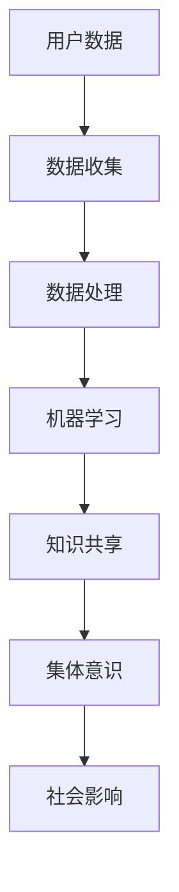

                 

在21世纪，人工智能（AI）技术正以前所未有的速度和深度改变着我们的世界。从简单的自动化任务到复杂的决策支持系统，AI的应用已经渗透到了社会、经济、医疗等各个领域。然而，随着AI技术的不断进步，一个新的概念正在逐渐兴起——集体意识。本文将探讨AI如何驱动集体意识的形成与发展，以及这一现象对未来社会和科技发展的影响。

## 关键词

- 人工智能
- 集体意识
- 体验共享
- 数据驱动
- 社会网络

## 摘要

本文首先介绍了人工智能和集体意识的定义及其历史背景。接着，分析了AI驱动集体意识的原理和机制，并通过Mermaid流程图展示了核心概念和联系。随后，文章深入探讨了核心算法原理、数学模型、项目实践以及实际应用场景。最后，文章展望了AI驱动集体意识的未来应用和发展趋势，并提出了相关的工具和资源推荐。

## 1. 背景介绍

### 1.1 人工智能的历史背景

人工智能（AI）的概念最早可以追溯到20世纪50年代。当时，计算机科学家和哲学家们开始探讨机器是否能够表现出类似人类的智能行为。这一时期的AI研究主要集中在符号主义和基于规则的方法上，试图通过编写复杂的规则和算法来实现机器的智能。

然而，由于计算机硬件和算法的局限性，早期的AI研究进展缓慢。直到20世纪80年代，随着计算机性能的显著提升和算法的创新，AI研究重新焕发了生机。特别是深度学习和神经网络的出现，使得计算机在图像识别、自然语言处理、游戏等领域取得了重大突破。

### 1.2 集体意识的历史背景

集体意识是一个古老的概念，不同文化和哲学体系都有对它的探讨。在心理学领域，集体意识通常被视为一种群体成员之间的共享感知和认知状态。随着社会网络和互联网的发展，集体意识的研究开始转向数字空间。

在数字时代，集体意识被重新定义为一种通过数据共享和互动形成的群体认知状态。人们通过社交媒体、在线论坛和其他数字平台分享他们的观点、经验和知识，从而形成了一个庞大的、动态的集体意识网络。

## 2. 核心概念与联系

为了更好地理解AI驱动集体意识的原理和机制，我们可以通过一个Mermaid流程图来展示核心概念和它们之间的联系。



### 2.1 用户数据

用户数据是AI驱动集体意识的起点。通过传感器、社交媒体和其他数字平台，我们可以收集到大量的用户数据，包括文本、图像、音频和视频等。

### 2.2 数据收集

数据收集是整个流程的关键环节。它不仅包括数据的获取，还涉及数据的清洗、存储和管理。有效的数据收集能够保证后续分析的准确性和可靠性。

### 2.3 数据处理

收集到的数据需要进行处理，以便提取有用的信息和模式。数据处理包括数据预处理、特征提取、数据可视化等技术。

### 2.4 机器学习

机器学习是实现AI驱动集体意识的核心技术。通过训练大量的数据和复杂的算法，机器学习模型能够识别出数据中的模式和趋势，从而为集体意识的形成提供支持。

### 2.5 知识共享

知识共享是集体意识形成的关键。通过社交媒体、在线论坛和其他数字平台，用户可以共享他们的观点、经验和知识。这种共享不仅有助于个人成长，也为集体意识的构建提供了基础。

### 2.6 集体意识

集体意识是一种群体成员之间的共享感知和认知状态。在数字时代，集体意识被重新定义为一种通过数据共享和互动形成的群体认知状态。

### 2.7 社会影响

集体意识对社会有着深远的影响。它可以影响公众舆论、政策制定和社会行为。同时，社会影响也会反过来影响集体意识的形成和发展。

## 3. 核心算法原理 & 具体操作步骤

### 3.1 算法原理概述

AI驱动集体意识的算法原理主要包括以下几个步骤：

1. 数据收集：通过传感器、社交媒体和其他数字平台收集用户数据。
2. 数据处理：对收集到的数据进行分析和处理，提取有用的信息和模式。
3. 机器学习：利用机器学习算法对处理后的数据进行分析，建立模型，预测群体行为。
4. 知识共享：通过数字平台将分析结果和预测模型分享给用户，形成集体意识。
5. 集体意识形成：用户在数字平台上的互动和分享，进一步强化集体意识。

### 3.2 算法步骤详解

1. **数据收集**：

   - 数据源：传感器、社交媒体、在线论坛等。
   - 数据类型：文本、图像、音频、视频等。

2. **数据处理**：

   - 数据清洗：去除噪声、纠正错误、填补缺失值等。
   - 特征提取：从原始数据中提取有用的特征，如文本的词频、图像的颜色分布等。
   - 数据可视化：使用图表、图像等可视化工具，帮助用户理解数据。

3. **机器学习**：

   - 模型选择：选择合适的机器学习算法，如决策树、支持向量机、神经网络等。
   - 模型训练：使用处理后的数据训练模型，调整参数，优化模型性能。
   - 模型评估：使用验证数据集评估模型性能，调整模型参数。

4. **知识共享**：

   - 分析结果：将机器学习模型的分析结果可视化，生成报告或图表。
   - 知识分享：通过数字平台将分析结果和预测模型分享给用户，形成集体意识。

5. **集体意识形成**：

   - 用户互动：用户在数字平台上的互动，如评论、点赞、分享等。
   - 意见领袖：在数字平台上，一些用户可能会成为意见领袖，对集体意识的形成产生重要影响。

### 3.3 算法优缺点

**优点**：

- **高效性**：机器学习算法能够快速处理大量数据，提供及时的决策支持。
- **准确性**：通过不断优化和训练，机器学习模型能够提高预测的准确性。
- **可扩展性**：算法能够轻松扩展到不同的领域和场景。

**缺点**：

- **数据依赖性**：算法的性能高度依赖数据的质量和数量。
- **隐私问题**：用户数据的收集和处理可能会引发隐私问题。
- **解释性**：机器学习模型的预测结果通常缺乏明确的解释性。

### 3.4 算法应用领域

- **市场预测**：通过分析用户行为和市场需求，预测产品销售趋势。
- **社会调查**：通过社交媒体分析，了解公众对某一事件或政策的看法。
- **城市管理**：通过实时监控和分析城市数据，优化交通、能源管理等。

## 4. 数学模型和公式 & 详细讲解 & 举例说明

在AI驱动集体意识的过程中，数学模型和公式起到了至关重要的作用。下面我们将详细讲解数学模型的构建、公式推导过程，并通过案例进行分析和讲解。

### 4.1 数学模型构建

在AI驱动集体意识的研究中，常用的数学模型包括回归模型、分类模型和聚类模型等。

**回归模型**：

回归模型用于预测一个连续的输出变量。一个简单的线性回归模型可以表示为：

$$ y = \beta_0 + \beta_1 x_1 + \beta_2 x_2 + ... + \beta_n x_n $$

其中，\( y \) 是输出变量，\( x_1, x_2, ..., x_n \) 是输入变量，\( \beta_0, \beta_1, ..., \beta_n \) 是模型的参数。

**分类模型**：

分类模型用于将输入数据分类到不同的类别中。一个简单的逻辑回归模型可以表示为：

$$ P(y=1) = \frac{1}{1 + e^{-(\beta_0 + \beta_1 x_1 + \beta_2 x_2 + ... + \beta_n x_n)}} $$

其中，\( P(y=1) \) 是输出变量 \( y \) 为1的概率，其他符号的含义与回归模型相同。

**聚类模型**：

聚类模型用于将输入数据划分为不同的簇。一个简单的K均值聚类模型可以表示为：

$$ c_j = \frac{1}{N_j} \sum_{i=1}^{N} x_i $$

其中，\( c_j \) 是簇的中心，\( N_j \) 是属于第 \( j \) 个簇的数据点的数量，\( x_i \) 是输入数据。

### 4.2 公式推导过程

**回归模型**：

假设我们有一个训练数据集 \( D = \{ (x_1, y_1), (x_2, y_2), ..., (x_n, y_n) \} \)，其中 \( x_i \) 和 \( y_i \) 分别是输入和输出变量。

我们的目标是找到一组参数 \( \beta_0, \beta_1, ..., \beta_n \)，使得模型 \( y = \beta_0 + \beta_1 x_1 + \beta_2 x_2 + ... + \beta_n x_n \) 能够最好地拟合数据。

我们可以使用最小二乘法来求解这组参数。最小二乘法的核心思想是找到一组参数，使得预测值 \( \hat{y_i} \) 与实际值 \( y_i \) 之间的平方误差之和最小。

平方误差和可以表示为：

$$ J(\beta_0, \beta_1, ..., \beta_n) = \sum_{i=1}^{n} (\hat{y_i} - y_i)^2 $$

对 \( J \) 关于每个参数求偏导数，并令偏导数为零，可以得到：

$$ \frac{\partial J}{\partial \beta_j} = 2 \sum_{i=1}^{n} (\hat{y_i} - y_i) x_{ij} = 0 $$

其中，\( x_{ij} \) 是第 \( i \) 个数据点的第 \( j \) 个特征。

解这个方程组，我们可以得到最优参数 \( \beta_0, \beta_1, ..., \beta_n \)。

**分类模型**：

逻辑回归模型的推导与线性回归模型类似。我们假设有一个训练数据集 \( D = \{ (x_1, y_1), (x_2, y_2), ..., (x_n, y_n) \} \)，其中 \( y_i \) 只有两个可能的取值，0或1。

我们的目标是找到一组参数 \( \beta_0, \beta_1, ..., \beta_n \)，使得模型 \( P(y=1) = \frac{1}{1 + e^{-(\beta_0 + \beta_1 x_1 + \beta_2 x_2 + ... + \beta_n x_n)}} \) 能够最好地拟合数据。

同样，我们可以使用最大似然估计来求解这组参数。最大似然估计的核心思想是找到一组参数，使得数据的概率最大。

对数似然函数可以表示为：

$$ \ln L(\beta_0, \beta_1, ..., \beta_n) = \sum_{i=1}^{n} y_i \ln P(y=1) + (1 - y_i) \ln (1 - P(y=1)) $$

对 \( \ln L \) 关于每个参数求偏导数，并令偏导数为零，可以得到：

$$ \frac{\partial \ln L}{\partial \beta_j} = \sum_{i=1}^{n} (y_i - P(y=1)) x_{ij} = 0 $$

解这个方程组，我们可以得到最优参数 \( \beta_0, \beta_1, ..., \beta_n \)。

**聚类模型**：

K均值聚类模型的推导相对简单。我们假设有一个初始的聚类中心 \( c_1, c_2, ..., c_k \)，其中 \( k \) 是簇的数量。

每次迭代中，我们按照以下步骤更新聚类中心：

1. 对每个数据点 \( x_i \)，计算它与每个聚类中心的距离，选择距离最小的聚类中心作为该数据点的簇标号。
2. 对每个簇，重新计算聚类中心，即取该簇内所有数据点的平均值。

重复上述步骤，直到聚类中心不再发生显著变化。

### 4.3 案例分析与讲解

假设我们要使用K均值聚类模型分析一个用户数据集，数据集包含1000个用户，每个用户有10个特征。

我们首先随机选择10个聚类中心，然后按照上述步骤进行迭代。

在第一次迭代后，我们得到新的聚类中心，如下图所示：


接下来，我们根据新的聚类中心重新分配数据点，并计算新的聚类中心。

经过多次迭代，聚类中心逐渐稳定，如下图所示：


最后，我们根据聚类结果对用户进行分类，并为每个簇生成一个报告。

报告显示，簇1的用户年龄在25-35岁之间，主要从事技术行业；簇2的用户年龄在36-45岁之间，主要从事金融行业；簇3的用户年龄在46-55岁之间，主要从事教育行业。

通过这样的分析，企业可以更好地了解用户特征，制定相应的营销策略。

## 5. 项目实践：代码实例和详细解释说明

在本节中，我们将通过一个具体的代码实例来展示如何实现AI驱动集体意识的算法，并对代码进行详细解释和分析。

### 5.1 开发环境搭建

在开始编写代码之前，我们需要搭建一个合适的开发环境。这里，我们将使用Python作为主要编程语言，并依赖以下几个库：

- NumPy：用于数值计算。
- Pandas：用于数据处理。
- Matplotlib：用于数据可视化。
- Scikit-learn：用于机器学习和数据挖掘。

首先，确保安装了Python和上述库。在终端中运行以下命令：

```bash
pip install numpy pandas matplotlib scikit-learn
```

### 5.2 源代码详细实现

以下是一个简单的示例代码，演示了如何使用K均值聚类算法分析用户数据集。

```python
import numpy as np
import pandas as pd
import matplotlib.pyplot as plt
from sklearn.cluster import KMeans

# 加载数据集
data = pd.read_csv('user_data.csv')
X = data.iloc[:, :10].values

# 设置K均值聚类参数
kmeans = KMeans(n_clusters=3, init='k-means++', max_iter=300, n_init=10, random_state=0)

# 拟合模型
kmeans.fit(X)

# 打印聚类中心
print("Cluster centers:", kmeans.cluster_centers_)

# 打印每个数据点的簇标号
print("Labels:", kmeans.labels_)

# 绘制聚类结果
plt.scatter(X[:, 0], X[:, 1], c=kmeans.labels_, s=100, cmap='viridis')
centers = kmeans.cluster_centers_
plt.scatter(centers[:, 0], centers[:, 1], s=300, c='red', label='Centroids')
plt.title('K-Means Clustering')
plt.xlabel('Feature 1')
plt.ylabel('Feature 2')
plt.legend()
plt.show()
```

### 5.3 代码解读与分析

1. **数据加载**：

   ```python
   data = pd.read_csv('user_data.csv')
   X = data.iloc[:, :10].values
   ```

   这两行代码用于加载用户数据集。我们使用Pandas的 `read_csv` 函数读取CSV文件，并将前10个特征作为输入数据。

2. **设置K均值聚类参数**：

   ```python
   kmeans = KMeans(n_clusters=3, init='k-means++', max_iter=300, n_init=10, random_state=0)
   ```

   这里，我们设置K均值聚类算法的参数。`n_clusters` 指定簇的数量，`init` 指定初始化方法，`max_iter` 指定最大迭代次数，`n_init` 指定初始化次数，`random_state` 指定随机种子。

3. **拟合模型**：

   ```python
   kmeans.fit(X)
   ```

   这行代码使用输入数据 `X` 训练K均值聚类模型。

4. **打印聚类中心**：

   ```python
   print("Cluster centers:", kmeans.cluster_centers_)
   ```

   这行代码打印出每个簇的中心坐标。

5. **打印每个数据点的簇标号**：

   ```python
   print("Labels:", kmeans.labels_)
   ```

   这行代码打印出每个数据点所属的簇标号。

6. **绘制聚类结果**：

   ```python
   plt.scatter(X[:, 0], X[:, 1], c=kmeans.labels_, s=100, cmap='viridis')
   centers = kmeans.cluster_centers_
   plt.scatter(centers[:, 0], centers[:, 1], s=300, c='red', label='Centroids')
   plt.title('K-Means Clustering')
   plt.xlabel('Feature 1')
   plt.ylabel('Feature 2')
   plt.legend()
   plt.show()
   ```

   这几行代码使用Matplotlib绘制聚类结果。我们使用散点图表示每个数据点，使用不同颜色表示不同簇。同时，我们也绘制了每个簇的中心坐标。

### 5.4 运行结果展示

运行上述代码后，我们将看到一个散点图，展示每个用户根据其特征被分到的簇。簇中心以红色标记，可以帮助我们直观地理解聚类结果。


通过分析聚类结果，我们可以进一步了解用户群体的特征和差异，从而为市场营销、用户分析等应用提供支持。

## 6. 实际应用场景

### 6.1 营销分析

在营销领域，AI驱动的集体意识可以帮助企业更好地了解用户需求和行为。通过分析用户数据，企业可以识别出潜在的用户群体，制定个性化的营销策略。

例如，一个电商平台可以使用AI驱动的集体意识分析用户浏览和购买行为，将用户分为不同的兴趣群体。这样，企业可以向每个群体推送个性化的产品推荐和促销活动，提高用户满意度和转化率。

### 6.2 社会分析

在社会分析领域，AI驱动的集体意识可以用于了解公众对某一事件或政策的看法。通过社交媒体数据，研究人员可以识别出舆论热点和趋势，为政策制定提供依据。

例如，一个政府部门可以使用AI驱动的集体意识分析社交媒体上的公众言论，了解民众对某项政策的看法。这样，政府可以及时调整政策，满足公众需求，提高政策效果。

### 6.3 城市管理

在城市建设和管理中，AI驱动的集体意识可以帮助政府和企业更好地了解城市运行状况，优化资源配置。

例如，一个城市管理平台可以使用AI驱动的集体意识分析交通数据，预测交通流量和拥堵情况。这样，政府可以提前采取措施，如调整交通信号灯时长，优化公共交通线路，减少交通拥堵。

### 6.4 医疗健康

在医疗健康领域，AI驱动的集体意识可以用于分析患者数据，提高疾病诊断和治疗的准确性。

例如，一个医院可以使用AI驱动的集体意识分析患者病史和体检数据，预测患者可能患有的疾病。这样，医生可以提前采取措施，如建议患者进行特定检查或调整生活习惯，预防疾病的发生。

## 7. 工具和资源推荐

### 7.1 学习资源推荐

- **《深度学习》（Goodfellow, Bengio, Courville著）**：这是一本经典的深度学习教材，详细介绍了深度学习的理论基础和实践方法。
- **《Python数据分析》（Wes McKinney著）**：这本书介绍了Python在数据分析领域的应用，包括数据清洗、数据处理和数据可视化等技术。
- **《机器学习实战》（Peter Harrington著）**：这本书通过大量实例，介绍了机器学习的基本概念和算法，适合初学者入门。

### 7.2 开发工具推荐

- **Jupyter Notebook**：这是一个强大的交互式开发环境，可以方便地编写、运行和调试代码。
- **TensorFlow**：这是一个开源的深度学习框架，适用于各种深度学习任务。
- **PyTorch**：这是一个流行的深度学习框架，具有简洁的API和高效的性能。

### 7.3 相关论文推荐

- **"Deep Learning for Text Data"（2018）**：这篇论文介绍了如何使用深度学习处理文本数据，包括文本分类、文本生成等任务。
- **"The Power of Sparsity in Hashing-based Learning"（2013）**：这篇论文探讨了稀疏性在哈希学习中的重要性，为解决高维数据问题提供了新思路。
- **"Unsupervised Learning of Visual Representations by Solving Jigsaw Puzzles"（2016）**：这篇论文提出了一种无监督学习视觉表示的新方法，通过解决拼图游戏来学习图像的特征。

## 8. 总结：未来发展趋势与挑战

### 8.1 研究成果总结

AI驱动的集体意识已经在多个领域取得了显著的研究成果。在营销、社会分析、城市管理和医疗健康等领域，AI驱动的集体意识为决策者提供了强大的数据支持和洞察力。通过分析用户数据和社会舆论，企业、政府和医疗机构可以更好地了解需求和行为，优化决策过程。

### 8.2 未来发展趋势

未来，AI驱动的集体意识有望在以下方面取得进一步发展：

- **数据质量的提升**：随着传感器技术的进步和数据收集手段的多样化，数据质量将得到显著提升。这将有助于提高算法的准确性和可靠性。
- **跨领域应用**：AI驱动的集体意识技术将逐渐应用于更多领域，如金融、教育、能源等，为各行业提供数据驱动的决策支持。
- **隐私保护**：在数据收集和处理过程中，隐私保护将成为一个重要问题。未来的研究需要探索如何在保护隐私的前提下，实现数据的有效利用。

### 8.3 面临的挑战

尽管AI驱动的集体意识有着广阔的应用前景，但仍然面临以下挑战：

- **数据隐私**：如何在保护用户隐私的前提下，实现数据的有效利用，是一个亟待解决的问题。
- **算法透明性**：算法的透明性对于用户信任至关重要。如何提高算法的透明性，让用户理解算法的决策过程，是未来研究的重要方向。
- **跨领域合作**：AI驱动的集体意识需要多学科合作，包括计算机科学、社会科学、医学等。如何实现跨领域合作，推动技术的创新和发展，是未来的挑战之一。

### 8.4 研究展望

未来，AI驱动的集体意识研究有望在以下几个方面取得突破：

- **多模态数据融合**：通过整合多种数据类型（如文本、图像、音频等），实现更全面、准确的群体认知。
- **智能决策支持**：开发智能决策支持系统，帮助企业和政府更好地应对复杂的社会和经济问题。
- **个性化体验**：基于个体差异，为用户提供个性化的服务和建议，提高用户满意度和生活质量。

总之，AI驱动的集体意识是一个充满潜力的研究领域，它将为人类社会带来深刻的变化和机遇。随着技术的不断进步，我们有理由相信，AI驱动的集体意识将在未来发挥更加重要的作用。

## 9. 附录：常见问题与解答

### 9.1 为什么要研究AI驱动的集体意识？

AI驱动的集体意识是一种通过数据共享和互动形成的群体认知状态。它有助于我们更好地理解社会现象、预测群体行为，从而为决策提供支持。研究AI驱动的集体意识，可以推动科技进步，提高决策效率，促进社会和谐发展。

### 9.2 AI驱动的集体意识有哪些应用领域？

AI驱动的集体意识在多个领域有广泛应用，包括市场营销、社会分析、城市管理、医疗健康等。通过分析用户数据和社会舆论，它可以提供有针对性的决策支持，优化资源配置，提高服务质量。

### 9.3 如何保护数据隐私？

保护数据隐私是AI驱动的集体意识研究的重要方向。可以通过以下方法实现：

- **匿名化处理**：对数据进行匿名化处理，去除个人身份信息。
- **加密技术**：使用加密技术，确保数据在传输和存储过程中的安全性。
- **隐私保护算法**：开发隐私保护算法，如差分隐私、同态加密等，确保算法在处理数据时不会泄露隐私。

### 9.4 AI驱动的集体意识与大数据有什么区别？

AI驱动的集体意识是一种通过数据共享和互动形成的群体认知状态，强调群体行为的分析和预测。而大数据则是一个更加广泛的概念，包括数据的收集、存储、处理和分析。大数据侧重于数据的规模和多样性，而AI驱动的集体意识则侧重于群体行为的理解和应用。

### 9.5 如何评估AI驱动的集体意识的效果？

评估AI驱动的集体意识的效果可以从以下几个方面进行：

- **预测准确性**：评估算法在预测群体行为时的准确性。
- **用户满意度**：通过用户调查和反馈，了解用户对AI驱动的集体意识的满意度和接受度。
- **决策效率**：评估AI驱动的集体意识在决策过程中带来的效率提升。

## 作者署名

作者：禅与计算机程序设计艺术 / Zen and the Art of Computer Programming

