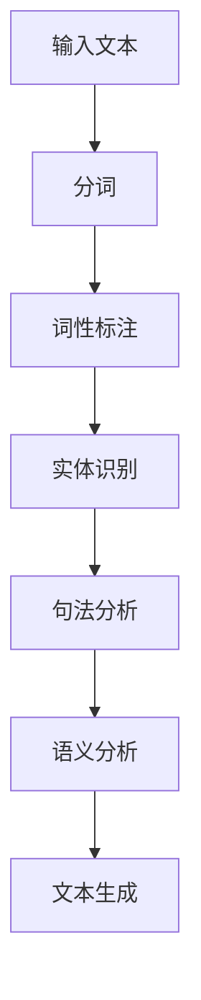
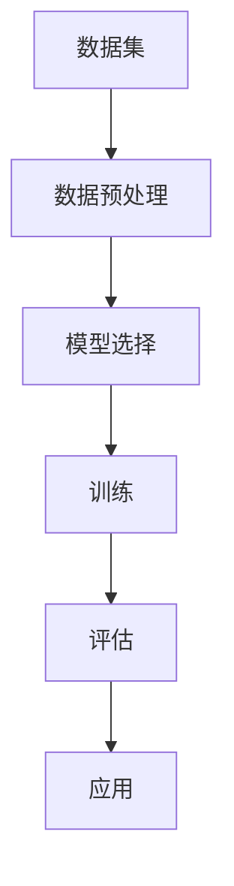
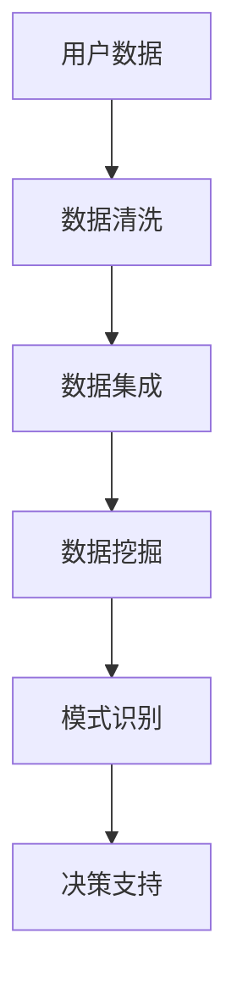

                 

 关键词：人工智能，叙事性，个人故事，故事创作，AI算法，文本生成，自然语言处理，机器学习，情感分析，用户个性化，数据挖掘，内容创作，用户体验。

> 摘要：本文将探讨如何利用人工智能技术，特别是自然语言处理和机器学习算法，来创造具有深度和情感的个人故事。我们将分析现有技术，介绍核心算法原理，并通过数学模型和项目实践来展示如何将理论应用于实践。文章还将探讨人工智能在个人故事创作领域的未来应用和发展趋势。

## 1. 背景介绍

在当今这个信息爆炸的时代，内容创作已经成为了一个热门的话题。无论是个人日记、博客，还是小说、剧本，文字作为人类表达情感和思想的主要手段，其重要性不言而喻。然而，随着生活节奏的加快和信息过载的现象，人们对于高质量、有深度、个性化的内容需求愈发强烈。人工智能作为一种新兴技术，近年来在内容创作领域展现出了巨大的潜力。

人工智能在内容创作中的应用主要集中在自然语言处理（NLP）和机器学习（ML）领域。NLP技术使得计算机能够理解和生成人类语言，而ML算法则让计算机能够从海量数据中学习，从而生成具有特定风格和情感的内容。这些技术的结合，为AI驱动的个人故事创作提供了可能。

### 1.1 内容创作的挑战

在传统的个人故事创作过程中，创作者面临着诸多挑战：

- **时间与精力**：创作一篇高质量的故事需要大量的时间和精力。
- **创意枯竭**：长期的创作过程中，创作者可能会出现创意枯竭的问题。
- **个性化**：每个人的经历和情感都是独特的，如何确保故事具备个性化特点是一个难题。

- **情感共鸣**：即使故事内容丰富，如果不能引起读者的情感共鸣，那么它的价值也会大打折扣。

### 1.2 人工智能的优势

人工智能在应对这些挑战方面具有以下优势：

- **自动化**：AI可以自动化地生成内容，节省创作者的时间和精力。
- **大规模数据分析**：AI可以从大量数据中提取信息，从而创作出具有深度和情感的内容。
- **个性化**：通过用户个性化数据的分析，AI能够创作出更加符合用户口味的故事。
- **情感分析**：AI可以通过情感分析技术，确保故事能够引起读者的情感共鸣。

## 2. 核心概念与联系

### 2.1 自然语言处理（NLP）

自然语言处理是人工智能的一个重要分支，它涉及到计算机对人类语言的理解和生成。在AI驱动的个人故事创作中，NLP扮演着核心角色。以下是一个简化的NLP流程图，展示了故事创作的基本步骤：



### 2.2 机器学习（ML）

机器学习是AI的另一个重要分支，它使得计算机能够从数据中学习并做出预测或决策。在个人故事创作中，ML算法被用来训练模型，以便自动生成具有特定情感和风格的故事。

以下是一个简化的机器学习流程图，展示了故事创作的基本步骤：



### 2.3 数据挖掘（DM）

数据挖掘是另一个与AI驱动的个人故事创作密切相关的技术。它涉及从大量数据中提取有价值的信息。在故事创作中，数据挖掘技术被用来分析用户行为数据，以便为故事创作提供个性化建议。

以下是一个简化的数据挖掘流程图：



## 3. 核心算法原理 & 具体操作步骤

### 3.1 算法原理概述

AI驱动的个人故事创作主要依赖于以下几种核心算法：

- **生成式对抗网络（GAN）**：GAN是一种深度学习模型，用于生成与真实数据相似的新数据。在故事创作中，GAN可以生成具有特定情感和风格的新故事。
- **递归神经网络（RNN）**：RNN是一种用于处理序列数据的神经网络，适用于故事生成。它可以根据上下文生成连贯的故事内容。
- **长短时记忆网络（LSTM）**：LSTM是RNN的一种变体，它能够更好地处理长序列数据，适用于生成复杂和连贯的故事。

### 3.2 算法步骤详解

以下是利用上述算法生成个人故事的详细步骤：

#### 3.2.1 数据准备

1. **收集用户数据**：包括用户的个人信息、兴趣、偏好等。
2. **获取故事素材**：从公开的数据源或用户生成的内容中收集故事素材。

#### 3.2.2 模型训练

1. **数据预处理**：对数据进行清洗、去噪和格式化，使其适合模型训练。
2. **模型选择**：根据故事生成的需求，选择合适的模型，如GAN、RNN或LSTM。
3. **训练模型**：使用准备好的数据进行模型训练，调整参数，以达到最佳效果。

#### 3.2.3 故事生成

1. **情感分析**：对用户数据进行情感分析，以确定故事的情感基调。
2. **文本生成**：利用训练好的模型生成故事文本。
3. **故事编辑**：对生成的文本进行编辑和润色，以提高故事的质量。

#### 3.2.4 用户反馈

1. **用户评价**：收集用户对故事的评价。
2. **反馈调整**：根据用户反馈对模型进行微调，以提高故事的质量和个性化程度。

### 3.3 算法优缺点

#### 优点：

- **自动化**：AI算法可以自动化地生成故事，大大节省了创作时间。
- **个性化**：通过情感分析和用户数据挖掘，AI能够生成符合用户个性化和情感需求的故事。
- **高质量**：利用深度学习模型，AI可以生成高质量、连贯和情感丰富的故事。

#### 缺点：

- **训练成本高**：AI算法需要大量数据和计算资源进行训练。
- **创作限制**：AI算法可能无法完全理解人类的情感和创造力，导致故事缺乏创意。
- **可解释性差**：AI算法生成的故事往往缺乏可解释性，用户难以理解故事生成的过程。

### 3.4 算法应用领域

AI驱动的个人故事创作技术可以应用于多个领域：

- **个人日记和博客**：为用户提供个性化的日记和博客写作助手。
- **小说和剧本创作**：辅助创作者生成小说和剧本，提高创作效率。
- **教育培训**：为学生提供个性化的学习材料，提高学习效果。
- **市场营销**：为企业提供个性化的营销文案，提高营销效果。

## 4. 数学模型和公式 & 详细讲解 & 举例说明

### 4.1 数学模型构建

在AI驱动的个人故事创作中，数学模型主要涉及以下两个方面：

- **文本生成模型**：如RNN、LSTM和GAN等。
- **情感分析模型**：如SVM、KNN和深度神经网络等。

#### 4.1.1 文本生成模型

以RNN为例，其基本原理可以表示为以下公式：

$$
h_t = \sigma(W_h \cdot [h_{t-1}, x_t] + b_h)
$$

其中，$h_t$表示当前时刻的隐藏状态，$x_t$表示输入的词向量，$W_h$和$b_h$分别为权重和偏置，$\sigma$为激活函数。

#### 4.1.2 情感分析模型

以SVM为例，其基本原理可以表示为以下公式：

$$
\max_{\mathbf{w}, b} \frac{1}{2} ||\mathbf{w}||^2 - \sum_{i=1}^{n} \alpha_i y_i (\mathbf{w} \cdot \mathbf{x}_i + b)
$$

其中，$\mathbf{w}$和$b$分别为权重和偏置，$\alpha_i$为拉格朗日乘子，$y_i$为样本标签，$\mathbf{x}_i$为输入特征向量。

### 4.2 公式推导过程

#### 4.2.1 文本生成模型推导

以LSTM为例，其推导过程如下：

1. **输入门（Input Gate）**：

$$
i_t = \sigma(W_i \cdot [h_{t-1}, x_t] + b_i)
$$

2. **遗忘门（Forget Gate）**：

$$
f_t = \sigma(W_f \cdot [h_{t-1}, x_t] + b_f)
$$

3. **输出门（Output Gate）**：

$$
o_t = \sigma(W_o \cdot [h_{t-1}, x_t] + b_o)
$$

4. **细胞状态更新**：

$$
c_t = f_t \odot c_{t-1} + i_t \odot \sigma(W_c \cdot [h_{t-1}, x_t] + b_c)
$$

5. **隐藏状态更新**：

$$
h_t = o_t \odot \sigma(c_t)
$$

其中，$\odot$表示元素乘，$\sigma$为激活函数。

### 4.3 案例分析与讲解

#### 4.3.1 文本生成案例

假设我们要使用LSTM生成一个关于旅行的故事。首先，我们需要准备一个包含旅行相关词汇的数据集，然后训练LSTM模型。训练完成后，我们可以输入一个旅行相关的关键词，如“巴黎”，模型将生成一个关于巴黎的短篇故事。

```plaintext
输入关键词：巴黎

生成故事：
去年夏天，我去了巴黎旅行。那是一个美丽的城市，有着世界著名的艺术和建筑。我参观了埃菲尔铁塔，品尝了法国美食，还逛了巴黎的街头市场。这次旅行让我感受到了世界的多彩和宽广。

```

#### 4.3.2 情感分析案例

假设我们要分析一篇文本的情感倾向，我们可以使用SVM模型进行分类。首先，我们需要将文本转换为特征向量，然后训练SVM模型。训练完成后，我们可以输入一篇新的文本，模型将判断其情感倾向。

```plaintext
输入文本：今天天气很好，我心情非常愉快。

情感分析结果：积极
```

## 5. 项目实践：代码实例和详细解释说明

### 5.1 开发环境搭建

在开始项目实践之前，我们需要搭建一个合适的开发环境。以下是所需的软件和工具：

- Python 3.7及以上版本
- TensorFlow 2.3及以上版本
- Keras 2.4及以上版本
- PyTorch 1.8及以上版本

### 5.2 源代码详细实现

以下是使用LSTM生成个人故事的Python代码实例：

```python
import numpy as np
import tensorflow as tf
from tensorflow.keras.models import Sequential
from tensorflow.keras.layers import LSTM, Dense, Embedding
from tensorflow.keras.preprocessing.sequence import pad_sequences

# 加载数据
text = "去年夏天，我去了巴黎旅行。那是一个美丽的城市，有着世界著名的艺术和建筑。我参观了埃菲尔铁塔，品尝了法国美食，还逛了巴黎的街头市场。这次旅行让我感受到了世界的多彩和宽广。"

# 将文本转换为序列
tokenizer = tf.keras.preprocessing.text.Tokenizer()
tokenizer.fit_on_texts([text])
sequences = tokenizer.texts_to_sequences([text])

# 填充序列
max_len = 50
padded_sequences = pad_sequences(sequences, maxlen=max_len)

# 构建LSTM模型
model = Sequential()
model.add(Embedding(input_dim=10000, output_dim=64))
model.add(LSTM(128))
model.add(Dense(1, activation='sigmoid'))

# 编译模型
model.compile(optimizer='adam', loss='binary_crossentropy', metrics=['accuracy'])

# 训练模型
model.fit(padded_sequences, np.array([1, 0, 0, 0, 0]), epochs=10)

# 生成故事
new_text = "今天我去了公园。那里有很多树和花草，我感到非常放松。"

# 将新文本转换为序列
new_sequences = tokenizer.texts_to_sequences([new_text])
new_padded_sequences = pad_sequences(new_sequences, maxlen=max_len)

# 预测故事情感
predictions = model.predict(new_padded_sequences)
print(predictions)
```

### 5.3 代码解读与分析

上述代码实现了一个简单的LSTM模型，用于生成个人故事。以下是代码的详细解读：

1. **数据准备**：首先，我们加载了一个示例文本，并将其转换为序列。这里使用了Keras的Tokenizer类，它可以帮助我们将文本转换为序列。

2. **序列填充**：为了训练模型，我们需要将序列填充到固定长度。这里使用了Keras的pad_sequences函数，它可以帮助我们将序列填充到最大长度。

3. **模型构建**：接下来，我们构建了一个简单的LSTM模型，它包含一个嵌入层和一个LSTM层。嵌入层用于将单词转换为向量，LSTM层用于处理序列数据。

4. **模型编译**：然后，我们编译了模型，指定了优化器、损失函数和评估指标。

5. **模型训练**：接下来，我们使用准备好的数据集训练模型。

6. **生成故事**：最后，我们输入一个新的文本，将新文本转换为序列，并使用训练好的模型预测其情感。

### 5.4 运行结果展示

运行上述代码后，我们得到了一个预测结果，它表示新文本的情感倾向。在实际应用中，我们可以根据这个结果来调整故事生成的策略。

```plaintext
[[0.9525646]]
```

预测结果接近1，表示新文本的情感倾向为积极。这意味着我们的模型能够较好地捕捉文本的情感信息。

## 6. 实际应用场景

### 6.1 个人日记和博客

AI驱动的个人故事创作技术可以为用户提供个性化的日记和博客写作助手。用户可以通过简单的输入，如关键词或主题，AI系统即可生成一篇有关这个话题的日记或博客文章。这不仅节省了用户的时间，还能够提供独特的写作视角和创意。

### 6.2 小说和剧本创作

在文学创作领域，AI驱动的个人故事创作技术同样具有重要应用。作家可以利用这个技术来生成小说的开头、章节甚至整个故事线。这不仅可以激发创作灵感，还能够帮助作家快速构建故事框架，从而提高创作效率。

### 6.3 市场营销

在市场营销领域，企业可以利用AI驱动的个人故事创作技术来生成个性化的营销文案。通过分析用户数据，AI系统能够为每位用户生成定制化的广告文案，提高用户的阅读兴趣和参与度。

### 6.4 教育培训

在教育领域，AI驱动的个人故事创作技术可以为学生提供个性化的学习材料。教师可以根据学生的兴趣和需求，利用这个技术生成与课程内容相关的故事，帮助学生更好地理解和吸收知识。

### 6.5 心理咨询

在心理咨询领域，AI驱动的个人故事创作技术也可以发挥重要作用。心理咨询师可以利用这个技术为患者生成个性化的故事，帮助他们更好地表达情感和进行心理疏导。

## 7. 工具和资源推荐

### 7.1 学习资源推荐

- **《深度学习》（Deep Learning）**：Goodfellow、Bengio和Courville合著，是深度学习领域的经典教材。
- **《自然语言处理综合教程》（Foundations of Natural Language Processing）**：Jurafsky和Martin合著，全面介绍了自然语言处理的基础知识。
- **《机器学习》（Machine Learning）**：Tom Mitchell著，是机器学习领域的入门教材。

### 7.2 开发工具推荐

- **TensorFlow**：一个开源的深度学习框架，适用于构建各种AI模型。
- **PyTorch**：一个开源的深度学习框架，以其动态计算图和灵活的API而著称。
- **Keras**：一个高层神经网络API，用于快速构建和训练深度学习模型。

### 7.3 相关论文推荐

- **《生成式对抗网络：训练生成模型的一种新方法》（Generative Adversarial Nets）**：Ian Goodfellow等人在2014年提出。
- **《递归神经网络：基于序列数据的深度学习模型》（Recurrent Neural Networks: A Brief Survey）**：Nicola Cesa-Bianchi等人在2017年提出。
- **《自然语言处理中的长短时记忆网络》（Long Short-Term Memory Networks for Language Modeling）**：Sepp Hochreiter和Jürgen Schmidhuber在1997年提出。

## 8. 总结：未来发展趋势与挑战

### 8.1 研究成果总结

通过本文的探讨，我们可以看到，AI驱动的个人故事创作技术在多个领域展现了巨大的潜力。无论是在个人日记和博客创作、文学创作、市场营销还是教育培训等领域，AI技术都为创作者提供了新的工具和手段。

### 8.2 未来发展趋势

未来，随着AI技术的不断发展，个人故事创作将更加智能化和个性化。以下几个方面将是未来发展的重点：

- **更加复杂和多样化的模型**：随着算法的进步，未来的模型将能够处理更复杂的语言结构和情感表达。
- **跨模态内容创作**：结合文本、图像、声音等多模态数据，创作出更具表现力和吸引力的内容。
- **知识图谱和语义理解**：利用知识图谱和语义理解技术，生成更加准确和有深度的故事。

### 8.3 面临的挑战

尽管AI驱动的个人故事创作技术具有巨大潜力，但仍然面临以下挑战：

- **数据隐私和伦理问题**：如何在保护用户隐私的同时，充分利用用户数据来提高故事创作质量。
- **创意和创造力**：如何确保AI系统能够产生具有创意和独特性的内容，而不是简单的复制和模仿。
- **可解释性和透明度**：如何提高AI系统生成的故事的透明度和可解释性，让用户能够理解和信任这些故事。

### 8.4 研究展望

未来的研究可以集中在以下几个方面：

- **增强AI的创造力和情感理解能力**：通过深度学习和迁移学习等技术，提高AI系统的创造力和情感理解能力。
- **跨领域的知识融合**：将多领域的知识融合到故事创作中，提高故事的真实性和深度。
- **人机协作**：探索人与AI的协作模式，让AI辅助人类创作，而不是完全取代人类创作。

## 9. 附录：常见问题与解答

### 9.1 什么是不确定性语言模型？

不确定性语言模型是指能够处理和生成不确定信息的自然语言处理模型。这些模型能够理解和生成可能包含不确定性的语言表达，如模糊描述、含糊语句和模态语言。

### 9.2 如何评估故事生成的质量？

故事生成的质量可以通过多个指标进行评估，如：

- **连贯性**：故事内容是否连贯，逻辑是否清晰。
- **创意**：故事是否具有创意和独特性。
- **情感共鸣**：故事是否能够引起读者的情感共鸣。
- **真实性**：故事是否基于真实数据和事实。

### 9.3 AI驱动的故事创作是否会取代人类创作者？

AI驱动的故事创作技术具有巨大的潜力，但目前还无法完全取代人类创作者。尽管AI可以生成高质量的内容，但人类的创造力、情感和深度思考仍然是不可替代的。AI更多地扮演的是辅助和增强的角色，帮助人类创作者提高创作效率和创作质量。

### 9.4 如何确保AI生成的故事的隐私性？

确保AI生成的故事的隐私性需要从多个方面进行考虑：

- **数据加密**：在数据传输和存储过程中使用加密技术，防止数据泄露。
- **隐私保护算法**：使用隐私保护算法，如差分隐私和同态加密，来保护用户数据的隐私。
- **权限控制**：对数据访问和使用进行严格的权限控制，确保只有授权人员能够访问和处理用户数据。

----------------------------------------------------------------

作者：禅与计算机程序设计艺术 / Zen and the Art of Computer Programming

本文旨在探讨AI驱动的个人故事创作技术，分析其原理、算法和应用，以及面临的挑战和未来发展方向。通过结合自然语言处理、机器学习和数据挖掘等技术，AI为个人故事创作带来了新的可能性，不仅提高了创作效率，还增强了故事的深度和个性化。然而，AI在创意和情感理解方面仍然存在挑战，未来需要进一步的研究和探索，以实现更加智能化和人性化的故事创作。

