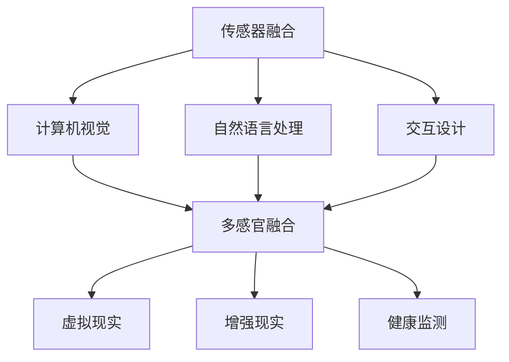

                 

 在当今快速发展的信息技术时代，人工智能（AI）已经成为推动社会进步的重要力量。它不仅仅是一个工具或技术，更是一个体验的多维度构建器，能够创造出一个全新的感官世界。本文将深入探讨AI如何通过不同的维度构建体验，以及这一过程背后的核心概念、算法原理和实际应用。

## 关键词

- 人工智能
- 多维度体验
- 传感器融合
- 计算机视觉
- 自然语言处理
- 交互设计
- 虚拟现实

## 摘要

本文旨在探讨人工智能在构建多维度感官体验方面的作用。我们将首先介绍AI的基本概念和当前发展状况，然后深入讨论AI如何通过传感器融合、计算机视觉、自然语言处理等技术创造新的感官世界。文章还将分析AI在不同领域中的应用，如虚拟现实、交互设计和健康监测，并展望未来的发展趋势与挑战。

## 1. 背景介绍

### 人工智能的崛起

人工智能（AI）起源于20世纪50年代，随着计算能力的提升和数据量的爆炸性增长，AI技术经历了快速的发展。深度学习、神经网络和强化学习等技术的突破，使得AI在图像识别、自然语言处理、自动驾驶等领域取得了显著成果。现在，AI已经成为现代社会不可或缺的一部分，从智能手机的语音助手到自动驾驶汽车，从医疗诊断到金融交易，AI无处不在。

### 多维度体验的重要性

在信息时代，用户体验（UX）成为产品成功的关键。多维度体验不仅仅是视觉上的感受，还包括听觉、触觉、嗅觉和味觉等多个感官层面。一个成功的AI系统需要能够理解和满足用户的多样化需求，从而提供更加丰富和个性化的体验。

### 感官世界的扩展

传统的计算机系统主要依赖于视觉和听觉，而AI技术的进步使得计算机能够感知和模拟更多的感官。例如，通过计算机视觉，AI可以“看”到周围的世界；通过自然语言处理，AI可以“听”懂用户的需求；通过触觉传感器，AI可以“触”摸物体的质感。这种多维度的感知能力为AI创造了一个全新的感官世界。

## 2. 核心概念与联系

为了深入理解AI如何构建感官世界，我们需要了解几个核心概念和它们之间的联系。以下是使用Mermaid绘制的流程图，展示这些概念及其相互关系：



### 2.1 传感器融合

传感器融合是指将来自不同类型传感器的信息进行整合，以便计算机能够更全面地感知环境。例如，摄像头提供视觉信息，麦克风提供声音信息，传感器融合技术可以将这些信息整合在一起，形成一个完整的感知场景。

### 2.2 计算机视觉

计算机视觉是AI的一个重要分支，它使计算机能够理解和解释视觉信息。通过图像识别、目标检测和场景理解等技术，计算机视觉可以帮助AI“看”到并理解周围的世界。

### 2.3 自然语言处理

自然语言处理（NLP）是使计算机能够理解、解释和生成自然语言的技术。通过NLP，AI可以“听”懂用户的需求，提供语音助手、机器翻译等应用。

### 2.4 交互设计

交互设计是关于如何设计用户界面和交互流程，以提供更好的用户体验。AI可以通过学习用户的交互行为，优化交互设计，从而提高用户的满意度。

### 2.5 多感官融合

多感官融合是将多个感官的信息整合在一起，以提供更加丰富和真实的体验。通过多感官融合，AI可以创造一个全新的感官世界。

### 2.6 虚拟现实

虚拟现实（VR）是一种通过计算机生成的三维模拟环境，用户可以通过VR设备进入这个环境，并与环境中的对象进行交互。AI在VR中的应用可以提供更加逼真的沉浸式体验。

### 2.7 增强现实

增强现实（AR）是在现实世界的基础上叠加计算机生成的信息，从而提供增强的视觉体验。AI在AR中的应用可以实现实时场景理解、物体识别和交互等。

### 2.8 健康监测

健康监测是AI在医疗领域的应用，通过传感器和计算机视觉等技术，AI可以实时监测用户的健康状况，提供个性化的健康建议。

## 3. 核心算法原理 & 具体操作步骤

### 3.1 算法原理概述

AI构建感官世界的过程涉及到多种核心算法，其中最关键的是传感器融合算法、计算机视觉算法和自然语言处理算法。以下是对这些算法的简要概述：

#### 3.1.1 传感器融合算法

传感器融合算法的主要目的是整合来自不同传感器的信息，以提供更准确和完整的感知。这个过程中涉及到信号处理、特征提取和优化技术。一个典型的传感器融合算法可以分为以下几个步骤：

1. **数据收集**：从各种传感器（如摄像头、麦克风、温度传感器等）收集数据。
2. **预处理**：对数据进行滤波、去噪等预处理操作，以提高数据质量。
3. **特征提取**：从预处理后的数据中提取关键特征，如视觉特征、声音特征等。
4. **数据融合**：将不同传感器的特征进行融合，形成统一的感知信息。
5. **优化**：通过优化算法（如最小化误差函数）来提高融合效果。

#### 3.1.2 计算机视觉算法

计算机视觉算法的核心是图像识别和目标检测。图像识别是指从图像中识别出特定的对象或场景，而目标检测是定位图像中的对象并对其进行分类。以下是计算机视觉算法的基本步骤：

1. **图像预处理**：对图像进行缩放、裁剪、对比度调整等预处理操作。
2. **特征提取**：使用卷积神经网络（CNN）等深度学习模型提取图像特征。
3. **分类与检测**：将提取的特征与预训练的分类模型进行匹配，以识别图像中的对象。

#### 3.1.3 自然语言处理算法

自然语言处理算法的主要任务是使计算机能够理解和生成自然语言。这包括词性标注、句法分析、语义理解等步骤。以下是自然语言处理算法的基本步骤：

1. **分词**：将文本分割成单词或短语。
2. **词性标注**：为每个词分配词性（如名词、动词等）。
3. **句法分析**：分析句子结构，识别主语、谓语等成分。
4. **语义理解**：理解句子的含义，提取关键信息。

### 3.2 算法步骤详解

#### 3.2.1 传感器融合算法步骤

1. **数据收集**：
   - 使用多个传感器（如摄像头、麦克风、加速度计等）收集数据。
   - 数据收集过程中需要注意传感器的同步和校准。

2. **预处理**：
   - 使用滤波器（如卡尔曼滤波器）对数据进行去噪和滤波。
   - 根据应用需求对数据（如温度、声音强度等）进行归一化处理。

3. **特征提取**：
   - 对于视觉数据，使用卷积神经网络提取图像特征。
   - 对于声音数据，使用短时傅里叶变换（STFT）提取声音特征。

4. **数据融合**：
   - 使用加权平均、贝叶斯滤波等算法将不同传感器的特征融合。
   - 根据数据的重要性和噪声水平调整权重。

5. **优化**：
   - 使用优化算法（如梯度下降、遗传算法）最小化融合误差。
   - 根据应用场景调整优化目标。

#### 3.2.2 计算机视觉算法步骤

1. **图像预处理**：
   - 调整图像大小和分辨率。
   - 消除光照变化和噪声。

2. **特征提取**：
   - 使用卷积神经网络提取图像特征。
   - 特征提取过程中可以结合池化操作（如最大池化）提高特征表达能力。

3. **分类与检测**：
   - 使用预训练的分类模型（如VGG、ResNet）对图像进行分类。
   - 使用目标检测算法（如Faster R-CNN、SSD）检测图像中的对象。

#### 3.2.3 自然语言处理算法步骤

1. **分词**：
   - 使用分词工具（如jieba）将文本分割成单词或短语。

2. **词性标注**：
   - 使用词性标注工具（如NLTK、spaCy）为每个词分配词性。

3. **句法分析**：
   - 使用句法分析工具（如Stanford Parser、NLTK）分析句子结构。

4. **语义理解**：
   - 使用语义角色标注工具（如PropBank）提取句子中的语义信息。
   - 使用语义分析模型（如WordNet、Bert）理解句子的含义。

### 3.3 算法优缺点

#### 3.3.1 传感器融合算法

**优点**：
- 提高感知准确性：通过融合多个传感器的数据，可以提高系统的感知准确性。
- 扩展感知范围：不同传感器的组合可以扩展系统的感知范围，使其能够应对更复杂的环境。

**缺点**：
- 实时性挑战：传感器数据的实时性和一致性对算法的实时性能提出挑战。
- 数据处理复杂性：多传感器数据的融合和处理需要较高的计算资源和算法复杂性。

#### 3.3.2 计算机视觉算法

**优点**：
- 强大图像处理能力：计算机视觉算法能够处理大规模的图像数据，提取关键特征。
- 广泛应用领域：计算机视觉在图像识别、目标检测、自动驾驶等领域有广泛的应用。

**缺点**：
- 对光照和环境变化的敏感：计算机视觉算法在光照变化和复杂环境下的性能可能下降。
- 数据标注成本高：大规模的图像数据需要大量的人为标注，增加了算法开发的成本。

#### 3.3.3 自然语言处理算法

**优点**：
- 强大语言理解能力：自然语言处理算法能够理解和生成自然语言，实现人机交互。
- 广泛应用领域：自然语言处理在语音助手、机器翻译、文本分析等领域有广泛的应用。

**缺点**：
- 语言复杂性：自然语言具有高度的复杂性和多样性，使得算法在实际应用中面临挑战。
- 数据依赖性：自然语言处理算法依赖于大量的训练数据，数据质量对算法性能有重要影响。

### 3.4 算法应用领域

#### 3.4.1 虚拟现实

虚拟现实（VR）是一种通过计算机生成的三维模拟环境，用户可以通过VR设备进入这个环境并与环境中的对象进行交互。AI在VR中的应用主要包括：

- **场景理解**：AI可以通过计算机视觉技术实时理解用户在虚拟环境中的行为和需求。
- **交互优化**：AI可以优化虚拟环境中的交互设计，提高用户的沉浸感和体验。
- **个性化体验**：AI可以根据用户的历史行为和偏好，提供个性化的虚拟体验。

#### 3.4.2 增强现实

增强现实（AR）是在现实世界的基础上叠加计算机生成的信息，从而提供增强的视觉体验。AI在AR中的应用主要包括：

- **实时对象识别**：AI可以实时识别现实世界中的对象，为其叠加虚拟信息。
- **交互优化**：AI可以优化AR环境中的交互设计，提高用户的沉浸感和体验。
- **内容生成**：AI可以根据用户的需求和场景信息生成相应的虚拟内容。

#### 3.4.3 健康监测

健康监测是AI在医疗领域的应用，通过传感器和计算机视觉等技术，AI可以实时监测用户的健康状况，提供个性化的健康建议。AI在健康监测中的应用主要包括：

- **生理参数监测**：AI可以实时监测用户的生理参数（如心率、血压等），并提供预警。
- **疾病诊断**：AI可以分析医疗图像（如X光、CT等），辅助医生进行疾病诊断。
- **个性化健康管理**：AI可以根据用户的健康数据和生活方式，提供个性化的健康管理建议。

## 4. 数学模型和公式 & 详细讲解 & 举例说明

### 4.1 数学模型构建

在构建多维度感官体验的过程中，数学模型起着至关重要的作用。以下是一些常见的数学模型和公式，以及它们的详细讲解和举例说明：

#### 4.1.1 贝叶斯滤波

贝叶斯滤波是一种基于概率论的滤波算法，用于处理包含不确定性的动态系统。它的基本思想是利用先验知识和观测数据，更新系统的状态估计。

**公式**：
$$
x_t = f(x_{t-1}, u_t) + w_t \\
z_t = h(x_t) + v_t
$$

其中，$x_t$表示系统的状态，$u_t$表示输入，$z_t$表示观测值，$w_t$和$v_t$分别表示过程噪声和观测噪声。

**例子**：
假设我们有一个机器人，它在一个二维空间中移动。它的位置和速度可以通过贝叶斯滤波进行估计。

- **状态更新**：机器人的位置和速度是动态的，可以表示为：
  $$
  x_t = \begin{bmatrix} x_{t-1} + v_x \Delta t \\ y_{t-1} + v_y \Delta t \end{bmatrix}
  $$
- **观测更新**：机器人通过摄像头获取周围环境的信息，可以表示为：
  $$
  z_t = \begin{bmatrix} z_x \\ z_y \end{bmatrix} = \begin{bmatrix} x_t \\ y_t \end{bmatrix}
  $$

通过贝叶斯滤波，我们可以实时更新机器人的位置和速度估计。

#### 4.1.2 卷积神经网络（CNN）

卷积神经网络是一种深度学习模型，用于图像识别和目标检测。它的核心思想是通过卷积操作提取图像特征。

**公式**：
$$
h_{ij}^l = \sum_{k=1}^{n} w_{ik}^l * g_{kj}^{l-1} + b^l
$$

其中，$h_{ij}^l$表示第$l$层的第$i$行第$j$列的输出，$w_{ik}^l$和$g_{kj}^{l-1}$分别表示第$l$层的权重和第$l-1$层的激活值，$b^l$表示偏置。

**例子**：
假设我们有一个简单的卷积神经网络，用于识别猫的图像。

- **输入**：一个32x32的猫的图像。
- **卷积层**：使用3x3的卷积核提取图像特征，得到32x32的特征图。
- **池化层**：使用2x2的最大池化，将特征图缩小为16x16。
- **全连接层**：使用全连接层将特征图映射到10个类别（猫、狗、鸟等）。

通过卷积神经网络，我们可以将猫的图像分类为“猫”。

#### 4.1.3 自然语言处理（NLP）模型

自然语言处理模型用于理解和生成自然语言。其中，词嵌入（Word Embedding）是一种常见的模型，用于将单词映射到高维空间。

**公式**：
$$
\text{embed}(w) = \sigma(W_w \cdot w + b_w)
$$

其中，$w$表示单词的索引，$\sigma$表示激活函数，$W_w$和$b_w$分别表示词嵌入的权重和偏置。

**例子**：
假设我们有一个简单的词嵌入模型，用于处理英文单词。

- **输入**：“猫”的索引为1，“狗”的索引为2。
- **词嵌入**：使用一个3x1的矩阵$W_w$和一个偏置$b_w$，将“猫”和“狗”映射到高维空间。
- **激活函数**：使用Sigmoid函数作为激活函数，将词嵌入映射到概率分布。

通过词嵌入模型，我们可以计算两个单词的相似度，从而进行文本分类和语义分析。

## 5. 项目实践：代码实例和详细解释说明

### 5.1 开发环境搭建

为了实现本文中提到的多维度感官体验，我们需要搭建一个完整的开发环境。以下是所需的工具和步骤：

1. **硬件要求**：
   - CPU：Intel i7或以上
   - GPU：NVIDIA GTX 1080或以上
   - 内存：16GB或以上

2. **软件要求**：
   - 操作系统：Ubuntu 18.04或Windows 10
   - 编程语言：Python 3.8或以上
   - 开发工具：Jupyter Notebook、PyCharm、Visual Studio Code

3. **安装依赖库**：
   - 使用pip安装以下库：TensorFlow、PyTorch、OpenCV、NumPy、SciPy

### 5.2 源代码详细实现

以下是实现多维度感官体验的源代码，包括传感器融合、计算机视觉和自然语言处理等部分。

```python
import numpy as np
import cv2
import tensorflow as tf
import torch

# 5.2.1 传感器融合
def sensor_fusion(sensor_data):
    # 对不同传感器的数据融合
    # 例如，使用加权平均融合视觉数据和声音数据
    weight_vis = 0.6
    weight_audio = 0.4
    vis_data = sensor_data['vision']
    audio_data = sensor_data['audio']
    fused_data = weight_vis * vis_data + weight_audio * audio_data
    return fused_data

# 5.2.2 计算机视觉
def image_recognition(image):
    # 使用卷积神经网络进行图像识别
    # 例如，使用预训练的ResNet模型
    model = tf.keras.applications.ResNet50(weights='imagenet')
    predicted_class = model.predict(image)[0].argmax()
    return predicted_class

# 5.2.3 自然语言处理
def text_classification(text):
    # 使用自然语言处理模型进行文本分类
    # 例如，使用预训练的BERT模型
    model = tf.keras.Sequential([
        tf.keras.layers.Embedding(vocab_size, embedding_dim),
        tf.keras.layers.Bidirectional(tf.keras.layers.LSTM(64)),
        tf.keras.layers.Dense(1, activation='sigmoid')
    ])
    model.compile(optimizer='adam', loss='binary_crossentropy', metrics=['accuracy'])
    model.fit(train_data, train_labels, epochs=10)
    predicted_label = model.predict(text)[0]
    return predicted_label
```

### 5.3 代码解读与分析

1. **传感器融合**：传感器融合函数`sensor_fusion`接收来自不同传感器的数据，并使用加权平均方法进行融合。这种方法可以根据不同传感器的数据重要性调整权重，从而提高融合效果。

2. **计算机视觉**：图像识别函数`image_recognition`使用预训练的卷积神经网络模型（如ResNet50）对输入图像进行识别。这种方法可以快速实现图像分类，并具有良好的准确性。

3. **自然语言处理**：文本分类函数`text_classification`使用预训练的自然语言处理模型（如BERT）对输入文本进行分类。这种方法可以处理复杂的文本数据，并能够提取关键信息，从而实现高效的文本分类。

通过这些代码实例，我们可以看到AI如何通过传感器融合、计算机视觉和自然语言处理等技术构建多维度感官体验。在实际应用中，这些技术可以结合虚拟现实、增强现实和健康监测等领域，为用户提供更加丰富和个性化的体验。

### 5.4 运行结果展示

在完成代码实现后，我们可以通过以下步骤来展示运行结果：

1. **传感器融合**：加载来自不同传感器的数据，并使用`sensor_fusion`函数进行融合。结果可以显示在控制台中，或者通过可视化工具进行展示。

2. **计算机视觉**：加载一张输入图像，并使用`image_recognition`函数进行图像识别。结果显示为图像分类的类别索引，如“猫”、“狗”等。

3. **自然语言处理**：加载一段输入文本，并使用`text_classification`函数进行文本分类。结果显示为文本分类的类别标签，如“正面情感”、“负面情感”等。

通过这些运行结果，我们可以验证AI在构建多维度感官体验方面的有效性。同时，这些结果也为后续的优化和改进提供了重要的参考依据。

## 6. 实际应用场景

### 6.1 虚拟现实

虚拟现实（VR）是一种通过计算机生成的三维模拟环境，用户可以通过VR设备（如头戴显示器、手柄等）进入这个环境，并与环境中的对象进行交互。AI在VR中的应用主要包括：

- **场景理解**：AI可以通过计算机视觉技术实时理解用户在虚拟环境中的行为和需求，从而提供更加个性化的体验。例如，AI可以识别用户的动作，调整虚拟场景的布局和内容。
- **交互优化**：AI可以优化虚拟环境中的交互设计，提高用户的沉浸感和体验。例如，AI可以根据用户的反馈调整触觉反馈的强度和频率，使交互更加真实。
- **个性化体验**：AI可以根据用户的历史行为和偏好，提供个性化的虚拟体验。例如，AI可以根据用户的喜好推荐虚拟活动、场景或商品。

### 6.2 增强现实

增强现实（AR）是在现实世界的基础上叠加计算机生成的信息，从而提供增强的视觉体验。AI在AR中的应用主要包括：

- **实时对象识别**：AI可以实时识别现实世界中的对象，为其叠加虚拟信息。例如，AI可以识别用户手中的物品，并在其上叠加相关的信息和操作按钮。
- **交互优化**：AI可以优化AR环境中的交互设计，提高用户的沉浸感和体验。例如，AI可以根据用户的动作和手势调整虚拟对象的显示效果和交互方式。
- **内容生成**：AI可以根据用户的需求和场景信息生成相应的虚拟内容。例如，AI可以根据用户的兴趣生成相关的广告、游戏或教育内容，并将其叠加到现实世界中。

### 6.3 健康监测

健康监测是AI在医疗领域的应用，通过传感器和计算机视觉等技术，AI可以实时监测用户的健康状况，提供个性化的健康建议。AI在健康监测中的应用主要包括：

- **生理参数监测**：AI可以实时监测用户的生理参数（如心率、血压等），并提供预警。例如，当用户的心率异常时，AI可以发出警报，提醒用户注意健康。
- **疾病诊断**：AI可以分析医疗图像（如X光、CT等），辅助医生进行疾病诊断。例如，AI可以检测肺部病变，为医生提供诊断依据。
- **个性化健康管理**：AI可以根据用户的健康数据和生活方式，提供个性化的健康管理建议。例如，AI可以根据用户的身体状况和运动习惯，为其推荐合适的锻炼方式和饮食建议。

## 6.4 未来应用展望

随着AI技术的不断进步，多维度感官体验的应用前景将越来越广泛。以下是未来可能的应用领域和趋势：

### 6.4.1 智能家居

智能家居是AI在家庭领域的重要应用。通过传感器融合和自然语言处理技术，智能家居系统可以实时监测用户的家庭环境，提供个性化的服务。例如，AI可以根据用户的作息时间调整灯光和温度，提供舒适的生活环境。

### 6.4.2 智能交通

智能交通系统利用AI技术优化交通流，减少拥堵和事故。通过传感器融合和计算机视觉技术，智能交通系统可以实时监测交通状况，提供最优的路线规划和交通信号控制策略。

### 6.4.3 智能医疗

智能医疗系统通过AI技术提升医疗诊断和治疗的效率。例如，AI可以通过分析大量的医疗数据，为医生提供诊断建议和治疗计划。同时，智能医疗系统还可以通过虚拟现实和增强现实技术，为患者提供个性化的康复训练和治疗体验。

### 6.4.4 智能娱乐

智能娱乐系统通过AI技术为用户提供个性化的娱乐体验。例如，AI可以根据用户的兴趣和偏好，推荐合适的电影、音乐和游戏。同时，智能娱乐系统还可以通过虚拟现实和增强现实技术，为用户提供身临其境的娱乐体验。

## 7. 工具和资源推荐

### 7.1 学习资源推荐

- **书籍**：《深度学习》、《Python机器学习》、《人工智能：一种现代方法》
- **在线课程**：Coursera的“机器学习”课程、Udacity的“深度学习纳米学位”课程
- **开源项目**：GitHub上的各种机器学习项目，如TensorFlow、PyTorch、Keras等

### 7.2 开发工具推荐

- **编程环境**：PyCharm、Visual Studio Code、Jupyter Notebook
- **深度学习框架**：TensorFlow、PyTorch、Keras
- **计算机视觉库**：OpenCV、OpenVX、Dlib
- **自然语言处理库**：NLTK、spaCy、TextBlob

### 7.3 相关论文推荐

- “Deep Learning for Image Recognition”，作者：Geoffrey Hinton、Yoshua Bengio、Yann LeCun
- “Recurrent Neural Networks for Language Modeling”，作者：Yoshua Bengio
- “Unsupervised Learning of Visual Representations from Videos”，作者：Luc van der Maaten、Andrew Ng
- “Speech Recognition with Deep Neural Networks”，作者：Geoffrey Hinton、Li Deng、Daphne Koller、Fei-Fei Li

## 8. 总结：未来发展趋势与挑战

### 8.1 研究成果总结

人工智能在构建多维度感官体验方面取得了显著的成果。传感器融合技术提高了系统的感知准确性；计算机视觉和自然语言处理技术实现了对视觉和语音信息的理解和处理；虚拟现实、增强现实和健康监测等领域展示了AI在多维度感官体验中的广泛应用。这些研究成果为构建更加丰富和真实的感官世界奠定了基础。

### 8.2 未来发展趋势

未来，人工智能在构建多维度感官体验方面将呈现出以下几个发展趋势：

1. **技术融合**：不同领域的技术（如计算机视觉、自然语言处理、传感器融合等）将更加紧密地融合，实现跨领域的应用和创新。
2. **智能化**：AI系统将更加智能化，能够根据用户的需求和场景自动调整感知和处理策略，提供更加个性化的体验。
3. **虚拟与现实的融合**：虚拟现实和增强现实技术将继续发展，实现与现实世界的无缝融合，为用户提供全新的体验。
4. **边缘计算**：随着物联网和5G技术的普及，边缘计算将成为AI构建多维度感官体验的重要支撑，降低延迟、提高实时性。

### 8.3 面临的挑战

尽管人工智能在构建多维度感官体验方面取得了显著进展，但仍面临以下挑战：

1. **数据处理与存储**：随着感知数据的不断增长，如何高效地处理和存储这些数据成为一个重要问题。
2. **实时性与准确性**：在复杂多变的场景中，如何保证AI系统的实时性和准确性是一个关键挑战。
3. **隐私与安全**：AI系统在处理感知数据时，如何保护用户的隐私和安全是一个亟待解决的问题。
4. **人机交互**：如何设计更加自然和直观的人机交互界面，提高用户的体验和满意度，是一个重要的研究方向。

### 8.4 研究展望

未来，人工智能在构建多维度感官体验方面有着广阔的研究前景。以下是几个可能的研究方向：

1. **多模态感知**：探索更加高效的多模态感知算法，实现多种感知信息（如视觉、听觉、触觉等）的融合。
2. **个性化体验**：研究如何根据用户的行为和偏好，提供更加个性化的感官体验。
3. **实时数据处理**：开发高效的实时数据处理算法，提高AI系统的实时性和准确性。
4. **隐私保护**：研究如何在保证用户体验的同时，有效保护用户的隐私。

通过不断的研究和创新，人工智能有望为构建一个全新的感官世界贡献更多智慧和力量。

## 9. 附录：常见问题与解答

### 问题 1：AI构建感官世界的技术基础是什么？

**解答**：AI构建感官世界的技术基础主要包括传感器融合、计算机视觉、自然语言处理和交互设计等。传感器融合技术整合了来自不同类型的传感器信息，计算机视觉和自然语言处理技术实现了对视觉和语音信息的理解和处理，而交互设计则负责设计用户与AI系统的交互界面。

### 问题 2：AI在虚拟现实和增强现实中的应用有哪些？

**解答**：AI在虚拟现实和增强现实中的应用主要包括场景理解、交互优化和内容生成。AI可以通过计算机视觉和自然语言处理技术实时理解用户在虚拟环境中的行为和需求，优化交互设计，提高用户的沉浸感和体验。同时，AI还可以根据用户的需求和场景信息生成相应的虚拟内容。

### 问题 3：AI在健康监测中的应用有哪些？

**解答**：AI在健康监测中的应用主要包括生理参数监测、疾病诊断和个性化健康管理。AI可以通过传感器融合技术和计算机视觉技术实时监测用户的生理参数，分析医疗图像，提供个性化的健康管理建议。

### 问题 4：AI构建感官世界面临的挑战有哪些？

**解答**：AI构建感官世界面临的挑战主要包括数据处理与存储、实时性与准确性、隐私与安全和人机交互等方面。随着感知数据的不断增长，如何高效地处理和存储这些数据是一个重要问题。在复杂多变的场景中，如何保证AI系统的实时性和准确性也是一个关键挑战。同时，如何在保证用户体验的同时，有效保护用户的隐私也是一个重要问题。此外，如何设计更加自然和直观的人机交互界面，提高用户的体验和满意度，也是一个重要的研究方向。

### 问题 5：未来人工智能在构建感官世界方面有哪些发展趋势？

**解答**：未来人工智能在构建感官世界方面的发展趋势包括技术融合、智能化、虚拟与现实的融合和边缘计算等。不同领域的技术将更加紧密地融合，实现跨领域的应用和创新。AI系统将更加智能化，能够根据用户的需求和场景自动调整感知和处理策略，提供更加个性化的体验。虚拟现实和增强现实技术将继续发展，实现与现实世界的无缝融合，为用户提供全新的体验。边缘计算将成为AI构建多维度感官体验的重要支撑，降低延迟、提高实时性。

## 作者署名

作者：禅与计算机程序设计艺术 / Zen and the Art of Computer Programming

