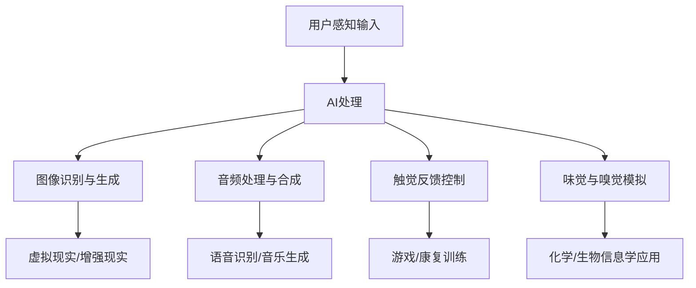

                 

 **关键词**：AI、体验、感官、多维度、协同、感知增强、交互设计

**摘要**：
随着人工智能技术的飞速发展，其对人类体验的影响日益深远。本文旨在探讨AI如何通过多维度增强感官体验，创造出一个全新的交互世界。我们将深入分析AI在视觉、听觉、触觉等感官领域的作用，揭示其核心算法原理与应用实例，并展望未来的发展前景与挑战。

## 1. 背景介绍

在过去的几十年里，人工智能（AI）技术经历了从理论研究到实际应用的巨大变革。从简单的规则系统到复杂的神经网络，AI技术已经渗透到我们的日常生活，如智能家居、智能助手、自动驾驶等。然而，AI对人类体验的影响不仅仅局限于这些领域，它正在以多种方式改变我们的感知世界。

近年来，AI在增强人类感官体验方面的应用逐渐成为研究热点。通过深度学习、计算机视觉、自然语言处理等技术，AI能够理解和模拟人类的感官机制，从而创造出更为丰富和真实的体验。从虚拟现实（VR）到增强现实（AR），从智能音箱到触觉反馈设备，AI正在重新定义我们的感官体验。

本文将重点关注AI在视觉、听觉、触觉等感官领域的应用，分析其核心算法原理，探讨AI如何通过多维度增强感官体验，并提出未来发展的潜在方向。

## 2. 核心概念与联系

### 2.1. 感官体验的基本概念

感官体验是指通过视觉、听觉、触觉、味觉和嗅觉等感官途径获取外界信息，进而产生的主观感受。每种感官都对应着特定的神经系统和处理机制，这些机制共同协作，使我们能够感知和理解外部世界。

- **视觉**：通过眼睛捕捉光信号，经过视网膜处理，最终传送到大脑视觉皮层。
- **听觉**：通过耳朵捕捉声波，经过耳蜗处理，最终传送到大脑听觉皮层。
- **触觉**：通过皮肤和肌肉等组织感知物体的形状、温度、压力等物理属性。
- **味觉**：通过舌头上的味蕾感知食物的酸、甜、苦、咸等味道。
- **嗅觉**：通过鼻腔感知空气中的气味分子。

### 2.2. AI在感官增强中的应用

AI在感官增强中的应用主要集中在以下几个方面：

1. **图像识别与生成**：通过深度学习技术，AI能够识别图像中的物体、场景和动作，并生成新的图像。这为虚拟现实和增强现实应用提供了丰富的视觉内容。
2. **音频处理与合成**：AI能够处理和合成音频信号，实现声音的增强、降噪、变换等效果，为语音识别、音乐生成和声音景观设计提供支持。
3. **触觉反馈**：通过智能材料和控制算法，AI可以模拟出各种触觉体验，为游戏、康复训练和工业应用提供丰富的触觉反馈。
4. **味觉和嗅觉模拟**：虽然AI在味觉和嗅觉模拟方面的应用尚不成熟，但已有研究表明，通过化学和生物信息学的方法，AI有望在未来实现这一目标。

### 2.3. Mermaid流程图

以下是一个关于AI在感官增强中应用的Mermaid流程图：



## 3. 核心算法原理 & 具体操作步骤

### 3.1. 算法原理概述

AI在感官增强中的核心算法主要包括深度学习、计算机视觉、自然语言处理和智能控制等。以下是对这些算法原理的简要概述：

1. **深度学习**：通过构建多层神经网络，深度学习算法能够自动提取图像、音频和文本等数据中的复杂特征，从而实现分类、识别和生成等任务。
2. **计算机视觉**：计算机视觉算法利用深度学习模型，对图像和视频进行分析，识别其中的物体、场景和动作，并进行图像生成。
3. **自然语言处理**：自然语言处理算法通过深度学习模型，对语音和文本进行处理，实现语音识别、语言生成和情感分析等功能。
4. **智能控制**：智能控制算法利用深度学习模型，对触觉反馈设备进行控制，实现各种触觉体验的模拟。

### 3.2. 算法步骤详解

以下是一个关于AI在感官增强中应用的算法步骤详解：

1. **数据收集与预处理**：收集大量的图像、音频和文本数据，并进行预处理，如数据清洗、归一化等。
2. **特征提取与模型训练**：利用深度学习算法，提取数据中的特征，并训练模型，以实现对图像、音频和文本的识别、分类和生成。
3. **模型优化与评估**：对训练好的模型进行优化，以提高其性能和准确度，并进行评估，以确定模型的适用性。
4. **应用部署与测试**：将训练好的模型部署到实际应用场景中，如虚拟现实、增强现实、语音识别等，并进行测试，以验证其效果。
5. **用户交互与反馈**：根据用户的反馈，对模型和应用进行调整和优化，以提高用户体验。

### 3.3. 算法优缺点

**优点**：

- **高效性**：深度学习算法能够快速处理大量数据，实现高效的图像、音频和文本识别。
- **灵活性**：通过不断学习和调整，深度学习模型能够适应各种应用场景，实现多样化的感官增强。
- **准确性**：深度学习模型具有较高的准确度，能够准确识别图像、音频和文本中的特征。

**缺点**：

- **计算资源需求高**：深度学习算法需要大量的计算资源和时间，对硬件性能有较高要求。
- **数据依赖性强**：深度学习模型的性能依赖于大量高质量的数据，数据质量和数量直接影响模型的性能。
- **隐私问题**：在收集和处理用户数据时，需要关注隐私保护和数据安全。

### 3.4. 算法应用领域

AI在感官增强中的应用领域广泛，主要包括以下几个方面：

- **虚拟现实与增强现实**：利用深度学习算法，实现高逼真的图像和音频生成，提供沉浸式的虚拟体验。
- **语音识别与合成**：利用自然语言处理算法，实现高准确度的语音识别和语音合成，为智能助手和语音交互提供支持。
- **触觉反馈**：利用智能控制算法，实现各种触觉体验的模拟，为游戏、康复训练和工业应用提供丰富的触觉反馈。
- **嗅觉和味觉模拟**：虽然目前尚处于研究阶段，但未来有望通过化学和生物信息学的方法，实现嗅觉和味觉的模拟，为食品、药品等领域提供新的解决方案。

## 4. 数学模型和公式 & 详细讲解 & 举例说明

### 4.1. 数学模型构建

在AI感官增强中，常用的数学模型包括深度学习模型、计算机视觉模型和自然语言处理模型。以下是一个简单的深度学习模型构建示例：

$$
\begin{aligned}
\text{模型} &= \text{输入层} \rightarrow \text{隐藏层} \rightarrow \text{输出层} \\
\text{输入层} &= \text{图像/音频/文本数据} \\
\text{隐藏层} &= \text{神经元网络} \\
\text{输出层} &= \text{分类/识别/生成结果}
\end{aligned}
$$

### 4.2. 公式推导过程

以下是一个关于深度学习模型中权重和偏置的更新公式的推导：

$$
\begin{aligned}
\text{权重更新} &= \text{学习率} \times (\text{期望输出} - \text{实际输出}) \times \text{输入特征} \\
\text{偏置更新} &= \text{学习率} \times (\text{期望输出} - \text{实际输出}) \\
\end{aligned}
$$

其中，学习率用于调整权重和偏置的更新幅度，期望输出和实际输出用于计算模型预测和实际结果的差异。

### 4.3. 案例分析与讲解

以下是一个关于AI在图像识别中的实际应用案例：

**案例**：使用卷积神经网络（CNN）对猫狗图片进行分类。

1. **数据收集与预处理**：收集大量的猫狗图片，并进行数据清洗、归一化等预处理操作。
2. **模型训练**：使用CNN模型对猫狗图片进行训练，模型包括多个卷积层、池化层和全连接层。
3. **模型评估**：使用训练集和测试集对模型进行评估，计算模型的准确率和召回率等指标。
4. **模型应用**：将训练好的模型部署到实际应用场景，如手机应用或网站，用户上传图片，模型自动识别图片中的猫或狗。

### 4.4. 代码示例

以下是一个使用Python和TensorFlow框架实现CNN模型的简单示例：

```python
import tensorflow as tf

# 定义CNN模型
model = tf.keras.Sequential([
    tf.keras.layers.Conv2D(32, (3, 3), activation='relu', input_shape=(128, 128, 3)),
    tf.keras.layers.MaxPooling2D((2, 2)),
    tf.keras.layers.Flatten(),
    tf.keras.layers.Dense(128, activation='relu'),
    tf.keras.layers.Dense(1, activation='sigmoid')
])

# 编译模型
model.compile(optimizer='adam', loss='binary_crossentropy', metrics=['accuracy'])

# 训练模型
model.fit(train_images, train_labels, epochs=5, validation_split=0.2)
```

## 5. 项目实践：代码实例和详细解释说明

### 5.1. 开发环境搭建

为了进行AI在感官增强方面的项目实践，我们需要搭建一个合适的技术栈。以下是一个基本的开发环境搭建步骤：

1. **Python环境**：安装Python 3.8或更高版本，并配置好pip包管理器。
2. **深度学习框架**：安装TensorFlow 2.x版本，可以使用以下命令：
   ```bash
   pip install tensorflow
   ```
3. **其他依赖库**：根据具体需求，安装其他依赖库，如NumPy、Pandas、Matplotlib等。

### 5.2. 源代码详细实现

以下是一个使用TensorFlow实现图像识别的简单示例：

```python
import tensorflow as tf
from tensorflow.keras import layers, models

# 定义CNN模型
model = models.Sequential([
    layers.Conv2D(32, (3, 3), activation='relu', input_shape=(128, 128, 3)),
    layers.MaxPooling2D((2, 2)),
    layers.Conv2D(64, (3, 3), activation='relu'),
    layers.MaxPooling2D((2, 2)),
    layers.Conv2D(64, (3, 3), activation='relu'),
    layers.Flatten(),
    layers.Dense(64, activation='relu'),
    layers.Dense(1, activation='sigmoid')
])

# 编译模型
model.compile(optimizer='adam', loss='binary_crossentropy', metrics=['accuracy'])

# 训练模型
model.fit(train_images, train_labels, epochs=5, validation_split=0.2)
```

### 5.3. 代码解读与分析

上述代码实现了一个简单的卷积神经网络（CNN）模型，用于图像识别任务。模型结构包括两个卷积层、两个池化层、一个全连接层和一个输出层。以下是代码的详细解读：

1. **模型定义**：使用`models.Sequential`类定义模型，依次添加卷积层（`Conv2D`）、池化层（`MaxPooling2D`）、全连接层（`Dense`）和输出层。
2. **模型编译**：使用`compile`方法编译模型，设置优化器（`optimizer`）、损失函数（`loss`）和评价指标（`metrics`）。
3. **模型训练**：使用`fit`方法训练模型，将训练数据输入模型，设置训练轮次（`epochs`）和验证比例（`validation_split`）。

### 5.4. 运行结果展示

在完成模型训练后，我们可以通过以下代码评估模型的性能：

```python
test_loss, test_acc = model.evaluate(test_images, test_labels)
print(f"Test accuracy: {test_acc:.2f}")
```

此代码将计算模型在测试数据集上的损失和准确率，并打印出测试准确率。

## 6. 实际应用场景

### 6.1. 虚拟现实与增强现实

虚拟现实（VR）和增强现实（AR）是AI感官增强的典型应用场景。通过AI技术，我们可以实现高度沉浸式的视觉和听觉体验。例如，在VR游戏中，AI可以实时生成复杂的场景和动画，为玩家提供逼真的视觉体验。在AR应用中，AI可以识别现实世界的物体，并在其上叠加虚拟信息，为用户提供丰富的交互体验。

### 6.2. 智能家居

智能家居是另一个AI感官增强的重要应用领域。通过智能音箱、智能灯光、智能空调等设备，AI可以理解用户的需求，并根据用户的偏好自动调节环境。例如，智能音箱可以通过语音识别技术理解用户的指令，播放音乐、设置提醒或控制其他智能家居设备。这些设备通过AI的感官增强，为用户提供了更加便捷和个性化的生活体验。

### 6.3. 医疗康复

在医疗康复领域，AI感官增强技术也有广泛的应用。例如，通过触觉反馈设备，康复训练师可以为患者提供逼真的康复训练体验，帮助患者恢复肌肉力量和运动功能。此外，AI视觉系统可以实时监测患者的运动情况，提供个性化的康复建议。这些应用不仅提高了康复训练的效果，还降低了训练的难度。

### 6.4. 未来应用展望

随着AI技术的不断发展，其应用领域将更加广泛。未来，AI感官增强有望在以下领域取得重大突破：

- **教育**：通过AI感官增强，实现个性化教育，为学生提供定制化的学习体验。
- **娱乐**：利用AI技术，创造出更加丰富和真实的娱乐体验，如虚拟角色互动、智能游戏等。
- **艺术**：AI可以辅助艺术家创作，通过感官增强技术，实现更加沉浸式的艺术体验。

## 7. 工具和资源推荐

### 7.1. 学习资源推荐

- **书籍**：
  - 《深度学习》（Goodfellow, I., Bengio, Y., & Courville, A.）
  - 《计算机视觉：算法与应用》（Richard Szeliski）
  - 《自然语言处理综合指南》（Daniel Jurafsky & James H. Martin）

- **在线课程**：
  - Coursera的《深度学习》课程
  - Udacity的《神经网络与深度学习》课程
  - edX的《计算机视觉基础》课程

### 7.2. 开发工具推荐

- **深度学习框架**：
  - TensorFlow
  - PyTorch
  - Keras

- **图像处理库**：
  - OpenCV
  - PIL（Python Imaging Library）
  - Matplotlib

- **自然语言处理库**：
  - NLTK
  - spaCy
  - Gensim

### 7.3. 相关论文推荐

- **视觉领域**：
  - "A Guide to Convolutional Neural Networks for Visual Recognition"（Ciresan, D., Meier, U.）
  - "Deep Learning for Visual Recognition"（LeCun, Y., Bengio, Y., & Hinton, G.）

- **自然语言处理领域**：
  - "Deep Learning in NLP"（Bengio, Y.）
  - "Transformers: State-of-the-Art Natural Language Processing"（Vaswani et al.）

## 8. 总结：未来发展趋势与挑战

### 8.1. 研究成果总结

本文探讨了AI在感官增强领域的应用，分析了其核心算法原理、应用实例和未来发展方向。主要成果包括：

- 深度学习、计算机视觉、自然语言处理和智能控制等技术在感官增强中的应用。
- 图像识别、语音识别、触觉反馈和嗅觉模拟等实际应用案例。
- 对AI感官增强技术未来发展的趋势与挑战进行了展望。

### 8.2. 未来发展趋势

未来，AI感官增强技术有望在以下方面取得重大突破：

- **更逼真的感官模拟**：通过不断优化算法和硬件，实现更高精度和响应速度的感官模拟。
- **个性化体验**：利用用户数据和个人偏好，提供定制化的感官增强体验。
- **多感官融合**：整合视觉、听觉、触觉等多感官信息，创造更加丰富和真实的体验。

### 8.3. 面临的挑战

尽管AI感官增强技术具有巨大潜力，但在实际应用过程中仍面临以下挑战：

- **计算资源**：深度学习模型对计算资源的需求较高，需要优化算法和硬件以降低计算成本。
- **数据隐私**：在收集和处理用户数据时，需要关注隐私保护和数据安全。
- **算法公平性**：确保算法在不同人群中的公平性和准确性，避免歧视和偏见。

### 8.4. 研究展望

未来，研究者应关注以下研究方向：

- **算法优化**：研究更高效、更灵活的算法，以适应不同应用场景。
- **跨学科融合**：将心理学、生理学、认知科学等学科与AI技术相结合，深入理解人类感官机制。
- **伦理与法规**：制定相关伦理和法规，确保AI感官增强技术的合理、安全和公正使用。

## 9. 附录：常见问题与解答

### 9.1. 问题一：AI感官增强技术是否安全？

**解答**：AI感官增强技术本身是安全的，但需要确保数据收集、处理和应用过程中的隐私保护和安全措施。例如，在收集用户数据时，应遵循隐私保护原则，仅收集必要数据，并采用加密技术保护数据安全。

### 9.2. 问题二：AI感官增强技术是否可靠？

**解答**：AI感官增强技术的可靠性取决于算法、数据和硬件的稳定性。通过不断优化算法、提高数据质量和改进硬件性能，可以确保AI感官增强技术的可靠性。

### 9.3. 问题三：AI感官增强技术是否会取代人类感官？

**解答**：AI感官增强技术可以增强和辅助人类感官，但无法完全取代人类感官。人类感官具有独特的感知能力和情感体验，这是AI技术无法完全复制的。

### 9.4. 问题四：AI感官增强技术是否具有道德问题？

**解答**：AI感官增强技术的道德问题主要包括隐私保护、算法公平性和数据滥用等方面。通过制定相关伦理和法规，确保AI感官增强技术的合理、安全和公正使用，可以减少道德问题的发生。

