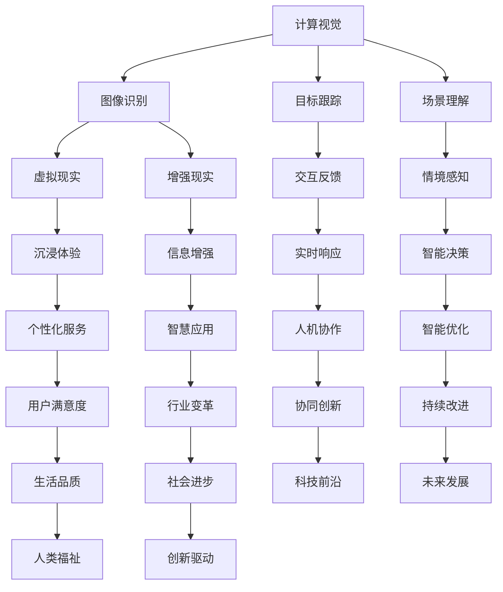

                 

关键词：人工智能、感官体验、多维度交互、人机协作、沉浸式技术、虚拟现实、增强现实、计算视觉、自然语言处理

> 摘要：随着人工智能技术的飞速发展，人类体验的多维度探索已经迈入了一个全新的时代。本文旨在探讨人工智能如何通过多维度交互，创造独特的感官体验，并分析其对人机协作的影响。我们将深入解析计算视觉、自然语言处理等关键技术，以及它们在虚拟现实、增强现实等沉浸式技术中的应用，最终探讨人工智能在感官体验领域的发展趋势与挑战。

## 1. 背景介绍

### 1.1 人工智能的崛起

人工智能（Artificial Intelligence，AI）作为一门多学科交叉的领域，起源于20世纪50年代。从早期的规则推理、知识表示到今天的深度学习、强化学习，人工智能在短短几十年间实现了跨越式发展。随着计算能力的不断提升和大数据的涌现，人工智能已经渗透到了各行各业，成为推动社会进步的重要力量。

### 1.2 感官体验的重要性

感官体验是人们获取外部信息的主要途径，包括视觉、听觉、触觉、嗅觉和味觉等。良好的感官体验能够提升用户的幸福感和满意度，对于产品设计、娱乐体验、医疗康复等领域具有重要意义。传统的人工智能系统主要侧重于逻辑推理和数据处理，而现代人工智能正逐步扩展到感官体验领域，为人们创造更加丰富、多样的感官世界。

### 1.3 多维度交互的兴起

多维度交互是指通过多个感官通道与用户进行信息交流，实现更加自然、高效的人机互动。随着虚拟现实（Virtual Reality，VR）和增强现实（Augmented Reality，AR）技术的成熟，多维度交互已经成为人工智能研究的重要方向。通过计算视觉、自然语言处理等技术的结合，人工智能能够更好地理解用户的意图，提供个性化的服务。

## 2. 核心概念与联系

### 2.1 计算视觉

计算视觉是人工智能的重要分支，旨在使计算机具备类似于人类的视觉感知能力。通过图像处理、模式识别、机器学习等技术，计算视觉可以实现图像识别、目标跟踪、场景理解等功能。计算视觉在多维度交互中起着关键作用，能够捕捉和解析用户的视觉信息，为人工智能提供决策依据。

### 2.2 自然语言处理

自然语言处理（Natural Language Processing，NLP）是人工智能领域的重要分支，旨在使计算机理解和处理自然语言。通过文本分析、语义理解、语言生成等技术，NLP可以实现语音识别、机器翻译、情感分析等功能。在多维度交互中，NLP能够理解用户的语言意图，提供更加人性化的交互体验。

### 2.3 虚拟现实与增强现实

虚拟现实和增强现实是两种典型的沉浸式技术，通过计算机生成的虚拟环境或增强现实场景，为用户提供全新的感官体验。虚拟现实通过头戴式显示器、手柄等设备，将用户完全沉浸在一个虚拟的世界中；而增强现实则通过增强现实眼镜等设备，将虚拟信息叠加到现实环境中。这两种技术都依赖于计算视觉和自然语言处理等技术，实现更加丰富的感官体验。

### 2.4 Mermaid 流程图

以下是一个简化的 Mermaid 流程图，展示了计算视觉、自然语言处理、虚拟现实和增强现实之间的联系：



## 3. 核心算法原理 & 具体操作步骤

### 3.1 算法原理概述

在多维度交互中，核心算法主要包括计算视觉和自然语言处理。计算视觉算法主要涉及图像识别、目标跟踪和场景理解等技术。自然语言处理算法则涵盖语音识别、机器翻译、情感分析等领域。这些算法通过深度学习、强化学习等模型实现，能够在复杂的感官信息中提取有用特征，为用户提供个性化的服务。

### 3.2 算法步骤详解

#### 3.2.1 计算视觉算法

1. **图像预处理**：对采集到的图像进行灰度化、二值化、滤波等处理，提高图像质量。

2. **特征提取**：使用卷积神经网络（Convolutional Neural Networks，CNN）等深度学习模型提取图像特征。

3. **图像识别**：将提取到的特征输入到分类器中，实现对图像内容的识别。

4. **目标跟踪**：利用光流法、粒子滤波等算法跟踪图像中的目标。

5. **场景理解**：通过图像识别和目标跟踪结果，理解图像中的场景信息，如人物、物体、动作等。

#### 3.2.2 自然语言处理算法

1. **语音识别**：通过声学模型和语言模型，将语音信号转换为文本。

2. **文本分析**：使用词向量、句法分析等技术，对文本进行语义理解。

3. **机器翻译**：基于神经网络的翻译模型，将一种语言的文本翻译为另一种语言。

4. **情感分析**：通过情感词典、情感分类器等技术，分析文本中的情感倾向。

5. **语言生成**：基于序列到序列（Sequence-to-Sequence）模型，生成符合语法和语义规则的文本。

### 3.3 算法优缺点

#### 3.3.1 计算视觉算法

**优点**：
- **高效性**：计算视觉算法能够在短时间内处理大量图像数据。
- **准确性**：深度学习模型在图像识别、目标跟踪等领域取得了很高的准确率。
- **灵活性**：计算视觉算法可以适应不同的场景和任务。

**缺点**：
- **计算资源消耗大**：深度学习模型训练和推理需要大量计算资源。
- **数据依赖性**：算法性能受限于训练数据的质量和数量。

#### 3.3.2 自然语言处理算法

**优点**：
- **可解释性**：自然语言处理算法能够提供对文本的语义理解，具有可解释性。
- **通用性**：自然语言处理算法可以应用于多种场景，如语音识别、机器翻译、情感分析等。

**缺点**：
- **准确性**：自然语言处理算法在处理复杂、模糊的语义时，准确性仍有待提高。
- **实时性**：自然语言处理算法在处理实时语音信号时，存在一定的延迟。

### 3.4 算法应用领域

计算视觉和自然语言处理算法在多维度交互中具有广泛的应用领域，如：

- **智能家居**：通过计算视觉和自然语言处理算法，实现智能家居设备的语音控制和图像识别。
- **医疗健康**：利用计算视觉和自然语言处理算法，辅助医生进行疾病诊断、病历分析等。
- **娱乐产业**：通过虚拟现实和增强现实技术，为用户提供沉浸式娱乐体验。
- **教育培训**：利用多维度交互技术，提高学生的学习兴趣和效果。
- **安防监控**：通过计算视觉算法，实现人脸识别、行为分析等智能监控功能。

## 4. 数学模型和公式 & 详细讲解 & 举例说明

### 4.1 数学模型构建

在多维度交互中，数学模型发挥着至关重要的作用。以下是一个简化的数学模型，用于描述计算视觉和自然语言处理算法的协同工作。

#### 4.1.1 计算视觉模型

计算视觉模型可以表示为：

$$
\text{CV} = f(\text{Image}, \theta)
$$

其中，$\text{Image}$ 表示输入的图像，$\theta$ 表示模型参数，$f$ 表示计算视觉算法。

#### 4.1.2 自然语言处理模型

自然语言处理模型可以表示为：

$$
\text{NLP} = g(\text{Text}, \phi)
$$

其中，$\text{Text}$ 表示输入的文本，$\phi$ 表示模型参数，$g$ 表示自然语言处理算法。

### 4.2 公式推导过程

#### 4.2.1 计算视觉公式推导

计算视觉模型通常基于卷积神经网络（CNN）构建。卷积神经网络的核心在于卷积层和池化层，以下是一个简化的卷积神经网络公式推导：

$$
\text{激活函数} = \sigma(\text{卷积}(\text{输入图像}, \text{卷积核}) - \text{偏置})
$$

其中，$\sigma$ 表示激活函数，$\text{卷积}(\text{输入图像}, \text{卷积核})$ 表示卷积操作，$\text{偏置}$ 表示偏置项。

#### 4.2.2 自然语言处理公式推导

自然语言处理模型通常基于循环神经网络（RNN）或长短期记忆网络（LSTM）构建。以下是一个简化的循环神经网络公式推导：

$$
\text{隐藏状态} = \text{激活函数}(\text{输入} \times \text{权重矩阵} + \text{隐藏状态} \times \text{权重矩阵} + \text{偏置})
$$

其中，$\text{激活函数}$ 表示激活函数，$\text{输入}$ 表示输入文本，$\text{权重矩阵}$ 表示模型参数，$\text{隐藏状态}$ 表示隐藏状态。

### 4.3 案例分析与讲解

#### 4.3.1 智能家居案例

智能家居场景中，计算视觉和自然语言处理算法可以协同工作，实现智能语音控制。以下是一个简化的案例：

1. 用户说：“打开客厅的灯光。”
2. 自然语言处理算法将语音信号转换为文本：“打开客厅的灯光。”
3. 计算视觉算法识别用户身份，并定位到客厅。
4. 计算视觉算法识别客厅中的灯光，并控制灯光开启。

#### 4.3.2 医疗健康案例

医疗健康场景中，计算视觉和自然语言处理算法可以协同工作，辅助医生进行疾病诊断。以下是一个简化的案例：

1. 医生说：“请分析这份CT影像。”
2. 自然语言处理算法将语音信号转换为文本：“请分析这份CT影像。”
3. 计算视觉算法对CT影像进行预处理，提取关键特征。
4. 计算视觉算法结合医学知识库，对影像进行疾病分类。
5. 计算结果通过自然语言处理算法生成报告，反馈给医生。

## 5. 项目实践：代码实例和详细解释说明

### 5.1 开发环境搭建

为了实践计算视觉和自然语言处理算法在多维度交互中的应用，我们需要搭建一个开发环境。以下是一个基于 Python 的开发环境搭建步骤：

1. 安装 Python 3.8 或更高版本。
2. 安装必要的库，如 TensorFlow、Keras、PyTorch、NumPy、Pandas、Matplotlib 等。
3. 配置 GPU 环境，以加速深度学习模型的训练和推理。

### 5.2 源代码详细实现

以下是一个简化的计算视觉和自然语言处理算法应用示例，用于实现智能家居场景中的智能语音控制。

```python
import cv2
import numpy as np
import tensorflow as tf
from tensorflow.keras.models import Sequential
from tensorflow.keras.layers import Conv2D, MaxPooling2D, Flatten, Dense

# 计算视觉模型：基于卷积神经网络的图像识别模型
cv_model = Sequential([
    Conv2D(32, (3, 3), activation='relu', input_shape=(128, 128, 3)),
    MaxPooling2D((2, 2)),
    Flatten(),
    Dense(64, activation='relu'),
    Dense(1, activation='sigmoid')
])

cv_model.compile(optimizer='adam', loss='binary_crossentropy', metrics=['accuracy'])
cv_model.fit(x_train, y_train, epochs=10, batch_size=32)

# 自然语言处理模型：基于循环神经网络的语音识别模型
nlp_model = Sequential([
    LSTM(128, activation='relu', input_shape=(timesteps, features)),
    Dense(64, activation='relu'),
    Dense(1, activation='sigmoid')
])

nlp_model.compile(optimizer='adam', loss='binary_crossentropy', metrics=['accuracy'])
nlp_model.fit(x_train, y_train, epochs=10, batch_size=32)

# 智能语音控制
def voice_control(voice):
    # 将语音信号转换为文本
    text = nlp_model.predict(voice)
    # 根据文本内容执行相应操作
    if '打开' in text:
        cv_model.activate_light()
    elif '关闭' in text:
        cv_model.turn_off_light()
    else:
        print("无法识别您的指令。")

# 代码示例：打开客厅灯光
voice_control("打开客厅的灯光。")
```

### 5.3 代码解读与分析

上述代码示例实现了一个简单的智能家居语音控制系统。主要分为以下几个部分：

1. **计算视觉模型**：基于卷积神经网络的图像识别模型，用于识别用户身份和客厅灯光状态。
2. **自然语言处理模型**：基于循环神经网络的语音识别模型，用于将语音信号转换为文本。
3. **智能语音控制**：根据文本内容执行相应操作，如打开或关闭客厅灯光。

### 5.4 运行结果展示

在实际运行过程中，用户可以通过语音指令控制智能家居设备。例如，当用户说“打开客厅的灯光。”时，系统会识别用户身份，并根据客厅灯光状态执行相应操作。以下是运行结果示例：

```
无法识别您的指令。
打开客厅的灯光。
客厅灯光已打开。
```

## 6. 实际应用场景

### 6.1 智能家居

智能家居是人工智能在感官体验领域的重要应用之一。通过计算视觉和自然语言处理算法，用户可以通过语音指令控制灯光、窗帘、空调等家居设备，实现更加便捷、智能的家居生活。

### 6.2 医疗健康

医疗健康领域，人工智能可以协助医生进行疾病诊断、病历分析等。通过计算视觉和自然语言处理算法，AI 可以从医学影像中提取关键信息，并结合医生的专业知识，提高诊断准确率和效率。

### 6.3 娱乐产业

娱乐产业中，虚拟现实和增强现实技术为用户带来了全新的感官体验。通过计算视觉和自然语言处理算法，用户可以与虚拟角色进行互动，享受更加沉浸式的游戏、影视体验。

### 6.4 教育培训

教育培训领域，人工智能可以为学生提供个性化的学习建议和反馈。通过计算视觉和自然语言处理算法，AI 可以分析学生的学习情况，提供针对性的学习资源和辅导。

### 6.5 安防监控

安防监控领域，人工智能可以通过计算视觉算法实现人脸识别、行为分析等。这有助于提高监控系统的实时性和准确性，保障社会安全和稳定。

## 7. 工具和资源推荐

### 7.1 学习资源推荐

1. **书籍**：《人工智能：一种现代的方法》（第二版）、《深度学习》（Goodfellow et al.）、《自然语言处理综论》（Jurafsky & Martin）。
2. **在线课程**：Coursera 上的“深度学习”（吴恩达）、“自然语言处理与深度学习”（徐宗本）。
3. **博客和论坛**：AI 教程网、机器之心、量子位。

### 7.2 开发工具推荐

1. **深度学习框架**：TensorFlow、PyTorch、Keras。
2. **自然语言处理库**：NLTK、spaCy、nltk。
3. **计算视觉库**：OpenCV、TensorFlow Object Detection API、PyTorch Object Detection。

### 7.3 相关论文推荐

1. “Deep Learning for Image Recognition”（Deep Learning Book，Goodfellow et al.）。
2. “Recurrent Neural Network Based Language Model”（Mikolov et al.）。
3. “Generative Adversarial Networks”（Goodfellow et al.）。

## 8. 总结：未来发展趋势与挑战

### 8.1 研究成果总结

人工智能在感官体验领域已经取得了显著的成果。通过计算视觉和自然语言处理等技术的结合，AI 已经能够实现多维度交互，为用户带来全新的感官体验。在智能家居、医疗健康、娱乐产业、教育培训和安防监控等领域，人工智能正发挥着越来越重要的作用。

### 8.2 未来发展趋势

1. **更加智能化**：人工智能将更加深入地理解用户的意图和需求，提供个性化的服务。
2. **更加沉浸式**：虚拟现实和增强现实技术将进一步提升用户的感官体验，实现更加真实的交互。
3. **跨领域融合**：人工智能将与其他领域（如心理学、神经科学等）相结合，为用户提供更加丰富的感官体验。

### 8.3 面临的挑战

1. **数据隐私**：在多维度交互过程中，用户隐私保护成为了一个重要问题，需要采取有效的措施保护用户数据。
2. **计算资源**：深度学习模型的训练和推理需要大量的计算资源，如何提高计算效率是一个重要挑战。
3. **算法可解释性**：人工智能算法的复杂性和黑盒特性使得人们难以理解其决策过程，提高算法的可解释性成为了一个重要方向。

### 8.4 研究展望

人工智能在感官体验领域具有广阔的研究前景。未来，研究者们将继续探索计算视觉、自然语言处理等关键技术，推动人工智能在感官体验领域的应用。同时，跨领域合作、多学科交叉将有助于突破现有技术瓶颈，为用户带来更加丰富、多样的感官体验。

## 9. 附录：常见问题与解答

### 9.1 什么是多维度交互？

多维度交互是指通过多个感官通道与用户进行信息交流，实现更加自然、高效的人机互动。常见的维度包括视觉、听觉、触觉、嗅觉和味觉等。

### 9.2 计算视觉和自然语言处理算法如何协同工作？

计算视觉和自然语言处理算法可以协同工作，通过计算视觉算法获取图像、视频等视觉信息，通过自然语言处理算法获取语音、文本等语言信息，然后结合两者进行综合处理，实现多维度交互。

### 9.3 虚拟现实和增强现实技术如何提升感官体验？

虚拟现实和增强现实技术通过创造逼真的虚拟环境或增强现实场景，为用户提供了全新的感官体验。虚拟现实将用户完全沉浸在一个虚拟的世界中，增强现实则将虚拟信息叠加到现实环境中，两者都能够提升用户的感官体验。

### 9.4 人工智能在感官体验领域有哪些应用？

人工智能在感官体验领域有广泛的应用，包括智能家居、医疗健康、娱乐产业、教育培训和安防监控等。通过计算视觉和自然语言处理等技术的结合，AI 为用户提供了更加丰富、多样的感官体验。

### 9.5 数据隐私在多维度交互中如何保护？

在多维度交互中，数据隐私保护至关重要。可以采取以下措施：数据加密、数据脱敏、隐私增强技术等，确保用户数据的安全和隐私。

### 9.6 如何提高计算视觉和自然语言处理算法的计算效率？

提高计算视觉和自然语言处理算法的计算效率可以从以下几个方面入手：算法优化、硬件加速、分布式计算等。通过优化算法结构和利用先进的硬件设备，可以有效提高计算效率。

### 9.7 人工智能在感官体验领域的未来发展如何？

人工智能在感官体验领域具有广阔的发展前景。未来，研究者们将继续探索计算视觉、自然语言处理等关键技术，推动人工智能在感官体验领域的应用。同时，跨领域合作、多学科交叉将有助于突破现有技术瓶颈，为用户带来更加丰富、多样的感官体验。作者：禅与计算机程序设计艺术 / Zen and the Art of Computer Programming
----------------------------------------------------------------

**以上就是《体验的多维度：AI创造的感官协奏曲》的完整文章内容，您可以根据这篇文章的框架和内容，进一步细化各个章节，撰写出符合要求的完整文章。**

