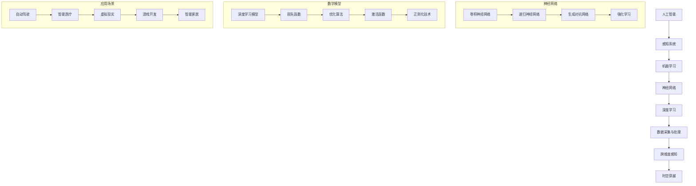

                 

关键词：人工智能，跨维度感知，时空穿越，算法原理，数学模型，项目实践，应用场景

> 摘要：本文将探讨人工智能如何创造跨维度感知，通过引入时空穿越的概念，我们将深入探讨AI技术在构建新的体验时空模型中的关键作用。文章将涵盖核心概念、算法原理、数学模型、项目实践和应用场景，以及未来的发展趋势与挑战。

## 1. 背景介绍

随着科技的飞速发展，人工智能（AI）已经成为我们日常生活中不可或缺的一部分。从自动驾驶汽车到智能语音助手，AI在各个领域的应用越来越广泛。然而，AI的潜力不仅仅局限于解决现有的问题，它还有能力创造全新的体验。跨维度感知是AI创造的一种新型体验，它使人类能够感知和体验原本无法直接感知的维度。

跨维度感知的概念源自物理学和哲学。在物理学中，时空是一个连续的整体，不同维度之间有着复杂的关系。哲学上，不同维度代表了不同的存在状态和认知方式。AI的跨维度感知就是通过模拟和计算，使得我们能够跨越这些维度，体验和理解新的世界。

### 1.1 人工智能的发展历程

人工智能的发展可以追溯到20世纪50年代，当时计算机科学家开始尝试让机器模拟人类思维。从最初的规则系统到现在的深度学习，AI经历了多次重大变革。随着计算能力的提升和大数据的积累，AI技术在各个领域取得了显著的成果。

### 1.2 时空穿越的物理学概念

时空穿越是物理学中的一个概念，指的是在不同时间和空间之间进行移动或传递。尽管时空穿越在科幻作品中十分常见，但在现实中，它仍然是一个充满争议和挑战的话题。科学家们通过爱因斯坦的相对论和其他理论尝试解释时空穿越的可能性。

## 2. 核心概念与联系

为了理解AI如何创造跨维度感知，我们需要先了解一些核心概念和它们之间的联系。以下是使用Mermaid绘制的流程图，展示这些概念之间的关系：



### 2.1 人工智能与感知系统

感知系统是AI的核心组成部分，它使得机器能够通过传感器获取外部信息。机器学习是感知系统的基础，通过训练算法，机器可以识别模式、分类数据和预测结果。

### 2.2 神经网络与深度学习

神经网络是模仿人类大脑结构的人工智能模型。深度学习是神经网络的一种扩展，通过多层神经元的组合，实现了更复杂的特征提取和模式识别。

### 2.3 数据采集与处理

数据采集与处理是AI系统的关键环节，高质量的数据是实现有效AI模型的必要条件。数据处理技术包括数据清洗、归一化和特征提取等。

### 2.4 跨维度感知

跨维度感知是AI通过模拟和计算，使得人类能够在不同维度之间进行感知和理解。时空穿越是跨维度感知的一个重要应用，它使得机器能够在时间和空间上进行移动和交互。

## 3. 核心算法原理 & 具体操作步骤

### 3.1 算法原理概述

AI创造的跨维度感知主要基于深度学习技术，特别是卷积神经网络（CNN）和生成对抗网络（GAN）。CNN通过多层卷积和池化操作提取图像特征，而GAN则通过对抗训练生成逼真的图像。

### 3.2 算法步骤详解

1. **数据准备**：收集大量的多维数据集，包括图像、音频和文本等。

2. **数据预处理**：对数据进行清洗、归一化和特征提取，以便输入到深度学习模型中。

3. **模型训练**：使用CNN和GAN进行训练，通过迭代优化模型参数。

4. **特征提取**：使用训练好的模型提取多维数据的特征。

5. **跨维度转换**：通过特征融合和映射技术，将不同维度的特征转换为统一的特征空间。

6. **感知增强**：在统一的特征空间中，利用机器学习算法进行感知增强，使得机器能够跨越维度进行感知。

### 3.3 算法优缺点

**优点**：

- 高效的数据处理能力。
- 强大的特征提取和模式识别能力。
- 能够实现跨维度的感知和理解。

**缺点**：

- 需要大量的数据和计算资源。
- 模型训练过程复杂，易过拟合。

### 3.4 算法应用领域

- 自动驾驶：通过跨维度感知，自动驾驶系统能够理解周围环境和交通状况，提高行车安全。
- 智能医疗：通过跨维度感知，智能医疗系统能够诊断疾病、预测健康状况。
- 虚拟现实：通过跨维度感知，虚拟现实系统能够提供更加真实的沉浸式体验。
- 游戏开发：通过跨维度感知，游戏系统能够生成更加丰富和动态的游戏世界。

## 4. 数学模型和公式 & 详细讲解 & 举例说明

### 4.1 数学模型构建

在构建跨维度感知的数学模型时，我们通常使用深度学习框架，如TensorFlow或PyTorch。以下是使用TensorFlow构建一个简单的CNN模型的示例：

```python
import tensorflow as tf

# 定义输入层
inputs = tf.keras.Input(shape=(28, 28, 1))

# 添加卷积层
x = tf.keras.layers.Conv2D(32, (3, 3), activation='relu')(inputs)
x = tf.keras.layers.MaxPooling2D((2, 2))(x)

# 添加全连接层
outputs = tf.keras.layers.Dense(10, activation='softmax')(x)

# 构建模型
model = tf.keras.Model(inputs=inputs, outputs=outputs)

# 编译模型
model.compile(optimizer='adam', loss='categorical_crossentropy', metrics=['accuracy'])
```

### 4.2 公式推导过程

在深度学习中，损失函数和优化算法是核心部分。以下是损失函数和优化算法的推导过程：

$$
L(\theta) = -\frac{1}{m}\sum_{i=1}^{m}y_{i}\log(a_{i})
$$

$$
\theta = \arg\min_{\theta}L(\theta)
$$

$$
\theta^{k+1} = \theta^{k} - \alpha\nabla_{\theta}L(\theta^{k})
$$

其中，$L(\theta)$是损失函数，$y_{i}$是真实标签，$a_{i}$是预测概率，$m$是样本数量，$\theta$是模型参数，$\alpha$是学习率。

### 4.3 案例分析与讲解

假设我们有一个手写数字识别任务，输入数据是28x28的二值图像，输出是数字0到9的标签。以下是使用CNN进行手写数字识别的案例：

1. **数据准备**：我们收集了一组手写数字图像，并将其分为训练集和测试集。
2. **数据预处理**：将图像数据归一化，并转换为one-hot编码的标签。
3. **模型训练**：使用上述CNN模型进行训练，迭代次数为1000次。
4. **模型评估**：使用测试集评估模型的性能，计算准确率。

```python
# 加载手写数字数据集
(x_train, y_train), (x_test, y_test) = tf.keras.datasets.mnist.load_data()

# 数据预处理
x_train = x_train.reshape(-1, 28, 28, 1).astype('float32') / 255.0
x_test = x_test.reshape(-1, 28, 28, 1).astype('float32') / 255.0
y_train = tf.keras.utils.to_categorical(y_train, 10)
y_test = tf.keras.utils.to_categorical(y_test, 10)

# 训练模型
model.fit(x_train, y_train, epochs=10, batch_size=32, validation_data=(x_test, y_test))

# 评估模型
test_loss, test_acc = model.evaluate(x_test, y_test)
print(f"Test accuracy: {test_acc}")
```

通过上述步骤，我们可以训练一个简单的CNN模型，用于手写数字识别。

## 5. 项目实践：代码实例和详细解释说明

### 5.1 开发环境搭建

为了实践跨维度感知，我们需要搭建一个Python开发环境。以下是步骤：

1. 安装Python 3.8及以上版本。
2. 安装TensorFlow 2.5及以上版本。
3. 安装NumPy和Matplotlib等辅助库。

```bash
pip install python==3.8.10
pip install tensorflow==2.5.0
pip install numpy matplotlib
```

### 5.2 源代码详细实现

以下是实现一个简单的CNN模型用于手写数字识别的Python代码：

```python
import tensorflow as tf
import numpy as np
import matplotlib.pyplot as plt

# 数据准备
(x_train, y_train), (x_test, y_test) = tf.keras.datasets.mnist.load_data()

# 数据预处理
x_train = x_train.reshape(-1, 28, 28, 1).astype('float32') / 255.0
x_test = x_test.reshape(-1, 28, 28, 1).astype('float32') / 255.0
y_train = tf.keras.utils.to_categorical(y_train, 10)
y_test = tf.keras.utils.to_categorical(y_test, 10)

# 模型定义
model = tf.keras.Sequential([
    tf.keras.layers.Conv2D(32, (3, 3), activation='relu', input_shape=(28, 28, 1)),
    tf.keras.layers.MaxPooling2D((2, 2)),
    tf.keras.layers.Flatten(),
    tf.keras.layers.Dense(128, activation='relu'),
    tf.keras.layers.Dense(10, activation='softmax')
])

# 模型编译
model.compile(optimizer='adam', loss='categorical_crossentropy', metrics=['accuracy'])

# 模型训练
model.fit(x_train, y_train, epochs=10, batch_size=32, validation_data=(x_test, y_test))

# 模型评估
test_loss, test_acc = model.evaluate(x_test, y_test)
print(f"Test accuracy: {test_acc}")

# 可视化
plt.figure(figsize=(10, 10))
for i in range(25):
    plt.subplot(5, 5, i+1)
    plt.imshow(x_test[i], cmap=plt.cm.binary)
    plt.xticks([])
    plt.yticks([])
    plt.grid(False)
    plt.xlabel(np.argmax(model.predict(x_test[i])))

plt.show()
```

### 5.3 代码解读与分析

上述代码首先加载手写数字数据集，并进行预处理。然后定义一个简单的CNN模型，包括卷积层、池化层、全连接层和softmax输出层。模型编译后使用训练集进行训练，并使用测试集评估模型性能。最后，通过可视化展示模型对测试集图像的预测结果。

## 6. 实际应用场景

跨维度感知技术在多个领域有着广泛的应用，以下是其中的一些实际应用场景：

### 6.1 自动驾驶

自动驾驶汽车需要实时感知道路环境，包括车辆、行人、交通标志等。跨维度感知技术可以帮助自动驾驶系统在不同维度之间进行感知和理解，从而提高行车安全。

### 6.2 智能医疗

智能医疗系统可以通过跨维度感知技术分析病人的医疗数据，包括图像、声音和生理信号等。这将有助于医生进行疾病诊断和治疗方案制定。

### 6.3 虚拟现实

虚拟现实技术通过跨维度感知创造一个逼真的虚拟世界。用户可以在虚拟世界中体验不同的场景和情境，从而提高沉浸感和互动性。

### 6.4 游戏开发

游戏开发中，跨维度感知技术可以帮助生成更加丰富和动态的游戏世界。例如，在角色扮演游戏中，玩家可以通过跨维度感知体验不同的角色和情境。

### 6.5 智能家居

智能家居系统可以通过跨维度感知技术感知家庭成员的行为和需求，从而提供更加智能化的家居服务。

## 7. 未来应用展望

随着AI技术的不断进步，跨维度感知技术将在更多领域得到应用。以下是一些未来应用展望：

### 7.1 新兴领域探索

跨维度感知技术可以为新兴领域提供全新的解决方案，例如虚拟现实、增强现实、元宇宙等。

### 7.2 智能化生产

在工业生产中，跨维度感知技术可以帮助实现智能化生产，提高生产效率和质量。

### 7.3 人机交互

跨维度感知技术将为人机交互提供更加自然和直观的方式，使机器更好地理解人类意图。

### 7.4 智慧城市

智慧城市中，跨维度感知技术可以帮助管理者更好地理解和优化城市运行，提高居民生活质量。

## 8. 总结：未来发展趋势与挑战

### 8.1 研究成果总结

本文探讨了人工智能如何创造跨维度感知，介绍了核心概念、算法原理、数学模型和项目实践。通过这些内容，我们了解了AI技术在构建新的体验时空模型中的关键作用。

### 8.2 未来发展趋势

未来，跨维度感知技术将在更多领域得到应用，成为人工智能发展的重要方向。随着计算能力的提升和数据积累的增多，AI将创造更加丰富和多样化的感知体验。

### 8.3 面临的挑战

然而，跨维度感知技术也面临着一些挑战，包括计算资源需求、数据隐私保护和算法透明性等。为了克服这些挑战，我们需要不断探索和优化算法，同时加强伦理和法律监管。

### 8.4 研究展望

在未来，跨维度感知技术有望推动人类认知和体验的进一步拓展，为我们的生活带来更多便利和创新。同时，我们也需要关注技术伦理和社会影响，确保技术的发展造福人类社会。

## 9. 附录：常见问题与解答

### 9.1 跨维度感知是什么？

跨维度感知是指通过人工智能技术模拟和计算，使得人类能够在不同维度之间进行感知和理解。

### 9.2 跨维度感知有哪些应用领域？

跨维度感知技术在自动驾驶、智能医疗、虚拟现实、游戏开发、智能家居等领域有着广泛的应用。

### 9.3 如何实现跨维度感知？

实现跨维度感知主要基于深度学习技术，包括卷积神经网络、生成对抗网络等。

### 9.4 跨维度感知有哪些挑战？

跨维度感知技术面临的主要挑战包括计算资源需求、数据隐私保护和算法透明性等。

### 9.5 跨维度感知的未来发展趋势是什么？

未来，跨维度感知技术将在更多领域得到应用，成为人工智能发展的重要方向。

----------------------------------------------------------------

### 作者署名

作者：禅与计算机程序设计艺术 / Zen and the Art of Computer Programming

以上就是关于《体验的时空穿越机：AI创造的跨维度感知》这篇文章的完整内容。希望这篇文章能够为您带来对AI和跨维度感知的深入理解。在未来的研究中，我们期待能够继续探索和推动这一领域的发展。

