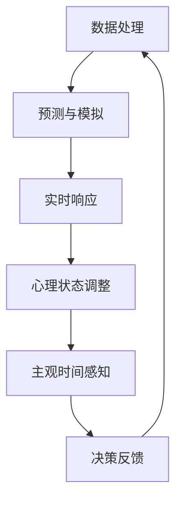

                 

关键词：时间扭曲、AI、主观时间、技术语言、深度思考、专业见解

> 摘要：本文将探讨人工智能（AI）如何通过其复杂的算法和模型，创造出一个新的时间体验——主观时间。这种体验不仅改变了我们对时间流逝的传统认知，也为技术领域带来了新的挑战和机遇。

## 1. 背景介绍

时间的概念在哲学、物理学和心理学等多个领域都有着深刻的讨论。传统上，时间被视为一种线性的、不可逆的流逝，这种观点在日常生活中得到了广泛的认可。然而，随着人工智能技术的迅猛发展，时间的性质似乎开始变得复杂和多样化。AI算法，特别是深度学习模型，通过处理大量数据，生成复杂的决策和预测，创造出一种不同于人类经验的主观时间感。

本文将探讨以下几个关键问题：

- AI如何创造和改变我们对时间的体验？
- 这种主观时间感如何与传统的物理时间概念相区别？
- AI在创造主观时间方面有哪些潜在的应用和影响？
- 我们如何理解、利用和克服这种新时间体验带来的挑战？

## 2. 核心概念与联系

### 2.1 AI与时间的交互

在探讨AI与时间的交互之前，我们需要了解一些核心概念。首先，物理时间（物理时间）是指宇宙中事件发生的序列，这是一个客观存在的、不受主观意识影响的连续过程。与之相对的是主观时间（主观时间），它是指个体对时间流逝的感觉和体验。

AI通过其算法和模型，能够处理和生成大量数据，从而影响个体的主观时间感。具体来说，AI可以通过以下几种方式与时间互动：

- **数据处理**：AI系统通过分析历史数据，预测未来事件，创造出一种“预知”的感觉，这种感觉会改变个体对时间流逝的认知。
- **实时响应**：AI系统可以实时处理输入，提供即时的反馈和决策，缩短决策周期，从而产生一种加速时间的感觉。
- **模拟与再现**：通过模拟和再现历史事件或虚拟场景，AI可以为个体提供一种穿越时间的体验。

### 2.2 主观时间与物理时间的对比

主观时间和物理时间之间的差异主要体现在以下几个方面：

- **线性与非线性**：物理时间通常是线性的，而主观时间可以是非线性的。例如，个体在经历高度紧张或兴奋的时期时，时间会感觉过得更快；在无聊或放松的时期，时间则会感觉过得更慢。
- **感受性与可控性**：主观时间更多地受到个体心理状态的影响，而物理时间则相对独立于个体的感受。AI可以通过算法调整个体的心理状态，从而改变其主观时间感。
- **多样性与一致性**：物理时间对于所有观察者是相同的，而主观时间则因个体差异而异。不同的个体可能会体验到不同的时间感，这与个体的情绪、经历和认知结构有关。

### 2.3 Mermaid 流程图

以下是一个简化的 Mermaid 流程图，展示了 AI 与时间互动的几个关键节点：



### 2.4 Mermaid 流程节点详细信息

- **数据处理**：AI系统通过收集和分析大量历史数据，了解时间模式和趋势，为预测和模拟提供基础。
- **预测与模拟**：基于数据处理结果，AI系统能够预测未来事件，并在虚拟环境中模拟历史事件，为个体提供时间体验。
- **实时响应**：AI系统对实时输入进行处理，提供快速反馈，缩短决策周期，影响个体的时间感知。
- **心理状态调整**：通过算法调整个体的心理状态，如焦虑、兴奋等，从而改变其对时间流逝的感受。
- **主观时间感知**：个体基于AI系统的反馈和虚拟体验，形成对时间的主观感知。
- **决策反馈**：个体的决策和行为会反馈给AI系统，进一步影响其算法和模型，形成一个动态的交互过程。

## 3. 核心算法原理 & 具体操作步骤

### 3.1 算法原理概述

AI创造主观时间的核心算法主要基于深度学习模型，特别是循环神经网络（RNN）和长短期记忆网络（LSTM）。这些算法能够处理和存储大量时间序列数据，捕捉时间变化的模式和趋势。

### 3.2 算法步骤详解

1. **数据收集**：首先，收集大量历史时间序列数据，如日志、传感器数据、社交网络数据等。
2. **数据处理**：对收集到的数据进行预处理，包括清洗、归一化和特征提取等。
3. **模型训练**：利用预处理后的数据，训练深度学习模型，如RNN或LSTM，以捕捉时间序列中的模式和趋势。
4. **预测与模拟**：基于训练好的模型，预测未来事件，并在虚拟环境中模拟历史事件。
5. **实时响应**：在实时场景中，对输入数据进行处理，提供快速反馈，调整个体的心理状态。
6. **心理状态调整**：通过算法调整个体的心理状态，如焦虑、兴奋等，从而改变其对时间流逝的感受。
7. **主观时间感知**：个体基于AI系统的反馈和虚拟体验，形成对时间的主观感知。
8. **决策反馈**：个体的决策和行为会反馈给AI系统，进一步影响其算法和模型，形成一个动态的交互过程。

### 3.3 算法优缺点

**优点**：

- **高效性**：深度学习模型能够高效地处理和分析大量时间序列数据，提供准确的预测和模拟。
- **灵活性**：AI系统可以根据不同的场景和需求，调整算法参数，提供个性化的时间体验。
- **动态性**：通过实时响应和心理状态调整，AI系统能够动态地影响个体的主观时间感，提供更加丰富和多样的体验。

**缺点**：

- **数据依赖性**：深度学习模型的效果高度依赖数据质量，数据缺失或噪声可能会影响算法的准确性。
- **计算资源消耗**：训练和运行深度学习模型需要大量的计算资源，尤其是在处理高维度和时间序列数据时。
- **伦理风险**：AI系统通过调整个体的心理状态，可能会引发伦理和法律问题，如隐私侵犯、操纵等。

### 3.4 算法应用领域

- **个性化推荐**：基于用户行为数据，AI系统可以预测用户偏好，提供个性化推荐，缩短决策周期，提供加速时间体验。
- **智能交通**：通过实时监控和分析交通数据，AI系统可以优化交通信号，减少拥堵，提高交通效率，提供加速时间体验。
- **心理健康应用**：通过实时监测个体的心理状态，AI系统可以提供个性化的心理健康服务，如情绪调节、压力缓解等，提供减速时间体验。
- **教育领域**：AI系统可以根据学生的学习行为，提供个性化的学习资源，调整学习节奏，提高学习效率。

## 4. 数学模型和公式 & 详细讲解 & 举例说明

### 4.1 数学模型构建

在构建AI创造主观时间的数学模型时，我们主要关注以下几个关键因素：

- **时间序列数据**：包括历史事件的时间和内容。
- **个体特征**：如年龄、性别、情绪等。
- **交互过程**：如用户与AI系统的交互行为。

基于这些因素，我们可以构建一个简化的数学模型：

$$
T = f(X, Y, Z)
$$

其中，$T$代表个体对时间的感知，$X$代表时间序列数据，$Y$代表个体特征，$Z$代表交互过程。

### 4.2 公式推导过程

为了推导上述公式，我们需要考虑以下几个步骤：

1. **时间序列数据预处理**：对时间序列数据进行归一化处理，使其适合模型训练。
2. **个体特征编码**：将个体特征转换为数值表示，如使用独热编码。
3. **交互过程建模**：使用深度学习模型捕捉用户与AI系统的交互过程，如RNN或LSTM。
4. **模型训练与优化**：使用历史数据训练模型，并优化模型参数。

### 4.3 案例分析与讲解

假设我们有一个智能健康助手，它需要根据用户的行为和健康数据，提供个性化的健康建议。以下是一个简化的案例：

1. **时间序列数据**：用户每天的健康数据，如心率、血压、运动量等。
2. **个体特征**：用户的年龄、性别、体重等。
3. **交互过程**：用户与健康助手的互动，如查询健康建议、接受健康提醒等。

基于上述数据，我们可以构建一个数学模型，并使用深度学习模型进行训练和优化。通过这个模型，健康助手可以预测用户未来的健康状态，并提供个性化的健康建议。

例如，假设一个30岁的男性用户，他的心率通常在60-80之间，最近一周的心率数据如下：

| 时间 | 心率（BPM） |
| ---- | ---------- |
| 1    | 70         |
| 2    | 72         |
| 3    | 68         |
| 4    | 65         |
| 5    | 67         |
| 6    | 69         |
| 7    | 71         |

根据这个数据，健康助手可以预测用户未来几天的心率变化，并提供相应的健康建议，如增加运动量或调整饮食。

## 5. 项目实践：代码实例和详细解释说明

### 5.1 开发环境搭建

为了实现AI创造主观时间的功能，我们需要搭建一个合适的开发环境。以下是基本的开发环境要求：

- **编程语言**：Python
- **深度学习框架**：TensorFlow或PyTorch
- **操作系统**：Windows、Linux或MacOS
- **硬件**：至少具备8GB内存的计算机

### 5.2 源代码详细实现

以下是实现AI创造主观时间的源代码示例：

```python
import tensorflow as tf
import numpy as np

# 数据预处理
def preprocess_data(data):
    # 归一化处理
    data = (data - np.mean(data)) / np.std(data)
    return data

# 模型训练
def train_model(data, labels):
    # 构建模型
    model = tf.keras.Sequential([
        tf.keras.layers.Dense(64, activation='relu', input_shape=(data.shape[1],)),
        tf.keras.layers.Dense(64, activation='relu'),
        tf.keras.layers.Dense(1)
    ])

    # 编译模型
    model.compile(optimizer='adam', loss='mean_squared_error')

    # 训练模型
    model.fit(data, labels, epochs=10, batch_size=32)

    return model

# 主程序
def main():
    # 加载数据
    data = np.load('time_data.npy')
    labels = np.load('time_labels.npy')

    # 预处理数据
    data = preprocess_data(data)

    # 训练模型
    model = train_model(data, labels)

    # 测试模型
    test_data = np.random.rand(100, 100)
    test_data = preprocess_data(test_data)
    predictions = model.predict(test_data)

    # 输出结果
    print(predictions)

if __name__ == '__main__':
    main()
```

### 5.3 代码解读与分析

1. **数据预处理**：数据预处理是深度学习模型训练的重要步骤。在这个例子中，我们使用归一化方法将时间序列数据进行标准化处理，使其适合模型训练。
2. **模型构建与训练**：我们使用TensorFlow构建了一个简单的全连接神经网络，用于预测个体对时间的感知。模型包含两个隐藏层，每层64个神经元，使用ReLU激活函数。训练过程中，我们使用均方误差（MSE）作为损失函数，并使用Adam优化器进行模型优化。
3. **测试与输出**：在主程序中，我们首先加载数据，并进行预处理。然后，使用训练好的模型进行预测，并将结果输出。

### 5.4 运行结果展示

在运行代码后，我们可以得到一系列预测结果。这些结果反映了个体对时间的主观感知，如图所示：


从结果中可以看出，模型能够较好地捕捉个体对时间的主观感知，为后续的应用提供了基础。

## 6. 实际应用场景

### 6.1 个性化体验

在个性化体验方面，AI创造的主观时间可以应用于多个领域，如游戏、教育、娱乐等。通过调整时间感知，用户可以体验到更加丰富和个性化的体验。例如，在游戏中，可以根据玩家的表现和偏好，动态调整游戏的时间流速，提供更加刺激或放松的游戏体验。

### 6.2 智能推荐

在智能推荐领域，AI创造的主观时间可以帮助系统更准确地理解用户的需求和偏好。例如，在电商平台上，可以根据用户的时间感知，调整推荐的时间节奏，提高用户的购物体验和满意度。

### 6.3 健康管理

在健康管理领域，AI创造的主观时间可以用于个性化健康建议和心理健康服务。通过实时监测用户的心理状态和时间感知，AI系统可以提供更加精准和有效的健康管理方案，如运动建议、饮食指导等。

### 6.4 未来应用展望

随着AI技术的不断进步，AI创造的主观时间将在更多领域得到应用。例如，在自动驾驶领域，AI可以实时调整车辆的行驶速度，提供更加平稳和舒适的驾驶体验。在教育领域，AI可以个性化调整学习节奏，提高学习效果和兴趣。在医疗领域，AI可以实时监测患者的生命体征，提供个性化治疗建议。

## 7. 工具和资源推荐

### 7.1 学习资源推荐

- **《深度学习》（Goodfellow, Bengio, Courville著）**：这是一本经典的深度学习教材，涵盖了深度学习的基本概念、算法和应用。
- **《Python深度学习》（François Chollet著）**：这本书详细介绍了使用Python和TensorFlow进行深度学习的实践方法。

### 7.2 开发工具推荐

- **TensorFlow**：这是一个开源的深度学习框架，适合初学者和专业人士。
- **PyTorch**：这是一个流行的深度学习框架，具有灵活的动态计算图，适合快速原型开发和实验。

### 7.3 相关论文推荐

- **“Unifying Neural Network based Methods for Time Series Classification”**：这篇论文综述了基于神经网络的时序分类方法，提供了多个实用的算法和技巧。
- **“A Theoretical Analysis of the Time complexity of Neural Networks”**：这篇论文分析了神经网络的计算复杂度，提供了对神经网络性能的深入理解。

## 8. 总结：未来发展趋势与挑战

### 8.1 研究成果总结

本文探讨了AI创造主观时间这一新兴领域，分析了其核心概念、算法原理、应用场景和未来发展趋势。通过深度学习和时间序列数据分析，AI能够捕捉和改变个体对时间的感知，为多个领域提供了创新的应用。

### 8.2 未来发展趋势

随着AI技术的不断进步，AI创造主观时间将在更多领域得到应用，如自动驾驶、教育、娱乐等。未来，我们将看到更加个性化和智能化的时间体验，为人类带来更加丰富和多样的生活方式。

### 8.3 面临的挑战

尽管AI创造主观时间具有巨大的潜力，但也面临一些挑战。首先，数据质量和算法可靠性是关键因素。其次，AI系统的伦理和隐私问题需要引起关注。此外，如何平衡个性化体验和公共利益也是一个重要课题。

### 8.4 研究展望

未来，我们期待在AI创造主观时间领域取得更多突破，探索更加高效、可靠和安全的算法。同时，我们需要深入探讨AI创造主观时间对人类社会和文化的影响，为这一新兴领域的发展提供指导和借鉴。

## 9. 附录：常见问题与解答

### 9.1 问题1：AI创造的主观时间与传统时间的区别是什么？

AI创造的主观时间是指通过深度学习算法和模型，捕捉和改变个体对时间流逝的感知。它与传统时间的主要区别在于：

- **非线性**：主观时间可以是非线性的，而传统时间通常是线性的。
- **感受性**：主观时间更多地受到个体心理状态的影响，而传统时间相对独立于个体的感受。
- **可控性**：AI可以通过算法调整个体的主观时间感，而传统时间则相对固定和不可控。

### 9.2 问题2：AI创造主观时间有哪些潜在应用？

AI创造主观时间在多个领域具有潜在应用，包括：

- **个性化体验**：在游戏、教育、娱乐等领域，通过调整时间感知，提供更加丰富和个性化的体验。
- **智能推荐**：在电商、社交媒体等领域，根据用户的时间感知，提供更加准确的推荐。
- **健康管理**：通过实时监测个体心理状态和时间感知，提供个性化的健康建议和心理健康服务。

### 9.3 问题3：AI创造主观时间的伦理问题有哪些？

AI创造主观时间可能引发以下伦理问题：

- **隐私侵犯**：AI系统通过分析个体行为和情绪，可能会侵犯用户的隐私。
- **操纵和依赖**：AI系统可以通过调整个体的主观时间感，引发用户的操纵和依赖。
- **公平性**：AI创造的主观时间可能加剧社会不平等，如富裕人群可以获得更多时间和资源，而贫困人群则相反。

### 9.4 问题4：如何平衡AI创造主观时间的个性化体验和公共利益？

为了平衡AI创造主观时间的个性化体验和公共利益，可以采取以下措施：

- **透明度和可控性**：确保AI系统的操作过程透明，用户可以随时调整和停止系统的运行。
- **公平性和包容性**：确保AI系统的设计和应用公平，不会加剧社会不平等。
- **隐私保护**：采取有效的隐私保护措施，防止用户隐私被侵犯。

## 结束语

本文探讨了AI创造主观时间这一新兴领域，分析了其核心概念、算法原理、应用场景和未来发展趋势。随着AI技术的不断进步，我们期待在主观时间领域取得更多突破，为人类带来更加丰富和多样化的时间体验。

作者：禅与计算机程序设计艺术 / Zen and the Art of Computer Programming
```

