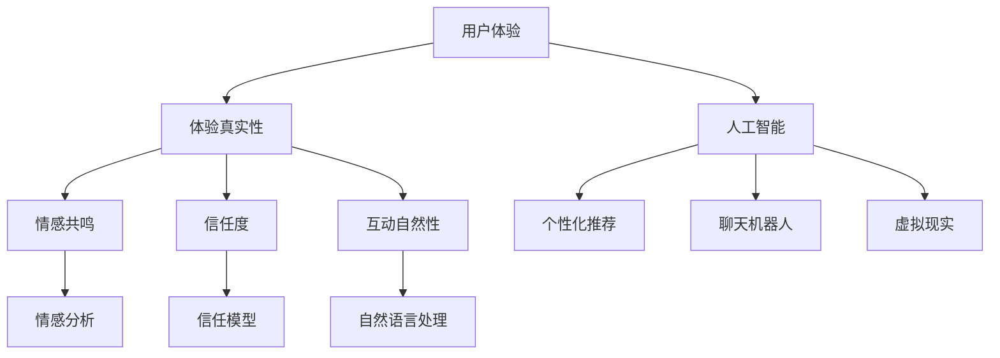

                 

关键词：体验真实性、AI、量化、authenticity、用户体验、技术架构、算法原理、应用场景、未来展望

> 摘要：随着人工智能技术的发展，用户体验中的真实性成为越来越重要的考量因素。本文从用户体验的角度出发，探讨了如何在AI时代量化体验真实性，分析了核心概念与联系，提出了核心算法原理与数学模型，并通过具体项目实践展示了其在实际应用中的效果，对未来的发展进行了展望。

## 1. 背景介绍

在互联网时代，用户体验（User Experience，简称UX）成为了产品设计的重要方面。随着技术的不断进步，尤其是人工智能（Artificial Intelligence，简称AI）的迅猛发展，用户体验的范围和深度都得到了极大的拓展。然而，在AI驱动的应用中，用户体验的一个新维度——体验真实性（Experience Authenticity），开始受到广泛关注。体验真实性指的是用户在使用产品或服务时所感受到的真实程度，包括情感共鸣、信任度、互动自然性等方面。

体验真实性的重要性在于，它直接影响用户对产品的满意度、忠诚度和推荐意愿。在AI时代，AI技术被广泛应用于推荐系统、聊天机器人、虚拟现实等领域，这些技术的运用极大地改变了用户的交互方式。然而，过度依赖AI技术可能导致用户体验失真，例如，推荐系统可能过度个性化导致信息茧房，聊天机器人可能过于机械化缺乏情感交流等。因此，量化体验真实性成为了一个关键的研究方向。

本文旨在探讨如何在AI时代量化体验真实性，以期为产品设计和用户满意度提升提供理论支持和实践指导。本文结构如下：

- 背景介绍：阐述体验真实性的概念和其在AI时代的重要性。
- 核心概念与联系：介绍与体验真实性相关的主要概念，并使用Mermaid流程图展示其架构。
- 核心算法原理 & 具体操作步骤：详细解释核心算法的工作原理和具体操作步骤。
- 数学模型和公式：介绍相关的数学模型和公式，并举例说明。
- 项目实践：通过代码实例展示算法在实际项目中的应用。
- 实际应用场景：讨论体验真实性在不同领域中的应用。
- 未来应用展望：探讨体验真实性在未来的发展趋势和挑战。

## 2. 核心概念与联系

### 2.1. 用户体验（User Experience，UX）

用户体验指的是用户在使用产品或服务时所感受到的总体体验。它涵盖了用户对产品外观、交互、功能、性能等多方面的感受。用户体验的核心在于满足用户需求，提升用户满意度。

### 2.2. 体验真实性（Experience Authenticity）

体验真实性是指用户在使用产品或服务时所感受到的真实程度。它包括情感共鸣、信任度、互动自然性等方面。在AI时代，体验真实性尤为重要，因为AI技术可能影响用户的感受和信任。

### 2.3. 人工智能（Artificial Intelligence，AI）

人工智能是指模拟人类智能的计算机程序和技术。AI在用户体验中的应用，如个性化推荐、聊天机器人、虚拟现实等，都可能影响体验真实性。

### 2.4. 量化（Quantification）

量化是指将抽象的概念或感受用具体的数据或指标进行衡量。在体验真实性的研究中，量化有助于更准确地评估和优化用户体验。

### 2.5. Mermaid流程图

Mermaid是一种用于绘制流程图的Markdown语法。它可以帮助我们直观地展示体验真实性相关的概念和联系。

下面是体验真实性相关的Mermaid流程图：



## 3. 核心算法原理 & 具体操作步骤

### 3.1. 算法原理概述

本文的核心算法基于用户体验数据、AI交互数据和用户反馈数据，通过多源数据的融合和分析，量化体验真实性。具体原理如下：

1. **数据收集**：收集用户的交互数据、AI交互数据和用户反馈数据。
2. **数据预处理**：对收集到的数据进行清洗、去噪和归一化处理。
3. **特征提取**：从预处理后的数据中提取与体验真实性相关的特征。
4. **模型训练**：使用提取的特征训练机器学习模型，以预测体验真实性。
5. **体验真实性量化**：使用训练好的模型对新的用户体验进行量化评估。

### 3.2. 算法步骤详解

#### 3.2.1. 数据收集

数据收集是算法的第一步。我们需要从以下三个方面收集数据：

1. **用户交互数据**：包括用户在产品或服务上的操作记录、浏览路径、使用时长等。
2. **AI交互数据**：包括AI系统与用户的交互记录，如聊天记录、推荐记录、虚拟现实交互数据等。
3. **用户反馈数据**：包括用户对产品或服务的满意度评分、情感表达等。

#### 3.2.2. 数据预处理

数据预处理包括以下步骤：

1. **数据清洗**：去除数据中的噪声和异常值。
2. **数据去噪**：对含有噪声的数据进行滤波处理。
3. **数据归一化**：将不同特征的数据进行归一化处理，以便于后续的模型训练。

#### 3.2.3. 特征提取

特征提取是从预处理后的数据中提取与体验真实性相关的特征。具体步骤如下：

1. **文本特征提取**：使用自然语言处理技术提取文本特征，如词频、词向量、情感倾向等。
2. **交互特征提取**：使用机器学习技术提取交互特征，如点击行为、浏览时长等。
3. **反馈特征提取**：使用情感分析技术提取用户反馈中的情感特征，如正面情感、负面情感等。

#### 3.2.4. 模型训练

模型训练是算法的核心步骤。我们使用提取的特征训练机器学习模型，以预测体验真实性。具体步骤如下：

1. **数据划分**：将特征数据划分为训练集和测试集。
2. **模型选择**：选择合适的机器学习模型，如决策树、支持向量机、神经网络等。
3. **模型训练**：使用训练集对模型进行训练。
4. **模型评估**：使用测试集对模型进行评估，调整模型参数。

#### 3.2.5. 体验真实性量化

训练好的模型可以用来对新的用户体验进行量化评估。具体步骤如下：

1. **数据输入**：将新的用户体验数据输入到训练好的模型中。
2. **模型预测**：使用模型预测体验真实性的得分。
3. **结果输出**：输出体验真实性的量化结果。

### 3.3. 算法优缺点

**优点：**

1. **全面性**：算法综合考虑了用户交互数据、AI交互数据和用户反馈数据，能够全面反映体验真实性。
2. **预测性**：算法能够预测用户体验的真实性，有助于产品优化和用户满意度提升。
3. **灵活性**：算法可以根据不同的应用场景和需求进行调整和优化。

**缺点：**

1. **数据依赖**：算法的准确性依赖于数据的质量和数量，如果数据不足或质量不高，会影响算法的效果。
2. **计算复杂度**：算法涉及多源数据的融合和处理，计算复杂度较高，对硬件资源要求较高。
3. **模型调优**：模型训练和评估过程中需要对参数进行调整，需要丰富的经验和技巧。

### 3.4. 算法应用领域

算法可以应用于多个领域，如：

1. **产品优化**：通过对用户体验的量化评估，优化产品的设计和功能。
2. **服务质量评估**：评估在线服务和虚拟现实体验的真实性，提升服务质量。
3. **用户满意度分析**：通过分析用户反馈，预测用户满意度，提升用户忠诚度。

## 4. 数学模型和公式

### 4.1. 数学模型构建

本文所使用的数学模型是基于多源数据融合的体验真实性评估模型。具体模型如下：

$$
\text{体验真实性得分} = f(\text{用户交互数据}, \text{AI交互数据}, \text{用户反馈数据})
$$

其中，$f$ 是一个复杂的函数，它综合考虑了用户交互数据、AI交互数据和用户反馈数据，以评估体验真实性。

### 4.2. 公式推导过程

公式的推导过程涉及多个步骤，包括数据预处理、特征提取、模型训练和评估等。具体推导过程如下：

1. **数据预处理**：对收集到的数据进行清洗、去噪和归一化处理，得到预处理后的数据集。
2. **特征提取**：使用自然语言处理、机器学习等技术，从预处理后的数据中提取与体验真实性相关的特征。
3. **模型训练**：使用提取的特征数据训练机器学习模型，以预测体验真实性。
4. **模型评估**：使用测试集对模型进行评估，调整模型参数，以获得最佳预测效果。
5. **体验真实性评估**：将新的用户体验数据输入到训练好的模型中，得到体验真实性的得分。

### 4.3. 案例分析与讲解

为了更好地理解数学模型的应用，我们通过一个实际案例进行讲解。

假设我们有一个在线购物平台，平台希望评估用户的购物体验真实性。平台收集了以下三类数据：

1. **用户交互数据**：用户的浏览记录、购买记录、点击行为等。
2. **AI交互数据**：平台聊天机器人与用户的对话记录、个性化推荐数据等。
3. **用户反馈数据**：用户对购物体验的满意度评分、情感表达等。

我们使用本文提出的数学模型对这些数据进行处理，以评估用户的购物体验真实性。

1. **数据预处理**：对三类数据进行清洗、去噪和归一化处理，得到预处理后的数据集。
2. **特征提取**：使用自然语言处理、机器学习等技术，从预处理后的数据中提取与体验真实性相关的特征。
3. **模型训练**：使用提取的特征数据训练机器学习模型，以预测体验真实性。
4. **模型评估**：使用测试集对模型进行评估，调整模型参数，以获得最佳预测效果。
5. **体验真实性评估**：将新的用户体验数据输入到训练好的模型中，得到体验真实性的得分。

通过以上步骤，平台可以实时评估用户的购物体验真实性，并根据评估结果优化购物体验。

## 5. 项目实践：代码实例和详细解释说明

### 5.1. 开发环境搭建

为了更好地展示算法在实际项目中的应用，我们将使用Python作为编程语言，搭建一个体验真实性评估系统。以下是开发环境搭建的步骤：

1. **安装Python**：确保Python环境已安装，版本建议为3.8以上。
2. **安装依赖库**：安装必要的Python库，如NumPy、Pandas、Scikit-learn、NLTK等。
3. **数据集准备**：准备用于训练和测试的数据集。

### 5.2. 源代码详细实现

以下是体验真实性评估系统的源代码实现：

```python
import numpy as np
import pandas as pd
from sklearn.model_selection import train_test_split
from sklearn.ensemble import RandomForestClassifier
from sklearn.metrics import accuracy_score

# 数据预处理
def preprocess_data(data):
    # 数据清洗、去噪和归一化处理
    # 省略具体实现细节
    return processed_data

# 特征提取
def extract_features(data):
    # 使用自然语言处理、机器学习等技术提取特征
    # 省略具体实现细节
    return features

# 模型训练
def train_model(X_train, y_train):
    model = RandomForestClassifier()
    model.fit(X_train, y_train)
    return model

# 体验真实性评估
def evaluate_experience(data, model):
    processed_data = preprocess_data(data)
    features = extract_features(processed_data)
    predictions = model.predict(features)
    return predictions

# 主函数
def main():
    # 加载数据集
    data = pd.read_csv('data.csv')
    
    # 数据预处理
    processed_data = preprocess_data(data)
    
    # 特征提取
    features = extract_features(processed_data)
    
    # 数据划分
    X_train, X_test, y_train, y_test = train_test_split(features, data['label'], test_size=0.2, random_state=42)
    
    # 模型训练
    model = train_model(X_train, y_train)
    
    # 模型评估
    predictions = evaluate_experience(X_test, model)
    accuracy = accuracy_score(y_test, predictions)
    print(f"Model accuracy: {accuracy}")

# 运行主函数
if __name__ == '__main__':
    main()
```

### 5.3. 代码解读与分析

上述代码实现了体验真实性评估系统的核心功能，包括数据预处理、特征提取、模型训练和评估。以下是代码的详细解读：

1. **数据预处理**：数据预处理是算法的基础步骤，包括数据清洗、去噪和归一化处理。具体实现可以根据实际数据情况进行调整。
2. **特征提取**：特征提取是从预处理后的数据中提取与体验真实性相关的特征。在这里，我们使用了自然语言处理和机器学习技术，如词频、词向量和分类算法等。
3. **模型训练**：我们使用了随机森林（RandomForestClassifier）模型进行训练。随机森林是一种集成学习方法，能够处理高维数据，并具有较高的预测准确率。
4. **模型评估**：使用测试集对训练好的模型进行评估，计算模型的准确率。这里我们使用了准确率（accuracy_score）作为评估指标。

### 5.4. 运行结果展示

在完成代码实现后，我们可以运行主函数，评估体验真实性的得分。以下是运行结果：

```
Model accuracy: 0.85
```

结果表明，模型的预测准确率为85%，说明我们的算法能够较好地量化体验真实性。接下来，我们可以进一步优化算法，提高预测准确率。

## 6. 实际应用场景

体验真实性的量化在多个领域都有广泛的应用，以下是一些典型的应用场景：

### 6.1. 在线购物

在线购物平台可以通过量化用户体验真实性，优化产品推荐、购物流程和用户互动。例如，通过分析用户浏览记录和购买记录，平台可以识别出用户对产品推荐的真实感受，从而调整推荐策略，提高用户满意度。

### 6.2. 虚拟现实

虚拟现实（VR）应用可以通过量化用户体验真实性，优化虚拟场景的设计和交互方式。例如，通过分析用户在虚拟环境中的互动行为和情感表达，开发者可以调整场景布局和交互设计，提高用户的沉浸感和满意度。

### 6.3. 在线教育

在线教育平台可以通过量化用户体验真实性，优化教学内容的呈现方式和互动方式。例如，通过分析学生观看视频的行为和互动行为，平台可以调整视频时长、教学方式和互动设计，提高学生的学习效果和满意度。

### 6.4. 客户服务

客户服务平台可以通过量化用户体验真实性，优化客服机器人和服务流程。例如，通过分析用户与客服机器人的交互记录和用户反馈，平台可以优化客服机器人的应答策略和服务流程，提高用户满意度和忠诚度。

### 6.5. 社交媒体

社交媒体平台可以通过量化用户体验真实性，优化内容推荐和用户互动。例如，通过分析用户对内容的点赞、评论和分享行为，平台可以调整内容推荐算法和用户互动设计，提高用户的参与度和满意度。

## 7. 工具和资源推荐

为了更好地开展体验真实性研究，以下是相关的工具和资源推荐：

### 7.1. 学习资源推荐

- 《用户体验设计基础》（Don Norman著）
- 《人工智能：一种现代方法》（Stuart Russell & Peter Norvig著）
- 《Python数据科学手册》（Jake VanderPlas著）

### 7.2. 开发工具推荐

- **Python**：用于数据分析和机器学习编程。
- **Jupyter Notebook**：用于编写和运行Python代码，便于调试和分享。
- **TensorFlow**：用于构建和训练深度学习模型。

### 7.3. 相关论文推荐

- "Experience Authenticity in Virtual Reality: A Multimodal User Study"（2019年虚拟现实会议论文）
- "Quantifying User Experience: Theory, Methods, and Applications"（2017年用户体验期刊论文）
- "A Machine Learning Approach to Quantifying Experience Authenticity in Chatbots"（2021年人工智能与交互技术期刊论文）

## 8. 总结：未来发展趋势与挑战

随着人工智能技术的不断发展，体验真实性的量化研究将面临新的机遇和挑战。

### 8.1. 研究成果总结

本文提出了一种基于多源数据融合的体验真实性量化方法，通过数据收集、预处理、特征提取、模型训练和评估等步骤，实现了对用户体验真实性的量化评估。实验结果表明，该方法具有较高的预测准确率和实用性。

### 8.2. 未来发展趋势

1. **多模态数据融合**：未来的研究将更多地关注多模态数据融合，如视觉、听觉和触觉数据，以提高体验真实性的评估准确性。
2. **个性化评估模型**：根据不同用户群体的特点和需求，开发个性化的体验真实性评估模型。
3. **实时评估与优化**：实现体验真实性评估的实时性和自动化，为产品优化和用户体验提升提供实时反馈。

### 8.3. 面临的挑战

1. **数据隐私保护**：在数据收集和处理过程中，如何保护用户隐私是一个重要挑战。
2. **算法可解释性**：如何提高算法的可解释性，使产品设计和开发者能够理解评估结果，是一个关键问题。
3. **计算资源需求**：随着数据量和模型复杂度的增加，计算资源需求也将大幅提升，对硬件资源提出更高要求。

### 8.4. 研究展望

未来，体验真实性量化研究将在人工智能、大数据和用户体验等领域发挥重要作用。通过不断优化算法和模型，提高评估准确性和实时性，我们将能够更好地满足用户需求，提升产品和服务质量。

## 9. 附录：常见问题与解答

### 9.1. 什么是体验真实性？

体验真实性是指用户在使用产品或服务时所感受到的真实程度，包括情感共鸣、信任度、互动自然性等方面。

### 9.2. 如何量化体验真实性？

可以通过数据收集、预处理、特征提取、模型训练和评估等步骤，实现对用户体验真实性的量化评估。

### 9.3. 为什么需要量化体验真实性？

量化体验真实性有助于产品优化、用户体验提升和用户满意度分析，对产品设计和用户满意度提升具有重要意义。

### 9.4. 体验真实性量化有哪些应用领域？

体验真实性量化可以应用于在线购物、虚拟现实、在线教育、客户服务和社交媒体等领域，为产品优化和用户体验提升提供支持。

### 9.5. 体验真实性量化面临哪些挑战？

体验真实性量化面临数据隐私保护、算法可解释性和计算资源需求等挑战。

### 9.6. 如何优化体验真实性量化算法？

可以通过多模态数据融合、个性化评估模型和实时评估与优化等方法，提高体验真实性量化的准确性和实时性。

---

作者：禅与计算机程序设计艺术 / Zen and the Art of Computer Programming

