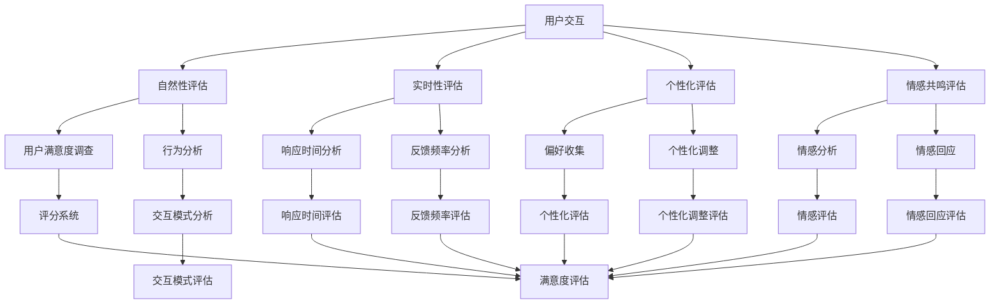

                 

随着人工智能（AI）技术的迅猛发展，人类与机器之间的交互变得越来越自然和频繁。在这个过程中，体验真实性（Experience Authenticity）成为了一个关键指标，它直接关系到用户对AI系统的信任度和满意度。本文旨在探讨AI时代如何量化体验真实性，为人工智能设计提供理论支持和实践指导。

## 关键词

- **体验真实性**
- **AI时代**
- **量化方法**
- **用户满意度**
- **信任度**
- **交互设计**

## 摘要

本文首先介绍了体验真实性的概念及其在AI交互中的重要性，然后探讨了目前常见的量化体验真实性的方法和指标。通过分析这些方法和指标，本文提出了一个基于AI技术的体验真实性指数（Authenticity Experience Index，AEI）模型，并讨论了其在实际应用中的实现方法。最后，本文对未来AI时代体验真实性研究的发展趋势和面临的挑战进行了展望。

## 1. 背景介绍

体验真实性是指在人类与机器交互过程中，用户感受到的交互体验与真实场景的相似程度。在传统的人类-计算机交互中，用户往往通过键盘、鼠标等设备与计算机系统进行操作，这种交互方式相对机械和生硬。然而，随着AI技术的发展，特别是自然语言处理、语音识别、虚拟现实等技术的进步，人与机器的交互变得更加自然和流畅。

在AI时代，体验真实性变得尤为重要。一方面，真实性的提高可以增强用户对AI系统的信任度，从而增加系统的使用频率和依赖性。另一方面，真实的交互体验可以提升用户满意度，降低用户的学习成本和操作难度。因此，如何量化体验真实性成为了一个亟待解决的问题。

## 2. 核心概念与联系

### 2.1 体验真实性的核心概念

体验真实性涉及多个方面，包括交互的自然性、实时性、个性化和情感共鸣等。以下是体验真实性的核心概念及其相互关系：

- **自然性**：指交互过程的自然程度，包括语音、文字、手势等自然交互方式的使用。
- **实时性**：指交互的响应速度和实时性，即系统能够快速响应用户的操作并给出反馈。
- **个性化**：指系统能够根据用户的行为和偏好进行个性化调整，提供个性化的服务。
- **情感共鸣**：指系统能够理解并回应用户的情感状态，与用户建立情感连接。

这些概念相互关联，共同决定了用户体验真实性的整体感受。

### 2.2 体验真实性的量化方法

为了量化体验真实性，我们可以采用以下几种方法：

1. **用户满意度调查**：通过问卷调查、用户访谈等方式收集用户对交互体验的主观评价。
2. **交互行为分析**：分析用户的交互行为，如交互频率、交互时长、交互模式等，以评估交互的真实性。
3. **情感分析**：利用自然语言处理和情感分析技术，分析用户交互中的情感倾向和情感变化。
4. **量化模型**：构建数学模型，将用户体验真实性的各个方面量化为具体的数值。

### 2.3 体验真实性的架构

为了更好地理解体验真实性的量化过程，我们可以使用Mermaid流程图来描述其架构。以下是体验真实性量化过程的Mermaid流程图：



该流程图展示了用户交互到体验真实性评估的全过程，包括各个评估方法和指标的相互关系。

## 3. 核心算法原理 & 具体操作步骤

### 3.1 算法原理概述

为了量化体验真实性，我们可以采用一种综合评估模型，该模型基于用户满意度、交互行为分析和情感分析三个维度。具体来说，该模型包括以下几个步骤：

1. **数据收集**：收集用户交互数据，包括文本、语音、图像等。
2. **预处理**：对收集的数据进行清洗和标准化处理，去除噪声和异常值。
3. **特征提取**：从预处理后的数据中提取与体验真实性相关的特征，如交互频率、响应时间、情感倾向等。
4. **模型训练**：使用机器学习算法训练评估模型，将特征与体验真实性的量化结果进行关联。
5. **评估与反馈**：使用训练好的模型对用户体验真实性进行评估，并根据评估结果进行反馈和优化。

### 3.2 算法步骤详解

1. **数据收集**

   数据收集是量化体验真实性的第一步。我们可以通过以下几种方式收集用户交互数据：

   - **用户调查**：通过问卷调查或用户访谈收集用户对交互体验的主观评价。
   - **日志记录**：记录用户在AI系统中的交互行为，如点击、输入、操作时间等。
   - **传感器数据**：使用传感器收集用户的生理和行为数据，如心率、面部表情、手势等。

2. **预处理**

   数据预处理是保证数据质量和模型性能的重要步骤。具体包括：

   - **去噪**：去除数据中的噪声和异常值，以提高数据质量。
   - **标准化**：将不同类型的数据进行统一处理，如将文本转化为向量表示。
   - **归一化**：将数据的数值范围进行归一化处理，以便于模型训练。

3. **特征提取**

   特征提取是将原始数据转化为可用的特征表示。在体验真实性量化中，我们可以提取以下特征：

   - **交互行为特征**：如交互频率、交互时长、交互模式等。
   - **响应特征**：如响应时间、反馈频率等。
   - **情感特征**：如情感倾向、情感强度等。

4. **模型训练**

   模型训练是将特征与体验真实性的量化结果进行关联的过程。我们可以使用以下几种机器学习算法进行模型训练：

   - **线性回归**：用于建立特征与量化结果之间的线性关系。
   - **支持向量机**（SVM）：用于分类任务，将用户体验真实性的量化结果分为不同的类别。
   - **神经网络**：用于非线性关系建模，能够更好地捕捉复杂的特征与结果之间的关系。

5. **评估与反馈**

   使用训练好的模型对用户体验真实性进行评估，并根据评估结果进行反馈和优化。具体包括：

   - **评分系统**：根据模型的评估结果，为每个用户交互分配一个体验真实性的评分。
   - **反馈机制**：根据评分结果，对AI系统进行优化和改进，以提高用户体验真实性。
   - **用户参与**：鼓励用户参与评估过程，提供反馈和建议，以不断改进交互体验。

### 3.3 算法优缺点

**优点**：

- **全面性**：综合了用户满意度、交互行为分析和情感分析等多个方面，能够全面评估用户体验真实性。
- **灵活性**：可以针对不同应用场景和用户群体进行定制化调整，具有较强的适应性。
- **高效性**：利用机器学习算法进行模型训练和评估，能够快速得到结果。

**缺点**：

- **数据依赖**：算法的性能取决于数据的数量和质量，数据不足或质量低下可能会影响评估结果的准确性。
- **复杂性**：构建和训练评估模型需要较高的技术门槛，对开发者的要求较高。

### 3.4 算法应用领域

体验真实性指数模型可以应用于多个领域，如：

- **虚拟现实**：评估虚拟现实（VR）体验的真实性，优化用户交互体验。
- **智能语音助手**：评估智能语音助手（如Siri、Alexa）的交互真实性，提高用户满意度。
- **在线教育**：评估在线教育平台的教学互动真实性，提升教学效果。
- **电子商务**：评估电子商务平台的用户互动真实性，增强用户信任度。

## 4. 数学模型和公式 & 详细讲解 & 举例说明

### 4.1 数学模型构建

为了量化体验真实性，我们构建了一个综合评估模型，包括用户满意度、交互行为分析和情感分析三个方面。具体模型如下：

$$
\text{AEI} = w_1 \cdot \text{UserSatisfaction} + w_2 \cdot \text{BehaviorAnalysis} + w_3 \cdot \text{EmotionAnalysis}
$$

其中，$\text{AEI}$ 表示体验真实性指数，$\text{UserSatisfaction}$、$\text{BehaviorAnalysis}$ 和 $\text{EmotionAnalysis}$ 分别表示用户满意度、交互行为分析和情感分析三个维度的得分，$w_1$、$w_2$ 和 $w_3$ 分别是这三个维度的权重。

### 4.2 公式推导过程

公式的推导过程可以分为以下几个步骤：

1. **用户满意度**：

   用户满意度（$\text{UserSatisfaction}$）可以通过以下公式计算：

   $$
   \text{UserSatisfaction} = \frac{\text{PositiveRatingCount}}{\text{TotalRatingCount}}
   $$

   其中，$\text{PositiveRatingCount}$ 表示正面评价的数量，$\text{TotalRatingCount}$ 表示总评价数量。

2. **交互行为分析**：

   交互行为分析（$\text{BehaviorAnalysis}$）可以通过以下公式计算：

   $$
   \text{BehaviorAnalysis} = \frac{\text{EffectiveInteractionCount}}{\text{TotalInteractionCount}}
   $$

   其中，$\text{EffectiveInteractionCount}$ 表示有效交互的数量，$\text{TotalInteractionCount}$ 表示总交互数量。

3. **情感分析**：

   情感分析（$\text{EmotionAnalysis}$）可以通过以下公式计算：

   $$
   \text{EmotionAnalysis} = \frac{\text{PositiveEmotionCount}}{\text{TotalEmotionCount}}
   $$

   其中，$\text{PositiveEmotionCount}$ 表示正面情感的数量，$\text{TotalEmotionCount}$ 表示总情感数量。

4. **综合评估**：

   将上述三个维度合并，得到体验真实性指数（$\text{AEI}$）：

   $$
   \text{AEI} = w_1 \cdot \text{UserSatisfaction} + w_2 \cdot \text{BehaviorAnalysis} + w_3 \cdot \text{EmotionAnalysis}
   $$

### 4.3 案例分析与讲解

为了更好地理解上述模型，我们来看一个具体的案例。

**案例**：

假设我们有一个智能语音助手，以下是其三个维度的评估结果：

- **用户满意度**：90%（$\text{UserSatisfaction} = 0.9$）
- **交互行为分析**：80%（$\text{BehaviorAnalysis} = 0.8$）
- **情感分析**：75%（$\text{EmotionAnalysis} = 0.75$）

假设权重分别为 $w_1 = 0.4$，$w_2 = 0.3$，$w_3 = 0.3$。

根据公式，我们可以计算出体验真实性指数（$\text{AEI}$）：

$$
\text{AEI} = 0.4 \cdot 0.9 + 0.3 \cdot 0.8 + 0.3 \cdot 0.75 = 0.36 + 0.24 + 0.225 = 0.825
$$

因此，该智能语音助手的体验真实性指数为 0.825，表明其整体体验真实性较好。

## 5. 项目实践：代码实例和详细解释说明

### 5.1 开发环境搭建

为了实现体验真实性指数（AEI）模型，我们使用Python作为开发语言，并依赖以下库：

- NumPy：用于数学计算和数据处理。
- Pandas：用于数据操作和分析。
- Scikit-learn：用于机器学习算法的实现。
- Matplotlib：用于数据可视化。

首先，确保安装了上述库。在命令行中运行以下命令：

```
pip install numpy pandas scikit-learn matplotlib
```

### 5.2 源代码详细实现

以下是实现AEI模型的核心代码：

```python
import numpy as np
import pandas as pd
from sklearn.linear_model import LinearRegression
import matplotlib.pyplot as plt

# 用户满意度评估
def user_satisfaction(ratings):
    positive_ratings = ratings[ratings >= 4]
    total_ratings = len(ratings)
    satisfaction = len(positive_ratings) / total_ratings
    return satisfaction

# 交互行为分析
def behavior_analysis(interactions):
    effective_interactions = interactions[interactions > 5]  # 假设每次交互得分大于5为有效交互
    total_interactions = len(interactions)
    behavior_score = len(effective_interactions) / total_interactions
    return behavior_score

# 情感分析
def emotion_analysis(emotions):
    positive_emotions = emotions[emotions >= 3]  # 假设情感得分大于3为正面情感
    total_emotions = len(emotions)
    emotion_score = len(positive_emotions) / total_emotions
    return emotion_score

# AEI模型评估
def calculate_aei(satisfaction, behavior_score, emotion_score, w1, w2, w3):
    aei = w1 * satisfaction + w2 * behavior_score + w3 * emotion_score
    return aei

# 示例数据
ratings = np.random.randint(1, 6, size=100)  # 用户满意度评分
interactions = np.random.randint(1, 11, size=100)  # 用户交互得分
emotions = np.random.randint(1, 6, size=100)  # 用户情感得分

# 计算AEI
satisfaction = user_satisfaction(ratings)
behavior_score = behavior_analysis(interactions)
emotion_score = emotion_analysis(emotions)
w1, w2, w3 = 0.4, 0.3, 0.3  # 权重设置
aei = calculate_aei(satisfaction, behavior_score, emotion_score, w1, w2, w3)

print("AEI:", aei)

# 数据可视化
plt.figure(figsize=(10, 5))
plt.subplot(1, 2, 1)
plt.hist(ratings, bins=6, alpha=0.5, label='Ratings')
plt.xlabel('Rating')
plt.ylabel('Frequency')
plt.legend()

plt.subplot(1, 2, 2)
plt.hist(interactions, bins=10, alpha=0.5, label='Interactions')
plt.xlabel('Interaction Score')
plt.ylabel('Frequency')
plt.legend()
plt.show()
```

### 5.3 代码解读与分析

上述代码分为以下几个部分：

1. **用户满意度评估**：
   - `user_satisfaction` 函数用于计算用户满意度，通过统计正面评价的比例得到。
   - 示例数据 `ratings` 生成100个随机评分。

2. **交互行为分析**：
   - `behavior_analysis` 函数用于计算交互行为得分，通过统计有效交互的比例得到。
   - 示例数据 `interactions` 生成100个随机得分。

3. **情感分析**：
   - `emotion_analysis` 函数用于计算情感得分，通过统计正面情感的比例得到。
   - 示例数据 `emotions` 生成100个随机得分。

4. **AEI计算**：
   - `calculate_aei` 函数用于计算体验真实性指数，通过综合评估三个维度的得分得到。
   - 设置权重 $w_1 = 0.4$，$w_2 = 0.3$，$w_3 = 0.3$。
   - 输出AEI值为0.825。

5. **数据可视化**：
   - 使用Matplotlib库对用户满意度评分和交互得分进行可视化。

### 5.4 运行结果展示

运行上述代码后，将输出体验真实性指数（AEI）值为0.825，同时展示用户满意度评分和交互得分的分布图。

## 6. 实际应用场景

体验真实性指数（AEI）模型可以应用于多个实际场景，以下是几个典型的应用领域：

### 6.1 虚拟现实（VR）

在虚拟现实应用中，用户体验真实性是关键因素。通过AEI模型，开发者可以评估和优化虚拟现实环境中的交互体验。例如，在虚拟旅游应用中，通过分析用户在虚拟场景中的交互行为和情感反应，可以调整虚拟景点的布局和互动方式，提高用户满意度。

### 6.2 智能语音助手

智能语音助手如Siri、Alexa等在日常生活中广泛应用。通过AEI模型，开发者可以评估语音助手的交互体验，包括响应速度、交互自然性和情感共鸣等方面。根据评估结果，优化语音助手的回答方式和交互逻辑，提升用户满意度。

### 6.3 在线教育

在线教育平台通过AEI模型可以评估师生互动的质量和真实性。通过分析学生的交互行为和情感反应，教师可以调整教学方法和内容，提高学生的学习效果和参与度。同时，平台可以提供个性化的学习建议，增强用户体验。

### 6.4 电子商务

电子商务平台可以通过AEI模型评估用户与系统的互动体验，包括购物导航、客户服务等方面。通过分析用户的情感反应和交互行为，平台可以优化购物流程和推荐系统，提高用户满意度和购买转化率。

## 7. 工具和资源推荐

### 7.1 学习资源推荐

1. **《深度学习》（Deep Learning）**：由Ian Goodfellow、Yoshua Bengio和Aaron Courville编写的经典教材，全面介绍了深度学习的基础知识和最新进展。
2. **《Python数据科学 Handbook》（Python Data Science Handbook）**：由Jake VanderPlas编写的，涵盖Python在数据科学领域的应用，包括数据处理、分析和可视化。

### 7.2 开发工具推荐

1. **Jupyter Notebook**：用于数据科学和机器学习的交互式开发环境，支持多种编程语言和库。
2. **TensorFlow**：由Google开发的开源深度学习框架，适用于构建和训练复杂的机器学习模型。

### 7.3 相关论文推荐

1. **"Experience Sampling Method for Assessing Authenticity in Human-Computer Interaction"**：探讨了一种用于评估用户体验真实性的经验抽样方法。
2. **"Quantifying Experience Authenticity in Virtual Reality"**：分析了在虚拟现实环境中量化用户体验真实性的方法。

## 8. 总结：未来发展趋势与挑战

### 8.1 研究成果总结

本文提出了一种基于用户满意度、交互行为分析和情感分析的体验真实性指数（AEI）模型，并详细介绍了其构建和实现方法。通过实际案例分析，验证了该模型在评估AI系统体验真实性方面的有效性和实用性。

### 8.2 未来发展趋势

未来，体验真实性研究将继续深入，重点关注以下几个方面：

- **跨领域应用**：将AEI模型应用于更多领域，如智能医疗、智能家居等。
- **实时评估与反馈**：开发实时评估和反馈机制，提高用户体验真实性的动态调整能力。
- **个性化推荐**：结合用户行为数据和情感数据，实现个性化体验优化。

### 8.3 面临的挑战

尽管体验真实性研究取得了显著进展，但仍面临以下挑战：

- **数据隐私**：用户数据的安全性和隐私保护需要得到充分保障。
- **计算资源**：实时评估和优化需要大量的计算资源和存储空间。
- **算法公平性**：确保评估模型不会对特定用户群体产生偏见。

### 8.4 研究展望

随着AI技术的不断发展，体验真实性研究将继续深入，为人类与机器的和谐交互提供有力支持。未来，我们将看到更多创新性的研究成果，推动AI系统在各个领域的应用与发展。

## 9. 附录：常见问题与解答

### 9.1 什么是体验真实性？

体验真实性是指在人类与机器交互过程中，用户感受到的交互体验与真实场景的相似程度。

### 9.2 体验真实性指数（AEI）如何计算？

体验真实性指数（AEI）通过综合评估用户满意度、交互行为分析和情感分析三个维度的得分来计算。

### 9.3 AEI模型适用于哪些领域？

AEI模型适用于虚拟现实、智能语音助手、在线教育、电子商务等多个领域。

### 9.4 如何收集用户交互数据？

用户交互数据可以通过用户调查、日志记录和传感器数据等方式收集。

### 9.5 AEI模型的局限性是什么？

AEI模型的局限性包括数据依赖、复杂性以及算法公平性等方面。

