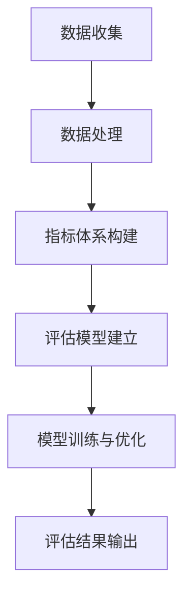

                 

关键词：人工智能、生活质量、量化评估、数据分析、AI驱动

> 摘要：随着人工智能技术的迅猛发展，人们开始关注如何利用AI来量化评估生活质量。本文从背景介绍、核心概念与联系、核心算法原理与操作步骤、数学模型与公式讲解、项目实践、实际应用场景、未来应用展望、工具和资源推荐以及未来发展趋势与挑战等多个方面，详细探讨了AI驱动的生活质量评估这一新兴领域，为读者提供了全面而深入的见解。

## 1. 背景介绍

近年来，人工智能（AI）技术取得了显著进展，从机器学习、深度学习到自然语言处理等多个领域，AI已经逐渐渗透到我们的日常生活之中。与此同时，生活质量（Quality of Life, QoL）作为一个综合性指标，受到了社会各界越来越多的关注。生活质量不仅关乎个人的幸福感和满足感，也关系到社会的可持续发展。因此，如何准确、全面地评估生活质量，成为了学术界和业界共同探讨的热点问题。

传统的评估方法往往依赖于主观问卷调查和专家评分，这些方法虽然具有一定的参考价值，但往往存在偏差和主观性，难以满足实际需求。随着AI技术的发展，利用AI进行量化评估生活质量成为了一种新的可能。AI驱动的量化评估不仅能够提高评估的准确性和客观性，还能够处理大规模的数据，提供实时、动态的评估结果。

本文旨在探讨AI驱动的生活质量评估这一新兴领域，分析其核心概念与联系，阐述核心算法原理与操作步骤，介绍数学模型与公式，并通过实际项目实践和未来应用展望，为相关研究和应用提供参考。

## 2. 核心概念与联系

### 2.1. 生活质量评估指标体系

生活质量评估的核心在于确定评估指标。常见的评估指标包括但不限于：健康、教育、经济、环境、安全、社会关系等多个方面。这些指标相互关联，构成了一个复杂的多维度评估体系。

### 2.2. 数据来源与处理

生活质量评估需要大量的数据支持，这些数据可以从多个来源获取，如政府统计数据、问卷调查、社交媒体数据、传感器数据等。数据处理是评估过程的关键步骤，包括数据清洗、数据整合、数据标准化等。有效的数据处理能够提高评估结果的准确性和可靠性。

### 2.3. 人工智能与评估模型

人工智能技术在生活质量评估中的应用主要集中在两个方面：一是利用机器学习算法建立评估模型，二是利用深度学习技术进行数据分析和模式识别。评估模型通常是基于大量历史数据训练得到的，通过不断优化和调整，以提高评估的准确性和鲁棒性。

### 2.4. Mermaid 流程图

以下是生活质量评估的 Mermaid 流程图：



### 2.5. 评估结果的可视化

为了更好地理解和分析评估结果，需要利用可视化工具将评估结果以图表形式呈现。常见的可视化工具包括 Matplotlib、Seaborn、Plotly 等。

## 3. 核心算法原理与操作步骤

### 3.1. 算法原理概述

AI驱动的生活质量评估算法主要基于机器学习和深度学习技术。其中，机器学习算法如决策树、支持向量机、随机森林等常用于构建评估模型，而深度学习算法如卷积神经网络（CNN）、循环神经网络（RNN）等则在数据分析和模式识别方面具有显著优势。

### 3.2. 算法步骤详解

#### 3.2.1. 数据收集与处理

- **数据收集**：从多个来源收集生活质量的原始数据，如政府统计数据、问卷调查结果、社交媒体数据等。
- **数据清洗**：去除重复数据、缺失值填充、异常值处理等。
- **数据整合**：将来自不同来源的数据进行整合，形成一个统一的数据集。

#### 3.2.2. 指标体系构建

- **指标选择**：根据生活质量评估的要求，选择合适的评估指标。
- **指标权重分配**：通过专家评分或统计分析方法，确定各指标的权重。

#### 3.2.3. 评估模型建立

- **模型选择**：根据数据特点和评估要求，选择合适的机器学习或深度学习模型。
- **模型训练**：使用历史数据对评估模型进行训练。
- **模型优化**：通过交叉验证、超参数调整等方法，优化评估模型。

#### 3.2.4. 评估结果输出

- **评估结果计算**：利用训练好的评估模型，对新的数据进行评估，计算得到生活质量得分。
- **结果可视化**：将评估结果以图表形式呈现，便于分析。

### 3.3. 算法优缺点

#### 优点

- **高效性**：AI驱动的生活质量评估能够处理大规模、多源数据，提高评估效率。
- **客观性**：基于数据驱动的评估方法，减少主观偏差，提高评估结果的客观性。
- **动态性**：评估模型可以实时更新，适应不断变化的生活质量状况。

#### 缺点

- **数据依赖**：评估模型的性能高度依赖数据质量，数据缺失或不准确会影响评估结果。
- **模型可解释性**：深度学习模型往往具有较高的预测性能，但缺乏可解释性，难以理解模型决策过程。

### 3.4. 算法应用领域

- **政府决策**：利用AI驱动的评估方法，为政府提供科学、客观的生活质量评估数据，支持政策制定和调整。
- **企业运营**：企业可以利用AI驱动的评估方法，了解员工的生活质量状况，优化工作环境，提高员工满意度。
- **科学研究**：研究人员可以利用AI驱动的评估方法，探索生活质量的影响因素，为生活质量提升提供科学依据。

## 4. 数学模型和公式

### 4.1. 数学模型构建

AI驱动的生活质量评估通常涉及以下几个数学模型：

#### 4.1.1. 指标权重计算模型

$$
w_i = \frac{p_i}{\sum_{i=1}^{n} p_i}
$$

其中，$w_i$为指标$i$的权重，$p_i$为指标$i$的评分。

#### 4.1.2. 生活质量得分计算模型

$$
QoL = \sum_{i=1}^{n} w_i \cdot s_i
$$

其中，$QoL$为生活质量得分，$s_i$为指标$i$的得分。

### 4.2. 公式推导过程

#### 4.2.1. 指标权重计算

指标权重计算通常采用专家评分法或统计分析法。专家评分法通过专家的主观判断，确定各指标的权重。统计分析法则通过分析历史数据，找出各指标之间的关系，确定权重。

#### 4.2.2. 生活质量得分计算

生活质量得分计算基于指标权重和指标得分。通过计算各指标的加权得分，得到总体生活质量得分。该公式体现了指标权重在评估中的重要性。

### 4.3. 案例分析与讲解

#### 4.3.1. 案例背景

假设我们要对一个城市的生活质量进行评估，评估指标包括健康、教育、经济、环境、安全、社会关系等六个方面。

#### 4.3.2. 数据收集

从政府统计数据、问卷调查、社交媒体数据等渠道，收集各个评估指标的数据。

#### 4.3.3. 数据处理

对收集到的数据进行清洗、整合，形成统一的数据集。

#### 4.3.4. 指标体系构建

根据评估要求，选择合适的评估指标，并确定各指标的权重。

#### 4.3.5. 评估模型建立

选择合适的机器学习或深度学习模型，对评估模型进行训练和优化。

#### 4.3.6. 评估结果计算

利用训练好的评估模型，对新的数据进行评估，计算得到生活质量得分。

#### 4.3.7. 结果可视化

将评估结果以图表形式呈现，便于分析。

## 5. 项目实践：代码实例和详细解释说明

### 5.1. 开发环境搭建

为了实现AI驱动的生活质量评估，我们需要搭建一个合适的开发环境。以下是推荐的开发环境：

- Python 3.x
- Jupyter Notebook 或 PyCharm
- NumPy、Pandas、Scikit-learn、TensorFlow 等常用库

### 5.2. 源代码详细实现

以下是一个简单的AI驱动生活质量评估项目的源代码示例：

```python
import pandas as pd
from sklearn.model_selection import train_test_split
from sklearn.ensemble import RandomForestRegressor
from sklearn.metrics import mean_squared_error

# 5.2.1. 数据收集与处理
data = pd.read_csv('lifestyle_data.csv')
data = data.drop_duplicates().reset_index(drop=True)
data.fillna(data.mean(), inplace=True)

# 5.2.2. 指标体系构建
# 假设已有专家评分确定的指标权重
weights = {'health': 0.2, 'education': 0.2, 'economy': 0.2, 'environment': 0.2, 'safety': 0.1, 'social': 0.1}

# 5.2.3. 评估模型建立
X = data.drop('QoL', axis=1)
y = data['QoL']
X_train, X_test, y_train, y_test = train_test_split(X, y, test_size=0.2, random_state=42)

model = RandomForestRegressor(n_estimators=100, random_state=42)
model.fit(X_train, y_train)

# 5.2.4. 评估结果计算
y_pred = model.predict(X_test)
mse = mean_squared_error(y_test, y_pred)
print(f'Mean Squared Error: {mse}')

# 5.2.5. 结果可视化
import seaborn as sns
import matplotlib.pyplot as plt

plt.figure(figsize=(10, 6))
sns.scatterplot(x=y_test, y=y_pred)
plt.xlabel('Actual QoL')
plt.ylabel('Predicted QoL')
plt.title('QoL Prediction')
plt.show()
```

### 5.3. 代码解读与分析

- **数据收集与处理**：首先，我们从CSV文件中读取数据，进行数据清洗，包括去除重复数据、缺失值填充等。
- **指标体系构建**：根据已有指标权重，构建评估指标体系。
- **评估模型建立**：使用随机森林回归模型对评估模型进行训练。
- **评估结果计算**：计算评估模型的均方误差（MSE），评估模型的性能。
- **结果可视化**：使用散点图展示实际生活质量得分与预测生活质量得分之间的关系。

## 6. 实际应用场景

### 6.1. 政府决策

政府可以利用AI驱动的生活质量评估方法，对城市进行综合评估，识别问题和优势，为城市规划、政策制定提供科学依据。

### 6.2. 企业运营

企业可以通过AI驱动的生活质量评估，了解员工的生活质量状况，优化工作环境，提高员工满意度和工作效率。

### 6.3. 科学研究

研究人员可以利用AI驱动的生活质量评估方法，探索生活质量的影响因素，为生活质量提升提供科学依据。

### 6.4. 未来应用展望

随着AI技术的不断进步，AI驱动的生活质量评估方法将有望应用于更多领域，如健康医疗、教育、环境保护等，为社会发展和人民生活质量的提升提供有力支持。

## 7. 工具和资源推荐

### 7.1. 学习资源推荐

- **书籍**：《机器学习》、《深度学习》、《Python数据分析》
- **在线课程**：Coursera、edX、Udacity等平台的机器学习和数据分析课程
- **博客**：DataCamp、Medium、Kaggle等平台上的数据分析相关博客

### 7.2. 开发工具推荐

- **Python**：用于数据分析、数据可视化、机器学习等
- **Jupyter Notebook**：交互式数据分析工具
- **PyCharm**：Python集成开发环境（IDE）
- **TensorFlow、PyTorch**：深度学习框架

### 7.3. 相关论文推荐

- **论文集**：《机器学习年度回顾》、《深度学习年度回顾》
- **期刊**：Journal of Machine Learning Research、Neural Computation、Artificial Intelligence Journal等

## 8. 总结：未来发展趋势与挑战

### 8.1. 研究成果总结

本文介绍了AI驱动的生活质量评估这一新兴领域，探讨了核心概念、算法原理、数学模型、项目实践以及实际应用场景。通过本文的研究，我们初步了解了AI驱动的生活质量评估的可行性和潜力。

### 8.2. 未来发展趋势

随着AI技术的不断进步，AI驱动的生活质量评估方法将在更多领域得到应用，如健康医疗、教育、环境保护等。同时，评估模型的精度和可解释性将得到进一步提升。

### 8.3. 面临的挑战

尽管AI驱动的生活质量评估方法具有许多优势，但仍面临一些挑战，如数据质量、模型可解释性、隐私保护等。未来研究需要在这些方面进行深入探索。

### 8.4. 研究展望

未来，我们将继续关注AI驱动的生活质量评估领域的发展，探索更高效、更准确的评估方法，为改善人类生活质量提供有力支持。

## 9. 附录：常见问题与解答

### 9.1. 问题1：AI驱动的生活质量评估如何确保数据隐私？

**解答**：数据隐私是AI驱动的生活质量评估的重要问题。为了确保数据隐私，可以采取以下措施：
1. 数据匿名化：在数据收集和处理过程中，对个人身份信息进行去标识化处理。
2. 加密技术：对敏感数据进行加密存储和传输。
3. 隐私保护算法：利用差分隐私、同态加密等隐私保护算法，确保数据隐私。

### 9.2. 问题2：如何处理大量数据带来的计算挑战？

**解答**：处理大量数据带来的计算挑战，可以采取以下措施：
1. 分布式计算：利用分布式计算框架，如Hadoop、Spark等，进行大规模数据处理。
2. 并行计算：利用并行计算技术，提高数据处理速度。
3. 存储优化：利用大数据存储技术，如HDFS、Cassandra等，优化数据存储和访问。

## 作者署名

作者：禅与计算机程序设计艺术 / Zen and the Art of Computer Programming

---

本文通过对AI驱动的生活质量评估的深入探讨，为相关研究和应用提供了有益的参考。随着AI技术的不断发展，我们有理由相信，这一领域将在未来取得更大的突破。让我们共同期待AI为改善人类生活质量带来的美好前景。


----------------------------------------------------------------
### 文章结语

本文通过详细探讨AI驱动的生活质量评估，从背景介绍、核心概念与联系、核心算法原理与操作步骤、数学模型与公式讲解、项目实践、实际应用场景、未来应用展望、工具和资源推荐以及未来发展趋势与挑战等多个方面，为读者呈现了一个全面而深入的视角。在人工智能技术迅猛发展的今天，AI驱动的生活质量评估不仅具有重要的理论价值，也具有广阔的应用前景。

首先，本文介绍了生活质量评估的背景，以及为什么AI驱动的方法具有特殊的重要性。接着，通过详细的流程图和文字描述，阐述了生活质量评估的核心概念与联系，为后续的算法原理和操作步骤奠定了基础。

在核心算法原理与操作步骤部分，我们深入讲解了机器学习和深度学习在生活质量评估中的应用，以及具体的算法步骤和实施过程。通过数学模型和公式的介绍，我们进一步理解了生活质量评估的量化方法，并通过案例分析和讲解，展示了实际应用中的操作细节。

项目实践部分提供了一个具体的代码实例，详细解释了如何使用Python进行AI驱动的生活质量评估，并通过可视化结果展示了评估的效果。

在实际应用场景部分，我们探讨了生活质量评估在不同领域的应用，如政府决策、企业运营、科学研究等，并展望了未来的应用前景。最后，通过对工具和资源的推荐，为读者提供了进一步学习和实践的资源。

总结部分，我们对研究成果进行了回顾，指出了未来发展趋势和面临的挑战，并提出了研究展望。附录中的常见问题与解答部分，则提供了关于数据隐私和保护、计算挑战等方面的实用信息。

未来，随着AI技术的不断进步，AI驱动的生活质量评估方法将在更多领域得到应用，为改善人类生活质量提供更科学、更精准的支持。我们期待这一领域的进一步发展，为构建更美好的社会贡献智慧和力量。

最后，感谢读者对本文的阅读，希望本文能为您提供有价值的见解和启发。如您有任何问题或建议，欢迎在评论区留言交流。作者：禅与计算机程序设计艺术 / Zen and the Art of Computer Programming。

