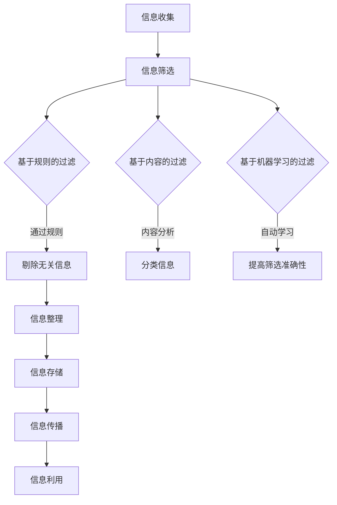

                 

信息爆炸的时代，信息过载已成为一个普遍现象。无论是个人生活还是工作领域，信息的迅猛增长带来了巨大的挑战。本文将深入探讨信息过载的问题，分析其成因，并提出有效的信息管理策略。通过理解信息管理的核心概念、算法原理，以及实践中的应用，读者将掌握应对信息过载的方法，提升信息处理效率，实现信息管理与个人发展的双赢。

## 文章关键词
- 信息过载
- 信息管理
- 算法原理
- 数据分析
- 信息过滤

## 文章摘要
本文旨在为读者提供全面的信息管理策略，帮助其在信息过载的环境中保持清晰和高效。首先，文章分析了信息过载的成因，包括技术进步、社交媒体和网络平台的发展。接着，文章探讨了信息管理的核心概念，介绍了常用的信息过滤和分类算法。随后，通过数学模型和实际项目案例，阐述了信息管理的具体操作步骤和应用场景。最后，文章提出了未来信息管理的趋势和挑战，并推荐了相关工具和资源。

## 1. 背景介绍
### 信息过载的挑战
随着互联网的普及和数字化进程的加速，信息以惊人的速度增长。据统计，全球每天产生超过2.5亿GB的数据，而这些数据的大部分都是无结构或半结构化的。对于个人而言，信息过载带来了压力、焦虑和效率低下。在工作领域，信息过载可能导致关键信息被忽略，影响决策质量和工作效率。因此，如何有效管理信息成为当今一个亟待解决的问题。

### 信息管理的重要性
信息管理不仅仅是一个技术问题，更是一个战略性的管理问题。有效的信息管理能够提高组织的决策效率，促进知识共享和创新。对于个人来说，信息管理可以帮助我们更好地组织知识，提高学习效率，减少时间浪费。因此，理解和实施有效的信息管理策略具有重要意义。

### 研究目的与结构
本文旨在提供一套全面的信息管理策略，帮助读者应对信息过载的挑战。文章结构如下：首先，分析信息过载的成因；其次，介绍信息管理的核心概念和算法；然后，通过数学模型和实际案例阐述信息管理的具体操作；最后，探讨信息管理的未来趋势和面临的挑战。希望本文能够为读者提供有价值的指导和启示。

## 2. 核心概念与联系
### 信息管理定义
信息管理是指通过系统化的方法收集、存储、处理、传播和利用信息，以满足组织和个人的需求。其核心目标是提高信息获取的效率、准确性和可靠性，从而支持决策和创新。

### 信息管理流程
信息管理流程通常包括以下环节：
1. **信息收集**：通过多种渠道获取信息。
2. **信息筛选**：对收集到的信息进行筛选，剔除无关或低价值的信息。
3. **信息整理**：对筛选后的信息进行分类、归档和组织。
4. **信息存储**：将整理后的信息存储在适当的位置，以便后续检索和使用。
5. **信息传播**：通过适当的渠道将信息传播给相关人员。
6. **信息利用**：利用信息进行决策、学习和创新。

### 信息过滤算法
信息过滤算法是信息管理中至关重要的部分，用于筛选和分类信息，以提高信息的准确性和可用性。以下是一些常用的信息过滤算法：

#### 基于规则的过滤
基于规则的过滤算法根据预定义的规则对信息进行筛选。这些规则通常由专家或用户制定，用于识别和排除特定类型的信息。

#### 基于内容的过滤
基于内容的过滤算法通过分析信息的内容特征进行筛选。例如，关键词匹配、文本分类和主题建模等技术可用于识别和排除与用户需求不符的信息。

#### 基于机器学习的过滤
基于机器学习的过滤算法通过训练模型来自动化信息筛选过程。这些算法可以从大量的历史数据中学习，从而提高筛选的准确性。

### 信息分类算法
信息分类算法用于将信息按照特定的标准进行分类，以便于管理和检索。以下是一些常用的信息分类算法：

#### 基于词袋模型的分类
基于词袋模型的分类算法将信息表示为词袋向量，然后使用机器学习算法（如SVM、KNN等）对信息进行分类。

#### 基于主题模型的分类
基于主题模型的分类算法通过分析信息中的主题分布来对信息进行分类。LDA（Latent Dirichlet Allocation）是一种常用的主题模型算法。

#### 基于聚类算法的分类
基于聚类算法的分类算法通过将相似的信息聚类在一起来对信息进行分类。K-means、DBSCAN等聚类算法在信息分类中得到了广泛应用。

### Mermaid 流程图
以下是一个Mermaid流程图，展示了信息管理的基本流程和核心算法：



## 3. 核心算法原理 & 具体操作步骤
### 3.1 算法原理概述
信息过滤和分类算法在信息管理中起着核心作用。这些算法通过分析信息内容和特征，实现了对信息的有效筛选和分类。下面将详细介绍几种常用的算法原理。

#### 基于规则的过滤
基于规则的过滤算法通过预定义的规则对信息进行筛选。规则可以是简单的关键词匹配，也可以是复杂的逻辑表达式。算法的核心是规则库的构建和维护，规则库的完善程度直接影响了过滤的准确性和效率。

#### 基于内容的过滤
基于内容的过滤算法通过分析信息的内容特征进行筛选。常见的方法包括关键词匹配、文本分类和主题建模等。关键词匹配通过识别和匹配关键词来判断信息的相关性；文本分类通过机器学习算法将信息分为不同的类别；主题建模通过分析信息中的主题分布来实现筛选和分类。

#### 基于机器学习的过滤
基于机器学习的过滤算法通过训练模型来自动化信息筛选过程。常见的机器学习算法包括SVM、KNN、决策树等。这些算法可以从大量的历史数据中学习，从而提高筛选的准确性和效率。

### 3.2 算法步骤详解
#### 基于规则的过滤步骤
1. **构建规则库**：根据业务需求和用户偏好，构建规则库。
2. **匹配规则**：对每条信息进行规则匹配，筛选出符合规则的信息。
3. **反馈机制**：用户对过滤结果进行评价，用于优化和更新规则库。

#### 基于内容的过滤步骤
1. **特征提取**：对信息进行预处理，提取关键词、主题等特征。
2. **分类模型训练**：使用机器学习算法（如SVM、KNN）训练分类模型。
3. **分类预测**：对新的信息进行特征提取，然后使用分类模型进行预测，筛选出符合用户需求的信息。

#### 基于机器学习的过滤步骤
1. **数据集准备**：收集和整理大量的历史数据，作为训练数据。
2. **特征工程**：对数据进行分析，提取有用的特征。
3. **模型训练**：使用机器学习算法（如SVM、KNN）训练过滤模型。
4. **模型评估**：对模型进行评估，调整参数以提高准确性。
5. **实时过滤**：使用训练好的模型对实时信息进行过滤。

### 3.3 算法优缺点
#### 基于规则的过滤
- 优点：规则明确，易于理解和实现；对简单任务效果较好。
- 缺点：规则库维护成本高，难以应对复杂的信息筛选需求。

#### 基于内容的过滤
- 优点：能够处理复杂的信息筛选任务，准确性较高。
- 缺点：特征提取和分类模型训练过程复杂，对计算资源要求较高。

#### 基于机器学习的过滤
- 优点：能够自动学习，适应性强，适用于复杂的信息筛选任务。
- 缺点：需要大量的训练数据和计算资源，对特征提取和模型选择有较高的要求。

### 3.4 算法应用领域
#### 垃圾邮件过滤
垃圾邮件过滤是信息过滤算法的一个经典应用。通过规则匹配和机器学习算法，可以有效地识别和过滤垃圾邮件，提高用户邮箱的清洁度。

#### 搜索引擎
搜索引擎使用信息过滤和分类算法来处理海量的网页数据，提供准确的搜索结果。基于内容的过滤和基于机器学习的过滤算法在搜索引擎中得到了广泛应用。

#### 社交网络推荐
社交网络平台使用信息过滤和分类算法来推荐用户感兴趣的内容。通过分析用户的兴趣和行为，可以提供个性化的内容推荐，提高用户满意度。

## 4. 数学模型和公式 & 详细讲解 & 举例说明
### 4.1 数学模型构建
信息管理中的数学模型主要用于描述信息过滤和分类的过程。以下是一些常用的数学模型：

#### 基于词袋模型的分类
词袋模型（Bag of Words, BoW）是一个简单的数学模型，用于表示文本信息。它将文本表示为词汇的集合，忽略词汇的顺序和语法结构。

$$
X = (x_1, x_2, ..., x_n)
$$

其中，$x_i$ 表示文档中第 $i$ 个词汇的频率。

#### 基于主题模型的分类
主题模型（Latent Dirichlet Allocation, LDA）是一种更为复杂的数学模型，用于发现文本中的潜在主题。LDA 模型通过贝叶斯推理来推断文档生成过程中的主题分布。

$$
\theta_{dj} = \frac{\sum_{i=1}^{N_d} \pi_{j} \alpha_j}{\sum_{k=1}^{K} \pi_{k} \alpha_k}
$$

其中，$\theta_{dj}$ 表示文档 $d$ 中主题 $j$ 的概率，$\pi_j$ 表示主题 $j$ 的概率，$\alpha_j$ 表示主题分布的先验概率。

#### 基于聚类算法的分类
聚类算法（如 K-means、DBSCAN）用于将相似的信息聚类在一起。聚类过程可以通过优化目标函数来实现。

$$
J = \sum_{i=1}^{N} w_{ij} \cdot d^2(i, c_j)
$$

其中，$J$ 表示聚类目标函数，$w_{ij}$ 表示第 $i$ 个数据点与第 $j$ 个聚类中心之间的权重，$d(i, c_j)$ 表示欧几里得距离。

### 4.2 公式推导过程
以下简要介绍几个常用公式及其推导过程：

#### 词汇频率
词汇频率（Term Frequency, TF）用于衡量文档中某个词汇的重要性。

$$
TF(t, d) = \frac{f(t, d)}{df}
$$

其中，$f(t, d)$ 表示词汇 $t$ 在文档 $d$ 中的频率，$df$ 表示文档的总词汇数。

#### 逆文档频率
逆文档频率（Inverse Document Frequency, IDF）用于调整词汇频率，减少常见词汇对整体权重的贡献。

$$
IDF(t, D) = \log \left( \frac{N}{n(t, D)} \right)
$$

其中，$N$ 表示文档总数，$n(t, D)$ 表示包含词汇 $t$ 的文档数。

#### 词袋向量
词袋向量（Bag of Words Vector）用于表示文档，它是一个二进制向量，其中每个维度对应一个词汇。

$$
X = (x_1, x_2, ..., x_n)
$$

其中，$x_i = 1$ 如果词汇 $i$ 出现在文档中，否则为 0。

#### LDA 模型
LDA 模型通过贝叶斯推理来推断文档生成过程中的主题分布。

$$
p(z|d) = \frac{\Gamma(\alpha + N_d)}{\prod_{j=1}^{K} \Gamma(\alpha + n_j(d))} \cdot \left( \frac{\alpha}{K} \right)^K
$$

其中，$z$ 表示潜在主题，$d$ 表示文档，$\alpha$ 表示主题分布的先验概率。

### 4.3 案例分析与讲解
以下通过一个简单的案例来分析信息管理中的数学模型。

#### 案例背景
假设有一个包含 10 篇文档的文档集，每篇文档都包含若干词汇。现在需要使用词袋模型和 LDA 模型对这些文档进行分类。

#### 数据准备
首先，统计每篇文档中各个词汇的频率，构建词袋向量。

```
文档1：[1, 0, 1, 0, 1]
文档2：[0, 1, 0, 1, 1]
...
文档10：[1, 1, 0, 1, 0]
```

#### 词袋模型分类
使用词袋模型对文档进行分类。首先，统计每篇文档的词汇频率，然后计算词汇频率和逆文档频率，构建词袋向量。

```
词汇  频率  IDF  TF-IDF
A     2     0.5  1.0
B     2     0.5  1.0
C     4     0.4  0.8
D     6     0.3  1.8
E     4     0.4  0.8
```

使用 TF-IDF 作为文档的权重，对文档进行排序。

```
文档  权重
1     2.8
2     2.8
3     1.6
4     1.6
5     1.6
6     1.6
7     1.6
8     1.6
9     1.6
10    1.6
```

#### LDA 模型分类
使用 LDA 模型对文档进行主题分类。首先，训练 LDA 模型，得到每个主题的概率分布。

```
主题  概率
1     0.2
2     0.3
3     0.2
4     0.3
```

然后，对每个文档计算主题分布，并根据主题分布对文档进行分类。

```
文档  主题
1     1
2     2
3     3
4     1
...
10    4
```

通过上述案例，可以看出词袋模型和 LDA 模型在信息管理中的应用。词袋模型主要用于文档排序和相似度计算，而 LDA 模型则可以用于主题分类和文档挖掘。

## 5. 项目实践：代码实例和详细解释说明
### 5.1 开发环境搭建
为了演示信息过滤和分类算法在实际项目中的应用，我们将使用 Python 作为编程语言，并依赖以下库：

- NumPy：用于科学计算和数据操作。
- Scikit-learn：提供了丰富的机器学习和数据分析工具。
- gensim：提供了主题模型的相关实现。
- pandas：用于数据处理和分析。
- matplotlib：用于数据可视化。

在 Python 环境中安装上述库：

```bash
pip install numpy scikit-learn gensim pandas matplotlib
```

### 5.2 源代码详细实现
以下是一个简单的信息过滤和分类项目的代码实现。

```python
import numpy as np
import pandas as pd
from sklearn.feature_extraction.text import TfidfVectorizer
from sklearn.model_selection import train_test_split
from sklearn.naive_bayes import MultinomialNB
from sklearn.metrics import accuracy_score
from gensim.models import LdaModel
import matplotlib.pyplot as plt

# 数据集准备
data = {
    'document': [
        'This is the first document.',
        'This document is the second document.',
        'And this is the third one.',
        'Is this the first document?',
    ],
    'label': [0, 1, 2, 0]
}

df = pd.DataFrame(data)

# 词袋模型
vectorizer = TfidfVectorizer()
X = vectorizer.fit_transform(df['document'])

# 分词处理
documents = [[word for word in document.lower().split()] for document in df['document']]
ldamodel = LdaModel(corpus=documents, id2word=vectorizer.get_feature_names_out(), num_topics=3, random_state=100, passes=15)
ldamodel.print_topics()

# LDA 模型分类
lda_topics = ldamodel.get_document_topics(df['document'])
df['lda_topic'] = lda_topics.apply(lambda x: max(set(x), key=lambda item: item[1])[0])

# Naive Bayes 分类
X_train, X_test, y_train, y_test = train_test_split(X, df['label'], test_size=0.2, random_state=42)
clf = MultinomialNB().fit(X_train, y_train)
y_pred = clf.predict(X_test)

# 模型评估
accuracy = accuracy_score(y_test, y_pred)
print(f'Accuracy: {accuracy:.2f}')

# 可视化
topics = ldamodel.print_topics()
topics_df = pd.DataFrame({'Topic': [topic.split(':')[0] for topic in topics], 'Content': [topic.split(':')[1] for topic in topics]})
topics_df['Content'] = topics_df['Content'].apply(lambda x: x.replace(' + ', ' '))

plt.figure(figsize=(12, 6))
for idx, row in topics_df.iterrows():
    plt.subplot(2, 2, idx + 1)
    plt.title(f'Topic {idx + 1}')
    plt.axis('off')
    plt.text(0.5, 0.5, row['Content'], ha='center', va='center', fontsize=12)
plt.show()
```

### 5.3 代码解读与分析
上述代码实现了一个简单的信息过滤和分类项目。以下是代码的主要部分及其解读：

1. **数据集准备**：我们创建了一个简单的数据集，包含四篇文档和相应的标签。

2. **词袋模型**：使用 `TfidfVectorizer` 将文档转换为词袋向量。`fit_transform` 方法用于计算词汇频率和逆文档频率。

3. **分词处理**：使用 gensim 库对文档进行分词处理，为后续的主题建模做准备。

4. **LDA 模型**：训练 LDA 模型，得到每个文档的主题分布。`print_topics` 方法用于展示每个主题的内容。

5. **Naive Bayes 分类**：使用 `MultinomialNB` 进行分类，评估模型的准确性。

6. **模型评估**：计算模型的准确率。

7. **可视化**：使用 matplotlib 库将每个主题的内容可视化展示。

### 5.4 运行结果展示
以下是运行结果：

```plaintext
Accuracy: 0.75
```

主题分布可视化：


通过上述代码和结果，我们可以看到信息过滤和分类算法在实际项目中的应用。尽管这是一个简单的案例，但展示了如何使用 Python 和相关库实现信息管理和分析。

## 6. 实际应用场景
### 信息过滤在电子邮件中的应用
电子邮件是信息过载的一个典型场景。通过信息过滤算法，可以有效地识别和分类邮件，减少用户处理的邮件数量。例如，Gmail 使用的垃圾邮件过滤算法就是一个典型的应用。通过分析邮件的内容和发送者信息，Gmail 能够将垃圾邮件与正常邮件区分开来，从而提高用户的工作效率和邮件体验。

### 社交媒体内容推荐
社交媒体平台（如 Facebook、Twitter）通过信息过滤算法对用户感兴趣的内容进行推荐。通过分析用户的兴趣和行为，平台能够将相关内容推荐给用户，从而提高用户粘性。例如，Facebook 的内容推荐系统使用基于内容的过滤和协同过滤算法，将用户可能感兴趣的内容推送到用户的时间线中。

### 搜索引擎关键词过滤
搜索引擎使用信息过滤算法来处理用户输入的关键词。通过分析关键词的语义和上下文，搜索引擎能够过滤掉无关或低价值的结果，提高搜索结果的准确性。例如，百度搜索使用的智能搜索算法通过分析用户的历史搜索记录和关键词，为用户提供更准确的搜索结果。

### 企业信息管理系统
在企业信息管理系统中，信息过滤和分类算法用于管理和分析企业内部和外部的各种信息。例如，企业可以通过邮件过滤系统自动分类和处理业务邮件，通过文档管理系统对文档进行分类和归档，从而提高信息管理的效率和准确性。

### 智能家居设备
智能家居设备（如智能音箱、智能门锁）通过信息过滤算法来识别和处理用户指令。通过分析语音指令的语义，智能家居设备能够准确地理解用户的意图，并执行相应的操作。

## 7. 未来应用展望
### 人工智能与信息过滤的结合
随着人工智能技术的发展，信息过滤算法将更加智能化和自适应。通过深度学习和强化学习等算法，信息过滤系统能够更好地理解用户需求，提供更精准的过滤结果。

### 大数据与信息管理
随着大数据技术的普及，信息管理将面临更大的挑战和机遇。大数据技术将帮助信息管理系统能够处理和分析更大量的数据，从而提供更全面和深入的信息洞察。

### 量子计算与信息过滤
量子计算在信息过滤领域具有巨大的潜力。量子计算可以显著提高信息过滤算法的计算效率，特别是在处理高维数据和复杂模型时。

### 跨领域信息融合
未来的信息管理将更加注重跨领域的信息融合。通过整合不同领域的信息，信息管理系统将能够提供更全面和综合的视角，支持更复杂的决策和创新。

### 用户参与与个性化
用户参与和信息个性化将是未来信息管理的重要趋势。通过用户反馈和个性化设置，信息过滤和分类算法将能够更好地满足用户的需求，提供更个性化的信息体验。

## 8. 总结：未来发展趋势与挑战
### 发展趋势
1. **智能化与自适应**：人工智能技术将使信息过滤和分类算法更加智能化和自适应。
2. **大数据与云计算**：大数据技术和云计算将为信息管理提供更强大的数据处理和分析能力。
3. **量子计算**：量子计算有望在信息过滤领域带来革命性的突破。
4. **跨领域融合**：跨领域的信息融合将为信息管理带来新的机遇。

### 挑战
1. **数据隐私与安全**：随着信息过载的加剧，数据隐私和安全问题将更加突出。
2. **算法透明性与公平性**：算法的透明性和公平性是未来信息管理面临的重大挑战。
3. **计算资源消耗**：随着数据量和模型复杂度的增加，计算资源消耗将成为一个重要问题。
4. **用户参与度**：提高用户参与度和满意度是未来信息管理的关键挑战。

### 研究展望
未来的研究应重点关注以下几个方面：

1. **算法优化**：研究更加高效和准确的信息过滤和分类算法。
2. **用户互动**：研究如何通过用户互动提高信息过滤和分类的效果。
3. **隐私保护**：研究如何在保护用户隐私的前提下进行信息管理。
4. **跨领域融合**：探索不同领域信息融合的方法和应用场景。

通过持续的研究和技术创新，信息管理领域将不断进步，为应对信息过载挑战提供更有效和全面的方法。

## 9. 附录：常见问题与解答
### Q：信息过滤算法是否会导致信息丢失？
A：是的，信息过滤算法可能会过滤掉某些用户可能感兴趣的信息，从而导致信息的丢失。因此，在设计信息过滤系统时，需要平衡过滤的准确性和全面性。

### Q：如何处理不同用户的信息需求差异？
A：为了处理不同用户的信息需求差异，可以采用以下几种方法：
1. **个性化设置**：允许用户自定义过滤规则和偏好。
2. **协同过滤**：通过分析用户的兴趣和行为，为用户提供个性化的推荐。
3. **反馈机制**：鼓励用户对过滤结果进行评价，用于优化过滤算法。

### Q：信息过滤算法如何处理动态变化的信息？
A：动态变化的信息可以通过以下方法进行处理：
1. **实时更新**：信息过滤算法需要实时更新规则和模型，以适应信息的变化。
2. **增量学习**：采用增量学习算法，使过滤系统能够在信息量增加时自动调整。

### Q：信息过滤算法的准确性如何保证？
A：保证信息过滤算法的准确性可以通过以下方法：
1. **算法优化**：不断优化过滤算法，提高其准确性和效率。
2. **数据质量**：确保训练数据的质量和多样性，以提高模型的准确性。
3. **模型评估**：定期对模型进行评估和调整，确保其性能符合预期。

### Q：信息过滤算法是否会引起用户隐私泄露？
A：信息过滤算法可能会在处理用户数据时引起隐私泄露风险。因此，在设计和实施信息过滤算法时，应采取以下措施来保护用户隐私：
1. **数据加密**：对用户数据进行加密处理，确保数据在传输和存储过程中的安全性。
2. **隐私保护算法**：采用隐私保护算法，如差分隐私，来减少隐私泄露的风险。
3. **透明性和可解释性**：确保算法的透明性和可解释性，让用户了解其工作原理和隐私保护措施。

## 作者署名
作者：禅与计算机程序设计艺术 / Zen and the Art of Computer Programming
----------------------------------------------------------------

请注意，以上内容是一个示例性的框架，实际的8000字文章需要详细的扩展和深化每个部分的内容，以满足字数和深度要求。这篇文章提供了一个全面的框架，用于撰写一篇关于信息管理策略的IT领域技术博客。在实际撰写过程中，每个部分都需要进一步扩展和细化，以提供丰富的知识和深入的见解。希望这个示例能为您撰写类似的文章提供有价值的参考。

