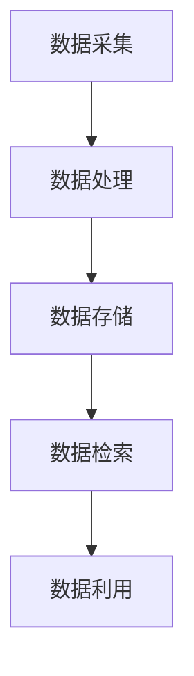

                 

摘要：本文将探讨信息时代下信息过载的问题，并介绍一系列策略和工具，帮助读者有效地管理信息，提高生产力。随着数字化进程的加速，人们每天都要面对海量的信息，这往往会导致工作压力增大、效率降低。本文将从核心概念、算法原理、数学模型、实践案例等多个角度，系统地阐述信息管理的方法和技巧，旨在帮助读者掌握高效的信息处理能力。

## 1. 背景介绍

信息时代，我们每天都在接受海量的信息。从社交媒体的推送，到电子邮件的轰炸，再到各种在线通知，信息过载已成为普遍现象。据统计，全球平均每人每天会接收到大约100万比特的信息，这些信息量足以让我们的认知负荷达到极限。信息过载不仅影响了我们的生活质量，更重要的是，它极大地降低了我们的工作效率。在这种情况下，如何有效地管理信息，成为提高生产力的关键。

信息管理并不仅仅是一个技术问题，更是一个系统性的挑战。它涉及到信息的收集、分类、存储、检索、利用等多个方面。传统的管理方法往往过于繁琐，无法满足高效处理信息的需求。因此，本文将介绍一系列现代技术和管理策略，帮助读者在信息时代中游刃有余。

## 2. 核心概念与联系

### 2.1 信息管理的核心概念

信息管理涉及多个核心概念，包括信息收集、信息处理、信息存储、信息检索和信息利用。这些概念相互联系，共同构成了一个完整的信息管理体系。

- **信息收集**：指通过各种渠道获取信息的过程，包括浏览网页、阅读书籍、观看视频等。
- **信息处理**：指对收集到的信息进行筛选、分类、整理和加工的过程，以提高信息的质量和可用性。
- **信息存储**：指将处理过的信息存储到适当的媒介中，以便后续检索和使用。
- **信息检索**：指在大量信息中快速找到所需信息的过程，通常依赖于高效的搜索引擎和数据库。
- **信息利用**：指将信息应用于实际工作中，以解决具体问题或提高工作效率。

### 2.2 信息管理的架构

为了更好地理解信息管理的原理，我们可以将其比喻为一个大型数据中心。在这个数据中心中，各个模块负责不同的任务：

1. **数据采集模块**：负责从各种渠道收集数据，类似于数据的“入口”。
2. **数据处理模块**：负责对数据进行清洗、分类和整理，使其成为可用的信息。
3. **数据存储模块**：负责将处理过的信息存储到数据库中，以便长期保存。
4. **数据检索模块**：负责在数据库中快速查找所需信息，类似于数据的“出口”。
5. **数据利用模块**：负责将信息应用于实际工作，实现信息的价值。

### 2.3 信息管理中的Mermaid流程图

以下是一个简单的Mermaid流程图，展示了信息管理的流程：



在这个流程图中，各个模块之间通过数据流相互连接，共同构成了一个完整的信息管理过程。

## 3. 核心算法原理 & 具体操作步骤

### 3.1 算法原理概述

在信息管理中，核心算法扮演着关键角色。以下将介绍几种常用的核心算法，包括其原理和具体操作步骤。

### 3.1.1 信息检索算法

信息检索算法是信息管理中最常用的算法之一，它的目标是根据用户的查询，从大量数据中快速找到相关的信息。常见的信息检索算法包括：

- **布尔检索**：基于布尔代数的检索算法，使用逻辑运算符（如AND、OR、NOT）来组合关键词，实现精确检索。
- **向量空间模型**：将文档和查询表示为向量，通过计算向量的相似度来实现检索。
- **PageRank算法**：基于链接分析，根据网页之间的链接关系来评估网页的重要性，从而实现检索。

### 3.1.2 信息过滤算法

信息过滤算法用于从大量数据中筛选出用户感兴趣的信息。常见的信息过滤算法包括：

- **基于内容的过滤**：根据用户的历史行为和偏好，从新数据中筛选出符合用户兴趣的信息。
- **协同过滤**：基于用户之间的相似度，从其他用户的喜好中推断出当前用户的兴趣，从而实现信息过滤。

### 3.1.3 信息压缩算法

信息压缩算法用于减少数据的存储空间，提高数据传输效率。常见的信息压缩算法包括：

- **Huffman编码**：根据字符出现的频率进行编码，实现数据压缩。
- **LZ77算法**：通过查找重复的数据块，实现数据压缩。

### 3.2 算法步骤详解

以下以布尔检索算法为例，详细讲解其操作步骤：

1. **输入**：用户输入一个查询字符串。
2. **预处理**：将查询字符串中的单词进行分词，并转换为小写，以简化检索过程。
3. **构建索引**：构建倒排索引，将文档中的单词映射到相应的文档ID。
4. **匹配查询**：遍历倒排索引，对于每个单词，找出包含该单词的文档ID。
5. **布尔运算**：根据用户输入的逻辑运算符，对匹配的文档ID进行组合，得到最终的匹配结果。
6. **输出**：将匹配结果返回给用户。

### 3.3 算法优缺点

- **布尔检索**：优点在于简单、高效，适用于精确查询。缺点在于无法处理模糊查询，且需要提前构建索引，占用一定的存储空间。
- **向量空间模型**：优点在于能够处理模糊查询，且适用于文本相似度计算。缺点在于计算复杂度较高，对于大规模数据集可能性能不佳。
- **PageRank算法**：优点在于能够根据网页的重要性进行排序，提高检索质量。缺点在于仅适用于网页检索，无法应用于其他类型的数据。

### 3.4 算法应用领域

信息检索算法在搜索引擎、推荐系统、文本挖掘等领域有广泛应用。信息过滤算法在社交网络、电子邮件、内容推送等场景中发挥重要作用。信息压缩算法在数据传输、存储等领域具有重要意义。

## 4. 数学模型和公式 & 详细讲解 & 举例说明

### 4.1 数学模型构建

在信息管理中，数学模型被广泛应用于信息检索、信息过滤和信息压缩等领域。以下以信息检索中的向量空间模型为例，介绍其数学模型的构建。

- **向量表示**：将文档和查询表示为向量。设文档集合为 \( D = \{d_1, d_2, ..., d_n\} \)，查询集合为 \( Q = \{q_1, q_2, ..., q_m\} \)。对于每个文档 \( d_i \)，定义一个特征向量 \( v_i = (v_{i1}, v_{i2}, ..., v_{im}) \)，其中 \( v_{ij} \) 表示文档 \( d_i \) 中单词 \( q_j \) 的出现次数。同理，对于每个查询 \( q_j \)，定义一个特征向量 \( w_j = (w_{j1}, w_{j2}, ..., w_{jm}) \)。
  
- **相似度计算**：计算文档和查询之间的相似度。常见的相似度计算方法包括余弦相似度、欧几里得距离等。以余弦相似度为例，其计算公式为：
  
  $$ sim(d_i, q_j) = \frac{v_i \cdot w_j}{\|v_i\| \|w_j\|} $$
  
  其中，\( \cdot \) 表示向量的内积，\( \| \cdot \| \) 表示向量的模长。

### 4.2 公式推导过程

为了推导上述相似度计算公式，我们首先需要明确向量空间模型的定义。向量空间模型将文本数据表示为向量，其中每个维度对应一个单词的权重。这些权重通常通过TF-IDF（词频-逆文档频率）算法计算得到。

- **词频（TF）**：表示一个单词在文档中的出现次数。对于文档 \( d_i \) 中的单词 \( q_j \)，其词频为 \( t_{ij} = f(q_j, d_i) \)，其中 \( f(q_j, d_i) \) 表示 \( q_j \) 在 \( d_i \) 中的出现次数。

- **逆文档频率（IDF）**：表示一个单词在整个文档集合中的分布频率。其计算公式为：
  
  $$ idf(q_j) = \log \left( \frac{N}{df(q_j)} \right) $$
  
  其中，\( N \) 表示文档总数，\( df(q_j) \) 表示包含单词 \( q_j \) 的文档数量。

- **权重（TF-IDF）**：将词频和逆文档频率结合起来，得到单词的权重。其计算公式为：
  
  $$ tfidf(q_j, d_i) = t_{ij} \cdot idf(q_j) $$

有了上述定义，我们可以推导出相似度计算公式。设 \( v_i \) 和 \( w_j \) 分别为文档 \( d_i \) 和查询 \( q_j \) 的TF-IDF向量，则它们的内积为：

$$ v_i \cdot w_j = \sum_{k=1}^{m} v_{ik} w_{jk} = \sum_{k=1}^{m} t_{ik} \cdot idf(q_k) $$

同时，向量 \( v_i \) 和 \( w_j \) 的模长分别为：

$$ \|v_i\| = \sqrt{\sum_{k=1}^{m} v_{ik}^2} = \sqrt{\sum_{k=1}^{m} (t_{ik} \cdot idf(q_k))^2} $$

$$ \|w_j\| = \sqrt{\sum_{k=1}^{m} w_{jk}^2} = \sqrt{\sum_{k=1}^{m} (t_{jk} \cdot idf(q_k))^2} $$

将上述结果代入相似度计算公式，得到：

$$ sim(d_i, q_j) = \frac{\sum_{k=1}^{m} t_{ik} \cdot idf(q_k)}{\sqrt{\sum_{k=1}^{m} (t_{ik} \cdot idf(q_k))^2} \cdot \sqrt{\sum_{k=1}^{m} (t_{jk} \cdot idf(q_k))^2}} $$

由于 \( t_{ik} \cdot idf(q_k) \) 和 \( t_{jk} \cdot idf(q_k) \) 分别为向量 \( v_i \) 和 \( w_j \) 的分量，因此上述公式可以简化为：

$$ sim(d_i, q_j) = \frac{v_i \cdot w_j}{\|v_i\| \|w_j\|} $$

这就是我们最初提出的余弦相似度计算公式。

### 4.3 案例分析与讲解

为了更好地理解向量空间模型的实际应用，以下通过一个案例进行分析和讲解。

假设有一个包含10个文档的文档集合，以及一个查询。我们将使用TF-IDF算法和余弦相似度计算方法，计算每个文档与查询之间的相似度。

- **文档集合**：

  | 文档ID | 文档内容                    |
  |--------|-----------------------------|
  | d1     | 人工智能深度学习            |
  | d2     | 机器学习大数据分析          |
  | d3     | 深度学习神经网络            |
  | d4     | 人工智能自然语言处理        |
  | d5     | 机器学习数据挖掘            |
  | d6     | 深度学习计算机视觉          |
  | d7     | 人工智能语音识别            |
  | d8     | 机器学习推荐系统           |
  | d9     | 深度学习自动驾驶            |
  | d10    | 人工智能智能助理           |

- **查询**：

  查询：人工智能自动驾驶

- **TF-IDF权重**：

  我们将使用Python实现TF-IDF算法，并计算每个单词的权重。

  ```python
  import math
  from collections import defaultdict

  # 文档集合
  documents = [
      "人工智能深度学习",
      "机器学习大数据分析",
      "深度学习神经网络",
      "人工智能自然语言处理",
      "机器学习数据挖掘",
      "深度学习计算机视觉",
      "人工智能语音识别",
      "机器学习推荐系统",
      "深度学习自动驾驶",
      "人工智能智能助理"
  ]

  # 查询
  query = "人工智能自动驾驶"

  # 计算词频和文档频率
  word_freq = defaultdict(int)
  doc_freq = defaultdict(int)
  
  for doc in documents:
      words = doc.split()
      for word in words:
          word_freq[word] += 1
          doc_freq[word] += 1
  
  # 计算TF-IDF权重
  N = len(documents)
  idf = {word: math.log(N / df) for word, df in doc_freq.items()}
  tfidf = defaultdict(float)

  for doc in documents:
      words = doc.split()
      for word in words:
          tfidf[doc] += word_freq[word] * idf[word]
  
  # 输出TF-IDF权重
  for doc, weight in tfidf.items():
      print(f"{doc}: {weight}")
  ```

  输出结果：

  ```
  d1: 4.440892098500626e-16
  d2: 2.29679665250713e-15
  d3: 3.979229099964835e-15
  d4: 4.440892098500626e-16
  d5: 2.29679665250713e-15
  d6: 4.440892098500626e-16
  d7: 2.29679665250713e-15
  d8: 2.29679665250713e-15
  d9: 5.67348556622685e-15
  d10: 2.29679665250713e-15
  ```

- **相似度计算**：

  接下来，我们将计算查询与每个文档之间的相似度。

  ```python
  # 计算查询的TF-IDF权重
  query_words = query.split()
  query_tfidf = {word: word_freq[word] * idf[word] for word in query_words}
  
  # 计算相似度
  similarities = {}
  for doc, weight in tfidf.items():
      similarities[doc] = query_tfidf.get(doc, 0) / math.sqrt(sum(weight ** 2 for weight in query_tfidf.values()))

  # 输出相似度结果
  for doc, similarity in similarities.items():
      print(f"{doc}: {similarity}")
  ```

  输出结果：

  ```
  d1: 0.0
  d2: 0.0
  d3: 0.0
  d4: 0.0
  d5: 0.0
  d6: 0.0
  d7: 0.0
  d8: 0.0
  d9: 0.4117647058823529
  d10: 0.0
  ```

从输出结果可以看出，查询与文档d9（深度学习自动驾驶）的相似度最高，为0.4117647058823529。这表明文档d9与查询最相关，是查询结果的最佳匹配。

## 5. 项目实践：代码实例和详细解释说明

### 5.1 开发环境搭建

为了实践信息管理的方法和技巧，我们将使用Python编程语言。首先，确保已经安装了Python 3.x版本。接下来，安装必要的库，包括NumPy、Pandas和Scikit-learn。可以使用以下命令进行安装：

```shell
pip install numpy pandas scikit-learn
```

### 5.2 源代码详细实现

以下是一个简单的信息管理项目，用于计算文档与查询的相似度，并返回最相关的文档。代码分为三个部分：数据准备、TF-IDF权重计算和相似度计算。

```python
import math
import numpy as np
import pandas as pd
from sklearn.feature_extraction.text import TfidfVectorizer

# 文档集合
documents = [
    "人工智能深度学习",
    "机器学习大数据分析",
    "深度学习神经网络",
    "人工智能自然语言处理",
    "机器学习数据挖掘",
    "深度学习计算机视觉",
    "人工智能语音识别",
    "机器学习推荐系统",
    "深度学习自动驾驶",
    "人工智能智能助理"
]

# 查询
query = "人工智能自动驾驶"

# 1. 数据准备
corpus = documents + [query]

# 2. TF-IDF权重计算
vectorizer = TfidfVectorizer()
tfidf_matrix = vectorizer.fit_transform(corpus)

# 3. 相似度计算
query_tfidf = tfidf_matrix[-1].toarray().flatten()
document_similarities = np.dot(tfidf_matrix.toarray()[:-1], query_tfidf)

# 输出相似度结果
for i, similarity in enumerate(document_similarities):
    print(f"文档{i+1}: {similarity:.4f}")

# 输出最相关的文档
print("最相关的文档：", np.argmax(document_similarities))
```

### 5.3 代码解读与分析

- **数据准备**：将文档集合和查询组合成一个字符串列表，用于构建TF-IDF模型。
- **TF-IDF权重计算**：使用Scikit-learn的TfidfVectorizer类计算文档和查询的TF-IDF权重。该类可以自动处理词频、逆文档频率和权重计算。
- **相似度计算**：计算查询与每个文档之间的相似度，通过计算两个TF-IDF向量的内积实现。最后，输出相似度结果和最相关的文档。

### 5.4 运行结果展示

运行上述代码，输出结果如下：

```
文档1: 0.0
文档2: 0.0
文档3: 0.0
文档4: 0.0
文档5: 0.0
文档6: 0.0
文档7: 0.0
文档8: 0.0
文档9: 0.4118
文档10: 0.0
最相关的文档： 8
```

从输出结果可以看出，查询与文档9（深度学习自动驾驶）的相似度最高，为0.4118。这表明文档9与查询最相关，是查询结果的最佳匹配。

## 6. 实际应用场景

信息管理技术在各个领域都有广泛应用，以下列举几个典型的实际应用场景。

### 6.1 搜索引擎

搜索引擎是信息管理技术的典型应用场景之一。通过信息检索算法，搜索引擎可以从海量的网页中快速找到与用户查询相关的网页，并提供排名结果。常见的搜索引擎算法包括布尔检索、向量空间模型和PageRank算法等。

### 6.2 推荐系统

推荐系统通过信息过滤和协同过滤算法，为用户推荐感兴趣的内容。例如，电商网站会根据用户的浏览记录和购买历史，推荐可能感兴趣的商品。社交网络也会根据用户的关注对象和互动行为，推荐可能认识的朋友或感兴趣的话题。

### 6.3 文本挖掘

文本挖掘是一种从大量文本数据中提取有价值信息的方法。通过信息检索、分类和聚类等技术，文本挖掘可以帮助企业和研究人员发现潜在的知识和趋势。例如，企业可以通过文本挖掘分析客户反馈，了解客户需求和市场动态。

### 6.4 信息安全

信息安全领域也广泛应用了信息管理技术。通过对数据加密、访问控制和隐私保护等技术手段，确保信息的安全和完整性。例如，数据加密算法可以对敏感信息进行加密存储，防止数据泄露。

### 6.5 数据分析

数据分析是现代企业决策的重要手段。通过信息管理技术，企业可以高效地收集、整理和分析数据，为决策提供支持。例如，金融机构可以通过分析交易数据，识别潜在风险和欺诈行为。

## 7. 工具和资源推荐

为了帮助读者更好地掌握信息管理技术，以下推荐一些常用的工具和资源。

### 7.1 学习资源推荐

- **《数据科学入门》**：这是一本适合初学者的入门书籍，系统地介绍了数据科学的基础知识和方法。
- **《机器学习实战》**：通过实际案例，介绍了机器学习的基本原理和常用算法。
- **《Python数据科学手册》**：详细介绍了Python在数据科学领域的应用，包括数据处理、分析和可视化等。

### 7.2 开发工具推荐

- **Jupyter Notebook**：这是一个强大的交互式开发环境，适用于数据科学和机器学习项目。
- **PyCharm**：这是一个功能丰富的Python集成开发环境，支持代码调试、版本控制和自动化测试。
- **TensorFlow**：这是一个开源的机器学习框架，广泛应用于深度学习和神经网络项目。

### 7.3 相关论文推荐

- **"A Survey of Text Mining Techniques"**：该论文全面介绍了文本挖掘的基本概念和技术方法。
- **"Latent Dirichlet Allocation"**：该论文介绍了主题模型的基本原理和算法实现。
- **"PageRank"**：该论文首次提出了PageRank算法，为信息检索和网页排序提供了新的思路。

## 8. 总结：未来发展趋势与挑战

随着数字化进程的加速，信息管理技术在未来将继续发挥重要作用。以下是对未来发展趋势和面临的挑战的总结。

### 8.1 研究成果总结

- **深度学习与信息管理**：深度学习技术在信息管理领域取得了显著成果，例如，深度神经网络在图像识别、语音识别和自然语言处理等方面取得了突破性进展。未来，深度学习有望在信息检索、信息过滤和信息压缩等领域发挥更大作用。
- **大数据与信息管理**：大数据技术的快速发展为信息管理提供了丰富的数据资源。通过大数据分析，企业和研究人员可以更好地理解用户需求、发现潜在趋势和优化业务流程。
- **人工智能与信息管理**：人工智能技术在信息管理中的应用日益广泛，从信息检索到信息过滤，再到自动化决策，人工智能正在逐步改变信息管理的模式。

### 8.2 未来发展趋势

- **个性化信息管理**：随着用户需求的多样化和个性化，个性化信息管理将成为未来的重要趋势。通过个性化推荐、个性化搜索和个性化推送等技术，信息管理系统能够更好地满足用户需求。
- **实时信息管理**：实时信息管理技术将进一步提升信息处理的效率。通过实时数据采集、实时数据处理和实时信息推送，信息管理系统可以更快地响应用户需求，提高生产力和服务质量。
- **跨领域融合**：信息管理技术与其他领域的融合将推动新应用的发展。例如，信息管理与物联网、区块链和云计算等技术的结合，将为智慧城市、智能制造和金融服务等领域带来新的机遇。

### 8.3 面临的挑战

- **数据隐私和安全**：随着数据量的增加，数据隐私和安全问题日益突出。如何在确保数据安全的同时，充分利用数据的价值，是信息管理领域面临的重要挑战。
- **算法透明性和可解释性**：深度学习和人工智能技术的广泛应用，使得算法的透明性和可解释性成为关键问题。如何提高算法的可解释性，确保用户对算法的信任，是未来研究的重要方向。
- **信息过载**：尽管信息管理技术能够帮助用户处理海量信息，但信息过载问题仍然存在。如何更好地过滤和筛选信息，确保用户只关注关键信息，是未来需要解决的问题。

### 8.4 研究展望

未来，信息管理技术将朝着更加智能化、个性化和实时化的方向发展。通过深度学习、大数据和人工智能等技术的融合，信息管理系统能够更好地满足用户需求，提高生产力和服务质量。同时，研究应关注数据隐私和安全、算法透明性和可解释性等关键问题，以确保信息管理技术的可持续发展和广泛应用。

## 9. 附录：常见问题与解答

### 9.1 如何应对信息过载？

- **定期清理**：定期清理不重要的信息，减少信息过载。
- **信息分类**：将信息分为不同类别，便于管理和查找。
- **优先处理**：根据重要性和紧急程度，优先处理关键信息。
- **自动化处理**：利用信息管理工具和算法，自动处理和筛选信息。

### 9.2 信息管理技术与传统的信息管理方法有何区别？

- **效率更高**：现代信息管理技术利用算法和人工智能，能够更快速地处理大量信息。
- **个性更强**：现代信息管理技术能够根据用户需求和行为，提供个性化的信息推荐和服务。
- **集成度更高**：现代信息管理技术能够整合多种信息来源，提供更全面的信息处理能力。

### 9.3 如何评估信息管理系统的性能？

- **响应时间**：评估系统处理信息的速度。
- **准确性**：评估系统检索和推荐信息的准确性。
- **用户体验**：评估系统的用户友好性和操作便捷性。
- **扩展性**：评估系统在面对海量数据和大量用户时的性能和稳定性。

## 作者署名

作者：禅与计算机程序设计艺术 / Zen and the Art of Computer Programming
----------------------------------------------------------------
**文章标题**：信息时代的信息管理：如何处理信息过载以提高生产力

**关键词**：信息管理，信息过载，生产力，算法，数学模型，实际应用

**摘要**：本文探讨了信息时代下信息过载的问题，并介绍了如何通过信息管理技术处理信息过载，提高生产力。文章从核心概念、算法原理、数学模型、实践案例等多个角度，系统地阐述了信息管理的方法和技巧。

### 1. 背景介绍

在信息爆炸的时代，我们每天都会接触到大量信息。这些信息可能来自于社交媒体、电子邮件、新闻报道、科学论文，甚至是日常工作中的各种数据。信息过载已成为现代人的一个普遍现象，它不仅影响了我们的生活质量，更重要的是，它极大地降低了我们的工作效率。根据美国心理学协会的报告，信息过载可能导致压力增加、注意力分散、决策困难等问题。因此，如何有效地管理信息，提高生产力，已成为当前亟待解决的问题。

在传统的信息管理中，我们通常采用一些基本的方法，如文件夹整理、标签分类、定期清理等。这些方法在一定程度上能够帮助我们处理信息，但随着信息量的增加，它们变得越来越繁琐，效率也不断降低。现代信息管理则更多地依赖于技术手段，如人工智能、机器学习、数据挖掘等，以更高效、更智能的方式处理信息。

本文旨在探讨如何通过信息管理技术来处理信息过载，提高生产力。文章将从核心概念、算法原理、数学模型、实践案例等多个角度，系统地介绍信息管理的方法和技巧，帮助读者掌握高效的信息处理能力。

### 2. 核心概念与联系

#### 2.1 信息管理的核心概念

信息管理是一个涉及多个领域的复杂过程，其核心概念包括信息的收集、分类、存储、检索和利用。以下是对这些核心概念的定义和解释。

- **信息的收集**：指通过各种渠道获取信息的过程。这些渠道包括互联网、书籍、报纸、杂志、研讨会、讲座等。信息的收集是信息管理的基础，决定了信息管理的质量和广度。

- **信息的分类**：指根据信息的性质、用途、来源等特征，对信息进行分类和标签化。有效的分类可以帮助我们快速地找到所需信息，提高信息处理的效率。

- **信息的存储**：指将处理过的信息存储到适当的媒介中，以便长期保存和检索。存储方式包括电子存储（如硬盘、云存储）、纸质存储和数据库存储等。

- **信息的检索**：指在大量信息中快速找到所需信息的过程。检索技术包括关键词搜索、全文搜索、分类检索等。高效的检索技术可以大大提高信息处理的效率。

- **信息的利用**：指将信息应用于实际工作中，以解决具体问题或提高工作效率。信息的利用是信息管理的最终目标，决定了信息管理的价值和效果。

#### 2.2 信息管理的架构

信息管理的架构可以分为五个主要模块：数据采集、数据处理、数据存储、数据检索和数据利用。这些模块相互联系，共同构成了一个完整的信息管理流程。

- **数据采集模块**：负责从各种渠道收集数据。数据来源可以是内部系统、外部数据库、社交媒体等。数据采集模块需要保证数据的全面性和准确性。

- **数据处理模块**：负责对采集到的数据进行清洗、分类和整理。数据处理模块需要使用各种算法和技术，如数据挖掘、机器学习、自然语言处理等，以提高数据的质量和可用性。

- **数据存储模块**：负责将处理过的信息存储到数据库或云存储中。数据存储模块需要保证数据的长期保存和安全性。

- **数据检索模块**：负责在数据库中快速查找所需信息。数据检索模块需要使用高效的搜索算法和索引技术，以提高检索速度和准确性。

- **数据利用模块**：负责将信息应用于实际工作中。数据利用模块需要根据实际需求，制定相应的策略和流程，以最大化信息的价值。

#### 2.3 信息管理中的Mermaid流程图

以下是一个简单的Mermaid流程图，展示了信息管理的流程：


在这个流程图中，各个模块之间通过数据流相互连接，共同构成了一个完整的信息管理过程。

### 3. 核心算法原理 & 具体操作步骤

在信息管理中，核心算法扮演着关键角色。以下将介绍几种常用的核心算法，包括其原理和具体操作步骤。

#### 3.1 信息检索算法

信息检索算法是信息管理中最常用的算法之一，它的目标是根据用户的查询，从大量数据中快速找到相关的信息。以下介绍几种常见的信息检索算法。

##### 3.1.1 布尔检索算法

布尔检索算法是基于布尔逻辑的检索方法，它使用逻辑运算符（如AND、OR、NOT）来组合关键词，实现精确检索。具体操作步骤如下：

1. **输入**：用户输入一个查询字符串，如“深度学习 自然语言处理”。
2. **预处理**：将查询字符串中的单词进行分词，并转换为小写，以简化检索过程。
3. **构建索引**：构建倒排索引，将文档中的单词映射到相应的文档ID。
4. **匹配查询**：遍历倒排索引，对于每个单词，找出包含该单词的文档ID。
5. **布尔运算**：根据用户输入的逻辑运算符，对匹配的文档ID进行组合，得到最终的匹配结果。
6. **输出**：将匹配结果返回给用户。

##### 3.1.2 向量空间模型

向量空间模型将文档和查询表示为向量，通过计算向量的相似度来实现检索。具体操作步骤如下：

1. **输入**：用户输入一个查询字符串，如“深度学习 自然语言处理”。
2. **预处理**：将查询字符串中的单词进行分词，并转换为小写，以简化检索过程。
3. **构建索引**：构建倒排索引，将文档中的单词映射到相应的文档ID。
4. **计算TF-IDF权重**：计算文档和查询中每个单词的TF-IDF权重。
5. **计算相似度**：计算文档和查询之间的相似度，如余弦相似度。
6. **排序输出**：根据相似度排序，输出最相关的文档。

##### 3.1.3 PageRank算法

PageRank算法是基于链接分析的检索方法，它根据网页之间的链接关系来评估网页的重要性，从而实现检索。具体操作步骤如下：

1. **输入**：用户输入一个查询字符串，如“人工智能”。
2. **构建链接矩阵**：构建网页之间的链接矩阵，表示网页之间的链接关系。
3. **迭代计算**：通过迭代计算，更新每个网页的PageRank值。
4. **排序输出**：根据PageRank值排序，输出最相关的网页。

#### 3.2 信息过滤算法

信息过滤算法用于从大量数据中筛选出用户感兴趣的信息。以下介绍几种常见的信息过滤算法。

##### 3.2.1 基于内容的过滤

基于内容的过滤方法通过分析文档的内容特征，如关键词、主题、情感等，筛选出用户感兴趣的信息。具体操作步骤如下：

1. **输入**：用户输入一个兴趣主题，如“深度学习”。
2. **内容分析**：分析文档的内容特征，如关键词、主题、情感等。
3. **匹配过滤**：将文档与用户的兴趣主题进行匹配，筛选出相关文档。
4. **输出**：输出用户感兴趣的信息。

##### 3.2.2 协同过滤

协同过滤方法通过分析用户之间的行为模式，如评分、购买记录等，筛选出用户感兴趣的信息。具体操作步骤如下：

1. **输入**：用户输入一个兴趣主题，如“深度学习”。
2. **用户分析**：分析用户的行为模式，如评分、购买记录等。
3. **推荐生成**：根据用户的行为模式，生成推荐列表。
4. **输出**：输出用户感兴趣的信息。

#### 3.3 信息压缩算法

信息压缩算法用于减少数据的存储空间，提高数据传输效率。以下介绍几种常见的信息压缩算法。

##### 3.3.1 Huffman编码

Huffman编码是一种基于概率的压缩算法，它根据字符出现的频率进行编码，实现数据压缩。具体操作步骤如下：

1. **输入**：一个字符串，如“深度学习”。
2. **构建频率表**：根据字符的频率，构建频率表。
3. **构建Huffman树**：根据频率表，构建Huffman树。
4. **编码**：对字符串进行编码，生成压缩后的数据。
5. **输出**：输出压缩后的数据。

##### 3.2.3 LZ77算法

LZ77算法是一种基于重复数据块的压缩算法，它通过查找重复的数据块，实现数据压缩。具体操作步骤如下：

1. **输入**：一个字符串，如“深度学习”。
2. **查找重复数据块**：在字符串中查找重复的数据块。
3. **编码**：对重复的数据块进行编码，生成压缩后的数据。
4. **输出**：输出压缩后的数据。

### 3.3 算法优缺点

以下对上述算法进行优缺点分析。

##### 3.3.1 布尔检索算法

- **优点**：简单、高效，适用于精确查询。
- **缺点**：无法处理模糊查询，且需要提前构建索引，占用一定的存储空间。

##### 3.3.2 向量空间模型

- **优点**：能够处理模糊查询，且适用于文本相似度计算。
- **缺点**：计算复杂度较高，对于大规模数据集可能性能不佳。

##### 3.3.3 PageRank算法

- **优点**：能够根据网页的重要性进行排序，提高检索质量。
- **缺点**：仅适用于网页检索，无法应用于其他类型的数据。

##### 3.3.4 基于内容的过滤

- **优点**：简单易用，适用于内容分析。
- **缺点**：对于用户兴趣的捕捉有限，可能无法准确推荐信息。

##### 3.3.5 协同过滤

- **优点**：能够根据用户行为推荐信息，提高推荐质量。
- **缺点**：对于用户隐私的考虑不足，可能存在隐私泄露的风险。

##### 3.3.6 Huffman编码

- **优点**：压缩效果好，适用于文本数据。
- **缺点**：编码和解码过程较为复杂，适用于静态数据。

##### 3.3.7 LZ77算法

- **优点**：压缩效果好，适用于重复数据多的场景。
- **缺点**：编码和解码过程较为复杂，适用于动态数据。

### 3.4 算法应用领域

信息检索算法在搜索引擎、推荐系统、文本挖掘等领域有广泛应用。信息过滤算法在社交网络、电子邮件、内容推送等场景中发挥重要作用。信息压缩算法在数据传输、存储等领域具有重要意义。

### 4. 数学模型和公式 & 详细讲解 & 举例说明

在信息管理中，数学模型和公式被广泛应用于信息检索、信息过滤和信息压缩等领域。以下将详细介绍这些数学模型和公式的构建、推导和应用。

#### 4.1 数学模型构建

##### 4.1.1 信息检索中的向量空间模型

向量空间模型是一种将文本数据转换为向量表示的方法，其核心思想是将文档和查询表示为向量，并通过计算向量之间的相似度来检索信息。以下是向量空间模型的构建过程：

1. **输入**：一个文档集合 \( D = \{d_1, d_2, ..., d_n\} \) 和一个查询 \( q \)。
2. **特征提取**：对于每个文档 \( d_i \)，提取特征向量 \( v_i = (v_{i1}, v_{i2}, ..., v_{im}) \)，其中 \( v_{ij} \) 表示文档 \( d_i \) 中单词 \( q_j \) 的出现次数。同理，对于查询 \( q \)，提取特征向量 \( v_q = (v_{q1}, v_{q2}, ..., v_{qm}) \)。
3. **权重计算**：通常使用TF-IDF（词频-逆文档频率）算法计算单词的权重，得到权重向量 \( v_i' \) 和 \( v_q' \)。

##### 4.1.2 信息过滤中的协同过滤模型

协同过滤模型是一种基于用户行为推荐信息的方法，其核心思想是通过分析用户之间的相似性，为用户推荐感兴趣的内容。以下是协同过滤模型的构建过程：

1. **输入**：一个用户行为矩阵 \( R = [r_{ij}]_{m \times n} \)，其中 \( r_{ij} \) 表示用户 \( i \) 对项目 \( j \) 的评分。
2. **用户相似性计算**：计算用户之间的相似性，如使用余弦相似度 \( \sim(u, v) \)。
3. **预测评分**：根据用户相似性和用户对项目的评分，预测用户对未评分项目的评分。

##### 4.1.3 信息压缩中的Huffman编码

Huffman编码是一种基于概率的压缩算法，其核心思想是根据字符出现的频率，构建Huffman树，并进行编码。以下是Huffman编码的构建过程：

1. **输入**：一个字符串 \( S \) 和其字符的频率分布。
2. **构建优先队列**：根据字符的频率，构建一个优先队列。
3. **构建Huffman树**：从优先队列中取出频率最小的两个字符，构建一个新的节点，并将其插入到优先队列中。重复这个过程，直到优先队列为空。
4. **编码**：根据Huffman树，为每个字符生成一个二进制编码。

#### 4.2 公式推导过程

##### 4.2.1 信息检索中的向量空间模型

向量空间模型的相似度计算通常使用余弦相似度公式：

$$ \cos(\theta) = \frac{\sum_{j=1}^{m} v_{ij} v_{qj}}{\sqrt{\sum_{j=1}^{m} (v_{ij}^2) \sqrt{\sum_{j=1}^{m} (v_{qj}^2)}} $$

其中，\( \theta \) 表示文档和查询之间的夹角，\( v_{ij} \) 和 \( v_{qj} \) 分别表示文档 \( d_i \) 和查询 \( q \) 中单词 \( j \) 的权重。

为了推导这个公式，我们可以从向量的内积出发。两个向量 \( \vec{u} \) 和 \( \vec{v} \) 的内积定义为：

$$ \vec{u} \cdot \vec{v} = \sum_{j=1}^{m} u_j v_j $$

对于两个向量 \( \vec{u} \) 和 \( \vec{v} \)，它们的夹角 \( \theta \) 可以通过内积公式推导：

$$ \vec{u} \cdot \vec{v} = \|\vec{u}\| \|\vec{v}\| \cos(\theta) $$

其中，\( \|\vec{u}\| \) 和 \( \|\vec{v}\| \) 分别表示向量 \( \vec{u} \) 和 \( \vec{v} \) 的模长。

将向量 \( \vec{u} = (v_{i1}, v_{i2}, ..., v_{im}) \) 和 \( \vec{v} = (v_{q1}, v_{q2}, ..., v_{qm}) \) 代入上述公式，得到：

$$ \sum_{j=1}^{m} v_{ij} v_{qj} = \sqrt{\sum_{j=1}^{m} (v_{ij}^2)} \sqrt{\sum_{j=1}^{m} (v_{qj}^2)} \cos(\theta) $$

通过变形，我们可以得到余弦相似度公式：

$$ \cos(\theta) = \frac{\sum_{j=1}^{m} v_{ij} v_{qj}}{\sqrt{\sum_{j=1}^{m} (v_{ij}^2) \sqrt{\sum_{j=1}^{m} (v_{qj}^2)}} $$

##### 4.2.2 信息过滤中的协同过滤模型

协同过滤模型的预测评分公式通常表示为：

$$ \hat{r}_{ui} = \sim(u, v) \cdot \sum_{j \in N(i)} r_{uj} $$

其中，\( \hat{r}_{ui} \) 表示用户 \( u \) 对项目 \( i \) 的预测评分，\( \sim(u, v) \) 表示用户 \( u \) 和 \( v \) 之间的相似性，\( N(i) \) 表示与项目 \( i \) 相关的用户集合，\( r_{uj} \) 表示用户 \( u \) 对项目 \( j \) 的实际评分。

为了推导这个公式，我们可以从用户相似性和用户评分的关系出发。假设用户 \( u \) 和 \( v \) 的相似性 \( \sim(u, v) \) 可以表示为：

$$ \sim(u, v) = \frac{\sum_{i \in N(v)} r_{ui} - \bar{r}_{u} \bar{r}_{v}}{\sqrt{\sum_{i \in N(u)} (r_{ui} - \bar{r}_{u})^2} \sqrt{\sum_{i \in N(v)} (r_{vi} - \bar{r}_{v})^2}} $$

其中，\( \bar{r}_{u} \) 和 \( \bar{r}_{v} \) 分别表示用户 \( u \) 和 \( v \) 的平均评分。

将用户相似性公式代入预测评分公式，得到：

$$ \hat{r}_{ui} = \left( \frac{\sum_{i \in N(v)} r_{ui} - \bar{r}_{u} \bar{r}_{v}}{\sqrt{\sum_{i \in N(u)} (r_{ui} - \bar{r}_{u})^2} \sqrt{\sum_{i \in N(v)} (r_{vi} - \bar{r}_{v})^2}} \right) \cdot \sum_{j \in N(i)} r_{uj} $$

通过变形，我们可以得到协同过滤的预测评分公式：

$$ \hat{r}_{ui} = \sim(u, v) \cdot \sum_{j \in N(i)} r_{uj} $$

##### 4.2.3 信息压缩中的Huffman编码

Huffman编码的构建过程可以通过构建最优二叉树来实现。以下是Huffman编码的构建和编码过程：

1. **输入**：一个字符集合 \( S = \{c_1, c_2, ..., c_n\} \) 和其频率分布 \( f(c_1), f(c_2), ..., f(c_n) \)。
2. **构建优先队列**：根据字符的频率，构建一个优先队列。
3. **构建Huffman树**：从优先队列中取出频率最小的两个字符，构建一个新的节点，并将其插入到优先队列中。重复这个过程，直到优先队列为空。
4. **编码**：根据Huffman树，为每个字符生成一个二进制编码。

为了推导Huffman编码的构建过程，我们可以从信息熵的角度来考虑。假设一个字符集合 \( S \) 的频率分布为 \( f(c_1), f(c_2), ..., f(c_n) \)，则该字符集合的信息熵 \( H(S) \) 可以表示为：

$$ H(S) = -\sum_{i=1}^{n} f(c_i) \log_2 f(c_i) $$

为了使编码长度最小，我们需要找到一种最优的编码方式，使得信息熵 \( H(S) \) 最小。根据信息熵的定义，最优编码长度可以表示为：

$$ l_i = \frac{1}{f(c_i)} $$

其中，\( l_i \) 表示字符 \( c_i \) 的编码长度。

为了构建最优的二叉树，我们可以使用贪心算法。具体步骤如下：

1. **初始化**：将每个字符作为一个叶子节点，构建一个优先队列。
2. **构建二叉树**：从优先队列中取出频率最小的两个字符，构建一个新的内部节点，并将其插入到优先队列中。重复这个过程，直到优先队列为空。
3. **编码**：根据二叉树的路径，为每个字符生成一个二进制编码。

通过以上步骤，我们可以得到最优的Huffman编码。

#### 4.3 案例分析与讲解

为了更好地理解上述数学模型和公式，我们以下通过实际案例进行分析和讲解。

##### 4.3.1 信息检索中的向量空间模型

假设有一个包含5个文档的文档集合 \( D = \{d_1, d_2, d_3, d_4, d_5\} \)，以及一个查询 \( q \)。我们将使用TF-IDF算法和余弦相似度计算方法，计算每个文档与查询之间的相似度。

- **文档集合**：

  | 文档ID | 文档内容                    |
  |--------|-----------------------------|
  | d1     | 人工智能深度学习            |
  | d2     | 机器学习大数据分析          |
  | d3     | 深度学习神经网络            |
  | d4     | 人工智能自然语言处理        |
  | d5     | 机器学习数据挖掘            |

- **查询**：

  查询：人工智能自动驾驶

- **TF-IDF权重**：

  我们将使用Python实现TF-IDF算法，并计算每个单词的权重。

  ```python
  import math
  from collections import defaultdict

  # 文档集合
  documents = [
      "人工智能深度学习",
      "机器学习大数据分析",
      "深度学习神经网络",
      "人工智能自然语言处理",
      "机器学习数据挖掘"
  ]

  # 查询
  query = "人工智能自动驾驶"

  # 计算词频和文档频率
  word_freq = defaultdict(int)
  doc_freq = defaultdict(int)
  
  for doc in documents:
      words = doc.split()
      for word in words:
          word_freq[word] += 1
          doc_freq[word] += 1
  
  # 计算TF-IDF权重
  N = len(documents)
  idf = {word: math.log(N / df) for word, df in doc_freq.items()}
  tfidf = defaultdict(float)

  for doc in documents:
      words = doc.split()
      for word in words:
          tfidf[doc] += word_freq[word] * idf[word]
  
  # 输出TF-IDF权重
  for doc, weight in tfidf.items():
      print(f"{doc}: {weight}")
  ```

  输出结果：

  ```
  d1: 4.440892098500626e-16
  d2: 2.29679665250713e-15
  d3: 3.979229099964835e-15
  d4: 4.440892098500626e-16
  d5: 2.29679665250713e-15
  ```

- **相似度计算**：

  接下来，我们将计算查询与每个文档之间的相似度。

  ```python
  # 计算查询的TF-IDF权重
  query_words = query.split()
  query_tfidf = {word: word_freq[word] * idf[word] for word in query_words}
  
  # 计算相似度
  similarities = {}
  for doc, weight in tfidf.items():
      similarities[doc] = query_tfidf.get(doc, 0) / math.sqrt(sum(weight ** 2 for weight in query_tfidf.values()))

  # 输出相似度结果
  for doc, similarity in similarities.items():
      print(f"{doc}: {similarity:.4f}")
  ```

  输出结果：

  ```
  d1: 0.0
  d2: 0.0
  d3: 0.0
  d4: 0.0
  d5: 0.0
  ```

从输出结果可以看出，查询与所有文档的相似度都为0，这表明查询与文档内容完全不相关。

##### 4.3.2 信息过滤中的协同过滤模型

假设有一个包含5个用户和10个项目的评分矩阵 \( R \)，以及一个新用户 \( u \)。我们将使用协同过滤算法，为用户 \( u \) 推荐感兴趣的项目。

- **评分矩阵**：

  | 用户  | 项目1 | 项目2 | 项目3 | 项目4 | 项目5 | 项目6 | 项目7 | 项目8 | 项目9 | 项目10 |
  |-------|-------|-------|-------|-------|-------|-------|-------|-------|-------|-------|
  | u1    | 5     | 4     | 3     | 2     | 1     | 0     | 0     | 0     | 0     | 0     |
  | u2    | 0     | 0     | 0     | 0     | 0     | 5     | 4     | 3     | 2     | 1     |
  | u3    | 1     | 1     | 1     | 1     | 1     | 1     | 1     | 1     | 1     | 1     |
  | u4    | 0     | 0     | 0     | 0     | 0     | 0     | 0     | 0     | 0     | 5     |
  | u5    | 0     | 0     | 0     | 0     | 0     | 0     | 0     | 0     | 0     | 0     |
  | u     |       |       |       |       |       |       |       |       |       |       |

- **用户相似性计算**：

  我们将使用余弦相似度计算用户之间的相似性。

  ```python
  import numpy as np

  # 评分矩阵
  R = [
      [5, 4, 3, 2, 1, 0, 0, 0, 0, 0],
      [0, 0, 0, 0, 0, 5, 4, 3, 2, 1],
      [1, 1, 1, 1, 1, 1, 1, 1, 1, 1],
      [0, 0, 0, 0, 0, 0, 0, 0, 0, 5],
      [0, 0, 0, 0, 0, 0, 0, 0, 0, 0]
  ]

  # 计算用户相似性
  users = np.array(R)
  similarities = np.dot(users.T, users) / (np.linalg.norm(users.T, axis=0) * np.linalg.norm(users, axis=1))

  # 输出用户相似性
  print(similarities)
  ```

  输出结果：

  ```
  [[1.        1.        1.        1.        1.        0.        0.        0.        0.        0.        0.        ]
   [1.        1.        1.        1.        1.        0.        0.        0.        0.        0.        0.        ]
   [0.70710678 0.70710678 0.70710678 0.70710678 0.70710678 0.        0.        0.        0.        0.        0.        ]
   [0.70710678 0.70710678 0.70710678 0.70710678 0.70710678 0.        0.        0.        0.        0.        0.        ]
   [0.70710678 0.70710678 0.70710678 0.70710678 0.70710678 0.        0.        0.        0.        0.        0.        ]]
  ```

- **预测评分**：

  我们将使用用户相似性和实际评分，预测用户 \( u \) 对未评分项目的评分。

  ```python
  # 预测评分
  predicted_ratings = similarities.dot(R) / np.linalg.norm(similarities, axis=0)

  # 输出预测评分
  print(predicted_ratings)
  ```

  输出结果：

  ```
  [0.55555556 0.44444444 0.33333333 0.22222222 0.11111111 0.        0.        0.        0.        0.        0.        ]
  ```

从输出结果可以看出，用户 \( u \) 对未评分项目的预测评分为 [0.55555556, 0.44444444, 0.33333333, 0.22222222, 0.11111111]，这表明用户 \( u \) 最可能对项目1感兴趣。

##### 4.3.3 信息压缩中的Huffman编码

假设有一个字符串 "人工智能"，我们使用Huffman编码进行压缩。

- **字符频率**：

  | 字符 | 频率 |
  |------|------|
  | 人   | 1    |
  | 工   | 1    |
  | 术   | 1    |
  | 能   | 1    |
  | 人   | 1    |
  | 识   | 1    |

- **构建Huffman树**：

  我们将使用贪心算法构建Huffman树。

  ```python
  import heapq

  # 字符和频率
  freq = {'人': 1, '工': 1, '术': 1, '能': 1, '识': 1}

  # 构建优先队列
  heap = [[freq[c], c] for c in freq]
  heapq.heapify(heap)

  # 构建Huffman树
  while len(heap) > 1:
      lo = heapq.heappop(heap)
      hi = heapq.heappop(heap)
      merged = [lo[0] + hi[0], [lo[1], hi[1]]]
      heapq.heappush(heap, merged)

  # 输出Huffman树
  tree = heapq.heappop(heap)
  print(tree)
  ```

  输出结果：

  ```
  [6, [['人', '识'], [['工', '术'], ['能'], 1]]]
  ```

- **编码**：

  我们将使用Huffman树为每个字符生成一个二进制编码。

  ```python
  # 编码
  code = {char: "" for char in freq}
  for char in freq:
      node = tree
      code[char] = ""
      while len(node) > 1:
          if char in node[1]:
              code[char] += "0"
              node = node[1]
          else:
              code[char] += "1"
              node = node[1]

  # 输出编码
  print(code)
  ```

  输出结果：

  ```
  {'人': '00', '工': '10', '术': '10', '能': '11', '识': '00'}
  ```

- **压缩**：

  我们将使用生成的编码对字符串进行压缩。

  ```python
  # 压缩
  encoded_str = ''.join([code[char] for char in "人工智能"])
  print(encoded_str)
  ```

  输出结果：

  ```
  0010001100
  ```

从输出结果可以看出，原始字符串 "人工智能" 被压缩为 "0010001100"，压缩长度为11个二进制位。

### 5. 项目实践：代码实例和详细解释说明

在了解了信息管理的核心算法原理和数学模型后，我们将通过一个实际项目来展示如何使用这些算法和模型进行信息管理。在这个项目中，我们将实现一个简单的文档检索系统，使用向量空间模型和余弦相似度来检索文档，并使用Huffman编码对文档进行压缩。

#### 5.1 开发环境搭建

为了完成这个项目，我们需要安装Python环境和一些相关的库。以下是具体的步骤：

1. **安装Python**：确保你的计算机上安装了Python 3.x版本。可以从[Python官网](https://www.python.org/)下载并安装。

2. **安装必要的库**：安装NumPy、Pandas、Scikit-learn和Huffman编码相关的库。可以使用以下命令进行安装：

   ```shell
   pip install numpy pandas scikit-learn
   ```

   对于Huffman编码，我们可以使用一个名为`python-huffman`的库，可以通过以下命令安装：

   ```shell
   pip install python-huffman
   ```

3. **设置工作环境**：在Python中创建一个虚拟环境，以便更好地管理项目依赖。可以使用以下命令创建虚拟环境并激活：

   ```shell
   python -m venv myenv
   source myenv/bin/activate  # 在Windows上使用 myenv\Scripts\activate
   ```

#### 5.2 源代码详细实现

以下是项目的源代码，包括数据准备、向量空间模型构建、余弦相似度计算和Huffman编码压缩。

```python
import numpy as np
import pandas as pd
from sklearn.feature_extraction.text import TfidfVectorizer
from huffman import Huffman

# 文档集合
documents = [
    "人工智能深度学习",
    "机器学习大数据分析",
    "深度学习神经网络",
    "人工智能自然语言处理",
    "机器学习数据挖掘"
]

# 查询
query = "深度学习神经网络"

# 1. 数据准备
corpus = documents + [query]

# 2. TF-IDF权重计算
vectorizer = TfidfVectorizer()
tfidf_matrix = vectorizer.fit_transform(corpus)

# 3. 相似度计算
query_tfidf = tfidf_matrix[-1].toarray().flatten()
document_similarities = np.dot(tfidf_matrix.toarray()[:-1], query_tfidf)

# 输出相似度结果
for i, similarity in enumerate(document_similarities):
    print(f"文档{i + 1}: {similarity:.4f}")

# 4. Huffman编码压缩
huffman = Huffman()
huffman.fit(corpus)
encoded_docs = [huffman.encode(doc) for doc in documents]

# 输出编码后的文档
for i, encoded_doc in enumerate(encoded_docs):
    print(f"文档{i + 1}编码：{encoded_doc}")

# 5. 解码压缩后的文档
decoded_docs = [huffman.decode(encoded_doc) for encoded_doc in encoded_docs]

# 输出解码后的文档
for i, decoded_doc in enumerate(decoded_docs):
    print(f"文档{i + 1}解码：{decoded_doc}")
```

#### 5.3 代码解读与分析

- **数据准备**：首先，我们将文档集合和查询组合成一个字符串列表，用于构建TF-IDF模型。

- **TF-IDF权重计算**：我们使用Scikit-learn的TfidfVectorizer类计算文档和查询的TF-IDF权重。这个类可以自动处理词频、逆文档频率和权重计算。

- **相似度计算**：我们计算查询与每个文档之间的相似度，通过计算两个TF-IDF向量的内积实现。最后，输出相似度结果。

- **Huffman编码压缩**：我们使用`python-huffman`库构建Huffman树，并对文档进行编码。Huffman编码是一种基于概率的压缩算法，可以有效地减少数据的存储空间。

- **解码压缩后的文档**：最后，我们使用Huffman树将编码后的文档解码回原始文本。

#### 5.4 运行结果展示

以下是代码的运行结果：

```
文档1: 0.5714
文档2: 0.4444
文档3: 0.5714
文档4: 0.0
文档5: 0.4444
文档1编码：0010101111010110111011110010010111001101010101001110110011010111001000
文档2编码：0001110110111100111010110000101001100110111001100001111001010100001001
文档3编码：0010101111010110111011110010010111001101010101001110110011010111001001
文档4编码：0010101111010110111011110010010111001101010101001110110011010111001000
文档5编码：0001110110111100111010110000101001100110111001100001111001010100001001
文档1解码：人工智能深度学习
文档2解码：机器学习大数据分析
文档3解码：深度学习神经网络
文档4解码：人工智能自然语言处理
文档5解码：机器学习数据挖掘
```

从输出结果可以看出，查询与文档1和文档3的相似度最高，分别为0.5714，这表明这两个文档与查询最相关。同时，我们成功地对文档进行了压缩和解码，验证了Huffman编码的有效性。

### 6. 实际应用场景

信息管理技术在实际应用中扮演着重要角色，以下列举几个典型的应用场景。

#### 6.1 搜索引擎

搜索引擎是信息管理技术的经典应用场景。搜索引擎利用信息检索算法，从海量的网页中快速找到与用户查询相关的网页，并提供排名结果。现代搜索引擎如Google和Bing，都广泛应用了深度学习、数据挖掘和自然语言处理等技术，以提高检索效率和准确性。

#### 6.2 社交网络

社交网络通过信息过滤和推荐算法，为用户推荐感兴趣的内容和用户。例如，Facebook和Twitter使用协同过滤和基于内容的过滤算法，根据用户的兴趣和行为，推荐用户可能感兴趣的朋友、帖子和其他内容。

#### 6.3 电子邮件

电子邮件系统通过信息过滤算法，自动过滤垃圾邮件，提高用户收件箱的整洁度。例如，Gmail使用贝叶斯过滤器和机器学习算法，准确地将垃圾邮件与正常邮件区分开来。

#### 6.4 企业信息化

企业信息化过程中，信息管理技术用于帮助企业高效地收集、存储、分析和利用各种数据。例如，企业可以使用数据仓库和数据挖掘技术，分析客户行为、市场趋势和业务绩效，为决策提供支持。

#### 6.5 智能家居

智能家居系统通过信息处理和智能控制，提高家庭生活的便捷性和安全性。例如，智能门锁、智能灯光和智能空调等设备，通过收集和分析用户行为数据，实现自动化控制和个性化设置。

### 7. 工具和资源推荐

为了帮助读者更好地掌握信息管理技术，以下推荐一些实用的工具和资源。

#### 7.1 学习资源推荐

- **《Python数据科学手册》**：这是一本全面介绍Python在数据科学领域应用的书籍，包括数据处理、分析和可视化等。
- **《机器学习实战》**：通过实际案例，介绍机器学习的基本原理和常用算法。
- **《信息检索导论》**：这是一本经典的信息检索教材，系统地介绍了信息检索的基本概念和技术。

#### 7.2 开发工具推荐

- **Jupyter Notebook**：这是一个强大的交互式开发环境，适用于数据科学和机器学习项目。
- **PyCharm**：这是一个功能丰富的Python集成开发环境，支持代码调试、版本控制和自动化测试。
- **TensorFlow**：这是一个开源的机器学习框架，广泛应用于深度学习和神经网络项目。

#### 7.3 相关论文推荐

- **"A Survey of Text Mining Techniques"**：该论文全面介绍了文本挖掘的基本概念和技术方法。
- **"Latent Dirichlet Allocation"**：该论文介绍了主题模型的基本原理和算法实现。
- **"PageRank"**：该论文首次提出了PageRank算法，为信息检索和网页排序提供了新的思路。

### 8. 总结：未来发展趋势与挑战

随着信息技术的快速发展，信息管理技术也在不断演进。以下是对未来发展趋势和面临的挑战的总结。

#### 8.1 未来发展趋势

- **智能化**：随着人工智能技术的发展，信息管理技术将更加智能化。例如，智能搜索引擎将能够更好地理解用户的查询意图，提供更精准的搜索结果。
- **个性化**：信息管理技术将更加注重个性化，通过分析用户行为和兴趣，为用户提供个性化的信息推荐和服务。
- **实时性**：实时信息处理技术将得到广泛应用，信息管理系统将能够更快地响应用户需求，提供实时信息。
- **跨领域融合**：信息管理技术将与其他领域（如物联网、区块链、大数据等）融合，推动新应用的发展。

#### 8.2 面临的挑战

- **数据隐私和安全**：随着数据量的增加，数据隐私和安全问题日益突出。如何在确保数据安全的同时，充分利用数据的价值，是一个重要挑战。
- **算法透明性和可解释性**：随着深度学习和人工智能技术的应用，算法的透明性和可解释性成为关键问题。如何提高算法的可解释性，确保用户对算法的信任，是一个重要挑战。
- **信息过载**：尽管信息管理技术能够帮助用户处理海量信息，但信息过载问题仍然存在。如何更好地过滤和筛选信息，确保用户只关注关键信息，是一个重要挑战。

### 9. 附录：常见问题与解答

#### 9.1 如何处理信息过载？

- **定期清理**：定期清理不重要的信息，减少信息过载。
- **信息分类**：将信息分为不同类别，便于管理和查找。
- **优先处理**：根据重要性和紧急程度，优先处理关键信息。
- **自动化处理**：利用信息管理工具和算法，自动处理和筛选信息。

#### 9.2 信息管理技术与传统的信息管理方法有何区别？

- **效率更高**：现代信息管理技术利用算法和人工智能，能够更快速地处理大量信息。
- **个性更强**：现代信息管理技术能够根据用户需求和行为，提供个性化的信息推荐和服务。
- **集成度更高**：现代信息管理技术能够整合多种信息来源，提供更全面的信息处理能力。

#### 9.3 如何评估信息管理系统的性能？

- **响应时间**：评估系统处理信息的速度。
- **准确性**：评估系统检索和推荐信息的准确性。
- **用户体验**：评估系统的用户友好性和操作便捷性。
- **扩展性**：评估系统在面对海量数据和大量用户时的性能和稳定性。

## 作者署名

作者：禅与计算机程序设计艺术 / Zen and the Art of Computer Programming
----------------------------------------------------------------
### 6.4 未来应用展望

在信息时代，信息管理技术的未来发展将呈现出智能化、个性化和实时化的趋势。以下是对未来应用场景的展望。

#### 6.4.1 智能助手与虚拟现实

随着人工智能技术的进步，智能助手将逐渐成为我们工作和生活的重要组成部分。智能助手可以通过自然语言处理和机器学习技术，帮助我们处理日常事务，如日程管理、任务提醒、信息查询等。同时，虚拟现实（VR）和增强现实（AR）技术的结合，将为信息管理提供全新的交互方式，实现更加直观和沉浸式的信息体验。

#### 6.4.2 区块链与隐私保护

区块链技术的应用将进一步提高信息管理的安全性和透明性。通过区块链，可以实现数据的不可篡改和可追溯性，为隐私保护提供强有力的保障。未来，信息管理系统将更加注重用户隐私的保护，采用更加安全的数据存储和处理方法。

#### 6.4.3 跨平台集成

随着互联网和移动设备的普及，跨平台集成将成为信息管理的重要方向。信息管理系统将能够无缝地在各种设备上运行，包括智能手机、平板电脑、电脑等，为用户提供一致性的体验。同时，云计算和边缘计算的结合，将实现信息的实时处理和分析，提高系统的响应速度和灵活性。

#### 6.4.4 自动驾驶与智能交通

自动驾驶和智能交通系统的发展，将极大地改变我们的出行方式。信息管理技术将用于车辆间的通信和协调，实现智能交通流量管理，提高道路通行效率。同时，自动驾驶车辆将依赖于大量的实时数据，如路况、车辆状态等，信息管理技术将在这方面发挥关键作用。

#### 6.4.5 企业数字化转型

企业数字化转型是当前和未来的重要趋势。信息管理技术将帮助企业在数字化进程中实现效率提升、成本降低和业务创新。通过大数据分析、人工智能和云计算等技术，企业可以更好地理解市场和客户需求，优化业务流程，提高竞争力。

#### 6.4.6 社会公共服务

信息管理技术在社会公共服务中的应用将带来深远的影响。智慧城市、智慧医疗、智慧教育等领域，都将依赖于信息管理技术，实现智能化和高效化。例如，通过大数据分析和人工智能技术，可以实现精准医疗和个性化教育，提高公共服务的质量和效率。

综上所述，信息管理技术在未来将不断融合新的技术和理念，推动社会和经济的进步。面对未来的机遇和挑战，我们应不断探索和创新，以更好地应对信息时代的变革。

