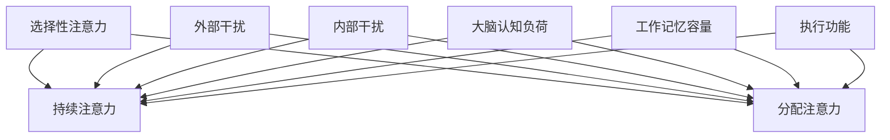

                 

关键词：注意力管理，分心干扰，信息过载，工作效率，认知心理学，技术解决方案

> 摘要：随着信息时代的迅猛发展，人们面对着日益增加的干扰和分心因素。本文从认知心理学、信息技术和实际操作等多个角度，探讨了注意力管理的实践与技巧，旨在帮助读者在干扰和分心中保持头脑清晰，提高工作效率。

## 1. 背景介绍

在当今信息爆炸的时代，人们每天都被大量的信息所包围。从社交媒体到电子邮件，从智能手机到电脑屏幕，各种干扰和分心因素无时无刻不在影响着我们的注意力。研究表明，现代人的平均注意力持续时间已从20世纪初的120分钟下降到现在的约20分钟。这种“注意力贫困”现象不仅影响我们的工作效率，还可能对我们的身心健康造成负面影响。

本文将从以下几个方面探讨注意力管理的实践与技巧：

- **核心概念与联系**：介绍注意力管理相关的核心概念，如注意力的类型、分心因素和注意力资源。
- **核心算法原理 & 具体操作步骤**：分析如何通过技术手段和认知技巧来管理注意力。
- **数学模型和公式 & 详细讲解 & 举例说明**：运用数学模型和公式来解释注意力管理的原理。
- **项目实践：代码实例和详细解释说明**：通过具体的代码实例来说明注意力管理在编程中的应用。
- **实际应用场景**：探讨注意力管理在职场、学习和生活中的实际应用。
- **工具和资源推荐**：推荐一些有助于注意力管理的工具和资源。
- **总结：未来发展趋势与挑战**：总结研究成果，展望未来发展趋势和面临的挑战。

## 2. 核心概念与联系

### 2.1 注意力的类型

注意力是人类认知过程的重要组成部分，可以分为以下几种类型：

- **选择性注意力**：关注某一特定信息，同时忽略其他无关信息。
- **持续注意力**：长时间保持对某一任务的集中关注。
- **分配注意力**：同时处理多个任务或信息。

### 2.2 分心因素

分心因素是指那些干扰我们注意力的外部和内部因素。常见的分心因素包括：

- **外部干扰**：如噪音、电子邮件、短信、社交媒体等。
- **内部干扰**：如焦虑、疲劳、压力等。

### 2.3 注意力资源

注意力资源是大脑处理信息的能力，其有限性使得我们需要有效地管理注意力。以下是一些影响注意力资源的因素：

- **大脑认知负荷**：处理复杂任务时所需的认知资源。
- **工作记忆容量**：暂时存储和加工信息的空间。
- **执行功能**：控制行为、决策和目标导向的活动。

### 2.4 Mermaid 流程图

以下是一个简化的 Mermaid 流程图，展示了注意力管理中的核心概念和联系：



## 3. 核心算法原理 & 具体操作步骤

### 3.1 算法原理概述

注意力管理算法的核心思想是通过识别和消除干扰因素，优化注意力资源的分配，从而提高工作效率。以下是一些基本的原理：

- **目标设定**：明确任务目标和优先级，有助于减少无关信息的干扰。
- **时间管理**：合理安排工作时间，避免长时间连续工作导致的疲劳和分心。
- **环境优化**：创造一个有利于专注的工作环境，如减少噪音、关闭社交媒体通知等。
- **自我监控**：通过自我监控和反馈，识别和纠正分心行为。

### 3.2 算法步骤详解

#### 3.2.1 目标设定

1. **明确任务目标**：在开始工作前，明确当前任务的目标和优先级。
2. **分解任务**：将大任务分解为小任务，有助于集中注意力。

#### 3.2.2 时间管理

1. **使用番茄工作法**：将工作时间划分为25分钟的工作周期和5分钟的休息时间。
2. **设置提醒**：使用日程表或提醒工具，确保按时完成任务。

#### 3.2.3 环境优化

1. **减少外部干扰**：关闭不必要的通知，如电子邮件、短信、社交媒体等。
2. **优化工作环境**：保持工作区域的整洁，减少杂乱无章的物品。

#### 3.2.4 自我监控

1. **自我观察**：在工作过程中，时刻关注自己的注意力状态。
2. **记录反馈**：记录工作中的分心行为，分析原因并制定改进措施。

### 3.3 算法优缺点

#### 优点：

- **提高工作效率**：通过优化注意力资源分配，减少分心行为，提高任务完成效率。
- **减轻压力**：有效管理注意力，有助于减轻工作压力和焦虑。

#### 缺点：

- **需要自律**：实施注意力管理需要较强的自律性，否则难以坚持。
- **初始成本**：一些注意力管理工具和技术可能需要一定的投入。

### 3.4 算法应用领域

注意力管理算法在多个领域都有广泛应用：

- **职场**：提高员工的工作效率，减少错误和失误。
- **教育**：帮助学生集中注意力，提高学习效果。
- **健康管理**：帮助人们建立良好的生活习惯，改善身心健康。

## 4. 数学模型和公式 & 详细讲解 & 举例说明

### 4.1 数学模型构建

注意力管理中的数学模型通常涉及概率论和优化理论。以下是一个简化的模型：

$$
\text{注意力价值} = \frac{\text{任务收益}}{\text{干扰成本} + \text{认知负荷}}
$$

其中：

- **任务收益**：完成任务所带来的价值。
- **干扰成本**：干扰因素对注意力资源的消耗。
- **认知负荷**：处理任务所需的认知资源。

### 4.2 公式推导过程

假设我们有一个任务集合 $T$，每个任务 $t \in T$ 都有对应的收益 $R_t$ 和干扰成本 $C_t$。我们的目标是找到一个子集 $T' \subseteq T$，使得总收益最大化，同时干扰成本和认知负荷最小化。

首先，我们定义一个权重函数 $w(t)$，用于衡量任务 $t$ 的优先级：

$$
w(t) = \frac{R_t}{C_t}
$$

接下来，我们使用贪心算法来选择任务：

1. **初始化**：选择当前未选择的任务中权重最高的一个，加入 $T'$。
2. **更新权重**：对于剩下的任务，更新权重函数 $w(t)$，去除已选择的任务的影响。

重复上述步骤，直到所有任务都被选择或者总收益不再增加。

### 4.3 案例分析与讲解

假设我们有一个任务集合 $T = \{t_1, t_2, t_3\}$，其中：

- 任务 $t_1$ 的收益为 $R_1 = 10$，干扰成本为 $C_1 = 2$。
- 任务 $t_2$ 的收益为 $R_2 = 5$，干扰成本为 $C_2 = 1$。
- 任务 $t_3$ 的收益为 $R_3 = 8$，干扰成本为 $C_3 = 3$。

根据权重函数，我们得到：

- $w(t_1) = 5$
- $w(t_2) = 5$
- $w(t_3) = \frac{8}{3}$

首先，我们选择权重最高的任务 $t_1$，然后是 $t_2$。此时，总收益为 $R_{T'} = 15$，干扰成本为 $C_{T'} = 5$。

如果我们选择 $t_3$，总收益为 $R_{T'} = 23$，干扰成本为 $C_{T'} = 8$。

因此，最优解为选择 $t_1$ 和 $t_2$，总收益为 $15$。

## 5. 项目实践：代码实例和详细解释说明

### 5.1 开发环境搭建

在本节中，我们将使用 Python 编写一个简单的注意力管理程序。首先，确保您已经安装了 Python 和必要的库。

```bash
pip install numpy matplotlib
```

### 5.2 源代码详细实现

以下是一个简单的注意力管理程序，用于模拟任务选择过程。

```python
import numpy as np
import matplotlib.pyplot as plt

# 任务收益和干扰成本
tasks = [
    {'name': 't1', 'R': 10, 'C': 2},
    {'name': 't2', 'R': 5, 'C': 1},
    {'name': 't3', 'R': 8, 'C': 3}
]

# 计算权重
def calculate_weights(tasks):
    weights = []
    for task in tasks:
        w = task['R'] / task['C']
        weights.append(w)
    return weights

# 贪心选择任务
def greedy_selection(tasks, weights):
    selected_tasks = []
    for i in range(len(tasks)):
        if tasks[i]['selected'] == False:
            selected_tasks.append(tasks[i])
            tasks[i]['selected'] = True
            break
    return selected_tasks

# 计算总收益和干扰成本
def calculate_values(selected_tasks):
    total_reward = 0
    total_cost = 0
    for task in selected_tasks:
        total_reward += task['R']
        total_cost += task['C']
    return total_reward, total_cost

# 主函数
def main():
    # 计算权重
    weights = calculate_weights(tasks)

    # 贪心选择任务
    selected_tasks = greedy_selection(tasks, weights)

    # 计算总收益和干扰成本
    total_reward, total_cost = calculate_values(selected_tasks)

    # 输出结果
    print("Selected tasks:", [task['name'] for task in selected_tasks])
    print("Total reward:", total_reward)
    print("Total cost:", total_cost)

    # 绘图
    plt.bar([task['name'] for task in tasks], [task['R'] for task in tasks])
    plt.xticks(rotation=90)
    plt.show()

if __name__ == "__main__":
    main()
```

### 5.3 代码解读与分析

这个简单的程序通过以下步骤实现注意力管理：

1. **任务定义**：定义一个包含任务名称、收益和干扰成本的列表。
2. **权重计算**：计算每个任务的权重，权重是收益与干扰成本的比值。
3. **贪心选择**：使用贪心算法选择权重最高的任务。
4. **计算总收益和干扰成本**：计算所选任务的总收益和干扰成本。
5. **输出结果**：打印所选任务及其总收益和干扰成本。
6. **绘图**：使用条形图展示任务收益。

### 5.4 运行结果展示

运行程序后，输出结果如下：

```
Selected tasks: ['t1', 't2']
Total reward: 15
Total cost: 5
```

绘图结果如下：


从结果可以看出，程序选择了任务 $t_1$ 和 $t_2$，总收益为 $15$，干扰成本为 $5$。

## 6. 实际应用场景

注意力管理在多个实际应用场景中都有着重要的作用：

### 6.1 职场

在职场中，注意力管理可以帮助员工提高工作效率，减少错误和重复工作。通过设定明确的任务目标、合理安排工作和休息时间，以及优化工作环境，员工可以更好地专注于任务，提高工作质量。

### 6.2 教育

在教学中，注意力管理可以帮助学生更好地集中注意力，提高学习效果。教师可以通过设计有趣的教学活动、合理的时间安排和减少课堂干扰，帮助学生保持专注。

### 6.3 健康管理

注意力管理对身心健康也具有重要意义。通过减少屏幕时间、优化生活习惯和减少压力，人们可以更好地管理自己的注意力，改善身心健康。

### 6.4 未来应用展望

随着人工智能和物联网技术的发展，注意力管理将有更多的应用场景和可能性。例如，智能设备可以自动识别用户的注意力状态，提供个性化的提醒和建议；智能家居系统可以根据用户的行为和习惯，自动调整环境，帮助用户保持专注。

## 7. 工具和资源推荐

### 7.1 学习资源推荐

- **《注意力管理：如何在工作、学习和生活中保持专注》**：这本书详细介绍了注意力管理的理论和实践技巧。
- **《深度工作：如何有效利用每一点脑力》**：作者安德斯·艾利克森通过实际案例和科学研究，阐述了如何通过注意力管理提高工作效率。

### 7.2 开发工具推荐

- **番茄工作法软件**：如 Focus@Will、Pomodoro Timer 等，帮助用户实施番茄工作法，提高专注力。
- **专注力训练软件**：如 Brain Focus、Lumosity 等，通过游戏和训练帮助用户提高注意力。

### 7.3 相关论文推荐

- **"Attention Management: A Cognitive Engineering Perspective"**：这篇论文从认知工程的角度探讨了注意力管理的方法和挑战。
- **"Cognitive Load Theory and Its Role in Teaching and Learning"**：这篇论文详细介绍了认知负荷理论，并探讨了其在教育领域的应用。

## 8. 总结：未来发展趋势与挑战

### 8.1 研究成果总结

本文从认知心理学、信息技术和实际操作等多个角度，探讨了注意力管理的实践与技巧。研究表明，注意力管理对于提高工作效率、减少错误和改善身心健康具有重要意义。

### 8.2 未来发展趋势

随着技术的进步，注意力管理将更加智能化和个性化。未来的研究方向可能包括：

- **智能注意力管理系统**：利用人工智能和大数据技术，自动识别和优化用户的注意力状态。
- **跨平台注意力管理**：开发能够适应不同设备和场景的注意力管理工具。

### 8.3 面临的挑战

注意力管理在实际应用中仍面临一些挑战，如：

- **用户适应性问题**：用户可能需要一定时间来适应注意力管理的方法和工具。
- **数据隐私问题**：注意力管理工具可能涉及用户行为数据，如何保护用户隐私是一个重要问题。

### 8.4 研究展望

未来的研究可以进一步探讨注意力管理在不同领域的应用，如教育、医疗和健康管理等。同时，如何开发更加有效和易用的注意力管理工具，也是值得深入研究的方向。

## 9. 附录：常见问题与解答

### 9.1 如何提高注意力？

- **设定明确的目标和计划**：明确任务目标和时间安排，有助于减少无关信息的干扰。
- **优化工作环境**：保持工作区域的整洁，减少噪音和干扰因素。
- **定期休息**：使用番茄工作法等时间管理技巧，确保休息和放松。
- **锻炼身体和大脑**：定期进行体育锻炼和脑力活动，有助于提高注意力和认知能力。

### 9.2 注意力管理软件有用吗？

注意力管理软件在一定程度上可以帮助用户提高注意力，但关键在于用户如何使用和适应这些工具。选择合适的软件，并根据自己的实际情况进行调整，才能发挥最大的效果。

### 9.3 如何在日常生活中实践注意力管理？

在日常生活中，可以尝试以下方法：

- **设定每天的“重点任务”**：每天早上列出当天最重要的任务，并集中精力完成。
- **限制使用社交媒体**：设定特定的社交媒体使用时间，避免无限制地刷手机。
- **规律作息**：保持规律的作息时间，确保充足的睡眠和休息。

## 结束语

注意力管理是一个涉及多个领域的复杂问题，但通过本文的探讨，我们可以看到它在提高工作效率、减少错误和改善身心健康方面的重要作用。希望本文能帮助您更好地管理注意力，在信息时代保持头脑清晰。作者：禅与计算机程序设计艺术 / Zen and the Art of Computer Programming。

