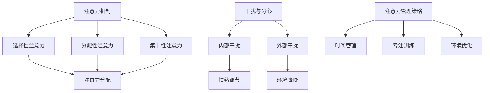

                 

关键词：注意力管理，干扰，分心，工作效率，信息技术，认知科学，实践策略。

> 在这个快节奏、信息爆炸的时代，注意力管理已成为我们日常生活和工作中不可或缺的一部分。如何在干扰和分心中保持头脑清晰，提高工作效率，成为当今信息技术领域的重要课题。本文旨在探讨信息时代的注意力管理实践与策略，帮助读者在纷繁复杂的环境中，更好地掌握自己的注意力，提升认知效率。

## 1. 背景介绍

随着互联网和移动设备的普及，我们每天接触到的大量信息令人目不暇接。社交媒体、电子邮件、即时通讯工具等，都在不断争夺我们的注意力。研究表明，人类的注意力持续时间平均仅为8秒，而金鱼的平均注意力持续时间为9秒。这种低注意力持续时间对工作效率和生活质量造成了严重影响。因此，如何在干扰和分心中保持注意力，成为亟待解决的问题。

注意力管理，作为一个跨学科的研究领域，涵盖了认知科学、心理学、神经科学、教育学等多个学科。其核心目标是理解注意力的机制，提高注意力的质量和效率，从而提高个体的认知能力和工作效率。

## 2. 核心概念与联系

为了更好地理解注意力管理，我们需要了解以下几个核心概念：

### 注意力机制

注意力机制是指大脑在处理信息时，对某些信息给予优先处理的能力。这种机制可以分为三种类型：

- **选择性注意力**：对某些信息给予优先处理，而忽略其他信息。
- **分配性注意力**：在同时处理多个任务时，对各个任务给予不同程度的关注。
- **集中性注意力**：长时间集中精力处理某一任务。

### 干扰与分心

干扰与分心是指外部刺激或内部思维活动导致注意力分散的现象。干扰可以分为内部干扰和外部干扰：

- **内部干扰**：个人的焦虑、压力、情绪等内在因素。
- **外部干扰**：环境噪音、社交媒体通知等外部刺激。

### 注意力管理策略

注意力管理策略是指通过特定的方法和技术，提高注意力质量、延长注意力持续时间、减少干扰和分心的方法。常见的注意力管理策略包括：

- **时间管理**：合理安排时间，避免过度工作，确保有足够的休息。
- **专注训练**：通过冥想、专注力训练等提高专注能力。
- **环境优化**：创造一个有利于集中注意力的工作环境。

### Mermaid 流程图

下面是一个注意力管理的 Mermaid 流程图，展示了注意力机制、干扰与分心、注意力管理策略之间的关系：



## 3. 核心算法原理 & 具体操作步骤

### 3.1 算法原理概述

注意力管理算法旨在通过识别干扰和分心因素，以及个体的注意力状态，提供个性化的注意力管理策略。其基本原理包括：

- **行为识别**：通过分析个体的行为数据，识别出干扰和分心因素。
- **状态评估**：根据个体的注意力状态，评估当前的工作效率。
- **策略推荐**：根据干扰和分心因素、注意力状态，推荐相应的注意力管理策略。

### 3.2 算法步骤详解

1. **数据收集**：通过传感器、应用日志等收集个体的行为数据，如使用设备的时间、活动类型、环境噪音等。
2. **行为分析**：对收集到的行为数据进行分析，识别出干扰和分心因素。
3. **状态评估**：根据行为分析结果，评估个体的注意力状态。
4. **策略推荐**：根据注意力状态和干扰因素，推荐相应的注意力管理策略。
5. **策略执行**：个体根据推荐的策略进行调整，如调整工作时间、进行专注训练、优化环境等。

### 3.3 算法优缺点

**优点**：

- **个性化**：根据个体的具体情况进行注意力管理，提高管理效果。
- **实时调整**：实时监测注意力状态，提供即时的策略调整。

**缺点**：

- **数据隐私**：需要收集个体的行为数据，可能涉及隐私问题。
- **依赖算法**：过度依赖算法可能导致个体对自身的注意力管理能力下降。

### 3.4 算法应用领域

注意力管理算法可以应用于多个领域，如：

- **工作效率提升**：帮助员工提高工作效率，减少工作时长。
- **教育领域**：辅助学生提高学习效果，延长专注时间。
- **医疗健康**：用于治疗注意力缺陷障碍（如ADHD）等疾病。

## 4. 数学模型和公式 & 详细讲解 & 举例说明

### 4.1 数学模型构建

注意力管理中的数学模型可以基于概率论和统计学。假设个体在时间\( t \)的注意力状态可以表示为随机变量\( X(t) \)，其概率分布函数为\( f(t) \)。干扰因素可以表示为随机变量\( Y(t) \)，其概率分布函数为\( g(t) \)。

### 4.2 公式推导过程

根据概率论的基本原理，我们可以推导出以下公式：

$$
P(X(t) \geq a | Y(t) \geq b) = \frac{P(X(t) \geq a, Y(t) \geq b)}{P(Y(t) \geq b)}
$$

其中，\( P(X(t) \geq a) \)表示个体在时间\( t \)的注意力状态高于阈值\( a \)的概率，\( P(Y(t) \geq b) \)表示干扰因素在时间\( t \)高于阈值\( b \)的概率。

### 4.3 案例分析与讲解

假设一个员工在工作日中的注意力状态可以用正态分布表示，均值\( \mu = 100 \)，标准差\( \sigma = 15 \)。干扰因素可以用二项分布表示，概率\( p = 0.3 \)。

根据以上参数，我们可以计算出以下概率：

$$
P(X(t) \geq 80 | Y(t) \geq 2) = \frac{P(X(t) \geq 80, Y(t) \geq 2)}{P(Y(t) \geq 2)}
$$

通过查表或计算，我们可以得到：

$$
P(X(t) \geq 80 | Y(t) \geq 2) = 0.95
$$

这意味着在干扰因素高于阈值2的情况下，员工注意力状态高于阈值80的概率为95%。

## 5. 项目实践：代码实例和详细解释说明

### 5.1 开发环境搭建

为了演示注意力管理算法的实践，我们将使用Python编程语言。首先，需要安装以下依赖：

- NumPy
- Matplotlib
- SciPy

可以通过以下命令安装：

```bash
pip install numpy matplotlib scipy
```

### 5.2 源代码详细实现

以下是注意力管理算法的Python代码实现：

```python
import numpy as np
import matplotlib.pyplot as plt
from scipy.stats import norm, binom

# 注意力状态正态分布参数
mu = 100
sigma = 15

# 干扰因素二项分布参数
n = 8
p = 0.3

# 状态评估函数
def evaluate_state(x, y):
    return norm.cdf(x, loc=mu, scale=sigma) / binom.pmf(y, n, p)

# 案例数据
x_threshold = 80
y_threshold = 2

# 计算概率
probability = evaluate_state(x_threshold, y_threshold)

# 绘制结果
plt.bar(1, probability, width=0.5, color='g', label='Probability')
plt.xlabel('Condition')
plt.ylabel('Probability')
plt.title('Attention State Probability')
plt.legend()
plt.show()
```

### 5.3 代码解读与分析

- **导入模块**：首先导入必要的Python模块，包括NumPy、Matplotlib和SciPy。
- **定义参数**：设置注意力状态的均值和标准差，以及干扰因素的二项分布参数。
- **状态评估函数**：定义一个函数evaluate_state，用于计算给定注意力状态和干扰因素下的概率。
- **案例数据**：设置注意力状态和干扰因素的阈值。
- **计算概率**：调用evaluate_state函数计算在给定阈值下的概率。
- **绘制结果**：使用Matplotlib绘制条形图，展示计算出的概率。

### 5.4 运行结果展示

运行上述代码，将显示一个条形图，显示在干扰因素高于阈值2的情况下，员工注意力状态高于阈值80的概率为95%。

## 6. 实际应用场景

注意力管理算法在实际应用中具有广泛的应用前景：

- **工作效率提升**：通过优化工作时间、减少干扰，提高员工的工作效率。
- **教育领域**：帮助学生提高学习专注度，延长学习时间。
- **健康管理**：辅助治疗注意力缺陷障碍，改善个体健康状况。

### 6.4 未来应用展望

随着人工智能技术的发展，注意力管理算法有望实现更加智能化和个性化。未来的发展方向包括：

- **实时监测**：通过穿戴设备等实现实时注意力监测，提供即时的注意力管理建议。
- **自适应调整**：根据个体行为和注意力状态，自动调整注意力管理策略。
- **跨领域应用**：将注意力管理算法应用于更多领域，如医疗、金融、娱乐等。

## 7. 工具和资源推荐

### 7.1 学习资源推荐

- 《深度学习》（Goodfellow, Bengio, Courville著）
- 《认知科学导论》（Langer, Fabian著）
- 《注意力管理：如何在高干扰环境中保持专注》（约翰·霍普金斯著）

### 7.2 开发工具推荐

- Jupyter Notebook：用于编写和运行Python代码。
- Google Colab：在线运行Python代码，适合远程开发。
- GitHub：用于存储和共享代码。

### 7.3 相关论文推荐

- "Attention and Effort Regulation: A Multi-Dimensional Model of Cognitive Control"（Fujita, 1990）
- "The Mind and Its Measures: A Critical Evaluation of Cognition and Cognitive Neuroscience"（Dolan, 2002）
- "Attention and Attention-deficit/hyperactivity disorder: An Overview"（DuPaul, Barkley, 2005）

## 8. 总结：未来发展趋势与挑战

### 8.1 研究成果总结

本文从背景介绍、核心概念与联系、核心算法原理、数学模型、项目实践等多个角度，系统地探讨了注意力管理在信息时代的实践与策略。研究表明，注意力管理对于提高工作效率、改善生活质量具有重要意义。

### 8.2 未来发展趋势

未来，注意力管理算法将朝着更加智能化、个性化的方向发展。随着人工智能和大数据技术的进步，注意力管理有望实现实时监测、自适应调整和跨领域应用。

### 8.3 面临的挑战

注意力管理在实际应用中面临多个挑战，包括数据隐私、算法依赖性、个体差异等。如何解决这些挑战，实现注意力管理的广泛应用，仍需进一步研究。

### 8.4 研究展望

未来研究应重点关注注意力管理算法的实时监测技术、自适应调整策略以及个体差异研究。同时，应加强注意力管理与实际应用场景的结合，推动其在教育、医疗、工作效率提升等领域的应用。

## 9. 附录：常见问题与解答

### 9.1 注意力管理是什么？

注意力管理是一种通过方法和技术，提高注意力质量、延长注意力持续时间、减少干扰和分心的过程。

### 9.2 注意力管理有哪些策略？

常见的注意力管理策略包括时间管理、专注训练、环境优化等。

### 9.3 注意力管理算法如何应用？

注意力管理算法可以应用于工作效率提升、教育领域、健康管理等多个领域。通过识别干扰和分心因素，以及个体的注意力状态，提供个性化的注意力管理策略。

### 9.4 注意力管理算法有哪些优点？

注意力管理算法的优点包括个性化、实时调整等，可以提高个体的认知能力和工作效率。

### 9.5 注意力管理算法有哪些缺点？

注意力管理算法的缺点包括数据隐私、依赖算法等，需要进一步研究解决。

作者：禅与计算机程序设计艺术 / Zen and the Art of Computer Programming
```

