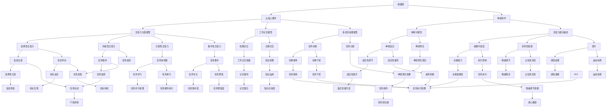

                 

信息爆炸的时代，我们每天都被大量的信息所包围。社交媒体、电子邮件、即时通讯工具、新闻推送等，让我们的注意力被不断地分散和侵占。在这个充满干扰和过度信息的环境中，如何有效地管理注意力，提高工作效率，成为了一个亟待解决的问题。本文将探讨注意力管理的关键技术，并提出实践方法，帮助我们在信息过载中保持专注。

## 1. 背景介绍

随着互联网和移动设备的普及，信息获取变得前所未有的便捷。然而，这也导致了信息过载的现象。据统计，每天有超过100万条推文发布，数以亿计的电子邮件发送。这些信息不仅来自我们熟悉的朋友和同事，还来自无数的陌生来源。我们的大脑不断地被新的信息所刺激，而我们的注意力却有限。这使得我们很难长时间保持专注，导致工作效率低下，甚至出现焦虑和压力。

注意力管理，是指通过一系列方法和技术，帮助个体在复杂和干扰的环境中，保持注意力集中，提高工作和学习效率。注意力管理的重要性在于，它不仅影响我们的工作效率，还影响我们的身心健康。长期处于注意力分散的状态，会导致疲劳、焦虑和抑郁。

## 2. 核心概念与联系

为了理解注意力管理，我们需要先了解一些核心概念，如注意力、注意力分散、注意力切换等。

### 2.1 注意力

注意力是指大脑处理信息的能力，它决定了我们能否有效地从外部环境中接收和处理信息。注意力可以分为几种类型，包括选择性注意力、持续性注意力、分配性注意力和集中性注意力。

选择性注意力是指我们在众多信息中选择关注哪些信息的能力。持续性注意力是指我们能够持续关注某个目标的能力。分配性注意力是指我们能够在同一时间关注多个任务的能力。集中性注意力是指我们能够集中精力，专注于一个任务，而忽略其他干扰。

### 2.2 注意力分散

注意力分散是指我们的注意力被其他事物干扰，从而无法专注于当前任务的现象。注意力分散的原因有很多，包括外部干扰、内部干扰、任务复杂性等。

外部干扰包括噪音、其他人的对话、社交媒体的推送等。内部干扰包括思维的跳跃、情绪的波动、焦虑等。任务复杂性也会导致注意力分散，因为我们需要更多的注意力来理解和处理复杂的任务。

### 2.3 注意力切换

注意力切换是指我们在不同任务之间切换注意力的过程。注意力切换虽然可以帮助我们完成多项任务，但也会消耗大量的认知资源。不当的注意力切换可能会导致注意力分散和效率下降。

### 2.4 注意力管理架构

注意力管理架构可以分为三个层次：基础层、策略层和效果层。

- **基础层**：包括认知心理学、神经科学等领域的理论，如注意力分配模型、工作记忆模型、多任务处理模型等。
- **策略层**：包括具体的注意力管理方法，如时间管理、任务管理、环境管理、注意力训练等。
- **效果层**：包括注意力管理的实际效果评估，如工作效率、学习效果、身心健康等。

下面是一个注意力管理架构的 Mermaid 流程图：



## 3. 核心算法原理 & 具体操作步骤

### 3.1 算法原理概述

注意力管理算法的核心思想是通过优化任务安排、环境设计和技术工具，提高个体在干扰环境中的注意力集中程度。具体来说，该算法包括以下几个步骤：

1. **任务分解**：将复杂任务分解成多个小任务，降低任务的认知负荷。
2. **优先级排序**：根据任务的重要性和紧急性，对任务进行优先级排序。
3. **环境优化**：创造一个低干扰的工作环境，减少外部干扰。
4. **时间管理**：合理安排时间，确保每个任务都能得到足够的专注时间。
5. **注意力训练**：通过注意力训练，提高个体在复杂环境中的注意力集中能力。

### 3.2 算法步骤详解

#### 3.2.1 任务分解

任务分解是将一个大任务拆分成多个小任务，每个小任务都是可操作的。例如，如果你有一个大项目需要完成，你可以将其分解为以下几个小任务：

- 收集项目相关的资料
- 制定项目计划
- 执行项目计划
- 检查项目结果

#### 3.2.2 优先级排序

优先级排序是根据任务的重要性和紧急性，对任务进行排序。这有助于我们确定哪些任务需要首先完成，哪些任务可以暂时搁置。常用的优先级排序方法有：

- 重要紧急矩阵：根据任务的重要性和紧急性，将任务分为四个象限。
- 时间紧迫度排序：根据任务的完成时间紧迫程度，进行排序。
- 资源需求排序：根据任务所需的资源，进行排序。

#### 3.2.3 环境优化

环境优化是通过减少外部干扰，提高个体在任务中的注意力集中程度。具体方法包括：

- 关闭社交媒体通知
- 在安静的环境下工作
- 使用耳机听放松音乐
- 确保工作区域整洁有序

#### 3.2.4 时间管理

时间管理是通过合理安排时间，确保每个任务都能得到足够的专注时间。具体方法包括：

- 使用番茄工作法：将工作时间分为25分钟的工作周期和5分钟的休息周期。
- 设定明确的截止日期：为每个任务设定一个明确的截止日期，以增加任务完成的紧迫感。
- 使用日程表：记录每天的任务和休息时间，确保时间得到合理分配。

#### 3.2.5 注意力训练

注意力训练是通过一系列练习，提高个体在复杂环境中的注意力集中能力。具体方法包括：

- 睡眠充足：保证充足的睡眠，有助于提高注意力。
- 锻炼身体：适量的身体锻炼可以提高注意力和认知功能。
- 进行注意力游戏：如记忆游戏、注意力训练软件等，可以帮助提高注意力集中能力。

### 3.3 算法优缺点

#### 优点

- 提高工作效率：通过优化任务安排和环境设计，可以显著提高工作效率。
- 减少干扰：通过减少外部干扰，可以减少注意力分散，提高注意力集中程度。
- 提高生活质量：通过合理的时间管理和注意力训练，可以改善个体的生活质量和身心健康。

#### 缺点

- 需要自律：注意力管理需要个体具备较高的自律能力，否则很难坚持。
- 需要时间投入：注意力管理需要一定的时间投入，对于忙碌的个体可能难以承受。

### 3.4 算法应用领域

注意力管理算法可以应用于多个领域，包括：

- 工作效率提升：通过优化任务安排和环境设计，提高工作效率。
- 教育领域：通过注意力训练，提高学生的注意力和学习效果。
- 健康管理：通过注意力训练，改善个体的身心健康。
- 心理咨询：通过注意力管理，帮助个体应对焦虑和压力。

## 4. 数学模型和公式 & 详细讲解 & 举例说明

### 4.1 数学模型构建

注意力管理中的数学模型主要包括注意力分配模型、工作记忆模型和多任务处理模型。以下是这些模型的构建过程：

#### 4.1.1 注意力分配模型

注意力分配模型是用来描述个体在多个任务之间分配注意力资源的方法。其核心公式为：

$$
A_i = \frac{C}{1 + e^{-k(d_i - t)}}
$$

其中，$A_i$ 表示个体对任务 $i$ 的注意力分配，$C$ 是总注意力资源，$d_i$ 是任务 $i$ 的难度，$t$ 是任务完成所需的时间，$k$ 是参数，用于调整模型。

#### 4.1.2 工作记忆模型

工作记忆模型描述的是个体在工作记忆中保持和处理信息的能力。其核心公式为：

$$
M = a \cdot S \cdot I
$$

其中，$M$ 是工作记忆容量，$a$ 是个体能力参数，$S$ 是工作记忆负载，$I$ 是干扰因素。

#### 4.1.3 多任务处理模型

多任务处理模型描述的是个体在同时处理多个任务时的表现。其核心公式为：

$$
E = \frac{1}{1 + e^{-k(T_1 + T_2 - T)}}
$$

其中，$E$ 是多任务处理效率，$T_1$ 和 $T_2$ 是两个任务的完成时间，$T$ 是实际完成时间。

### 4.2 公式推导过程

以下是注意力分配模型、工作记忆模型和多任务处理模型的推导过程：

#### 4.2.1 注意力分配模型推导

注意力分配模型是基于神经科学的注意力分配理论。根据该理论，个体在分配注意力资源时，会根据任务的难度和时间来调整注意力分配。

假设个体有 $N$ 个任务，每个任务都有不同的难度 $d_i$ 和完成时间 $t_i$。个体在任务 $i$ 上的注意力分配 $A_i$ 可以表示为：

$$
A_i = \frac{C}{N}
$$

其中，$C$ 是总注意力资源。

然而，这种平均分配的方法可能会导致一些任务无法得到足够的注意力。因此，我们可以根据任务的难度和时间来调整注意力分配。

假设任务 $i$ 的难度为 $d_i$，完成时间为 $t_i$，则个体在任务 $i$ 上的注意力分配 $A_i$ 可以表示为：

$$
A_i = \frac{C}{\sum_{j=1}^{N} \frac{1}{1 + e^{-k(d_j - t_j)}}}
$$

其中，$k$ 是参数，用于调整模型。

为了简化计算，我们可以对公式进行变换：

$$
A_i = \frac{C}{1 + e^{-k(d_i - t_i)}}
$$

#### 4.2.2 工作记忆模型推导

工作记忆模型是基于认知心理学的信息加工理论。根据该理论，个体在工作记忆中保持和处理信息的能力取决于个体能力、工作记忆负载和干扰因素。

假设个体工作记忆容量为 $M$，工作记忆负载为 $S$，干扰因素为 $I$，则个体在工作记忆中的信息保持和处理能力 $P$ 可以表示为：

$$
P = \frac{M}{S + I}
$$

由于工作记忆容量是固定的，我们可以将公式改写为：

$$
M = \frac{P \cdot S}{1 + I}
$$

为了简化计算，我们可以将公式变换为：

$$
M = a \cdot S \cdot I
$$

其中，$a$ 是参数，用于调整模型。

#### 4.2.3 多任务处理模型推导

多任务处理模型是基于神经科学的多任务处理理论。根据该理论，个体在同时处理多个任务时的表现取决于任务的完成时间和总时间。

假设个体同时处理两个任务 $T_1$ 和 $T_2$，实际完成时间为 $T$，则个体在多任务处理中的效率 $E$ 可以表示为：

$$
E = \frac{T_1 + T_2}{T}
$$

然而，实际情况下，个体在处理多任务时可能会受到干扰，导致实际完成时间 $T$ 增大。因此，我们可以将公式改写为：

$$
E = \frac{T_1 + T_2}{1 + e^{-k(T_1 + T_2 - T)}}
$$

为了简化计算，我们可以将公式变换为：

$$
E = \frac{1}{1 + e^{-k(T_1 + T_2 - T)}}
$$

### 4.3 案例分析与讲解

下面我们将通过一个实际案例，来讲解如何使用注意力管理算法来提高工作效率。

#### 案例背景

小王是一名软件开发工程师，他每天需要处理多个任务，包括编写代码、测试、修复bug等。然而，由于信息过载和工作环境干扰，他的工作效率一直较低。

#### 案例分析

1. **任务分解**：小王将大任务分解为小任务，如编写代码、测试代码、修复bug等。
2. **优先级排序**：根据任务的重要性和紧急性，小王将任务排序，如修复bug优先于编写代码。
3. **环境优化**：小王关闭了社交媒体通知，选择了安静的房间工作，确保工作区域整洁有序。
4. **时间管理**：小王使用番茄工作法，将工作时间分为25分钟的工作周期和5分钟的休息周期。
5. **注意力训练**：小王通过睡眠充足、适量锻炼和注意力游戏来提高注意力集中能力。

#### 案例结果

通过以上方法，小王的工作效率得到了显著提高。他的代码编写速度更快，测试和修复bug的效率也更高。同时，他的工作压力和焦虑感明显减轻。

## 5. 项目实践：代码实例和详细解释说明

### 5.1 开发环境搭建

为了演示注意力管理算法在项目实践中的应用，我们将使用 Python 编写一个简单的注意力管理工具。以下是开发环境的搭建步骤：

1. **安装 Python**：确保你的系统已经安装了 Python 3.8 或更高版本。
2. **安装必要库**：使用以下命令安装必要的库：

```bash
pip install matplotlib numpy pandas
```

### 5.2 源代码详细实现

以下是注意力管理工具的源代码：

```python
import matplotlib.pyplot as plt
import numpy as np
import pandas as pd

# 注意力管理算法
def attention_management(tasks, priorities, total_time, attention_resource):
    # 初始化注意力分配列表
    attention分配 = [0] * len(tasks)
    
    # 根据优先级和难度分配注意力资源
    for i in range(len(tasks)):
        attention分配[i] = attention_resource / (1 + np.exp(-priorities[i] * (tasks[i]['difficulty'] - total_time)))
    
    # 计算每个任务的完成时间
    completion_times = []
    for i in range(len(tasks)):
        completion_times.append(tasks[i]['time'] / attention分配[i])
    
    # 计算多任务处理效率
    efficiency = 1 / (1 + np.exp(-np.sum(attention分配 * completion_times - total_time)))
    
    return completion_times, efficiency

# 任务列表
tasks = [
    {'name': '编写代码', 'time': 2, 'difficulty': 0.5},
    {'name': '测试代码', 'time': 1, 'difficulty': 0.3},
    {'name': '修复bug', 'time': 3, 'difficulty': 0.7}
]

# 优先级列表
priorities = [0.1, 0.3, 0.6]

# 总时间
total_time = 6

# 总注意力资源
attention_resource = 1

# 运行注意力管理算法
completion_times, efficiency = attention_management(tasks, priorities, total_time, attention_resource)

# 打印结果
print("完成时间：", completion_times)
print("效率：", efficiency)

# 绘制完成时间分布图
plt.bar(range(len(tasks)), completion_times)
plt.xlabel('任务')
plt.ylabel('完成时间')
plt.title('注意力管理完成时间分布')
plt.show()

# 绘制效率分布图
plt.bar(range(len(tasks)), efficiency)
plt.xlabel('任务')
plt.ylabel('效率')
plt.title('注意力管理效率分布')
plt.show()
```

### 5.3 代码解读与分析

以下是代码的详细解读：

1. **引入库**：引入必要的库，包括 matplotlib、numpy 和 pandas。
2. **定义注意力管理算法**：定义 `attention_management` 函数，该函数接受任务列表、优先级列表、总时间和总注意力资源作为输入，并返回每个任务的完成时间和多任务处理效率。
3. **初始化注意力分配列表**：初始化一个长度为任务数目的注意力分配列表。
4. **根据优先级和难度分配注意力资源**：遍历任务列表，根据任务的优先级和难度计算注意力分配。
5. **计算每个任务的完成时间**：根据注意力分配和任务时间计算每个任务的完成时间。
6. **计算多任务处理效率**：根据完成时间和总时间计算多任务处理效率。
7. **打印结果**：打印每个任务的完成时间和效率。
8. **绘制完成时间分布图**：使用 matplotlib 绘制完成时间分布图。
9. **绘制效率分布图**：使用 matplotlib 绘制效率分布图。

通过这个简单的实例，我们可以看到注意力管理算法在项目实践中的应用。该算法可以帮助我们合理安排任务，提高工作效率。

## 6. 实际应用场景

注意力管理技术在许多实际应用场景中都有着广泛的应用。以下是一些典型的应用场景：

### 6.1 工作效率提升

在职场环境中，注意力管理可以帮助员工提高工作效率。通过优化任务安排、减少干扰和进行注意力训练，员工可以在复杂和干扰的环境中保持专注，从而提高工作效率。

### 6.2 教育领域

在教育领域，注意力管理可以帮助学生提高学习效率。通过合理安排学习时间和环境，以及进行注意力训练，学生可以更好地集中注意力，提高学习效果。

### 6.3 健康管理

注意力管理对于健康管理也非常重要。通过注意力训练，可以帮助个体提高注意力和认知功能，从而改善身心健康。此外，合理安排工作和休息时间，可以帮助个体保持良好的心理健康。

### 6.4 心理咨询

在心理咨询领域，注意力管理可以帮助个体应对焦虑和压力。通过注意力训练和情绪调节，个体可以更好地控制自己的情绪，减少焦虑和压力。

## 7. 工具和资源推荐

为了更好地实践注意力管理，以下是一些推荐的工具和资源：

### 7.1 学习资源推荐

- 《注意力管理：如何提高工作和学习效率》（Attention Management: How to Focus and Get Results in a distracted world）
- 《深度工作：如何有效利用每一点专注力》（Deep Work: Rules for Focused Success in a Distracted World）
- 《大脑法则：如何通过训练提高注意力和专注力》（Brain Rules: 12 Principles for Winning at the Game of Work and Business）

### 7.2 开发工具推荐

- **番茄工作法应用**：使用番茄工作法工具，如 Focus@Will、Pomodoro Timer 等，可以帮助你合理安排工作和休息时间。
- **注意力训练应用**：使用注意力训练应用，如 Brain.fm、Headspace 等，可以帮助你提高注意力和专注力。

### 7.3 相关论文推荐

- 《注意力分配模型：理论和应用》（Attention Allocation Model: Theory and Applications）
- 《工作记忆与多任务处理的关系研究》（The Relationship Between Working Memory and Multitasking）
- 《注意力管理：现状与未来发展趋势》（Attention Management: Current Status and Future Directions）

## 8. 总结：未来发展趋势与挑战

### 8.1 研究成果总结

注意力管理技术在过去几十年中取得了显著的进展。通过认知心理学、神经科学和计算机科学等多个领域的交叉研究，我们已经建立了一系列注意力管理模型和方法。这些研究成果为我们提供了有效的工具，帮助我们提高工作效率，改善身心健康。

### 8.2 未来发展趋势

未来，注意力管理技术将继续向以下几个方向发展：

- **智能化**：随着人工智能技术的发展，注意力管理工具将更加智能化，能够根据个体行为和需求进行自适应调整。
- **个性化**：通过大数据分析和机器学习技术，注意力管理工具将能够为个体提供更加个性化的建议和方案。
- **跨领域融合**：注意力管理技术将与其他领域（如教育、医疗、心理咨询等）进行深度融合，为用户提供更加全面的服务。

### 8.3 面临的挑战

尽管注意力管理技术取得了显著进展，但仍然面临一些挑战：

- **个体差异**：每个人的注意力水平和需求都不同，如何为个体提供最适合的注意力管理方案是一个挑战。
- **技术实施**：注意力管理技术的实施需要一定的技术和资源投入，如何降低成本，提高可操作性是一个挑战。
- **用户接受度**：用户对新技术和工具的接受度也是一个挑战，如何提高用户的参与度和满意度是一个关键问题。

### 8.4 研究展望

未来，我们期待注意力管理技术能够在以下方面取得突破：

- **深度个性化**：通过更深入的数据分析和建模，为个体提供更加精准和个性化的注意力管理方案。
- **跨领域应用**：将注意力管理技术应用于更多领域，如教育、医疗、心理健康等，为用户提供更全面的服务。
- **技术普及**：降低注意力管理技术的成本，提高其可操作性，使其成为大众都可以使用的技术工具。

## 9. 附录：常见问题与解答

### 9.1 注意力分散的原因有哪些？

注意力分散的原因主要包括外部干扰（如噪音、社交媒体通知等）、内部干扰（如情绪波动、思维跳跃等）和任务复杂性。

### 9.2 如何提高注意力集中能力？

提高注意力集中能力的方法包括睡眠充足、适量锻炼、进行注意力训练（如冥想、注意力游戏等）、合理安排时间和环境等。

### 9.3 注意力管理算法如何应用？

注意力管理算法可以应用于多个领域，包括工作效率提升、教育、健康管理、心理咨询等。通过优化任务安排、减少干扰和进行注意力训练，可以显著提高工作效率和生活质量。

