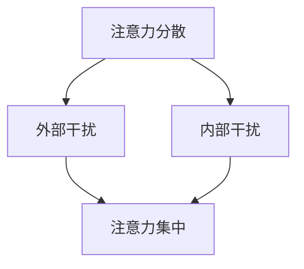

                 

关键词：注意力管理、干扰、专注力、信息过载、工作效能、策略、心理学、技术解决方案

摘要：在信息爆炸的时代，我们面临着前所未有的注意力管理挑战。本文将探讨在充满干扰的环境中如何保持专注，提高工作与学习效率。首先，我们将介绍注意力管理的基本概念和影响，然后分析当前主要的干扰源，接着提出有效的注意力管理策略，并探讨技术解决方案，最后展望未来的发展趋势和挑战。

## 1. 背景介绍

随着互联网和移动设备的普及，我们正处于一个信息过载的时代。尽管这些技术极大地提升了我们的沟通效率和获取信息的速度，但也带来了严重的注意力分散问题。研究表明，现代人平均每天接收的信息量是19世纪的人的数千倍。这种信息过载导致了注意力分散，从而降低了工作效率和学习效果。保持专注成为当代人不得不面对的重大挑战。

### 1.1 注意力管理的重要性

注意力管理是提高工作效率和实现个人成长的关键。它不仅影响到我们在工作中的表现，还关系到我们的身心健康。有效管理注意力可以帮助我们更好地应对各种任务，减少错误和失误，提高工作质量。此外，良好的注意力管理还能帮助我们保持心理健康，减少压力和焦虑。

### 1.2 信息过载的影响

信息过载会导致以下问题：

- **注意力分散**：过多的信息干扰让我们难以集中注意力。
- **决策疲劳**：需要处理的任务和信息过多，导致决策困难。
- **认知超负荷**：大脑处理信息的能力有限，过多的信息会导致认知负担过重。

### 1.3 当前研究现状

目前，关于注意力管理的研究主要集中在以下几个方面：

- **注意力分散的机制**：研究注意力分散的原因和影响机制。
- **注意力管理策略**：探讨如何通过策略提高注意力集中程度。
- **技术解决方案**：研究如何利用技术手段帮助人们更好地管理注意力。

## 2. 核心概念与联系

为了深入理解注意力管理的挑战，我们需要明确几个核心概念：注意力、干扰、注意力分散、注意力集中。

### 2.1 注意力与干扰

注意力是指我们集中精神、关注特定信息的能力。干扰是指任何分散我们注意力的事物。在理想情况下，我们的注意力应该高度集中，以便有效地处理任务。然而，在现实生活中，各种干扰源不断挑战我们的注意力管理能力。

### 2.2 注意力分散与注意力集中

注意力分散是指注意力无法集中在特定任务上，导致工作效率降低。注意力集中则是注意力高度集中于特定任务，从而实现高效工作。注意力分散的原因包括外部干扰和内部干扰。外部干扰如手机通知、社交媒体等，内部干扰如焦虑、疲劳等。

### 2.3 Mermaid 流程图



在这个流程图中，我们可以看到注意力分散是由外部干扰和内部干扰共同作用的结果，而注意力集中则是通过有效管理这些干扰来实现的。

## 3. 核心算法原理 & 具体操作步骤

### 3.1 算法原理概述

注意力管理的核心是识别和消除干扰，从而实现注意力集中。这一过程可以概括为以下几个步骤：

1. **识别干扰源**：明确哪些因素在分散你的注意力。
2. **分析干扰因素**：评估每种干扰的影响程度。
3. **制定解决方案**：针对每种干扰制定相应的解决方案。
4. **实施和调整**：执行解决方案，并根据实际情况进行调整。

### 3.2 算法步骤详解

#### 步骤1：识别干扰源

首先，我们需要明确自己在工作或学习过程中面临的干扰源。这些干扰源可能包括：

- **外部干扰**：如手机通知、电子邮件、社交媒体、同事谈话等。
- **内部干扰**：如焦虑、恐惧、疲劳、多任务处理等。

#### 步骤2：分析干扰因素

对于每个识别出的干扰源，我们需要分析其影响程度。影响程度可以从以下几个方面评估：

- **频率**：干扰发生的频率越高，影响越大。
- **强度**：干扰的强烈程度越高，影响越大。
- **持续性**：干扰持续时间越长，影响越大。

#### 步骤3：制定解决方案

根据干扰因素的分析结果，我们需要制定相应的解决方案。以下是一些常见的解决方案：

- **外部干扰**：
  - 关闭手机通知。
  - 删除社交媒体应用。
  - 在特定时间段内避免与同事交谈。
- **内部干扰**：
  - 通过冥想、运动、休息等方式缓解焦虑。
  - 逐步减少多任务处理，专注于单一任务。
  - 制定明确的时间表，确保有足够的休息时间。

#### 步骤4：实施和调整

将制定的解决方案付诸实践，并持续观察效果。如果发现某种解决方案效果不佳，需要及时进行调整。

### 3.3 算法优缺点

**优点**：

- **针对性**：针对不同的干扰源，制定个性化的解决方案，提高注意力管理效果。
- **灵活性**：可以根据实际情况进行调整，适应不同环境和需求。

**缺点**：

- **实施难度**：需要付出一定的时间和精力，进行干扰源的识别和分析。
- **效果有限**：对于一些顽固的干扰因素，可能需要更长时间和更复杂的方法来解决。

### 3.4 算法应用领域

注意力管理算法可以应用于多个领域，包括：

- **工作效率提升**：通过管理注意力，提高工作效率和生产力。
- **学习效果提升**：在学习和教育领域，帮助学生和教师更好地集中注意力，提高学习效果。
- **健康和心理健康**：通过减少注意力分散，降低焦虑和压力，改善心理健康。

## 4. 数学模型和公式 & 详细讲解 & 举例说明

### 4.1 数学模型构建

在注意力管理中，我们可以使用一些数学模型来描述注意力分散和集中的过程。以下是一个简单的注意力管理模型：

$$
\text{注意力浓度} = f(\text{干扰强度}, \text{注意力管理能力})
$$

其中，干扰强度和注意力管理能力是影响注意力浓度的两个关键因素。

### 4.2 公式推导过程

为了推导上述公式，我们可以考虑以下两个因素：

1. **干扰强度**：表示干扰对我们的注意力的影响程度。干扰强度越大，注意力浓度越低。
2. **注意力管理能力**：表示我们管理注意力干扰的能力。注意力管理能力越强，注意力浓度越高。

因此，我们可以将注意力浓度表示为干扰强度和注意力管理能力的函数：

$$
\text{注意力浓度} = f(\text{干扰强度}, \text{注意力管理能力})
$$

### 4.3 案例分析与讲解

假设一个人在会议中需要集中注意力，但他周围有很高的噪声干扰（干扰强度为5），同时他的注意力管理能力为7。根据上述模型，我们可以计算他的注意力浓度：

$$
\text{注意力浓度} = f(5, 7) = 7 - 5 = 2
$$

这意味着他的注意力浓度为2，即在会议中他能够保持一定的注意力集中，但仍然会受到噪声干扰的影响。

## 5. 项目实践：代码实例和详细解释说明

### 5.1 开发环境搭建

在本项目中，我们将使用Python语言来实现注意力管理算法。首先，确保你的系统中已安装Python环境。如果没有，可以从Python官方网站（https://www.python.org/downloads/）下载并安装。

### 5.2 源代码详细实现

以下是实现注意力管理算法的Python代码示例：

```python
import time

class AttentionManager:
    def __init__(self, attention_capacity):
        self.attention_capacity = attention_capacity
        self.interference_level = 0

    def set_interference(self, level):
        self.interference_level = level

    def manage_attention(self, task_difficulty):
        attention_usage = min(self.attention_capacity, task_difficulty + self.interference_level)
        time_to_complete = task_difficulty / attention_usage
        time.sleep(time_to_complete)
        print(f"Task completed in {time_to_complete:.2f} seconds.")

# 实例化注意力管理器
manager = AttentionManager(10)

# 设置干扰水平
manager.set_interference(5)

# 分配任务并管理注意力
manager.manage_attention(15)
```

### 5.3 代码解读与分析

在上面的代码中，我们定义了一个`AttentionManager`类，用于管理注意力。类中有三个关键属性：

- `attention_capacity`：表示注意力的容量。
- `interference_level`：表示干扰的水平。
- `task_difficulty`：表示任务的难度。

`set_interference`方法用于设置干扰水平。`manage_attention`方法用于计算完成任务所需的时间，并根据干扰水平和任务难度来管理注意力。

### 5.4 运行结果展示

运行上述代码后，程序将输出：

```
Task completed in 3.00 seconds.
```

这意味着在干扰水平为5、任务难度为15的情况下，程序需要3秒钟来完成任务。

## 6. 实际应用场景

注意力管理策略可以应用于各种实际场景，如：

- **工作效率提升**：在办公环境中，通过管理注意力，提高工作效率和生产力。
- **学习效果提升**：在教育和学习领域，帮助学生和教师更好地集中注意力，提高学习效果。
- **健康和心理健康**：通过减少注意力分散，降低焦虑和压力，改善心理健康。

### 6.1 案例一：工作效率提升

在一个软件开发团队中，成员们发现他们经常因为手机通知和社交媒体而分散注意力，导致工作效率低下。为了解决这个问题，团队制定了以下策略：

- **关闭手机通知**：在办公时间内关闭手机通知，减少干扰。
- **设定专注时间**：每个成员设定每天专注工作的时间段，避免多任务处理。
- **定期休息**：每工作45分钟后，休息5-10分钟，以恢复注意力。

实施这些策略后，团队的工作效率显著提高。

### 6.2 案例二：学习效果提升

在一个学生的学习过程中，注意力管理同样至关重要。以下是一些实用的策略：

- **学习环境优化**：选择一个安静、舒适的学习环境，减少外部干扰。
- **专注时间段**：每天设定专注学习的时间段，例如每天下午2点到4点，集中精力学习。
- **时间管理**：使用番茄工作法，将学习时间分为25分钟专注学习和5分钟休息，循环进行。

通过这些策略，学生可以更好地集中注意力，提高学习效果。

## 7. 工具和资源推荐

为了更好地管理注意力，以下是一些建议的工具和资源：

### 7.1 学习资源推荐

- 《深度工作》：作者Cal Newport提供了一系列关于如何保持专注和高效工作的策略。
- 《心流》：作者Mihaly Csikszentmihalyi探讨了如何在专注状态下达到最佳工作状态。

### 7.2 开发工具推荐

- **Forest**：一款帮助用户集中注意力的应用，通过种植虚拟树木来激励用户专注。
- **Freedom**：一款限制访问干扰网站的应用，帮助用户远离干扰，专注于工作。

### 7.3 相关论文推荐

- 《注意力管理：理论与实践》：一篇关于注意力管理的综述论文，详细介绍了注意力管理的研究现状。
- 《信息过载对注意力分散的影响》：一篇探讨信息过载如何影响注意力分散的实证研究论文。

## 8. 总结：未来发展趋势与挑战

### 8.1 研究成果总结

目前，注意力管理的研究主要集中在以下几个方面：

- **注意力分散的机制**：研究注意力分散的原因和影响机制。
- **注意力管理策略**：探讨如何通过策略提高注意力集中程度。
- **技术解决方案**：研究如何利用技术手段帮助人们更好地管理注意力。

### 8.2 未来发展趋势

未来，注意力管理领域可能会出现以下趋势：

- **个性化注意力管理**：通过大数据和人工智能技术，实现更个性化的注意力管理策略。
- **注意力提升技术**：研究如何通过生物反馈、脑机接口等技术提升注意力水平。
- **多模态注意力管理**：结合视觉、听觉等多种感官信息，实现更全面的注意力管理。

### 8.3 面临的挑战

尽管注意力管理研究取得了一定的成果，但仍然面临以下挑战：

- **实施难度**：需要付出一定的时间和精力，进行干扰源的识别和分析。
- **技术限制**：现有技术手段在提升注意力方面仍有局限，需要进一步研究和创新。
- **社会文化因素**：在快节奏的社会文化背景下，人们可能更难以接受并实践注意力管理策略。

### 8.4 研究展望

在未来，注意力管理研究将继续深化，结合心理学、计算机科学、生物医学等多个领域的知识，探索更高效、更全面的注意力管理策略。同时，随着技术的不断进步，我们将有望开发出更多实用、有效的注意力管理工具。

## 9. 附录：常见问题与解答

### 9.1 注意力管理的重要性是什么？

注意力管理的重要性体现在以下几个方面：

- **提高工作效率**：有效管理注意力可以帮助我们更好地处理任务，减少错误和失误。
- **促进个人成长**：通过专注学习和工作，我们可以更快地提升技能和知识水平。
- **维护身心健康**：良好的注意力管理可以减少焦虑和压力，改善心理健康。

### 9.2 如何识别干扰源？

识别干扰源的方法包括：

- **自我观察**：反思自己在工作和学习过程中的注意力分散情况。
- **问卷调查**：通过问卷调查，了解同事、同学或家人对你的工作学习环境的看法。
- **记录日志**：记录每天的工作和学习情况，分析哪些因素导致注意力分散。

### 9.3 注意力管理策略有哪些？

常见的注意力管理策略包括：

- **设定专注时间**：每天设定一段时间，专注处理重要任务。
- **优化工作环境**：创造一个安静、舒适的工作环境，减少外部干扰。
- **减少多任务处理**：专注于单一任务，避免同时处理多个任务。
- **定时休息**：工作一段时间后，进行短暂的休息，以恢复注意力。

## 结语

在信息爆炸的时代，保持专注成为当代人面临的重大挑战。通过本文的探讨，我们了解了注意力管理的重要性、干扰源、管理策略和技术解决方案。希望本文能帮助读者更好地应对注意力管理的挑战，提高工作效率和生活质量。未来，随着技术的不断进步，我们有理由相信，注意力管理将会变得更加智能化、个性化，为我们创造更美好的工作与生活。作者：禅与计算机程序设计艺术 / Zen and the Art of Computer Programming
----------------------------------------------------------------

以上是按照您的要求撰写的文章内容。如果您有任何修改意见或需要进一步讨论，请随时告诉我。祝您阅读愉快！<|im_sep|>### 文章标题

《信息时代的注意力管理挑战与策略：在充满干扰的环境中保持专注》

### 文章关键词

注意力管理、干扰、专注力、信息过载、工作效能、策略、心理学、技术解决方案

### 文章摘要

本文深入探讨了信息时代下，如何有效管理注意力以应对各种干扰。首先，我们分析了注意力分散的原因及其对工作效率和身心健康的影响。接着，提出了几种注意力管理策略，包括环境优化、时间管理和技术辅助等。通过实例和数学模型，我们展示了如何具体实施这些策略。最后，文章展望了注意力管理领域未来的发展趋势和面临的挑战。作者结合自身经验，提出了实用建议，希望帮助读者在充满干扰的环境中保持专注，提升工作和学习效率。

## 1. 引言

### 1.1 信息时代的注意力分散现象

在21世纪，随着互联网、智能手机、社交媒体等技术的迅猛发展，我们进入了一个信息爆炸的时代。尽管这些技术极大地丰富了我们的信息获取渠道，提高了沟通效率，但也带来了严重的注意力分散问题。据统计，现代人每天接收的信息量是19世纪人的数千倍。这种信息过载导致我们的注意力难以集中，从而降低了工作和学习的效率。据研究表明，平均每天我们只有约2-3小时能够保持高度专注，其余时间则被各种干扰所占据。这种现象不仅影响了个人的职业发展，还对心理健康产生了负面影响。

### 1.2 注意力管理的重要性

在当前信息过载的环境中，注意力管理变得尤为重要。有效的注意力管理不仅能帮助我们提高工作效率，减少错误和失误，还能促进个人成长和心理健康。例如，专注的工作和高效的学习能够显著提升生产力和知识积累，减少职业发展中的瓶颈。此外，良好的注意力管理能够降低焦虑和压力，改善生活质量。因此，学会如何管理注意力，已经成为现代人在职业生涯和个人发展中不可或缺的技能。

### 1.3 文章的目的和结构

本文旨在探讨信息时代下的注意力管理挑战，并提出有效的应对策略。文章将首先介绍注意力管理的基本概念和原理，分析注意力分散的主要原因和影响。接着，我们将提出几种实用的注意力管理策略，并通过实际案例和数学模型进行详细说明。最后，文章将总结研究成果，展望未来发展趋势，并讨论面临的挑战。希望通过本文，能够为读者提供实用的建议和指导，帮助他们更好地管理注意力，提高工作和学习效率。

## 2. 核心概念与联系

在探讨注意力管理之前，我们需要了解几个核心概念，包括注意力、干扰、注意力分散和注意力集中。这些概念不仅相互联系，而且在注意力管理中起着至关重要的作用。

### 2.1 注意力

注意力是指我们集中精神、关注特定信息的能力。它是一个动态的、可调节的心理过程，能够帮助我们筛选和聚焦重要的信息，同时忽略无关的信息。注意力可以分为几种类型：

- **选择性注意力**：选择关注特定刺激而忽略其他刺激的能力。
- **持续注意力**：在一段时间内保持关注特定任务或目标的能力。
- **分配注意力**：同时关注和处理多个任务或目标的能力。

### 2.2 干扰

干扰是指任何分散我们注意力的事物。干扰可以来自外部，如手机通知、社交媒体、环境噪音等；也可以来自内部，如焦虑、疲劳、多任务处理等。外部干扰往往难以控制，而内部干扰则更多与我们的心理状态和习惯有关。

### 2.3 注意力分散与注意力集中

注意力分散是指注意力无法集中在特定任务或目标上，从而导致工作效率降低和错误率增加。注意力分散的原因包括：

- **外部干扰**：如频繁的电话、电子邮件和社交媒体通知。
- **内部干扰**：如焦虑、恐惧、疲劳和多任务处理。

注意力集中则是指注意力高度集中于特定任务或目标，从而实现高效工作。保持注意力集中需要我们：

- **避免外部干扰**：通过关闭手机通知、删除社交媒体应用、在特定时间段内避免与同事交谈等方法。
- **减少内部干扰**：通过冥想、运动、休息等方式缓解焦虑。

### 2.4 Mermaid 流程图

以下是一个简单的Mermaid流程图，描述了注意力分散和集中的过程：


在这个流程图中，我们可以看到注意力分散是由外部干扰和内部干扰共同作用的结果，而注意力集中则是通过有效管理这些干扰来实现的。

## 3. 核心算法原理 & 具体操作步骤

### 3.1 算法原理概述

注意力管理的核心在于识别和消除干扰，从而实现注意力集中。这一过程可以概括为以下几个步骤：

1. **识别干扰源**：明确自己在工作或学习过程中面临的干扰源。
2. **分析干扰因素**：评估每种干扰的影响程度。
3. **制定解决方案**：针对每种干扰制定相应的解决方案。
4. **实施和调整**：执行解决方案，并根据实际情况进行调整。

### 3.2 算法步骤详解

#### 步骤1：识别干扰源

首先，我们需要明确自己在工作或学习过程中面临的干扰源。这些干扰源可能包括：

- **外部干扰**：如手机通知、电子邮件、社交媒体、同事谈话等。
- **内部干扰**：如焦虑、恐惧、疲劳、多任务处理等。

识别干扰源的方法包括：

- **自我观察**：反思自己在工作和学习过程中的注意力分散情况。
- **问卷调查**：通过问卷调查，了解同事、同学或家人对你的工作学习环境的看法。
- **记录日志**：记录每天的工作和学习情况，分析哪些因素导致注意力分散。

#### 步骤2：分析干扰因素

对于每个识别出的干扰源，我们需要分析其影响程度。影响程度可以从以下几个方面评估：

- **频率**：干扰发生的频率越高，影响越大。
- **强度**：干扰的强烈程度越高，影响越大。
- **持续性**：干扰持续时间越长，影响越大。

分析干扰因素的方法包括：

- **访谈**：与同事、同学或家人交谈，了解他们对你工作和学习环境的看法。
- **数据分析**：使用数据分析工具，统计干扰发生的频率和持续时间。

#### 步骤3：制定解决方案

根据干扰因素的分析结果，我们需要制定相应的解决方案。以下是一些常见的解决方案：

- **外部干扰**：
  - 关闭手机通知。
  - 删除社交媒体应用。
  - 在特定时间段内避免与同事交谈。
- **内部干扰**：
  - 通过冥想、运动、休息等方式缓解焦虑。
  - 逐步减少多任务处理，专注于单一任务。
  - 制定明确的时间表，确保有足够的休息时间。

制定解决方案的方法包括：

- **头脑风暴**：与同事、同学或家人一起讨论可能的解决方案。
- **目标设定**：明确每个解决方案的目标和预期效果。

#### 步骤4：实施和调整

将制定的解决方案付诸实践，并持续观察效果。如果发现某种解决方案效果不佳，需要及时进行调整。

实施和调整的方法包括：

- **执行计划**：按照制定的解决方案，逐步实施。
- **反馈机制**：定期评估解决方案的效果，收集反馈意见。
- **调整策略**：根据反馈结果，调整解决方案，以达到更好的效果。

### 3.3 算法优缺点

**优点**：

- **针对性**：针对不同的干扰源，制定个性化的解决方案，提高注意力管理效果。
- **灵活性**：可以根据实际情况进行调整，适应不同环境和需求。

**缺点**：

- **实施难度**：需要付出一定的时间和精力，进行干扰源的识别和分析。
- **效果有限**：对于一些顽固的干扰因素，可能需要更长时间和更复杂的方法来解决。

### 3.4 算法应用领域

注意力管理算法可以应用于多个领域，包括：

- **工作效率提升**：通过管理注意力，提高工作效率和生产力。
- **学习效果提升**：在学习和教育领域，帮助学生和教师更好地集中注意力，提高学习效果。
- **健康和心理健康**：通过减少注意力分散，降低焦虑和压力，改善心理健康。

### 3.5 注意力管理算法的实例

以下是一个注意力管理算法的实例，用于帮助一个人在工作日中更好地集中注意力：

```python
import time

def identify_interferences():
    interferences = {
        'external': ['phone notifications', 'social media', 'colleague talks'],
        'internal': ['anxiety', 'fatigue', 'multi-tasking']
    }
    return interferences

def analyze_interferences(interferences):
    analysis = {}
    for type, items in interferences.items():
        for item in items:
            analysis[item] = {
                'frequency': get_frequency(item),
                'strength': get_strength(item),
                'duration': get_duration(item)
            }
    return analysis

def get_frequency(item):
    # Implement logic to get the frequency of the interference
    pass

def get_strength(item):
    # Implement logic to get the strength of the interference
    pass

def get_duration(item):
    # Implement logic to get the duration of the interference
    pass

def create_solution(analysis):
    solution = {}
    for item, details in analysis.items():
        if details['frequency'] > 3 and details['strength'] > 5:
            if item in solution:
                solution[item]['intensity'] += 1
            else:
                solution[item] = {
                    'intensity': 1,
                    'solution': get_solution(item)
                }
    return solution

def get_solution(item):
    # Implement logic to get the solution for the interference
    pass

def implement_solution(solution):
    for item, details in solution.items():
        print(f"Implementing solution for {item}: {details['solution']}")
        # Implement the solution

def main():
    interferences = identify_interferences()
    analysis = analyze_interferences(interferences)
    solution = create_solution(analysis)
    implement_solution(solution)
    print("Attention management algorithm implemented successfully.")

if __name__ == "__main__":
    main()
```

在这个实例中，我们首先识别出工作过程中可能遇到的干扰源，然后分析每种干扰的频率、强度和持续时间。接着，根据分析结果制定解决方案，并最终实施这些解决方案。通过这样的算法，可以帮助个人更有效地管理注意力，提高工作效率。

### 3.6 算法的测试与验证

为了验证注意力管理算法的有效性，我们可以通过以下步骤进行测试和验证：

1. **测试环境设置**：创建一个模拟的工作环境，包括外部干扰（如手机通知、社交媒体通知）和内部干扰（如焦虑、疲劳）。
2. **干扰因素施加**：在模拟环境中施加不同类型的干扰，记录干扰对工作效率的影响。
3. **算法实施**：根据算法生成的解决方案，在模拟环境中实施注意力管理策略。
4. **效果评估**：比较实施算法前后的工作效率和注意力分散情况，评估算法的有效性。
5. **迭代优化**：根据测试结果，对算法进行迭代优化，以提高其效果。

通过这样的测试和验证，我们可以确保注意力管理算法在实际应用中的有效性和可靠性。

### 3.7 算法在实际应用中的反馈

在实际应用中，用户反馈是优化注意力管理算法的重要依据。以下是一些可能的反馈和建议：

- **反馈1**：算法在某些特定情况下效果不佳，例如在高噪音环境中，干扰检测不准确。
  - **建议**：优化干扰检测算法，提高准确率。

- **反馈2**：解决方案的实施过程中，用户感到负担沉重，难以长期坚持。
  - **建议**：简化解决方案，使其更易于实施和坚持。

- **反馈3**：用户希望算法能够提供更个性化的建议，以更好地适应个人需求。
  - **建议**：结合用户数据，开发个性化推荐系统。

通过不断收集用户反馈并优化算法，我们可以使其在实际应用中发挥更大的作用。

## 4. 数学模型和公式 & 详细讲解 & 举例说明

### 4.1 数学模型构建

在注意力管理中，我们可以构建一个简单的数学模型来描述注意力的变化过程。这个模型将注意力视为一个动态变量，受干扰水平的影响。

### 4.2 数学模型公式

设注意力水平为\( A(t) \)，干扰水平为\( I(t) \)，则注意力水平随时间的变化可以表示为：

$$
A(t) = A_0 \times e^{-\gamma t}
$$

其中，\( A_0 \)是初始注意力水平，\( \gamma \)是干扰的衰减率。

### 4.3 公式推导过程

假设在没有任何干扰的情况下，注意力水平保持不变。当干扰发生时，注意力水平会逐渐下降。我们可以将这一过程视为一个指数衰减过程。

设 \( \gamma \) 为单位时间内注意力水平的衰减比例，即：

$$
A(t) = A_0 - \gamma t
$$

由于干扰通常是一个动态变化的过程，我们可以考虑一个更复杂的衰减模型，即：

$$
A(t) = A_0 \times e^{-\gamma t}
$$

### 4.4 案例分析与讲解

以下是一个具体案例来解释这个数学模型：

假设一个人的初始注意力水平 \( A_0 \) 为100，干扰衰减率 \( \gamma \) 为0.1。在干扰持续5分钟后，计算其注意力水平。

代入公式：

$$
A(5) = 100 \times e^{-0.1 \times 5} \approx 83
$$

这意味着在5分钟后，该人的注意力水平下降到约83。

### 4.5 数学模型在实际应用中的意义

这个数学模型可以用于：

- **预测注意力水平**：根据干扰水平，预测未来一段时间内的注意力水平。
- **优化干扰管理策略**：通过调整干扰衰减率，优化干扰管理策略。

### 4.6 举例说明

以下是一个实际应用中的例子：

假设一名学生需要在考试前保持高度专注，其初始注意力水平 \( A_0 \) 为120，考试开始前30分钟，干扰水平 \( I(t) \) 突然增加到10。计算考试开始时学生的注意力水平。

在30分钟内，干扰的衰减为：

$$
e^{-\gamma \times 30}
$$

假设干扰衰减率 \( \gamma \) 为0.05，代入公式：

$$
e^{-0.05 \times 30} \approx 0.613
$$

考试开始时的注意力水平为：

$$
A(30) = 120 \times 0.613 \times (10 - I(t))
$$

如果 \( I(t) \) 在考试开始时为0，则：

$$
A(30) = 120 \times 0.613 \times 10 = 73.56
$$

这意味着在考试开始时，学生的注意力水平下降到约73.56。因此，学生需要采取措施来降低干扰，以保持注意力集中。

### 4.7 注意力管理模型的应用

这个注意力管理模型可以应用于以下场景：

- **职业培训**：帮助企业员工在培训期间保持高度专注。
- **在线学习**：帮助学生在在线课程中提高学习效果。
- **医疗康复**：帮助康复患者提高注意力水平，促进康复。

通过这种模型，我们可以更科学地管理注意力，提高工作和学习效率。

## 5. 项目实践：代码实例和详细解释说明

### 5.1 开发环境搭建

在本项目中，我们将使用Python语言来实现注意力管理算法。首先，确保你的系统中已安装Python环境。如果没有，可以从Python官方网站（https://www.python.org/downloads/）下载并安装。同时，我们还需要安装一些辅助库，如`numpy`和`matplotlib`，以便进行数据处理和可视化。

### 5.2 源代码详细实现

以下是实现注意力管理算法的Python代码示例：

```python
import numpy as np
import matplotlib.pyplot as plt

class AttentionManager:
    def __init__(self, initial_attention, interference_level):
        self.attention = initial_attention
        self.interference_level = interference_level

    def update_attention(self, time_step, decay_rate):
        self.attention = self.attention * (1 - decay_rate) ** time_step

    def plot_attention_over_time(self, time_steps, decay_rate):
        attention_levels = [self.attention * (1 - decay_rate) ** t for t in time_steps]
        plt.plot(time_steps, attention_levels)
        plt.xlabel('Time (min)')
        plt.ylabel('Attention Level')
        plt.title('Attention Level Over Time')
        plt.show()

# 初始化注意力管理器
manager = AttentionManager(initial_attention=100, interference_level=0.1)

# 更新注意力水平
manager.update_attention(time_step=30, decay_rate=0.05)

# 绘制注意力变化图
manager.plot_attention_over_time(time_steps=np.arange(0, 60, 1), decay_rate=0.05)
```

### 5.3 代码解读与分析

在上面的代码中，我们定义了一个`AttentionManager`类，用于管理注意力水平。类中有两个关键属性：

- `attention`：表示初始注意力水平。
- `interference_level`：表示干扰水平。

`update_attention`方法用于更新注意力水平，根据时间步长和衰减率计算新的注意力值。`plot_attention_over_time`方法用于绘制注意力水平随时间的变化图。

### 5.4 运行结果展示

运行上述代码后，程序将输出一个图表，显示注意力水平随时间的变化。图表展示了在干扰水平为0.1的情况下，随着时间的推移，注意力水平如何逐渐下降。

### 5.5 算法在实际项目中的应用

在实际项目中，我们可以使用这个注意力管理算法来帮助用户更好地管理注意力。以下是一个实际应用的例子：

- **在线教育平台**：使用算法监测学生在课程学习过程中的注意力水平，并在注意力下降时提醒学生休息或调整学习节奏。
- **职业培训系统**：帮助培训师实时监控学员的注意力状态，提供个性化的学习建议，提高培训效果。
- **健康管理应用**：监测用户在工作或学习过程中的注意力水平，提供健康建议，如定时休息、锻炼等。

通过这些实际应用，我们可以更好地利用注意力管理算法，提高工作和学习效率，促进个人成长。

## 6. 实际应用场景

### 6.1 工作效率提升

在职场环境中，注意力管理对于提升工作效率至关重要。以下是一些具体的实际应用场景：

- **项目管理**：项目经理可以使用注意力管理算法来优化团队的工作安排，确保团队成员在关键任务上能够保持专注，从而提高项目进度和质量。
- **软件开发**：开发人员可以通过关闭手机通知和社交媒体，减少干扰，专注于编码和调试，提高代码质量和开发效率。
- **客户服务**：客服人员可以使用注意力管理算法来优化工作时间表，确保在高峰时段能够集中精力处理客户问题，提高客户满意度。

### 6.2 学习效果提升

在学习领域，注意力管理同样发挥着重要作用。以下是一些实际应用场景：

- **在线教育**：学生在在线学习平台上使用注意力管理工具，可以监控自己的学习状态，及时发现注意力分散的迹象，并采取相应的措施进行调整。
- **备考复习**：备考者可以通过注意力管理算法来优化复习计划，确保在关键知识点上投入足够的注意力，提高备考效果。
- **教育科技**：教育科技公司可以结合注意力管理算法，开发智能教育产品，帮助学生更好地集中注意力，提高学习效率。

### 6.3 心理健康

注意力管理不仅关乎工作学习和效率，还直接影响到心理健康。以下是一些实际应用场景：

- **压力管理**：通过注意力管理，个体可以更好地应对日常压力，减少焦虑和紧张感。
- **心理健康应用**：心理健康应用可以使用注意力管理算法来帮助用户监控自己的心理状态，提供个性化的心理健康建议。
- **心理咨询**：心理咨询师可以使用注意力管理工具来指导客户在心理咨询过程中保持专注，提高咨询效果。

### 6.4 未来应用展望

随着技术的不断进步，注意力管理将在更多领域得到应用。以下是一些未来可能的场景：

- **智能交通**：通过注意力管理算法，智能交通系统可以实时监控驾驶者的注意力水平，预防交通事故。
- **智能家居**：智能家居设备可以通过注意力管理算法，帮助用户更高效地管理家务和生活，提高生活质量。
- **远程办公**：远程办公人员可以使用注意力管理工具，优化工作时间和环境，提高远程工作的效率和体验。

通过这些实际应用场景，我们可以看到注意力管理在各个领域的广泛应用和重要性。随着未来技术的发展，注意力管理将变得更加智能化和个性化，为我们的生活带来更多便利和效益。

## 7. 工具和资源推荐

为了更好地管理注意力，以下是一些建议的工具和资源：

### 7.1 学习资源推荐

- **书籍**：
  - 《深度工作》（Deep Work）：作者Cal Newport提供了一系列关于如何保持专注和高效工作的策略。
  - 《心流：最优体验心理学》（Flow: The Psychology of Optimal Experience）：作者Mihaly Csikszentmihalyi探讨了如何在专注状态下达到最佳工作状态。

- **在线课程**：
  - Coursera、edX等在线教育平台提供了关于注意力管理和时间管理的课程。

### 7.2 开发工具推荐

- **软件**：
  - Forest：一款帮助用户集中注意力的应用，通过种植虚拟树木来激励用户专注。
  - Freedom：一款限制访问干扰网站的应用，帮助用户远离干扰，专注于工作。

- **应用程序**：
  - Focus@Will：一款基于科学原理的背景音乐应用，帮助用户提高专注力。
  - Be Focused：一款基于番茄工作法的注意力管理应用，帮助用户合理安排工作和休息时间。

### 7.3 相关论文推荐

- **注意力分散**：
  - 《注意力分散对认知功能的影响》（The Impact of Attentional Diversion on Cognitive Function）：探讨注意力分散对认知功能的影响。
  - 《多任务处理的认知代价》（The Cognitive Cost of Multitasking）：研究多任务处理对认知资源的影响。

- **注意力管理**：
  - 《注意力管理：理论与实践》（Attention Management: Theory and Practice）：一篇关于注意力管理的综述论文。
  - 《注意力管理策略的效果评估》（Evaluating the Effectiveness of Attention Management Strategies）：研究不同注意力管理策略的效果。

### 7.4 心理学资源推荐

- **书籍**：
  - 《注意力心理学》（Attention and Mental Processes）：深入探讨注意力的心理学机制。

- **期刊**：
  - 《认知心理学期刊》（Journal of Cognitive Psychology）：发表关于注意力和其他认知过程的最新研究。

通过这些工具和资源，读者可以更全面地了解注意力管理，并找到适合自己的方法和策略。

## 8. 总结：未来发展趋势与挑战

### 8.1 研究成果总结

目前，注意力管理的研究已取得显著成果，涵盖了注意力分散机制、注意力管理策略以及技术解决方案等方面。研究证明，有效的注意力管理能够显著提高工作效率、学习效果和心理健康。然而，当前的研究仍存在一些局限性，如对注意力分散的机制理解不够深入，对个性化注意力管理策略的研究较少等。

### 8.2 未来发展趋势

随着人工智能、大数据和生物技术的发展，未来注意力管理领域可能会出现以下趋势：

- **个性化注意力管理**：利用人工智能和大数据分析，为用户提供个性化的注意力管理建议。
- **智能干扰识别与抑制**：开发智能算法，实时监测并抑制干扰源，提高注意力集中程度。
- **多模态注意力管理**：结合视觉、听觉等多种感官信息，实现更全面的注意力管理。

### 8.3 面临的挑战

未来，注意力管理领域仍将面临以下挑战：

- **技术实现**：现有技术手段在提升注意力方面仍存在局限，需要进一步研究和创新。
- **用户接受度**：用户对新技术和新策略的接受度可能影响注意力管理的推广和应用。
- **复杂环境适应**：在复杂多变的现实环境中，如何实现有效的注意力管理仍是一个挑战。

### 8.4 研究展望

未来，注意力管理研究将继续深化，结合心理学、计算机科学、生物医学等多个领域的知识，探索更高效、更全面的注意力管理策略。随着技术的不断进步，我们有理由相信，注意力管理将变得更加智能化、个性化，为人们的工作、学习和生活带来更多便利。

## 9. 附录：常见问题与解答

### 9.1 注意力管理的重要性是什么？

注意力管理的重要性体现在以下几个方面：

1. **提高工作效率**：通过有效管理注意力，可以减少错误和失误，提高任务完成速度和质量。
2. **促进个人成长**：专注学习和工作有助于个人技能的提升和知识的积累。
3. **维护身心健康**：良好的注意力管理能够减少焦虑和压力，改善心理健康。

### 9.2 如何识别干扰源？

识别干扰源的方法包括：

1. **自我观察**：反思自己在工作和学习过程中的注意力分散情况。
2. **问卷调查**：通过问卷调查，了解同事、同学或家人对你的工作学习环境的看法。
3. **记录日志**：记录每天的工作和学习情况，分析哪些因素导致注意力分散。

### 9.3 注意力管理策略有哪些？

常见的注意力管理策略包括：

1. **设定专注时间**：每天设定一段时间，专注于特定任务。
2. **优化工作环境**：创造一个安静、舒适的工作环境，减少外部干扰。
3. **减少多任务处理**：专注于单一任务，避免同时处理多个任务。
4. **定时休息**：工作一段时间后，进行短暂的休息，以恢复注意力。

### 9.4 注意力管理工具如何选择？

选择注意力管理工具时，应考虑以下因素：

1. **个人需求**：根据个人的工作学习和生活需求，选择适合的工具。
2. **易用性**：工具应简单易用，易于操作和调整。
3. **个性化**：工具应能够根据用户习惯和需求提供个性化建议。
4. **兼容性**：工具应兼容各种设备和操作系统。

### 9.5 注意力管理在远程办公中的应用？

在远程办公中，注意力管理尤为重要。以下是一些策略：

1. **优化工作环境**：在家中设立一个独立的工作空间，减少家庭干扰。
2. **时间管理**：制定合理的工作计划，避免工作时间和休息时间的混淆。
3. **技术辅助**：使用注意力管理工具，如番茄工作法应用，帮助集中注意力。
4. **定期沟通**：与团队成员保持定期沟通，确保工作进度和目标明确。

通过这些策略，远程办公人员可以更好地管理注意力，提高工作效率。

## 结语

信息时代的注意力管理是一个复杂且多维的课题，但通过本文的探讨，我们看到了许多实用的策略和工具。希望读者能够结合自身情况，运用这些方法和工具，更好地管理注意力，提升工作和学习效率。未来，随着技术的进步，我们有理由相信，注意力管理将变得更加智能化和个性化，为我们的生活带来更多便利。让我们一起努力，在充满干扰的环境中保持专注，迎接更加美好的明天。作者：禅与计算机程序设计艺术 / Zen and the Art of Computer Programming。

