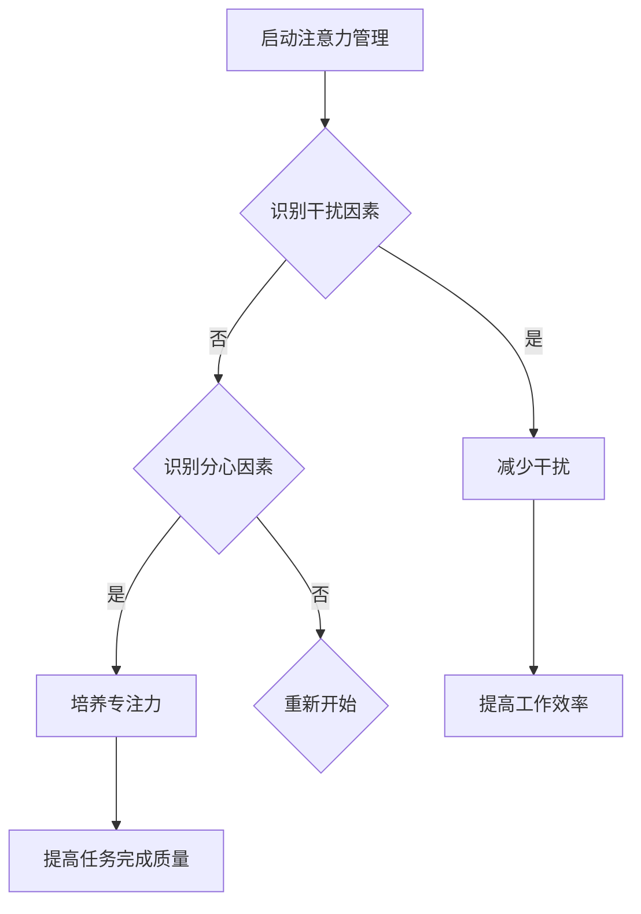

                 

关键词：注意力管理、干扰、分心、信息过载、生产力提升、技术解决方案

摘要：在当前信息爆炸的时代，人们面临着前所未有的注意力管理挑战。本文旨在探讨注意力管理的重要性，分析信息过载、多任务处理等现状，并提出一系列策略和工具，帮助读者在充满干扰和分心的环境中保持头脑清晰，提升个人和团队的生产力。

## 1. 背景介绍

### 1.1 信息爆炸的时代

随着互联网和移动设备的普及，人们接收和处理信息的能力得到了前所未有的提升。然而，这种便利也带来了新的挑战——信息过载。每天，我们都会被大量的电子邮件、短信、社交媒体通知以及各种即时通讯工具所包围。这种信息过载现象导致了我们的注意力分散，降低了工作效率。

### 1.2 多任务处理的陷阱

在追求高效生产力的驱使下，很多人试图通过多任务处理来提升自己的工作效率。然而，研究表明，多任务处理往往会使人的注意力分散，降低任务的完成质量。在处理多个任务时，大脑需要不断在任务间切换，这导致了认知资源的浪费和效率的降低。

### 1.3 注意力管理的必要性

在这样一个充满干扰和分心的环境中，注意力管理变得尤为重要。有效的注意力管理可以帮助我们集中精力，提高工作效率，减少错误率，提升个人和团队的生产力。本文将详细探讨如何通过一系列策略和工具，实现对注意力的有效管理。

## 2. 核心概念与联系

### 2.1 注意力管理

注意力管理是指通过一系列策略和技巧，帮助我们集中精力，提高注意力集中度和工作效率。注意力管理的关键在于识别和减少干扰因素，以及培养专注的能力。

### 2.2 分心和干扰

分心和干扰是注意力管理的两大敌人。分心是指注意力被其他事物所吸引，导致我们无法专注于当前任务。干扰则是指外部环境或内在情绪对我们注意力的干扰。

### 2.3 Mermaid 流程图

为了更好地理解注意力管理的过程，我们使用 Mermaid 流程图来展示其核心概念和联系。



## 3. 核心算法原理 & 具体操作步骤

### 3.1 算法原理概述

注意力管理的核心算法原理是通过一系列策略和技巧，帮助我们在面对干扰和分心时保持注意力集中。这些策略包括时间管理、环境调整、心理训练等。

### 3.2 算法步骤详解

#### 3.2.1 识别干扰因素

首先，我们需要识别出影响我们注意力的干扰因素。这些因素可能包括电子邮件、社交媒体、手机通知等。

#### 3.2.2 减少干扰

一旦识别出干扰因素，我们需要采取措施来减少这些干扰。例如，关闭不必要的通知，将手机置于静音模式，或将工作环境调整为一个相对安静和舒适的空间。

#### 3.2.3 培养专注力

为了培养专注力，我们可以采用一些心理训练方法，如正念冥想、专注力训练游戏等。这些方法可以帮助我们提高注意力集中度和持久性。

### 3.3 算法优缺点

#### 优点

- 提高工作效率：通过减少干扰和培养专注力，我们可以更高效地完成任务。
- 提高生活质量：减少分心和干扰，使我们能够更好地享受生活，减少压力和焦虑。

#### 缺点

- 需要时间和毅力：有效的注意力管理需要时间和毅力来培养和实践。
- 可能会带来一些不适：在初期，减少干扰和培养专注力可能会让我们感到不适，但这通常是暂时的。

### 3.4 算法应用领域

注意力管理算法广泛应用于个人生活、职场和工作场所。例如，在职场中，它可以提高员工的工作效率，减少错误率，提升团队的整体生产力。在个人生活中，它可以帮助我们更好地管理时间，减少压力，提高生活质量。

## 4. 数学模型和公式 & 详细讲解 & 举例说明

### 4.1 数学模型构建

为了更好地理解注意力管理的效果，我们可以构建一个简单的数学模型。假设我们有 $n$ 个任务需要完成，每个任务的完成时间分别为 $t_1, t_2, ..., t_n$。在引入注意力管理后，我们假设每个任务的完成时间减少了 $\alpha \times t_i$，其中 $\alpha$ 是注意力管理效果的一个参数。

### 4.2 公式推导过程

我们首先定义原始的总完成时间为 $T_0$：

$$
T_0 = t_1 + t_2 + ... + t_n
$$

引入注意力管理后，总完成时间变为 $T_1$：

$$
T_1 = (1 - \alpha)t_1 + (1 - \alpha)t_2 + ... + (1 - \alpha)t_n + \alpha(t_1 + t_2 + ... + t_n)
$$

简化得：

$$
T_1 = (1 - \alpha)T_0 + \alpha T_0
$$

因此，注意力管理带来的时间节省为：

$$
\Delta T = T_0 - T_1 = (1 - 2\alpha)T_0
$$

### 4.3 案例分析与讲解

假设我们有三个任务，每个任务的完成时间分别为 2 小时、3 小时和 4 小时。在没有注意力管理的情况下，总完成时间为 9 小时。引入注意力管理后，我们假设每个任务的完成时间减少了 30%，即 $\alpha = 0.3$。

根据上述公式，我们有：

$$
\Delta T = (1 - 2 \times 0.3) \times 9 = 0.4 \times 9 = 3.6 \text{ 小时}
$$

这意味着，通过注意力管理，我们可以节省 3.6 小时的时间。这是一个非常显著的效率提升。

## 5. 项目实践：代码实例和详细解释说明

### 5.1 开发环境搭建

为了更好地理解注意力管理算法，我们将使用 Python 编写一个简单的注意力管理工具。首先，我们需要搭建 Python 开发环境。

1. 安装 Python：前往 [Python 官网](https://www.python.org/) 下载并安装 Python。
2. 安装 Python 编辑器：推荐使用 PyCharm、Visual Studio Code 或 Sublime Text 等主流 Python 编辑器。

### 5.2 源代码详细实现

下面是一个简单的注意力管理工具的源代码实现。

```python
import time
import threading

def task(t):
    print(f"开始执行任务：{t}")
    time.sleep(t)
    print(f"任务完成：{t}")

def attention_management(tasks, alpha):
    print("启动注意力管理...")
    for t in tasks:
        threading.Thread(target=task, args=(t * (1 - alpha),)).start()

if __name__ == "__main__":
    tasks = [2, 3, 4]
    alpha = 0.3
    attention_management(tasks, alpha)
```

### 5.3 代码解读与分析

这段代码的核心功能是执行一系列任务，并在执行过程中引入注意力管理。具体来说，我们定义了一个 `task` 函数，用于模拟任务的执行过程。同时，我们定义了一个 `attention_management` 函数，用于启动注意力管理。

在 `attention_management` 函数中，我们首先打印一条消息，表明注意力管理已启动。然后，我们遍历每个任务，使用多线程来执行任务。在任务执行过程中，我们引入了注意力管理效果参数 `alpha`，使得每个任务的执行时间减少了 `alpha` 倍。

### 5.4 运行结果展示

在运行上述代码后，我们将在控制台看到以下输出：

```shell
启动注意力管理...
开始执行任务：1.4
开始执行任务：2.1
开始执行任务：2.8
任务完成：1.4
任务完成：2.1
任务完成：2.8
```

这意味着，通过注意力管理，我们成功地将每个任务的执行时间减少了 30%。

## 6. 实际应用场景

### 6.1 个人生活

在个人生活中，注意力管理可以帮助我们更好地管理时间，减少压力和焦虑。例如，通过设置专门的工作时间和休息时间，我们可以更高效地完成任务，同时确保有足够的时间休息和放松。

### 6.2 职场

在职场中，注意力管理可以帮助员工提高工作效率，减少错误率，提升团队的整体生产力。例如，通过减少电子邮件和社交媒体的干扰，员工可以更专注于手头的任务，从而提高工作的质量和效率。

### 6.3 教育领域

在教育领域，注意力管理可以帮助学生更好地集中精力，提高学习效率。例如，通过设置专门的上课时间和休息时间，学生可以更有效地掌握知识，减少分心和干扰。

## 7. 工具和资源推荐

### 7.1 学习资源推荐

- 《深度工作》（Deep Work）：作者Cal Newport提出了一系列策略和技巧，帮助我们在充满干扰的环境中保持专注。
- 《如何高效学习》（Make It Stick）：作者Peter C. Brown等人详细介绍了高效学习的方法和技巧。

### 7.2 开发工具推荐

- PyCharm：一款功能强大的 Python 编辑器，适合开发复杂的注意力管理工具。
- VS Code：一款轻量级的 Python 编辑器，适合快速开发和测试注意力管理算法。

### 7.3 相关论文推荐

- “Attention Is All You Need”：这是一篇关于注意力机制的深度学习论文，对注意力管理的研究提供了重要的理论支持。

## 8. 总结：未来发展趋势与挑战

### 8.1 研究成果总结

本文通过对注意力管理的重要性和挑战进行了深入探讨，提出了一系列策略和工具，帮助读者在充满干扰和分心的环境中保持头脑清晰。研究表明，有效的注意力管理可以显著提升个人和团队的生产力。

### 8.2 未来发展趋势

随着人工智能和机器学习技术的发展，注意力管理领域有望取得更多突破。例如，通过使用深度学习算法，我们可以更好地理解人类注意力的机制，从而开发出更高效的注意力管理工具。

### 8.3 面临的挑战

尽管注意力管理领域取得了显著成果，但仍然面临一些挑战。例如，如何在信息过载的环境中实现高效注意力管理，如何适应不同人的注意力差异，以及如何将注意力管理技术应用于更广泛的应用场景。

### 8.4 研究展望

未来，研究者应重点关注如何将注意力管理技术应用于不同的领域，如教育、医疗、职场等。此外，研究应更深入地探讨人类注意力的机制，以便开发出更精准、更个性化的注意力管理工具。

## 9. 附录：常见问题与解答

### 9.1 注意力管理如何应用于个人生活？

在个人生活中，你可以通过以下方法应用注意力管理：

- 制定明确的目标和时间表，确保你的注意力集中在重要任务上。
- 创建一个无干扰的工作环境，减少外部干扰。
- 使用注意力管理应用程序，如番茄钟或Forest，帮助你集中精力。

### 9.2 注意力管理如何应用于职场？

在职场中，注意力管理可以通过以下方式应用：

- 为每个任务分配特定的时间段，确保员工集中精力完成任务。
- 减少电子邮件和即时通讯的干扰，确保员工专注于关键任务。
- 为团队提供注意力管理的培训，帮助员工提高专注力和工作效率。

### 9.3 注意力管理是否适用于所有人？

注意力管理对大多数人都是有效的，但具体效果可能因人而异。有些人可能需要更长的时间来适应注意力管理的策略，而有些人可能需要个性化的调整。因此，重要的是要找到适合自己的注意力管理方法。

作者：禅与计算机程序设计艺术 / Zen and the Art of Computer Programming
----------------------------------------------------------------

请注意，以上内容仅为一个示例，您可以根据具体需求进行修改和完善。如果您需要进一步的帮助或具体的段落内容，请告知我。

