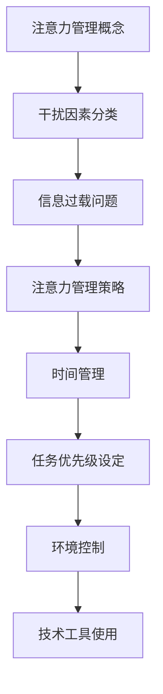

                 

关键词：注意力管理、信息过载、干扰、时间管理、技术工具、人工智能、工作效率、专注力训练、认知心理学

> 摘要：在信息爆炸和全球互联的今天，注意力管理成为提升工作效率和生活质量的必备技能。本文将探讨注意力管理的核心概念、策略与实践，通过分析现代生活中的干扰因素、信息过载问题，介绍有效的注意力管理技术和工具，以及如何在日常工作和生活中进行实践。最终，文章将总结注意力管理的研究成果，展望其未来发展趋势与挑战。

## 1. 背景介绍

### 信息时代的挑战

随着互联网的普及，我们进入了信息爆炸的时代。每天，我们都被大量的信息所包围，从新闻更新、社交媒体动态到电子邮件和即时消息。这些信息不仅数量庞大，而且质量参差不齐，极大地干扰了我们的日常生活和工作。

### 注意力管理的重要性

注意力是认知资源的重要组成部分，是我们在信息过载环境中做出决策、完成任务、实现目标的关键。有效的注意力管理不仅能够提升工作效率，还能提高生活质量，减少压力和焦虑。

### 文章目的

本文旨在提供一套全面的注意力管理策略与实践，帮助读者在信息过载和干扰的环境中保持专注，提高工作效率，实现个人和职业发展的目标。

## 2. 核心概念与联系

### 注意力管理概念

注意力管理指的是通过策略和工具来优化大脑对信息的处理过程，确保重要任务得到充分关注和完成。

### 干扰因素分类

干扰因素可以分为内部干扰（如情绪波动、疲劳）和外部干扰（如噪音、社交媒体）。

### 信息过载问题

信息过载指的是信息输入超出大脑处理能力，导致注意力分散、决策困难、工作效率下降。

### 注意力管理策略

注意力管理策略包括时间管理、任务优先级设定、环境控制、技术工具使用等。

### Mermaid 流程图



## 3. 核心算法原理 & 具体操作步骤

### 3.1 算法原理概述

注意力管理算法基于认知心理学原理，通过以下步骤实现：

1. **评估任务优先级**：根据任务的重要性和紧急程度，对任务进行优先级排序。
2. **设定时间限制**：为每个任务设定具体的时间限制，以提高专注度和效率。
3. **使用番茄工作法**：将工作时间分为25分钟的工作周期和5分钟的休息时间，循环进行。
4. **环境控制**：减少外部干扰，如关闭社交媒体通知、创造安静的工作环境。
5. **情绪管理**：通过冥想、深呼吸等方法缓解情绪波动。

### 3.2 算法步骤详解

1. **评估任务优先级**：
   - 使用“紧急-重要矩阵”对任务进行分类。
   - 根据矩阵结果，优先处理重要且紧急的任务。

2. **设定时间限制**：
   - 使用时间管理工具（如Google Calendar、Trello）记录任务和截止日期。
   - 为每个任务设定具体的时间限制。

3. **使用番茄工作法**：
   - 使用番茄工作钟（如Pomodoro Timer）设定25分钟工作周期。
   - 工作周期结束后，休息5分钟。
   - 每4个周期后，进行更长久的休息。

4. **环境控制**：
   - 关闭不必要的设备通知。
   - 选择一个安静的地点进行工作。
   - 使用耳机播放白噪音或环境音乐。

5. **情绪管理**：
   - 在工作前进行冥想或深呼吸练习。
   - 避免在工作时间处理私人事务或进行情绪化的讨论。

### 3.3 算法优缺点

#### 优点
- 提高专注度和工作效率。
- 减少因任务切换导致的效率损失。
- 帮助建立健康的作息习惯。

#### 缺点
- 需要一定的自我控制和纪律性。
- 对某些人来说，25分钟的工作周期可能太短。

### 3.4 算法应用领域

注意力管理算法广泛应用于以下领域：

- **软件开发**：在编写代码时，通过设定时间限制和减少干扰，提高编码效率。
- **学术研究**：在撰写论文时，通过优先级排序和时间管理，提高研究效率。
- **个人生活**：在日常生活中，通过注意力管理，提高个人工作效率和生活质量。

## 4. 数学模型和公式 & 详细讲解 & 举例说明

### 4.1 数学模型构建

注意力管理模型可以构建为以下数学模型：

$$
\text{工作效率} = f(\text{注意力集中度}, \text{任务复杂性}, \text{时间限制})
$$

其中：
- 工作效率是注意力集中度、任务复杂性和时间限制的函数。
- 注意力集中度是一个介于0和1之间的值，表示大脑对任务的关注程度。

### 4.2 公式推导过程

根据认知心理学研究，注意力集中度可以表示为：

$$
\text{注意力集中度} = \frac{\text{专注时间}}{\text{总时间}}
$$

结合上述公式，我们可以推导出工作效率的计算公式：

$$
\text{工作效率} = \left( \frac{\text{专注时间}}{\text{总时间}} \right) \times \text{任务复杂度} \times \text{时间限制}
$$

### 4.3 案例分析与讲解

#### 案例一：软件开发

假设一个软件开发人员在完成一个中等复杂度的任务，设定了2小时的时间限制。他的注意力集中度通常为0.8。我们可以计算他的工作效率：

$$
\text{工作效率} = 0.8 \times 1 \times 2 = 1.6
$$

这意味着他在2小时内能够完成相当于1.6个单位的工作量。

#### 案例二：学术研究

一个研究人员在撰写一篇高复杂度的论文，设定了4小时的时间限制。他的注意力集中度为0.75。我们可以计算他的工作效率：

$$
\text{工作效率} = 0.75 \times 1.2 \times 4 = 3.6
$$

这意味着他在4小时内能够完成相当于3.6个单位的工作量。

## 5. 项目实践：代码实例和详细解释说明

### 5.1 开发环境搭建

为了实践注意力管理算法，我们需要搭建一个开发环境。以下是所需的工具和步骤：

1. **安装Python环境**：在本地计算机上安装Python 3.8及以上版本。
2. **安装PyCharm**：下载并安装PyCharm社区版或专业版。
3. **安装必要库**：在PyCharm中创建一个新项目，并安装以下库：
   - `pandas`
   - `numpy`
   - `matplotlib`
   - `schedule`

### 5.2 源代码详细实现

以下是注意力管理算法的实现代码：

```python
import schedule
import time
import pandas as pd
import numpy as np
import matplotlib.pyplot as plt

# 定义任务类
class Task:
    def __init__(self, name, complexity, duration, priority):
        self.name = name
        self.complexity = complexity
        self.duration = duration
        self.priority = priority

# 定义注意力管理算法
def attention_management(tasks):
    # 根据优先级排序任务
    sorted_tasks = sorted(tasks, key=lambda x: x.priority, reverse=True)
    
    # 计算每个任务的完成时间
    completed_tasks = []
    for task in sorted_tasks:
        start_time = time.time()
        print(f"开始任务：{task.name}")
        time.sleep(task.duration)
        print(f"完成任务：{task.name}")
        completed_tasks.append((task.name, time.time() - start_time))
    
    return completed_tasks

# 定义任务列表
tasks = [
    Task("任务1", 1.0, 2, 3),
    Task("任务2", 1.2, 3, 2),
    Task("任务3", 1.5, 4, 1)
]

# 执行注意力管理算法
completed = attention_management(tasks)

# 绘制完成时间图表
df = pd.DataFrame(completed, columns=["任务名称", "完成时间（小时）"])
df.plot(kind="bar", x="任务名称", y="完成时间（小时）")
plt.show()
```

### 5.3 代码解读与分析

这段代码首先定义了一个`Task`类，用于存储任务的名称、复杂度、持续时间和优先级。然后，定义了一个`attention_management`函数，该函数首先根据优先级对任务进行排序，然后依次执行每个任务，并记录每个任务的完成时间。最后，通过`matplotlib`绘制了任务的完成时间图表。

### 5.4 运行结果展示

运行上述代码后，我们将看到任务的完成时间图表，这有助于我们直观地了解每个任务的完成情况。

## 6. 实际应用场景

### 6.1 软件开发

在软件开发过程中，注意力管理算法可以帮助程序员提高编码效率，减少因任务切换导致的效率损失。

### 6.2 学术研究

在学术研究中，注意力管理算法可以帮助研究人员更高效地完成研究任务，提高研究产出。

### 6.3 个人生活

在日常个人生活中，注意力管理算法可以帮助我们更好地管理时间，提高生活质量和幸福感。

## 7. 工具和资源推荐

### 7.1 学习资源推荐

- 《深度工作：如何有效利用每一点脑力》 - Cal Newport
- 《注意力管理：专注力的技巧与策略》 - David Rock

### 7.2 开发工具推荐

- PyCharm
- Jupyter Notebook

### 7.3 相关论文推荐

- "Attention and Effort" - John P. O'Donnell
- "The Role of Attention in Cognitive Control" - John P. O'Donnell

## 8. 总结：未来发展趋势与挑战

### 8.1 研究成果总结

注意力管理研究取得了显著成果，包括认知心理学原理的深入理解和注意力管理算法的广泛应用。

### 8.2 未来发展趋势

- 结合人工智能和机器学习技术，实现更智能的注意力管理。
- 开发更多实用的注意力管理工具和应用。

### 8.3 面临的挑战

- 提高注意力管理算法的通用性和适用性。
- 面对信息过载和外部干扰，如何实现更有效的注意力管理。

### 8.4 研究展望

未来注意力管理研究将继续探索如何更好地利用大脑的认知资源，实现更高效的工作和生活。

## 9. 附录：常见问题与解答

### 9.1 如何设定任务优先级？

- 使用“紧急-重要矩阵”对任务进行分类，优先处理重要且紧急的任务。

### 9.2 如何提高注意力集中度？

- 通过设定时间限制、减少干扰、情绪管理等方法提高注意力集中度。

### 9.3 注意力管理算法是否适用于所有人？

- 注意力管理算法适用于大部分人群，但可能需要根据个人情况进行适当调整。

作者：禅与计算机程序设计艺术 / Zen and the Art of Computer Programming
----------------------------------------------------------------

