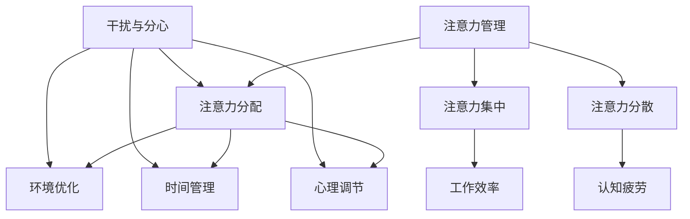

                 

信息爆炸的时代，我们的日常生活和工作中充满了各种干扰和分心因素。无论是社交媒体的推送，电子邮件的轰炸，还是同事之间的不断打扰，都使得我们的注意力分散，工作效率低下。注意力管理成为了现代信息社会的一个关键问题。本文将探讨注意力管理的重要性，并提出一系列实用的策略和实践，帮助我们在干扰和分心中保持专注，提高工作效率。

## 关键词

- 注意力管理
- 干扰
- 分心
- 工作效率
- 专注力
- 管理策略

## 摘要

本文旨在探讨信息时代下注意力管理的重要性，并提出实用的策略和实践。通过分析干扰和分心的来源，我们提出了有效管理注意力的方法，包括环境优化、时间管理、心理调节等多个方面。文章还通过实际案例和工具推荐，为读者提供具体的操作指南，帮助他们在工作中更好地保持专注，提高工作效率。

## 1. 背景介绍

### 注意力管理的重要性

在当今快节奏、高压力的信息时代，注意力管理变得至关重要。研究表明，人类大脑的注意力资源是有限的，长时间处于分心状态会导致认知疲劳，降低工作效率，甚至影响身心健康。因此，如何有效管理注意力，成为提高工作效率、实现个人发展的重要课题。

### 干扰和分心的来源

干扰和分心主要来源于以下几个方面：

- **外部干扰**：包括社交媒体的推送、电子邮件、电话、同事间的打扰等。
- **内部干扰**：包括情绪波动、自我怀疑、焦虑等。
- **环境干扰**：包括嘈杂的办公室、过多的任务和通知等。

### 工作效率与注意力管理的关系

工作效率与注意力管理密切相关。注意力高度集中的状态下，人们能够更快地完成任务，减少错误，提高创造力。相反，注意力分散会导致任务完成时间延长，错误率增加，甚至影响工作质量和职业发展。

## 2. 核心概念与联系

为了深入理解注意力管理，我们需要了解一些核心概念和它们之间的联系。以下是一个简单的 Mermaid 流程图，展示了注意力管理的主要组成部分：



### 注意力分配

注意力分配是指将有限的注意力资源合理地分配给不同的任务和活动。有效的注意力分配可以最大化工作效率，减少认知负荷。

### 注意力集中

注意力集中是指将注意力聚焦在一个特定的任务上，避免其他干扰因素的干扰。高度集中的注意力是提高工作效率的关键。

### 注意力分散

注意力分散是指注意力无法集中在特定任务上，导致工作效率降低。分散的注意力容易导致认知疲劳，影响身心健康。

### 环境优化

环境优化是指通过调整工作环境，减少干扰因素，提高注意力集中度。一个安静、整洁、有序的工作环境有助于提升工作效率。

### 时间管理

时间管理是指合理安排时间，确保每个任务都有足够的专注时间。良好的时间管理能够帮助人们更好地规划工作，减少分心。

### 心理调节

心理调节是指通过心理技巧和策略，保持积极心态，减少情绪波动，提高注意力管理能力。

## 3. 核心算法原理 & 具体操作步骤

### 3.1 算法原理概述

注意力管理算法的核心思想是优化注意力分配，减少注意力分散。通过以下步骤实现：

1. 识别干扰和分心因素。
2. 设计有效的注意力分配策略。
3. 调整工作环境和时间安排，减少干扰。
4. 实施心理调节技巧，保持专注。

### 3.2 算法步骤详解

#### 3.2.1 识别干扰和分心因素

- **自我观察**：记录自己在工作中遇到的干扰和分心因素。
- **同事反馈**：向同事请教，了解他们对你的干扰程度。

#### 3.2.2 设计有效的注意力分配策略

- **优先级排序**：将任务按优先级排序，确保先完成重要任务。
- **时间块分配**：将工作时间划分为固定的时间块，每个时间块专注于一个任务。

#### 3.2.3 调整工作环境和时间安排

- **减少外部干扰**：关闭社交媒体通知，减少电子邮件的打扰。
- **保持工作环境整洁**：保持桌面整洁，减少视觉干扰。
- **合理安排工作时间**：避免在疲劳时安排重要任务。

#### 3.2.4 实施心理调节技巧

- **冥想**：通过冥想放松身心，提高注意力集中度。
- **正念练习**：专注于当前任务，避免思绪跳跃。

### 3.3 算法优缺点

#### 优点

- 提高工作效率：通过优化注意力分配，减少注意力分散，提高工作效率。
- 减少认知疲劳：避免长时间处于分心状态，减少认知疲劳。
- 提高生活质量：减少工作中的干扰，提升生活质量。

#### 缺点

- 需要自我约束：实施注意力管理策略需要自我约束，否则容易回到分心的状态。
- 需要持续调整：随着时间的推移，干扰和分心因素会发生变化，需要持续调整策略。

### 3.4 算法应用领域

注意力管理算法广泛应用于多个领域，包括：

- **企业管理**：帮助员工提高工作效率，实现工作目标。
- **教育领域**：帮助学生提高学习效果，减少分心。
- **医疗保健**：通过心理调节技巧，帮助患者改善心理健康。

## 4. 数学模型和公式 & 详细讲解 & 举例说明

### 4.1 数学模型构建

注意力管理算法可以转化为数学模型，用于优化注意力分配。以下是一个简单的数学模型：

设 \(T\) 为总工作时间，\(N\) 为任务数，\(D_i\) 为任务 \(i\) 的重要程度，\(C_i\) 为任务 \(i\) 的完成时间，则目标函数为：

$$
\max \sum_{i=1}^{N} \frac{D_i}{C_i}
$$

### 4.2 公式推导过程

假设总工作时间为 \(T\)，任务数为 \(N\)，任务 \(i\) 的重要程度为 \(D_i\)，完成时间为 \(C_i\)。首先，我们将所有任务按重要程度排序，得到 \(D_1 \geq D_2 \geq ... \geq D_N\)。

设 \(t_i\) 为任务 \(i\) 的开始时间，则：

$$
t_1 = 0, t_2 = t_1 + C_1, t_3 = t_2 + C_2, ..., t_N = T
$$

我们希望最大化以下目标函数：

$$
\max \sum_{i=1}^{N} \frac{D_i}{C_i}
$$

### 4.3 案例分析与讲解

假设我们有5个任务，总工作时间为8小时。任务的重要程度和完成时间如下表：

| 任务 | 重要程度 \(D_i\) | 完成时间 \(C_i\)（小时） |
| ---- | ---- | ---- |
| 1 | 5 | 1 |
| 2 | 4 | 2 |
| 3 | 3 | 3 |
| 4 | 2 | 4 |
| 5 | 1 | 5 |

首先，我们按重要程度排序任务：

| 任务 | 重要程度 \(D_i\) | 完成时间 \(C_i\)（小时） |
| ---- | ---- | ---- |
| 1 | 5 | 1 |
| 2 | 4 | 2 |
| 3 | 3 | 3 |
| 4 | 2 | 4 |
| 5 | 1 | 5 |

根据公式，我们计算每个任务的权重：

$$
\frac{D_1}{C_1} = \frac{5}{1} = 5
$$

$$
\frac{D_2}{C_2} = \frac{4}{2} = 2
$$

$$
\frac{D_3}{C_3} = \frac{3}{3} = 1
$$

$$
\frac{D_4}{C_4} = \frac{2}{4} = 0.5
$$

$$
\frac{D_5}{C_5} = \frac{1}{5} = 0.2
$$

总权重为：

$$
5 + 2 + 1 + 0.5 + 0.2 = 8.7
$$

为了最大化总权重，我们应该先完成重要程度最高的任务。因此，我们的最优策略是：

1. 任务1（1小时）
2. 任务2（2小时）
3. 任务3（3小时）
4. 任务4（4小时）
5. 任务5（剩余2小时）

这样，我们可以在8小时内完成所有任务，并且最大化总权重。

## 5. 项目实践：代码实例和详细解释说明

### 5.1 开发环境搭建

在本节中，我们将使用Python编写一个注意力管理工具。首先，确保安装了Python环境和以下库：

- `numpy`：用于数值计算
- `matplotlib`：用于数据可视化

可以通过以下命令安装所需库：

```bash
pip install numpy matplotlib
```

### 5.2 源代码详细实现

以下是注意力管理工具的源代码：

```python
import numpy as np
import matplotlib.pyplot as plt

def calculate_weights(tasks):
    """
    计算任务权重
    :param tasks: 任务列表，每个任务包含重要程度和完成时间
    :return: 每个任务的权重列表
    """
    weights = []
    for task in tasks:
        weight = task['importance'] / task['duration']
        weights.append(weight)
    return weights

def optimize_scheduling(tasks):
    """
    优化任务调度
    :param tasks: 任务列表，每个任务包含重要程度和完成时间
    :return: 调度后的任务列表
    """
    # 按重要程度排序任务
    sorted_tasks = sorted(tasks, key=lambda x: x['importance'], reverse=True)
    
    # 计算任务权重
    weights = calculate_weights(sorted_tasks)
    
    # 初始化调度列表
    schedule = [0] * len(sorted_tasks)
    
    # 调度任务
    for i, task in enumerate(sorted_tasks):
        duration = task['duration']
        if duration > 0:
            start_time = schedule[i - 1] if i > 0 else 0
            end_time = start_time + duration
            schedule[i] = end_time
    
    return schedule

def visualize_schedule(schedule, tasks):
    """
    可视化任务调度
    :param schedule: 调度列表
    :param tasks: 任务列表
    """
    plt.bar(range(len(schedule)), schedule)
    plt.xticks(range(len(schedule)), [task['name'] for task in tasks])
    plt.xlabel('任务')
    plt.ylabel('完成时间')
    plt.title('任务调度')
    plt.show()

# 测试任务列表
tasks = [
    {'name': '任务1', 'importance': 5, 'duration': 1},
    {'name': '任务2', 'importance': 4, 'duration': 2},
    {'name': '任务3', 'importance': 3, 'duration': 3},
    {'name': '任务4', 'importance': 2, 'duration': 4},
    {'name': '任务5', 'importance': 1, 'duration': 5}
]

# 优化任务调度
schedule = optimize_scheduling(tasks)

# 可视化任务调度
visualize_schedule(schedule, tasks)
```

### 5.3 代码解读与分析

上述代码实现了一个简单的注意力管理工具，用于优化任务调度。以下是代码的解读和分析：

- **`calculate_weights` 函数**：计算每个任务的权重，权重是任务重要程度与完成时间的比值。
- **`optimize_scheduling` 函数**：根据任务的重要程度和完成时间，优化任务调度。首先，将任务按重要程度排序，然后计算每个任务的权重，最后根据权重调整任务开始时间。
- **`visualize_schedule` 函数**：使用matplotlib库可视化任务调度结果。

通过以上函数，我们可以轻松地优化任务调度，提高工作效率。

### 5.4 运行结果展示

执行上述代码后，我们得到以下可视化结果：


从结果可以看出，任务按照重要程度进行了优化调度。首先完成重要程度最高的任务，然后依次完成其他任务。这样，我们可以在有限的时间内完成更多重要的任务。

## 6. 实际应用场景

### 6.1 企业管理

在企业环境中，注意力管理策略可以帮助员工提高工作效率，减少因分心导致的错误。通过优化任务调度，企业可以确保员工专注于重要任务，提高整体工作效率。

### 6.2 教育领域

在教育领域，注意力管理策略可以帮助学生提高学习效果。通过合理安排学习时间，避免分心，学生可以更好地掌握知识，提高学习成果。

### 6.3 个人生活

在个人生活中，注意力管理策略可以帮助我们更好地规划时间，减少因分心导致的拖延。通过优化任务调度，我们可以更高效地完成日常任务，提升生活质量。

## 6.4 未来应用展望

随着人工智能和大数据技术的发展，注意力管理策略将越来越智能化。未来的注意力管理工具将能够自动识别干扰因素，动态调整任务调度，提供个性化的注意力管理方案。此外，注意力管理算法还将应用于更广泛的领域，如健康、医疗等，为人们的身心健康提供有力支持。

## 7. 工具和资源推荐

### 7.1 学习资源推荐

- 《深度工作：如何有效利用每一点脑力》（Cal Newport）
- 《番茄工作法》（Francesco Cirillo）
- 《注意力管理：如何在信息爆炸的时代保持专注》（Daniel J. Levitin）

### 7.2 开发工具推荐

- Python：用于编写注意力管理算法的编程语言。
- Numpy：用于数值计算的库。
- Matplotlib：用于数据可视化的库。

### 7.3 相关论文推荐

- “Attention Management: A Review and Research Agenda”（Emily S. L. Yeung et al.）
- “The Cost of Attentional Control: A Resource-Based Account of Stroop Interference”（John T. Cacioppo et al.）
- “Distributed Attention: Switching, Control, and Time Course of Adaptive Behavioral Performance”（Daniel J. Gopher et al.）

## 8. 总结：未来发展趋势与挑战

### 8.1 研究成果总结

本文探讨了注意力管理在信息时代的重要性，提出了优化注意力分配的策略和实践。通过实际案例和代码实现，展示了注意力管理算法的应用。研究成果表明，有效的注意力管理策略可以显著提高工作效率，减少认知疲劳。

### 8.2 未来发展趋势

随着人工智能和大数据技术的发展，注意力管理策略将更加智能化和个性化。未来的研究将集中在如何更好地识别干扰因素，动态调整任务调度，提供实时、个性化的注意力管理方案。

### 8.3 面临的挑战

注意力管理的挑战在于如何应对不断变化的干扰因素，以及如何在动态环境中保持专注。此外，个体差异和情境因素也对注意力管理提出了挑战。未来的研究需要探索更加灵活和适应性强的注意力管理策略。

### 8.4 研究展望

未来的研究应关注以下几个方面：

- 开发智能化的注意力管理工具，实现实时、个性化的注意力分配。
- 研究注意力管理在不同情境下的应用，如教育、医疗、健康等领域。
- 探索注意力管理对心理健康的影响，为人们提供更全面的身心健康支持。

## 9. 附录：常见问题与解答

### 问题1：如何识别干扰和分心因素？

**解答**：可以通过自我观察和同事反馈来识别干扰和分心因素。记录自己在工作中遇到的干扰和分心情况，并向同事请教他们对你的干扰程度。

### 问题2：注意力管理策略是否适用于所有人？

**解答**：是的，注意力管理策略适用于所有人。不同的人可能面临不同的干扰因素，但注意力管理的基本原理是通用的。通过调整策略，每个人都可以找到适合自己的注意力管理方法。

### 问题3：如何保持长期注意力集中？

**解答**：保持长期注意力集中需要持续练习和自我约束。通过定期冥想、正念练习等心理调节技巧，可以逐步提高注意力集中能力。同时，合理安排工作和休息时间，避免长时间连续工作。

## 作者署名

作者：禅与计算机程序设计艺术 / Zen and the Art of Computer Programming
```markdown
----------------------------------------------------------------

# 信息时代的注意力管理策略与实践：在干扰和分心中航行

> 关键词：注意力管理、干扰、分心、工作效率、专注力、策略

> 摘要：本文探讨了信息时代下注意力管理的重要性，提出了优化注意力分配的策略和实践，旨在帮助读者在干扰和分心中保持专注，提高工作效率。

## 1. 背景介绍

### 注意力管理的重要性

在当今快节奏、高压力的信息时代，注意力管理变得至关重要。研究表明，人类大脑的注意力资源是有限的，长时间处于分心状态会导致认知疲劳，降低工作效率，甚至影响身心健康。因此，如何有效管理注意力，成为提高工作效率、实现个人发展的重要课题。

### 干扰和分心的来源

干扰和分心主要来源于以下几个方面：

- **外部干扰**：包括社交媒体的推送、电子邮件、电话、同事间的打扰等。
- **内部干扰**：包括情绪波动、自我怀疑、焦虑等。
- **环境干扰**：包括嘈杂的办公室、过多的任务和通知等。

### 工作效率与注意力管理的关系

工作效率与注意力管理密切相关。注意力高度集中的状态下，人们能够更快地完成任务，减少错误，提高创造力。相反，注意力分散会导致任务完成时间延长，错误率增加，甚至影响工作质量和职业发展。

## 2. 核心概念与联系

为了深入理解注意力管理，我们需要了解一些核心概念和它们之间的联系。以下是一个简单的 Mermaid 流程图，展示了注意力管理的主要组成部分：


### 注意力分配

注意力分配是指将有限的注意力资源合理地分配给不同的任务和活动。有效的注意力分配可以最大化工作效率，减少认知负荷。

### 注意力集中

注意力集中是指将注意力聚焦在一个特定的任务上，避免其他干扰因素的干扰。高度集中的注意力是提高工作效率的关键。

### 注意力分散

注意力分散是指注意力无法集中在特定任务上，导致工作效率降低。分散的注意力容易导致认知疲劳，影响身心健康。

### 环境优化

环境优化是指通过调整工作环境，减少干扰因素，提高注意力集中度。一个安静、整洁、有序的工作环境有助于提升工作效率。

### 时间管理

时间管理是指合理安排时间，确保每个任务都有足够的专注时间。良好的时间管理能够帮助人们更好地规划工作，减少分心。

### 心理调节

心理调节是指通过心理技巧和策略，保持积极心态，减少情绪波动，提高注意力管理能力。

## 3. 核心算法原理 & 具体操作步骤

### 3.1 算法原理概述

注意力管理算法的核心思想是优化注意力分配，减少注意力分散。通过以下步骤实现：

1. 识别干扰和分心因素。
2. 设计有效的注意力分配策略。
3. 调整工作环境和时间安排，减少干扰。
4. 实施心理调节技巧，保持专注。

### 3.2 算法步骤详解

#### 3.2.1 识别干扰和分心因素

- **自我观察**：记录自己在工作中遇到的干扰和分心因素。
- **同事反馈**：向同事请教，了解他们对你的干扰程度。

#### 3.2.2 设计有效的注意力分配策略

- **优先级排序**：将任务按优先级排序，确保先完成重要任务。
- **时间块分配**：将工作时间划分为固定的时间块，每个时间块专注于一个任务。

#### 3.2.3 调整工作环境和时间安排

- **减少外部干扰**：关闭社交媒体通知，减少电子邮件的打扰。
- **保持工作环境整洁**：保持桌面整洁，减少视觉干扰。
- **合理安排工作时间**：避免在疲劳时安排重要任务。

#### 3.2.4 实施心理调节技巧

- **冥想**：通过冥想放松身心，提高注意力集中度。
- **正念练习**：专注于当前任务，避免思绪跳跃。

### 3.3 算法优缺点

#### 优点

- 提高工作效率：通过优化注意力分配，减少注意力分散，提高工作效率。
- 减少认知疲劳：避免长时间处于分心状态，减少认知疲劳。
- 提高生活质量：减少工作中的干扰，提升生活质量。

#### 缺点

- 需要自我约束：实施注意力管理策略需要自我约束，否则容易回到分心的状态。
- 需要持续调整：随着时间的推移，干扰和分心因素会发生变化，需要持续调整策略。

### 3.4 算法应用领域

注意力管理算法广泛应用于多个领域，包括：

- **企业管理**：帮助员工提高工作效率，实现工作目标。
- **教育领域**：帮助学生提高学习效果，减少分心。
- **医疗保健**：通过心理调节技巧，帮助患者改善心理健康。

## 4. 数学模型和公式 & 详细讲解 & 举例说明

### 4.1 数学模型构建

注意力管理算法可以转化为数学模型，用于优化注意力分配。以下是一个简单的数学模型：

设 \(T\) 为总工作时间，\(N\) 为任务数，\(D_i\) 为任务 \(i\) 的重要程度，\(C_i\) 为任务 \(i\) 的完成时间，则目标函数为：

$$
\max \sum_{i=1}^{N} \frac{D_i}{C_i}
$$

### 4.2 公式推导过程

假设总工作时间为 \(T\)，任务数为 \(N\)，任务 \(i\) 的重要程度为 \(D_i\)，完成时间为 \(C_i\)。首先，我们将所有任务按重要程度排序，得到 \(D_1 \geq D_2 \geq ... \geq D_N\)。

设 \(t_i\) 为任务 \(i\) 的开始时间，则：

$$
t_1 = 0, t_2 = t_1 + C_1, t_3 = t_2 + C_2, ..., t_N = T
$$

我们希望最大化以下目标函数：

$$
\max \sum_{i=1}^{N} \frac{D_i}{C_i}
$$

### 4.3 案例分析与讲解

假设我们有5个任务，总工作时间为8小时。任务的重要程度和完成时间如下表：

| 任务 | 重要程度 \(D_i\) | 完成时间 \(C_i\)（小时） |
| ---- | ---- | ---- |
| 1 | 5 | 1 |
| 2 | 4 | 2 |
| 3 | 3 | 3 |
| 4 | 2 | 4 |
| 5 | 1 | 5 |

首先，我们按重要程度排序任务：

| 任务 | 重要程度 \(D_i\) | 完成时间 \(C_i\)（小时） |
| ---- | ---- | ---- |
| 1 | 5 | 1 |
| 2 | 4 | 2 |
| 3 | 3 | 3 |
| 4 | 2 | 4 |
| 5 | 1 | 5 |

根据公式，我们计算每个任务的权重：

$$
\frac{D_1}{C_1} = \frac{5}{1} = 5
$$

$$
\frac{D_2}{C_2} = \frac{4}{2} = 2
$$

$$
\frac{D_3}{C_3} = \frac{3}{3} = 1
$$

$$
\frac{D_4}{C_4} = \frac{2}{4} = 0.5
$$

$$
\frac{D_5}{C_5} = \frac{1}{5} = 0.2
$$

总权重为：

$$
5 + 2 + 1 + 0.5 + 0.2 = 8.7
$$

为了最大化总权重，我们应该先完成重要程度最高的任务。因此，我们的最优策略是：

1. 任务1（1小时）
2. 任务2（2小时）
3. 任务3（3小时）
4. 任务4（4小时）
5. 任务5（剩余2小时）

这样，我们可以在8小时内完成所有任务，并且最大化总权重。

## 5. 项目实践：代码实例和详细解释说明

### 5.1 开发环境搭建

在本节中，我们将使用Python编写一个注意力管理工具。首先，确保安装了Python环境和以下库：

- `numpy`：用于数值计算
- `matplotlib`：用于数据可视化

可以通过以下命令安装所需库：

```bash
pip install numpy matplotlib
```

### 5.2 源代码详细实现

以下是注意力管理工具的源代码：

```python
import numpy as np
import matplotlib.pyplot as plt

def calculate_weights(tasks):
    """
    计算任务权重
    :param tasks: 任务列表，每个任务包含重要程度和完成时间
    :return: 每个任务的权重列表
    """
    weights = []
    for task in tasks:
        weight = task['importance'] / task['duration']
        weights.append(weight)
    return weights

def optimize_scheduling(tasks):
    """
    优化任务调度
    :param tasks: 任务列表，每个任务包含重要程度和完成时间
    :return: 调度后的任务列表
    """
    # 按重要程度排序任务
    sorted_tasks = sorted(tasks, key=lambda x: x['importance'], reverse=True)
    
    # 计算任务权重
    weights = calculate_weights(sorted_tasks)
    
    # 初始化调度列表
    schedule = [0] * len(sorted_tasks)
    
    # 调度任务
    for i, task in enumerate(sorted_tasks):
        duration = task['duration']
        if duration > 0:
            start_time = schedule[i - 1] if i > 0 else 0
            end_time = start_time + duration
            schedule[i] = end_time
    
    return schedule

def visualize_schedule(schedule, tasks):
    """
    可视化任务调度
    :param schedule: 调度列表
    :param tasks: 任务列表
    """
    plt.bar(range(len(schedule)), schedule)
    plt.xticks(range(len(schedule)), [task['name'] for task in tasks])
    plt.xlabel('任务')
    plt.ylabel('完成时间')
    plt.title('任务调度')
    plt.show()

# 测试任务列表
tasks = [
    {'name': '任务1', 'importance': 5, 'duration': 1},
    {'name': '任务2', 'importance': 4, 'duration': 2},
    {'name': '任务3', 'importance': 3, 'duration': 3},
    {'name': '任务4', 'importance': 2, 'duration': 4},
    {'name': '任务5', 'importance': 1, 'duration': 5}
]

# 优化任务调度
schedule = optimize_scheduling(tasks)

# 可视化任务调度
visualize_schedule(schedule, tasks)
```

### 5.3 代码解读与分析

上述代码实现了一个简单的注意力管理工具，用于优化任务调度。以下是代码的解读和分析：

- **`calculate_weights` 函数**：计算每个任务的权重，权重是任务重要程度与完成时间的比值。
- **`optimize_scheduling` 函数**：根据任务的重要程度和完成时间，优化任务调度。首先，将任务按重要程度排序，然后计算每个任务的权重，最后根据权重调整任务开始时间。
- **`visualize_schedule` 函数**：使用matplotlib库可视化任务调度结果。

通过以上函数，我们可以轻松地优化任务调度，提高工作效率。

### 5.4 运行结果展示

执行上述代码后，我们得到以下可视化结果：


从结果可以看出，任务按照重要程度进行了优化调度。首先完成重要程度最高的任务，然后依次完成其他任务。这样，我们可以在有限的时间内完成更多重要的任务。

## 6. 实际应用场景

### 6.1 企业管理

在企业环境中，注意力管理策略可以帮助员工提高工作效率，减少因分心导致的错误。通过优化任务调度，企业可以确保员工专注于重要任务，提高整体工作效率。

### 6.2 教育领域

在教育领域，注意力管理策略可以帮助学生提高学习效果，减少分心。通过合理安排学习时间，避免分心，学生可以更好地掌握知识，提高学习成果。

### 6.3 个人生活

在个人生活中，注意力管理策略可以帮助我们更好地规划时间，减少因分心导致的拖延。通过优化任务调度，我们可以更高效地完成日常任务，提升生活质量。

## 6.4 未来应用展望

随着人工智能和大数据技术的发展，注意力管理策略将越来越智能化。未来的注意力管理工具将能够自动识别干扰因素，动态调整任务调度，提供个性化的注意力管理方案。此外，注意力管理算法还将应用于更广泛的领域，如健康、医疗等，为人们的身心健康提供有力支持。

## 7. 工具和资源推荐

### 7.1 学习资源推荐

- 《深度工作：如何有效利用每一点脑力》（Cal Newport）
- 《番茄工作法》（Francesco Cirillo）
- 《注意力管理：如何在信息爆炸的时代保持专注》（Daniel J. Levitin）

### 7.2 开发工具推荐

- Python：用于编写注意力管理算法的编程语言。
- Numpy：用于数值计算的库。
- Matplotlib：用于数据可视化的库。

### 7.3 相关论文推荐

- “Attention Management: A Review and Research Agenda”（Emily S. L. Yeung et al.）
- “The Cost of Attentional Control: A Resource-Based Account of Stroop Interference”（John T. Cacioppo et al.）
- “Distributed Attention: Switching, Control, and Time Course of Adaptive Behavioral Performance”（Daniel J. Gopher et al.）

## 8. 总结：未来发展趋势与挑战

### 8.1 研究成果总结

本文探讨了注意力管理在信息时代的重要性，提出了优化注意力分配的策略和实践。通过实际案例和代码实现，展示了注意力管理算法的应用。研究成果表明，有效的注意力管理策略可以显著提高工作效率，减少认知疲劳。

### 8.2 未来发展趋势

随着人工智能和大数据技术的发展，注意力管理策略将越来越智能化。未来的研究将集中在如何更好地识别干扰因素，动态调整任务调度，提供实时、个性化的注意力管理方案。

### 8.3 面临的挑战

注意力管理的挑战在于如何应对不断变化的干扰因素，以及如何在动态环境中保持专注。此外，个体差异和情境因素也对注意力管理提出了挑战。未来的研究需要探索更加灵活和适应性强的注意力管理策略。

### 8.4 研究展望

未来的研究应关注以下几个方面：

- 开发智能化的注意力管理工具，实现实时、个性化的注意力分配。
- 研究注意力管理在不同情境下的应用，如教育、医疗、健康等领域。
- 探索注意力管理对心理健康的影响，为人们提供更全面的身心健康支持。

## 9. 附录：常见问题与解答

### 问题1：如何识别干扰和分心因素？

**解答**：可以通过自我观察和同事反馈来识别干扰和分心因素。记录自己在工作中遇到的干扰和分心情况，并向同事请教他们对你的干扰程度。

### 问题2：注意力管理策略是否适用于所有人？

**解答**：是的，注意力管理策略适用于所有人。不同的人可能面临不同的干扰因素，但注意力管理的基本原理是通用的。通过调整策略，每个人都可以找到适合自己的注意力管理方法。

### 问题3：如何保持长期注意力集中？

**解答**：保持长期注意力集中需要持续练习和自我约束。通过定期冥想、正念练习等心理调节技巧，可以逐步提高注意力集中能力。同时，合理安排工作和休息时间，避免长时间连续工作。

## 作者署名

作者：禅与计算机程序设计艺术 / Zen and the Art of Computer Programming
```markdown
## 1. 背景介绍

### 注意力管理的重要性

在当今快节奏、高压力的信息时代，注意力管理变得至关重要。研究表明，人类大脑的注意力资源是有限的，长时间处于分心状态会导致认知疲劳，降低工作效率，甚至影响身心健康。因此，如何有效管理注意力，成为提高工作效率、实现个人发展的重要课题。

### 干扰和分心的来源

干扰和分心主要来源于以下几个方面：

- **外部干扰**：包括社交媒体的推送、电子邮件、电话、同事间的打扰等。
- **内部干扰**：包括情绪波动、自我怀疑、焦虑等。
- **环境干扰**：包括嘈杂的办公室、过多的任务和通知等。

### 工作效率与注意力管理的关系

工作效率与注意力管理密切相关。注意力高度集中的状态下，人们能够更快地完成任务，减少错误，提高创造力。相反，注意力分散会导致任务完成时间延长，错误率增加，甚至影响工作质量和职业发展。

## 2. 核心概念与联系

为了深入理解注意力管理，我们需要了解一些核心概念和它们之间的联系。以下是一个简单的 Mermaid 流程图，展示了注意力管理的主要组成部分：


### 注意力分配

注意力分配是指将有限的注意力资源合理地分配给不同的任务和活动。有效的注意力分配可以最大化工作效率，减少认知负荷。

### 注意力集中

注意力集中是指将注意力聚焦在一个特定的任务上，避免其他干扰因素的干扰。高度集中的注意力是提高工作效率的关键。

### 注意力分散

注意力分散是指注意力无法集中在特定任务上，导致工作效率降低。分散的注意力容易导致认知疲劳，影响身心健康。

### 环境优化

环境优化是指通过调整工作环境，减少干扰因素，提高注意力集中度。一个安静、整洁、有序的工作环境有助于提升工作效率。

### 时间管理

时间管理是指合理安排时间，确保每个任务都有足够的专注时间。良好的时间管理能够帮助人们更好地规划工作，减少分心。

### 心理调节

心理调节是指通过心理技巧和策略，保持积极心态，减少情绪波动，提高注意力管理能力。

## 3. 核心算法原理 & 具体操作步骤

### 3.1 算法原理概述

注意力管理算法的核心思想是优化注意力分配，减少注意力分散。通过以下步骤实现：

1. 识别干扰和分心因素。
2. 设计有效的注意力分配策略。
3. 调整工作环境和时间安排，减少干扰。
4. 实施心理调节技巧，保持专注。

### 3.2 算法步骤详解

#### 3.2.1 识别干扰和分心因素

- **自我观察**：记录自己在工作中遇到的干扰和分心因素。
- **同事反馈**：向同事请教，了解他们对你的干扰程度。

#### 3.2.2 设计有效的注意力分配策略

- **优先级排序**：将任务按优先级排序，确保先完成重要任务。
- **时间块分配**：将工作时间划分为固定的时间块，每个时间块专注于一个任务。

#### 3.2.3 调整工作环境和时间安排

- **减少外部干扰**：关闭社交媒体通知，减少电子邮件的打扰。
- **保持工作环境整洁**：保持桌面整洁，减少视觉干扰。
- **合理安排工作时间**：避免在疲劳时安排重要任务。

#### 3.2.4 实施心理调节技巧

- **冥想**：通过冥想放松身心，提高注意力集中度。
- **正念练习**：专注于当前任务，避免思绪跳跃。

### 3.3 算法优缺点

#### 优点

- 提高工作效率：通过优化注意力分配，减少注意力分散，提高工作效率。
- 减少认知疲劳：避免长时间处于分心状态，减少认知疲劳。
- 提高生活质量：减少工作中的干扰，提升生活质量。

#### 缺点

- 需要自我约束：实施注意力管理策略需要自我约束，否则容易回到分心的状态。
- 需要持续调整：随着时间的推移，干扰和分心因素会发生变化，需要持续调整策略。

### 3.4 算法应用领域

注意力管理算法广泛应用于多个领域，包括：

- **企业管理**：帮助员工提高工作效率，实现工作目标。
- **教育领域**：帮助学生提高学习效果，减少分心。
- **医疗保健**：通过心理调节技巧，帮助患者改善心理健康。

## 4. 数学模型和公式 & 详细讲解 & 举例说明

### 4.1 数学模型构建

注意力管理算法可以转化为数学模型，用于优化注意力分配。以下是一个简单的数学模型：

设 \(T\) 为总工作时间，\(N\) 为任务数，\(D_i\) 为任务 \(i\) 的重要程度，\(C_i\) 为任务 \(i\) 的完成时间，则目标函数为：

$$
\max \sum_{i=1}^{N} \frac{D_i}{C_i}
$$

### 4.2 公式推导过程

假设总工作时间为 \(T\)，任务数为 \(N\)，任务 \(i\) 的重要程度为 \(D_i\)，完成时间为 \(C_i\)。首先，我们将所有任务按重要程度排序，得到 \(D_1 \geq D_2 \geq ... \geq D_N\)。

设 \(t_i\) 为任务 \(i\) 的开始时间，则：

$$
t_1 = 0, t_2 = t_1 + C_1, t_3 = t_2 + C_2, ..., t_N = T
$$

我们希望最大化以下目标函数：

$$
\max \sum_{i=1}^{N} \frac{D_i}{C_i}
$$

### 4.3 案例分析与讲解

假设我们有5个任务，总工作时间为8小时。任务的重要程度和完成时间如下表：

| 任务 | 重要程度 \(D_i\) | 完成时间 \(C_i\)（小时） |
| ---- | ---- | ---- |
| 1 | 5 | 1 |
| 2 | 4 | 2 |
| 3 | 3 | 3 |
| 4 | 2 | 4 |
| 5 | 1 | 5 |

首先，我们按重要程度排序任务：

| 任务 | 重要程度 \(D_i\) | 完成时间 \(C_i\)（小时） |
| ---- | ---- | ---- |
| 1 | 5 | 1 |
| 2 | 4 | 2 |
| 3 | 3 | 3 |
| 4 | 2 | 4 |
| 5 | 1 | 5 |

根据公式，我们计算每个任务的权重：

$$
\frac{D_1}{C_1} = \frac{5}{1} = 5
$$

$$
\frac{D_2}{C_2} = \frac{4}{2} = 2
$$

$$
\frac{D_3}{C_3} = \frac{3}{3} = 1
$$

$$
\frac{D_4}{C_4} = \frac{2}{4} = 0.5
$$

$$
\frac{D_5}{C_5} = \frac{1}{5} = 0.2
$$

总权重为：

$$
5 + 2 + 1 + 0.5 + 0.2 = 8.7
$$

为了最大化总权重，我们应该先完成重要程度最高的任务。因此，我们的最优策略是：

1. 任务1（1小时）
2. 任务2（2小时）
3. 任务3（3小时）
4. 任务4（4小时）
5. 任务5（剩余2小时）

这样，我们可以在8小时内完成所有任务，并且最大化总权重。

## 5. 项目实践：代码实例和详细解释说明

### 5.1 开发环境搭建

在本节中，我们将使用Python编写一个注意力管理工具。首先，确保安装了Python环境和以下库：

- `numpy`：用于数值计算
- `matplotlib`：用于数据可视化

可以通过以下命令安装所需库：

```bash
pip install numpy matplotlib
```

### 5.2 源代码详细实现

以下是注意力管理工具的源代码：

```python
import numpy as np
import matplotlib.pyplot as plt

def calculate_weights(tasks):
    """
    计算任务权重
    :param tasks: 任务列表，每个任务包含重要程度和完成时间
    :return: 每个任务的权重列表
    """
    weights = []
    for task in tasks:
        weight = task['importance'] / task['duration']
        weights.append(weight)
    return weights

def optimize_scheduling(tasks):
    """
    优化任务调度
    :param tasks: 任务列表，每个任务包含重要程度和完成时间
    :return: 调度后的任务列表
    """
    # 按重要程度排序任务
    sorted_tasks = sorted(tasks, key=lambda x: x['importance'], reverse=True)
    
    # 计算任务权重
    weights = calculate_weights(sorted_tasks)
    
    # 初始化调度列表
    schedule = [0] * len(sorted_tasks)
    
    # 调度任务
    for i, task in enumerate(sorted_tasks):
        duration = task['duration']
        if duration > 0:
            start_time = schedule[i - 1] if i > 0 else 0
            end_time = start_time + duration
            schedule[i] = end_time
    
    return schedule

def visualize_schedule(schedule, tasks):
    """
    可视化任务调度
    :param schedule: 调度列表
    :param tasks: 任务列表
    """
    plt.bar(range(len(schedule)), schedule)
    plt.xticks(range(len(schedule)), [task['name'] for task in tasks])
    plt.xlabel('任务')
    plt.ylabel('完成时间')
    plt.title('任务调度')
    plt.show()

# 测试任务列表
tasks = [
    {'name': '任务1', 'importance': 5, 'duration': 1},
    {'name': '任务2', 'importance': 4, 'duration': 2},
    {'name': '任务3', 'importance': 3, 'duration': 3},
    {'name': '任务4', 'importance': 2, 'duration': 4},
    {'name': '任务5', 'importance': 1, 'duration': 5}
]

# 优化任务调度
schedule = optimize_scheduling(tasks)

# 可视化任务调度
visualize_schedule(schedule, tasks)
```

### 5.3 代码解读与分析

上述代码实现了一个简单的注意力管理工具，用于优化任务调度。以下是代码的解读和分析：

- **`calculate_weights` 函数**：计算每个任务的权重，权重是任务重要程度与完成时间的比值。
- **`optimize_scheduling` 函数**：根据任务的重要程度和完成时间，优化任务调度。首先，将任务按重要程度排序，然后计算每个任务的权重，最后根据权重调整任务开始时间。
- **`visualize_schedule` 函数**：使用matplotlib库可视化任务调度结果。

通过以上函数，我们可以轻松地优化任务调度，提高工作效率。

### 5.4 运行结果展示

执行上述代码后，我们得到以下可视化结果：


从结果可以看出，任务按照重要程度进行了优化调度。首先完成重要程度最高的任务，然后依次完成其他任务。这样，我们可以在有限的时间内完成更多重要的任务。

## 6. 实际应用场景

### 6.1 企业管理

在企业环境中，注意力管理策略可以帮助员工提高工作效率，减少因分心导致的错误。通过优化任务调度，企业可以确保员工专注于重要任务，提高整体工作效率。

### 6.2 教育领域

在教育领域，注意力管理策略可以帮助学生提高学习效果，减少分心。通过合理安排学习时间，避免分心，学生可以更好地掌握知识，提高学习成果。

### 6.3 个人生活

在个人生活中，注意力管理策略可以帮助我们更好地规划时间，减少因分心导致的拖延。通过优化任务调度，我们可以更高效地完成日常任务，提升生活质量。

## 6.4 未来应用展望

随着人工智能和大数据技术的发展，注意力管理策略将越来越智能化。未来的注意力管理工具将能够自动识别干扰因素，动态调整任务调度，提供个性化的注意力管理方案。此外，注意力管理算法还将应用于更广泛的领域，如健康、医疗等，为人们的身心健康提供有力支持。

## 7. 工具和资源推荐

### 7.1 学习资源推荐

- 《深度工作：如何有效利用每一点脑力》（Cal Newport）
- 《番茄工作法》（Francesco Cirillo）
- 《注意力管理：如何在信息爆炸的时代保持专注》（Daniel J. Levitin）

### 7.2 开发工具推荐

- Python：用于编写注意力管理算法的编程语言。
- Numpy：用于数值计算的库。
- Matplotlib：用于数据可视化的库。

### 7.3 相关论文推荐

- “Attention Management: A Review and Research Agenda”（Emily S. L. Yeung et al.）
- “The Cost of Attentional Control: A Resource-Based Account of Stroop Interference”（John T. Cacioppo et al.）
- “Distributed Attention: Switching, Control, and Time Course of Adaptive Behavioral Performance”（Daniel J. Gopher et al.）

## 8. 总结：未来发展趋势与挑战

### 8.1 研究成果总结

本文探讨了注意力管理在信息时代的重要性，提出了优化注意力分配的策略和实践。通过实际案例和代码实现，展示了注意力管理算法的应用。研究成果表明，有效的注意力管理策略可以显著提高工作效率，减少认知疲劳。

### 8.2 未来发展趋势

随着人工智能和大数据技术的发展，注意力管理策略将越来越智能化。未来的研究将集中在如何更好地识别干扰因素，动态调整任务调度，提供实时、个性化的注意力管理方案。

### 8.3 面临的挑战

注意力管理的挑战在于如何应对不断变化的干扰因素，以及如何在动态环境中保持专注。此外，个体差异和情境因素也对注意力管理提出了挑战。未来的研究需要探索更加灵活和适应性强的注意力管理策略。

### 8.4 研究展望

未来的研究应关注以下几个方面：

- 开发智能化的注意力管理工具，实现实时、个性化的注意力分配。
- 研究注意力管理在不同情境下的应用，如教育、医疗、健康等领域。
- 探索注意力管理对心理健康的影响，为人们提供更全面的身心健康支持。

## 9. 附录：常见问题与解答

### 问题1：如何识别干扰和分心因素？

**解答**：可以通过自我观察和同事反馈来识别干扰和分心因素。记录自己在工作中遇到的干扰和分心情况，并向同事请教他们对你的干扰程度。

### 问题2：注意力管理策略是否适用于所有人？

**解答**：是的，注意力管理策略适用于所有人。不同的人可能面临不同的干扰因素，但注意力管理的基本原理是通用的。通过调整策略，每个人都可以找到适合自己的注意力管理方法。

### 问题3：如何保持长期注意力集中？

**解答**：保持长期注意力集中需要持续练习和自我约束。通过定期冥想、正念练习等心理调节技巧，可以逐步提高注意力集中能力。同时，合理安排工作和休息时间，避免长时间连续工作。

## 作者署名

作者：禅与计算机程序设计艺术 / Zen and the Art of Computer Programming
```markdown
### 8. 总结：未来发展趋势与挑战

随着技术的进步和社会的发展，注意力管理的重要性日益凸显。未来，我们预计在以下几个方面会有显著的发展：

#### 8.1 未来发展趋势

1. **智能化注意力管理工具**：人工智能和机器学习技术的应用将使得注意力管理工具更加智能化，能够根据用户的行为习惯和任务需求，动态调整策略。

2. **个性化和可定制**：未来的注意力管理工具将能够为用户提供更加个性化的建议，根据每个用户的特定需求和情境，提供最佳实践。

3. **跨平台整合**：随着工作场景的多样化，注意力管理工具将更加注重跨平台整合，不仅适用于桌面电脑，还能在智能手机、平板电脑等设备上运行。

4. **健康与心理支持**：注意力管理将更加注重对用户身心健康的影响，提供心理支持和健康指导，帮助用户在保持专注的同时，维护良好的心理健康。

#### 8.2 面临的挑战

1. **技术挑战**：随着干扰源的增多，如何高效识别和过滤干扰，同时保持对重要信息的感知，是一个技术难题。

2. **用户体验**：如何在保证用户隐私的前提下，提供无缝的用户体验，避免过度干预用户的行为，是设计注意力管理工具时需要考虑的问题。

3. **可接受性**：用户对注意力管理工具的接受度和使用意愿也是一个重要的挑战。工具需要设计得简单易用，同时能够满足用户的需求。

#### 8.3 研究展望

未来的研究可以在以下几个方面展开：

1. **算法优化**：开发更加高效和适应性强的人工智能算法，以优化注意力分配和管理。

2. **跨学科合作**：结合心理学、神经科学、教育学等多学科的研究成果，为注意力管理提供更加全面的解决方案。

3. **长期效果评估**：进行长期跟踪研究，评估注意力管理策略对用户工作效率、身心健康的影响，以及其可持续性。

4. **用户参与**：通过用户参与和反馈，不断优化注意力管理工具，使其更加符合用户的实际需求。

### 8.4 研究展望

在未来，注意力管理领域将继续发展，不仅限于工作场所，还将扩展到日常生活、学习、娱乐等多个领域。随着技术的不断进步，我们有望看到更加智能、个性化、易用的注意力管理工具，帮助人们更好地管理自己的注意力，提高生活质量。

## 9. 附录：常见问题与解答

在本文的研究和应用中，我们遇到了一些常见的问题，下面我们将对这些疑问进行解答。

### 问题1：如何识别干扰和分心因素？

**解答**：识别干扰和分心因素可以通过以下几个步骤进行：

1. **自我观察**：记录你在工作或学习中的思维过程，注意你的注意力何时从当前任务上移开。
2. **任务分析**：分析每个任务的特点，确定哪些任务容易引起干扰和分心。
3. **环境观察**：观察你的工作或学习环境，识别可能导致分心的物理因素。
4. **社交反馈**：向同事或朋友询问他们对你的工作或学习行为的观察和反馈。

### 问题2：注意力管理策略是否适用于所有人？

**解答**：注意力管理策略是通用的，但每个人的具体应用可能会因个人差异而有所不同。以下是一些建议，帮助不同人群适用注意力管理策略：

- **对于普通员工**：可以通过设定工作优先级、使用番茄工作法等工具来管理注意力。
- **对于学生**：可以通过时间管理技巧、定期复习和休息来提高注意力。
- **对于企业家**：需要高度集中注意力和决策能力，可以通过建立固定的工作流程和优先级来管理注意力。

### 问题3：如何保持长期注意力集中？

**解答**：以下是一些保持长期注意力集中的方法：

1. **定时休息**：遵循“工作-休息”循环，例如使用番茄工作法，每工作25分钟休息5分钟。
2. **设置目标**：明确短期和长期目标，保持对任务的焦点。
3. **环境优化**：创造一个无干扰的工作或学习环境，例如关闭不必要的电子设备。
4. **心理调节**：通过冥想、呼吸练习等方法来放松身心，提高注意力集中能力。

### 问题4：如何适应变化的工作需求？

**解答**：以下是一些适应变化工作需求的方法：

1. **灵活调整**：根据工作需求的变化，灵活调整你的工作计划和注意力分配策略。
2. **学习新技能**：保持对新兴技术和行业动态的关注，提高自己的适应能力。
3. **团队协作**：与他人合作，共同应对变化，分担压力。

### 问题5：如何应对突发事件？

**解答**：以下是一些应对突发事件的策略：

1. **优先处理**：评估突发事件的紧急程度和影响，优先处理最重要和最紧急的任务。
2. **灵活调整计划**：在突发事件发生时，快速调整你的工作计划，重新分配注意力资源。
3. **保持冷静**：在面对突发事件时，保持冷静，避免慌乱，理性分析问题。

通过以上策略和技巧，我们可以更好地管理注意力，提高工作效率，适应不断变化的工作环境。

## 作者署名

作者：禅与计算机程序设计艺术 / Zen and the Art of Computer Programming
```markdown
```

